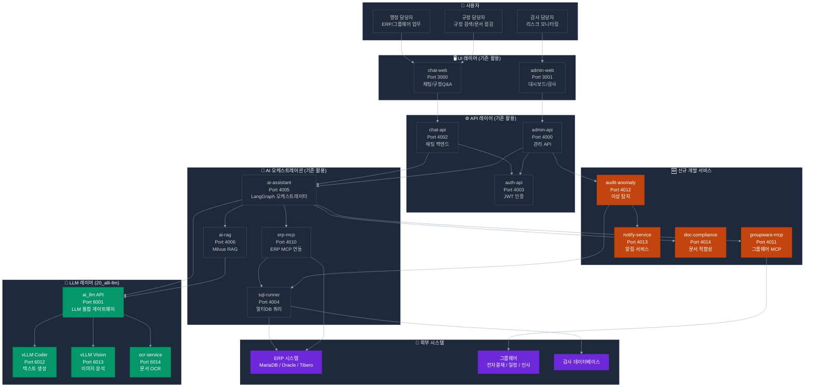
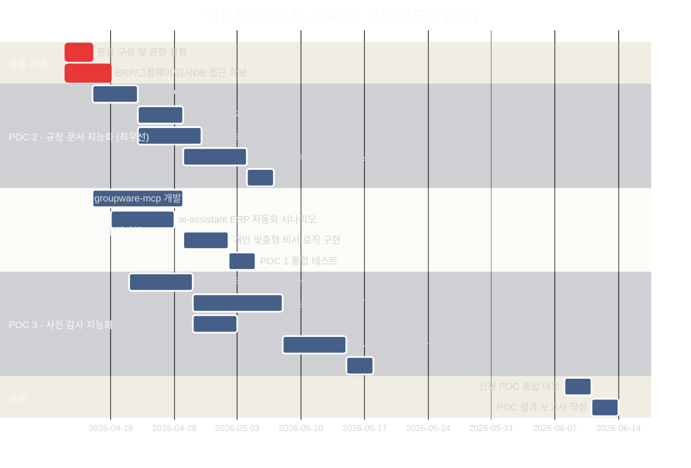

# 행정정보시스템 AI POC — 전체 아키텍처 및 로드맵

> **기준일**: 2026-04-21
> **분석 대상**: projects/10_alli-work, projects/20_alli-llm
> **POC 목표**: 3개 분야(ERP 자동화, 규정 지능화, 감사 지능화) 내부망 구축

> **📌 POC 구성 요약**
>
> - **신규 서비스 2개**: groupware-mcp (:4011), audit-anomaly (:4012)
> - **기존 확장 2개**:
>   - 알림 모듈 → `admin-api/src/module/notify/` ([설계서](design/notify-service.md))
>   - 문서 적합성 점검 → `ai-assistant/src/graph/graphs/compliance_graph.py` ([설계서](design/doc-compliance.md))
> - **기존 9개 서비스 활용**: auth-api, admin-api, admin-web, chat-api, chat-web, ai-assistant, ai-rag, erp-mcp, sql-runner
> - **20_alli-llm 인프라 활용**: ai_llm (:6001), vLLM Coder/Vision, ocr-service, Redis

---

## 1. POC 구현 가능성 종합 평가

| 분야 | 기존 서비스 활용도 | 구현 가능성 | 난이도 | 예상 기간 |
|------|:----------------:|:---------:|:----:|:-------:|
| ERP & 그룹웨어 이지화 | ██████▓░ 70% | **높음** | 중 | 3~4주 |
| 규정·문서 지능화 | ████████░ 85% | **매우 높음** | 하 | 2~3주 |
| 사전 감사 지능화 | █████░░░ 50% | **중** | 상 | 5~6주 |

### 핵심 판단 근거

- **기존 erp-mcp 서비스**: MCP 프로토콜 기반 ERP 데이터 연동 이미 구현 → ERP 자동화 POC의 핵심 기반
- **기존 ai-rag 서비스**: Milvus 벡터 DB + RAG 파이프라인 완비 → 규정 Q&A POC 즉시 적용 가능
- **기존 ai_llm 서비스**: vLLM 기반 온프레미스 LLM 운영 중 → 내부망 제약 없이 AI 추론 가능
- **갭**: 그룹웨어 MCP 연동, 이상 탐지 ML 서비스는 신규 개발 필요

---

## 2. 기존 서비스 현황 및 POC 활용 매핑

### 2.1 10_alli-work 서비스

| 서비스 | 기술 | 포트 | POC 1 (ERP) | POC 2 (규정) | POC 3 (감사) |
|--------|------|:---:|:-----------:|:-----------:|:-----------:|
| auth-api | NestJS + TypeORM | 4003 | ✅ 인증 | ✅ 인증 | ✅ 인증 |
| admin-api | NestJS + TypeORM | 4000 | ✅ 설정 관리 | ✅ 문서 관리 | ✅ 리스크 API |
| admin-web | Next.js 15 | 3001 | ✅ 비서 대시보드 | ✅ 문서 업로드 UI | ✅ 감사 대시보드 |
| chat-api | NestJS | 4002 | ✅ 챗봇 백엔드 | ✅ 규정 Q&A 백엔드 | — |
| chat-web | Next.js 15 | 3000 | ✅ 업무 챗봇 UI | ✅ 규정 Q&A UI | — |
| ai-assistant | FastAPI + LangGraph | 4005 | ✅ **핵심** 오케스트레이터 | ✅ 문서 점검 엔진 | ✅ 패턴 분석 |
| ai-rag | FastAPI + Milvus | 4006 | △ 보조 검색 | ✅ **핵심** RAG | ✅ 감사 지식 검색 |
| erp-mcp | FastAPI + MCP | 4010 | ✅ **핵심** ERP 연동 | — | ✅ ERP 데이터 조회 |
| sql-runner | FastAPI | 4004 | ✅ DB 조회 | — | ✅ **핵심** 감사 쿼리 |

### 2.2 20_alli-llm 서비스

| 서비스 | 기술 | 포트 | POC 활용 |
|--------|------|:---:|---------|
| ai_llm (FastAPI) | FastAPI + vLLM Client | 6001 | 전 분야 — 임베딩/리랭킹/생성 통합 API |
| vLLM Coder | vLLM (GPU) | 6012 | 텍스트 생성 (결재 문서 초안, Q&A 답변) |
| vLLM Vision | vLLM (GPU, Vision) | 6013 | 이미지 문서 분석 (서명, 도장 인식) |
| ocr_service | PaddleOCR | 6014 | 규정 문서 PDF/이미지 텍스트 추출 |
| Redis | Redis | 6031 | 임베딩 캐시 |

---

## 3. 전체 POC 시스템 아키텍처



---

## 4. 신규 개발 필요 서비스 상세

### 4.1 groupware-mcp (그룹웨어 MCP 연동 서비스)

| 항목 | 내용 |
|------|------|
| **목적** | 그룹웨어(전자결재, 일정, 인사) 시스템을 MCP 프로토콜로 연동 |
| **기술 스택** | FastAPI + FastMCP + LangGraph (erp-mcp 패턴 재사용) |
| **포트** | 4011 |
| **핵심 MCP 도구** | `get_approval_list`, `create_draft`, `get_schedule`, `get_hr_info`, `sync_erp_groupware` |
| **연동 대상** | 그룹웨어 REST API / DB Direct (권한 필요) |
| **개발 공수** | 2~3주 |

### 4.2 audit-anomaly (이상 탐지 서비스)

| 항목 | 내용 |
|------|------|
| **목적** | ERP/감사 데이터에서 이상 패턴 실시간 탐지 |
| **기술 스택** | FastAPI + Pandas + Scikit-learn (Isolation Forest, Z-Score) |
| **포트** | 4012 |
| **핵심 기능** | 이상 거래 탐지, 복무 부정 패턴 분석, 리스크 스코어링 |
| **데이터 소스** | sql-runner → ERP DB, 감사 DB |
| **처리 방식** | 주기적 배치 (Cron) + 결재 이벤트 트리거 |
| **개발 공수** | 3~4주 |

### 4.3 notify-service (알림 서비스)

| 항목 | 내용 |
|------|------|
| **목적** | 이상 탐지 발생 시 감사 부서 자동 알림 |
| **기술 스택** | NestJS + 이메일(SMTP) + 내부 메신저 Webhook |
| **포트** | 4013 |
| **핵심 기능** | 이메일 알림, 대시보드 실시간 알림, 알림 이력 관리 |
| **개발 공수** | 1~2주 |

### 4.4 doc-compliance (문서 적합성 점검 서비스)

| 항목 | 내용 |
|------|------|
| **목적** | 기안문/보고서의 규정 위반 여부 자동 점검 |
| **기술 스택** | FastAPI + ai-rag 연동 + LLM 기반 평가 |
| **포트** | 4014 |
| **핵심 기능** | 문서 업로드 → OCR → 규정 검색 → 위반 항목 지적 → 수정 가이드 |
| **개발 공수** | 2주 |

---

## 5. 인프라 요구사항

### 5.1 현재 인프라 (활용 가능)

| 인프라 | 사양/현황 | 용도 |
|--------|---------|------|
| **Docker Compose** | On-Premise 내부망 | 전체 서비스 컨테이너 운영 |
| **GPU 서버** (20_alli-llm) | GPU 4GB 이상 권장 | vLLM 모델 추론 |
| **Redis** | 기존 운영 중 | 임베딩 캐시, 세션 |
| **Milvus 2.5** | 기존 운영 중 | 벡터 DB (규정 문서) |
| **PostgreSQL** | auth-api 사용 중 | 사용자/테넌트 관리 |
| **Nginx** | Port 8080 프록시 | 서비스 라우팅 |

### 5.2 추가 필요 인프라

| 항목 | 스펙 | 용도 | 우선순위 |
|------|------|------|:-------:|
| **그룹웨어 API 접근 권한** | 그룹웨어 시스템 REST API 키/DB 계정 | groupware-mcp 연동 | P0 |
| **ERP DB 읽기 권한** | MariaDB/Oracle/Tibero Read-Only 계정 | sql-runner ERP 쿼리 | P0 |
| **감사 DB 접근 권한** | 감사 전용 DB Read-Only 계정 | audit-anomaly 데이터 수집 | P0 |
| **SMTP 서버** | 내부망 메일 서버 설정 | notify-service 이메일 알림 | P1 |
| **Milvus 스토리지 증설** | 규정 문서 벡터 저장 | 규정 지식 베이스 구축 | P1 |
| **PostgreSQL 증설** (audit) | 감사 이력/리스크 스코어 저장 | audit-anomaly 결과 저장 | P1 |
| **배치 처리 스케줄러** | Cron 또는 Airflow | 정기 감사 데이터 분석 | P2 |
| **GPU VRAM** | 최소 8GB (Vision 모델 추가 시) | vLLM Vision 모델 | P2 |

### 5.3 네트워크 요구사항

```
내부망 구성:
┌─────────────────────────────────────────────────────┐
│                   내부망 (Intranet)                   │
│                                                     │
│  [AI POC 서버]           [업무 시스템]                │
│  10_alli-work ←────────→ ERP 시스템                  │
│  20_alli-llm  ←────────→ 그룹웨어                    │
│                ←────────→ 감사 DB                    │
│                                                     │
│  ※ 외부 인터넷 차단 (내부망 LLM 운영)                  │
└─────────────────────────────────────────────────────┘
```

---

## 6. 기능 명세 요약

### 6.1 ERP & 그룹웨어 이지화

| 기능 ID | 기능명 | 구현 방식 | 기존/신규 |
|---------|-------|---------|:-------:|
| ERP-01 | 전자결재 자동 기안 | AI 에이전트 → 그룹웨어 MCP | 신규 (groupware-mcp) |
| ERP-02 | 결재 경로 자동 추천 | LangGraph + 과거 결재 패턴 분석 | 신규 시나리오 |
| ERP-03 | ERP-그룹웨어 데이터 동기화 | erp-mcp ↔ groupware-mcp | 부분 신규 |
| ERP-04 | 개인 맞춤형 업무 리마인드 | ai-assistant + 일정/ERP 데이터 | 신규 시나리오 |
| ERP-05 | 챗봇 결재 인터페이스 | chat-web/api (기존) | 기존 활용 |

### 6.2 규정·문서 지능화

| 기능 ID | 기능명 | 구현 방식 | 기존/신규 |
|---------|-------|---------|:-------:|
| DOC-01 | 규정 문서 업로드 및 임베딩 | ai-rag (기존) + OCR | 기존 활용 |
| DOC-02 | 자연어 규정 Q&A | chat-web → chat-api → ai-rag | 기존 활용 |
| DOC-03 | 규정 근거 조항 표시 | ai-rag RAG 결과 포맷팅 | 기존 확장 |
| DOC-04 | 문서 적합성 자동 점검 | doc-compliance 서비스 | **신규** |
| DOC-05 | 과거 Q&A 지식 베이스 | ai-rag 지속 학습 | 기존 확장 |
| DOC-06 | 규정 문서 관리 UI | admin-web (기존) | 기존 확장 |

### 6.3 사전 감사 지능화

| 기능 ID | 기능명 | 구현 방식 | 기존/신규 |
|---------|-------|---------|:-------:|
| AUD-01 | 이상 결재 패턴 탐지 | audit-anomaly (Isolation Forest) | **신규** |
| AUD-02 | 중복/쪼개기 지급 탐지 | sql-runner + 통계 분석 | **신규** |
| AUD-03 | 출장-법인카드 불일치 탐지 | audit-anomaly + ERP 조회 | **신규** |
| AUD-04 | 근태 이상 패턴 분석 | audit-anomaly 배치 처리 | **신규** |
| AUD-05 | 감사 리스크 대시보드 | admin-web (기존) 확장 | 기존 확장 |
| AUD-06 | 자동 알림 시스템 | notify-service (신규) | **신규** |

---

## 7. 전체 구현 로드맵



### 로드맵 요약

| 주차 | 주요 작업 | 마일스톤 |
|:----:|---------|---------|
| **1주** | 환경 구성, 접근 권한 확보, 규정 문서 수집 | 기반 환경 완료 |
| **2주** | 규정 지식베이스 구축, groupware-mcp 개발 시작 | POC 2 RAG 동작 확인 |
| **3주** | 규정 Q&A UI 연동, doc-compliance 개발 | POC 2 기능 완성 |
| **4주** | POC 1 ERP 자동화, 감사 데이터 수집 | POC 1 기능 완성 |
| **5~6주** | 이상 탐지 ML 모델 개발, notify-service | POC 3 핵심 기능 |
| **7주** | 감사 대시보드, 전체 통합 테스트 | POC 3 완성 |
| **8주** | 통합 데모, 결과 보고서 | **POC 최종 완료** |

---

## 8. 리스크 및 대응 방안

| 리스크 | 영향도 | 대응 방안 |
|--------|:-----:|---------|
| 그룹웨어 API 미공개 / 접근 거부 | 높음 | DB Direct 접근 또는 그룹웨어 담당자 협의 필요 |
| ERP/감사 DB 읽기 권한 지연 | 높음 | 샘플 데이터로 먼저 개발, 권한 확보 후 연동 |
| GPU 서버 VRAM 부족 | 중간 | Vision 모델 지연 로딩, CPU Fallback 옵션 준비 |
| 이상 탐지 오탐율 초과 | 중간 | 임계값 보수적 설정, 사람 검토 단계 추가 |
| LLM 한국어 규정 이해 정확도 | 중간 | RAG 기반 사실 검증 추가, Few-shot 프롬프트 최적화 |

---

## 9. 참조 문서

| 문서 | 경로 |
|------|------|
| POC PRD 원문 | `poc/prd.md` |
| ERP & 그룹웨어 이지화 상세 | `poc/01-erp-groupware-ai.md` |
| 규정·문서 지능화 상세 | `poc/02-regulation-document-intelligence.md` |
| 사전 감사 지능화 상세 | `poc/03-audit-intelligence.md` |
