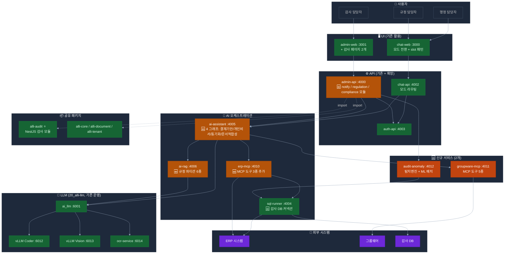
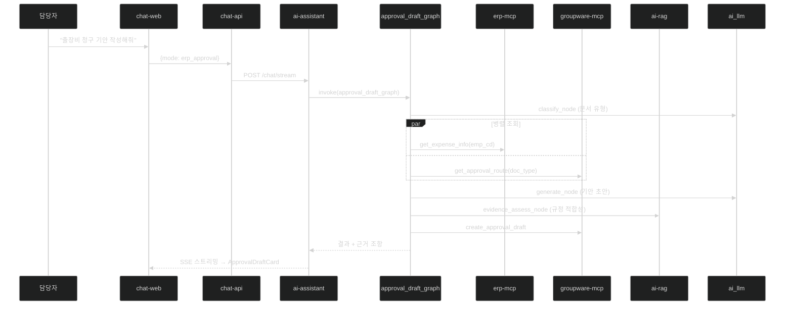
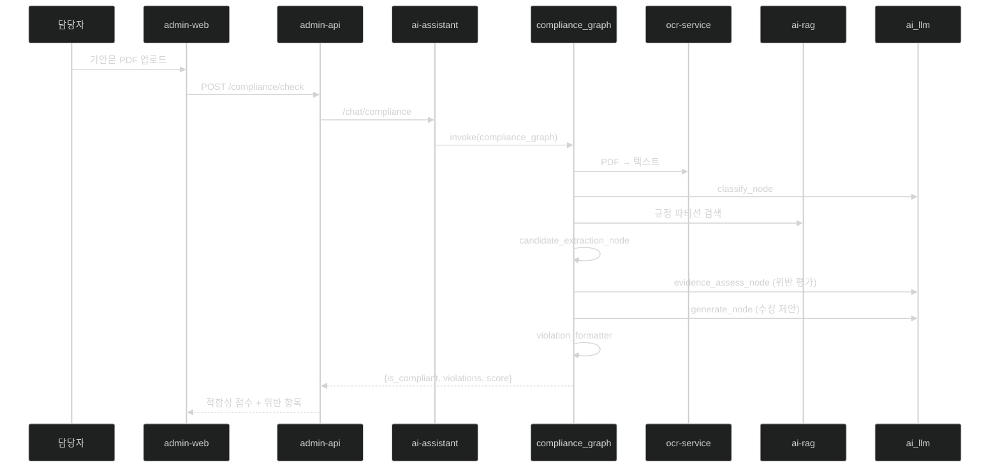
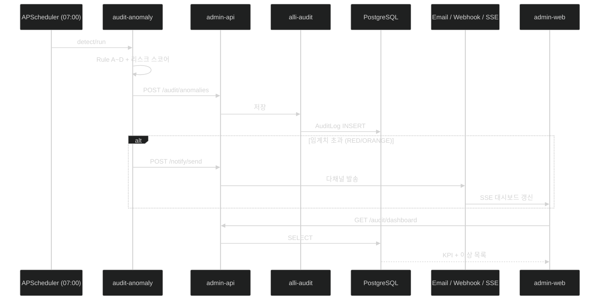

# 행정정보시스템 AI POC — 전체 아키텍처

> **기준일**: 2026-04-22 | **시나리오**: B (단계형 구현, 권장)
> **설계 원칙**: 기존 자산 최대 활용(재사용률 85%) → 신규 서비스 최소화 → 유지보수성 우선

---

## 1. POC 구성 요약

| 항목 | 값 |
|------|---|
| 구현 범위 | 6과제 (1·3·4·5·6·7·9) + 3과제 2단계(2·8 + 감사 고도화) |
| 신규 서비스 | **2개** — `groupware-mcp` (:4011), `audit-anomaly` (:4012) |
| 확장 서비스 | admin-api(+알림/규정/적합성 모듈), ai-assistant(+4 그래프), ai-rag(+규정 파티션), erp-mcp(+도구 3종) |
| 기존 활용 | 9개 서비스 + 20_alli-llm 인프라 |
| 재사용률 | **85%** |

### 신규 대비 통합 (BEFORE → AFTER)

| 원안 서비스 | 결정 | 대체 구현 |
|-----------|:---:|---------|
| groupware-mcp (:4011) | ✅ 유지 | erp-mcp 복제 패턴 |
| audit-anomaly (:4012) | ✅ 유지 | FastAPI + Scikit-learn |
| ~~notify-service (:4013)~~ | 🔄 통합 | `admin-api/src/module/notify/` (SMTP + Webhook + SSE) |
| ~~doc-compliance (:4014)~~ | 🔄 통합 | `ai-assistant/src/graph/graphs/compliance_graph.py` |

통합 근거: notify는 단순 발송 로직(도메인 독립성 낮음)으로 NestJS 모듈이면 충분. doc-compliance는 ai-assistant의 `evidence_assess_node`·`candidate_extraction_node`를 이미 재사용 가능.

---

## 2. 전체 시스템 아키텍처



---

## 3. 서비스별 활용 매핑

### 3.1 10_alli-work 서비스

| 서비스 | 기술 | 포트 | POC 1 (ERP) | POC 2 (규정) | POC 3 (감사) | 개발 유형 |
|--------|------|:---:|:-----------:|:-----------:|:-----------:|:--------:|
| auth-api | NestJS 11 + TypeORM | 4003 | ✅ | ✅ | ✅ | 재사용 |
| admin-api | NestJS 11 + TypeORM | 4000 | ✅ | ✅ (규정/적합성) | ✅ (감사/알림) | 🆕 확장 |
| admin-web | Next.js 15 | 3001 | ✅ | ✅ (문서 업로드) | ✅ (감사 대시보드) | 🆕 확장 |
| chat-api | NestJS 11 | 4002 | ✅ | ✅ | — | 🆕 모드 라우팅 |
| chat-web | Next.js 15 | 3000 | ✅ | ✅ | — | 🆕 slot 확장 |
| ai-assistant | FastAPI + LangGraph | 4005 | ✅ **핵심** | ✅ 적합성 그래프 | ✅ 패턴 설명 | 🆕 4 그래프 |
| ai-rag | FastAPI + Milvus | 4006 | △ | ✅ **핵심** | ✅ | 🆕 파티션 |
| erp-mcp | FastAPI + FastMCP | 4010 | ✅ **핵심** | — | ✅ | 🆕 도구 3종 |
| sql-runner | FastAPI | 4004 | ✅ | — | ✅ **핵심** | 🆕 감사 DB |

### 3.2 20_alli-llm 서비스 (전량 기존 활용)

| 서비스 | 포트 | 용도 |
|--------|:---:|------|
| ai_llm (FastAPI) | 6001 | 임베딩/리랭킹/생성 통합 게이트웨이 |
| vLLM Coder | 6012 | 텍스트 생성 (결재 초안, Q&A) |
| vLLM Vision | 6013 | 이미지/PDF 분석 (서명·도장) |
| ocr-service (PaddleOCR) | 6014 | 규정 PDF/이미지 텍스트 추출 |
| Redis | 6031 | 임베딩 캐시 |

LLM 모델: **Gemma 4 31B-it** (생성), **Gemma 4 E4B** (Vision), **KURE-v1** (임베딩) — 전량 Apache 2.0

---

## 4. 신규 서비스 상세

### 4.1 groupware-mcp (:4011)

| 항목 | 내용 |
|------|------|
| 목적 | 그룹웨어(전자결재·일정·인사) MCP 연동 |
| 기술 스택 | FastAPI + FastMCP + LangGraph (erp-mcp 패턴 복제) |
| 핵심 MCP 도구 | `get_approval_list`, `create_draft`, `get_schedule`, `get_hr_info`, `sync_erp_groupware` |
| 연동 방식 | REST API (권장) / DB Direct (대안) |
| 공수 | **2주** (erp-mcp 복제로 1주 절감) |

디렉토리 구조: `apps/groupware-mcp/src/{main.py, mcp/, security/, clients/groupware_client.py, tools/{approval,schedule,hr,sync,notify}_tools.py}`

### 4.2 audit-anomaly (:4012)

| 항목 | 내용 |
|------|------|
| 목적 | ERP/감사 데이터 이상 패턴 탐지 |
| 기술 스택 | FastAPI + Pandas + Scikit-learn + APScheduler |
| 탐지 규칙 | 중복·쪼개기 지급(Rule A/B), Z-Score(Rule C), Isolation Forest(Rule D), 출장-카드 불일치, 초과근무 이상 |
| 데이터 저장 | **admin-api/alli-audit로 POST** → PostgreSQL |
| 배치 주기 | APScheduler 매일 07:00 |
| 공수 | **4주** (alli-audit 재사용으로 1주 절감) |

---

## 5. 주요 확장 설계

### 5.1 admin-api 모듈 확장 (notify-service 대체)

```
apps/admin-api/src/module/
├── audit/          🆕 감사 결과 관리 (alli-audit 활용)
├── notify/         🆕 알림 (SMTP + Webhook + SSE — notify-service 대체)
├── regulation/     🆕 규정 문서 관리 (ai-rag 호출)
└── compliance/     🆕 문서 적합성 점검 프록시 (ai-assistant 호출)
```

환경변수 추가: `SMTP_HOST`, `SMTP_PORT`, `SMTP_USER`, `SMTP_PASS`, `GROUPWARE_WEBHOOK_URL`
공수: **7.5일** (원안 notify-service 20일 대비 -12일)

### 5.2 ai-assistant 그래프 확장 (doc-compliance 대체)

```
apps/ai-assistant/src/graph/graphs/
├── approval_draft_graph.py        — 과제 1 (classify → fetch → plan → generate → validate → register)
├── personal_assistant_graph.py    — 과제 3 (parallel_fetch → priority → guide)
├── sync_graph.py                  — 과제 2 (2단계, fetch_erp → fetch_gw → diff → sync → log)
└── compliance_graph.py            — 과제 5 ⭐ (ocr → classify → fetch_regulations → candidate_extraction → evidence_assess → violation_formatter)
```

재사용 노드: `classify_node`, `fetch_node`, `candidate_extraction_node`, `evidence_assess_node`, `generate_node` (17 노드 중)
공수: **11일** (원안 doc-compliance 별도 구축 16일 대비 -5일)

### 5.3 ai-rag 규정 파티션

```
configs/partitions.yaml:
├── regulation_hr        — 인사/복무
├── regulation_finance   — 회계/예산
├── regulation_general   — 일반 행정
├── regulation_forms     — 서식
└── qa_history           — Q&A 이력
```

청킹 전략: 조(Article) 단위 정규식 `r'제\s*(\d+)\s*조'`
공수: **5일** (기존 upload_router 재사용)

### 5.4 erp-mcp / admin-web / chat-web

| 서비스 | 추가 내용 | 공수 |
|--------|---------|:---:|
| erp-mcp | MCP 도구 3종: `get_deadline_tasks`, `get_expense_info`, `get_pending_items` | 3일 |
| admin-web | 신규 페이지 2개: `audit/risk-score`, `audit/alerts` / 기존 페이지 확장 | 9.5일 |
| chat-web | slot 3종: `ApprovalDraftCard`, `RegulationCitationPanel`, `PersonalTaskCard` + `ModeSelector` | 6.5일 |

---

## 6. 기능 명세 (9과제 매핑)

| ID | 과제 | POC 분야 | 1/2단계 | 주 서비스 |
|:--:|------|---------|:------:|---------|
| 1 | 전자결재 자동 기안 | POC 1 | **1** | ai-assistant + groupware-mcp + erp-mcp |
| 2 | ERP-그룹웨어 동기화 | POC 1 | 2 | ai-assistant sync_graph + 양방향 MCP |
| 3 | 개인 맞춤형 비서 | POC 1 | **1** | ai-assistant personal_assistant_graph |
| 4 | 규정 Q&A 서비스 | POC 2 | **1** | ai-rag + chat-api |
| 5 | 문서 적합성 점검 | POC 2 | **1** | ai-assistant compliance_graph + admin-api |
| 6 | 지식 베이스 구축 | POC 2 | **1** | ai-rag 파티션 + admin-api regulation 모듈 |
| 7 | 지능형 회계 감사 | POC 3 | **1** | audit-anomaly + sql-runner |
| 8 | 복무 관리 모니터링 | POC 3 | 2 | audit-anomaly 확장 |
| 9 | 사전 알림 + 대시보드 | POC 3 | **1** | admin-api notify + admin-web 감사 |

---

## 7. Docker Compose 구성 차이

신규 추가 블록:

```yaml
services:
  groupware-mcp:
    build: ./apps/groupware-mcp
    environment:
      - GROUPWARE_API_URL=${GROUPWARE_API_URL}
      - JWT_PUBLIC_KEY=${JWT_PUBLIC_KEY}
      - AUTH_API_URL=http://auth-api:4003
    ports: ["4011:4011"]
    depends_on: [auth-api, sql-runner]

  audit-anomaly:
    build: ./apps/audit-anomaly
    environment:
      - SQL_RUNNER_URL=http://sql-runner:4004
      - ADMIN_API_URL=http://admin-api:4000
      - AI_ASSISTANT_URL=http://ai-assistant:4005
    ports: ["4012:4012"]
    depends_on: [sql-runner, admin-api]

  admin-api:
    environment:
      - SMTP_HOST=${SMTP_HOST}
      - SMTP_PORT=${SMTP_PORT}
      - SMTP_USER=${SMTP_USER}
      - SMTP_PASS=${SMTP_PASS}
      - GROUPWARE_WEBHOOK_URL=${GROUPWARE_WEBHOOK_URL}
```

컨테이너 증가: **+2개** (기존 15개 → 13개, 원안 대비 -13%)

---

## 8. 핵심 데이터 흐름

### 8.1 과제 1 — 전자결재 자동 기안



### 8.2 과제 5 — 문서 적합성 점검



### 8.3 과제 9 — 알림·대시보드



---

## 9. 참조

- [02-project-plan.md](02-project-plan.md) — 13주 실행 계획
- [03-budget.md](03-budget.md) — 예산 구성
- [04-prerequisites.md](04-prerequisites.md) — 사전 요건 + 감사 데이터 요건
- [services/new/](services/new/) — 신규 서비스 설계서
- [services/improvements/](services/improvements/) — 기존 서비스 개선 내역
- [challenges/](challenges/) — 9개 과제 상세 스펙
