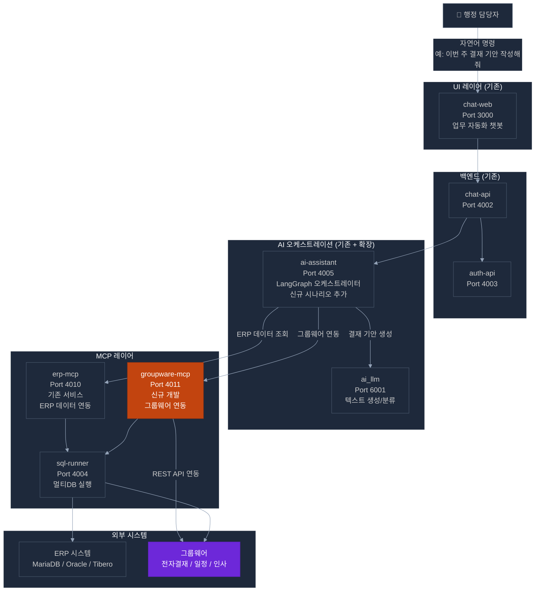
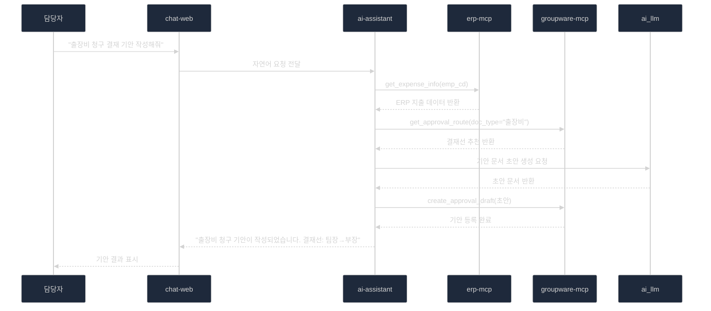
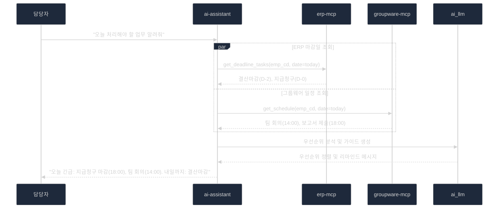

# POC 1 — ERP & 그룹웨어 이지화 (AI 자동화)

> **구현 가능성**: 높음 (기존 서비스 70% 활용)  
> **예상 개발 기간**: 3~4주  
> **핵심 기반**: erp-mcp (기존) + groupware-mcp (신규)

---

## 1. 개요 및 목표

MCP(Model Context Protocol) 툴을 활용하여 ERP와 그룹웨어 시스템 간 데이터를 AI가 연결하고, 반복적인 행정 업무(전자결재, 일정 관리, 데이터 동기화)를 AI 에이전트가 자동화

### 3대 핵심 기능

| 기능 | 설명 | 구현 방식 |
|------|------|---------|
| **지능형 워크플로우** | 전자결재 자동 기안 및 경로 추천 | ai-assistant + groupware-mcp |
| **MCP 기반 데이터 연동** | ERP-그룹웨어 실시간 데이터 동기화 | erp-mcp ↔ groupware-mcp |
| **개인 맞춤형 비서** | 일정·마감일 우선순위 가이드 | ai-assistant + 통합 데이터 조회 |

---

## 2. 기존 서비스 활용 분석

### 2.1 erp-mcp (핵심 활용 — 기존 서비스)

```
위치: projects/10_alli-work/apps/erp-mcp
포트: 4010
기술: FastAPI + LangGraph + FastMCP + JWT(ES256)

현재 구현된 MCP 도구:
  - ERP DB 데이터 조회 (sql-runner 경유)
  - LangGraph 기반 자연어 → SQL 생성
  - ai-assistant 전용 내부 라우터 (JWT 없이 내부 호출)

POC 활용 방안:
  ✅ ERP 회계 데이터 조회 (지출, 결산, 청구)
  ✅ ERP 마감일 정보 조회 (개인 비서 기능)
  ✅ ai-assistant와의 MCP 연동 패턴 재사용
  ❌ 그룹웨어 데이터 연동 불가 → groupware-mcp 신규 개발 필요
```

### 2.2 ai-assistant (핵심 활용 — 기존 서비스)

```
위치: projects/10_alli-work/apps/ai-assistant
포트: 4005
기술: FastAPI + LangGraph (멀티 에이전트)

POC 활용 방안:
  ✅ ERP/그룹웨어 데이터 통합 조회 오케스트레이션
  ✅ 전자결재 기안 생성 시나리오 (LangGraph 노드 추가)
  ✅ 개인 맞춤형 우선순위 분석 (기존 병렬 조회 패턴 재사용)
  → 신규 LangGraph 시나리오 추가만으로 구현 가능
```

### 2.3 chat-web / chat-api (UI 활용 — 기존 서비스)

```
현재: 범용 채팅 인터페이스
POC 활용: 업무 자동화 챗봇 인터페이스로 재활용
  ✅ "결재 기안 작성해줘" 자연어 명령 처리
  ✅ "이번 주 업무 우선순위 알려줘" 비서 기능
```

---

## 3. 신규 개발: groupware-mcp

### 3.1 서비스 설계

```
서비스명: groupware-mcp
포트: 4011
기술: FastAPI + FastMCP + LangGraph (erp-mcp 구조 재사용)
의존성: 그룹웨어 API 또는 그룹웨어 DB Direct 접근

erp-mcp 패턴 재사용으로 개발 효율 최대화:
  - MCP HTTP 라우터 구조 동일
  - JWT 인증 패턴 동일 (ES256 ERP JWT)
  - LangGraph 그래프 구조 동일
  - sql-runner 연동 패턴 재사용
```

### 3.2 MCP 도구 명세

| 도구명 | 설명 | 입력 | 출력 |
|--------|------|------|------|
| `get_approval_list` | 결재 대기 목록 조회 | emp_cd, status | 결재 목록 |
| `get_approval_detail` | 결재 문서 상세 조회 | doc_id | 문서 내용, 결재선 |
| `create_approval_draft` | 결재 기안 초안 생성 | 업무 유형, 내용 | 기안 문서 초안 |
| `get_approval_route` | 결재 경로 조회/추천 | doc_type, dept_cd | 추천 결재선 |
| `get_schedule` | 개인/팀 일정 조회 | emp_cd, date_range | 일정 목록 |
| `create_schedule` | 일정 등록 | 제목, 날짜, 참석자 | 등록 결과 |
| `get_hr_info` | 인사 정보 조회 | emp_cd | 소속, 직급, 담당업무 |
| `sync_erp_to_groupware` | ERP→그룹웨어 데이터 동기화 | 동기화 유형 | 동기화 결과 |

---

## 4. 시스템 아키텍처



### 4.1 전자결재 자동 기안 흐름



### 4.2 개인 맞춤형 비서 흐름



---

## 5. 기능 명세

### 5.1 ERP-01: 전자결재 자동 기안

| 항목 | 내용 |
|------|------|
| **기능** | 자연어 명령으로 전자결재 기안 문서 자동 생성 |
| **입력** | 사용자 자연어 + ERP 개인 데이터 |
| **처리** | LLM 기안 초안 생성 → groupware-mcp로 그룹웨어 등록 |
| **출력** | 기안 문서 URL + 결재선 안내 |
| **구현 서비스** | ai-assistant (시나리오 추가) + groupware-mcp (신규) |

### 5.2 ERP-02: 결재 경로 자동 추천

| 항목 | 내용 |
|------|------|
| **기능** | 문서 유형·부서·금액 기준으로 최적 결재 경로 추천 |
| **입력** | 문서 유형, 금액, 부서 정보 |
| **처리** | 과거 결재 패턴 분석 + 규정 기반 경로 검증 |
| **출력** | 추천 결재선 (1순위 + 대안) |
| **구현 서비스** | groupware-mcp + ai-rag (규정 검색) |

### 5.3 ERP-03: ERP-그룹웨어 데이터 동기화

| 항목 | 내용 |
|------|------|
| **기능** | ERP의 지급/결산 데이터를 그룹웨어와 실시간 동기화 |
| **입력** | 동기화 이벤트 (ERP 데이터 변경) |
| **처리** | erp-mcp로 ERP 조회 → groupware-mcp로 그룹웨어 업데이트 |
| **출력** | 동기화 완료 + 중복 입력 제거 |
| **구현 서비스** | erp-mcp (기존) ↔ groupware-mcp (신규) |

### 5.4 ERP-04: 개인 맞춤형 업무 리마인드

| 항목 | 내용 |
|------|------|
| **기능** | ERP 마감일 + 그룹웨어 일정을 통합 분석하여 우선순위 가이드 |
| **입력** | 사용자 ID (emp_cd) |
| **처리** | 병렬 데이터 조회 → LLM 우선순위 분석 → 맞춤형 가이드 생성 |
| **출력** | 오늘의 업무 리스트 (우선순위 순) + 주요 마감일 알림 |
| **구현 서비스** | ai-assistant + erp-mcp + groupware-mcp + ai_llm |

---

## 6. 구현 계획

### 6.1 단계별 개발 계획

```
Phase 1 (1주): 기반 준비
  □ 그룹웨어 API 문서 확보 / DB 접근 권한 확보
  □ groupware-mcp 프로젝트 초기화 (erp-mcp 구조 복제)
  □ 그룹웨어 연결 테스트 (기본 API 호출 확인)

Phase 2 (2~3주): groupware-mcp 개발
  □ MCP 도구 8종 구현 (get_approval_list, create_draft 등)
  □ ai-assistant ↔ groupware-mcp 연동 테스트
  □ 전자결재 자동 기안 시나리오 LangGraph 노드 추가

Phase 3 (3~4주): 통합 및 테스트
  □ ERP-그룹웨어 데이터 동기화 기능 구현
  □ 개인 맞춤형 비서 시나리오 구현
  □ chat-web UI 챗봇 연동 테스트
  □ 실제 사용자 시나리오 POC 데모
```

### 6.2 개발 공수 산정

| 작업 | 공수 |
|------|------|
| groupware-mcp 초기화 (erp-mcp 복제) | 0.5일 |
| 그룹웨어 API 연동 클라이언트 | 3일 |
| MCP 도구 8종 구현 | 5일 |
| ai-assistant 시나리오 추가 (4종) | 4일 |
| chat-web UI 연동 | 1일 |
| 통합 테스트 | 2일 |
| **합계** | **약 15~16일 (3주)** |

---

## 7. 기술적 고려사항

### 7.1 그룹웨어 연동 방식 선택

| 방식 | 장점 | 단점 | 권장 |
|------|------|------|:---:|
| **REST API 연동** | 공식 방식, 안정적 | API 문서/권한 필요 | ✅ 1순위 |
| **DB Direct** | 즉시 적용 가능 | 변경 취약, 비공식 | △ 2순위 |
| **파일 연동** | 가장 단순 | 실시간 불가 | ❌ 미권장 |

### 7.2 LLM 기안 문서 생성 품질 확보

```python
# 기안 문서 생성 프롬프트 전략
system_prompt = """
당신은 행정 기안 문서 작성 전문가입니다.
다음 내용을 바탕으로 행정기관 표준 양식에 맞는 기안 문서를 작성하세요.

[규정]
{regulation_context}  ← ai-rag에서 검색한 관련 규정

[ERP 데이터]
{erp_data}  ← erp-mcp에서 조회한 실제 데이터

[양식 요구사항]
- 제목: 명확하고 간결하게
- 경위: 업무 배경 설명
- 내용: 핵심 사항 명시
- 결재 요청 사항: 구체적 수치/일정 포함
"""
```

---

## 8. POC 성공 기준

| 지표 | 목표값 | 측정 방법 |
|------|:------:|---------|
| MCP 도구 호출 성공률 | ≥ 95% | API 응답 코드 |
| 결재 기안 자동 생성 정확도 | ≥ 80% | 사용자 평가 |
| ERP-그룹웨어 동기화 지연 | ≤ 5초 | 응답 시간 측정 |
| 개인 비서 만족도 | ≥ 4/5점 | 사용자 설문 |
