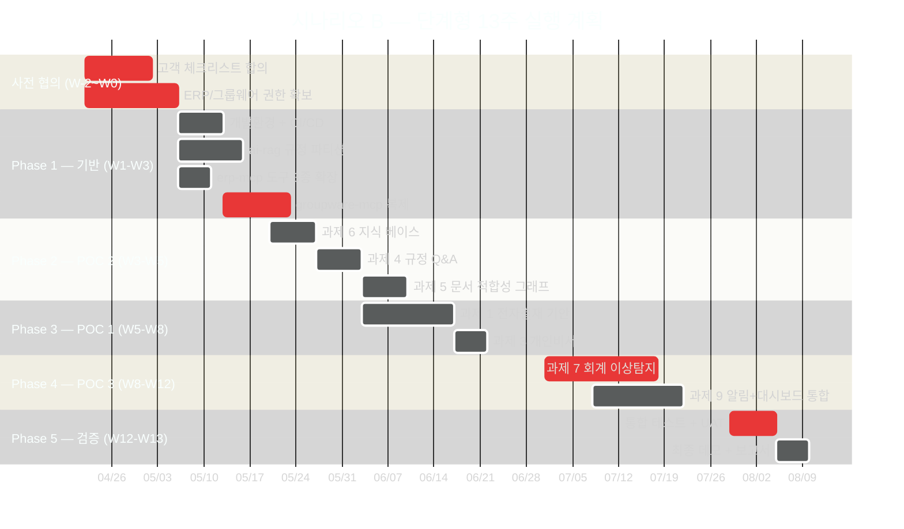

# POC 프로젝트 실행 계획 (시나리오 B — 권장)

> **기간**: 13주 (약 3.25개월) | **인력**: 2인 (D1·D2) + 파트타임 PM
> **예산**: 약 2억 900만원 (VAT 포함) — 상세 [03-budget.md](03-budget.md)
> **범위**: 6과제 우선 구현 + 3과제 2단계(2·8 + 회계 감사 고도화)

---

## 1. 팀 구성

| # | 역할 | 등급 | 투입 | 주요 담당 |
|:-:|------|:---:|:---:|---------|
| 1 | PM (파트타임 50%) | 시니어 | 3.25개월 | 일정·품질·고객 협의 |
| 2 | D1 — AI/백엔드 | 상급 (5년+) | 풀타임 | Python/LangGraph/ML/MCP, ai-assistant·ai-rag·audit-anomaly·groupware-mcp |
| 3 | D2 — 풀스택 | 상급 (5년+) | 풀타임 | NestJS/Next.js/Docker, admin-api·admin-web·chat-web·CI/CD |

### 역할별 기술 요건

| 역할 | 필수 스택 | 우대 경험 |
|------|---------|---------|
| D1 | Python, FastAPI, LangGraph, Milvus, Scikit-learn, FastMCP | 한국어 NLP, RAGAS 평가, MCP 프로토콜, 이상 탐지 ML |
| D2 | NestJS 11, Next.js 15, TypeORM, Docker Compose, ts-rest, TanStack Query | SSE, WCAG 접근성, PostgreSQL, CI/CD |

---

## 2. 13주 일정 (Gantt)

---

## 3. Phase별 상세 계획

### Phase 0 — 사전 협의 (W-2 ~ W0, 2주)

| 작업 | 담당 | 완료 기준 |
|------|------|---------|
| 고객 체크리스트 44개 항목 합의 | PM | 전 항목 답변 확보 |
| ERP DB Read-Only 계정 발급 신청 | PM + 고객사 | 계정 발급 또는 Mock 전환 결정 |
| 그룹웨어 API 키 발급 또는 Mock 결정 | PM + 고객사 | 연동 방식 확정 |
| 감사 DB 접근 권한 협의 | PM + 고객사 | 샘플 데이터 10,000건+ 확보 |
| 규정 문서 10종 수집 요청 | PM + 고객사 | PDF 목록 확정 |
| GPU 서버 준비 (기관 보유 또는 임대) | PM + DevOps | A40 48GB+ 확보 |

### Phase 1 — 기반 구축 (W1 ~ W3, 3주)

| 역할 | 작업 | 산출물 |
|------|------|-------|
| D2 | Docker Compose + CI/CD 파이프라인 + STG 환경 | 서비스 로컬 기동, STG 가동 |
| D1 | ai-rag 규정 청킹(조 단위) + 파티션 6종 + 규정 10종 업로드 | 인덱싱 완료, Q&A 기본 동작 |
| D1 | erp-mcp 도구 3종 (`get_deadline_tasks`, `get_expense_info`, `get_pending_items`) | 도구 동작 확인 |
| D1 | groupware-mcp 복제 (erp-mcp 패턴) + 5 도구 + Mock 모드 | MCP 서버 기동 + 테스트 성공 |
| D2 | admin-api 규정 관리 API + ts-rest 계약 + TypeORM 엔티티 | API 명세 + DB 스키마 |

**완료 기준**: 규정 10종 인덱싱 / ERP MCP + 그룹웨어 MCP 동작 / chat-api 모드 라우팅 SSE

### Phase 2 — POC 2 규정·문서 지능 (W3 ~ W5, 3주)

| 과제 | 역할 | 산출물 | 비고 |
|------|------|-------|------|
| **과제 6** 지식 베이스 | D1 | 조 단위 청킹, 버전 관리, Q&A 이력 컬렉션 | 과제 4·5 전제 |
| **과제 4** 규정 Q&A | D1 + D2 | chat-web 규정 모드 + 근거조항 패널 | 즉시 효과 |
| **과제 5** 문서 적합성 | D1 + D2 | `compliance_graph` + admin-web 업로드 UI | `evidence_assess_node` 재사용 |

**완료 기준**:
- "연가 일수가 어떻게 되나요?" → 조항 번호 포함 답변 (정확도 ≥85%)
- 공문서 PDF 업로드 → 준수율 점수 + 위반 항목 (정확도 ≥75%)

### Phase 3 — POC 1 ERP 업무 자동화 (W5 ~ W8, 3주)

| 과제 | 역할 | 산출물 |
|------|------|-------|
| **과제 1** 전자결재 기안 | D1 + D2 | `approval_draft_graph` + ApprovalDraftCard + 그룹웨어 기안 등록 |
| **과제 3** 개인 맞춤 비서 | D1 + D2 | `personal_assistant_graph` (3-way 병렬) + PersonalTaskCard |

**완료 기준**:
- "출장비 청구 기안 작성해줘" → 초안 생성 + 그룹웨어 등록 (성공률 ≥80%)
- "오늘 처리할 업무 알려줘" → ERP 마감 + 그룹웨어 일정 통합 응답 (응답 ≤5초)

### Phase 4 — POC 3 감사 지능화 (W8 ~ W12, 4주)

| 과제 | 역할 | 산출물 |
|------|------|-------|
| **과제 7** 회계 이상 탐지 | D1 | audit-anomaly 탐지 규칙 4종 (A~D) + 리스크 스코어링 + APScheduler |
| **과제 9** 알림·대시보드 | D1 + D2 | admin-api notify 모듈 (SMTP + Webhook + SSE) + admin-web 감사 페이지 2개 |

**완료 기준**:
- 샘플 데이터 → 분할 지출 탐지 E2E (정밀도 ≥70%, 재현율 ≥80%)
- 이상 탐지 → AI 설명 → 대시보드 표시 → SSE 실시간 알림
- 배치 처리 ≤2시간/일 (07:00 기준)

### Phase 5 — 검증 및 발표 (W12 ~ W13, 2주)

| 작업 | 담당 | 산출물 |
|------|------|-------|
| 전체 E2E 시나리오 검증 | 전체 | 체크리스트 Pass 기록 |
| 버그 수정 + 성능 안정화 (응답 3초 이내) | D1 + D2 | 안정화 릴리스 |
| POC 데모 시나리오 3종 (POC 1/2/3) | D1 + D2 | 데모 스크립트 + 시연 영상 |
| 최종 발표 자료 + 결과 보고서 | PM | PPT + KPI 보고서 |

---

## 4. 역할별 주차 투입률 (FTE 기준)

| 역할 | W1-W2 | W3-W4 | W5-W6 | W7-W8 | W9-W10 | W11-W12 | W13 |
|------|:---:|:---:|:---:|:---:|:---:|:---:|:---:|
| PM (파트타임) | 70% | 50% | 50% | 50% | 50% | 60% | 100% |
| D1 — AI/백엔드 | 100% | 100% | 100% | 100% | 100% | 100% | 60% |
| D2 — 풀스택 | 80% | 100% | 100% | 100% | 100% | 100% | 80% |

---

## 5. 리스크 및 대응

| 리스크 | 확률 | 영향 | 대응 방안 |
|--------|:---:|:---:|---------|
| ERP DB 접근권한 지연 (4주+) | 높음 | 높음 | Mock 데이터로 Phase 1 개발, 권한 후 교체 |
| 그룹웨어 API 미제공 | 중간 | 높음 | FastMCP Mock 서버 구축, DB Direct 대안 협의 |
| GPU VRAM 부족 (vLLM OOM) | 중간 | 중간 | Q4 양자화, 배치 크기 축소 |
| 규정 문서 수집 지연 | 중간 | 중간 | 공개 규정(법령정보시스템) 대체, 핵심 5종 우선 |
| LLM 한국어 행정 품질 미달 | 중간 | 중간 | 프롬프트 반복 튜닝, Few-shot, Gemma 4 대안 |
| 감사 DB 샘플 부족 | 낮음 | 높음 | [04-prerequisites.md](04-prerequisites.md)의 합성 데이터 스펙 적용 |
| 인력 이탈 (1명) | 낮음 | 중간 | 시니어 2인 체제 — 1인 1주 커버, PM 백업 |

---

## 6. POC 성공 기준 (KPI)

### POC 1 — ERP 업무 자동화

| 지표 | 목표 | 측정 |
|------|:---:|------|
| 결재 기안 생성 성공률 | ≥80% | 10개 시나리오 |
| 기안 생성 응답 시간 | ≤10초 | E2E 측정 |
| 개인 비서 응답 정확도 | ≥70% | 담당자 평가 |
| 병렬 데이터 수집 시간 | ≤5초 | ERP+그룹웨어 동시 조회 |

### POC 2 — 규정 문서 지능

| 지표 | 목표 | 측정 |
|------|:---:|------|
| 규정 Q&A 정확도 | ≥85% | 30개 테스트 질문 |
| 조항 번호 출처 포함률 | ≥90% | 응답 분석 |
| 문서 적합성 정확도 | ≥75% | 전문가 검토 |
| 규정 검색 응답 시간 | ≤5초 | SSE 첫 토큰 |

### POC 3 — 감사 지능화

| 지표 | 목표 | 측정 |
|------|:---:|------|
| 이상 탐지 정밀도 | ≥70% | 샘플 30건 |
| 이상 탐지 재현율 | ≥80% | 알려진 패턴 검출 |
| AI 설명 이해도 | ≥80% | 감사 담당자 설문 |
| 배치 처리 시간 | ≤2h/일 | 07:00 기준 |

---

## 7. 마일스톤

| 마일스톤 | 주차 | 완료 기준 |
|---------|:---:|---------|
| M0 — 개발환경 완성 | W1 | 전체 서비스 로컬 기동 + STG 환경 |
| M1 — 기반 인프라 완성 | W3 | 규정 인덱싱 + ERP MCP + groupware MCP |
| M2 — POC 2 데모 가능 | W5 | 규정 Q&A + 문서 적합성 E2E |
| M3 — POC 1 데모 가능 | W8 | 결재 기안 + 개인 비서 E2E |
| M4 — POC 3 데모 가능 | W12 | 감사 탐지 + 대시보드 E2E |
| M5 — 최종 발표 | W13 | 전체 POC 통합 시연 + 보고서 |

---

## 8. 2단계 확장 계획 (본 사업 전환 시)

| 과제 | 추가 기간 | 추가 예산 | 전제 조건 |
|------|:-------:|:-------:|---------|
| 과제 2 — ERP-그룹웨어 동기화 | 2주 | 약 2,000만원 | 양방향 동기화 정책 합의 |
| 과제 8 — 복무 관리 모니터링 | 2.5주 | 약 2,500만원 | 법인카드 데이터 + 노조 협의 |
| 과제 7 회계 감사 고도화 | 5주 | 약 3,000만원 | 과제 7 ML 재학습, 화이트리스트 확장 |

**2단계 추가 예산 합계**: 약 7,500만원

---

## 9. 회의·보고 체계

| 회의 | 주기 | 참석자 |
|------|:---:|-------|
| 데일리 스탠드업 | 매일 09:30 | D1 + D2 + PM (15분) |
| 주간 리뷰 | 매주 금요일 | 전체 (코드 리뷰 + 기술 이슈) |
| 마일스톤 리뷰 | M0~M5 | PM + 고객 (시연 + 방향 조정) |
| 리스크 검토 | 격주 | PM + 개발팀 |

---

## 10. POC 이후 고려사항 (본 사업 전환)

1. 확장성: 멀티테넌트 + 동시 접속자 수백 명 → Kubernetes 전환 검토
2. 보안: 개인정보보호법 준수 (마스킹·접근 로그·암호화)
3. 고가용성: DB·LLM 서버 이중화
4. 그룹웨어 연동: Mock → 실제 REST API / DB Direct 전환
5. ERP 연동: 읽기 전용 → 쓰기 권한(결재 등록·기안 제출)
6. 규정 관리: 정기 개정 반영 프로세스 수립
7. LLM 고도화: POC 결과 기반 Fine-tuning 또는 모델 교체
8. 운영 조직: AI 운영팀 구성 (최소 AI 운영 1인 + 데이터 관리 1인)
