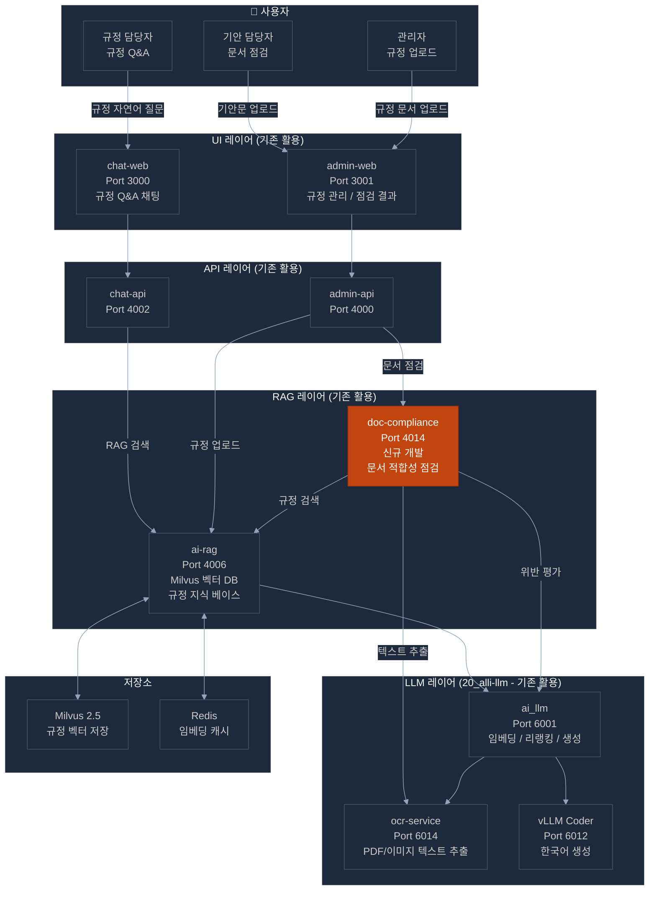
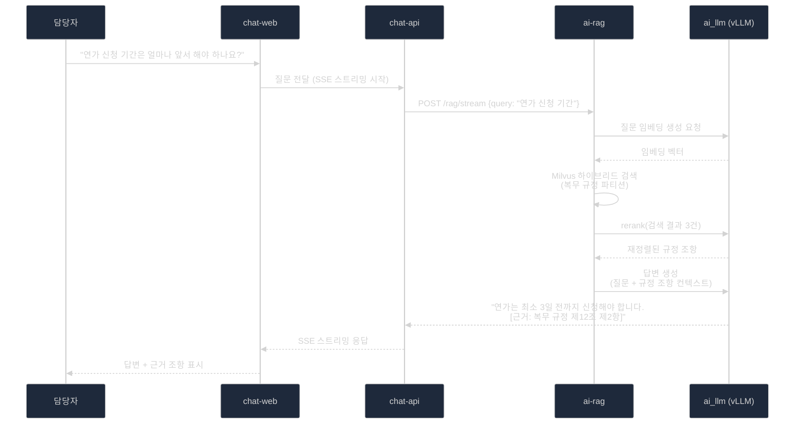
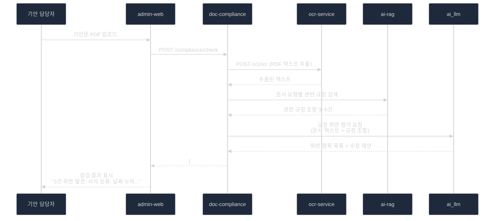

# POC 2 — 규정·문서 지능화 (RAG 기반 검색 및 점검)

> **구현 가능성**: 매우 높음 (기존 서비스 85% 활용)  
> **예상 개발 기간**: 2~3주  
> **핵심 기반**: ai-rag + ai_llm + ocr_service (모두 기존 서비스)

---

## 1. 개요 및 목표

내부 규정·지침을 AI가 학습하여 자연어 질문에 즉시 답변하고, 작성된 문서의 규정 위반 여부를 실시간으로 자동 점검

### 3대 핵심 기능

| 기능 | 설명 | 구현 방식 |
|------|------|---------|
| **규정 Q&A 서비스** | 인사/복무/회계 규정 자연어 질문 → 근거 조항 + 답변 | ai-rag + chat-web |
| **문서 적합성 점검** | 기안문/보고서 업로드 → 규정 위반 탐지 → 수정 가이드 | doc-compliance (신규) |
| **지식 베이스 구축** | 규정 문서 업로드 → OCR → 임베딩 → Milvus 저장 | ocr_service + ai-rag |

---

## 2. 기존 서비스 활용 분석 (핵심 장점)

### 2.1 ai-rag — POC 2의 핵심 (즉시 활용)

```
위치: projects/10_alli-work/apps/ai-rag
포트: 4006
기술: FastAPI + LangGraph + Milvus 2.5 + Redis 캐시

현재 구현:
  ✅ 문서 업로드 API (PDF, 이미지, 텍스트)
  ✅ 벡터 임베딩 생성 및 Milvus 저장
  ✅ 하이브리드 검색 (벡터 + 키워드)
  ✅ RAG 스트리밍 응답 (SSE)
  ✅ 멀티테넌트 파티션 분리
  ✅ 내부 검색 API (/internal/v1/search)

POC 활용 방안:
  ✅ 규정 문서 업로드 및 임베딩 → 즉시 사용 가능
  ✅ 자연어 규정 질문 → RAG 검색 → 답변 → 즉시 사용 가능
  ✅ 근거 조항 함께 반환 → 기존 기능 활용
  → 추가 개발 없이 규정 Q&A 핵심 기능 구현 가능
```

### 2.2 ai_llm (20_alli-llm) — LLM 추론 (즉시 활용)

```
위치: projects/20_alli-llm/app/src/ai_llm
포트: 6001 (API Gateway), 6012 (vLLM Coder), 6013 (vLLM Vision)

현재 구현:
  ✅ /v1/chat/completions — 텍스트 생성 (규정 답변 생성)
  ✅ /v1/embeddings — 텍스트 임베딩 (규정 문서 인덱싱)
  ✅ /v1/rerank — 검색 결과 재정렬 (규정 관련도 향상)
  ✅ Redis 임베딩 캐시 (반복 질문 성능 최적화)

POC 활용:
  ✅ 규정 Q&A 답변 생성
  ✅ 문서 적합성 점검 — LLM 규정 위반 평가
  ✅ 지식 베이스 임베딩 생성
```

### 2.3 ocr_service (20_alli-llm) — 문서 텍스트 추출 (즉시 활용)

```
위치: projects/20_alli-llm/app/src/ocr_service
포트: 6014
기술: PaddleOCR (한국어 지원)

현재 구현:
  ✅ /v1/ocr — 이미지/PDF 텍스트 추출
  ✅ 한국어 텍스트 인식 (행정 문서 최적화)

POC 활용:
  ✅ 규정집 PDF → 텍스트 추출 → ai-rag 업로드
  ✅ 스캔된 지침 문서 처리
  ✅ 기안문 이미지 → 텍스트 변환 → 규정 점검
```

### 2.4 chat-web / chat-api — Q&A UI (즉시 활용)

```
현재: 범용 채팅 인터페이스 (SSE 스트리밍 지원)
POC 활용: 규정 Q&A 전용 채팅 UI로 즉시 전환
  ✅ 규정 질문 → 스트리밍 답변 표시
  ✅ 근거 조항 패널 표시 (UI 소폭 커스터마이징)
```

---

## 3. 신규 개발: doc-compliance (문서 적합성 점검 서비스)

### 3.1 서비스 설계

```
서비스명: doc-compliance
포트: 4014
기술: FastAPI + ai-rag 연동 + ai_llm 연동

역할: 업로드된 문서를 규정 기준으로 자동 점검
  1. 문서 업로드 (PDF/Word/이미지)
  2. ocr_service로 텍스트 추출
  3. ai-rag에서 관련 규정 검색
  4. ai_llm으로 위반 항목 평가
  5. 위반 목록 + 수정 가이드 반환
```

### 3.2 API 명세

```
POST /compliance/check
  Body: { doc_file, doc_type, tenant_id }
  Response: {
    is_compliant: bool,
    violations: [
      {
        section: "제3조",
        issue: "서식 규정 위반",
        rule_reference: "행정기관 공문서 규정 제3조",
        suggestion: "문서 번호를 우측 상단에 표기하세요"
      }
    ],
    score: 85,  // 준수율 점수
    suggestions: ["전체 수정 가이드"]
  }

POST /compliance/upload-regulation
  Body: { file, category, effective_date }
  Response: { doc_id, status, chunk_count }

GET /compliance/regulations
  Response: { 규정 목록, 최신 버전 정보 }
```

---

## 4. 시스템 아키텍처



### 4.1 규정 Q&A 처리 흐름



### 4.2 문서 적합성 점검 흐름



---

## 5. 규정 지식 베이스 구축 계획

### 5.1 규정 문서 분류 체계

```
Milvus 파티션 구조:
  partition: "regulation_hr"        ← 인사/복무 규정
  partition: "regulation_finance"   ← 회계/예산 규정
  partition: "regulation_general"   ← 일반 행정 규정
  partition: "regulation_forms"     ← 서식/양식 규정
  partition: "qa_history"           ← 과거 Q&A 이력
```

### 5.2 규정 문서 처리 파이프라인

```
1. 문서 수집
   - PDF 규정집 → ocr_service OCR → 텍스트
   - Word/HWP 규정 → 텍스트 변환 → 전처리
   - 이미지 지침 → ocr_service → 텍스트

2. 청킹 전략 (행정 규정 특화)
   - 조(Article) 단위 청킹 (제1조, 제2조...)
   - 항(Paragraph) 단위 청킹
   - 메타데이터: 조 번호, 규정명, 시행일, 개정일

3. 임베딩 및 저장
   - ai_llm /v1/embeddings 호출
   - Milvus 파티션별 저장
   - 메타데이터 필터링 지원

4. 지속 업데이트
   - 규정 개정 시 해당 파티션 업데이트
   - 버전 관리 (effective_date 기준)
```

### 5.3 초기 규정 문서 우선순위

| 우선순위 | 규정명 | 분류 |
|:--------:|--------|------|
| P0 | 복무 규정 (연가, 출장, 초과근무) | regulation_hr |
| P0 | 예산 집행 지침 | regulation_finance |
| P0 | 공문서 작성 규정 | regulation_general |
| P1 | 조달/구매 규정 | regulation_finance |
| P1 | 인사 규정 (채용, 승진, 평가) | regulation_hr |
| P2 | 서식 모음 | regulation_forms |

---

## 6. 기능 명세

### 6.1 DOC-01: 규정 문서 업로드 및 임베딩

| 항목 | 내용 |
|------|------|
| **기능** | 규정 PDF/이미지를 업로드하면 자동으로 지식 베이스에 저장 |
| **입력** | 파일 (PDF/이미지), 규정 분류, 시행일 |
| **처리** | OCR → 청킹 → 임베딩 → Milvus 저장 |
| **출력** | 업로드 완료 + 청크 수 |
| **구현 서비스** | admin-web (UI) + ai-rag (기존) + ocr_service (기존) |

### 6.2 DOC-02: 자연어 규정 Q&A

| 항목 | 내용 |
|------|------|
| **기능** | 자연어로 규정 질문 → 근거 조항 포함 답변 스트리밍 |
| **입력** | 자연어 질문 |
| **처리** | 질문 임베딩 → Milvus 검색 → 리랭킹 → LLM 답변 생성 |
| **출력** | 답변 텍스트 + 근거 조항 (조 번호, 규정명) |
| **구현 서비스** | chat-web (기존) + ai-rag (기존) + ai_llm (기존) |
| **추가 개발** | 근거 조항 UI 패널 표시 (chat-web 소폭 수정) |

### 6.3 DOC-03: 문서 적합성 자동 점검

| 항목 | 내용 |
|------|------|
| **기능** | 기안문/보고서를 업로드하면 규정 위반 항목 자동 탐지 |
| **입력** | 문서 파일 + 문서 유형 |
| **처리** | OCR → 관련 규정 검색 → LLM 위반 평가 → 수정 제안 |
| **출력** | 위반 항목 목록 + 근거 규정 + 수정 가이드 |
| **구현 서비스** | admin-web (기존) + doc-compliance (신규) |

### 6.4 DOC-04: 과거 Q&A 지식 베이스 축적

| 항목 | 내용 |
|------|------|
| **기능** | 유익한 Q&A 이력을 자동으로 지식 베이스에 추가 |
| **입력** | Q&A 이력 (평점 4/5 이상) |
| **처리** | 질문+답변 → 임베딩 → qa_history 파티션 저장 |
| **출력** | 유사 질문 시 과거 우수 답변 우선 제공 |
| **구현 서비스** | ai-rag (기존 확장) |

---

## 7. 구현 계획

### 7.1 단계별 개발 계획

```
Phase 1 (1주): 규정 지식 베이스 구축
  □ 규정 문서 수집 (PDF/Word)
  □ ocr_service 한국어 규정 문서 처리 테스트
  □ ai-rag에 규정 파티션 생성 및 업로드
  □ 기본 Q&A 동작 확인 (curl 테스트)

Phase 2 (2~3주): UI 연동 및 문서 점검 개발
  □ chat-web 규정 Q&A 모드 설정 (근거 조항 패널 추가)
  □ admin-web 규정 문서 관리 UI (업로드/목록/삭제)
  □ doc-compliance 서비스 개발
  □ 문서 점검 기능 admin-web 연동

Phase 3 (추가): 품질 최적화
  □ 청킹 전략 최적화 (조 단위 → 항 단위 비교)
  □ 프롬프트 엔지니어링 (Few-shot 예시 추가)
  □ 답변 품질 평가 및 개선
```

### 7.2 개발 공수 산정

| 작업 | 공수 |
|------|------|
| 규정 문서 OCR 처리 및 전처리 | 2일 |
| ai-rag 규정 파티션 구성 | 1일 |
| chat-web 규정 Q&A UI 수정 | 2일 |
| admin-web 규정 관리 UI | 3일 |
| doc-compliance 서비스 개발 | 5일 |
| 통합 테스트 및 품질 개선 | 3일 |
| **합계** | **약 16일 (3주)** |

---

## 8. 프롬프트 엔지니어링 전략

```python
# 규정 Q&A 시스템 프롬프트
REGULATION_QA_SYSTEM_PROMPT = """
당신은 행정 규정 전문 AI 어시스턴트입니다.
반드시 제공된 규정 조항만을 근거로 답변하세요.
규정에 없는 내용은 추측하지 말고 "해당 규정에서 명시적으로 규정하지 않습니다"라고 답하세요.

답변 형식:
1. 핵심 답변 (1~2문장)
2. 근거: [규정명 제N조 제N항]
3. 추가 유의사항 (있는 경우)
"""

# 문서 적합성 점검 프롬프트
COMPLIANCE_CHECK_PROMPT = """
다음 문서가 제공된 규정 기준에 맞는지 점검하세요.
위반 항목은 다음 형식으로 반환하세요:
- 위반 항목: [구체적인 내용]
- 근거 규정: [규정명 및 조항]
- 수정 방법: [구체적인 수정 가이드]

문서: {document_text}
관련 규정: {regulation_context}
"""
```

---

## 9. POC 성공 기준

| 지표 | 목표값 | 측정 방법 |
|------|:------:|---------|
| 규정 Q&A 답변 정확도 | ≥ 85% | 전문가 평가 (20문항) |
| 규정 근거 조항 인용 정확률 | ≥ 90% | 조항 번호 일치 확인 |
| 문서 점검 위반 탐지율 | ≥ 80% | 기준 문서 비교 |
| RAG 검색 응답 시간 | ≤ 3초 | API 응답 시간 측정 |
| 사용자 만족도 | ≥ 4/5점 | 사용자 설문 |
