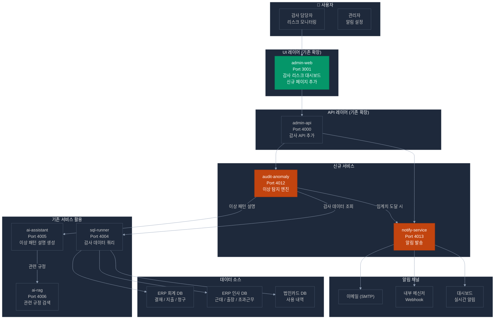
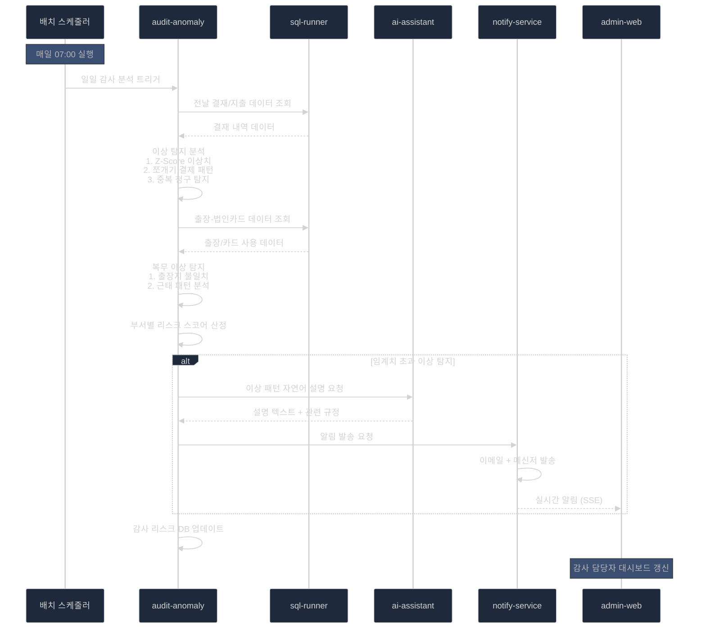
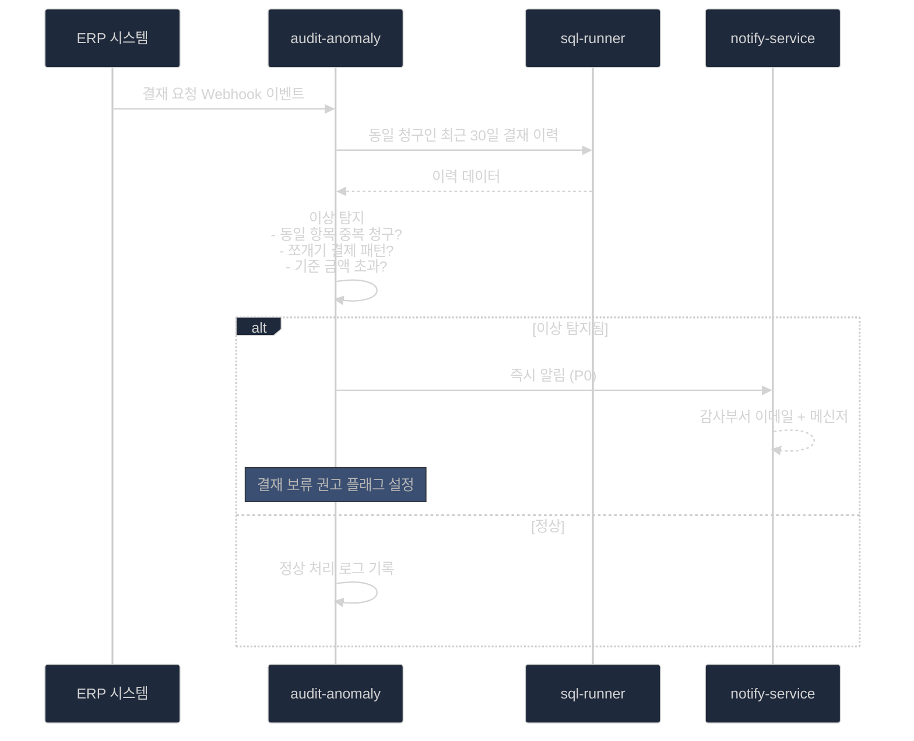

# POC 3 — 사전 감사 지능화 (복무 및 회계 부정 탐지)

> **구현 가능성**: 중 (기존 서비스 50% 활용)  
> **예상 개발 기간**: 5~6주 (이상 탐지 ML 개발 포함)  
> **핵심 신규 개발**: audit-anomaly + notify-service

---

## 1. 개요 및 목표

사후 적발 중심의 감사에서 벗어나, AI가 이상 징후를 실시간으로 감지하여 부정 행위를 미연에 방지하는 지능형 사전 감사 시스템

### 3대 핵심 기능

| 기능 | 설명 | 구현 방식 |
|------|------|---------|
| **지능형 회계 감사** | 이상 결재·중복 지급·쪼개기 결제 탐지 | audit-anomaly (신규) |
| **복무 관리 모니터링** | 출장-법인카드 불일치, 근태 이상 패턴 탐지 | audit-anomaly (신규) |
| **사전 알림 시스템** | 감사 리스크 대시보드 + 임계치 도달 시 자동 알림 | notify-service (신규) + admin-web |

---

## 2. 기존 서비스 활용 분석

### 2.1 sql-runner (핵심 데이터 조회 — 기존 서비스)

```
위치: projects/10_alli-work/apps/sql-runner
포트: 4004
기술: FastAPI + 멀티DB 드라이버 (PostgreSQL, MySQL/MariaDB, Oracle, MSSQL)

현재 구현:
  ✅ MariaDB, Oracle, Tibero (MSSQL 호환) DB 연결
  ✅ Read-Only 모드 (감사 데이터 안전 조회)
  ✅ SQL Injection 방지 검증
  ✅ 커넥션 풀 관리

POC 활용:
  ✅ ERP DB에서 결재/지출 데이터 조회
  ✅ 근태 DB에서 출퇴근/출장 데이터 조회
  ✅ 법인카드 사용 내역 조회
  → audit-anomaly가 sql-runner를 통해 감사 데이터 수집
```

### 2.2 admin-web / admin-api (대시보드 UI — 기존 서비스)

```
현재: 일반 관리 대시보드
POC 활용:
  ✅ 감사 리스크 대시보드 페이지 추가 (admin-web 확장)
  ✅ 이상 탐지 결과 API 엔드포인트 (admin-api 확장)
  ✅ 부서별/항목별 리스크 차트 표시
  → 신규 페이지 추가만으로 구현 가능
```

### 2.3 ai-assistant (이상 패턴 설명 생성 — 기존 서비스)

```
POC 활용:
  ✅ 이상 탐지된 건에 대한 자연어 설명 생성
  ✅ 감사 담당자를 위한 이상 패턴 상세 분석 리포트
  ✅ ai-rag 연동으로 관련 규정 함께 제시
```

---

## 3. 신규 개발 서비스

### 3.1 audit-anomaly (이상 탐지 서비스)

```
서비스명: audit-anomaly
포트: 4012
기술: FastAPI + Pandas + Scikit-learn + APScheduler (배치)

핵심 기능:
  1. 회계 이상 탐지
     - 통계적 이상치 탐지 (Z-Score, IQR)
     - 패턴 기반 탐지 (쪼개기 결제, 중복 청구)
     - Isolation Forest (비지도 ML)
  
  2. 복무 이상 탐지
     - 출장지 vs 법인카드 사용지 불일치 탐지
     - 비정상 초과근무 패턴 분석
     - 근태 데이터 이상 징후 검출

  3. 리스크 스코어링
     - 부서별 월간 리스크 점수 계산
     - 개인별 이상 행동 누적 점수
     - 임계치 도달 시 notify-service 알림 트리거
```

### 3.2 notify-service (알림 서비스)

```
서비스명: notify-service
포트: 4013
기술: NestJS + SMTP + 내부 메신저 Webhook

핵심 기능:
  1. 이메일 알림 (SMTP)
  2. 내부 메신저 알림 (Webhook)
  3. admin-web 실시간 알림 (SSE)
  4. 알림 이력 관리 및 조회
```

---

## 4. 시스템 아키텍처



### 4.1 배치 기반 이상 탐지 흐름



### 4.2 실시간 결재 이상 탐지 흐름 (선택적)



---

## 5. 이상 탐지 알고리즘 설계

### 5.1 회계 이상 탐지 규칙

```python
# 이상 탐지 규칙 정의
ANOMALY_RULES = {
    "duplicate_claim": {
        "description": "동일 청구인의 동일 항목 중복 청구",
        "query": """
            SELECT emp_cd, claim_type, amount, claim_date
            FROM erp_expense
            WHERE claim_date >= DATE_SUB(NOW(), INTERVAL 30 DAY)
            GROUP BY emp_cd, claim_type, amount
            HAVING COUNT(*) > 1
        """,
        "severity": "HIGH",
        "threshold": 1
    },
    "split_payment": {
        "description": "결재 기준금액 회피 목적의 분할 청구 (쪼개기)",
        "query": """
            SELECT emp_cd, SUM(amount) as total, COUNT(*) as count,
                   MIN(claim_date) as start_date, MAX(claim_date) as end_date
            FROM erp_expense
            WHERE claim_date >= DATE_SUB(NOW(), INTERVAL 7 DAY)
              AND claim_type = '물품구매'
            GROUP BY emp_cd, WEEK(claim_date)
            HAVING total > 500000 AND count >= 3
        """,
        "severity": "HIGH"
    },
    "amount_outlier": {
        "description": "동일 유형 대비 비정상 고액 청구 (Z-Score > 2.5)",
        "method": "z_score",
        "threshold": 2.5,
        "severity": "MEDIUM"
    }
}

# 복무 이상 탐지 규칙
WORK_ANOMALY_RULES = {
    "travel_card_mismatch": {
        "description": "출장지역과 법인카드 사용지역 불일치",
        "join_query": """
            SELECT t.emp_cd, t.destination, c.usage_location,
                   c.usage_date, c.amount
            FROM erp_travel t
            JOIN corp_card_usage c ON t.emp_cd = c.emp_cd
                AND c.usage_date BETWEEN t.start_date AND t.end_date
            WHERE t.start_date >= DATE_SUB(NOW(), INTERVAL 30 DAY)
              AND t.destination != c.usage_location  -- 지역 불일치
        """,
        "severity": "HIGH"
    },
    "overtime_pattern": {
        "description": "비정상 초과근무 패턴 (주 15시간 이상)",
        "severity": "MEDIUM",
        "threshold": 15  # 주당 초과근무 시간
    }
}
```

### 5.2 리스크 스코어링 모델

```python
# 부서별 월간 리스크 점수 계산
def calculate_dept_risk_score(dept_cd: str, month: str) -> dict:
    """
    리스크 점수 = 이상 건수 × 가중치 합산 / 전체 결재 건수
    
    가중치:
      HIGH severity: 10점
      MEDIUM severity: 5점
      LOW severity: 2점
    
    리스크 등급:
      RED (≥ 0.15): 즉시 감사 권고
      ORANGE (0.08~0.15): 주의 모니터링
      YELLOW (0.03~0.08): 관찰
      GREEN (< 0.03): 정상
    """
    ...
```

---

## 6. 감사 리스크 대시보드 기능

### 6.1 대시보드 구성

| 섹션 | 내용 | 데이터 소스 |
|------|------|------------|
| **전체 현황** | 금월 이상 탐지 건수, 리스크 등급 분포 | audit-anomaly API |
| **부서별 리스크** | 부서별 리스크 스코어 히트맵 | audit-anomaly API |
| **이상 탐지 목록** | 탐지된 이상 건 상세 목록 (필터/정렬) | audit-anomaly API |
| **추세 분석** | 월별 이상 탐지 건수 추이 차트 | audit-anomaly API |
| **알림 이력** | 발송된 알림 이력 | notify-service API |

### 6.2 admin-web 신규 페이지

```tsx
// 추가할 페이지 구조
/admin/audit
├── /dashboard    — 전체 감사 리스크 현황
├── /anomalies    — 이상 탐지 건 목록 + 상세
├── /risk-score   — 부서별 리스크 스코어 히트맵
└── /alerts       — 알림 이력 및 설정
```

---

## 7. 기능 명세

### 7.1 AUD-01: 이상 결재 패턴 탐지

| 항목 | 내용 |
|------|------|
| **기능** | ERP 결재 데이터에서 이상 패턴 자동 탐지 |
| **입력** | 일일 결재 데이터 (배치 수집) |
| **처리** | 중복 청구 탐지 + 쪼개기 결제 탐지 + 고액 이상치 탐지 |
| **출력** | 이상 건 목록 (emp_cd, 탐지 유형, 심각도, 설명) |
| **구현 서비스** | audit-anomaly (신규) + sql-runner (기존) |

### 7.2 AUD-02: 복무 부정 리스크 점검

| 항목 | 내용 |
|------|------|
| **기능** | 출장-법인카드 불일치, 비정상 초과근무 패턴 탐지 |
| **입력** | 출장 기록 + 법인카드 사용 내역 + 근태 데이터 |
| **처리** | 지역 불일치 탐지 + 초과근무 패턴 분석 |
| **출력** | 복무 이상 건 목록 (심각도 포함) |
| **구현 서비스** | audit-anomaly (신규) + sql-runner (기존) |

### 7.3 AUD-03: 감사 리스크 대시보드

| 항목 | 내용 |
|------|------|
| **기능** | 부서별 리스크 스코어 시각화 + 이상 탐지 목록 |
| **입력** | audit-anomaly API 데이터 |
| **처리** | 리스크 등급 계산 + 히트맵 + 트렌드 차트 |
| **출력** | 대시보드 UI |
| **구현 서비스** | admin-web (기존 확장) + admin-api (기존 확장) |

### 7.4 AUD-04: 자동 알림 시스템

| 항목 | 내용 |
|------|------|
| **기능** | 임계치 도달 시 감사 부서에 자동 알림 발송 |
| **입력** | 이상 탐지 결과 + 알림 규칙 설정 |
| **처리** | 심각도별 알림 채널 선택 + 발송 |
| **출력** | 이메일 + 메신저 + 대시보드 알림 |
| **구현 서비스** | notify-service (신규) |

---

## 8. 구현 계획

### 8.1 단계별 개발 계획

```
Phase 1 (1~2주): 데이터 파이프라인 구축
  □ 감사 DB 접근 권한 확보 (sql-runner에 DB 추가)
  □ ERP 결재/지출 데이터 스키마 파악
  □ 근태/출장/법인카드 DB 스키마 파악
  □ audit-anomaly 프로젝트 초기화
  □ 기본 데이터 수집 배치 구현

Phase 2 (3~4주): 이상 탐지 모델 개발
  □ 회계 이상 탐지 규칙 구현 (중복/쪼개기/이상치)
  □ 복무 이상 탐지 구현 (출장-카드 불일치)
  □ Isolation Forest ML 모델 학습 (샘플 데이터)
  □ 리스크 스코어링 모델 구현
  □ notify-service 개발

Phase 3 (5~6주): UI 및 통합
  □ admin-web 감사 대시보드 4개 페이지 개발
  □ admin-api 감사 API 엔드포인트 추가
  □ ai-assistant 연동 (이상 패턴 자연어 설명)
  □ 전체 통합 테스트 및 임계값 튜닝
```

### 8.2 개발 공수 산정

| 작업 | 공수 |
|------|------|
| 감사 데이터 파이프라인 (sql-runner 확장) | 3일 |
| audit-anomaly 서비스 기반 구축 | 2일 |
| 회계 이상 탐지 규칙 구현 | 5일 |
| 복무 이상 탐지 구현 | 4일 |
| ML 모델 (Isolation Forest) | 3일 |
| 리스크 스코어링 | 2일 |
| notify-service 개발 | 4일 |
| admin-web 대시보드 4페이지 | 6일 |
| admin-api 감사 API | 3일 |
| 통합 테스트 및 임계값 튜닝 | 4일 |
| **합계** | **약 36일 (7주)** |

> ⚠️ 데이터 접근 권한 확보 지연 시 2~3주 추가 가능

---

## 9. 기술적 고려사항

### 9.1 데이터 접근 전략

```
현황:
  - sql-runner: MariaDB, Oracle, MSSQL, PostgreSQL 드라이버 지원
  - ERP DB 읽기 권한 확보 후 즉시 활용 가능

권장 접근 방식:
  1단계: 데이터 미러링 (일일 배치)
    - ERP DB → 감사 전용 PostgreSQL 복제 (민감도 낮음)
    - 실시간 접근 권한 확보 전까지 배치 분석
  
  2단계: 실시간 접근 (권한 확보 후)
    - sql-runner를 통한 실시간 ERP DB 쿼리
    - 결재 이벤트 Webhook 연동 (가능 시)
```

### 9.2 개인정보 보호

```
감사 데이터 처리 시 필수 준수 사항:
  - 개인식별정보(PII) 마스킹 (emp_cd는 허용, 이름/주민번호는 마스킹)
  - 감사 로그 접근 권한 최소화 (감사 담당자만 조회)
  - 이상 탐지 결과는 감사부서 전용 DB 별도 저장
  - 데이터 보존 기간: 감사 결과 5년 보존
```

### 9.3 오탐(False Positive) 관리

```
오탐 최소화 전략:
  1. 보수적 임계값 설정 (초기: 낮은 민감도)
  2. 감사 담당자 피드백 루프 (정상/이상 레이블링)
  3. 화이트리스트 관리 (정기 고액 결재 항목 제외)
  4. 이상 탐지 확신도(score) 기준 알림 필터링

목표:
  정밀도(Precision) ≥ 80%  (알림 중 실제 이상 비율)
  재현율(Recall) ≥ 70%      (실제 이상 중 탐지 비율)
  허위 경보율 ≤ 20%
```

---

## 10. POC 성공 기준

| 지표 | 목표값 | 측정 방법 |
|------|:------:|---------|
| 이상 결재 탐지 정밀도 | ≥ 80% | 전문가 검토 (샘플 50건) |
| 이상 결재 탐지 재현율 | ≥ 70% | 알려진 이상 사례 탐지 |
| 복무 이상 탐지율 | ≥ 75% | 출장-카드 불일치 탐지 |
| 허위 경보율 | ≤ 20% | 정상 건 오탐 비율 |
| 배치 분석 처리 시간 | ≤ 5분 | 일일 배치 완료 시간 |
| 대시보드 데이터 갱신 주기 | ≤ 24시간 | 배치 완료 후 갱신 |
