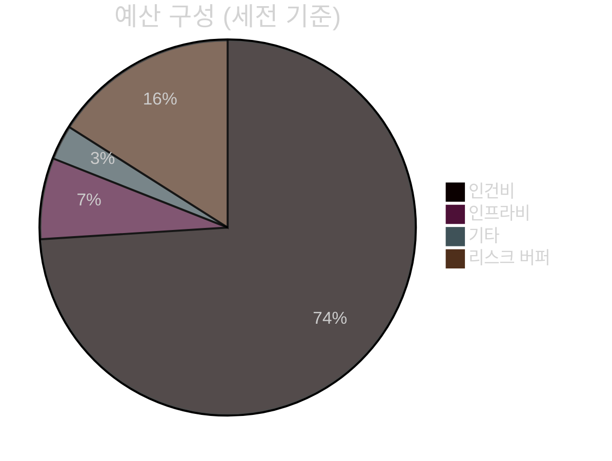

# POC 예산 계획 (시나리오 B — 권장)

> **기간**: 13주 (3.25개월) | **인력**: 2인 + 파트타임 PM
> **기준일**: 2026-04-22

---

## 1. 총 예산 요약

| 구분 | 금액 (만원) | 비중 |
|------|:---------:|:---:|
| 인건비 | 14,050 | 74% |
| 인프라비 | 1,335 | 7% |
| 기타 | 500 | 3% |
| 리스크 버퍼 (20%) | 3,115 | 16% |
| **세전 소계** | **19,000** | 100% |
| VAT 10% | 1,900 | — |
| **총 예산 (VAT 포함)** | **20,900** | — |

→ **약 2억 900만원** (유연 범위: 1.7억 ~ 2.1억원)



---

## 2. 인건비 상세 (3.25개월)

| 역할 | 등급 | 월 단가 (외주 기준) | 투입 기간 | 소계 (만원) |
|------|:---:|:------------------:|:--------:|:--------:|
| PM (파트타임 50%) | 시니어 | 850만원 × 0.5 | 3.25개월 | 1,700 |
| D1 — AI/백엔드 | 상급 | 2,000만원 | 3.25개월 | 6,500 |
| D2 — 풀스택 | 상급 | 1,800만원 | 3.25개월 | 5,850 |
| **인건비 합계** | | | | **14,050** |

> **참고**: 노임단가는 한국소프트웨어산업협회(KOSA) 고시 기준 외주 용역 가격 기반. 내부 직원 전환 시 인건비 1/3 수준.

---

## 3. 인프라비 (3.25개월)

| 항목 | 월 비용 | 기간 | 소계 (만원) | 비고 |
|------|:------:|:---:|:---------:|------|
| GPU 서버 임대 (A40 48GB × 1) | 300만원 | 3.25개월 | 975 | 기관 보유 시 0원 |
| CPU 서버 (app + DB) | 80만원 | 3.25개월 | 260 | |
| 네트워크/스토리지 | 30만원 | 3.25개월 | 100 | Milvus 스토리지 포함 |
| **인프라 합계** | | | **1,335** | |

> **절감 포인트**: 기관 보유 GPU 서버(A40 48GB 이상) 재활용 시 **-975만원** 추가 절감 가능

---

## 4. 기타 비용

| 항목 | 비용 (만원) |
|------|:---------:|
| 테스트/QA 환경 | 200 |
| 소프트웨어 라이선스 (개발 도구) | 100 |
| 프로젝트 관리 (회의·출장) | 200 |
| **기타 합계** | **500** |

---

## 5. 소프트웨어 라이선스 정책

### 무료 (라이선스 비용 0원) — 확정

| 구분 | 제품 | 라이선스 |
|------|------|---------|
| LLM 생성 모델 | **Gemma 4 31B-it** | Apache 2.0 |
| LLM 멀티모달 | **Gemma 4 E4B** | Apache 2.0 |
| 임베딩 모델 | **KURE-v1** | Apache 2.0 |
| 보조 임베딩 | KR-SBERT | MIT |
| OCR | PaddleOCR | Apache 2.0 |
| 기반 스택 | Ubuntu, Docker, PostgreSQL, Redis, Milvus | GPL/Apache/BSD |
| 프레임워크 | vLLM, LangGraph, FastAPI, NestJS, Next.js | Apache 2.0/MIT |

### 검토 항목

| 항목 | 비용 | 리스크 | 대응 |
|------|:----:|-------|------|
| Claude Code 구독 | 월 20~30만원/인 | 내부망 차단 시 사용 불가 | 오프라인 IDE 대안 (VSCode + 무료 확장) |
| MinIO 상업용 | 연 수백만원 | AGPL 상업 이슈 | **NFS/POSIX 대안 채택** (비용 0원) |

---

## 6. 리스크 예비비 계획

| 등급 | 리스크 | 예비비 (만원) | 발동 조건 |
|:----:|--------|:-----------:|---------|
| P0 | GPU 서버 조달 지연 (6주+) | 1,000 | 클라우드 GPU 임시 대여 |
| P0 | 핵심 인력 중도 이탈 | 500 | 대체 인력 즉시 투입 |
| P1 | ERP 연동 실패 → 자체 개발 | 800 | 그룹웨어 연동 모듈 자체 구현 |
| P1 | 한국어 LLM 품질 미달 | 300 | 모델 교체 + 프롬프트 최적화 |
| P2 | 내부망 방화벽 이슈 | 200 | 우회 아키텍처 |
| **예비비 합계** | | **2,800** | — |

위 예비비는 총 리스크 버퍼(3,115만원) 내에서 운영.

---

## 7. 예산 절감 전략

| 방안 | 절감 효과 | 조건 |
|------|:--------:|------|
| 기관 GPU 서버 재활용 | -975만원 | A40 48GB+ 보유 |
| 기관 앱/DB 서버 재활용 | -260만원 | 32 코어 / 128GB+ 보유 |
| 내부 개발자 협업 | -1,500만~2,500만원 | 기관 내 AI/개발 인력 투입 |
| Gemma 4 Apache 2.0 채택 | (확정 반영) | EXAONE 대비 라이선스비 0원 |
| MinIO → NFS | (확정 반영) | AGPL 이슈 회피 |

**최대 절감 시 총 예산**: 약 1억 7,000만원 (VAT 포함) — 기관 보유 자원 최대 활용 조건

---

## 8. Phase별 예산 집행 계획

| Phase | 주차 | 주요 비용 | 예산 비중 |
|-------|:---:|---------|:--------:|
| Phase 0 — 사전 협의 | W-2~W0 | PM 인건비, 인프라 셋업 | 5% |
| Phase 1 — 기반 구축 | W1~W3 | 인건비 + GPU 임대 | 22% |
| Phase 2 — POC 2 | W3~W5 | 인건비 | 22% |
| Phase 3 — POC 1 | W5~W8 | 인건비 | 25% |
| Phase 4 — POC 3 | W8~W12 | 인건비 + QA | 22% |
| Phase 5 — 검증 | W12~W13 | 인건비 + 발표 | 4% |

---

## 9. 사전 협의 필수 항목 (고객사)

### P0 — 즉시 착수 (W-2 이전)

```
□ GPU 서버 보유 여부 확인 → 재활용 또는 신규 구매 결정
  - A40 48GB 이상: 재활용 가능 여부
  - 미보유 시: 조달 예산 편성 + 리드타임 (8~12주)
□ 외부 용역 계약 예산 및 방식 확정 (도급 vs 파견)
□ POC 전체 예산 범위 승인
```

### P1 — W1 착수

```
□ MinIO AGPL 법무 검토 (또는 NFS 대안 확정)
□ 개인정보 영향평가 필요 여부 확인
□ 예비비 사용 권한 및 절차 확정
```

### P2 — W2 착수

```
□ 그룹웨어 API 제공 여부 → 불가 시 추가 예산 방안
□ 감사 DB 접근 승인 → 불가 시 POC 3 범위 재협의
□ 내부 메신저 Webhook 연동 결정 (선택)
```

---

## 10. 시나리오 비교 (참고)

| 시나리오 | 기간 | 인력 | 예산 (VAT 포함) | 5년 총비용 |
|---------|:---:|:---:|:-----------:|:--------:|
| A (완전 구현, 9과제) | 16주 | 8인 | 2억 6,300만원 | 6억 1,300만원 |
| **B ⭐ (단계형, 6+3과제)** | **13주** | **2인** | **2억 900만원** | **5억 6,100만원** (최저) |
| C (빠른 증빙, 3.5과제) | 8주 | 2인 | 1억 1,550만원 | 8억 1,550만원 |

---

## 11. ROI 근거

| 효과 항목 | 현재 | POC 이후 | 절감 효과 |
|---------|------|---------|---------|
| 전자결재 기안 시간 | 평균 60분 | 10분 이내 | 인당 월 5시간 |
| 규정 문의 응답 시간 | 1~3일 | 즉시 | 담당자 부하 감소 |
| 감사 이상 탐지 | 수동 전수 조사 | 자동 (정밀도 70%+) | 감사 인력 50% 효율화 |
| 문서 적합성 검토 | 수동 | 자동 1차 | 검토 시간 70% 절감 |

**투자 회수**: POC 성공 후 전체 도입 시 1~2년 내 ROI 달성 가능 (행정 직원 절감 시간 × 인건비 환산)

---

## 12. POC 이후 운영 비용 (참고)

| 항목 | 월 비용 |
|------|:------:|
| GPU 서버 전기료 | 10만~30만원 |
| 모델 업데이트 스토리지 | 5만~10만원 |
| 유지보수 인건비 | 월 500만~1,000만원 (외주 기준) |
| LLM 모델 버전 업그레이드 | 6~12개월 주기 (1회 약 200만원) |
