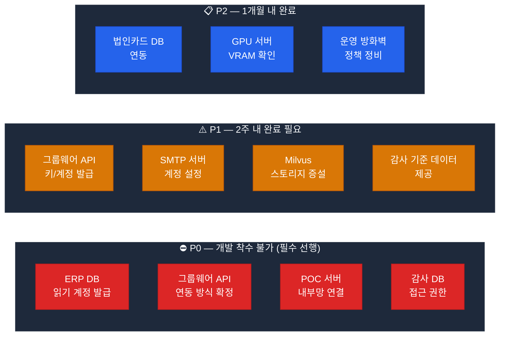

# POC 사전 완료 요건 — 외부 시스템 연동 및 환경 준비

> **기준일**: 2026-04-13  
> **목적**: POC 개발 착수 전 외부 시스템 담당 부서/팀이 반드시 완료해야 하는 사전 작업 목록  
> **관리 주체**: 정보시스템 담당 부서 + 각 시스템 운영 담당자

---

## 전체 사전 요건 요약



---

## 1. ERP 시스템 연동 (P0 — 개발 착수 전 필수)

### 1.1 ERP DB 읽기 계정 발급

| 항목 | 내용 |
|------|------|
| **요청 대상** | ERP 시스템 운영 담당자 |
| **필요 권한** | Read-Only (SELECT만 허용) |
| **대상 DB** | MariaDB / Oracle / Tibero (운영 ERP 환경에 따라) |
| **완료 기준** | sql-runner에서 SELECT 쿼리 실행 성공 |
| **예상 소요** | 1~2주 (보안 심의 포함) |
| **담당 부서** | 정보보안팀 + ERP 운영팀 |

#### 필요 테이블 목록 (최소 요구)

```sql
-- 결재/지출 관련
SELECT * FROM 결재내역 LIMIT 1;
SELECT * FROM 지출내역 LIMIT 1;
SELECT * FROM 청구내역 LIMIT 1;

-- 마감일/일정 관련
SELECT * FROM 결산마감일정 LIMIT 1;
SELECT * FROM 지급마감일정 LIMIT 1;

-- 인사/근태 관련 (POC 3 감사용)
SELECT * FROM 근태내역 LIMIT 1;
SELECT * FROM 출장신청내역 LIMIT 1;
SELECT * FROM 초과근무내역 LIMIT 1;
SELECT * FROM 법인카드사용내역 LIMIT 1;
```

#### sql-runner 연결 설정 (발급 후 적용)

```yaml
# docker-compose.override.yml 또는 .env 파일
ERP_DB_HOST: "192.168.xxx.xxx"      # ERP DB 서버 IP (내부망)
ERP_DB_PORT: "3306"                  # MariaDB: 3306 / Oracle: 1521 / Tibero: 8629
ERP_DB_USER: "poc_readonly"          # 발급받은 읽기 전용 계정
ERP_DB_PASSWORD: "..."              # 보안 관리자에게 별도 수령
ERP_DB_NAME: "erp_production"       # 실제 DB명 확인 필요
ERP_DB_TYPE: "mariadb"              # mariadb | oracle | tibero
```

### 1.2 ERP 데이터 구조 문서 제공

| 항목 | 내용 |
|------|------|
| **요청 내용** | POC 관련 테이블의 ERD 또는 컬럼 정의서 |
| **형식** | Excel, PDF, HTML 중 가능한 형식 |
| **용도** | sql-runner SQL 쿼리 작성 + erp-mcp MCP 도구 개발 |
| **완료 기준** | 주요 테이블 10개 이상의 컬럼명/타입/설명 수령 |

---

## 2. 그룹웨어 시스템 연동 (P0/P1)

### 2.1 연동 방식 확정 (P0 — 개발 방향 결정)

> **반드시 POC 착수 전 결정 필요** — 연동 방식에 따라 groupware-mcp 개발 방향이 달라짐

| 연동 방식 | 장점 | 단점 | 권장 여부 |
|----------|------|------|:-------:|
| **REST API 연동** | 공식 지원, 안정성 높음 | API 문서/키 발급 시간 소요 | ✅ **권장** |
| **DB Direct 접근** | 빠른 개발 | 유지보수 어려움, 보안 이슈 | ⚠️ 대안 |
| **파일 기반 연동** | 즉시 가능 | 실시간 아님, 수동 처리 | ❌ POC 한계 |

#### REST API 연동 시 필요 정보

```
□ API 기본 URL: https://groupware.internal/api/v1
□ 인증 방식: OAuth2 / API Key / Basic Auth
□ 제공 API 목록:
   - GET /approvals?emp_cd={}&status=pending
   - POST /approvals/draft (기안 등록)
   - GET /schedules?emp_cd={}&date={}
   - GET /employees/{emp_cd}
   - GET /approval-routes?doc_type={}
□ Rate Limit: 초당 요청 수 제한
□ 샌드박스(테스트) 환경 제공 여부
```

### 2.2 그룹웨어 API 계정/키 발급 (P1)

| 항목 | 내용 |
|------|------|
| **요청 대상** | 그룹웨어 운영 담당자 / 벤더사 |
| **필요 권한** | 읽기(결재목록, 일정, 인사정보) + 쓰기(기안 등록) |
| **완료 기준** | groupware-mcp에서 테스트 API 호출 성공 |
| **예상 소요** | 2~4주 (벤더사 협의 포함) |

#### 개발 전 임시 방안 (P0 병행)

```python
# groupware-mcp 개발 초기: Mock 데이터로 먼저 개발
GROUPWARE_MOCK_MODE = True  # 실제 API 연동 전까지 Mock 사용

MOCK_APPROVALS = [
    {"doc_id": "DOC001", "title": "출장비 청구", "status": "pending", "approvers": ["팀장", "부장"]},
    {"doc_id": "DOC002", "title": "비품 구매 요청", "status": "pending", "approvers": ["팀장"]},
]

MOCK_SCHEDULES = [
    {"date": "2026-04-14", "time": "14:00", "title": "팀 회의"},
    {"date": "2026-04-14", "time": "18:00", "title": "보고서 제출 마감"},
]
```

---

## 3. 감사 데이터 환경 (P0/P1)

### 3.1 감사 DB 읽기 권한 (P0)

| 항목 | 내용 |
|------|------|
| **요청 대상** | 감사 부서 + 정보보안팀 |
| **대상 DB** | 감사 전용 DB 또는 ERP 감사 스키마 |
| **필요 권한** | Read-Only (감사 이력, 리스크 기준 데이터) |
| **완료 기준** | sql-runner에서 감사 쿼리 실행 성공 |
| **주의사항** | 개인정보 포함 데이터 — 가명처리 또는 별도 협의 필요 |

### 3.2 감사 기준 데이터 제공 (P1)

> 이상 탐지 모델 학습 및 임계값 설정에 필요

| 데이터 | 담당 부서 | 형식 | 용도 |
|--------|----------|------|------|
| 이상 결재 기준 금액 | 감사팀 | Excel | 분할결재 탐지 임계값 |
| 출장 허용 지역 목록 | 총무팀 | Excel | 출장지-카드 불일치 탐지 |
| 법인카드 허용 업종 코드 | 재무팀 | Excel | 카드 부정 사용 탐지 |
| 초과근무 정상 범위 | 인사팀 | Excel | 근태 이상 탐지 기준 |
| 과거 감사 적발 사례 | 감사팀 | Excel/PDF | ML 모델 학습 데이터 |

---

## 4. POC 서버 인프라 (P0)

### 4.1 POC 서버 내부망 네트워크 구성

```
요청 내용:
□ POC AI 서버 ↔ ERP 서버 간 내부망 연결
   - POC 서버 IP 대역: 192.168.10.0/24 (예시, 실제 확인 필요)
   - ERP 서버 IP: 192.168.20.xxx
   - 허용 포트: ERP DB 포트 (3306/1521/8629)

□ POC AI 서버 ↔ 그룹웨어 서버 간 연결
   - 그룹웨어 API 서버 IP: 192.168.30.xxx
   - 허용 포트: 443 (HTTPS)

□ POC AI 서버 ↔ 감사 DB 서버 간 연결
   - 감사 DB 서버 IP: 192.168.40.xxx
   - 허용 포트: DB 포트

방화벽 정책 신청 담당: 네트워크 관리팀
예상 소요: 1주 (방화벽 정책 심의)
```

### 4.2 POC 서버 사양 확인

현재 운영 중인 서버에 POC 서비스를 추가하기 위한 사양 확인:

| 항목 | 현재 | POC 추가 후 | 부족 여부 |
|------|------|-----------|:-------:|
| **CPU** | 운영 중 | +4 vCore (신규 서비스 4개) | 확인 필요 |
| **RAM** | 운영 중 | +8GB (신규 서비스) | 확인 필요 |
| **스토리지** | 운영 중 | +50GB (Milvus 규정 벡터) | 확인 필요 |
| **GPU VRAM** | 4GB 이상 | Vision 모델 추가 시 8GB+ 필요 | ⚠️ 확인 필요 |

---

## 5. 규정 문서 수집 (P1 — POC 2 착수 전)

### 5.1 규정 문서 제공

| 문서 유형 | 담당 부서 | 형식 | 수량 |
|----------|----------|------|:---:|
| 인사 규정집 | 인사팀 | PDF | 1~3종 |
| 복무 관련 지침 | 총무팀 | PDF | 3~5종 |
| 회계/예산 규정 | 재무팀 | PDF | 2~4종 |
| 공문서 서식 규정 | 총무팀 | PDF | 1~2종 |
| 행정업무 운영 규정 | 총무팀 | PDF | 1~2종 |
| 정보보안 지침 | 정보보안팀 | PDF | 1종 |

**수집 방법**: 각 부서에 PDF 형태로 요청 → OCR 처리 → ai-rag 인덱싱

### 5.2 규정 문서 메타데이터 표준

ai-rag 인덱싱 시 아래 메타데이터를 함께 등록:

```json
{
  "doc_id": "REG-HR-001",
  "title": "복무 규정",
  "category": "hr",
  "effective_date": "2025-01-01",
  "revision_date": "2025-01-01",
  "version": "3.2",
  "department": "인사팀",
  "keywords": ["연가", "출장", "초과근무", "복무"]
}
```

---

## 6. 알림 인프라 (P1)

### 6.1 SMTP 서버 계정 설정

| 항목 | 내용 |
|------|------|
| **요청 대상** | 네트워크/시스템 관리팀 |
| **필요 정보** | SMTP 호스트, 포트, 발신자 계정, 비밀번호/앱 비밀번호 |
| **용도** | notify-service 이메일 알림 발송 |
| **완료 기준** | 테스트 이메일 발송 성공 |

```yaml
# notify-service 환경변수
SMTP_HOST: "mail.internal"
SMTP_PORT: "587"
SMTP_USER: "poc-notify@organization.kr"
SMTP_PASS: "..."
SMTP_FROM: "AI POC 알림 <poc-notify@organization.kr>"
```

### 6.2 내부 메신저 Webhook (선택)

| 메신저 | 설정 방법 | 담당 |
|--------|---------|------|
| 네이버웍스 | Webhook URL 발급 | IT팀 |
| 슬랙(Slack) | Bot Token 발급 | IT팀 |
| 카카오워크 | Bot API 키 발급 | IT팀 |
| 자체 내부 메신저 | 담당자 협의 | 메신저 운영팀 |

---

## 7. 개인정보 및 보안 사전 협의 (P0)

### 7.1 데이터 처리 동의

| 항목 | 내용 | 담당 |
|------|------|------|
| 개인정보 처리 방침 검토 | POC 과정에서 개인정보(근태, 인사) 처리 동의 | 개인정보보호 담당자 |
| 데이터 최소화 원칙 적용 | 필요 최소한의 데이터만 사용 (emp_cd 해시처리 등) | 개발팀 + 보안팀 |
| AI 학습 데이터 범위 승인 | 규정 문서, 과거 결재 패턴 사용 범위 | 정보보안팀 |

### 7.2 POC 데이터 격리

```
POC 데이터 격리 원칙:
□ 운영 DB 직접 변경 금지 — Read-Only 계정만 사용
□ POC 서버 내 데이터 저장 최소화
□ Milvus에 저장되는 규정 문서 — 원문 아닌 벡터 임베딩만 저장
□ 감사 이상 탐지 결과 — POC DB에만 저장, 운영 DB 기록 금지
□ POC 종료 후 임시 데이터 전량 삭제 계획 수립
```

---

## 8. 사전 완료 체크리스트

### P0 — 개발 착수 전 완료 (1주차)

```
□ ERP DB 읽기 계정 신청 (담당: 정보보안팀)
□ ERP DB 테이블 구조 문서 요청 (담당: ERP 운영팀)
□ 그룹웨어 연동 방식 확정 회의 (담당: PM + 그룹웨어 운영팀)
□ 감사 DB 접근 권한 신청 (담당: 감사팀 + 정보보안팀)
□ POC 서버 ↔ ERP/그룹웨어 방화벽 정책 신청 (담당: 네트워크팀)
□ 개인정보 처리 동의 검토 완료 (담당: 개인정보보호 담당자)
□ POC 서버 사양 확인 및 필요 시 증설 신청
```

### P1 — 2주차까지 완료

```
□ ERP DB 접근 완료 확인 (sql-runner 테스트 쿼리 성공)
□ 그룹웨어 API 키/계정 발급 완료
□ 규정 문서 수집 완료 (PDF 형태, 최소 10종)
□ SMTP 계정 설정 완료
□ Milvus 스토리지 증설 완료
□ 감사 기준 데이터 수령 (이상 탐지 임계값 기준)
□ 법인카드 DB 연동 방식 협의
```

### P2 — 4주차까지 완료

```
□ 법인카드 DB 실제 접근 완료
□ GPU 서버 VRAM 확인 및 Vision 모델 설정
□ 운영 방화벽 정책 정비 (전체 서비스 포트 정리)
□ 내부 메신저 Webhook 연동 (선택)
```

---

## 9. 담당자 협의 연락처 템플릿

> POC 프로젝트 킥오프 미팅 시 아래 정보 수집 필요

| 시스템 | 담당 부서 | 담당자명 | 연락처 | 협의 상태 |
|--------|----------|---------|--------|:-------:|
| ERP 시스템 | ERP 운영팀 | 미정 | 미정 | ⬜ 미협의 |
| 그룹웨어 | 그룹웨어 운영팀 | 미정 | 미정 | ⬜ 미협의 |
| 감사 DB | 감사팀 | 미정 | 미정 | ⬜ 미협의 |
| 법인카드 | 재무팀 | 미정 | 미정 | ⬜ 미협의 |
| 네트워크/방화벽 | 네트워크팀 | 미정 | 미정 | ⬜ 미협의 |
| 정보보안 | 정보보안팀 | 미정 | 미정 | ⬜ 미협의 |
| 규정 문서 | 총무/인사/재무팀 | 미정 | 미정 | ⬜ 미협의 |

---

*이 문서는 POC 프로젝트 PM이 킥오프 미팅 전에 관계 부서와 공유하고, 사전 완료 현황을 주간 단위로 업데이트해야 합니다.*
