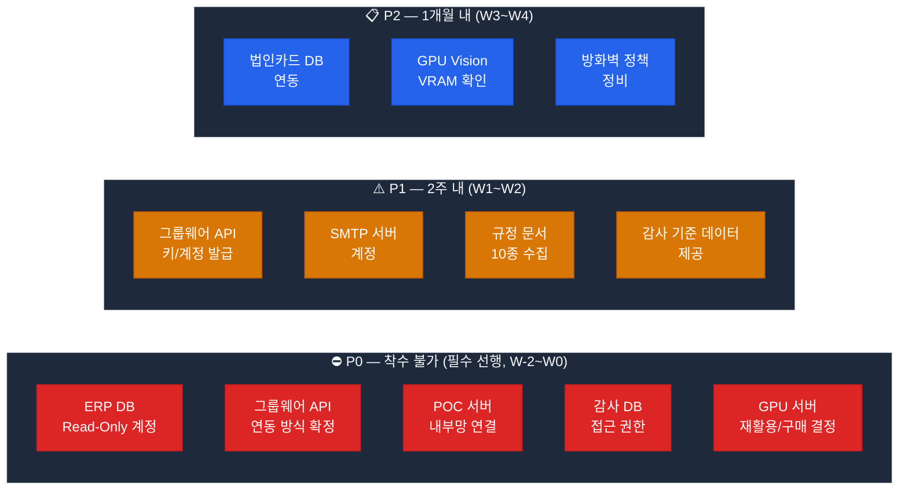

# POC 사전 요건 — 외부 연동 + 감사 데이터

> **기준일**: 2026-04-22
> **목적**: POC 착수 전 외부 시스템 담당 부서가 완료해야 하는 사전 작업 + 감사 데이터 요건
> **관리 주체**: 고객사 정보시스템팀 + 각 시스템 운영 담당자

---

## 1. 우선순위별 요건 개요



---

## 2. ERP 시스템 연동 (P0)

### 2.1 ERP DB Read-Only 계정 발급

| 항목 | 내용 |
|------|------|
| 요청 대상 | 정보보안팀 + ERP 운영팀 |
| 권한 범위 | **SELECT만** 허용 (쓰기 일체 금지) |
| 대상 DB | MariaDB / Oracle / Tibero (운영 환경에 따라) |
| 완료 기준 | sql-runner에서 SELECT 쿼리 실행 성공 |
| 예상 소요 | 1~2주 (보안 심의 포함) |

### 2.2 필요 테이블 (최소)

```sql
-- 결재/지출 관련
결재내역, 지출내역, 청구내역
-- 마감일/일정 관련
결산마감일정, 지급마감일정
-- 인사/근태 (POC 3 감사용)
근태내역, 출장신청내역, 초과근무내역, 법인카드사용내역
```

### 2.3 sql-runner 환경변수 (계정 발급 후 적용)

```yaml
ERP_DB_HOST: "192.168.x.x"     # ERP DB 내부망 IP
ERP_DB_PORT: "3306"             # MariaDB / Oracle 1521 / Tibero 8629
ERP_DB_USER: "poc_readonly"
ERP_DB_PASSWORD: "..."
ERP_DB_NAME: "erp_production"
ERP_DB_TYPE: "mariadb"          # mariadb | oracle | tibero
```

### 2.4 ERP ERD/컬럼 정의서 요청

| 항목 | 내용 |
|------|------|
| 형식 | Excel / PDF / HTML 가능 형식 |
| 용도 | SQL 쿼리 작성 + MCP 도구 개발 |
| 완료 기준 | 주요 테이블 10개+ 컬럼명/타입/설명 수령 |

---

## 3. 그룹웨어 연동 (P0/P1)

### 3.1 연동 방식 확정 (P0)

| 방식 | 장점 | 단점 | 권장 |
|------|------|------|:---:|
| **REST API** | 공식·안정적 | 키 발급 시간 소요 | ✅ |
| DB Direct | 빠른 개발 | 유지보수·보안 | ⚠️ 대안 |
| 파일 기반 | 즉시 가능 | 실시간 불가 | ❌ |

### 3.2 REST API 필요 정보

```
□ API 기본 URL: https://groupware.internal/api/v1
□ 인증 방식: OAuth2 / API Key / Basic
□ 제공 엔드포인트:
   - GET  /approvals?emp_cd={}&status=pending
   - POST /approvals/draft (기안 등록)
   - GET  /schedules?emp_cd={}&date={}
   - GET  /employees/{emp_cd}
   - GET  /approval-routes?doc_type={}
□ Rate Limit / 샌드박스 환경 제공 여부
```

### 3.3 API 계정 발급 (P1)

| 항목 | 내용 |
|------|------|
| 권한 | 읽기(결재·일정·인사) + 쓰기(기안 등록) |
| 완료 기준 | groupware-mcp 테스트 API 호출 성공 |
| 예상 소요 | 2~4주 (벤더사 협의 포함) |

### 3.4 Mock 모드 (권한 확보 전 병행)

```python
GROUPWARE_MOCK_MODE = True

MOCK_APPROVALS = [
    {"doc_id": "DOC001", "title": "출장비 청구", "status": "pending", "approvers": ["팀장", "부장"]},
    ...
]
MOCK_SCHEDULES = [
    {"date": "2026-04-14", "time": "14:00", "title": "팀 회의"},
    ...
]
```

---

## 4. 감사 데이터 요건 (P0/P1) — POC 3 핵심

### 4.1 원천 테이블 목록

| # | 테이블 | 분류 | P | 최소 건수 | 기간 |
|:-:|-------|------|:-:|:-------:|------|
| 1 | 결재내역 (approval_history) | 회계 | 0 | 10,000+ | 2년 |
| 2 | 지출내역 (expenditure) | 회계 | 0 | 50,000+ | 2년 |
| 3 | 법인카드 사용내역 (corp_card_usage) | 복무 | 0 | 30,000+ | 2년 |
| 4 | 출장신청내역 (business_trip) | 복무 | 0 | 5,000+ | 2년 |
| 5 | 근태내역 (attendance) | 복무 | 1 | 100,000+ | 1년 |
| 6 | 초과근무내역 (overtime) | 복무 | 1 | 20,000+ | 1년 |
| 7 | 청구내역 (claim_history) | 회계 | 1 | 20,000+ | 2년 |
| 8 | 예산현황 (budget_status) | 기준 | 1 | 1,000+ | 2년 |
| 9 | 감사지표기준 (audit_threshold) | 기준 | 0 | 50+ | 현재 |
| 10 | 과거감사사례 (audit_cases) | AI학습 | 2 | 200+ | 5년 |

### 4.2 감사 기준 데이터 (P1) — 탐지 임계값 설정 필수

| 데이터 | 담당 부서 | 용도 |
|--------|----------|------|
| 이상 결재 기준 금액 | 감사팀 | 분할 결제 탐지 임계값 |
| 출장 허용 지역 목록 | 총무팀 | 출장지-카드 불일치 탐지 |
| 법인카드 허용 업종 (MCC) | 재무팀 | 카드 부정 사용 탐지 |
| 초과근무 정상 범위 | 인사팀 | 근태 이상 탐지 기준 |
| 과거 감사 적발 사례 | 감사팀 | ML 모델 학습 데이터 |

### 4.3 핵심 감사 지표 (탐지 로직)

**회계 감사**

| 지표 ID | 지표명 | 탐지 로직 | 위험 |
|---------|-------|---------|:---:|
| AUD-ACC-01 | 쪼개기 결제 | 동일인 3일 내 50만원 미만 동일 계정 3건+ | 🔴 |
| AUD-ACC-02 | 중복 청구 | 동일인 30일 내 동일 금액 동일 계정 2건+ | 🔴 |
| AUD-ACC-03 | 이상 고액 결재 | 부서 평균 대비 Z-Score > 2.5 | 🟡 |
| AUD-ACC-04 | 예산 초과 결재 | 결재액 > 예산 잔액 | 🔴 |
| AUD-ACC-05 | 연말 집중 집행 | 11~12월 집행액 전년 3배 초과 | 🟡 |
| AUD-ACC-06 | 비규격 거래처 | 미등록 거래처 고액(100만+) 결재 | 🟡 |

**복무 감사**

| 지표 ID | 지표명 | 탐지 로직 | 위험 |
|---------|-------|---------|:---:|
| AUD-WORK-01 | 출장-카드 불일치 | 출장지-카드 사용지 거리 > 50km | 🔴 |
| AUD-WORK-02 | 비허용 업종 카드 사용 | MCC 비허용 업종(주점·카지노 등) | 🔴 |
| AUD-WORK-03 | 야간 고액 카드 사용 | 22시~06시 20만원+ 사용 | 🟠 |
| AUD-WORK-04 | 연속 야근 패턴 | 7일 내 5일+ 22시 이후 퇴근 | 🟡 |
| AUD-WORK-05 | 월 초과근무 한도 | 월 52시간 초과(법정 기준) | 🔴 |

**상세 테이블 스키마 + 샘플 데이터**: `poc.backup/05-audit-data-requirements.md` 참조 (백업 보존)

### 4.4 감사 DB 접근 권한 (P0)

| 항목 | 내용 |
|------|------|
| 요청 대상 | 감사팀 + 정보보안팀 |
| 권한 | Read-Only (감사 이력 + 리스크 기준) |
| 주의사항 | 개인정보 포함 — 가명처리 또는 별도 협의 필요 |
| 완료 기준 | sql-runner에서 감사 쿼리 실행 성공 |

### 4.5 접근 불가 시 대안 — 합성 데이터

실제 데이터 확보 지연 시 구조 유지 + 합성 데이터로 Phase 1~2 진행:
- 결재·지출·카드·출장 4개 핵심 테이블 합성 (최소 1,000건씩)
- 이상 패턴 비율 ~5% 삽입 (쪼개기·중복·불일치 등)
- 권한 확보 후 즉시 실 데이터 교체

---

## 5. POC 서버 인프라 (P0)

### 5.1 내부망 네트워크 허용 항목

```
□ POC AI 서버 ↔ ERP 서버 (DB 포트: 3306/1521/8629)
□ POC AI 서버 ↔ 그룹웨어 서버 (HTTPS 443)
□ POC AI 서버 ↔ 감사 DB 서버 (DB 포트)

신청 담당: 네트워크 관리팀
예상 소요: 1주 (방화벽 심의)
```

### 5.2 GPU 서버 사양 (최대 예산 리스크)

| 시나리오 | 비용 | 리드타임 | 비고 |
|---------|:----:|:-------:|------|
| 기관 보유 A40 48GB+ 재활용 | 0원 | 0주 | 최우선 확인 |
| 기관 서버에 GPU 카드 추가 | 500만~800만 | 4~6주 | PCIe 슬롯 여유 |
| 신규 구매 A40 × 1 | 2,500만~3,500만 | 8~12주 | 공개경쟁입찰 의무 |
| 신규 구매 A40 × 2 | 4,500만~6,500만 | 8~12주 | 권장 |
| 클라우드 GPU 임시 대여 | 월 200만~500만 | 즉시 | ⚠️ 내부망 정책 위반 가능 |

### 5.3 앱/DB 서버 사양 확인

| 항목 | POC 추가 요구 | 비고 |
|------|-------------|------|
| CPU | +4 vCore | 신규 서비스 2개 + 확장 |
| RAM | +8GB | |
| 스토리지 | +50GB | Milvus 규정 벡터 |
| GPU VRAM | 4GB 이상 (생성) / 8GB+ (Vision 추가 시) | ⚠️ 확인 필수 |

---

## 6. 규정 문서 수집 (P1 — POC 2 착수 전)

### 6.1 수집 목록 (10종+)

| 유형 | 담당 | 수량 |
|------|------|:---:|
| 인사 규정집 | 인사팀 | 1~3 |
| 복무 관련 지침 | 총무팀 | 3~5 |
| 회계/예산 규정 | 재무팀 | 2~4 |
| 공문서 서식 규정 | 총무팀 | 1~2 |
| 행정업무 운영 규정 | 총무팀 | 1~2 |
| 정보보안 지침 | 정보보안팀 | 1 |

수집 방법: 각 부서 PDF 제공 → OCR 처리 → ai-rag 인덱싱

### 6.2 메타데이터 표준

```json
{
  "doc_id": "REG-HR-001",
  "title": "복무 규정",
  "category": "hr",
  "effective_date": "2025-01-01",
  "revision_date": "2025-01-01",
  "version": "3.2",
  "department": "인사팀",
  "keywords": ["연가", "출장", "초과근무", "복무"]
}
```

---

## 7. 알림 인프라 (P1)

### 7.1 SMTP 서버 설정

| 항목 | 내용 |
|------|------|
| 요청 대상 | 네트워크/시스템 관리팀 |
| 필요 정보 | SMTP 호스트, 포트, 발신자 계정, 앱 비밀번호 |
| 용도 | admin-api notify 모듈 이메일 알림 |

```yaml
SMTP_HOST: "mail.internal"
SMTP_PORT: "587"
SMTP_USER: "poc-notify@organization.kr"
SMTP_PASS: "..."
SMTP_FROM: "AI POC 알림 <poc-notify@organization.kr>"
```

### 7.2 내부 메신저 Webhook (선택)

| 메신저 | 설정 방법 | 담당 |
|--------|---------|------|
| 네이버웍스 | Webhook URL 발급 | IT팀 |
| 슬랙 | Bot Token 발급 | IT팀 |
| 카카오워크 | Bot API 키 | IT팀 |
| 자체 메신저 | 담당자 협의 | 메신저 운영팀 |

---

## 8. 개인정보 및 보안 (P0)

### 8.1 데이터 처리 동의

| 항목 | 담당 |
|------|------|
| 개인정보 처리 방침 (근태·인사 데이터) | 개인정보보호 담당자 |
| 데이터 최소화 (emp_cd 해시처리 등) | 개발팀 + 보안팀 |
| AI 학습 데이터 범위 승인 | 정보보안팀 |

### 8.2 POC 데이터 격리 원칙

```
□ 운영 DB 직접 변경 금지 — Read-Only만 사용
□ POC 서버 내 데이터 저장 최소화
□ Milvus는 벡터 임베딩만 저장 (원문 금지)
□ 감사 이상 탐지 결과 — POC DB에만 저장, 운영 DB 기록 금지
□ POC 종료 후 임시 데이터 전량 삭제 계획 수립
```

---

## 9. 사전 완료 체크리스트

### P0 — W-2 ~ W0 (착수 전)

```
□ ERP DB Read-Only 계정 신청 (정보보안팀)
□ ERP ERD/컬럼 정의서 요청 (ERP 운영팀)
□ 그룹웨어 연동 방식 확정 회의
□ 감사 DB 접근 권한 신청 (감사팀 + 정보보안팀)
□ 방화벽 정책 신청 (네트워크팀)
□ 개인정보 처리 동의 검토 (개인정보보호 담당자)
□ POC 서버 사양 확인 + 필요 시 증설 신청
□ GPU 서버 재활용/구매 결정
```

### P1 — W1 ~ W2

```
□ ERP DB 접근 테스트 (sql-runner 쿼리 성공)
□ 그룹웨어 API 키/계정 발급
□ 규정 문서 10종 수집 완료 (PDF)
□ SMTP 계정 설정 완료
□ Milvus 스토리지 증설
□ 감사 기준 데이터 수령
□ 법인카드 DB 연동 방식 협의
```

### P2 — W3 ~ W4

```
□ 법인카드 DB 실제 접근 완료
□ GPU VRAM 확인 + Vision 모델 설정
□ 운영 방화벽 정책 정비
□ 내부 메신저 Webhook 연동 (선택)
```

---

## 10. 담당자 연락처 템플릿 (킥오프 수집)

| 시스템 | 담당 부서 | 담당자 | 연락처 | 상태 |
|--------|----------|-------|-------|:---:|
| ERP 시스템 | ERP 운영팀 | — | — | ⬜ |
| 그룹웨어 | 그룹웨어 운영팀 | — | — | ⬜ |
| 감사 DB | 감사팀 | — | — | ⬜ |
| 법인카드 | 재무팀 | — | — | ⬜ |
| 네트워크/방화벽 | 네트워크팀 | — | — | ⬜ |
| 정보보안 | 정보보안팀 | — | — | ⬜ |
| 규정 문서 | 총무/인사/재무팀 | — | — | ⬜ |

---

## 11. 참조

- [01-architecture.md](01-architecture.md) — 아키텍처
- [02-project-plan.md](02-project-plan.md) — 13주 일정
- [03-budget.md](03-budget.md) — 예산 구성
- [customer/checklist.md](customer/checklist.md) — 고객 체크리스트 44개 전체
