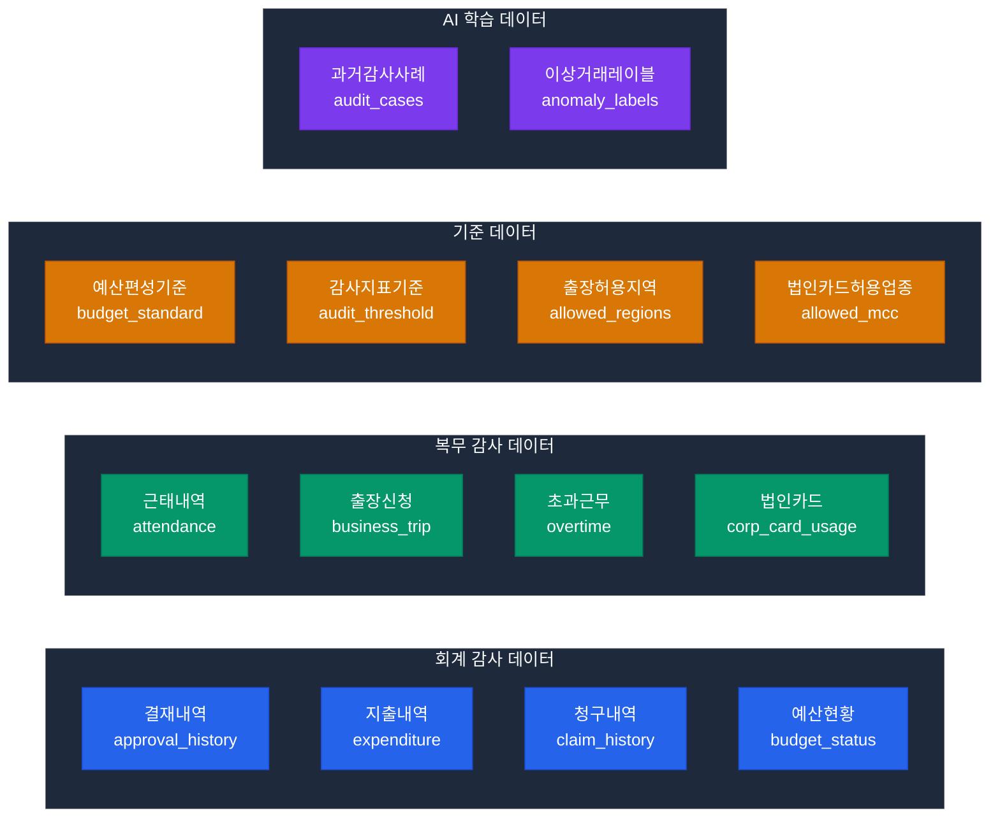

# POC 3 — 감사 지능화 원천 데이터 요구사항

> **기준일**: 2026-04-13  
> **목적**: 사전 감사 지능화 POC에 필요한 원천 데이터 목록, 테이블 구조, 샘플 데이터, 감사 지표 정의

---

## 1. 원천 데이터 전체 목록



| # | 테이블명 | 분류 | 우선순위 | 행 수(최소) | 기간 |
|---|---------|------|:-------:|:----------:|------|
| 1 | 결재내역 (approval_history) | 회계 | P0 | 10,000+ | 최근 2년 |
| 2 | 지출내역 (expenditure) | 회계 | P0 | 50,000+ | 최근 2년 |
| 3 | 법인카드 사용내역 (corp_card_usage) | 복무 | P0 | 30,000+ | 최근 2년 |
| 4 | 출장신청내역 (business_trip) | 복무 | P0 | 5,000+ | 최근 2년 |
| 5 | 근태내역 (attendance) | 복무 | P1 | 100,000+ | 최근 1년 |
| 6 | 초과근무내역 (overtime) | 복무 | P1 | 20,000+ | 최근 1년 |
| 7 | 청구내역 (claim_history) | 회계 | P1 | 20,000+ | 최근 2년 |
| 8 | 예산현황 (budget_status) | 기준 | P1 | 1,000+ | 최근 2년 |
| 9 | 감사지표기준 (audit_threshold) | 기준 | P0 | 50+ | 현재 |
| 10 | 과거감사사례 (audit_cases) | AI학습 | P2 | 200+ | 최근 5년 |

---

## 2. 테이블 구조 상세

### 2.1 결재내역 (approval_history) — P0

```sql
CREATE TABLE approval_history (
    approval_id     VARCHAR(20)     PRIMARY KEY,    -- 결재 ID
    doc_type        VARCHAR(20)     NOT NULL,       -- 문서 유형 (지출, 청구, 출장 등)
    doc_title       VARCHAR(200)    NOT NULL,       -- 문서 제목
    requester_id    VARCHAR(10)     NOT NULL,       -- 기안자 사번
    dept_cd         VARCHAR(10)     NOT NULL,       -- 부서 코드
    amount          DECIMAL(15,2),                  -- 결재 금액
    request_date    DATE            NOT NULL,       -- 기안일
    approve_date    DATE,                           -- 최종 결재일
    status          CHAR(1)         NOT NULL,       -- P:대기 / A:승인 / R:반려
    approver_path   VARCHAR(500),                   -- 결재선 (JSON)
    remarks         VARCHAR(1000)                   -- 비고
);
```

#### 샘플 데이터

```sql
INSERT INTO approval_history VALUES
('APV20240101001', '지출', '사무용품 구매 요청', 'E001234', 'DEPT01', 150000.00, '2024-01-15', '2024-01-16', 'A', '["팀장:E002","부장:E003"]', NULL),
('APV20240101002', '출장', '서울 출장 신청', 'E001235', 'DEPT01', 350000.00, '2024-01-15', '2024-01-16', 'A', '["팀장:E002"]', '서울 본사 업무 협의'),
('APV20240101003', '지출', '교육 참가비 청구', 'E001236', 'DEPT02', 200000.00, '2024-01-15', NULL, 'P', '["팀장:E004","부장:E005"]', NULL),
-- 이상 패턴 (쪼개기 결제 예시):
('APV20240115001', '지출', '비품 구매 A', 'E001237', 'DEPT03', 495000.00, '2024-01-15', '2024-01-15', 'A', '["팀장:E006"]', NULL),
('APV20240115002', '지출', '비품 구매 B', 'E001237', 'DEPT03', 490000.00, '2024-01-15', '2024-01-16', 'A', '["팀장:E006"]', NULL),
('APV20240115003', '지출', '비품 구매 C', 'E001237', 'DEPT03', 480000.00, '2024-01-16', '2024-01-16', 'A', '["팀장:E006"]', NULL);
-- ↑ 동일인이 2일 내 유사 금액 3건 결재 → 쪼개기 의심
```

### 2.2 지출내역 (expenditure) — P0

```sql
CREATE TABLE expenditure (
    exp_id          VARCHAR(20)     PRIMARY KEY,
    approval_id     VARCHAR(20),                    -- 결재 ID (참조)
    emp_id          VARCHAR(10)     NOT NULL,       -- 직원 사번
    dept_cd         VARCHAR(10)     NOT NULL,       -- 부서 코드
    account_cd      VARCHAR(10)     NOT NULL,       -- 계정과목 코드
    vendor_cd       VARCHAR(20),                    -- 거래처 코드
    vendor_nm       VARCHAR(100),                   -- 거래처명
    amount          DECIMAL(15,2)   NOT NULL,       -- 지출 금액
    exp_date        DATE            NOT NULL,       -- 지출일
    exp_type        VARCHAR(20),                    -- 지출 유형
    budget_cd       VARCHAR(20),                    -- 예산 항목 코드
    payment_method  VARCHAR(10),                    -- 결제 수단 (현금/카드/계좌이체)
    receipt_yn      CHAR(1)         DEFAULT 'N',    -- 영수증 첨부 여부
    remarks         VARCHAR(500)
);
```

#### 샘플 데이터

```sql
INSERT INTO expenditure VALUES
('EXP20240101001', 'APV20240101001', 'E001234', 'DEPT01', 'ACC501', 'V0001', '(주)문구사', 150000.00, '2024-01-16', '사무용품', 'BUD2024-01', '카드', 'Y', NULL),
('EXP20240101002', 'APV20240101002', 'E001235', 'DEPT01', 'ACC601', NULL, NULL, 350000.00, '2024-01-17', '출장여비', 'BUD2024-02', '계좌이체', 'Y', '서울 출장'),
-- 중복 청구 의심 패턴:
('EXP20240120001', NULL, 'E001238', 'DEPT04', 'ACC601', NULL, NULL, 280000.00, '2024-01-20', '출장여비', 'BUD2024-02', '계좌이체', 'Y', '부산 출장'),
('EXP20240125001', NULL, 'E001238', 'DEPT04', 'ACC601', NULL, NULL, 280000.00, '2024-01-25', '출장여비', 'BUD2024-02', '계좌이체', 'Y', '부산 출장');
-- ↑ 동일인, 동일 금액, 유사 기간 2건 → 중복 청구 의심
```

### 2.3 법인카드 사용내역 (corp_card_usage) — P0

```sql
CREATE TABLE corp_card_usage (
    usage_id        VARCHAR(20)     PRIMARY KEY,
    card_no         VARCHAR(20)     NOT NULL,       -- 카드번호 (마스킹)
    emp_id          VARCHAR(10)     NOT NULL,       -- 카드 소지자 사번
    usage_date      DATE            NOT NULL,       -- 사용일
    usage_time      TIME,                           -- 사용 시각
    usage_place     VARCHAR(200)    NOT NULL,       -- 사용처명
    usage_addr      VARCHAR(300),                   -- 사용처 주소
    usage_city      VARCHAR(50),                    -- 사용 도시
    mcc_code        VARCHAR(10),                    -- 가맹점업종코드(MCC)
    mcc_name        VARCHAR(100),                   -- 업종명
    amount          DECIMAL(15,2)   NOT NULL,       -- 사용 금액
    approval_no     VARCHAR(20),                    -- 카드사 승인번호
    corp_purpose    CHAR(1)         DEFAULT 'N',    -- 법인 목적 사용 여부
    linked_trip_id  VARCHAR(20)                     -- 연결된 출장 ID
);
```

#### 샘플 데이터 (이상 패턴 포함)

```sql
INSERT INTO corp_card_usage VALUES
-- 정상 출장 중 사용
('CRD20240115001', '****-1234', 'E001235', '2024-01-15', '12:30:00', '서울역 한식당', '서울 용산구', '서울', '5812', '식당', 45000.00, 'AUTH001', 'Y', 'TRIP001'),
('CRD20240115002', '****-1234', 'E001235', '2024-01-15', '19:00:00', '서울 KTX 숙박', '서울 중구', '서울', '7011', '숙박', 120000.00, 'AUTH002', 'Y', 'TRIP001'),
-- 이상 패턴 1: 출장지(서울)와 카드 사용지(부산) 불일치
('CRD20240120001', '****-5678', 'E001239', '2024-01-20', '11:00:00', '부산 해운대 식당', '부산 해운대구', '부산', '5812', '식당', 85000.00, 'AUTH010', 'Y', 'TRIP002'),
-- ↑ TRIP002는 서울 출장인데 부산에서 카드 사용 → 불일치
-- 이상 패턴 2: 비업무 시간 고액 사용
('CRD20240122001', '****-9012', 'E001240', '2024-01-22', '23:30:00', '강남 나이트클럽', '서울 강남구', '서울', '5813', '주점', 380000.00, 'AUTH020', 'N', NULL),
-- ↑ 23:30, 주점, 법인 목적 'N', 고액 → 부정 사용 의심
-- 이상 패턴 3: 비허용 업종
('CRD20240123001', '****-3456', 'E001241', '2024-01-23', '14:00:00', '소형 가전 매장', '서울 영등포구', '서울', '5999', '소매(기타)', 520000.00, 'AUTH030', 'N', NULL);
-- ↑ 비허용 업종 고액 → 개인 물품 구매 의심
```

### 2.4 출장신청내역 (business_trip) — P0

```sql
CREATE TABLE business_trip (
    trip_id         VARCHAR(20)     PRIMARY KEY,
    emp_id          VARCHAR(10)     NOT NULL,       -- 출장자 사번
    dept_cd         VARCHAR(10)     NOT NULL,       -- 부서
    trip_purpose    VARCHAR(500),                   -- 출장 목적
    dest_city       VARCHAR(50)     NOT NULL,       -- 목적지 도시
    dest_addr       VARCHAR(300),                   -- 목적지 주소
    departure_date  DATE            NOT NULL,       -- 출발일
    return_date     DATE            NOT NULL,       -- 복귀일
    approved_amount DECIMAL(15,2),                  -- 승인 여비
    actual_amount   DECIMAL(15,2),                  -- 실제 청구액
    approval_id     VARCHAR(20),                    -- 결재 ID
    status          CHAR(1),                        -- A:완료 / P:진행중 / C:취소
    remarks         VARCHAR(500)
);
```

#### 샘플 데이터

```sql
INSERT INTO business_trip VALUES
('TRIP001', 'E001235', 'DEPT01', '서울 본사 업무 협의', '서울', '서울 마포구 본사', '2024-01-15', '2024-01-16', 400000.00, 350000.00, 'APV20240101002', 'A', NULL),
('TRIP002', 'E001239', 'DEPT03', '고객사 현장 점검', '서울', '서울 강서구 고객사', '2024-01-20', '2024-01-20', 200000.00, 280000.00, NULL, 'A', '당일 출장'),
-- ↑ TRIP002: dest_city='서울'인데 부산에서 카드 사용 → 불일치
('TRIP003', 'E001242', 'DEPT02', '교육 참가', '세종', '세종시 정부청사', '2024-01-22', '2024-01-23', 350000.00, 420000.00, 'APV20240122001', 'A', '숙박비 초과'),
-- ↑ actual_amount > approved_amount 20% 초과 → 이상
('TRIP004', 'E001243', 'DEPT04', '현장 실사', '부산', '부산 남구 현장', '2024-01-25', '2024-01-26', 450000.00, 450000.00, 'APV20240125001', 'A', NULL);
```

### 2.5 근태내역 (attendance) — P1

```sql
CREATE TABLE attendance (
    att_id          VARCHAR(20)     PRIMARY KEY,
    emp_id          VARCHAR(10)     NOT NULL,
    att_date        DATE            NOT NULL,       -- 근무일
    work_type       VARCHAR(10),                   -- 정상/출장/연가/반차
    check_in_time   TIME,                           -- 출근 시각
    check_out_time  TIME,                           -- 퇴근 시각
    work_hours      DECIMAL(4,2),                  -- 실근무시간
    overtime_hours  DECIMAL(4,2)    DEFAULT 0,     -- 초과근무시간
    location        VARCHAR(50),                   -- 근무 위치 (사무실/재택/외근)
    approved_by     VARCHAR(10)                    -- 승인자 사번
);
```

#### 샘플 데이터 (이상 패턴 포함)

```sql
INSERT INTO attendance VALUES
-- 정상 패턴
('ATT20240102001', 'E001234', '2024-01-02', '정상', '08:55:00', '18:05:00', 8.0, 0.0, '사무실', 'E002'),
-- 이상 패턴 1: 비정상 초과근무 (평일 연속 야간 근무)
('ATT20240115001', 'E001245', '2024-01-15', '정상', '09:00:00', '00:30:00', 14.5, 6.5, '사무실', 'E004'),
('ATT20240116001', 'E001245', '2024-01-16', '정상', '09:00:00', '23:50:00', 13.8, 5.8, '사무실', 'E004'),
('ATT20240117001', 'E001245', '2024-01-17', '정상', '08:30:00', '23:45:00', 14.2, 6.2, '사무실', 'E004'),
-- ↑ 3일 연속 야간 근무 + 다음날 정상 출근 → 유령 초과근무 의심
-- 이상 패턴 2: 주말 고율 초과근무
('ATT20240120001', 'E001246', '2024-01-20', '초과근무', '10:00:00', '22:00:00', 12.0, 12.0, '사무실', 'E005'),
('ATT20240121001', 'E001246', '2024-01-21', '초과근무', '10:00:00', '22:00:00', 12.0, 12.0, '사무실', 'E005');
-- ↑ 주말 2일 각 12시간 초과 → 실제 근무 여부 확인 필요
```

### 2.6 초과근무내역 (overtime) — P1

```sql
CREATE TABLE overtime (
    ot_id           VARCHAR(20)     PRIMARY KEY,
    emp_id          VARCHAR(10)     NOT NULL,
    dept_cd         VARCHAR(10)     NOT NULL,
    ot_date         DATE            NOT NULL,
    ot_start_time   TIME            NOT NULL,
    ot_end_time     TIME            NOT NULL,
    ot_hours        DECIMAL(4,2)    NOT NULL,       -- 초과근무 시간
    ot_reason       VARCHAR(500),                   -- 사유
    approval_id     VARCHAR(20),                    -- 결재 ID
    pay_amount      DECIMAL(10,2),                  -- 수당 지급액
    approved_by     VARCHAR(10),
    pay_date        DATE                            -- 지급일
);
```

---

## 3. 감사 기준 데이터

### 3.1 감사지표 기준 (audit_threshold) — P0

```sql
CREATE TABLE audit_threshold (
    threshold_id    VARCHAR(20)     PRIMARY KEY,
    category        VARCHAR(20)     NOT NULL,       -- 감사 분류
    rule_name       VARCHAR(100)    NOT NULL,       -- 규칙명
    condition_type  VARCHAR(20),                    -- 조건 유형
    threshold_value DECIMAL(15,2),                  -- 임계 값
    threshold_unit  VARCHAR(20),                    -- 단위 (원, %, 건)
    period_days     INT,                            -- 적용 기간 (일)
    risk_level      VARCHAR(10),                    -- 위험 등급 (HIGH/MED/LOW)
    description     VARCHAR(500),
    effective_date  DATE            NOT NULL,
    is_active       CHAR(1)         DEFAULT 'Y'
);
```

#### 기준 데이터 (실제 운영 시 기관별 조정 필요)

```sql
INSERT INTO audit_threshold VALUES
-- 쪼개기 결제 탐지
('THR001', 'payment', '쪼개기결제_금액기준', 'amount', 500000.00, '원', 3, 'HIGH',
 '동일인이 3일 내 건당 50만원 미만 동일 계정 결재 3건 이상', '2024-01-01', 'Y'),
('THR002', 'payment', '쪼개기결제_누적기준', 'total_amount', 1000000.00, '원', 3, 'HIGH',
 '동일인이 3일 내 동일 계정 누적 100만원 이상 3건 분리', '2024-01-01', 'Y'),

-- 중복 청구 탐지
('THR003', 'duplicate', '중복청구_동일금액', 'similarity', 95.00, '%', 30, 'HIGH',
 '동일인이 30일 내 동일 금액 동일 계정 2건 이상 청구', '2024-01-01', 'Y'),
('THR004', 'duplicate', '중복청구_유사금액', 'amount_diff', 5.00, '%', 15, 'MED',
 '동일인이 15일 내 5% 이내 차이 동일 계정 2건 이상', '2024-01-01', 'Y'),

-- 이상 고액 결재
('THR005', 'amount', '고액결재_Z스코어', 'z_score', 2.50, 'sigma', 365, 'MED',
 '부서 연간 지출 평균 대비 Z-Score 2.5 초과', '2024-01-01', 'Y'),
('THR006', 'amount', '일일한도초과', 'daily_limit', 5000000.00, '원', 1, 'HIGH',
 '직원 1인 일일 결재 총액 500만원 초과', '2024-01-01', 'Y'),

-- 법인카드 이상 사용
('THR007', 'card', '비허용업종사용', 'mcc_allowed', 0.00, '코드', 1, 'HIGH',
 '법인카드 비허용 업종(주점,카지노,사행성 등) 사용', '2024-01-01', 'Y'),
('THR008', 'card', '야간고액사용', 'amount', 200000.00, '원', 1, 'MED',
 '22:00~06:00 법인카드 20만원 이상 사용', '2024-01-01', 'Y'),
('THR009', 'card', '출장지불일치', 'location_diff', 50.00, 'km', 1, 'HIGH',
 '출장 신청지와 카드 사용지 50km 이상 차이', '2024-01-01', 'Y'),

-- 초과근무 이상
('THR010', 'overtime', '일일초과한도', 'ot_hours', 4.00, '시간', 1, 'MED',
 '일일 초과근무 4시간 초과 (월 누적 52시간 법정 한도 고려)', '2024-01-01', 'Y'),
('THR011', 'overtime', '연속야근패턴', 'consecutive_days', 5.00, '일', 7, 'MED',
 '7일 내 5일 이상 22시 이후 퇴근', '2024-01-01', 'Y'),
('THR012', 'overtime', '월초과근무한도', 'monthly_ot', 52.00, '시간', 30, 'HIGH',
 '월 초과근무 52시간 초과 (근로기준법 위반 기준)', '2024-01-01', 'Y'),

-- 예산 집행 이상
('THR013', 'budget', '예산초과집행', 'budget_ratio', 95.00, '%', 30, 'HIGH',
 '부서 예산 항목 95% 이상 집행 후 추가 결재', '2024-01-01', 'Y'),
('THR014', 'budget', '연말집중집행', 'monthly_increase', 300.00, '%', 60, 'MED',
 '연말 2개월 내 전년 동기 대비 300% 이상 집행 증가', '2024-01-01', 'Y');
```

### 3.2 법인카드 허용 업종 코드 (allowed_mcc)

```sql
CREATE TABLE allowed_mcc (
    mcc_code        VARCHAR(10)     PRIMARY KEY,
    mcc_name        VARCHAR(100)    NOT NULL,
    allowed_yn      CHAR(1)         DEFAULT 'Y',
    max_amount      DECIMAL(10,2),                  -- 건당 한도 (NULL=무제한)
    require_receipt CHAR(1)         DEFAULT 'Y',    -- 영수증 필수 여부
    remarks         VARCHAR(200)
);

INSERT INTO allowed_mcc VALUES
('5812', '식당', 'Y', 100000.00, 'Y', '접대비 1인 5만원 이내 기준'),
('5411', '식료품점', 'Y', 50000.00, 'Y', NULL),
('7011', '호텔/숙박', 'Y', 200000.00, 'Y', '1박 기준'),
('5541', '주유소', 'Y', 100000.00, 'Y', NULL),
('5912', '약국', 'Y', 50000.00, 'Y', NULL),
('5044', '사무용품', 'Y', 500000.00, 'Y', NULL),
('4112', '철도(KTX)', 'Y', NULL, 'Y', NULL),
('4511', '항공권', 'Y', NULL, 'Y', NULL),
-- 비허용 업종
('5813', '주점/바', 'N', NULL, 'N', '개인 목적 사용 금지'),
('7011', '카지노', 'N', NULL, 'N', '사행성 업종'),
('7999', '오락시설', 'N', NULL, 'N', NULL),
('5999', '소매기타', 'N', NULL, 'N', '개인 물품 구매 의심');
```

### 3.3 출장 허용 지역 (allowed_regions)

```sql
CREATE TABLE allowed_regions (
    region_cd       VARCHAR(10)     PRIMARY KEY,
    region_nm       VARCHAR(50)     NOT NULL,
    region_type     VARCHAR(10),                    -- domestic/overseas
    daily_allowance DECIMAL(10,2),                  -- 일당 여비
    accommodation   DECIMAL(10,2),                  -- 숙박비 한도
    meal_allowance  DECIMAL(10,2),                  -- 식비 일당
    transport_limit DECIMAL(10,2)                   -- 교통비 한도
);

INSERT INTO allowed_regions VALUES
('REG001', '서울', 'domestic', 20000.00, 100000.00, 20000.00, 50000.00),
('REG002', '경기/인천', 'domestic', 15000.00, 80000.00, 20000.00, 40000.00),
('REG003', '부산', 'domestic', 20000.00, 120000.00, 20000.00, 80000.00),
('REG004', '대전/세종', 'domestic', 15000.00, 80000.00, 20000.00, 50000.00),
('REG005', '대구', 'domestic', 20000.00, 100000.00, 20000.00, 70000.00),
('REG006', '광주', 'domestic', 20000.00, 100000.00, 20000.00, 70000.00),
('REG007', '제주', 'domestic', 25000.00, 150000.00, 25000.00, 100000.00),
('REG008', '일본', 'overseas', 60000.00, 180000.00, 60000.00, 300000.00),
('REG009', '중국', 'overseas', 60000.00, 200000.00, 60000.00, 400000.00),
('REG010', '미국', 'overseas', 90000.00, 300000.00, 90000.00, 800000.00);
```

---

## 4. 감사 지표 정의

### 4.1 회계 감사 지표

| 지표 ID | 지표명 | 탐지 로직 | 위험 등급 | 수식 |
|---------|-------|---------|:-------:|------|
| AUD-ACC-01 | 쪼개기 결제 탐지 | 동일인 3일 내 50만원 미만 동일 계정 3건+ | 🔴 HIGH | `count(approval WHERE amount < 500000 AND days ≤ 3) >= 3` |
| AUD-ACC-02 | 중복 청구 탐지 | 동일인 30일 내 동일 금액 동일 계정 2건+ | 🔴 HIGH | `count(claim WHERE amount_diff < 5% AND days ≤ 30) >= 2` |
| AUD-ACC-03 | 이상 고액 결재 | 부서 평균 대비 Z-Score 2.5 초과 | 🟡 MED | `z_score = (amount - dept_mean) / dept_std > 2.5` |
| AUD-ACC-04 | 예산 초과 결재 | 예산 잔액 대비 결재 금액 초과 | 🔴 HIGH | `amount > remaining_budget` |
| AUD-ACC-05 | 연말 집중 집행 | 11~12월 월 집행액이 전년도 3배 초과 | 🟡 MED | `dec_amount / last_year_dec > 3.0` |
| AUD-ACC-06 | 비규격 거래처 | 미등록 거래처 고액 결재 | 🟡 MED | `vendor_cd NOT IN approved_vendors AND amount > 1000000` |

### 4.2 복무 감사 지표

| 지표 ID | 지표명 | 탐지 로직 | 위험 등급 | 수식 |
|---------|-------|---------|:-------:|------|
| AUD-WORK-01 | 출장-카드 불일치 | 출장지와 법인카드 사용지 50km+ 이상 차이 | 🔴 HIGH | `distance(trip.dest, card.usage_addr) > 50km` |
| AUD-WORK-02 | 비허용 업종 카드 사용 | 법인카드로 비허용 업종(주점 등) 결제 | 🔴 HIGH | `mcc_code IN (SELECT mcc FROM allowed_mcc WHERE allowed_yn='N')` |
| AUD-WORK-03 | 야간 고액 카드 사용 | 22시~06시 20만원 이상 법인카드 사용 | 🟠 MED | `usage_time BETWEEN '22:00' AND '06:00' AND amount >= 200000` |
| AUD-WORK-04 | 비정상 초과근무 패턴 | 주 5일 연속 22시 이후 퇴근 | 🟡 MED | `count(attendance WHERE check_out >= '22:00' AND weekdays) >= 5` |
| AUD-WORK-05 | 월 초과근무 법정 한도 | 월 52시간 초과근무 초과 | 🔴 HIGH | `sum(ot_hours monthly) > 52` |
| AUD-WORK-06 | 유령 출장 의심 | 출장 중 근무지 카드 사용 | 🟡 MED | `trip.status='진행중' AND card.usage_city = '근무지'` |
| AUD-WORK-07 | 출장여비 초과 청구 | 청구액이 승인액 20% 이상 초과 | 🟡 MED | `actual_amount > approved_amount * 1.20` |

### 4.3 리스크 스코어 계산

```python
# audit-anomaly 서비스의 리스크 스코어 계산 로직
RISK_WEIGHTS = {
    "AUD-ACC-01": 0.25,   # 쪼개기 결제 (가장 심각)
    "AUD-ACC-02": 0.25,   # 중복 청구
    "AUD-ACC-03": 0.10,   # 이상 고액
    "AUD-ACC-04": 0.15,   # 예산 초과
    "AUD-ACC-05": 0.05,   # 연말 집중
    "AUD-ACC-06": 0.05,   # 비규격 거래처
    "AUD-WORK-01": 0.25,  # 출장-카드 불일치
    "AUD-WORK-02": 0.30,  # 비허용 업종
    "AUD-WORK-03": 0.10,  # 야간 고액
    "AUD-WORK-04": 0.08,  # 비정상 초과근무
    "AUD-WORK-05": 0.20,  # 월 한도 초과
    "AUD-WORK-06": 0.15,  # 유령 출장
    "AUD-WORK-07": 0.07,  # 여비 초과 청구
}

RISK_LEVELS = {
    "RED":    (0.15, 1.00, "즉시 감사 착수"),
    "ORANGE": (0.08, 0.15, "1주 내 확인 요청"),
    "YELLOW": (0.03, 0.08, "월간 모니터링"),
    "GREEN":  (0.00, 0.03, "정상"),
}

def calculate_risk_score(anomalies: list[dict]) -> float:
    """발견된 이상 징후 목록으로 리스크 스코어 계산"""
    score = 0.0
    for anomaly in anomalies:
        rule_id = anomaly["rule_id"]
        severity = anomaly.get("severity", 1.0)  # 0.0~1.0
        weight = RISK_WEIGHTS.get(rule_id, 0.05)
        score += weight * severity
    return min(score, 1.0)
```

### 4.4 대시보드 집계 지표

| 지표명 | 계산 주기 | 집계 단위 | 표시 방식 |
|--------|---------|---------|---------|
| 부서별 월간 리스크 점수 | 일 1회 (07:00) | 부서 × 월 | 히트맵 |
| 이상 탐지 건수 추이 | 일 1회 | 지표 유형 × 주간 | 라인 차트 |
| 위험 등급별 현황 | 실시간 | 전체 | 도넛 차트 |
| 미처리 이상 건 현황 | 실시간 | 부서별 | 바 차트 |
| 직원별 누적 리스크 | 주 1회 | 직원 × 지표 | 테이블 |

---

## 5. 데이터 수집 파이프라인

### 5.1 배치 처리 스케줄 (APScheduler)

```python
# audit-anomaly/src/scheduler.py
from apscheduler.schedulers.asyncio import AsyncIOScheduler

scheduler = AsyncIOScheduler()

# 매일 07:00 — 전일 데이터 분석
@scheduler.scheduled_job('cron', hour=7, minute=0)
async def daily_audit_analysis():
    """전날 결재/지출/카드 데이터 이상 탐지"""
    await run_accounting_audit(target_date=yesterday())
    await run_attendance_audit(target_date=yesterday())
    await update_risk_scores()
    await trigger_alerts_if_needed()

# 매주 월요일 08:00 — 주간 리스크 리포트
@scheduler.scheduled_job('cron', day_of_week='mon', hour=8)
async def weekly_risk_report():
    """주간 부서별 리스크 리포트 생성 및 감사팀 발송"""
    report = await generate_weekly_report()
    await notify_service.send_report(report, recipients=AUDIT_TEAM)

# 실시간 — 결재 이벤트 (Webhook 또는 폴링)
@scheduler.scheduled_job('interval', minutes=15)
async def realtime_approval_check():
    """15분마다 신규 결재 건 실시간 이상 탐지"""
    new_approvals = await fetch_new_approvals()
    for approval in new_approvals:
        anomalies = await detect_anomalies(approval)
        if anomalies:
            await notify_service.alert(anomalies)
```

### 5.2 데이터 수집 쿼리 (sql-runner 활용)

```sql
-- 일일 결재 데이터 수집
SELECT
    a.approval_id,
    a.requester_id,
    a.dept_cd,
    a.amount,
    a.request_date,
    a.doc_type,
    COUNT(*) OVER (
        PARTITION BY a.requester_id, a.doc_type
        ORDER BY a.request_date
        RANGE BETWEEN INTERVAL '3' DAY PRECEDING AND CURRENT ROW
    ) AS recent_3day_count,
    SUM(a.amount) OVER (
        PARTITION BY a.requester_id, a.doc_type
        ORDER BY a.request_date
        RANGE BETWEEN INTERVAL '3' DAY PRECEDING AND CURRENT ROW
    ) AS recent_3day_total
FROM approval_history a
WHERE a.request_date = CURRENT_DATE - INTERVAL '1' DAY
  AND a.status IN ('P', 'A');

-- 출장-카드 불일치 탐지
SELECT
    t.trip_id,
    t.emp_id,
    t.dest_city,
    c.usage_city,
    c.usage_date,
    c.amount,
    c.usage_place
FROM business_trip t
JOIN corp_card_usage c ON t.emp_id = c.emp_id
    AND c.usage_date BETWEEN t.departure_date AND t.return_date
WHERE t.status = 'A'
  AND t.dest_city != c.usage_city  -- 도시 불일치
  AND c.usage_date >= CURRENT_DATE - INTERVAL '1' DAY;
```

---

## 6. 샘플 데이터 생성 스크립트

> 실제 ERP DB 접근 전 개발/테스트용 샘플 데이터 생성

```python
# scripts/generate_audit_sample_data.py
import random
from datetime import date, timedelta, datetime
import json

def generate_sample_data(num_employees=100, months=24):
    """POC 개발용 샘플 감사 데이터 생성"""
    
    employees = [f"E{str(i).zfill(6)}" for i in range(1, num_employees+1)]
    departments = ["DEPT01", "DEPT02", "DEPT03", "DEPT04", "DEPT05"]
    
    approvals = []
    for i in range(num_employees * months * 5):  # 직원당 월 5건 평균
        emp_id = random.choice(employees)
        # 10%는 이상 패턴 삽입
        if random.random() < 0.10:
            approvals.append(generate_anomaly_pattern(emp_id))
        else:
            approvals.append(generate_normal_approval(emp_id))
    
    return approvals

def generate_anomaly_pattern(emp_id):
    """이상 패턴 데이터 생성 (학습용 레이블 포함)"""
    pattern_type = random.choice(["split_payment", "duplicate_claim", "amount_outlier"])
    
    if pattern_type == "split_payment":
        # 쪼개기 결제: 3일 내 499,000원 3건
        base_date = date.today() - timedelta(days=random.randint(1, 365))
        return [
            {"amount": 499000, "date": base_date, "anomaly_label": "split_payment"},
            {"amount": 497000, "date": base_date + timedelta(days=1), "anomaly_label": "split_payment"},
            {"amount": 498000, "date": base_date + timedelta(days=2), "anomaly_label": "split_payment"},
        ]
    # ... 기타 패턴
```

---

*이 문서의 샘플 데이터는 POC 개발/테스트 전용입니다. 실제 운영 시 실 ERP 데이터로 교체하고, 개인정보 보호 원칙에 따라 가명처리 후 사용하세요.*
