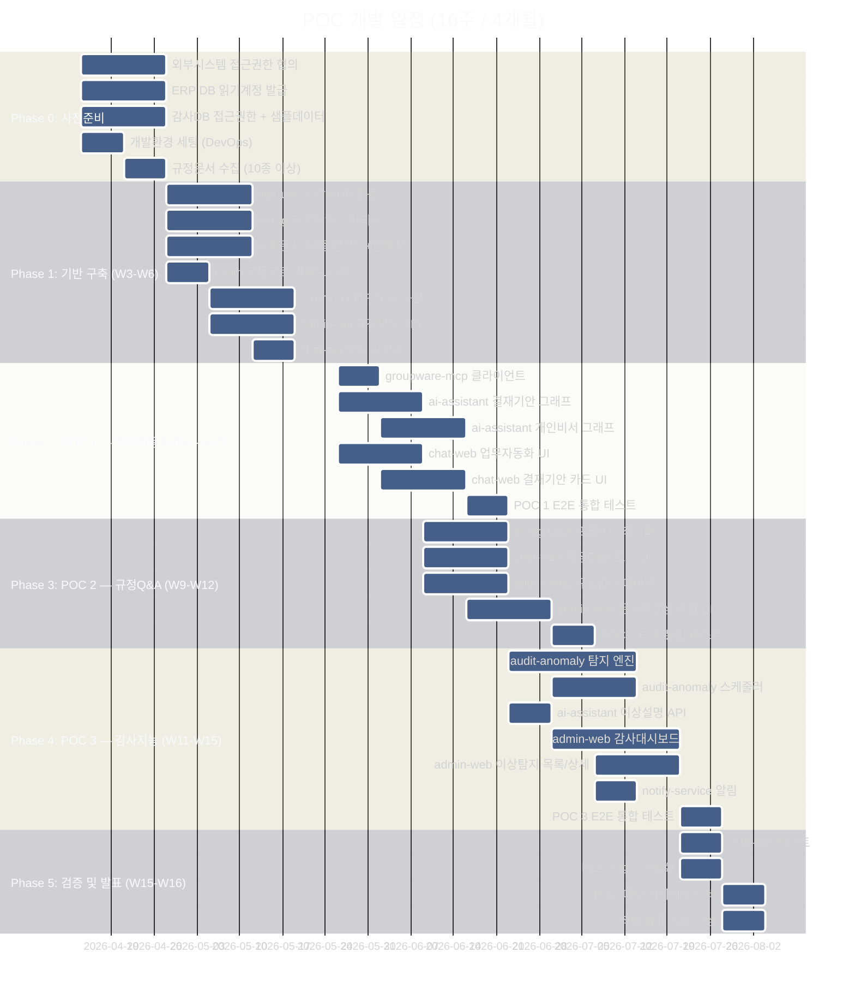

# POC 프로젝트 계획 (시나리오 A — 완전 구현 참고용)

> **행정정보시스템 1단계 AI 도입 POC**
> 작성일: 2026-04-21
> 총 기간: **16주 (4개월)**
> 총 인력: **8명**

> **📌 본 문서는 시나리오 A (완전 구현, 9과제 전체, 예산 풀스케일) 기준입니다.**
>
> 권장 시나리오는 **시나리오 B (단계형)**: 13주 / 2인 / 약 2억 900만원.
> - [challenges/14-pre-proposal-scenarios.md](challenges/14-pre-proposal-scenarios.md) — 3 시나리오 비교
> - [challenges/15-per-challenge-decision-points.md](challenges/15-per-challenge-decision-points.md) — 과제별 결정 포인트 및 P0 3대 결정

---

## 1. 팀 구성 및 역할

### 1.1 인력 구성표

| # | 역할 | 기술 등급 | 인원 | 주요 담당 |
|---|------|----------|:---:|---------|
| 1 | **PM (프로젝트 매니저)** | 시니어 (10년+) | 1명 | 일정·품질·이해관계자 관리, 리스크 대응 |
| 2 | **AI/ML 엔지니어** | 상급 (5년+) | 1명 | LangGraph 설계, RAG 파이프라인 아키텍처, 품질 기준 수립 |
| 3 | **AI/ML 엔지니어** | 중급 (3년+) | 1명 | 프롬프트 엔지니어링, 임베딩 최적화, 감사 모델 구현 |
| 4 | **백엔드 개발자** | 중급 (3년+) | 1명 | NestJS (chat-api, admin-api), API 설계 |
| 5 | **백엔드 개발자** | 중급 (3년+) | 1명 | FastAPI (ai-assistant, ai-rag, sql-runner) |
| 6 | **프론트엔드 개발자** | 중급 (3년+) | 1명 | Next.js (chat-web, admin-web), 접근성 |
| 7 | **DevOps 엔지니어** | 중급 (3년+) | 1명 | Docker Compose, CI/CD, 모니터링, 환경 관리 |
| 8 | **데이터 엔지니어** | 중급 (3년+) | 1명 | ERP/감사 DB 연동, 데이터 파이프라인, 샘플 데이터 |

### 1.2 역할별 기술 요건

| 역할 | 필수 기술 스택 | 우대 경험 |
|------|--------------|---------|
| AI/ML 상급 | Python, LangGraph, Milvus, RAG, LLM Fine-tuning | 행정 문서 NLP, 이상탐지 ML |
| AI/ML 중급 | Python, FastAPI, LangChain, Prompt Engineering | 한국어 NLP, RAGAS 평가 |
| 백엔드 (NestJS) | NestJS 11, TypeORM, TypeScript, REST API | ts-rest, PostgreSQL, SSE |
| 백엔드 (FastAPI) | Python, FastAPI, asyncio, SQLAlchemy | MCP 프로토콜, vLLM |
| 프론트엔드 | Next.js 15, React, TanStack Query, Tailwind | WCAG 접근성, SSE |
| DevOps | Docker, Docker Compose, CI/CD, Linux | Nginx, Prometheus, Grafana |
| 데이터 엔지니어 | SQL (Oracle/PostgreSQL/MSSQL), ETL | ERP 시스템 (SAP/영림원/더존) |

---

## 2. 단계별 일정 계획 (16주)



---

## 3. 주차별 상세 계획

### Phase 0: 사전 준비 (W1-W2, 2주)

| 주차 | 역할 | 작업 내용 | 완료 기준 |
|------|------|---------|---------|
| W1 | DevOps | Docker Compose 전체 스택 기동, GPU 서버 설정 | 전체 서비스 로컬 기동 확인 |
| W1 | 데이터엔지니어 | ERP DB 접근권한 신청, 테이블 목록 파악 | 접근권한 신청 완료 |
| W1 | PM | 외부시스템 연동 협의 일정 수립, 이해관계자 연락처 확인 | 협의 일정 확정 |
| W2 | 데이터엔지니어 | 감사 DB 접근권한 협의, 샘플 데이터 수령 | 샘플 데이터 10,000건 이상 |
| W2 | AI/ML 상급 | ai-rag 기존 코드 분석, 규정 청킹 전략 설계 | 설계 문서 작성 완료 |
| W2 | PM | 규정 문서 수집 계획 수립, 담당 부서 협조 요청 | 규정 문서 10종 목록 확정 |

> **⚠️ 리스크**: ERP/감사DB 접근권한 발급이 지연될 경우 Mock 데이터로 Phase 1 진행.  
> 외부 협의 지연 시 W3부터 Mock 모드로 개발 시작, 권한 발급 시 실제 연동으로 교체.

---

### Phase 1: 기반 구축 (W3-W6, 4주)

#### W3-W4: 데이터 파이프라인 + AI 기반

| 역할 | 작업 | 산출물 |
|------|------|-------|
| 데이터엔지니어 | sql-runner 감사DB 드라이버 연결, 집계 쿼리 구현 | TASK-SQL-01~02 완료 |
| AI/ML 상급 | ai-rag 행정규정 청킹 클래스, Milvus 파티션 6개 생성 | TASK-RAG-01~02 완료 |
| AI/ML 중급 | ai-llm 프롬프트 라이브러리 4종, POC 엔드포인트 구현 | TASK-LLM-01~02 완료 |
| DevOps | CI/CD 파이프라인, STG 환경 구성 | STG 환경 기동 |

#### W5-W6: API + 연동

| 역할 | 작업 | 산출물 |
|------|------|-------|
| 데이터엔지니어 | erp-mcp MCP 도구 5종 구현 (마감업무, 지출정보, 예산현황) | TASK-ERP-01~03 완료 |
| 백엔드 (NestJS) | admin-api 규정관리 API + ts-rest 계약 + TypeORM 엔티티 | TASK-API-01~03 완료 |
| 백엔드 (FastAPI) | chat-api 모드 라우팅 + SSE 이벤트 타입 정의 | TASK-CAPI-01~03 완료 |
| AI/ML 중급 | 규정문서 10종 업로드 + 청킹 + 인덱싱 검증 | 규정 Q&A 기본 동작 확인 |

**Phase 1 완료 기준:**
- 규정 문서 10종 이상 ai-rag 인덱싱 완료
- ERP MCP 도구 5종 동작 확인 (Mock 또는 실제 DB)
- sql-runner 감사 집계 쿼리 동작 확인
- chat-api 모드 라우팅 SSE 스트리밍 동작

---

### Phase 2: POC 1 — ERP 업무 자동화 (W7-W10, 4주)

#### W7-W8: AI 그래프 구현

| 역할 | 작업 | 산출물 |
|------|------|-------|
| AI/ML 상급 | ai-assistant groupware-mcp 클라이언트 + 결재기안 LangGraph | TASK-AI-01~02 완료 |
| AI/ML 중급 | ai-assistant 개인비서 LangGraph (3-way 병렬) | TASK-AI-03 완료 |
| 프론트엔드 | chat-web 채팅 모드 선택 UI + 업무자동화 전용 UI | TASK-CWEB-01~02 착수 |
| 백엔드 (NestJS) | chat-api chat_mode 연동 완료 | TASK-CAPI-04 완료 |

#### W9-W10: UI 완성 + POC 1 통합 테스트

| 역할 | 작업 | 산출물 |
|------|------|-------|
| 프론트엔드 | chat-web 결재기안 미리보기 카드, 업무우선순위 카드 UI | TASK-CWEB-01~03 완료 |
| AI/ML 중급 | ai-assistant Intent 분류 → 시나리오 라우팅 | TASK-AI-05 완료 |
| DevOps | POC 1 통합 테스트 환경, 그룹웨어 Mock 서버 구성 | 테스트 환경 준비 |
| 전체 | POC 1 E2E 시나리오 테스트 | 3개 시나리오 Pass |

**POC 1 완료 기준:**
- "출장비 청구 기안 작성해줘" → 기안 초안 생성 + 그룹웨어 Mock 등록
- "오늘 처리할 업무 알려줘" → ERP 마감 + 그룹웨어 일정 통합 우선순위 응답
- 채팅 모드 전환 UI 동작 확인

---

### Phase 3: POC 2 — 규정 문서 지능 (W9-W12, 4주)

> Phase 2와 W9-W10 병행 진행 (AI/ML 중급은 Phase 2 전담, 프론트엔드 병행)

#### W9-W10: 규정 Q&A 품질 향상

| 역할 | 작업 | 산출물 |
|------|------|-------|
| AI/ML 상급 | ai-rag 규정 버전 관리, Q&A 프롬프트 최적화 | TASK-RAG-03~04 완료 |
| 프론트엔드 | chat-web 규정 Q&A 전용 UI + 근거조항 패널 | TASK-CWEB-01 완료 |
| 백엔드 (NestJS) | admin-web 규정 목록 + 업로드 페이지 | TASK-WEB-01 착수 |

#### W11-W12: 문서 적합성 점검 + 통합 테스트

| 역할 | 작업 | 산출물 |
|------|------|-------|
| 프론트엔드 | admin-web 문서적합성 점검 UI (파일업로드 + 결과) | TASK-WEB-02 완료 |
| 백엔드 (NestJS) | admin-web 규정 상세 페이지 | TASK-WEB-01 완료 |
| AI/ML 중급 | 문서 적합성 점검 파이프라인 E2E 테스트 | POC 2 시나리오 Pass |
| 전체 | POC 2 통합 테스트 | 5개 시나리오 Pass |

**POC 2 완료 기준:**
- 규정 문서 업로드 → 조항 단위 인덱싱 확인
- "연가 일수가 어떻게 되나요?" → 조항 번호 포함 답변
- 공문서 PDF 업로드 → 규정 준수율 점수 + 위반 항목 목록
- 규정 개정 시 이전 버전 비활성화 확인

---

### Phase 4: POC 3 — 감사 지능화 (W11-W15, 5주)

#### W11-W13: 감사 탐지 엔진

| 역할 | 작업 | 산출물 |
|------|------|-------|
| 데이터엔지니어 | audit-anomaly 서비스 구현 (14개 탐지 규칙) | AUD-ACC-01~14 완료 |
| 데이터엔지니어 | 리스크 스코어링 엔진 (Isolation Forest, Z-Score) | 스코어링 동작 확인 |
| AI/ML 상급 | ai-assistant 이상패턴 설명 API + ai-rag 연동 | TASK-AI-04 완료 |
| 백엔드 (NestJS) | admin-api 감사 이상 탐지 API (ts-rest 계약) | TASK-API-02 완료 |

#### W13-W15: 대시보드 + 알림

| 역할 | 작업 | 산출물 |
|------|------|-------|
| 프론트엔드 | admin-web 감사 대시보드 (KPI, 히트맵, 차트) | TASK-WEB-03 착수 |
| 프론트엔드 | admin-web 이상탐지 목록 + 상세 + 처리이력 | TASK-WEB-03 완료 |
| 백엔드 (FastAPI) | notify-service SSE 알림 (이상 탐지 실시간) | TASK-WEB-04 연동 |
| 데이터엔지니어 | APScheduler 배치 파이프라인 (일별 07:00) | 배치 동작 확인 |

**Phase 4 완료 기준 (W15 말):**
- 샘플 데이터 → 분할 지출 탐지 E2E (AUD-ACC-01)
- 법인카드 출장지 불일치 탐지 E2E (AUD-ACC-04)
- 이상 탐지 → AI 설명 생성 → 대시보드 표시
- 실시간 알림 (감사 벨 아이콘) 동작 확인

---

### Phase 5: 검증 및 발표 준비 (W15-W16, 2주)

| 역할 | 작업 | 산출물 |
|------|------|-------|
| PM | 전체 시나리오 검증 체크리스트 실행 | 결과 보고서 |
| 전체 | 버그 수정 + 성능 최적화 (응답 3초 이내) | 안정화 완료 |
| PM + AI/ML 상급 | POC 데모 시나리오 3종 준비 (POC 1/2/3) | 데모 스크립트 |
| PM | 최종 발표 자료 작성 | PPT + 시연 영상 |

---

## 4. 역할별 주차 투입 계획 (FTE 기준)

| 역할 | W1-2 | W3-4 | W5-6 | W7-8 | W9-10 | W11-12 | W13-14 | W15-16 |
|------|:---:|:---:|:---:|:---:|:---:|:---:|:---:|:---:|
| PM | 100% | 60% | 60% | 60% | 60% | 60% | 60% | 100% |
| AI/ML 상급 | 40% | 100% | 80% | 100% | 80% | 80% | 100% | 60% |
| AI/ML 중급 | 20% | 80% | 80% | 100% | 100% | 80% | 60% | 60% |
| 백엔드 (NestJS) | 20% | 60% | 100% | 80% | 100% | 100% | 80% | 60% |
| 백엔드 (FastAPI) | 20% | 60% | 100% | 100% | 80% | 60% | 80% | 60% |
| 프론트엔드 | 10% | 20% | 40% | 100% | 100% | 100% | 100% | 80% |
| DevOps | 100% | 80% | 60% | 60% | 60% | 60% | 60% | 80% |
| 데이터엔지니어 | 100% | 100% | 100% | 80% | 80% | 100% | 100% | 60% |

---

## 5. 주요 리스크 및 대응 방안

| 리스크 | 발생 확률 | 영향도 | 대응 방안 |
|--------|:-------:|:-----:|---------|
| ERP DB 접근권한 지연 (4주+) | 높음 | 높음 | Mock ERP 데이터셋으로 개발, 권한 발급 시 교체 |
| 그룹웨어 API 미제공 | 중간 | 높음 | FastMCP Mock 서버 구축, DB Direct 대안 협의 |
| GPU 서버 스팩 부족 (vLLM OOM) | 중간 | 중간 | 모델 양자화(4bit), 배치 크기 축소 |
| 규정 문서 수집 지연 | 중간 | 중간 | 공개 규정 대체 (법령정보시스템), 핵심 5종 우선 |
| LLM 한국어 행정 품질 미달 | 중간 | 중간 | 프롬프트 반복 튜닝, Few-shot 예시 추가 |
| 감사 DB 샘플 데이터 부족 | 낮음 | 높음 | 05-audit-data-requirements.md 합성 데이터 사용 |
| 인력 이탈 (1명) | 낮음 | 중간 | 상급 엔지니어가 1주 커버, PM이 우선순위 조정 |

---

## 6. 비용 추정 (4개월 기준)

### 6.1 인건비

| 역할 | 월 단가 (추정) | 4개월 합계 |
|------|:----------:|:--------:|
| PM 시니어 1명 | 850만원 | 3,400만원 |
| AI/ML 상급 1명 | 800만원 | 3,200만원 |
| AI/ML 중급 1명 | 650만원 | 2,600만원 |
| 백엔드 중급 2명 | 600만원 × 2 | 4,800만원 |
| 프론트엔드 중급 1명 | 580만원 | 2,320만원 |
| DevOps 중급 1명 | 620만원 | 2,480만원 |
| 데이터엔지니어 중급 1명 | 650만원 | 2,600만원 |
| **인건비 소계** | | **21,400만원** |

### 6.2 인프라 비용 (4개월)

| 항목 | 월 비용 | 4개월 합계 |
|------|:------:|:--------:|
| GPU 서버 (A100 40GB × 2) | 400만원 | 1,600만원 |
| CPU 서버 (app + DB) | 80만원 | 320만원 |
| 네트워크/스토리지 | 30만원 | 120만원 |
| **인프라 소계** | | **2,040만원** |

### 6.3 기타

| 항목 | 비용 |
|------|:---:|
| LLM API 비용 (외부 API 대체 시) | 200만원 |
| 소프트웨어 라이선스 | 100만원 |
| 테스트/QA 비용 | 200만원 |
| **기타 소계** | **500만원** |

### 6.4 총 예산

| 구분 | 금액 |
|------|:---:|
| 인건비 | 21,400만원 |
| 인프라 | 2,040만원 |
| 기타 | 500만원 |
| **합계 (VAT 제외)** | **23,940만원** |
| **합계 (VAT 포함)** | **약 2억 6,300만원** |

---

## 7. POC 성공 기준 (KPI)

### POC 1: ERP 업무 자동화

| 지표 | 목표 | 측정 방법 |
|------|:---:|---------|
| 결재 기안 생성 성공률 | ≥ 80% | 10개 시나리오 테스트 |
| 기안 생성 응답 시간 | ≤ 10초 | E2E 측정 |
| 개인 비서 응답 정확도 | ≥ 70% | 담당자 평가 |
| 병렬 데이터 수집 시간 | ≤ 5초 | ERP+그룹웨어 동시 조회 |

### POC 2: 규정 문서 지능

| 지표 | 목표 | 측정 방법 |
|------|:---:|---------|
| 규정 Q&A 정확도 | ≥ 85% | 30개 테스트 질문 |
| 조항 번호 출처 포함률 | ≥ 90% | 응답 분석 |
| 문서 적합성 점검 정확도 | ≥ 75% | 전문가 검토 비교 |
| 규정 검색 응답 시간 | ≤ 5초 | SSE 첫 토큰 |

### POC 3: 감사 지능화

| 지표 | 목표 | 측정 방법 |
|------|:---:|---------|
| 이상 탐지 정밀도 (Precision) | ≥ 70% | 샘플 데이터 검증 |
| 이상 탐지 재현율 (Recall) | ≥ 80% | 알려진 이상 패턴 검출 |
| AI 설명 이해도 | ≥ 80% | 감사 담당자 설문 |
| 배치 처리 시간 | ≤ 2시간/일 | 일별 07:00 완료 기준 |

---

## 8. 주차별 마일스톤

| 마일스톤 | 주차 | 완료 기준 |
|---------|:---:|---------|
| **M0**: 개발환경 완성 | W2 말 | 전체 서비스 로컬 기동, STG 환경 구성 |
| **M1**: 기반 인프라 완성 | W6 말 | 규정 인덱싱, ERP MCP, 감사 DB 연동 |
| **M2**: POC 1 데모 가능 | W10 말 | 결재 기안 + 개인 비서 E2E 시나리오 |
| **M3**: POC 2 데모 가능 | W12 말 | 규정 Q&A + 문서 적합성 E2E 시나리오 |
| **M4**: POC 3 데모 가능 | W15 말 | 감사 탐지 + 대시보드 E2E 시나리오 |
| **M5**: 최종 발표 | W16 말 | 전체 POC 통합 시연 + 발표 자료 |

---

## 9. 회의 및 보고 체계

| 회의 | 주기 | 참석자 | 목적 |
|------|:---:|-------|------|
| 일일 스탠드업 | 매일 09:30 | 전체 팀 | 진행 상황, 블로커 공유 (15분) |
| 주간 기술 리뷰 | 매주 금요일 | 개발팀 | 코드 리뷰, 기술 이슈 해결 |
| 마일스톤 리뷰 | 마일스톤 완료 시 | PM + 이해관계자 | 진행 상황 보고, 방향 조정 |
| 위험 검토 | 격주 | PM + 팀장급 | 리스크 현황, 대응 방안 |

---

## 10. 개발 완료 이후 고려사항

```
본 POC 결과를 바탕으로 본 사업 전환 시 추가 필요 사항:

1. 확장성: 멀티테넌트 + 수백 명 동시 접속 대응 (쿠버네티스 전환 검토)
2. 보안: 개인정보보호법 준수 (마스킹, 접근 로그, 암호화)
3. 고가용성: DB 이중화, LLM 서버 이중화
4. 그룹웨어 연동: Mock → 실제 REST API 또는 DB Direct 전환
5. ERP 연동: 읽기 전용 → 쓰기 권한 (결재 등록, 기안 제출)
6. 규정 관리: 정기적인 규정 개정 반영 프로세스 수립
7. LLM 고도화: POC 결과 기반 Fine-tuning 또는 모델 교체 검토
8. 운영 조직: AI 서비스 운영팀 구성 (최소 2명: AI 운영 + 데이터 관리)
```
