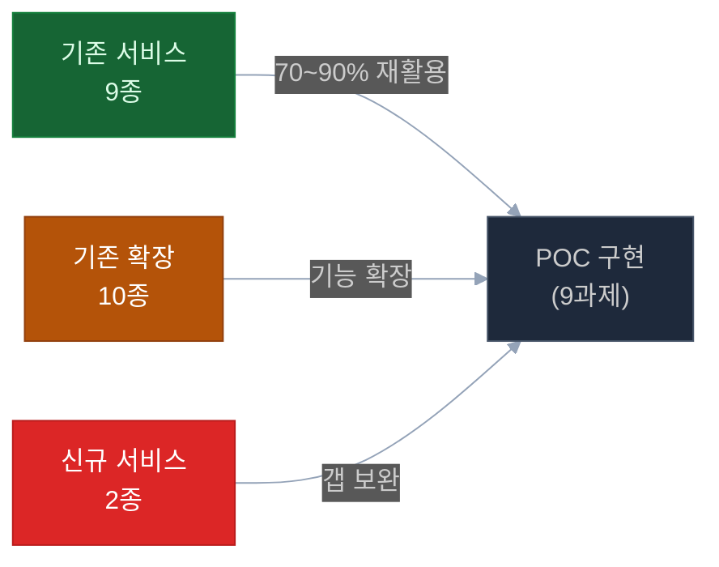

# 행정정보시스템 1단계 AI 도입 POC

> **기준일**: 2026-04-22 | **버전**: v3.0 (구조 리팩토링)
> **목적**: 고객사 POC 추진 전체 문서 가이드

---

## 📌 POC 핵심 요약 (시나리오 B — 확정)

| 항목 | 값 |
|------|:---:|
| **구현 범위** | 6과제 + 3과제 2단계 |
| **개발 기간** | **13주** (Phase 0 사전협의 2주 포함 시 15주) |
| **인력** | **2인** (D1 AI/백엔드 + D2 풀스택) + 파트타임 PM |
| **예산 (VAT 포함)** | **약 2억 900만원** |
| **신규 서비스** | **2개** (groupware-mcp, audit-anomaly) |
| **재사용률** | **85%** |

```
3개 분야 · 13주 · 2인 · 내부망 전용 · 오픈소스 LLM(Gemma 4 Apache 2.0)
```

---

## 📁 문서 구조

```
poc/
├── README.md                 ← 이 문서 (마스터 인덱스)
├── prd.md                    ← POC 원본 요구사항 (원본 보존)
├── prd-original.png          ← 원본 과제 이미지
│
├── 01-architecture.md        ← 전체 아키텍처 + 서비스 매핑
├── 02-project-plan.md        ← 13주 실행 계획 + KPI + 마일스톤
├── 03-budget.md              ← 예산 구성 + 리스크 예비비
├── 04-prerequisites.md       ← 외부 연동 요건 + 감사 데이터 요건
│
├── challenges/               ← 9과제 상세 스펙
│   ├── 00-index.md           ← 9과제 인덱스
│   ├── decisions.md          ← 과제별 73 결정 포인트 (고객 협의용)
│   ├── 01-intelligent-workflow/
│   ├── 02-mcp-data-sync/
│   ├── 03-personal-assistant/    ⭐ 모범 예시
│   ├── 04-regulation-qa/
│   ├── 05-document-compliance/
│   ├── 06-knowledge-base/
│   ├── 07-accounting-audit/
│   ├── 08-attendance-monitoring/
│   └── 09-alert-dashboard/
│
├── services/                 ← 서비스 설계
│   ├── new/                  ← 신규 서비스 2개 + 통합 대안 2개
│   │   ├── 00-index.md
│   │   ├── groupware-mcp.md
│   │   ├── audit-anomaly.md
│   │   ├── notify-service.md       (admin-api 통합 대안)
│   │   └── doc-compliance.md       (ai-assistant 통합 대안)
│   └── improvements/         ← 기존 서비스 개선 내역
│       ├── 00-index.md
│       └── {ai-assistant, ai-rag, ai-llm, admin-api, admin-web, chat-api, chat-web, erp-mcp, sql-runner, hwp-rag-pipeline}.md
│
├── infra/                    ← 인프라 사전 체크
│   ├── hw-infrastructure.md
│   ├── sw-infrastructure.md
│   ├── network-infrastructure.md
│   └── team-requirements.md
│
└── customer/                 ← 고객 협의 자료
    ├── 00-index.md
    ├── checklist.md          ← 착수 전 44개 체크 항목
    └── meeting-guide.md      ← 고객 미팅 의제
```

---

## 🚀 빠른 시작

### 1. 경영진·의사결정자

1. [01-architecture.md](01-architecture.md) §1 — POC 구성 요약
2. [02-project-plan.md](02-project-plan.md) §7 — 마일스톤 + §6 KPI
3. [03-budget.md](03-budget.md) §1 — 총 예산 요약

### 2. 기술팀·아키텍트

1. [01-architecture.md](01-architecture.md) — 아키텍처 전체
2. [services/new/00-index.md](services/new/00-index.md) — 신규 서비스 2개
3. [services/improvements/00-index.md](services/improvements/00-index.md) — 기존 서비스 확장

### 3. 개발팀 (실제 구현)

1. [challenges/00-index.md](challenges/00-index.md) — 9과제 인덱스
2. 각 과제 디렉토리의 `implementation-architecture.md` + `test-scenarios.md`
3. [infra/](infra/) — 인프라 요건

### 4. PM·고객 협의

1. [customer/checklist.md](customer/checklist.md) — 44개 필수 확인 항목
2. [challenges/decisions.md](challenges/decisions.md) — 과제별 73 결정 포인트
3. [customer/meeting-guide.md](customer/meeting-guide.md) — 미팅 의제
4. [04-prerequisites.md](04-prerequisites.md) — 외부 시스템 사전 요건

---

## 🧠 AI 접근 방식 — 파인튜닝이 아닌 RAG

```
❓ "AI 학습이 필요한가요? 우리 데이터를 AI에 학습시켜야 하나요?"

✅ 답변: 이번 POC는 LLM 파인튜닝이 아닙니다.

   [POC 방식: RAG (Retrieval Augmented Generation)]
   ┌─────────────────────────────────────────────────────────┐
   │  규정·지침 문서                                          │
   │       ↓ 청킹(분할) + 임베딩(벡터화)                      │
   │  Milvus 벡터 DB (지식 베이스)                           │
   │       ↓ 질문 시 관련 조항 검색                           │
   │  오픈소스 LLM (그대로 사용, 재학습 없음)                 │
   │       ↓ 검색된 조항을 근거로 답변 생성                   │
   │  최종 답변                                              │
   └─────────────────────────────────────────────────────────┘

   핵심: LLM 모델 자체를 변경하지 않습니다.
        규정 문서를 검색 가능한 형태로 구조화하는 것입니다.
```

| 구분 | Fine-tuning | **RAG (POC 방식)** |
|------|:----------:|:----------------:|
| LLM 재학습 | ✅ 필요 | **❌ 불필요** |
| 대규모 학습 데이터 | ✅ 수만~수십만 건 | **❌ 불필요** |
| GPU 학습 시간 | 수일~수주 | **—** |
| 규정 변경 시 | 재학습 필요 | **문서 업데이트만** |
| POC 기간 적합성 | ❌ 4개월 내 불가 | **✅ 3.25개월 내 가능** |
| 규정 출처 추적 | ❌ 불투명 | **✅ 조항 번호 명시** |

---

## 🏗️ 3대 POC 분야



| POC | 분야 | 핵심 기능 | 재사용률 |
|:---:|------|---------|:-------:|
| 1 | ERP & 그룹웨어 자동화 | 전자결재 자동 기안, 개인 맞춤 비서 | 70% |
| 2 | 규정·문서 지능화 | 규정 Q&A, 문서 적합성 검점, 지식 베이스 | 85% |
| 3 | 사전 감사 지능화 | 이상 탐지, 리스크 대시보드, 알림 | 60% |

---

## ✅ 고객사 미팅 준비 체크리스트

### 필수 설명 사항
```
□ AI 접근 방식 — 파인튜닝 아님, RAG 구조로 규정 문서 업로드만 필요
□ 시나리오 B 권장 근거 — 2.09억원으로 6과제 구현 + 단계적 확장
□ 신규 서비스 2개 설명 — groupware-mcp, audit-anomaly만 신규
□ 기존 서비스 85% 재사용 — 안정성 + 유지보수 부담 감소
```

### 데이터 수집 사항
```
□ 전자결재 문서 샘플 (50건 이상) — POC 1 기안 기능 테스트
□ 내부 행정 규정 문서 (10종 이상) — POC 2 RAG 지식 베이스
□ 감사 이력 데이터 (1년치 이상) — POC 3 이상 탐지 기준
□ 법인카드 지출 데이터 (MCC 코드 포함) — POC 3 이상 결제 탐지
```

### 일정 합의 사항
```
□ Phase 0 (사전협의 2주) 시작일 확정
□ ERP/그룹웨어 연동 담당자 지정 및 협의 일정
□ POC 중간 검토 일정 (M2·M3·M4 완료 후)
□ 최종 데모 일정 (W13 말)
□ 성과 측정 기준 합의 (KPI — 02-project-plan.md §6 참조)
```

---

## ⚠️ 주요 전제 조건 및 제약

| 구분 | 내용 | 영향 |
|------|------|------|
| **내부망 전용** | 인터넷 차단 환경 | 외부 API 사용 불가 → 오픈소스 LLM 필수 |
| **GPU 서버 필요** | vLLM 실행 | A40 48GB 이상 권장 (조달 8~12주 소요) |
| **그룹웨어 API 미확보** | 연동 방식 미결정 | Mock 데이터로 POC 시작, 실 연동 병행 협의 |
| **감사 DB 별도 구성** | ERP와 분리 | 별도 Read-Only 계정 필요 |
| **개인정보 처리** | 행정 데이터 포함 | 마스킹 후 개발 환경 사용 |

---

## 📞 문서 버전 이력

| 버전 | 일자 | 변경 내용 |
|------|:----:|---------|
| v3.0 | 2026-04-22 | 전체 구조 리팩토링 — 중복 제거, 이력 제거, 최종 내역 단일화 |
| v2.1 | 2026-04-21 | 시나리오 B 확정, 9과제 상세화 |
| v1.0 | 2026-04-13 | POC 원안 초안 |
