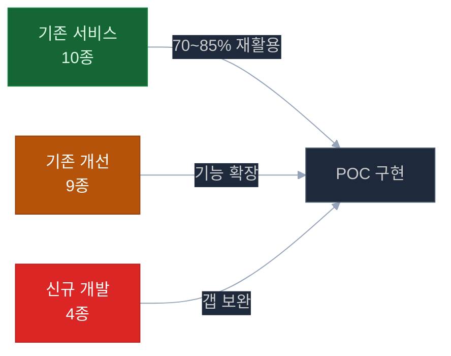

# 행정정보시스템 1단계 AI 도입 POC — 문서 체계

> **작성일**: 2026-04-21 | **버전**: v2.1
> **목적**: 고객사 미팅 및 POC 추진을 위한 전체 문서 가이드

> **📌 POC 핵심 조건 (시나리오 B 기준)**
>
> | 항목 | 값 |
> |------|:---:|
> | 구현 범위 | 6과제 + 3과제 2단계 |
> | 개발 기간 | **13주** |
> | 인력 | **2인** (D1 AI/백엔드 + D2 풀스택) + 파트타임 PM |
> | 예산 (VAT 포함) | **2억 900만원** |
> | 신규 서비스 | **2개** (groupware-mcp, audit-anomaly) |
> | 재사용률 | **85%** |
>
> **고객 협의 필수 문서**:
> - 📌 [challenges/10-improvement-master.md](challenges/10-improvement-master.md) — 마스터 요약
> - ✅ [challenges/13-customer-checklist.md](challenges/13-customer-checklist.md) — 고객 체크리스트 44개
> - 🎯 [challenges/14-pre-proposal-scenarios.md](challenges/14-pre-proposal-scenarios.md) — 3 시나리오 + 권장 B
> - 🔴 [challenges/15-per-challenge-decision-points.md](challenges/15-per-challenge-decision-points.md) — **과제별 73 결정 + P0 3대 결정 (불가/지연 사유)**

---

## AI 접근 방식 명확화 — 파인튜닝이 아닌 RAG

> **반드시 확인**: 고객사 미팅 시 가장 자주 나오는 질문에 대한 공식 답변

```
❓ "AI 학습이 필요한가요? 우리 데이터를 AI에 학습시켜야 하나요?"

✅ 답변: 이번 POC는 LLM 파인튜닝(Fine-tuning)이 아닙니다.

   [POC 방식: RAG (Retrieval Augmented Generation)]
   ┌─────────────────────────────────────────────────────────┐
   │  규정·지침 문서                                          │
   │       ↓ 청킹(분할) + 임베딩(벡터화)                      │
   │  Milvus 벡터 DB (지식 베이스)                           │
   │       ↓ 질문 시 관련 조항 검색                           │
   │  오픈소스 LLM (그대로 사용, 재학습 없음)                 │
   │       ↓ 검색된 조항을 근거로 답변 생성                   │
   │  최종 답변                                              │
   └─────────────────────────────────────────────────────────┘

   핵심: LLM 모델 자체를 변경하지 않습니다.
        규정 문서를 검색 가능한 형태로 구조화하는 것입니다.
        이는 인터넷 검색처럼 "자료 찾아서 답하기"와 유사합니다.
```

| 구분 | Fine-tuning (파인튜닝) | RAG (POC 방식) |
|------|:--------------------:|:-------------:|
| LLM 모델 재학습 | ✅ 필요 | ❌ 불필요 |
| 대규모 학습 데이터 | ✅ 수만~수십만 건 필요 | ❌ 불필요 |
| GPU 학습 시간 | 수일~수주 | — |
| 규정 변경 시 | 재학습 필요 | 문서 업데이트만 |
| POC 기간 적합성 | ❌ 4개월 내 불가 | ✅ 4개월 내 가능 |
| 규정 출처 추적 | ❌ 불투명 | ✅ 조항 번호 명시 |

---

## POC 핵심 요약

```
3개 분야  ·  4개월  ·  8명  ·  내부망 전용  ·  오픈소스 LLM
```

| POC | 분야 | 핵심 기능 | 구현 가능성 |
|-----|------|---------|:---------:|
| POC 1 | ERP & 그룹웨어 AI 자동화 | 전자결재 자동 기안 · 업무 우선순위 비서 | 높음 (70% 기존 활용) |
| POC 2 | 규정·문서 지능화 | 행정규정 Q&A · 문서 적합성 검토 | 매우 높음 (85% 기존 활용) |
| POC 3 | 사전 감사 지능화 | 이상 거래 탐지 · 감사 리스크 대시보드 | 중 (50% 기존 활용) |

### 기존 시스템 활용 현황



---

## 전체 문서 구조

### 1. 전략·기획 문서

| 문서 | 설명 | 대상 |
|------|------|------|
| [prd.md](prd.md) | POC 원본 요구사항 | 전체 |
| [00-overall-architecture.md](00-overall-architecture.md) | 전체 아키텍처 + 구현 가능성 분석 | 기술팀·경영진 |
| [06-realistic-project-plan.md](06-realistic-project-plan.md) | 16주 실행 계획 + Gantt | PM·경영진 |

### 2. POC 분야별 상세 설계

| 문서 | POC 분야 | 핵심 내용 |
|------|---------|---------|
| [01-erp-groupware-ai.md](01-erp-groupware-ai.md) | POC 1 — ERP 자동화 | 전자결재 기안·일정 비서 플로우 |
| [02-regulation-document-intelligence.md](02-regulation-document-intelligence.md) | POC 2 — 규정 지능화 | RAG Q&A·문서 검토 파이프라인 |
| [03-audit-intelligence.md](03-audit-intelligence.md) | POC 3 — 감사 지능화 | 이상 탐지 규칙·리스크 스코어링 |

### 3. 신규 개발 서비스 설계

| 문서 | 서비스 | 포트 |
|------|--------|:---:|
| [design/00-index.md](design/00-index.md) | 신규 서비스 전체 인덱스 | — |
| [design/groupware-mcp.md](design/groupware-mcp.md) | 그룹웨어 MCP 연동 서버 | 4011 |
| [design/audit-anomaly.md](design/audit-anomaly.md) | 감사 이상 탐지 엔진 | 4012 |
| [design/notify-service.md](design/notify-service.md) | 실시간 알림 (SSE) | 4013 |
| [design/doc-compliance.md](design/doc-compliance.md) | 문서 적합성 점검 (OCR+RAG) | 4014 |

### 4. 기존 서비스 개선 내역

| 문서 | 서비스 | 주요 개선 |
|------|--------|---------|
| [improvements/ai-assistant.md](improvements/ai-assistant.md) | AI 오케스트레이터 | POC 전용 그래프 3종 추가 |
| [improvements/ai-rag.md](improvements/ai-rag.md) | RAG 검색 엔진 | 규정 컬렉션 + 한국어 리랭킹 |
| [improvements/ai-llm.md](improvements/ai-llm.md) | LLM 추론 서버 | 행정 규정 전용 프롬프트 4종 |
| [improvements/erp-mcp.md](improvements/erp-mcp.md) | ERP MCP | POC용 MCP 도구 확장 |
| [improvements/sql-runner.md](improvements/sql-runner.md) | SQL 실행기 | 감사 DB 전용 쿼리 추가 |
| [improvements/chat-api.md](improvements/chat-api.md) | 채팅 API | 모드별 라우팅 (erp/규정/감사) |
| [improvements/admin-api.md](improvements/admin-api.md) | 관리자 API | 규정·감사 관련 API 확장 |
| [improvements/admin-web.md](improvements/admin-web.md) | 관리자 웹 | 감사 대시보드 + 규정 관리 UI |
| [improvements/chat-web.md](improvements/chat-web.md) | 채팅 웹 | POC 시나리오별 UI 확장 |

### 5. 인프라 사전 체크 (신규)

| 문서 | 내용 | 중요도 |
|------|------|:-----:|
| [infra/hw-infrastructure.md](infra/hw-infrastructure.md) | 서버·GPU·스토리지 스펙 | P0 |
| [infra/sw-infrastructure.md](infra/sw-infrastructure.md) | OS·미들웨어·LLM 모델 | P0 |
| [infra/network-infrastructure.md](infra/network-infrastructure.md) | 내부망·방화벽·포트 | P0 |
| [infra/team-requirements.md](infra/team-requirements.md) | 개발 인력 등급·역할·투입 시점 | P0 |

### 6. 사전 협의 및 리스크 관리

| 문서 | 내용 |
|------|------|
| [04-external-prerequisites.md](04-external-prerequisites.md) | 외부 시스템 사전 준비 요건 |
| [05-audit-data-requirements.md](05-audit-data-requirements.md) | 감사 DB 데이터 요건 |
| [budget/budget-risk.md](budget/budget-risk.md) | POC 예산 이슈 및 사전 협의 항목 |

### 7. 회의 자료 (내부·고객사)

| 문서 | 내용 | 대상 |
|------|------|------|
| [meeting/01-internal-meeting.md](meeting/01-internal-meeting.md) | 내부 팀 회의 의제 + 결정 항목 (고객사 미팅 전 합의) | 내부 팀 |
| [meeting/02-client-meeting.md](meeting/02-client-meeting.md) | 고객사 협의 회의 의제 + 확인 항목 + 백데이터 링크 | 고객사 미팅 |

### 8. 특화 기술 검토

| 문서 | 내용 | 중요도 |
|------|------|:-----:|
| [improvements/hwp-rag-pipeline.md](improvements/hwp-rag-pipeline.md) | 전사 HWP 문서(~3TB) Ubuntu 파싱 + RAG 파이프라인 구축 방안 | P1 |

---

## 고객사 미팅 준비 체크리스트

### 기술 검토 사항

```
□ AI 접근 방식 설명 준비 (RAG vs 파인튜닝)
  → 파인튜닝 아님 명확히 설명, 규정 문서 업로드만으로 동작 시연 가능

□ 그룹웨어 연동 방식 결정
  → REST API 연동 vs DB Direct vs Mock 단계적 접근 합의 필요

□ ERP 데이터 접근 방식 결정
  → Read-Only 계정 발급 방식, 접근 가능한 테이블/뷰 목록 확인

□ 감사 DB 접근 가능 여부
  → 별도 Read-Only 계정, 개인정보 마스킹 여부 협의

□ 내부망 서버 구성 방식
  → 기관 보유 서버 활용 vs 임시 서버 대여 vs 클라우드(프라이빗) 협의
```

### 데이터 수집 사항

```
□ 전자결재 문서 샘플 (50건 이상) — POC 1 기안 기능 테스트용
□ 내부 행정 규정 문서 (10종 이상) — POC 2 RAG 지식 베이스 구축
□ 감사 이력 데이터 (1년치 이상) — POC 3 이상 탐지 모델 기준값 산출
□ 법인카드 지출 데이터 (MCC 코드 포함) — POC 3 이상 결제 탐지
```

### 일정 합의 사항

```
□ Phase 0 (사전준비 2주) 시작일 확정
□ ERP/그룹웨어 연동 담당자 지정 및 협의 일정
□ POC 중간 검토 일정 (POC 1 완료 후, POC 2 완료 후)
□ 최종 데모 일정 (W16)
□ 성과 측정 기준 합의 (KPI: 결재 성공률 ≥80%, Q&A 정확도 ≥85% 등)
```

---

## 주요 전제 조건 및 제약

| 구분 | 내용 | 영향 |
|------|------|------|
| **내부망 전용** | 인터넷 차단 환경 | 외부 API 사용 불가 → 오픈소스 LLM 필수 |
| **GPU 서버 필요** | vLLM 실행 | A40 48GB 이상 권장 (조달 기간 2~3개월) |
| **그룹웨어 API 미확보** | 연동 방식 미결정 | Mock 데이터로 POC 시작, 실 연동은 병행 협의 |
| **감사 DB 별도 구성** | ERP DB와 분리 | 별도 Read-Only 계정 필요 |
| **개인정보 처리** | 행정 데이터 포함 | 마스킹 처리 후 개발 환경 사용 |
