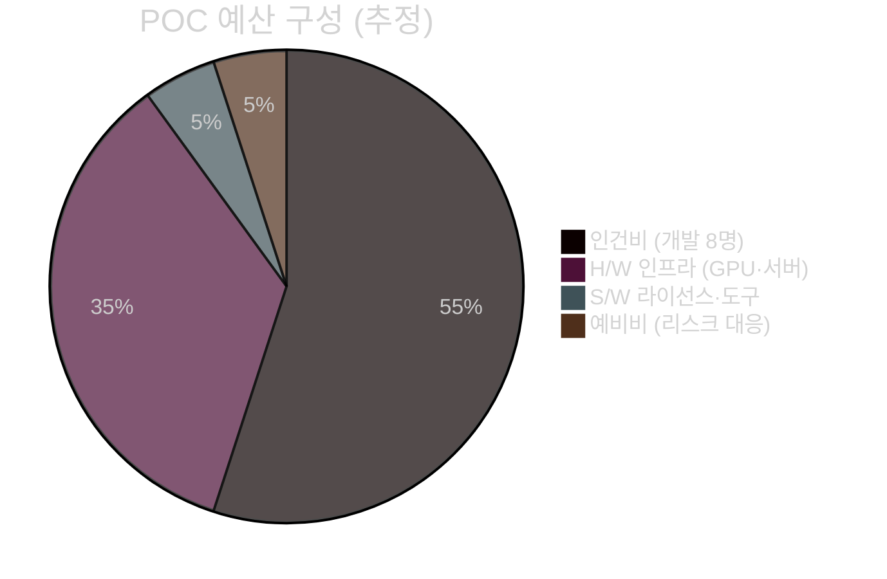
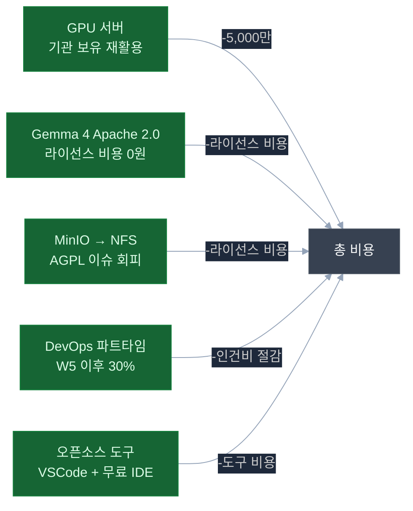

# POC 예산 이슈 및 사전 협의 항목

> **작성일**: 2026-04-21
> **목적**: POC 진행 중 발생 가능한 예산 이슈 사전 파악 및 고객사 협의

> **📌 시나리오별 예산 요약 (VAT 포함)**
>
> | 시나리오 | 기간 | 인력 | 인건비 | 인프라 | 기타 | **총 예산** |
> |---------|:---:|:---:|:-----:|:-----:|:----:|:---------:|
> | **A. 완전 구현** | 16주 | 8인 | 21,400만원 | 2,040만원 | 500만원 | **약 2억 6,300만원** |
> | **B. 단계형 ⭐ 권장** | **13주** | **2인** | 14,050만원 | 1,335만원 | 500만원 | **약 2억 900만원** |
> | **C. 빠른 증빙** | 8주 | 2인 | 6,110만원 | 860만원 | 250만원 | **약 1억 1,550만원** |
>
> **장기 (5년 총비용)**: 시나리오 B **5억 6,100만원** (최저), 시나리오 A 6억 1,300만원, 시나리오 C 8억 1,550만원
>
> **상세**: [14-pre-proposal-scenarios.md](../challenges/14-pre-proposal-scenarios.md)
>
> 본 문서는 시나리오 A (완전 구현) 기준 예산 리스크를 상세 분석한다.

---

## 예산 개요



| 항목 | 예산 범위 | 비고 |
|------|---------|------|
| **인건비** | 1.2억 ~ 1.8억 | 역할·등급에 따라 변동 |
| **H/W 인프라** | 5,000만 ~ 8,000만 | GPU 서버 신규 구매 시 |
| **S/W 라이선스** | 500만 ~ 1,500만 | 유료 도구 선택 여부에 따라 변동 |
| **예비비 (10%)** | 700만 ~ 1,000만 | 예상치 못한 이슈 대응 |
| **합계 (추정)** | **1.8억 ~ 2.9억** | 기관 보유 서버 활용 시 크게 절감 가능 |

> **절감 핵심**: 기관 보유 GPU 서버 재활용 시 H/W 비용 5,000만~8,000만 절감 가능

---

## 1. H/W 인프라 예산 이슈

### 1.1 GPU 서버 — 최대 예산 리스크

> **⚠️ P0 이슈**: GPU 서버가 없으면 vLLM 구동 불가 → POC 전체 불가

| 시나리오 | 비용 | 리드타임 | 비고 |
|---------|:----:|:-------:|------|
| **기관 보유 GPU 활용** | 0원 | 0주 | A40 48GB 이상인 경우 |
| **기관 보유 서버에 GPU 카드 추가** | 500만~800만 | 4~6주 | PCIe 슬롯 여유 확인 필요 |
| **GPU 서버 신규 구매 (최소)** | 2,500만~3,500만 | 8~12주 | A40 × 1 |
| **GPU 서버 신규 구매 (권장)** | 4,500만~6,500만 | 8~12주 | A40 × 2 |
| **클라우드 GPU 임시 대여** | 월 200만~500만 | 즉시 | 내부망 정책 위반 가능 |

**사전 협의 필요 사항**:
- 기관 보유 GPU 서버/카드 재고 확인 (정보시스템팀)
- GPU 서버 신규 구매 시 예산 편성 가능 여부 (예산담당팀)
- 조달 방식 결정 (수의계약 / 공개경쟁입찰)

### 1.2 애플리케이션·DB 서버

| 항목 | 비용 (신규 구매 시) | 기관 보유 시 |
|------|:------------------:|:-----------:|
| 애플리케이션 서버 (32코어/128GB) | 800만~1,500만 | 재활용 가능 확인 |
| DB 서버 (16코어/64GB/NVMe 4TB) | 600만~1,000만 | 재활용 가능 확인 |
| NAS/스토리지 증설 | 300만~600만 | 공유 스토리지 여부 |

> **절감 방안**: POC 기간 중 기존 유휴 서버 임시 활용 → 도입 결정 후 정식 서버 구매

---

## 2. 인건비 예산 이슈

### 2.1 역할별 인건비 추정 (월 단위)

| 역할 | 등급 | 월 단가 (추정) | 투입 기간 | 소계 |
|------|------|:------------:|:--------:|:----:|
| PM / Tech Lead | 시니어 | 900만~1,200만 | 4개월 | 3,600만~4,800만 |
| AI 엔지니어 시니어 | 시니어 | 800만~1,100만 | 4개월 | 3,200만~4,400만 |
| AI 엔지니어 주니어 | 미들 | 600만~800만 | 3.5개월 | 2,100만~2,800만 |
| BE 개발자 시니어 | 시니어 | 750만~1,000만 | 4개월 | 3,000만~4,000만 |
| BE 개발자 미들 | 미들 | 550만~750만 | 3.5개월 | 1,925만~2,625만 |
| FE 개발자 | 미들~시니어 | 600만~850만 | 3.5개월 | 2,100만~2,975만 |
| DevOps 엔지니어 | 미들~시니어 | 650만~900만 | 2개월 (집중) + 2개월 (파트) | 1,625만~2,250만 |
| 데이터 엔지니어 | 미들 | 600만~800만 | 3개월 | 1,800만~2,400만 |
| **합계** | — | — | — | **1억 9,350만~2억 6,250만** |

> **참고**: 소프트웨어 개발 노임단가는 정보시스템감리원 고시 기준으로 협의 가능

### 2.2 인건비 변동 리스크

| 리스크 | 원인 | 영향 | 대응 방안 |
|--------|------|:----:|---------|
| AI 엔지니어 부족 | LLM 전문가 수요 급증 | +20~30% | 사전 계약, AI 전문 기업 협력 |
| 일정 지연 → 인건비 증가 | 기술 난도, 연동 이슈 | +10~20% | 예비비 확보, Phase별 마일스톤 |
| 핵심 인력 중도 이탈 | 이직, 건강 등 | 일정 위험 | 백업 인력 사전 지정 |

---

## 3. S/W 라이선스 예산 이슈

### 3.1 유료 항목 (협의 필요)

| 항목 | 비용 | 리스크 | 대응 방안 |
|------|:----:|--------|---------|
| **Claude Code 구독** | 월 20~30만원 (인당) | 내부망 차단 시 사용 불가 | 오프라인 대안 검토 (Copilot 등) |
| ~~EXAONE 3.5 상업적 사용~~ | **해소됨** | Gemma 4 Apache 2.0 채택으로 라이선스 비용 없음 | Gemma 4로 확정 |
| **MinIO 상업용 라이선스** | 연간 수백만 | AGPL → 상업용 전환 시 | NFS/POSIX 대안 검토 |

### 3.2 무료 오픈소스 (라이선스 비용 없음)

| S/W | 라이선스 | 비고 |
|-----|---------|------|
| Ubuntu, Docker, PostgreSQL, Redis | GPL/Apache/BSD | 무료 |
| vLLM, LangGraph, FastAPI, NestJS | Apache 2.0/MIT | 무료 |
| **Gemma 4 31B-it** | **Apache 2.0** | **무료, 행정 문서 생성 — POC 확정 모델** |
| **Gemma 4 E4B** | **Apache 2.0** | **무료, 멀티모달 Vision — POC 확정 모델** |
| **KURE-v1 (임베딩)** | **Apache 2.0** | **무료, 한국어 RAG 전용** |
| KR-SBERT, PaddleOCR | MIT/Apache 2.0 | 무료 |

> **비용 절감 포인트**: Google Gemma 4 (Apache 2.0) 전 모델 라이선스 비용 0원 — 별도 계약 불필요

---

## 4. 예상 예산 추가 발생 항목

### 4.1 기술 리스크로 인한 추가 비용

| 시나리오 | 발생 가능성 | 추가 비용 | 대응 방안 |
|---------|:---------:|:--------:|---------|
| ERP 연동 지연 (API 미제공) | 중간 | +500만~1,000만 | Mock 데이터로 우선 개발, 연동은 추후 |
| 그룹웨어 API 부재 | 높음 | +300만~800만 | 자체 연동 모듈 개발 필요 |
| GPU VRAM 부족 → 서버 추가 | 낮음 | +2,000만~4,000만 | 양자화(Q4) 적용으로 VRAM 절감 |
| LLM 한국어 성능 미달 | 중간 | +200만~500만 | 모델 교체 (프롬프트 최적화 포함) |
| 오프라인 패키지 수집 지연 | 낮음 | +50만~100만 | 사전 미러 서버 구축 |

### 4.2 조직·행정 리스크로 인한 추가 비용

| 시나리오 | 발생 가능성 | 추가 비용 | 대응 방안 |
|---------|:---------:|:--------:|---------|
| 보안 감사 대응 | 중간 | +100만~300만 | 보안 아키텍처 사전 설계 |
| 개인정보 영향평가 | 중간 | +200만~500만 | 데이터 마스킹 사전 처리 |
| 내부망 방화벽 미개방 지연 | 높음 | +200만~400만 (일정 지연) | W1 이전에 사전 협의 완료 |
| 감사 DB 접근 거부 | 낮음 | Mock 데이터 전환 (일정 위험) | POC 3 범위 축소 대안 준비 |

---

## 5. 예산 절감 전략



| 절감 방안 | 절감 금액 | 실현 조건 |
|---------|:--------:|---------|
| 기관 GPU 서버 재활용 | -5,000만 ~ -8,000만 | A40 48GB 이상 보유 시 |
| 기관 애플리케이션 서버 재활용 | -1,400만 ~ -2,500만 | 32코어/128GB 이상 시 |
| Gemma 4 Apache 2.0 채택 | 라이선스 비용 절감 (확정) | EXAONE 대비 비용 0원, 내부망 무제한 활용 |
| MinIO → NFS/POSIX | 라이선스 절감 | 파일 시스템 성능 검토 후 |
| 내부 개발자 일부 활용 | -20~30% 인건비 | 기관 내 AI/개발 역량 보유 시 |

---

## 6. Phase별 예산 집행 계획

| Phase | 기간 | 주요 비용 항목 | 예산 비중 |
|-------|------|-------------|:--------:|
| Phase 0 (사전준비) | W1~W2 | H/W 설치, 환경 구축, 인건비(8명×0.5개월) | 15% |
| Phase 1 (POC 1) | W3~W6 | 인건비(8명×1개월), 연동 개발 | 25% |
| Phase 2 (POC 2) | W7~W11 | 인건비(8명×1.25개월), 규정 데이터 구축 | 30% |
| Phase 3 (POC 3) | W12~W14 | 인건비(6명×0.75개월), 감사 ML 모델 | 20% |
| Phase 4 (마무리) | W15~W16 | 인건비(6명×0.5개월), 데모 준비 | 10% |

---

## 7. 예산 협의 필수 항목 (고객사 확인)

### 7.1 H/W 관련 (긴급 — W0 이전)

```
[즉시 확인 필요]
□ 기관 보유 GPU 서버 목록 및 스펙 확인 (정보시스템팀)
  → NVIDIA GPU 모델명, VRAM 용량 확인
  → 재활용 가능 여부 (Docker 설치 권한, GPU 드라이버 업그레이드 가능 여부)

□ GPU 서버 재활용 불가 시: 신규 구매 예산 편성 방법 확인
  → 수의계약 vs 경쟁입찰 (1,000만원 이상 경쟁입찰 의무)
  → 예산 편성 완료까지 소요 기간
  → 선금 지급 가능 여부 (서버 발주 시 통상 50% 선금)

□ 기관 보유 앱 서버 / DB 서버 재활용 가능 여부
  → Ubuntu OS 재설치 권한
  → Docker 설치 권한
```

### 7.2 S/W 라이선스 관련 (W1 이전)

```
□ ~~EXAONE 3.5 라이선스 협의~~ → Gemma 4 Apache 2.0 채택으로 라이선스 협의 불필요 (해소됨)
□ Gemma 4 모델 다운로드 경로 확보 (HuggingFace → 내부 저장소 미러 준비)

□ MinIO AGPL 내부 사용 법무 검토
  → 법무팀 검토 예산 (자문 비용)
  → 대안: NFS 스토리지 활용 (별도 비용 없음)

□ 개발 도구 구독 정책
  → Claude Code / GitHub Copilot 외부 API 허용 여부
  → 허용 불가 시 오프라인 AI 코딩 보조 도구 대안
```

### 7.3 인건비 관련 (W0 이전)

```
□ 외부 개발 인력 투입 예산 확보
  → 외주 용역 계약 방식 결정 (도급 vs 파견)
  → 계약 기간 및 정산 방식 (월 단위 vs 마일스톤)

□ 기관 내부 인력 참여 가능 여부
  → 내부 IT 담당자 협업 범위 (ERP 담당자, 보안 담당자)
  → 내부 인력 투입 시 추가 수당 예산

□ 추가 개발 발생 시 계약 변경 절차
  → 그룹웨어 API 자체 개발이 필요한 경우
  → 예비비 사용 권한 및 절차
```

### 7.4 운영 이후 비용 (POC 이후 논의)

```
□ GPU 서버 전기료 (월 예상 10만~30만원)
□ 모델 업데이트 시 스토리지 추가 비용
□ 유지보수 인건비 (POC 이후 지속 운영 시)
□ LLM 모델 버전 업그레이드 (6개월~1년 주기)
```

---

## 8. 리스크 대응 예비비 계획

| 등급 | 리스크 | 예비비 | 발동 조건 |
|------|--------|:------:|---------|
| P0 | GPU 서버 조달 지연 (6주 이상) | 1,000만 | 클라우드 GPU 임시 대여 |
| P0 | 핵심 AI 엔지니어 중도 이탈 | 500만 | 대체 인력 즉시 투입 |
| P1 | ERP 연동 실패 → 자체 개발 | 800만 | 그룹웨어 연동 모듈 자체 개발 |
| P1 | 한국어 LLM 성능 미달 | 300만 | 모델 교체 / 프롬프트 최적화 |
| P2 | 내부망 방화벽 이슈 | 200만 | 우회 아키텍처 재설계 |

**총 예비비 권장**: 전체 예산의 **10~15%** (약 1,800만 ~ 3,000만원)

---

## 9. 담당 부서별 예산 협의 일정

| 협의 항목 | 담당 부서 | 협의 마감 | 우선순위 |
|---------|---------|:-------:|:------:|
| GPU 서버 재활용 또는 구매 결정 | 정보시스템팀 + 예산담당팀 | W-2 | P0 |
| 외부 개발 용역 계약 | 계약팀 + 예산담당팀 | W-1 | P0 |
| ~~EXAONE 라이선스 협의~~ → 해소 | — (Gemma 4 Apache 2.0으로 확정) | — | 해소됨 |
| MinIO AGPL 법무 검토 | 법무팀 | W1 | P1 |
| 개인정보 영향평가 여부 | 개인정보보호팀 | W1 | P1 |
| 보안 감사 일정 협의 | 보안팀 | W2 | P2 |
| POC 이후 운영 예산 편성 | 예산담당팀 | W10 | P3 |

---

## 10. 비용 대비 효과 (ROI 근거)

> 고객사 예산 집행 승인을 위한 ROI 논리 자료

| 효과 항목 | 현재 | POC 이후 | 절감 효과 |
|---------|------|---------|---------|
| 전자결재 기안 시간 | 평균 60분 | 10분 이내 | 인당 월 5시간 절감 |
| 규정 문의 응답 시간 | 1~3일 | 즉시 (AI 답변) | 담당자 업무 부하 감소 |
| 감사 이상 탐지 | 수동 전수 조사 | 자동 탐지 (95%) | 감사 인력 50% 효율화 |
| 문서 적합성 검토 | 담당자 수동 | 자동 1차 검토 | 검토 시간 70% 절감 |

**투자 회수 예상**: POC 성공 후 전체 도입 시 1~2년 내 ROI 달성 가능  
**근거**: 행정 직원 1인당 절감 시간 × 인건비 환산

---

## 사전 협의 체크리스트 요약

```
[즉시 착수 (W0 = POC 시작 2주 전)]
□ GPU 서버 보유 여부 확인 → 재활용 or 구매 결정
□ 외부 용역 계약 예산 및 방식 확정
□ POC 전체 예산 범위 승인

[W1 착수]
□ MinIO AGPL 법무 검토 착수 (또는 NFS/POSIX 대안 채택 — EXAONE 라이선스는 해소됨)
□ 개인정보 영향평가 필요 여부 법무 확인
□ 예비비 사용 권한 및 절차 확인

[W2 착수]
□ 그룹웨어 API 제공 여부 → 불가 시 추가 예산 방안 수립
□ 감사 DB 접근 승인 → 불가 시 POC 3 범위 재협의
```
