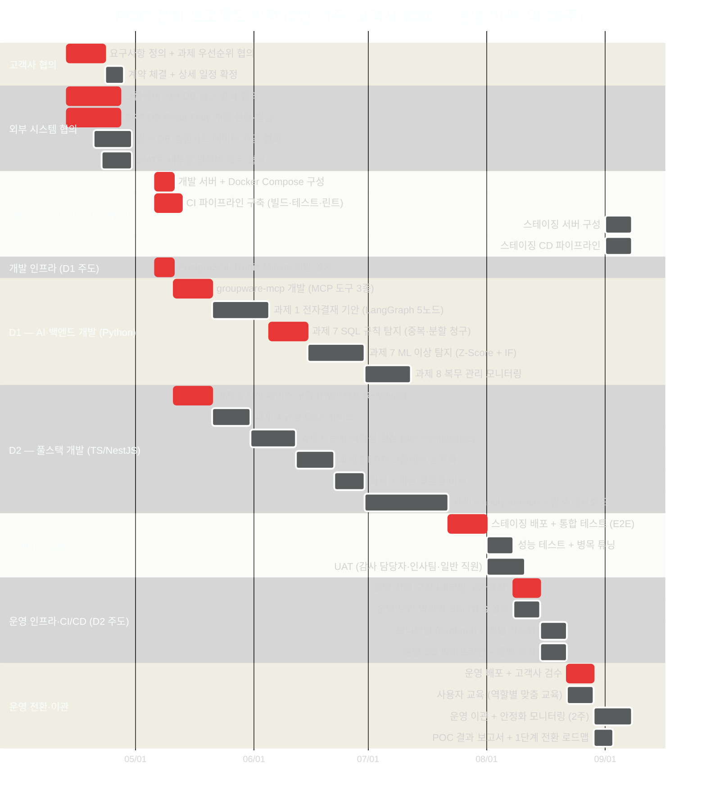

# POC 도전과제 9선 + 개선방안 — 회의 참고 자료 인덱스

> **프로젝트**: 행정정보시스템 1단계 AI 도입 추진
> **목적**: AI 도입을 통한 업무 편의성 제고 (내부망 구축)
> **기준**: 개발자 2인 체제 / 총 기간 약 25주 (사전 협의 포함, Task 기준 재산정)
> **업데이트**: 2026-04-21 — 실제 projects 구현 상태 반영 **개선방안 5종 추가** (10~14)

---

## ⭐ 2026-04-21 개선방안 (신규)

> 실제 `/data/alli/projects` 구현 상태 기준 재검토 결과
> 신규 서비스 4→2개 축소, 기간 16→13주 단축, 예산 20% 절감 가능

| # | 문서 | 내용 | 대상 |
|---|------|------|------|
| 10 | [📌 개선방안 마스터](10-improvement-master.md) | Executive Summary + 전체 방향 + 3 시나리오 요약 | 경영진 ⭐ |
| 11 | [🔍 갭 분석 (2026-04 기준)](11-gap-analysis-2026-04.md) | POC 설계 vs 실제 구현 상태 갭 분석 | 기술팀 ⭐⭐ |
| 12 | [🏗️ 최적화된 아키텍처](12-optimized-architecture.md) | 신규 서비스 4→2 축소, 통합 설계 | 아키텍트 ⭐⭐⭐ |
| 13 | [✅ 고객 협의 체크리스트](13-customer-checklist.md) | 착수 전 44개 필수 확인 항목 | 고객사 ⭐⭐⭐ |
| 14 | [🎯 사전 제안 시나리오 3종](14-pre-proposal-scenarios.md) | 시나리오 A/B/C + 권장 B + ROI 비교 | 경영진 ⭐⭐⭐ |
| 15 | [🎯 과제별 결정 포인트](15-per-challenge-decision-points.md) | **9과제 × 73 결정 포인트** — 고객 미팅 시 항목별 체크 | 고객사 + PM ⭐⭐⭐⭐ |

---

## 🛠️ 과제별 구현 폴더 (2026-04-21 신규)

> 각 과제별 **외부 의존성, API 샘플, DB 구조, MCP 도구, 프롬프트, 구성도**를 폴더별로 정리.
> 개발팀이 실제 구현 시 참조할 **기술 스펙 패키지**.

### POC 1 — ERP & 그룹웨어

| # | 폴더 | 주요 산출물 |
|:-:|------|-----------|
| 1 | [📁 01-intelligent-workflow/](01-intelligent-workflow/) | erp-mcp + groupware-mcp 도구, 예산/결재선 DB, 기안 프롬프트 |
| 2 | [📁 02-mcp-data-sync/](02-mcp-data-sync/) | 동기화 MCP 도구, 매핑 테이블, diff 로직 |
| 3 | [📁 03-personal-assistant/](03-personal-assistant/) ⭐ | **모범 예시** — 8개 상세 파일 (erp-mcp/groupware-mcp 응답 샘플, DB 뷰, 구성도, 프롬프트) |

### POC 2 — 규정·문서

| # | 폴더 | 주요 산출물 |
|:-:|------|-----------|
| 4 | [📁 04-regulation-qa/](04-regulation-qa/) | Milvus 스키마, RAG 파이프라인, Q&A 프롬프트 |
| 5 | [📁 05-document-compliance/](05-document-compliance/) | compliance_graph 스펙, 위반 규칙, 감점 기준 |
| 6 | [📁 06-knowledge-base/](06-knowledge-base/) | 청킹 전략, 업로드 파이프라인, Milvus 운영 |

### POC 3 — 사전 감사

| # | 폴더 | 주요 산출물 |
|:-:|------|-----------|
| 7 | [📁 07-accounting-audit/](07-accounting-audit/) | 4종 탐지 규칙, ML 모델 (Z-Score + Isolation Forest), 리스크 스코어링 |
| 8 | [📁 08-attendance-monitoring/](08-attendance-monitoring/) | 출장-카드 매칭, 초과근무 패턴, 근태 이상 탐지 SQL |
| 9 | [📁 09-alert-dashboard/](09-alert-dashboard/) | notify 모듈 스펙, 대시보드 5페이지, 알림 규칙 관리 |

### 각 폴더 공통 파일 패턴

```
{과제}/
├── README.md                      — 구현 체크리스트 + 폴더 가이드
├── external-dependencies.md       — 외부 시스템 의존성 + P0 결정 링크
├── {mcp|db|schema}.sql/md         — DB 구조 + MCP 도구 스펙
├── api-samples.json               — End-to-End 요청/응답 샘플
├── prompt-templates.md            — LLM 프롬프트 (해당 시)
├── implementation-architecture.md — 🆕 구현 아키텍처 (State/Graph/Node 명세)
└── test-scenarios.md              — 🆕 테스트 시나리오 + 아키텍처 동작 설명
```

03-personal-assistant는 **모범 예시**로 가장 상세 (10 파일 포함).

### 🆕 2026-04-21 추가 — 구현 아키텍처 + 테스트 시나리오 (과제별 2개 × 9 = 18 파일)

테스트 시나리오를 통해 **아키텍처가 어떻게 작동하는지** 상세 설명.
각 시나리오는 Mermaid 시퀀스 다이어그램 + Python 테스트 코드 + 커버리지 매트릭스 포함.

| # | 과제 | 아키텍처 문서 | 테스트 시나리오 |
|:-:|------|-------------|--------------|
| 1 | 전자결재 자동 기안 | [아키텍처](01-intelligent-workflow/implementation-architecture.md) | [8 시나리오](01-intelligent-workflow/test-scenarios.md) |
| 2 | ERP-그룹웨어 동기화 | [아키텍처](02-mcp-data-sync/implementation-architecture.md) | [7 시나리오](02-mcp-data-sync/test-scenarios.md) |
| 3 | 개인 맞춤형 비서 ⭐ | [아키텍처](03-personal-assistant/implementation-architecture.md) | [10 시나리오](03-personal-assistant/test-scenarios.md) |
| 4 | 규정 Q&A | [아키텍처](04-regulation-qa/implementation-architecture.md) | [8 시나리오](04-regulation-qa/test-scenarios.md) |
| 5 | 문서 적합성 검점 | [아키텍처](05-document-compliance/implementation-architecture.md) | [8 시나리오](05-document-compliance/test-scenarios.md) |
| 6 | 지식 베이스 구축 | [아키텍처](06-knowledge-base/implementation-architecture.md) | [8 시나리오](06-knowledge-base/test-scenarios.md) |
| 7 | 회계 이상 탐지 | [아키텍처](07-accounting-audit/implementation-architecture.md) | [10 시나리오](07-accounting-audit/test-scenarios.md) |
| 8 | 복무 상시 감사 | [아키텍처](08-attendance-monitoring/implementation-architecture.md) | [8 시나리오](08-attendance-monitoring/test-scenarios.md) |
| 9 | 알림·대시보드 | [아키텍처](09-alert-dashboard/implementation-architecture.md) | [9 시나리오](09-alert-dashboard/test-scenarios.md) |

**활용 방법**:
- **개발팀**: implementation-architecture.md로 State/Graph/Node I/O 명세 확인 → 구현 진입점
- **QA팀**: test-scenarios.md의 시퀀스 다이어그램으로 정상 흐름/장애 케이스 식별
- **고객 협의**: 특정 시나리오 (예: S4 HWP 변환, S7 노조 협의 범위)에서 결정 포인트 재검토

### 핵심 결정 사항 (고객 협의 전)
- **구현 범위**: 시나리오 B (6과제 + 3과제 2단계) 권장
- **개발 기간**: 13주 / **인력**: 2인 / **예산**: 약 2억 900만원 (VAT 포함)
- **신규 서비스 2개만**: groupware-mcp, audit-anomaly
- **통합 해결 2개**: notify-service → admin-api 확장, doc-compliance → ai-assistant 그래프

---

## 📚 원본 9개 과제 (2026-04-13 POC 설계)

---

## 빠른 탐색

| # | 과제명 | 분야 | 난이도 | 개발 기간 | 재사용률 | 바로가기 |
|---|--------|------|:------:|:--------:|:-------:|---------|
| 1 | 지능형 워크플로우 (전자결재 자동 기안) | POC 1 | 상 | **3주** | 70% | [→ 상세](01-intelligent-workflow.md) |
| 2 | MCP 기반 데이터 연동 (ERP-그룹웨어 동기화) | POC 1 | 중 | **2주** | 65% | [→ 상세](02-mcp-data-sync.md) |
| 3 | 개인 맞춤형 비서 (일정·업무 리마인드) | POC 1 | 중하 | **1.5주** | 80% | [→ 상세](03-personal-assistant.md) |
| 4 | 규정 Q&A 서비스 (대화형 RAG 검색) | POC 2 | 하 | **2주** | 90% | [→ 상세](04-regulation-qa.md) |
| 5 | 문서 적합성 검점 (자동 규정 검토) | POC 2 | 중 | **2.5주** ↑ | 75% | [→ 상세](05-document-compliance.md) |
| 6 | 지식 베이스 구축 (비정형 데이터 자산화) | POC 2 | 중하 | **2주** ↑ | 95% | [→ 상세](06-knowledge-base.md) |
| 7 | 지능형 회계 감사 (이상 결제 패턴 탐지) | POC 3 | 상 | **5주** ↑↑ | 50% | [→ 상세](07-accounting-audit.md) |
| 8 | 복무 관리 모니터링 (근태 이상 징후 분류) | POC 3 | 중상 | **2.5주** ↑ | 50% | [→ 상세](08-attendance-monitoring.md) |
| 9 | 사전 알림 시스템 (감사 리스크 대시보드) | POC 3 | 중 | **4.5주** ↑↑ | 60% | [→ 상세](09-alert-dashboard.md) |

> ↑ 재산정으로 조정된 기간 — 세부 근거는 [기능별 개발 기간 산정](#기능별-개발-기간-산정-2인-기준) 참조

---

## 3개 분야별 요약

### POC 1 — ERP & 그룹웨어 지능화

> MCP를 활용해 시스템 간 데이터를 연결하고, 반복적인 행정 업무를 AI 에이전트가 대행

| 과제 | 핵심 기술 | 신규 서비스 | 공용 의존성 |
|------|---------|-----------|-----------|
| 과제 1: 전자결재 자동 기안 | LangGraph + MCP + vLLM | groupware-mcp (Port 4011) | — |
| 과제 2: ERP-그룹웨어 동기화 | LangGraph 동기화 그래프 | groupware-mcp 공용 | 과제 1 |
| 과제 3: 개인 맞춤형 비서 | 병렬 데이터 조회 + 우선순위 LLM | groupware-mcp 공용 | 과제 1 |

**공유 신규 서비스**: `groupware-mcp (Port 4011)` — 과제 1, 2, 3 공용  
**선행 관계**: 과제 1 → 과제 2, 3 (groupware-mcp 완성 후 병행 가능)

---

### POC 2 — 규정·문서 지능화

> 내부 규정·지침을 AI가 학습, 질문 즉시 답하고 문서 규정 위반 여부 실시간 검증

| 과제 | 핵심 기술 | 신규 서비스 | 공용 의존성 |
|------|---------|-----------|-----------|
| 과제 6: 지식 베이스 구축 | PaddleOCR + 조(Article) 청킹 + Milvus | 없음 (파이프라인만) | — |
| 과제 4: 규정 Q&A | RAG + Milvus 하이브리드 검색 + vLLM | 없음 (기존 서비스 90%) | 과제 6 |
| 과제 5: 문서 적합성 검점 | OCR + RAG + LLM 위반 평가 | doc-compliance (Port 4014) | 과제 6 |

**공유 인프라**: `Milvus 규정 지식 베이스 (5개 파티션)` — 과제 4, 5, 6 공용  
**선행 관계**: 과제 6 → 과제 4, 5 (지식 베이스 구축 후 진행)

---

### POC 3 — 사전 감사 지능화

> 사후 적발에서 사전 방지로, AI가 이상 징후를 실시간 감지하여 부정 행위 차단

| 과제 | 핵심 기술 | 신규 서비스 | 공용 의존성 |
|------|---------|-----------|-----------|
| 과제 7: 회계 이상 탐지 | SQL 규칙 + Z-Score + Isolation Forest | audit-anomaly (Port 4012) | — |
| 과제 8: 복무 이상 탐지 | 출장-카드 교차 분석 + 패턴 탐지 | audit-anomaly 공용 | 과제 7 |
| 과제 9: 알림 + 대시보드 | SSE + SMTP + Webhook + 히트맵 | notify-service (Port 4013) | 과제 7, 8 |

**공유 신규 서비스**: `audit-anomaly (Port 4012)` — 과제 7, 8 공용  
**선행 관계**: 과제 7 → 과제 8 → 과제 9 (순차 진행)

---

## 전체 신규 서비스 목록

| 서비스 | 포트 | 사용 과제 | 기술 스택 |
|--------|:---:|---------|---------|
| **groupware-mcp** | 4011 | 과제 1, 2, 3 | Python + FastMCP |
| **doc-compliance** | 4014 | 과제 5 | Python + FastAPI |
| **audit-anomaly** | 4012 | 과제 7, 8 | Python + FastAPI + Scikit-learn |
| **notify-service** | 4013 | 과제 9 | NestJS + SMTP + SSE |

> **총 신규 서비스 4개** — 기존 서비스 최대 재사용 원칙 준수

---

## 기능별 개발 기간 산정 (2인 기준)

> **D1** — AI·백엔드 (Python: FastAPI, LangGraph, Scikit-learn, Milvus)  
> **D2** — 풀스택/TS (NestJS, Next.js, Docker, CI/CD)  
> 기간 산정 포함 범위: 외부 API 디버깅, 신규 서비스 환경 구성, ML 튜닝, 통합 테스트

### 과제 1 — 전자결재 자동 기안 (D1 병목: **3주**)

| 기능 | 담당 | D1 | D2 | 비고 |
|------|------|:--:|:--:|------|
| groupware-mcp 서비스 초기화 + MCP 프로토콜 구성 | D1 | 2일 | — | Docker 설정 포함 |
| MCP 도구 3종: 결재양식 조회·기안/제출·결재선 조회 | D1 | 4일 | — | 그룹웨어 API 연동 |
| LangGraph 기안 그래프 (분류→양식→초안→검토→제출 5노드) | D1 | 5일 | — | 노드 간 상태 흐름 |
| 결재 규정 ai-rag 연동 + 프롬프트 조정 | D1 | 1일 | — | |
| chat-web 기안 결과 카드 UI (슬롯 패턴 확장) | D2 | — | 3일 | |
| 실사용자 시나리오 테스트 20건 + 버그 수정 | D1/D2 | 2일 | 1일 | |
| Docker Compose 추가 + 배포 테스트 | D1/D2 | 0.5일 | 1일 | |
| **합계** | | **14.5일 (3주)** | **5.5일** | D1 병목 |

### 과제 2 — ERP-그룹웨어 동기화 (D1 병목: **2주**)

| 기능 | 담당 | D1 | D2 | 비고 |
|------|------|:--:|:--:|------|
| ERP 스키마 분석 + groupware↔ERP 매핑 테이블 설계 | D1 | 2일 | — | |
| MCP 동기화 도구 3종: 조직도·인사정보·결재이력 | D1 | 3일 | — | ERP DB 접근 필요 |
| LangGraph 동기화 그래프 (변경감지→검증→반영→알림 4노드) | D1 | 3일 | — | |
| APScheduler 30분 배치 + 충돌 해결 로직 | D1 | 2.5일 | — | |
| chat-web 동기화 상태 UI + 불일치 알림 카드 | D2 | — | 2일 | |
| **합계** | | **10.5일 (2주)** | **2일** | D1 병목 |

### 과제 3 — 개인 맞춤형 비서 (D1 병목: **1.5주**)

| 기능 | 담당 | D1 | D2 | 비고 |
|------|------|:--:|:--:|------|
| erp-mcp 도구 3종 추가 (일정·미결재·지출 조회) | D1 | 2일 | — | 기존 패턴 복제 |
| LangGraph 개인비서 그래프 (parallel_fetch→우선순위→가이드 3노드) | D1 | 3일 | — | 비동기 병렬 복잡 |
| 업무 우선순위 AI 프롬프트 설계 + 튜닝 | D1 | 1일 | — | |
| chat-web 리마인드 카드 UI (업무 요약 + 기안 연계 버튼) | D2 | — | 2.5일 | |
| 시나리오 테스트 (10명 기준) | D1/D2 | 1일 | 0.5일 | |
| **합계** | | **7일 (1.5주)** | **3일** | D1 병목 |

### 과제 6 — 지식 베이스 구축 (D1 병목: **2주**)

| 기능 | 담당 | D1 | D2 | 비고 |
|------|------|:--:|:--:|------|
| 고객사 규정 문서 수집 10종 이상 | PM+고객사 | 협의 의존 | — | 별도 추진 |
| HWP→PDF 변환 레이어 (libreoffice headless 구성) | D1 | 1.5일 | — | 환경 구성 + 엣지케이스 |
| 행정 규정 특화 청킹 모듈 (조 단위: 제N조 패턴) | D1 | 2일 | — | 정규식 + 엣지케이스 |
| Milvus 파티션 5종 생성 스크립트 + 임베딩 파이프라인 | D1 | 2일 | — | |
| 일괄 업로드 스크립트 + 품질 평가 (테스트 쿼리 20개) | D1 | 3일 | — | 반복 튜닝 포함 |
| Q&A 이력 자동 수집 로직 | D1 | 1일 | — | |
| admin-web 규정 문서 관리 UI + 버전 관리 | D2 | — | 4.5일 | |
| **합계** | | **9.5일 (2주)** | **4.5일 (1주)** | D1 병목 |

### 과제 4 — 규정 Q&A 서비스 (D1 병목: **2주**)

| 기능 | 담당 | D1 | D2 | 비고 |
|------|------|:--:|:--:|------|
| 규정 Q&A 전용 ai-assistant 그래프 (파티션 선택 로직) | D1 | 2일 | — | |
| Q&A 전용 프롬프트 4종 (답변/근거/연관/면책 문구) | D1 | 2일 | — | 반복 튜닝 포함 |
| chat-web 근거 조항 패널 UI (조항 하이라이팅) | D2 | — | 3일 | |
| 멀티턴 대화 컨텍스트 유지 | D1 | 1.5일 | — | |
| 검색 품질 평가 + 파티션 경로 최적화 | D1 | 2일 | — | |
| 답변 캐싱 (Redis TTL 24h) | D1/D2 | 0.5일 | 0.5일 | |
| chat-web Q&A UI 개선 + Q&A 이력 수집 | D1/D2 | 1일 | 1.5일 | |
| **합계** | | **9일 (2주)** | **5일 (1주)** | D1 병목 |

### 과제 5 — 문서 적합성 검점 (D2 병목: **2.5주**)

| 기능 | 담당 | D1 | D2 | 비고 |
|------|------|:--:|:--:|------|
| doc-compliance FastAPI 서비스 초기화 | D1 | 1일 | — | |
| 문서 유형 자동 분류 로직 (LLM 분류) | D1 | 1.5일 | — | |
| 규정 위반 평가 프롬프트 개발 | D1 | 2일 | — | |
| OCR→RAG→LLM 위반 평가 파이프라인 구현 | D1 | 2.5일 | — | |
| 점검 결과 JSON 스키마 설계 | D1/D2 | 0.5일 | 0.5일 | |
| admin-web 문서 업로드 UI | D2 | — | 2일 | |
| admin-web 점검 결과 표시 UI (위반 항목 + 조항 + 수정 제안) | D2 | — | 2일 | |
| admin-api 문서 점검 API 엔드포인트 추가 | D2 | — | 1.5일 | |
| 점검 정확도 평가 (샘플 20종) | D1/D2 | 1.5일 | 0.5일 | |
| **합계** | | **9일 (2주)** | **6.5일 (1.5주)** | D2 병목 |

### 과제 7 — 지능형 회계 감사 (D1 병목: **5주**)

| 기능 | 담당 | D1 | D2 | 비고 |
|------|------|:--:|:--:|------|
| ERP 회계 DB 스키마 분석 + 접근 권한 확보 | D1 | 2일 | — | ERP 보안 승인 지연 위험 |
| sql-runner 회계 DB 커넥션 추가 | D1/D2 | 0.5일 | 0.5일 | |
| audit-anomaly FastAPI 서비스 초기화 | D1 | 1.5일 | — | Docker 구성 포함 |
| Rule A: duplicate_claim SQL 교차 탐지 | D1 | 2일 | — | |
| Rule B: split_payment 기간 내 분할 패턴 탐지 | D1 | 2일 | — | |
| Rule C: Z-Score 이상치 탐지 (Scikit-learn) | D1 | 3일 | — | 임계값 튜닝 포함 |
| Rule D: Isolation Forest 복합 패턴 탐지 | D1 | 3일 | — | 오탐률 조정 필수 |
| ai-assistant 자연어 이상 설명 생성 연동 | D1 | 1.5일 | — | |
| 리스크 스코어 산정 엔진 (HIGH×10+MED×5+LOW×2) | D1 | 2일 | — | |
| admin-web 이상 탐지 목록 페이지 (필터·정렬·상세) | D2 | — | 4일 | |
| 탐지 정확도 검증 (샘플 30건) | D1/D2 | 2일 | 1일 | |
| **합계** | | **19.5일 (4주)** | **6일 (1.5주)** | D1 병목 (ML 튜닝) |

### 과제 8 — 복무 관리 모니터링 (D1 병목: **2.5주**)

| 기능 | 담당 | D1 | D2 | 비고 |
|------|------|:--:|:--:|------|
| 출장/근태/법인카드 DB 스키마 분석 | D1 | 1.5일 | — | |
| sql-runner 복무 DB 커넥션 추가 | D1 | 0.5일 | — | |
| travel_card_mismatch 탐지 (erp_travel JOIN corp_card_usage) | D1 | 2일 | — | |
| overtime_pattern 탐지 (주 15h 초과 연속 패턴) | D1 | 1.5일 | — | |
| attendance_anomaly 탐지 (자정 출근·미신청 결근) | D1 | 1.5일 | — | |
| 복무 이상 리스크 스코어 회계 감사와 통합 | D1 | 1.5일 | — | |
| ai-assistant 복무 규정 전용 프롬프트 추가 | D1 | 1일 | — | |
| admin-web 복무 이상 UI 섹션 추가 | D2 | — | 3일 | |
| 탐지 정확도 검증 (샘플 30건) | D1/D2 | 2일 | 0.5일 | |
| **합계** | | **11.5일 (2.5주)** | **3.5일** | D1 병목 |

### 과제 9 — 사전 알림 시스템 + 감사 대시보드 (D2 병목: **4.5주**)

| 기능 | 담당 | D1 | D2 | 비고 |
|------|------|:--:|:--:|------|
| notify-service NestJS 프로젝트 초기화 | D2 | — | 1일 | |
| SMTP 이메일 발송 구현 (nodemailer) | D2 | — | 1.5일 | |
| SSE 실시간 알림 스트리밍 구현 | D2 | — | 2일 | |
| 알림 이력 저장 (PostgreSQL 스키마) | D2 | — | 1.5일 | |
| audit-anomaly ↔ notify-service 연동 테스트 | D1/D2 | 1.5일 | 1일 | |
| Webhook 메신저 알림 구현 | D2 | — | 1.5일 | |
| admin-web /audit/dashboard (통계 카드 + 6개월 추이 차트) | D2 | — | 2.5일 | |
| admin-web /audit/anomalies (DataTable + 필터 + 상세 페이지) | D2 | — | 2.5일 | |
| admin-web /audit/risk-score 부서별 리스크 히트맵 (Recharts) | D2 | — | 2.5일 | 히트맵 라이브러리 연동 |
| admin-web /audit/alerts 알림 이력 + 규칙 설정 | D2 | — | 2일 | |
| admin-api 감사 조회 API 엔드포인트 4종 추가 | D2 | — | 2일 | |
| 알림 규칙 설정 UI (부서별 임계값·수신자·채널 편집) | D2 | — | 1.5일 | |
| **합계** | | **1.5일** | **21.5일 (4.5주)** | D2 병목 (4개 페이지 합산) |

---

### 과제별 현실적 기간 비교 요약

| 과제 | 원래 기간 | 현실적 기간 | 차이 | 핵심 원인 |
|------|:--------:|:----------:|:----:|---------|
| 과제 1 — 전자결재 기안 | 3주 | **3주** | — | D1 병목 정확함 |
| 과제 2 — ERP 동기화 | 2주 | **2주** | — | D1 병목 정확함 |
| 과제 3 — 개인비서 | 1.5주 | **1.5주** | — | D1 병목 정확함 |
| 과제 4 — 규정 Q&A | 2주 | **2주** | — | D1 병목 정확함 |
| 과제 5 — 적합성 검점 | 2주 | **2.5주** | +0.5주 | doc-compliance 신규 서비스 + admin-web 2페이지 |
| 과제 6 — 지식 베이스 | 1.5주 | **2주** | +0.5주 | HWP 변환 환경 구성 + 청킹 튜닝 |
| 과제 7 — 회계 감사 | 3~4주 | **5주** | +1~2주 | D1: SQL 룰 10d + ML 4종·프롬프트 튜닝 15d = 25d |
| 과제 8 — 복무 모니터링 | 2주 | **2.5주** | +0.5주 | DB 3개 교차 분석 + 검증 30건 |
| 과제 9 — 알림 대시보드 | 2~3주 | **4.5주** | +1.5~2.5주 | admin-web 4개 페이지 + notify-service 4채널 |
| **합계 (병렬 제외)** | **20~22주** | **약 25주** | | |
| **실제 병렬 고려** | **10~12주 POC** | **약 16주 POC** | **+4~6주** | D1/D2 순차 의존성 |

---

## 과제별 Task 공수 합계 (검증·테스트·안정화 포함)

> 각 과제 Task 상세는 해당 과제 파일 참조. 기간 산정에 단위 테스트·통합 검증·안정화 포함.  
> **D1** — AI·백엔드(Python) / **D2** — 풀스택(TS/NestJS) / 달력 기간 = 병행 고려 실경과일

| 과제 | man-day 합계 | 달력 기간 | 병목 담당 | 과제 파일 |
|------|:-----------:|:--------:|:--------:|---------|
| 과제 1 — 전자결재 자동 기안 | 19 md | 15d (3주) | D1 | [→](01-intelligent-workflow.md) |
| 과제 2 — MCP 기반 ERP-그룹웨어 동기화 | 16 md | 10d (2주) | D1 | [→](02-mcp-data-sync.md) |
| 과제 3 — 개인 맞춤형 비서 | 11 md | 8d (1.5주) | D1 | [→](03-personal-assistant.md) |
| 과제 4 — 규정 Q&A 서비스 | 17 md | 10d (2주) | D1 | [→](04-regulation-qa.md) |
| 과제 5 — 문서 적합성 검점 | 19 md | 12d (2.5주) | D2 | [→](05-document-compliance.md) |
| 과제 6 — 지식 베이스 구축 | 16 md | 10d (2주) | D1 | [→](06-knowledge-base.md) |
| 과제 7 — 지능형 회계 감사 | 28 md | 25d (5주) | D1 | [→](07-accounting-audit.md) |
| 과제 8 — 복무 관리 모니터링 | 15 md | 12d (2.5주) | D1 | [→](08-attendance-monitoring.md) |
| 과제 9 — 사전 알림 + 감사 대시보드 | 29 md | 22d (4.5주) | D2 | [→](09-alert-dashboard.md) |
| **전체 합계** | **170 man-day** | **POC 개발 약 16주** | | |

> **달력 기간 합산 방식**: 각 과제를 순차 진행 시 약 25주이나, D1/D2 병행 개발로 약 16주로 단축.  
> D1 임계경로: groupware-mcp(2w) → 과제1(3w) → 과제7 SQL(2w) → 과제7 ML(3w) → 과제8(2.5w) = **12.5주**  
> D2 임계경로: 과제6(2w) → 과제4(2w) → 과제5(2.5w) → 과제2(2w) → 과제3(1.5w) → 과제9(4.5w) = **14.5주**

### 담당자별 총 공수

| 담당 | man-day | 주요 과제 |
|------|:-------:|---------|
| D1 전담 | 108 md | 과제 1·2·3·4·7·8 주도 + groupware-mcp |
| D2 전담 | 53 md | 과제 5·9 주도 + 과제 4·6 UI |
| D1+D2 공동 | 9 md | 각 과제 통합 검증·안정화 Task |
| **합계** | **170 md** | |

---

## 전체 프로젝트 일정 (2인 기준, 협의 → 개발 → 운영 이관)

### 프로젝트 단계 개요 (총 약 25주)

> **기간 재산정**: 기능별 개발 기간 산정 결과, 기존 20주 계획에서 약 25주로 조정  
> 주요 원인: 과제 9 admin-web 4페이지(+2.5주), 과제 7 ML 튜닝 시간, 과제 6 HWP 변환 환경 구성

| 단계 | 주차 | 소요 기간 | 주요 산출물 |
|------|:----:|:--------:|-----------|
| **0. 고객사 협의** | W-3 ~ W-1 | 3주 | POC 범위 확정, 계약서, 상세 일정표 |
| **1. 외부 시스템 협의** | W-3 ~ W0 (병행) | 3주 | API·DB 접근 권한 확보 확인서 |
| **2. 개발 인프라·CI 구축** | W1 ~ W2 | 2주 | 개발 서버, Docker Compose, CI 파이프라인 |
| **3. POC 9개 과제 개발** | W1 ~ W16 | **16주** ↑ | 과제별 구현 결과물 + 단위 테스트 |
| **4. 스테이징 인프라·CD** | W15 ~ W16 (병행) | 2주 | 스테이징 서버, 자동 배포 파이프라인 |
| **5. 스테이징 검증** | W17 ~ W19 | 3주 | 통합 테스트 결과, 성능 보고서, UAT 결과 |
| **6. 운영 인프라·CD** | W19 ~ W22 | 4주 | 운영 서버(내부망), 보안·모니터링, 운영 CD |
| **7. 운영 전환·이관** | W22 ~ W25 | 3주 | 배포 검수, 교육 자료, 이관 보고서, 결과 보고 |

---

### 2인 역할 분담

| 구분 | D1 — AI·백엔드 (Python) | D2 — 풀스택 (TS/NestJS) |
|------|------------------------|------------------------|
| **주력 기술** | Python, FastAPI, FastMCP, Scikit-learn, LangGraph | NestJS, Next.js 15, TypeScript, Docker |
| **인프라** | PostgreSQL·Redis·Milvus 설치·구성 | 개발 서버 구성, Docker Compose, CI/CD |
| **POC 1** | groupware-mcp 개발, 과제 1 (LangGraph 기안) | 과제 2 (동기화), 과제 3 (개인비서), admin-web 연동 |
| **POC 2** | 과제 6 (지식 베이스), ai-rag 파티션 설정 | 과제 4 (Q&A UI), 과제 5 (doc-compliance) |
| **POC 3** | 과제 7 (ML 이상 탐지), 과제 8 (복무 분석) | 과제 9 (notify-service + 감사 대시보드) |
| **검증** | 스테이징 API 테스트, ML 성능 튜닝 | 스테이징 CD, E2E 테스트, UAT 지원 |
| **운영** | 운영 서버 Python 서비스 배포 | 운영 CD 파이프라인, 모니터링 설정 |

---

### 전제 조건 및 사전 협의 항목

#### 고객사 협의 필수 항목

| 항목 | 담당 | 우선순위 | 비고 |
|------|------|:-------:|------|
| POC 목표·범위·성공 기준 정의 | PM + 고객사 | **P0** | 킥오프 미팅 전 초안 작성 |
| POC 과제 9개 우선순위 협의 | PM + 고객사 | **P0** | 전체 vs 빠른 구현 시나리오 선택 |
| 일정·예산·인력(2인) 확정 | PM | **P0** | 계약서에 명시 |
| 검수 기준·최종 승인자 지정 | PM + 고객사 | **P0** | UAT 시작 전 확정 |
| 사용자 교육 대상·일정 협의 | PM + 고객사 | P1 | 운영 이관 4주 전 확정 |

#### 외부 시스템 접근 권한 협의

| 항목 | 담당 | 우선순위 | 미확보 시 영향 |
|------|------|:-------:|-------------|
| 그룹웨어 API·DB 접근 권한 | PM + 고객사 IT | **P0** | POC 1 전체 불가 → 더미 API로 대체 |
| ERP DB Read-Only 계정 | PM + 고객사 IT | **P0** | sql-runner 연동 불가 |
| 감사 DB 접근 권한 | PM + 고객사 감사팀 | **P0** | POC 3 → 더미 데이터로 대체 |
| 규정 문서 10종 이상 수집 | PM + 고객사 | **P0** | POC 2 지식 베이스 구축 불가 |
| 법인카드 사용 데이터 제공 | PM + 고객사 회계팀 | P1 | 과제 8 출장-카드 탐지 불가 |
| SMTP 메일 서버 설정 | D2 + 고객사 IT | P1 | notify-service 이메일 발송 불가 |
| 운영 서버 IP·포트 허용 (방화벽) | D2 + 고객사 IT | P1 | 운영 배포 전 필수 확보 |

---

### 전체 프로젝트 일정 (2인 기준, 약 20주)



> **Gantt 핵심 변경**: D1 과제 1 (10d→15d), 과제 7 SQL (7d→10d), 과제 7 ML (10d→15d), 과제 8 (10d→12d)  
> D2 과제 6 (8d→10d), 과제 5 (10d→12d), 과제 2 (7d→10d), 과제 3 (6d→8d), 과제 9 (14d→22d)  
> 스테이징·운영 일정은 `after` 선행 태스크 완료 기준으로 자동 산출

---

### 단계별 상세 일정 (2인 기준)

> **기간 산정 기준**: 2인(D1: AI·백엔드/Python, D2: 풀스택/TS), 주 5일 영업일 기준  
> 기능별 상세 산정 결과 반영 — 기존 계획 대비 약 8주 연장 (총 25주)

| 단계 | 주차 | 기간 | D1 (AI·백엔드) | D2 (풀스택) | 마일스톤 |
|------|:----:|------|--------------|------------|---------|
| **사전 협의** | W-3~W-1 | 4월13일~5월1일 | 기술 검토 + 시스템 사전 분석 | 인프라 설계 + 아키텍처 초안 | 계약 체결 + 권한 확보 |
| **인프라·CI 구축** | W1~W2 | 5월6일~5월16일 | DB·Milvus 설치·검증 | 개발 서버·Docker·CI 파이프라인 | 개발 환경 정상 동작 |
| **POC 기반 구축** | W2~W3 | 5월12일~5월23일 | groupware-mcp (10d) | 과제 6 지식 베이스 — OCR+청킹+Milvus (10d) | 기반 서비스 2종 완성 (5/23) |
| **POC 1·2 핵심** | W4~W8 | 5월26일~6월25일 | 과제 1 전자결재 기안 (15d → 6/16 완료) | 과제 4 Q&A (10d) → 과제 5 doc-compliance (12d → 6/25 완료) | POC 1·2 핵심 기능 완성 |
| **POC 3 개발** | W7~W16 | 6월17일~8월20일 | 과제 7 SQL(10d)+ML(15d) → 과제 8(12d → 8/6 완료) | 과제 9 notify-service+대시보드 (22d → 8/20 완료) | POC 3 완성 (이상 탐지→알림) |
| **POC 1 마무리** | W9~W12 | 6월26일~7월21일 | — | 과제 2 ERP 동기화 (10d → 7/9) + 과제 3 개인비서 (8d → 7/21 완료) | POC 1 전과제 완성 |
| **스테이징 인프라·CD** | W17~W18 | 8월21일~9월5일 | 스테이징 Python 서비스 검증 | 스테이징 서버 구성 + CD 파이프라인 | stg 자동 배포 확인 |
| **스테이징 검증** | W19~W21 | 9월8일~9월26일 | API 성능 튜닝, ML 정확도 검증 | E2E 테스트, UAT 진행 | 성공 기준 90% 이상 달성 |
| **운영 인프라·CD** | W19~W21 | 9월8일~9월26일 | 운영 Python 서비스 구성 (stg와 병행) | 운영 서버·보안·모니터링·CD | 운영 환경 Ready |
| **운영 전환·이관** | W22~W25 | 9월29일~10월23일 | 이관 후 기술 지원 | 배포 검수·교육·이관·보고서 | **POC 최종 완료** |

---

### 개발 진행 순서 (전 단계 상세)

#### STEP 0 — 고객사 협의 (W-3~W-1, 3주)

```
① 킥오프 미팅 — POC 목표·범위·성공 기준 정의 (PM + 고객사)
   - 9개 과제 전체 설명 + 우선순위 협의
   - 전체 일정 vs 빠른 구현(13주) 시나리오 선택

② 계약 체결 + 상세 일정 확정
   - 2인 인력 구성, 역할 정의, 마일스톤별 산출물 명시
   - 검수 기준·최종 승인자 지정
```

#### STEP 1 — 외부 시스템 협의 (W-3~W0, STEP 0과 병행)

```
③ 그룹웨어 API·DB 접근 방식 협의 (D1)
   - API 스펙, 인증 방식(OAuth/API Key), 호출 제한 확인

④ ERP DB Read-Only 계정 신청·발급 (D1)
   - sql-runner 연동을 위한 Read-Only 계정 확보

⑤ 감사 DB·법인카드 데이터 제공 범위 협의 (D1)
   - 제공 불가 시 더미 데이터 대체 계획 수립

⑥ SMTP 서버 설정 + 내부망 방화벽 포트 허용 협의 (D2)
   - notify-service 이메일 발송용 SMTP 정보 확보
   - 운영 서버 포트 (4000~4015) 방화벽 허용 요청
```

#### STEP 2 — 개발 인프라·CI/CD 구축 (W1~W2)

```
⑦ 개발 서버 환경 구성 (D2)
   - Ubuntu 22.04 + Docker 26 + Docker Compose 2.x 설치
   - 개발자 SSH 키 등록, sudo 권한 설정

⑧ PostgreSQL·Redis·Milvus 개발 인스턴스 구성 (D1)
   - docker compose up으로 DB 스택 기동 확인
   - 초기 스키마 마이그레이션 실행

⑨ CI 파이프라인 구축 (D2)
   - GitHub Actions 또는 GitLab CI 설정
   - 자동 빌드 + 린트 (Biome/Ruff) + 단위 테스트
   [완료 기준] docker compose up 정상 기동 + CI 그린
```

#### STEP 3 — POC 기반 구축 (W2~W3, D1·D2 병행)

```
⑩ 과제 6: 지식 베이스 구축 (D2) ← POC 2 전제 조건
   - ocr_service로 규정 문서 OCR + 조(Article) 단위 청킹
   - Milvus 파티션 5종 생성 + 규정 문서 임베딩·업로드
   [완료 기준] 테스트 쿼리 20개 검색 정확도 ≥ 85%

⑪ groupware-mcp 개발 (D1) ← POC 1 전제 조건
   - FastMCP 기반 서비스 초기화 (erp-mcp 패턴 재사용)
   - 핵심 도구: get_approval_list, create_draft, get_schedule
   [완료 기준] 그룹웨어 전자결재 목록 조회 + 기안 등록 동작
```

#### STEP 4 — POC 1·2 핵심 기능 (W3~W6)

```
⑫ 과제 1: 전자결재 자동 기안 (D1) ← groupware-mcp 완료 후
   - ai-assistant LangGraph 기안 파이프라인 구현
   - classify_doc_type → generate_draft → validate → register
   [완료 기준] 공문서·지출결의서·출장신청서 3종 자동 기안

⑬ 과제 4: 규정 Q&A (D2) ← 과제 6 완료 후
   - chat-web 근거 조항 패널 UI 추가, 규정 Q&A 프롬프트
   [완료 기준] 전문가 평가 20문항 정확도 ≥ 85%

⑭ 과제 5: 문서 적합성 검점 (D2) ← 과제 4 완료 후
   - doc-compliance FastAPI 서비스 개발
   - OCR → RAG → LLM 위반 평가 파이프라인
   [완료 기준] 샘플 문서 20종 위반 탐지율 ≥ 80%
```

#### STEP 5 — POC 3 개발 (W4~W9, STEP 4와 병행)

```
⑮ 감사 데이터 파이프라인 구축 (D1) ← STEP 1 권한 확보 후 즉시
   - sql-runner에 감사 DB 커넥션 추가
   - audit-anomaly 서비스 초기화 (FastAPI + APScheduler)

⑯ 과제 7: 회계 이상 탐지 (D1) ← 감사 파이프라인 완료 후
   - SQL 규칙: duplicate_claim, split_payment 탐지
   - Z-Score 이상치 탐지 + Isolation Forest ML 모델
   [완료 기준] 탐지 정밀도 ≥ 80%, 허위 경보율 ≤ 20%

⑰ 과제 8: 복무 관리 모니터링 (D1) ← 과제 7 완료 후
   - 출장-법인카드 교차 분석 (erp_travel JOIN corp_card_usage)
   - 주 15시간 초과근무 패턴 탐지
   [완료 기준] 출장-카드 불일치 탐지율 ≥ 75%

⑱ 과제 9: 알림 + 감사 대시보드 (D2) ← 과제 7 완료 후
   - notify-service NestJS 개발 (SMTP + Webhook + SSE)
   - admin-web 감사 대시보드 4개 페이지
   [완료 기준] 이상 탐지 → 알림 ≤ 5분, 대시보드 로드 ≤ 3초
```

#### STEP 6 — POC 1 나머지 (W6~W7, D2)

```
⑲ 과제 2: ERP-그룹웨어 동기화 (D2) ← groupware-mcp 완료 후
   - ai-assistant 동기화 LangGraph 그래프 추가
   - 배치 스케줄러(30분) 설정
   [완료 기준] 인사 데이터 동기화 성공률 ≥ 95%

⑳ 과제 3: 개인 맞춤형 비서 (D2) ← 과제 2 완료 후
   - parallel_fetch(ERP 마감 + 그룹웨어 일정) 구현
   [완료 기준] 사용자 만족도 ≥ 4/5점
```

#### STEP 7 — 스테이징 환경·검증 (W9~W13)

```
㉑ 스테이징 서버 구성 + CD 파이프라인 (D2) ← W9
   - 스테이징 서버 Docker 환경 구성
   - GitHub Actions CD: dev 브랜치 → stg 자동 배포

㉒ 스테이징 통합 테스트 (D1 + D2) ← W11
   - 9개 과제 End-to-End 시나리오 검증
   - API 응답 속도 측정 + 배치 처리 성능 확인

㉓ 성능 튜닝 (D1) ← W12
   - ML 모델 추론 속도, Milvus 검색 응답 최적화

㉔ UAT — 사용자 수용 테스트 (D2 진행 지원) ← W12~W13
   - 감사 담당자·인사팀·일반 직원 역할별 시나리오 검증
```

#### STEP 8 — 운영 인프라·CD 구축 (W12~W15)

```
㉕ 운영 서버 구성 (D2) ← 내부망 고가용성
   - Ubuntu 22.04 + Docker + 운영 docker-compose.yml
   - 고가용성 설정 (restart: always, healthcheck)

㉖ 운영 보안·방화벽·SSL 설정 (D2)
   - Let's Encrypt 또는 내부 CA SSL/TLS 적용
   - 방화벽 allowlist (허용 포트 최소화)

㉗ 모니터링·알림 설정 (D2)
   - Grafana + Prometheus (컨테이너 메트릭)
   - 운영 이상 시 Slack/이메일 알림 설정
   - 일일 DB 백업 자동화 (PostgreSQL dump)

㉘ 운영 CD 파이프라인 + 롤백 절차 (D2)
   - main 브랜치 → 운영 배포 자동화
   - 이전 이미지 태그 보관, 1-command 롤백 절차 문서화
```

#### STEP 9 — 운영 전환·이관·안정화 (W15~W17)

```
㉙ 운영 배포 + 고객사 검수 (D1 + D2)
   - 운영 서버 전체 서비스 기동 확인
   - 고객사 담당자 최종 검수 및 서명

㉚ 사용자 교육 (D2 주도)
   - 역할별 맞춤 교육: 감사팀 (POC 3), 인사팀 (POC 3), 일반 직원 (POC 1·2)
   - 교육 자료 (PDF + 영상 녹화) 제공

㉛ 운영 이관 + 안정화 모니터링 (D1 + D2)
   - 2주간 밀착 모니터링 + 이슈 즉시 대응
   - 운영 담당자 인수인계 (시스템 구조, 장애 대응 매뉴얼)

㉜ POC 결과 보고서 + 1단계 전환 로드맵 (PM + D1 + D2)
   - 분야별 성과 지표 정리 (탐지율, 응답속도, 사용자 만족도)
   - 1단계 전환 로드맵 제안 (POC → 실제 서비스 전환 계획)
```

---

### 빠른 구현 시나리오 (2인 기준, 약 13주)

> 전체 20주가 어려울 경우, 성과를 빨리 보여줄 수 있는 6과제 우선 집중 전략

```
W-2~W0 : 사전 협의 + 권한 확보 (단축, 2주)
W1~W2  : 개발 인프라 + CI/CD 구축
W2~W3  : 과제 6 지식 베이스 (D1) + groupware-mcp (D2)
W3~W4  : 과제 4 규정 Q&A (D1) + 과제 1 전자결재 (D2)
W4~W5  : 과제 5 문서 적합성 (D1) + 과제 7 SQL 규칙 (D2)
W5~W6  : 과제 7 ML 탐지 완성 (D1) + 과제 9 알림·대시보드 (D2)
W6~W8  : 스테이징 검증 + 운영 인프라 구축 (병행)
W9~W11 : 운영 배포 + 사용자 교육 + 이관
  └── 과제 2, 3, 8 → 2단계 (본 서비스 전환 시 추가)
```

| 구분 | 13주 포함 (1단계) | 2단계 (추후) |
|------|:---------------:|:-----------:|
| 과제 6 지식 베이스 | ✅ | — |
| 과제 4 규정 Q&A | ✅ | — |
| 과제 5 문서 적합성 | ✅ | — |
| 과제 1 전자결재 기안 | ✅ | — |
| 과제 7 회계 이상 탐지 | ✅ (규칙+ML) | 고도화 |
| 과제 9 알림 + 대시보드 | ✅ | — |
| 과제 2 ERP 동기화 | — | ✅ |
| 과제 3 개인 맞춤형 비서 | — | ✅ |
| 과제 8 복무 모니터링 | — | ✅ |

---

## 상위 문서 링크

| 문서 | 경로 |
|------|------|
| 원본 PRD (9대 과제 정의) | [../prd.md](../prd.md) |
| POC 전체 아키텍처 | [../00-overall-architecture.md](../00-overall-architecture.md) |
| POC 1 — ERP & 그룹웨어 상세 | [../01-erp-groupware-ai.md](../01-erp-groupware-ai.md) |
| POC 2 — 규정·문서 지능화 상세 | [../02-regulation-document-intelligence.md](../02-regulation-document-intelligence.md) |
| POC 3 — 사전 감사 지능화 상세 | [../03-audit-intelligence.md](../03-audit-intelligence.md) |
| 현실적 프로젝트 계획 | [../06-realistic-project-plan.md](../06-realistic-project-plan.md) |
| 외부 시스템 사전 요건 | [../04-external-prerequisites.md](../04-external-prerequisites.md) |
| 감사 데이터 요건 | [../05-audit-data-requirements.md](../05-audit-data-requirements.md) |
