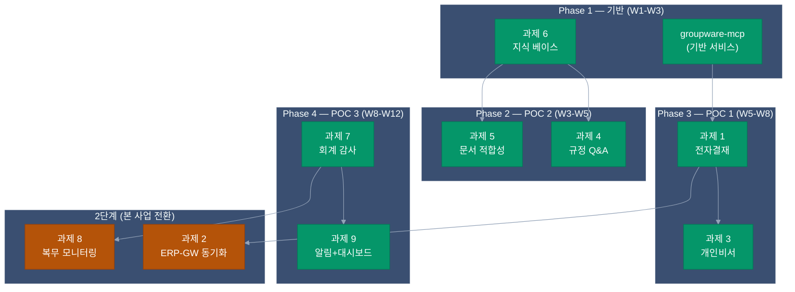

# POC 도전과제 9선 — 인덱스

> **프로젝트**: 행정정보시스템 1단계 AI 도입 (내부망 구축)
> **기준**: 시나리오 B (단계형) — 13주 / 2인 / 약 2억 900만원
> **구현 범위**: 6과제 우선 + 3과제 2단계

---

## 📋 9과제 요약

| # | 과제명 | POC | 난이도 | 공수 (2인) | 재사용률 | 단계 | 상세 |
|:-:|-------|:---:|:-----:|:--------:|:------:|:---:|:---:|
| 1 | 전자결재 자동 기안 | 1 | 상 | 2.5주 | 85% | **1** | [→](01-intelligent-workflow/) |
| 2 | ERP-그룹웨어 동기화 | 1 | 중 | 2주 | 65% | 2 | [→](02-mcp-data-sync/) |
| 3 | 개인 맞춤형 비서 | 1 | 중하 | 1.5주 | 80% | **1** | [→](03-personal-assistant/) ⭐ |
| 4 | 규정 Q&A 서비스 | 2 | 하 | 2주 | 90% | **1** | [→](04-regulation-qa/) |
| 5 | 문서 적합성 검점 | 2 | 중 | 2.5주 | 80% | **1** | [→](05-document-compliance/) |
| 6 | 지식 베이스 구축 | 2 | 중하 | 2주 | 95% | **1** | [→](06-knowledge-base/) |
| 7 | 지능형 회계 감사 | 3 | 상 | 4주 | 60% | **1** | [→](07-accounting-audit/) |
| 8 | 복무 관리 모니터링 | 3 | 중상 | 2.5주 | 60% | 2 | [→](08-attendance-monitoring/) |
| 9 | 사전 알림 + 대시보드 | 3 | 중 | 3주 | 70% | **1** | [→](09-alert-dashboard/) |

> ⭐ 03-personal-assistant는 상세 구현 레퍼런스 (10개 파일 포함)

---

## 🔄 9과제 ↔ 서비스 매핑

### POC 1 — ERP & 그룹웨어 지능화

| 과제 | 핵심 기술 | 주 서비스 | 선행 |
|------|---------|---------|------|
| 1 전자결재 자동 기안 | LangGraph `approval_draft_graph` + MCP | groupware-mcp + erp-mcp + ai-assistant | — |
| 2 ERP-그룹웨어 동기화 (2단계) | LangGraph `sync_graph` + APScheduler | groupware-mcp 양방향 + erp-mcp | 1 |
| 3 개인 맞춤형 비서 | LangGraph `personal_assistant_graph` (3-way 병렬) | erp-mcp + groupware-mcp | 1 |

**공유 신규 서비스**: `groupware-mcp (:4011)`

### POC 2 — 규정·문서 지능화

| 과제 | 핵심 기술 | 주 서비스 | 선행 |
|------|---------|---------|------|
| 6 지식 베이스 | PaddleOCR + 조 단위 청킹 + Milvus 파티션 5종 | ai-rag + ocr-service | — |
| 4 규정 Q&A | RAG 하이브리드 검색 + LLM | ai-rag + chat-api + chat-web | 6 |
| 5 문서 적합성 검점 | LangGraph `compliance_graph` (OCR→RAG→LLM) | ai-assistant + admin-api compliance 모듈 | 6 |

**공유 인프라**: Milvus 규정 파티션 (`regulation_hr`, `regulation_finance`, `regulation_general`, `regulation_forms`, `qa_history`)

### POC 3 — 사전 감사 지능화

| 과제 | 핵심 기술 | 주 서비스 | 선행 |
|------|---------|---------|------|
| 7 지능형 회계 감사 | SQL 규칙(A/B) + Z-Score(C) + Isolation Forest(D) | audit-anomaly + sql-runner | — |
| 8 복무 관리 (2단계) | 출장-카드 교차 분석 + 근태 패턴 | audit-anomaly 확장 | 7 |
| 9 사전 알림 + 대시보드 | SSE + SMTP + Webhook + 히트맵 | admin-api notify 모듈 + admin-web | 7 |

**공유 신규 서비스**: `audit-anomaly (:4012)`

---

## 🏗️ 신규 서비스 (2개로 최적화)

| 서비스 | 포트 | 사용 과제 | 기술 스택 | 공수 |
|--------|:---:|---------|---------|:---:|
| **groupware-mcp** | 4011 | 1·2·3 | FastAPI + FastMCP (erp-mcp 복제) | 2주 |
| **audit-anomaly** | 4012 | 7·8 | FastAPI + Pandas + Scikit-learn + APScheduler | 4주 |

### 원안 대비 통합 (신규 서비스 4 → 2)

| 원안 서비스 | 결정 | 통합 대상 |
|-----------|:---:|---------|
| ~~notify-service (:4013)~~ | 통합 | `admin-api/src/module/notify/` (SMTP + Webhook + SSE) |
| ~~doc-compliance (:4014)~~ | 통합 | `ai-assistant/src/graph/graphs/compliance_graph.py` |

상세: [../01-architecture.md](../01-architecture.md)

---

## 📁 각 과제 폴더 구조

```
{과제}/
├── README.md                      — 구현 체크리스트 + 가이드
├── external-dependencies.md       — 외부 시스템 의존성 + P0 결정
├── {mcp|db|schema}.sql/md         — DB 구조 + MCP 도구 스펙
├── api-samples.json               — 요청/응답 샘플
├── prompt-templates.md            — LLM 프롬프트 (해당 시)
├── implementation-architecture.md — 구현 아키텍처 (State/Graph/Node)
└── test-scenarios.md              — 테스트 시나리오 + 시퀀스 다이어그램
```

### 과제별 아키텍처·테스트 문서

| # | 과제 | 구현 아키텍처 | 테스트 시나리오 |
|:-:|------|-------------|--------------|
| 1 | 전자결재 자동 기안 | [→](01-intelligent-workflow/implementation-architecture.md) | [8 시나리오](01-intelligent-workflow/test-scenarios.md) |
| 2 | ERP-그룹웨어 동기화 | [→](02-mcp-data-sync/implementation-architecture.md) | [7 시나리오](02-mcp-data-sync/test-scenarios.md) |
| 3 | 개인 맞춤형 비서 ⭐ | [→](03-personal-assistant/implementation-architecture.md) | [10 시나리오](03-personal-assistant/test-scenarios.md) |
| 4 | 규정 Q&A | [→](04-regulation-qa/implementation-architecture.md) | [8 시나리오](04-regulation-qa/test-scenarios.md) |
| 5 | 문서 적합성 검점 | [→](05-document-compliance/implementation-architecture.md) | [8 시나리오](05-document-compliance/test-scenarios.md) |
| 6 | 지식 베이스 구축 | [→](06-knowledge-base/implementation-architecture.md) | [8 시나리오](06-knowledge-base/test-scenarios.md) |
| 7 | 회계 이상 탐지 | [→](07-accounting-audit/implementation-architecture.md) | [10 시나리오](07-accounting-audit/test-scenarios.md) |
| 8 | 복무 상시 감사 | [→](08-attendance-monitoring/implementation-architecture.md) | [8 시나리오](08-attendance-monitoring/test-scenarios.md) |
| 9 | 알림·대시보드 | [→](09-alert-dashboard/implementation-architecture.md) | [9 시나리오](09-alert-dashboard/test-scenarios.md) |

**활용**:
- 개발팀: `implementation-architecture.md`로 State/Graph/Node I/O 명세 확인
- QA팀: `test-scenarios.md`의 시퀀스 다이어그램으로 정상 흐름·장애 케이스 식별
- 고객 협의: [decisions.md](decisions.md) 9과제 × 73 결정 포인트

---

## 📊 의존성 다이어그램



---

## 🔗 관련 문서

- [../01-architecture.md](../01-architecture.md) — 전체 아키텍처
- [../02-project-plan.md](../02-project-plan.md) — 13주 실행 계획
- [../03-budget.md](../03-budget.md) — 예산
- [../04-prerequisites.md](../04-prerequisites.md) — 사전 요건 + 감사 데이터
- [decisions.md](decisions.md) — 과제별 73 결정 포인트 (고객 협의용)
- [../customer/checklist.md](../customer/checklist.md) — 고객 체크리스트 44개
- [../customer/meeting-guide.md](../customer/meeting-guide.md) — 고객 미팅 의제
- [../services/new/](../services/new/) — 신규 서비스 설계
- [../services/improvements/](../services/improvements/) — 기존 서비스 개선
