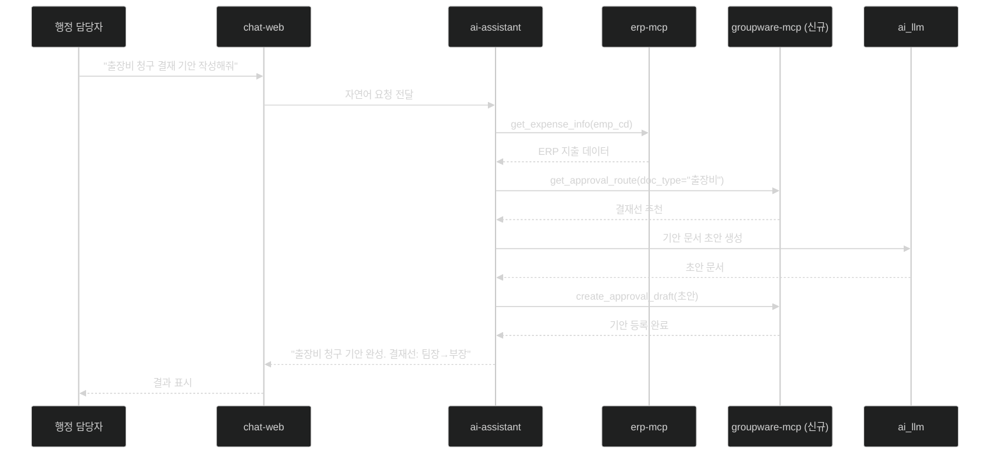

# 과제 1 — 지능형 워크플로우 (전자결재 자동 기안 및 분류)

> **분야**: POC 1 — ERP & 그룹웨어 지능화
> **난이도**: 중
> **구현 기간**: 3주 → **2.5주 (재검토, 4/21)**
> **기존 서비스 활용도**: 70% → **85% (재검토)**

> **🔄 2026-04-21 업데이트**: 실제 ai-assistant 17노드 완성 확인 → 재사용률 상향, 기간 단축
> - **결정 포인트 7개**: [→ 15-per-challenge-decision-points.md#과제-1](15-per-challenge-decision-points.md#-과제-1--전자결재-자동-기안-및-분류)
> - **고객 핵심 결정**: 자동/수동 등록 정책, 결재선 추천 알고리즘, 첨부파일 처리
> - **재사용 포인트**: classify_node, fetch_node, plan_node (ai-assistant/src/graph/nodes/)

---

## 목차

- [1. 과제 개요](#1-과제-개요)
- [2. 구현 아키텍처](#2-구현-아키텍처)
- [3. 서비스 재사용 분석](#3-서비스-재사용-분석)
- [4. 구현 로드맵 및 Task](#4-구현-로드맵-및-task)
- [5. 위험 요소](#5-위험-요소)
- [6. 성공 기준](#6-성공-기준)
- [7. 참조 링크](#7-참조-링크)

---

## 1. 과제 개요

행정 담당자가 자연어 명령("출장비 청구 결재 기안 작성해줘")만으로 AI가 전자결재 기안 문서를 자동 생성하고, 문서 유형·부서·금액 기준으로 최적 결재 경로를 자동 추천하는 시스템

| 항목 | 내용 |
|------|------|
| **핵심 가치** | 반복적 행정 서식 작성 시간 80% 단축 |
| **대상 사용자** | 전자결재 기안을 작성하는 모든 행정 담당자 |
| **주요 기능** | 기안 문서 초안 자동 생성, 결재 경로 자동 추천, 결재 유형 자동 분류 |

---

## 2. 구현 아키텍처

### 2.1 전체 흐름

```
행정 담당자
    │
    ▼ "출장비 청구 결재 기안 작성해줘"
chat-web (Port 3000)  ← 기존 서비스 재사용
    │
    ▼
chat-api (Port 4002)  ← 기존 서비스 재사용
    │
    ▼
ai-assistant (Port 4005)  ← 기존 서비스, 시나리오 추가
    ├── ERP 데이터 조회 → erp-mcp (Port 4010)  ← 기존 서비스
    ├── 그룹웨어 결재선 조회 → groupware-mcp (Port 4011)  ← 신규 개발
    └── 기안 문서 생성 → ai_llm (Port 6001)  ← 기존 서비스
         │
         ▼
    groupware-mcp로 기안 등록 → 그룹웨어 시스템
```

### 2.2 시퀀스 다이어그램



### 2.3 LangGraph 노드 구조 (ai-assistant 신규 추가)

```
[결재기안_그래프]
  start
    ↓
  classify_doc_type    ← 문서 유형 분류 (LLM)
    ↓
  parallel_fetch:
    ├── fetch_erp_data     ← erp-mcp: 개인 지출/마감 데이터
    └── fetch_approval_route ← groupware-mcp: 결재선 조회
    ↓
  generate_draft         ← ai_llm: 기안 문서 초안 생성
    ↓
  validate_draft         ← ai-rag: 규정 적합성 검토 (선택적)
    ↓
  register_draft         ← groupware-mcp: 그룹웨어 등록
    ↓
  end
```

---

## 3. 서비스 재사용 분석

### 재사용 가능 기존 서비스

| 서비스 | 포트 | 재사용 내용 | 추가 개발 |
|--------|:---:|------------|---------|
| **chat-web** | 3000 | 채팅 UI 그대로 재사용 | 기안 결과 카드 UI 추가 |
| **chat-api** | 4002 | 메시지 라우팅 그대로 | ERP 모드 라우팅 추가 |
| **ai-assistant** | 4005 | LangGraph 오케스트레이터 재사용 | 결재기안 그래프 노드 3종 추가 |
| **erp-mcp** | 4010 | ERP 데이터 조회 도구 재사용 | POC용 MCP 도구 2종 추가 |
| **ai_llm** | 6001 | 텍스트 생성 API 재사용 | 행정 기안 전용 프롬프트 추가 |
| **auth-api** | 4003 | 인증 그대로 재사용 | 없음 |

### 신규 개발 필요 서비스

| 서비스 | 포트 | 개발 내용 | 공수 |
|--------|:---:|----------|------|
| **groupware-mcp** | 4011 | 그룹웨어 MCP 연동 서버 전체 (erp-mcp 패턴 복제 후 확장) | 3주 |

### groupware-mcp 핵심 MCP 도구 (신규)

| 도구명 | 기능 |
|--------|------|
| `get_approval_list` | 결재 대기 목록 조회 |
| `get_approval_detail` | 결재 문서 상세 조회 |
| `create_approval_draft` | 결재 기안 초안 등록 |
| `get_approval_route` | 결재 경로 조회/추천 |

---

## 4. 구현 로드맵 및 Task

### 4.1 단계별 일정 (3주)

```
Week 1 — 기반 구축
  ├── [ ] 그룹웨어 API 문서 확보 / DB 접근 권한 확보
  ├── [ ] groupware-mcp 프로젝트 초기화 (erp-mcp 복제)
  ├── [ ] 그룹웨어 시스템 연결 테스트 (기본 API 호출)
  └── [ ] ai-assistant 결재기안 그래프 설계 문서 작성

Week 2 — groupware-mcp 개발
  ├── [ ] 그룹웨어 API 클라이언트 구현 (get_approval_list, get_approval_route)
  ├── [ ] create_approval_draft MCP 도구 구현
  ├── [ ] JWT ES256 인증 연동 (erp-mcp 패턴 재사용)
  └── [ ] ai-assistant ↔ groupware-mcp 연동 테스트

Week 3 — ai-assistant 시나리오 + 통합 테스트
  ├── [ ] classify_doc_type 노드 구현 (LLM 분류)
  ├── [ ] generate_draft 노드 구현 (행정 기안 프롬프트 적용)
  ├── [ ] register_draft 노드 구현
  ├── [ ] chat-web 기안 결과 카드 UI 추가
  └── [ ] 사용자 시나리오 E2E 테스트 (출장비, 물품구매, 초과근무 3종)
```

### 4.2 Task 목록

| ID | Task | 담당 | 우선순위 | 기간 |
|----|------|------|:-------:|:----:|
| T1-01 | 그룹웨어 API 문서 수집 및 분석 | D1 | P0 | 1d |
| T1-02 | groupware-mcp 프로젝트 scaffolding | D1 | P0 | 1d |
| T1-03 | 그룹웨어 API 클라이언트 구현 (단위 테스트 포함) | D1 | P0 | 2d |
| T1-04 | MCP 도구 4종 구현 (결재·기안·문서·알림) | D1 | P0 | 3d |
| T1-05 | ai-assistant 결재기안 LangGraph 그래프 5노드 구현 | D1 | P0 | 4d |
| T1-06 | 행정 기안 프롬프트 개발 + 출력 품질 검증 | D1 | P1 | 2d |
| T1-07 | chat-web 기안 결과 표시 UI | D2 | P1 | 2d |
| T1-08 | Docker Compose groupware-mcp 추가 + 배포 확인 | D1 | P1 | 1d |
| T1-09 | E2E 시나리오 테스트 3종 + 부하 테스트 + 시스템 안정화 | D1+D2 | P2 | 3d |
| **합계** | | | | **19 man-day** |
| **달력 기간** | D1 14d 기준, D2 5d 병행 | | | **15d (3주)** |

---

## 5. 위험 요소

| # | 위험 요소 | 가능성 | 영향도 | 대응 방안 |
|---|---------|:-----:|:-----:|---------|
| R1 | **그룹웨어 API 미공개 / 접근 거부** | 높음 | 치명 | DB Direct 접근(2순위) 또는 Mock 데이터로 선개발 후 연동 |
| R2 | **그룹웨어 DB 스키마 파악 지연** | 중간 | 높음 | 샘플 데이터 요청 및 ERD 확보를 사전 조건으로 설정 |
| R3 | **LLM 기안 문서 품질 미달** | 중간 | 중간 | Few-shot 예시 5종 이상 추가, 사용자 편집 UI 필수 제공 |
| R4 | **결재 경로 추천 오류** | 낮음 | 높음 | 추천 결과 사용자 검토 단계 필수 유지 (자동 등록 비활성화 옵션) |
| R5 | **groupware-mcp 개발 지연** | 중간 | 높음 | erp-mcp 패턴 복제로 초기화 시간 최소화 (0.5일 내 프레임워크 구성) |

---

## 6. 성공 기준

| 지표 | 목표값 |
|------|:------:|
| MCP 도구 호출 성공률 | ≥ 95% |
| 결재 기안 자동 생성 정확도 | ≥ 80% (사용자 평가) |
| ERP-그룹웨어 결재선 연동 성공률 | ≥ 90% |
| 기안 생성 응답 시간 | ≤ 10초 |

---

## 7. 참조 링크

| 문서 | 경로 |
|------|------|
| POC 전체 아키텍처 | [../00-overall-architecture.md](../00-overall-architecture.md) |
| POC 1 ERP 상세 설계 | [../01-erp-groupware-ai.md](../01-erp-groupware-ai.md) |
| groupware-mcp 설계 | [../design/groupware-mcp.md](../design/groupware-mcp.md) |
| erp-mcp 개선사항 | [../improvements/erp-mcp.md](../improvements/erp-mcp.md) |
| ai-assistant 개선사항 | [../improvements/ai-assistant.md](../improvements/ai-assistant.md) |
| 외부 시스템 사전 체크 | [../04-external-prerequisites.md](../04-external-prerequisites.md) |
| 전체 프로젝트 계획 | [../06-realistic-project-plan.md](../06-realistic-project-plan.md) |
| 과제 2 (MCP 데이터 연동) | [02-mcp-data-sync.md](02-mcp-data-sync.md) |
| 과제 3 (개인 맞춤형 비서) | [03-personal-assistant.md](03-personal-assistant.md) |
