# 과제 1 전자결재 기안 — 테스트 시나리오

> **연관**: [implementation-architecture.md](implementation-architecture.md)

---

## 📋 시나리오 개요

| # | 시나리오 | 유형 | 기대 결과 |
|:-:|---------|:---:|---------|
| S1 | 출장비 기안 (정상) | E2E | DRAFT 생성 성공, 92점 |
| S2 | 물품구매 기안 | E2E | PURCHASE 양식 정확 매칭 |
| S3 | 규정 위반 감지 | 기능 | 금액 초과 → 사용자 확인 |
| S4 | 그룹웨어 Write 거부 | 장애 | 초안 임시 저장 |
| S5 | 결재선 추천 오류 | 기능 | 규칙 기반 대체 |
| S6 | LLM JSON 파싱 실패 | 장애 | strict 재시도 |
| S7 | 예산 잔액 부족 | 경계 | 경고 + 계속 진행 |
| S8 | 첨부파일 필요 | UX | 수동 첨부 안내 |

---

## S1 — 출장비 기안 정상 흐름

### 설정
```
사용자: 홍길동 (회계부 주임)
입력: "다음주 부산 출장(4월 27~29) 출장비 청구 기안 작성해줘. KTX, 2박"
```

### 아키텍처 동작 추적

```mermaid
%%{init: {'theme': 'dark', 'themeVariables': {'primaryColor': '#1d4ed8', 'primaryTextColor': '#f8fafc', 'primaryBorderColor': '#3b82f6', 'lineColor': '#94a3b8', 'secondaryColor': '#1e293b', 'tertiaryColor': '#0f172a'}}}%%
sequenceDiagram
    participant U as 홍길동
    participant AA as ai-assistant
    participant AG as approval_draft_graph
    participant EM as erp-mcp
    participant GM as groupware-mcp
    participant LLM as vllm-vision
    participant RAG as ai-rag
    participant GW as 그룹웨어

    U->>AA: 기안 요청
    AA->>AG: invoke(state)

    rect rgb(30, 60, 100)
        Note over AG,LLM: Step 1: classify (0.5s)
        AG->>LLM: 문서 유형 분류
        LLM-->>AG: TRIP, 0.97, entities{}
    end

    rect rgb(30, 90, 60)
        Note over AG,GM: Step 2: parallel_fetch (2.0s)
        par
            AG->>EM: get_expense_info(TRIP)
            EM-->>AG: budget_balance, past_expenses
        and
            AG->>GM: get_approval_route(TRIP, 285k)
            GM-->>AG: 3-step route
        and
            AG->>GM: get_doc_template(TRIP)
            GM-->>AG: TPL-TRIP-V3 fields
        end
    end

    rect rgb(60, 30, 100)
        Note over AG,LLM: Step 3: generate_draft (2.5s)
        AG->>LLM: JSON 생성 (Few-shot)
        LLM-->>AG: draft_content JSON
        AG->>AG: template.fields 검증
    end

    rect rgb(100, 30, 60)
        Note over AG,RAG: Step 4: validate_draft (1.5s)
        AG->>RAG: 여비 규정 검색
        RAG-->>AG: 제5조 + 제7조
        AG->>LLM: 규정 적합성 평가
        LLM-->>AG: {compliant:true, score:92}
    end

    rect rgb(30, 60, 60)
        Note over AG,GW: Step 5: register_draft (1.0s, DRAFT 모드)
        AG->>GM: create_approval_draft(DRAFT)
        GM->>GW: INSERT GW_APPROVAL
        GW-->>GM: approval_id
        GM-->>AG: {approval_id, gw_url}
    end

    AG-->>AA: 최종 응답
    AA-->>U: ApprovalDraftCard 렌더링
```



### 검증

```python
@pytest.mark.asyncio
async def test_s1_trip_draft_success():
    # When
    response = await invoke_approval_graph(
        emp_cd="EMP20240315",
        user_query="다음주 부산 출장(4월 27~29) 출장비 청구 기안 작성해줘. KTX, 2박",
    )

    # Then
    assert response["doc_type"] == "TRIP"
    assert response["compliance_result"]["score"] >= 80
    assert response["compliance_result"]["is_compliant"] is True

    # 필수 필드 확인
    draft = response["draft_content"]
    assert draft["title"].startswith("부산 출장비 청구")
    assert draft["amount"] > 0
    assert draft["legal_basis"]
    assert draft["trip_destination"] == "부산광역시"

    # 그룹웨어 등록
    assert response["approval_id"].startswith("GW-APR-")
    assert response["gw_url"]

    # 총 소요 시간
    assert response["duration_ms"] < 10000
```

---

## S2 — 물품구매 기안

### 설정
```
입력: "사무용 A4용지 20박스 구매 기안"
기대: doc_type=PURCHASE, 단가/수량 계산
```

### 아키텍처 동작

```
classify → PURCHASE
parallel_fetch:
  - get_doc_template(PURCHASE): template_id=TPL-PURCHASE-V2
  - get_expense_info(PURCHASE): 물품구매 예산 계정 조회
  - get_approval_route(PURCHASE): 금액별 결재선

generate_draft:
  LLM이 A4용지 시가 조회 (프롬프트 컨텍스트) → 28,500원/박스 산출
  amount = 20 × 28,500 = 570,000원
  결재선 3단계 (금액 50만원 초과)
```

### 검증

```python
async def test_s2_purchase_draft():
    response = await invoke_approval_graph(
        emp_cd="EMP20240315",
        user_query="사무용 A4용지 20박스 구매 기안"
    )
    assert response["doc_type"] == "PURCHASE"
    draft = response["draft_content"]
    assert draft["quantity"] == 20
    assert draft["amount"] >= 500000  # 3단계 결재 대상
```

---

## S3 — 규정 위반 감지

### 설정
```
입력: "100만원 출장비 청구 기안" (지출 한도 초과)
기대: validate_draft에서 HIGH 위반 감지 → 사용자 확인 UI
```

### 아키텍처 동작

```
Step 2 — get_expense_info:
  per_trip_limit: 500,000원
  is_within_limit: False

Step 3 — generate_draft:
  LLM이 1,000,000원 기안 생성 (요청 반영)

Step 4 — validate_draft (evidence_assess):
  RAG: 여비규정 제5조 (지출 한도)
  LLM 평가: {
    is_compliant: false,
    score: 45,
    violations: [{
      rule: "공무원 여비 규정 제5조",
      severity: "HIGH",
      description: "지출 한도(500,000원) 초과"
    }]
  }

Step 5 — 조건부 라우팅:
  route_on_compliance → "critical_violation"
  → ask_user_confirm 노드 (신규)
  UI: "한도 초과 (1,000,000원). 특별 승인 필요. 계속하시겠습니까?"
```

### 검증

```python
async def test_s3_violation_detected():
    response = await invoke_approval_graph(
        user_query="100만원 출장비 청구 기안"
    )
    assert response["compliance_result"]["is_compliant"] is False
    assert response["compliance_result"]["score"] < 70
    violations = response["compliance_result"]["violations"]
    assert any(v["severity"] == "HIGH" for v in violations)

    # 등록되지 않음 (사용자 확인 대기)
    assert "approval_id" not in response or response["next_action"] == "user_confirm"
```

---

## S4 — 그룹웨어 Write 권한 거부

### 설정
```
상황: create_approval_draft API가 403 Forbidden 반환
    (🔴 P0-1 Write 권한 미확보 시나리오)
기대: register_node 실패 → 초안 DB 임시 저장 + 사용자 안내
```

### 아키텍처 동작

```
Step 5 — register_node:
  groupware-mcp.create_approval_draft() → HTTPError 403

  except GroupwareWriteError:
    # Fallback: 로컬 DB에 임시 저장
    draft_id = await save_to_local_drafts(
        emp_cd=state["emp_cd"],
        content=state["draft_content"],
        route=state["approval_route"]
    )
    state["approval_id"] = f"LOCAL-DRAFT-{draft_id}"
    state["gw_url"] = None
    state["message"] = "그룹웨어 등록 권한이 없어 초안을 저장했습니다. 담당자가 수동 등록해야 합니다."

UI:
  ApprovalDraftCard에 "⚠️ 그룹웨어 Write 권한 없음 - 로컬 저장" 배너
  [복사하기] [수동 등록 방법 안내] 버튼
```

### 검증

```python
async def test_s4_write_permission_denied():
    mock_groupware_mcp.create_draft.side_effect = HTTPError(403, "Forbidden")

    response = await invoke_approval_graph(...)

    assert response["approval_id"].startswith("LOCAL-DRAFT-")
    assert response["gw_url"] is None
    assert "권한" in response["message"]

    # 로컬 DB에 저장 확인
    local_draft = await db.find_one("local_drafts", {"draft_id": response["approval_id"]})
    assert local_draft is not None
```

---

## S5 — 결재선 추천 오류

### 설정
```
상황: groupware-mcp get_approval_route 실패 (결재선 규칙 미정의)
기대: 기본 규칙 기반 결재선 대체 생성
```

### 아키텍처 동작

```
Step 2 — parallel_fetch:
  get_approval_route → 404 NotFound

  except 처리:
    기본 규칙 적용:
      - emp_cd의 직급 조회 (erp-mcp)
      - 금액 기반 간단한 3단계 구성:
        1. 팀장 (직속 상급자)
        2. 부장 (차상위)
        3. 국장 (전결, 50만원 초과 시)

    state["approval_route"] = {
      "recommended_route": [default_steps],
      "source": "DEFAULT_RULE",  # 명시
      "warning": "그룹웨어 결재선 규칙 조회 실패 - 기본 규칙 적용"
    }

UI:
  결재선 바에 "⚠️ 기본 규칙" 배지 표시
  담당자가 수동 확인 권고
```

### 검증

```python
async def test_s5_approval_route_fallback():
    mock_groupware_mcp.get_route.side_effect = NotFoundError()

    response = await invoke_approval_graph(...)

    route = response["approval_route"]
    assert route["source"] == "DEFAULT_RULE"
    assert len(route["recommended_route"]) >= 2
    assert "기본 규칙" in route["warning"]
```

---

## S6 — LLM JSON 파싱 실패

### 설정
```
상황: Gemma-4가 JSON이 아닌 텍스트 반환 (드문 케이스)
기대: strict prompt로 재시도 1회 → 그래도 실패 시 부분 구성
```

### 아키텍처 동작

```
Step 3 — generate_draft_node:

try:
    response = await llm_client.chat_completions(..., response_format={"type": "json_object"})
    draft = json.loads(response["content"])
except json.JSONDecodeError:
    # 재시도 1회 (strict 프롬프트 추가)
    response = await llm_client.chat_completions(
        messages=[
            *original_messages,
            {"role": "system", "content": "⚠️ 반드시 유효한 JSON만 반환하세요. 설명 금지."},
        ],
        temperature=0.0  # 낮춤
    )
    try:
        draft = json.loads(response["content"])
    except json.JSONDecodeError:
        # 최종 fallback: 정규식으로 JSON 추출 시도
        draft = extract_json_with_regex(response["content"])
        if not draft:
            # 최소 필수 필드만 추출
            draft = {
                "title": state["user_query"][:50],
                "amount": state["erp_expense_info"]["expense_limit"]["per_trip_limit"] // 2,
                "description": "AI 생성 실패 — 담당자 수동 작성 필요",
                "legal_basis": "",
            }
            state["generation_failed"] = True
```

### 검증

```python
async def test_s6_json_parse_failure():
    mock_llm.chat_completions.side_effect = [
        Mock(content="이것은 JSON이 아닌 텍스트"),  # 첫 호출 실패
        Mock(content='{"title":"...","amount":...}'),  # 재시도 성공
    ]

    response = await invoke_approval_graph(...)

    # 재시도 후 성공
    assert response["draft_content"]["title"]
    assert mock_llm.chat_completions.call_count == 2
```

---

## S7 — 예산 잔액 부족

### 설정
```
상황: 예산 잔액 100,000원 남음, 요청 금액 285,000원
기대: 경고 + 사용자 판단 후 진행
```

### 아키텍처 동작

```
Step 2 — get_expense_info:
  budget_balance: 100000
  requested_amount: 285000
  → balance_insufficient: True
  → warnings에 추가: "예산 잔액 초과 (100,000원 / 요청 285,000원)"

Step 3 — generate_draft:
  draft_content 생성 + "추가 예산 확보 필요" 주석 포함

Step 4 — validate_draft:
  score 유지 (예산 규정 위반은 아님 — 경고 수준)
  warnings에 누적

UI:
  빨간 배지 "⚠️ 예산 잔액 부족"
  [예산 확보 요청 기안 자동 생성] 버튼
```

---

## S8 — 첨부파일 필요

### 설정
```
상황: 출장비 기안 → 영수증 필수 첨부 규정
기대: 기안 생성 후 "영수증 첨부 필요" 안내
```

### 아키텍처 동작

```
Step 2 — get_expense_info:
  required_docs: [{"type":"RECEIPT","required":true,"note":"..."}]

Step 5 — register_draft (DRAFT 모드):
  state["required_attachments"] = ["RECEIPT", "TRIP_REPORT"]
  message: "초안이 생성되었습니다. 다음 첨부파일을 추가하여 상신하세요: 영수증, 출장보고서"

UI:
  ApprovalDraftCard 하단:
    [📎 영수증 첨부 필요] 버튼 (클릭 시 파일 선택 다이얼로그)
    [📎 출장보고서 첨부 필요]
```

---

## 📊 테스트 커버리지

| 아키텍처 요소 | S1 | S2 | S3 | S4 | S5 | S6 | S7 | S8 |
|-------------|:--:|:--:|:--:|:--:|:--:|:--:|:--:|:--:|
| classify_node | ✅ | ✅ | ✅ | — | — | — | — | ✅ |
| parallel_fetch | ✅ | ✅ | ✅ | — | ✅ | — | ✅ | ✅ |
| generate_draft | ✅ | ✅ | ✅ | — | — | ✅ | — | — |
| validate_draft | ✅ | — | ✅ | — | — | — | ⚠️ | — |
| register_node | ✅ | ✅ | ⚠️ | ✅ | — | — | — | ✅ |
| 조건부 라우팅 | — | — | ✅ | — | — | — | — | — |
| Write 권한 | ✅ | ✅ | — | ✅ | — | — | — | — |

---

## 🧪 실행

```bash
pytest tests/integration/approval_draft/ -v --cov=apps/ai-assistant/src/graph/graphs/approval_draft_graph
```
