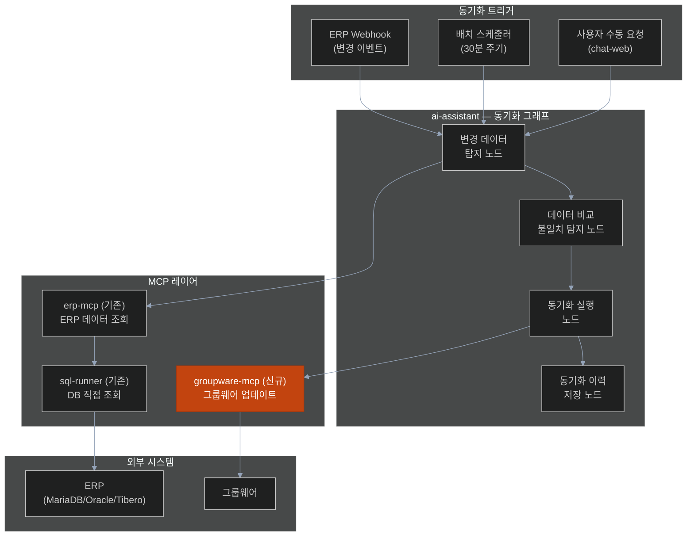

# 과제 2 — MCP 기반 데이터 연동 (ERP-그룹웨어 실시간 동기화)

> **분야**: POC 1 — ERP & 그룹웨어 지능화
> **난이도**: 중
> **구현 기간**: 2주 (groupware-mcp 완성 이후)
> **기존 서비스 활용도**: 65% → **75% (재검토)**

> **🔄 2026-04-21 업데이트**: 시나리오 B에서 **2단계 연기 권장** (양방향 정책 결정 복잡)
> - **결정 포인트 8개**: [→ 15-per-challenge-decision-points.md#과제-2](15-per-challenge-decision-points.md#-과제-2--mcp-기반-erp-그룹웨어-데이터-동기화)
> - **고객 최중요 결정**: D2-06 **그룹웨어 Write 권한 확보** (미확보 시 과제 2 전체 불가)
> - **권장**: ERP → 그룹웨어 단방향 + 30분 주기 배치

---

## 목차

- [1. 과제 개요](#1-과제-개요)
- [2. 구현 아키텍처](#2-구현-아키텍처)
- [3. 서비스 재사용 분석](#3-서비스-재사용-분석)
- [4. 구현 로드맵 및 Task](#4-구현-로드맵-및-task)
- [5. 위험 요소](#5-위험-요소)
- [6. 성공 기준](#6-성공-기준)
- [7. 참조 링크](#7-참조-링크)

---

## 1. 과제 개요

ERP 시스템(인사·회계·예산 데이터)과 그룹웨어(인사 조직·일정·전자결재 데이터)를 MCP 프로토콜로 실시간 연계하여, 중복 입력을 제거하고 두 시스템의 데이터 불일치를 자동 해소

| 항목 | 내용 |
|------|------|
| **핵심 가치** | 양 시스템 중복 입력 제거, 데이터 일관성 보장 |
| **대상 사용자** | 인사·조직 데이터를 양 시스템에 관리하는 담당자 |
| **주요 기능** | ERP→그룹웨어 인사 동기화, 실시간 데이터 불일치 탐지, 동기화 이력 관리 |

---

## 2. 구현 아키텍처

### 2.1 데이터 흐름

```
[ERP 시스템]                    [그룹웨어]
 인사/조직 데이터  ────────────▶  인사/조직 데이터
 예산/결산 데이터  ────────────▶  보고서/일정 데이터
        ↑                               ↑
   erp-mcp (기존)              groupware-mcp (신규)
        ↑                               ↑
        └──────── ai-assistant ─────────┘
                  (동기화 오케스트레이터)
```

### 2.2 동기화 트리거 방식

| 방식 | 설명 | 구현 가능성 |
|------|------|:---------:|
| **이벤트 기반 (Webhook)** | ERP 데이터 변경 시 ai-assistant 알림 → 즉시 동기화 | ERP Webhook 지원 시 ✅ |
| **주기적 배치** | 스케줄러로 N분마다 변경 데이터 감지 후 동기화 | 항상 가능 ✅ |
| **온디맨드** | 담당자 명령으로 수동 동기화 | 항상 가능 ✅ |

### 2.3 동기화 아키텍처 다이어그램



### 2.4 동기화 LangGraph 노드 설계

```python
# ai-assistant 내 동기화 그래프 (신규 추가)
SYNC_GRAPH_NODES = {
    "fetch_erp_hr": "erp-mcp로 ERP 인사/조직 데이터 조회",
    "fetch_gw_hr":  "groupware-mcp로 그룹웨어 인사 데이터 조회",
    "diff_detect":  "양 시스템 데이터 비교 → 불일치 항목 추출",
    "sync_execute": "groupware-mcp.sync_erp_to_groupware() 호출",
    "notify_result": "동기화 결과 사용자/담당자 알림"
}
```

---

## 3. 서비스 재사용 분석

### 재사용 가능 기존 서비스

| 서비스 | 포트 | 재사용 내용 | 추가 개발 |
|--------|:---:|------------|---------|
| **erp-mcp** | 4010 | ERP 인사/조직 데이터 조회 도구 재사용 | 인사 데이터 전용 MCP 도구 추가 |
| **sql-runner** | 4004 | MariaDB/Oracle/Tibero DB 연결 재사용 | 인사 테이블 쿼리 추가 |
| **ai-assistant** | 4005 | LangGraph 그래프 엔진 재사용 | 동기화 전용 그래프 추가 |
| **chat-web** | 3000 | 수동 동기화 명령 UI 재사용 | 동기화 결과 표시 UI 추가 |

### 신규 개발 필요 서비스

| 서비스 | 포트 | 개발 내용 | 공수 |
|--------|:---:|----------|------|
| **groupware-mcp** | 4011 | 그룹웨어 데이터 업데이트 MCP 도구 (`sync_erp_to_groupware`, `update_hr_info`) | 과제 1과 공동 개발 |

### groupware-mcp 동기화 전용 MCP 도구

| 도구명 | 기능 |
|--------|------|
| `sync_erp_to_groupware` | ERP 인사 데이터 → 그룹웨어 일괄 업데이트 |
| `get_hr_info` | 그룹웨어 인사 정보 조회 (비교용) |
| `update_org_chart` | 조직도 변경 사항 그룹웨어에 반영 |

---

## 4. 구현 로드맵 및 Task

### 4.1 선행 조건

> **중요**: 이 과제는 groupware-mcp 개발(과제 1) 이후 진행

### 4.2 단계별 일정 (2주)

```
Week 1 — 데이터 매핑 및 동기화 로직
  ├── [ ] ERP ↔ 그룹웨어 인사 데이터 필드 매핑 정의
  ├── [ ] erp-mcp 인사 데이터 조회 MCP 도구 추가
  ├── [ ] groupware-mcp sync_erp_to_groupware 도구 구현
  └── [ ] 데이터 불일치 탐지 알고리즘 구현

Week 2 — ai-assistant 동기화 그래프 + 테스트
  ├── [ ] ai-assistant 동기화 LangGraph 그래프 구현
  ├── [ ] 배치 스케줄러 연동 (APScheduler 또는 Cron)
  ├── [ ] 동기화 이력 저장 DB 설계 및 구현
  ├── [ ] 동기화 결과 chat-web 알림 연동
  └── [ ] 실제 ERP/그룹웨어 데이터로 통합 테스트
```

### 4.3 Task 목록

| ID | Task | 담당 | 우선순위 | 기간 |
|----|------|------|:-------:|:----:|
| T2-01 | ERP ↔ 그룹웨어 인사 필드 매핑 정의서 작성 | D1 | P0 | 1d |
| T2-02 | erp-mcp 인사 조회 도구 추가 (단위 테스트 포함) | D1 | P0 | 2d |
| T2-03 | groupware-mcp 동기화 도구 구현 (단위 테스트 포함) | D1 | P0 | 2d |
| T2-04 | 데이터 불일치 비교 로직 (diff_detect 노드) | D1 | P0 | 2d |
| T2-05 | ai-assistant 동기화 그래프 구현 (4노드) | D1 | P1 | 2d |
| T2-06 | APScheduler 배치 스케줄러 설정 (30분 주기) | D2 | P1 | 1d |
| T2-07 | 동기화 이력 저장 구현 (NestJS + PostgreSQL) | D2 | P1 | 2d |
| T2-08 | 동기화 결과 대시보드 (admin-web) | D2 | P2 | 2d |
| T2-09 | 동기화 정확도 검증 (샘플 50건) + 재시도 로직 + 안정화 | D1+D2 | P2 | 2d |
| **합계** | | | | **16 man-day** |
| **달력 기간** | D1 9d / D2 7d 병행 진행 | | | **10d (2주)** |

---

## 5. 위험 요소

| # | 위험 요소 | 가능성 | 영향도 | 대응 방안 |
|---|---------|:-----:|:-----:|---------|
| R1 | **ERP ↔ 그룹웨어 데이터 스키마 불일치** | 높음 | 높음 | 필드 매핑 정의서를 사전에 고객사와 합의 후 개발 착수 |
| R2 | **그룹웨어 데이터 쓰기 권한 미확보** | 높음 | 치명 | 읽기 권한으로 POC 시작, 쓰기 권한은 별도 협의 |
| R3 | **실시간 동기화 시 그룹웨어 부하** | 낮음 | 중간 | 배치 방식(30분 주기)으로 우선 구현 후 실시간 전환 검토 |
| R4 | **동기화 중 데이터 충돌 (양방향 수정)** | 중간 | 높음 | ERP 우선 정책 적용 (ERP → 그룹웨어 단방향 동기화) |
| R5 | **대량 인사 변경 시 성능 문제** | 낮음 | 중간 | 배치 크기 제한 (100건/회) + 페이지네이션 처리 |

---

## 6. 성공 기준

| 지표 | 목표값 |
|------|:------:|
| 동기화 성공률 | ≥ 95% |
| 데이터 불일치 탐지 정확도 | ≥ 90% |
| 동기화 처리 시간 (1회) | ≤ 5분 (전체 인사 데이터 기준) |
| 실시간 연동 지연 (이벤트 기반) | ≤ 30초 |

---

## 7. 참조 링크

| 문서 | 경로 |
|------|------|
| POC 전체 아키텍처 | [../00-overall-architecture.md](../00-overall-architecture.md) |
| POC 1 ERP 상세 설계 | [../01-erp-groupware-ai.md](../01-erp-groupware-ai.md) |
| groupware-mcp 설계 | [../design/groupware-mcp.md](../design/groupware-mcp.md) |
| erp-mcp 개선사항 | [../improvements/erp-mcp.md](../improvements/erp-mcp.md) |
| 외부 시스템 사전 요건 | [../04-external-prerequisites.md](../04-external-prerequisites.md) |
| 과제 1 (전자결재 자동 기안) | [01-intelligent-workflow.md](01-intelligent-workflow.md) |
| 과제 3 (개인 맞춤형 비서) | [03-personal-assistant.md](03-personal-assistant.md) |
