```mermaid
sequenceDiagram
    participant S as APScheduler
    participant SG as sync_graph
    participant EM as erp-mcp
    participant GM as groupware-mcp
    participant EDB as ERP DB
    participant GDB as 그룹웨어 DB
    participant AA as alli-audit

    S->>SG: trigger (cron */30)

    rect rgb(30, 60, 100)
        Note over SG,EDB: Phase 1: fetch_erp (500ms)
        SG->>EM: get_hr_info(changed_since=10:00)
        EM->>EDB: SELECT V_ALLI_HCM_EMPLOYEE_FULL WHERE last_modified >= ...
        EDB-->>EM: 12 rows
        EM-->>SG: 12 employees
    end

    rect rgb(30, 90, 60)
        Note over SG,GDB: Phase 2: fetch_gw (800ms)
        SG->>GM: get_hr_info(all=true)
        GM->>GDB: SELECT GW_EMPLOYEE
        GDB-->>GM: 245 rows
        GM-->>SG: 245 employees
    end

    rect rgb(60, 30, 100)
        Note over SG: Phase 3: diff_detect (100ms)
        SG->>SG: INSERT:1, UPDATE:10, DELETE:1
    end

    rect rgb(100, 30, 60)
        Note over SG,GDB: Phase 4: sync_execute (1.8s)
        SG->>GM: sync_erp_to_groupware(12 changes, UPSERT)
        GM->>GDB: Batch upsert (100건 미만)
        GDB-->>GM: 11 success, 1 fail
        GM-->>SG: results
    end

    rect rgb(30, 60, 60)
        Note over SG,AA: Phase 5: log_result (200ms)
        SG->>AA: audit_logs INSERT (category=sync)
    end
```

# 과제 2 ERP-그룹웨어 동기화 — 테스트 시나리오

---

## 📋 시나리오

| # | 시나리오 | 유형 | 기대 결과 |
|:-:|---------|:---:|---------|
| S1 | 정기 배치 정상 | E2E | 12건 UPSERT 성공 |
| S2 | 대량 변경 감지 | 기능 | 50건+ 시 수동 승인 |
| S3 | 충돌 처리 | 기능 | ERP 우선 적용 |
| S4 | 그룹웨어 Write 거부 | 장애 | 탐지 모드로 전환 |
| S5 | 재시도 성공 | 복원력 | 일시 실패 후 재시도 |
| S6 | 사원코드 매핑 불일치 | 경계 | 매핑 테이블 생성 |
| S7 | 퇴직 처리 | 기능 | DELETE (비활성화) |

---

## S1 — 정기 배치 정상 흐름

### 설정
```
시간: 2026-04-21 10:30 (APScheduler cron 발화)
ERP 변경: 최근 30분 내 12건 (신규 1, 수정 10, 삭제 1)
기대: 11건 성공, 1건 실패 (결재 이력 있는 DELETE → DEACTIVATE로 변환)
```

### 아키텍처 동작



### 검증

```python
@pytest.mark.asyncio
async def test_s1_scheduled_sync():
    # Given
    setup_erp_changes(count=12)

    # When
    result = await sync_graph.invoke({
        "sync_id": "SYNC-20260421-001",
        "triggered_by": "SCHEDULER",
    })

    # Then
    assert result["changes_summary"] == {"insert": 1, "update": 10, "delete": 1}
    assert result["success_count"] == 11
    assert result["failed_count"] == 1

    # alli-audit 기록 확인
    audit = await db.find_one("audit_logs", {"payload->>'sync_id'": "SYNC-20260421-001"})
    assert audit["category"] == "sync"
    assert audit["severity"] == "GREEN"
```

---

## S2 — 대량 변경 감지 (조직개편)

### 설정
```
상황: 신년 조직개편으로 500명 부서 이동 감지
기대: large_change_check_node 활성화 → 관리자 알림 → 수동 승인 대기
```

### 아키텍처 동작

```
Phase 3 diff_detect: 500 changes 감지
Phase 4 route_on_change_size: "large" → large_change_check_node

large_change_check_node:
  1. admin-api notify/send 호출 (severity=ORANGE)
     수신: 인사팀장, 시스템 관리자
     내용: "500건 동기화 대기 - 관리자 승인 필요"

  2. REQUIRE_MANUAL_APPROVAL=true 설정 시:
     awaiting_approval=true
     그래프 일시 정지 (sync_execute 미실행)

  3. admin-web /admin/sync/pending 페이지:
     [미리보기] 변경 요약 카드
     [승인] 버튼 → 실제 sync_execute 트리거
     [거부] 버튼 → 취소

  4. 24시간 미승인 시 자동 취소 + 재알림
```

### 검증

```python
async def test_s2_large_change_approval_required():
    # Given
    setup_erp_changes(count=500)
    settings.REQUIRE_MANUAL_APPROVAL_FOR_LARGE_CHANGES = True

    # When
    result = await sync_graph.invoke({...})

    # Then
    assert result["large_change_detected"] is True
    assert result["awaiting_approval"] is True
    assert result.get("success_count", 0) == 0  # 아직 실행 안 됨

    # 알림 발송 확인
    notifications = await db.find("audit_logs", {"category": "sync_large_change_alert"})
    assert len(notifications) == 1
    assert notifications[0]["severity"] == "ORANGE"

    # 관리자 승인 후
    await manually_approve_sync(result["sync_id"])
    result2 = await sync_graph.resume(result["sync_id"])
    assert result2["success_count"] >= 490
```

---

## S3 — 충돌 처리 (ERP 우선)

### 설정
```
상황: 같은 직원이 ERP와 그룹웨어에서 동시 수정됨
  ERP: dept_cd="D010201" (회계부)
  GW:  dept_cd="D010202" (예산부) — 관리자가 수동 수정
  last_modified 같음
기대: ERP 값으로 덮어쓰기 (단방향 정책) + 변경 이력 기록
```

### 아키텍처 동작

```
diff_detect:
  changed_fields: {
    "dept_cd": {"old": "D010202", "new": "D010201"}
  }

sync_execute:
  UPDATE groupware SET dept_cd = 'D010201'

log_result:
  audit_logs.body에 명시: "충돌 발생 — ERP 우선 정책 적용"
  payload.conflict = true
  payload.overridden_gw_value = "D010202"
```

### 검증

```python
async def test_s3_conflict_erp_priority():
    # Given
    set_erp_emp_dept("EMP20240315", "D010201")
    set_gw_emp_dept("EMP20240315", "D010202")

    # When
    result = await sync_graph.invoke({...})

    # Then
    assert get_gw_emp_dept("EMP20240315") == "D010201"  # ERP 값

    # 이력 확인
    audit = await db.find_one("audit_logs", {...})
    assert audit["payload"]["conflict"] is True
    assert audit["payload"]["overridden_gw_value"] == "D010202"
```

---

## S4 — 그룹웨어 Write 거부 (P0-1 미확보 시나리오)

### 설정
```
상황: groupware-mcp sync_erp_to_groupware → 403 Forbidden
기대: 탐지만 모드로 자동 전환 (Read-Only 폴백)
```

### 아키텍처 동작

```
sync_execute_node:
  GroupwareWriteError: 403 Forbidden

  except:
    # 모드 전환
    state["sync_mode"] = "DETECT_ONLY"

    # 불일치만 기록 (실제 동기화 X)
    for change in state["changes"]:
      await alli_audit.insert({
        "category": "sync_mismatch",
        "severity": "YELLOW",
        "title": f"불일치 탐지 (수동 동기화 필요): {change['emp_cd']}",
        "payload": change,
      })

    # 관리자 알림
    await admin_api.notify(
      severity="ORANGE",
      title="그룹웨어 Write 권한 없음 - 탐지 모드로 전환",
      body=f"{len(changes)}건의 불일치 탐지, 수동 동기화 필요"
    )
```

### 검증

```python
async def test_s4_write_denied_fallback_to_detection():
    mock_groupware_mcp.sync.side_effect = HTTPError(403)

    result = await sync_graph.invoke({...})

    assert result["sync_mode"] == "DETECT_ONLY"
    assert result["success_count"] == 0  # 실제 동기화 0건

    # 탐지 이력은 기록
    mismatches = await db.find("audit_logs", {"category": "sync_mismatch"})
    assert len(mismatches) == len(result["changes"])
```

---

## S5 — 재시도 성공 (일시 장애 복원)

### 설정
```
상황: 배치 중 3건 일시 실패 (네트워크 불안정)
     재시도 3회 (지수 백오프: 1s → 2s → 4s)
기대: 3건 모두 최종 성공
```

### 아키텍처 동작

```
sync_execute_node:
  batch_result = await groupware_mcp.call_tool(...)

  failed_items = [r for r in batch_result if r["status"] == "FAILED"]

  # 재시도 대상
  for attempt in range(3):
    if not failed_items:
      break
    await asyncio.sleep(2 ** attempt)  # 1s, 2s, 4s
    retry_result = await groupware_mcp.call_tool("sync_erp_to_groupware", {
      "employees": failed_items,
      "retry_attempt": attempt + 1,
    })
    failed_items = [r for r in retry_result if r["status"] == "FAILED"]
```

---

## S6 — 사원코드 매핑 불일치

### 설정
```
상황: ERP(EMP_CD: "E20240315") vs 그룹웨어(USER_ID: "hong123")
     형식 상이
기대: EMP_CD_MAPPING 테이블 생성 + 매핑 기반 동기화
```

### 아키텍처 동작

```
초기 sync 전 사전 작업:
  1. 매핑 테이블 스캔
     SELECT * FROM EMP_CD_MAPPING

  2. 누락된 매핑 감지 시 관리자 알림
     "매핑 누락: EMP_CD 5건"

  3. 관리자가 admin-web /admin/emp-mapping/missing 에서 수동 매핑

sync_execute 시:
  erp_emp_cd="EMP20240315"
  → mapping 조회: gw_emp_cd="hong123"
  → groupware-mcp 호출 시 gw_emp_cd 사용
```

---

## S7 — 퇴직 처리 (DELETE → DEACTIVATE)

### 설정
```
상황: ERP에서 직원 퇴직 처리됨 (RETIRE_DATE 설정)
     그룹웨어에 결재 이력 존재 → 완전 삭제 불가
기대: 비활성화 (active_yn="N") 처리
```

### 아키텍처 동작

```
diff_detect:
  action = "DELETE" (ERP에 없고 그룹웨어에만 있음)

sync_execute:
  groupware-mcp sync_erp_to_groupware:
    DELETE 시도 → 그룹웨어 측 제약 (결재 이력) → FAIL

    대신 UPDATE active_yn='N' 시도 → SUCCESS

  결과: {"status": "SUCCESS", "action": "DEACTIVATED", "reason": "결재 이력 보존"}
```

### 검증

```python
async def test_s7_retire_deactivate():
    # Given
    set_erp_retire("EMP20180205")  # 퇴직 처리
    create_gw_approval_history("EMP20180205")  # 결재 이력 있음

    # When
    result = await sync_graph.invoke({...})

    # Then
    delete_result = [r for r in result["sync_results"] if r["emp_cd"] == "EMP20180205"]
    assert delete_result[0]["action"] == "DEACTIVATED"

    # 그룹웨어 측 active_yn='N' 확인
    gw_emp = await gw_db.find_one("GW_EMPLOYEE", {"emp_cd": "EMP20180205"})
    assert gw_emp["active_yn"] == "N"
```

---

## 📊 커버리지

| 요소 | S1 | S2 | S3 | S4 | S5 | S6 | S7 |
|------|:--:|:--:|:--:|:--:|:--:|:--:|:--:|
| fetch_erp | ✅ | ✅ | ✅ | ✅ | ✅ | ✅ | ✅ |
| fetch_gw | ✅ | ✅ | ✅ | ✅ | ✅ | ✅ | ✅ |
| diff_detect | ✅ | ✅ | ✅ | ✅ | — | ✅ | ✅ |
| large_change_check | — | ✅ | — | — | — | — | — |
| sync_execute | ✅ | ⚠️ | ✅ | ⚠️ | ✅ | ✅ | ✅ |
| 재시도 로직 | — | — | — | — | ✅ | — | — |
| 충돌 해결 | — | — | ✅ | — | — | — | — |
| Write 폴백 | — | — | — | ✅ | — | — | — |
