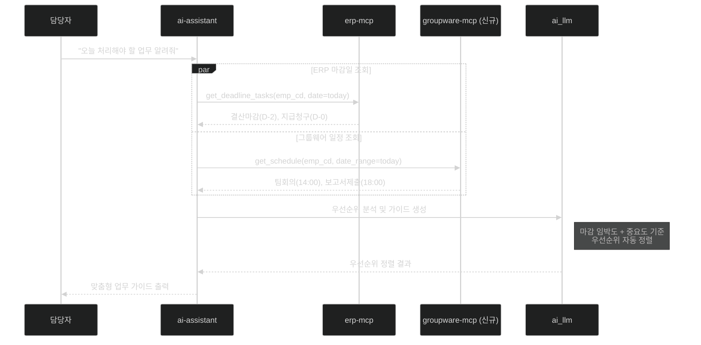

# 과제 3 — 개인 맞춤형 비서 (일정 및 업무 리마인드)

> **분야**: POC 1 — ERP & 그룹웨어 지능화
> **난이도**: 중하
> **구현 기간**: 1.5주 → **1주 (재검토, 4/21)**
> **기존 서비스 활용도**: 80% → **90% (재검토)**

> **🔄 2026-04-21 업데이트**: ai-assistant `parallel_fetch` 패턴 이미 구현 → 대폭 단축
> - **결정 포인트 7개**: [→ 15-per-challenge-decision-points.md#과제-3](15-per-challenge-decision-points.md#-과제-3--개인-맞춤형-비서-일정업무-리마인드)
> - **고객 핵심 결정**: 우선순위 알고리즘 (아이젠하워 권장), 개인정보 표시 수준
> - **재사용 포인트**: ai-assistant fetch_node (병렬 조회 완비)

---

## 목차

- [1. 과제 개요](#1-과제-개요)
- [2. 구현 아키텍처](#2-구현-아키텍처)
- [3. 서비스 재사용 분석](#3-서비스-재사용-분석)
- [4. 구현 로드맵 및 Task](#4-구현-로드맵-및-task)
- [5. 위험 요소](#5-위험-요소)
- [6. 성공 기준](#6-성공-기준)
- [7. 참조 링크](#7-참조-링크)

---

## 1. 과제 개요

ERP 시스템의 미처리 업무 마감일과 그룹웨어 일정을 AI가 통합 분석하여, 담당자에게 우선순위가 높은 업무 가이드를 맞춤형으로 제공하는 AI 비서 기능

| 항목 | 내용 |
|------|------|
| **핵심 가치** | 마감 누락 방지, 업무 우선순위 자동 정렬 |
| **대상 사용자** | ERP 마감 업무와 그룹웨어 일정이 많은 행정 담당자 |
| **주요 기능** | 오늘의 업무 우선순위 가이드, 마감 임박 알림, 미처리 결재 알림 |

---

## 2. 구현 아키텍처

### 2.1 데이터 통합 흐름

```
행정 담당자 ("오늘 처리해야 할 업무 알려줘")
    │
    ▼
ai-assistant (병렬 데이터 조회)
    ├── erp-mcp → ERP 마감일 데이터 조회
    │    ├── 결산 마감일
    │    ├── 지급 청구 마감
    │    └── 미처리 결재 목록
    └── groupware-mcp → 그룹웨어 일정 조회
         ├── 오늘 회의 일정
         ├── 보고서 제출 기한
         └── 출장 일정
    │
    ▼
ai_llm — 우선순위 분석 + 맞춤형 가이드 생성
    │
    ▼
"긴급: 지급청구 마감(오늘 18:00), 팀 회의(14:00)
 내일까지: 결산마감, 보고서 제출"
```

### 2.2 병렬 처리 시퀀스



### 2.3 LangGraph 개인비서 그래프 설계

```
[개인비서_그래프]
  start
    ↓
  parallel_fetch:  ← 기존 ai-assistant 병렬 조회 패턴 재사용
    ├── fetch_erp_deadlines   ← erp-mcp: 마감일/미처리 업무
    ├── fetch_gw_schedule     ← groupware-mcp: 일정/회의
    └── fetch_pending_approvals ← groupware-mcp: 미결재 목록
    ↓
  analyze_priority             ← ai_llm: 우선순위 분석
    ↓
  generate_guide               ← ai_llm: 맞춤형 가이드 생성
    ↓
  end
```

---

## 3. 서비스 재사용 분석

### 재사용 가능 기존 서비스

| 서비스 | 포트 | 재사용 내용 | 추가 개발 |
|--------|:---:|------------|---------|
| **ai-assistant** | 4005 | 병렬 데이터 조회 패턴 (parallel_fetch) 재사용 | 개인비서 그래프 노드 추가 |
| **erp-mcp** | 4010 | ERP 데이터 조회 재사용 | `get_deadline_tasks`, `get_pending_items` 도구 추가 |
| **chat-web** | 3000 | 채팅 인터페이스 재사용 | 리마인드 카드 UI 추가 |
| **chat-api** | 4002 | 메시지 라우팅 재사용 | 개인비서 모드 라우팅 추가 |
| **ai_llm** | 6001 | 텍스트 생성 재사용 | 업무 우선순위 분석 프롬프트 추가 |

### 신규 개발 필요 서비스

| 서비스 | 포트 | 개발 내용 | 공수 |
|--------|:---:|----------|------|
| **groupware-mcp** | 4011 | 일정 조회 MCP 도구 (`get_schedule`, `get_pending_approvals`) | 과제 1과 공동 개발 |

### erp-mcp 추가 MCP 도구 (기존 서비스 확장)

| 도구명 | 기능 |
|--------|------|
| `get_deadline_tasks` | 개인별 마감 임박 업무 목록 조회 |
| `get_pending_items` | 미처리 알림/결재 목록 조회 |
| `get_monthly_schedule` | ERP 월간 마감 일정 조회 |

---

## 4. 구현 로드맵 및 Task

### 4.1 선행 조건

> **중요**: groupware-mcp의 `get_schedule` 도구 완성 후 진행 가능 (과제 1과 병행 가능)

### 4.2 단계별 일정 (2주)

```
Week 1 — 데이터 수집 및 분석 로직
  ├── [ ] erp-mcp 마감일 조회 도구 추가 (get_deadline_tasks)
  ├── [ ] erp-mcp 미처리 알림 도구 추가 (get_pending_items)
  ├── [ ] groupware-mcp 일정 조회 확인 (과제 1에서 구현)
  └── [ ] 우선순위 분석 프롬프트 개발 (중요도 + 긴급도 매트릭스)

Week 2 — ai-assistant 통합 + UI 연동
  ├── [ ] ai-assistant 개인비서 LangGraph 그래프 구현
  ├── [ ] 병렬 조회 노드 (parallel_fetch) 구현
  ├── [ ] 우선순위 분석 노드 구현
  ├── [ ] chat-web 리마인드 카드 UI 추가
  └── [ ] 사용자 시나리오 테스트 (3종 역할 페르소나)
```

### 4.3 Task 목록

| ID | Task | 담당 | 우선순위 | 기간 |
|----|------|------|:-------:|:----:|
| T3-01 | erp-mcp 마감일 조회 도구 구현 (단위 테스트 포함) | D1 | P0 | 1d |
| T3-02 | 우선순위 분석 프롬프트 개발 | D1 | P0 | 2d |
| T3-03 | ai-assistant 개인비서 그래프 구현 (3노드) | D1 | P0 | 2d |
| T3-04 | 병렬 데이터 조회 최적화 | D1 | P1 | 1d |
| T3-05 | chat-web 리마인드 카드 UI | D2 | P1 | 2d |
| T3-06 | 개인비서 응답 품질 평가 (5명 사용자 테스트) | D1 | P1 | 1d |
| T3-07 | 정기 알림 기능 (APScheduler 매일 09:00) | D2 | P2 | 1d |
| T3-08 | E2E 검증 + 응답 지연 측정 + 시스템 안정화 | D1+D2 | P2 | 1d |
| **합계** | | | | **11 man-day** |
| **달력 기간** | D1 7d 기준, D2 4d 병행 | | | **8d (1.5주)** |

---

## 5. 위험 요소

| # | 위험 요소 | 가능성 | 영향도 | 대응 방안 |
|---|---------|:-----:|:-----:|---------|
| R1 | **그룹웨어 일정 API 미제공** | 중간 | 높음 | Mock 일정 데이터로 먼저 개발, API 확보 후 연동 |
| R2 | **LLM 우선순위 판단 오류** | 중간 | 중간 | 규칙 기반 우선순위(마감일 D-0/D-1/D-3)와 LLM 혼합 사용 |
| R3 | **ERP 마감일 데이터 구조 파악 지연** | 중간 | 중간 | 데이터 엔지니어가 사전에 ERP DB 스키마 파악 필수 |
| R4 | **병렬 조회 타임아웃** | 낮음 | 중간 | 각 데이터 소스 타임아웃 5초 설정, 실패 시 부분 결과 반환 |
| R5 | **개인정보 포함 데이터 노출** | 낮음 | 높음 | 응답에서 개인식별정보 마스킹 처리 레이어 추가 |

---

## 6. 성공 기준

| 지표 | 목표값 |
|------|:------:|
| 업무 리마인드 만족도 | ≥ 4/5점 (사용자 설문) |
| 우선순위 정렬 정확도 | ≥ 80% (전문가 평가) |
| 전체 응답 시간 (병렬 조회 포함) | ≤ 8초 |
| 마감 임박 업무 누락율 | ≤ 5% |

---

## 7. 참조 링크

| 문서 | 경로 |
|------|------|
| POC 전체 아키텍처 | [../00-overall-architecture.md](../00-overall-architecture.md) |
| POC 1 ERP 상세 설계 | [../01-erp-groupware-ai.md](../01-erp-groupware-ai.md) |
| groupware-mcp 설계 | [../design/groupware-mcp.md](../design/groupware-mcp.md) |
| ai-assistant 개선사항 | [../improvements/ai-assistant.md](../improvements/ai-assistant.md) |
| 과제 1 (전자결재 자동 기안) | [01-intelligent-workflow.md](01-intelligent-workflow.md) |
| 과제 2 (MCP 데이터 연동) | [02-mcp-data-sync.md](02-mcp-data-sync.md) |
