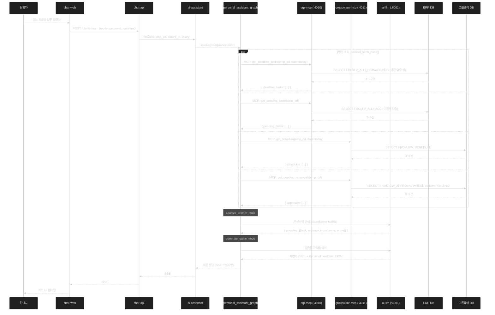

# 과제 3 — 개인 맞춤형 비서 구현 가이드

> **작성일**: 2026-04-21
> **과제 문서**: [../03-personal-assistant.md](../03-personal-assistant.md)
> **구현 기간**: 1주 (D1 4일 + D2 2일)
> **재사용률**: 90%

---

## 1. 구현 개요

행정 담당자가 "오늘 처리해야 할 업무 알려줘"라고 물으면, ai-assistant가 **병렬로 ERP와 그룹웨어 데이터**를 조회하여 우선순위 기반 맞춤형 업무 가이드를 생성하는 시나리오.

### 데이터 흐름



---

## 2. 외부 시스템 의존성

| 시스템 | 용도 | 접근 방식 | P0 결정 |
|--------|------|---------|:------:|
| **ERP DB** | 마감 업무/미결재 조회 | sql-runner Read-Only | ✅ |
| **그룹웨어 DB/API** | 일정/미결재 조회 | groupware-mcp (REST or DB Direct) | 🔴 D2-06 |
| **LLM (Gemma-4 31B)** | 우선순위 분석·가이드 생성 | vllm-vision:6012 | ✅ |
| **ai-assistant** | LangGraph 오케스트레이션 | 기존 17노드 재사용 | ✅ |

**상세**: [external-dependencies.md](external-dependencies.md)

---

## 3. 폴더 구성

| 파일 | 내용 |
|------|------|
| [README.md](README.md) | 본 문서 (구현 체크리스트 + 가이드) |
| [external-dependencies.md](external-dependencies.md) | 외부 시스템 연동 명세 |
| [architecture.md](architecture.md) | 상세 구성도 (Mermaid) |
| [erp-mcp-tools.md](erp-mcp-tools.md) | **erp-mcp 도구 스펙** (API 스키마 + 응답 샘플) |
| [groupware-mcp-tools.md](groupware-mcp-tools.md) | **groupware-mcp 도구 스펙** (API 스키마 + 응답 샘플) |
| [db-schemas.sql](db-schemas.sql) | **DB 테이블·뷰 구조 (ERP/그룹웨어)** |
| [api-samples.json](api-samples.json) | **end-to-end 요청/응답 샘플** |
| [prompt-templates.md](prompt-templates.md) | 우선순위 분석 + 가이드 생성 프롬프트 |

---

## 4. 구현 체크리스트

### Phase 1 — MCP 도구 추가 (D1, 2일)

```
[erp-mcp 확장 — apps/erp-mcp/src/tools/]
□ get_deadline_tasks.py (신규)
  - 입력: emp_cd, date, horizon_days(기본 7)
  - 출력: { tasks: [{task_id, title, type, deadline, importance}] }
  - 쿼리 대상: V_ALLI_HCM_DEADLINE, V_ALLI_ACC_CLOSING, V_ALLI_BDG_SUBMIT

□ get_pending_items.py (신규)
  - 입력: emp_cd
  - 출력: { pending: [{item_id, category, title, amount, waiting_since}] }
  - 쿼리 대상: V_ALLI_ACC_PENDING_EXPENSE, V_ALLI_HCM_PENDING_LEAVE

□ get_monthly_schedule.py (선택)
  - 입력: emp_cd, year, month
  - 출력: { schedules: [...] }

[erp-mcp MCP 등록]
□ src/mcp/server.py에 3개 도구 @mcp.tool 데코레이터 등록
□ 단위 테스트 작성 (Mock DB)
```

### Phase 2 — groupware-mcp 구현 (D1, 3일)

```
[groupware-mcp 초기화 — apps/groupware-mcp/]
□ erp-mcp 복제 (apps/erp-mcp → apps/groupware-mcp)
□ config.py 수정 (GROUPWARE_API_URL, GROUPWARE_DB_URL 등)
□ security/ JWT ES256 인증 복제

[그룹웨어 클라이언트 — src/clients/groupware_client.py]
□ REST API 어댑터 또는 DB Direct 어댑터 구현
□ 인증 처리 (OAuth/API Key/SOAP)

[MCP 도구 3종 — src/tools/]
□ get_schedule.py
  - 입력: emp_cd, date_from, date_to
  - 출력: { schedules: [{schedule_id, title, start_dt, end_dt, location}] }
  
□ get_pending_approvals.py
  - 입력: emp_cd
  - 출력: { approvals: [{approval_id, title, requester, submitted_at}] }

□ get_monthly_schedule.py (선택)
```

### Phase 3 — ai-assistant 개인비서 그래프 (D1, 2일)

```
[신규 그래프 — apps/ai-assistant/src/graph/graphs/personal_assistant_graph.py]
□ StateGraph 정의 (PersonalAssistantState)
□ parallel_fetch 노드 (fetch_node 재사용, 4개 MCP 호출 병렬)
□ analyze_priority 노드 (신규) — Eisenhower Matrix LLM 프롬프트
□ generate_guide 노드 (generate_node 재사용) — 자연어 가이드 생성

[orchestrator_graph 라우팅]
□ classify_node에서 personal_assistant 모드 감지
□ 모드별 서브그래프 호출

[프롬프트 — apps/ai-assistant/src/prompts/modes/]
□ personal_assistant.py 추가 (시스템 프롬프트 + Few-shot 예시)
```

### Phase 4 — chat-web UI (D2, 2일)

```
[신규 컴포넌트 — apps/chat-web/src/components/slots/]
□ PersonalTaskCard.tsx
  - Props: tasks[], priorities[], recommendations[]
  - 렌더링: 긴급/중요 매트릭스 + 업무 목록 카드

[chat_mode 라우팅]
□ chat-web mode selector에 "개인비서" 옵션 추가
□ chatReducer에 personal_assistant 모드 추가
```

### Phase 5 — 검증 (D1+D2, 1일)

```
□ E2E 시나리오 테스트 (5명 페르소나: 회계/인사/감사/일반/과장)
□ 병렬 조회 성능 측정 (≤ 5초)
□ 우선순위 정확도 평가 (전문가 20건 80%+)
□ 개인정보 마스킹 검증
```

---

## 5. 핵심 결정 포인트 (고객 협의)

상세 7개 결정: [../decisions.md#-과제-3--개인-맞춤형-비서-일정업무-리마인드](../decisions.md)

P0 핵심:
- **D3-01 우선순위 알고리즘** — 아이젠하워 매트릭스 권장
- **D3-04 업무 카테고리** — 마감업무/미결재/일정/미결재 4종 기본
- **D3-06 개인정보 표시** — 본인만 전체, 타자 마스킹

---

## 6. 성공 기준 (KPI)

| 지표 | 목표 |
|------|:---:|
| 전체 응답 시간 (병렬 조회 포함) | ≤ 8초 |
| 우선순위 정렬 정확도 (전문가 평가) | ≥ 80% |
| 사용자 만족도 | ≥ 4/5 |
| 마감 임박 업무 누락율 | ≤ 5% |

---

## 7. 관련 문서

- [../03-personal-assistant.md](../03-personal-assistant.md) — 원본 과제 문서
- [../01-intelligent-workflow/](../01-intelligent-workflow/) — 과제 1 (결재 기안, groupware-mcp 공유)
- [../../services/new/groupware-mcp.md](../../services/new/groupware-mcp.md) — groupware-mcp 설계
- [../../services/improvements/erp-mcp.md](../../services/improvements/erp-mcp.md) — erp-mcp 확장
- [../../services/improvements/ai-assistant.md](../../services/improvements/ai-assistant.md) — ai-assistant 그래프 4종
