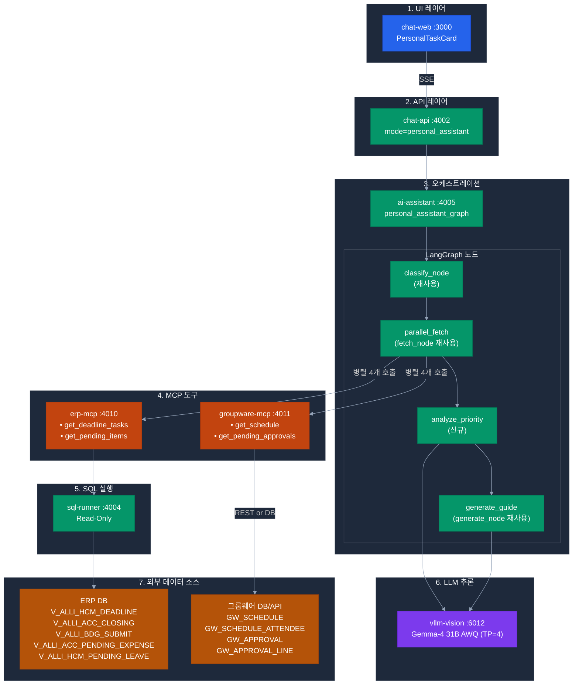
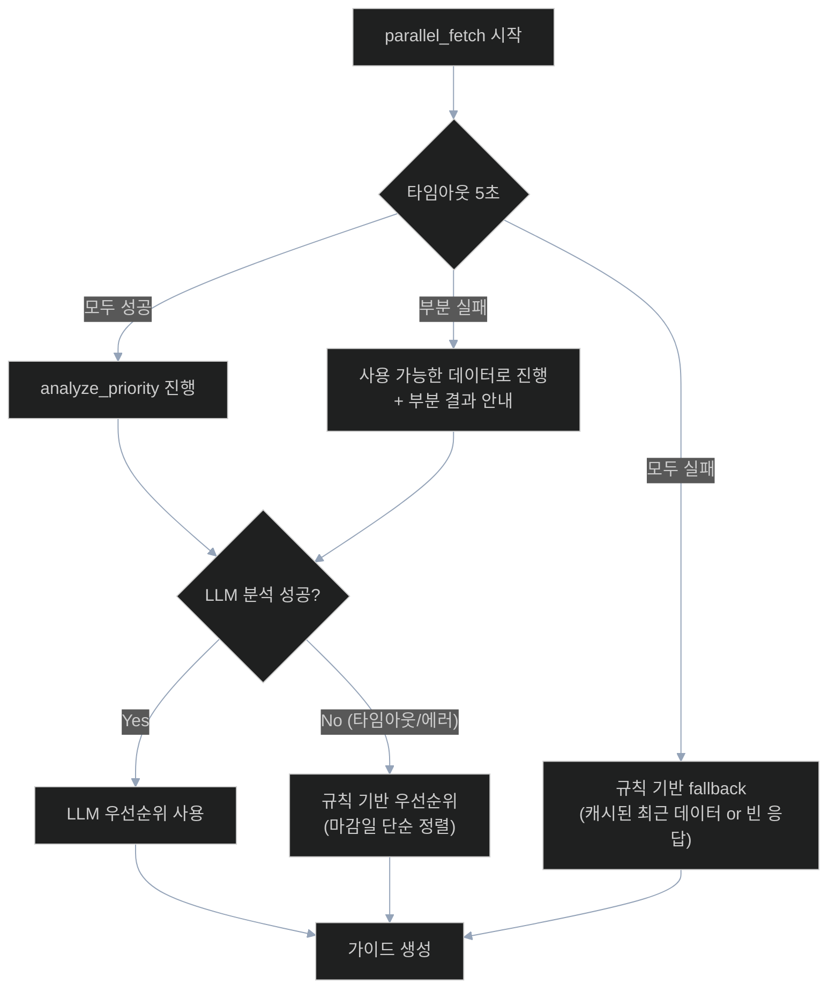

# 과제 3 개인비서 — 상세 구성도

> **작성일**: 2026-04-21

---

## 1. 전체 컴포넌트 아키텍처



---

## 2. 병렬 조회 타임라인

```mermaid
%%{init: {'theme': 'dark', 'themeVariables': {'primaryColor': '#1d4ed8', 'primaryTextColor': '#f8fafc', 'primaryBorderColor': '#3b82f6', 'lineColor': '#94a3b8', 'secondaryColor': '#1e293b', 'tertiaryColor': '#0f172a'}}}%%
sequenceDiagram
    participant PA as personal_assistant_graph
    participant EM as erp-mcp
    participant GM as groupware-mcp
    participant LLM as ai-llm (Gemma-4)

    Note over PA: 총 예상 시간: 8초 이내

    rect rgb(30, 60, 100)
        Note over PA,GM: Phase 1: 병렬 조회 (~5초)
        par ERP 마감업무
            PA->>+EM: get_deadline_tasks
            EM-->>-PA: tasks[] (1~2s)
        and ERP 미결재
            PA->>+EM: get_pending_items
            EM-->>-PA: items[] (1~2s)
        and 그룹웨어 일정
            PA->>+GM: get_schedule
            GM-->>-PA: schedules[] (2~3s)
        and 그룹웨어 결재
            PA->>+GM: get_pending_approvals
            GM-->>-PA: approvals[] (1~2s)
        end
    end

    rect rgb(60, 30, 100)
        Note over PA,LLM: Phase 2: 우선순위 분석 (~2초)
        PA->>+LLM: analyze_priority (JSON 응답)
        LLM-->>-PA: priorities[]
    end

    rect rgb(60, 30, 80)
        Note over PA,LLM: Phase 3: 가이드 생성 (~1초 SSE 스트리밍 시작)
        PA->>+LLM: generate_guide (SSE)
        LLM-->>-PA: 토큰 스트리밍
    end
```



---

## 3. 데이터 변환 흐름


---

## 4. Eisenhower Matrix 우선순위 분석

```
               중요함 (Important)           비중요 (Not Important)
           ┌─────────────────────────────────────────────────┐
  긴급함   │ Q1: 긴급·중요                 │ Q3: 긴급·비중요       │
 (Urgent)  │ → 즉시 실행 (Do)              │ → 위임 or 빠르게 처리  │
           │                              │                    │
           │ 예: 월결산 마감 (D-0 18:00)    │ 예: 출장비 결재 재촉    │
           ├──────────────────────────────┼────────────────────┤
 비긴급    │ Q2: 비긴급·중요               │ Q4: 비긴급·비중요      │
 (Not     │ → 계획적으로 처리 (Schedule)  │ → 제거/스킵 (Delete)   │
 Urgent)   │                              │                    │
           │ 예: 정기평가 의견 제출 (D-2)    │ 예: 선택 설명회 참석    │
           └─────────────────────────────────────────────────┘
```

### 점수 공식

```
urgency_score = max(0, 10 - days_remaining × 2)   (1~10)
importance_score = HIGH=10 / MEDIUM=6 / LOW=3
total_score = urgency_score × importance_score
```

### Quadrant 할당

```python
def assign_quadrant(urgency: int, importance: int) -> str:
    if urgency >= 7 and importance >= 7:
        return "Q1"  # 긴급·중요 (즉시 실행)
    elif urgency < 7 and importance >= 7:
        return "Q2"  # 비긴급·중요 (계획)
    elif urgency >= 7 and importance < 7:
        return "Q3"  # 긴급·비중요 (위임)
    else:
        return "Q4"  # 비긴급·비중요 (제거)
```

---

## 5. 에러 처리 & Fallback



---

## 6. 캐싱 전략

| 레이어 | 캐시 키 | TTL | 목적 |
|--------|--------|:---:|------|
| Redis (ai-assistant) | `personal_assistant:{emp_cd}:{date}` | 5분 | 동일 사용자 반복 호출 |
| erp-mcp | `deadline_tasks:{emp_cd}:{date}` | 10분 | ERP 부하 감소 |
| groupware-mcp | `schedule:{emp_cd}:{date}` | 5분 | 그룹웨어 API Rate Limit 회피 |

> **주의**: 미결재 건은 실시간성 중요 → 캐싱 TTL 짧게 (1분 이하) 또는 캐싱 안 함.

---

## 7. 관련 문서

- [README.md](README.md) — 구현 체크리스트
- [erp-mcp-tools.md](erp-mcp-tools.md) — ERP MCP 도구 스펙
- [groupware-mcp-tools.md](groupware-mcp-tools.md) — 그룹웨어 MCP 도구 스펙
- [db-schemas.sql](db-schemas.sql) — DB 테이블/뷰 구조
- [api-samples.json](api-samples.json) — 전체 End-to-End 샘플
- [prompt-templates.md](prompt-templates.md) — LLM 프롬프트
