# 과제 3 개인비서 — 테스트 시나리오 (아키텍처 동작 상세)

> **목적**: 각 시나리오에서 아키텍처가 어떻게 작동하는지 단계별로 추적
> **테스트 전략**: 단위 테스트 + 통합 테스트 + E2E + 부하/장애 테스트 조합
> **연관 문서**: [implementation-architecture.md](implementation-architecture.md) / [api-samples.json](api-samples.json)

---

## 📋 시나리오 개요

| # | 시나리오 | 유형 | 목적 | 성공 기준 |
|:-:|---------|:---:|------|---------|
| S1 | 정상 경로 | E2E | Happy Path 검증 | 8초 내 카드 응답 |
| S2 | ERP 부분 실패 | 통합 | Partial Failure 복원력 | 사용 가능한 데이터로 응답 |
| S3 | 모든 MCP 실패 | 통합 | Circuit Breaker | fallback 경로 |
| S4 | LLM 타임아웃 | 통합 | Rule-based Fallback | 규칙 기반 우선순위 |
| S5 | 캐시 적중 | 성능 | Redis 캐싱 | 1초 내 응답 |
| S6 | 동시 다중 요청 | 부하 | 동시성 처리 | 10 RPS 안정 |
| S7 | 개인정보 마스킹 | 보안 | 타인 이름 마스킹 | 본인 제외 모두 마스킹 |
| S8 | JWT 만료 | 보안 | 인증 실패 처리 | 401 Unauthorized |
| S9 | 대량 데이터 | 경계 | 토큰 한도 초과 | 중요한 것만 선별 |
| S10 | 신규 사원 | 경계 | 빈 데이터 처리 | "오늘 업무 없음" |

---

## S1 — 정상 경로 (Happy Path)

### 시나리오 설정

```
사용자: 홍길동 (EMP20240315, 회계부 주임)
시간:   2026-04-21 10:05 (월요일 오전)
입력:   "오늘 처리할 업무 알려줘"
기대:   Eisenhower 매트릭스 카드 + 월결산 마감 우선 안내
```

### 아키텍처 동작 (단계별 추적)

```mermaid
%%{init: {'theme': 'dark', 'themeVariables': {'primaryColor': '#1d4ed8', 'primaryTextColor': '#f8fafc', 'primaryBorderColor': '#3b82f6', 'lineColor': '#94a3b8', 'secondaryColor': '#1e293b', 'tertiaryColor': '#0f172a'}}}%%
sequenceDiagram
    autonumber
    participant U as 홍길동
    participant CW as chat-web
    participant CA as chat-api
    participant AA as ai-assistant
    participant PA as personal_assistant_graph
    participant Auth as auth-api
    participant EM as erp-mcp
    participant GM as groupware-mcp
    participant SR as sql-runner
    participant EDB as ERP DB
    participant VL as vllm-vision

    U->>CW: 메시지 입력 + Enter
    CW->>CA: POST /chat/stream<br/>(mode=personal_assistant)
    Note over CA: JWT 검증 (auth-api)
    CA->>AA: 요청 전달 + SSE 열기

    AA->>PA: personal_assistant_graph.invoke(state)

    rect rgb(30, 60, 100)
        Note over PA,Auth: [Step 1] load_emp_context_node (120ms)
        PA->>Auth: GET /employees/EMP20240315
        Auth-->>PA: {emp_nm:"홍길동", dept_nm:"회계부", position:"주임"}
    end

    rect rgb(30, 90, 60)
        Note over PA,EDB: [Step 2] parallel_fetch_node (3.8초)
        par ERP 마감업무
            PA->>EM: MCP call get_deadline_tasks
            EM->>SR: SQL V_ALLI_ACC_CLOSING + HCM_DEADLINE + BDG_SUBMIT
            SR->>EDB: SELECT (3 UNION ALL)
            EDB-->>SR: 3 rows
            SR-->>EM: JSON
            EM-->>PA: 3 tasks (D-0, D-2, D-7)
        and ERP 미결재
            PA->>EM: MCP call get_pending_items
            EM->>SR: SQL V_ALLI_ACC_PENDING_EXPENSE + LEAVE
            SR->>EDB: SELECT
            EDB-->>SR: 2 rows
            EM-->>PA: 2 items (출장비 결재 대기 3일+)
        and 그룹웨어 일정
            PA->>GM: MCP call get_schedule
            GM->>GM: REST API (mode=REST) or DB Direct
            GM-->>PA: 3 schedules
        and 그룹웨어 결재
            PA->>GM: MCP call get_pending_approvals
            GM-->>PA: 0 approvals (주임은 결재자 아님)
        end
    end

    rect rgb(60, 30, 100)
        Note over PA,VL: [Step 3] analyze_priority_node (1.8초)
        PA->>PA: 4개 결과 요약
        PA->>VL: LLM JSON 요청<br/>(Eisenhower + Few-shot)
        VL->>VL: Gemma-4 31B 추론<br/>(TP=4 GPU 0-3)
        VL-->>PA: priorities[8개]
    end

    rect rgb(100, 30, 60)
        Note over PA,VL: [Step 4] generate_guide_node (2.1초, SSE 시작)
        PA->>VL: 가이드 생성 스트리밍
        loop 토큰 단위 스트리밍
            VL-->>PA: 토큰
            PA-->>AA: SSE chunk
            AA-->>CA: SSE chunk
            CA-->>CW: SSE chunk
            CW-->>U: PersonalTaskCard 점진 렌더링
        end
        VL-->>PA: 완료 (JSON 최종)
    end

    Note over U,VL: 총 소요: 7.9초 (SLO 8초 내 ✅)
```



### 검증 포인트

```python
# tests/integration/test_s1_happy_path.py

@pytest.mark.asyncio
async def test_s1_happy_path():
    # Given
    setup_test_data(emp_cd="EMP20240315", date="2026-04-21")

    # When
    start = time.time()
    response = await chat_api_client.post_stream(
        "/chat/stream",
        json={
            "chat_mode": "personal_assistant",
            "message": "오늘 처리할 업무 알려줘",
            "context": {"emp_cd": "EMP20240315", "date": "2026-04-21"}
        },
        headers={"Authorization": f"Bearer {valid_jwt}"}
    )
    events = await collect_sse_events(response, timeout=15)
    elapsed = time.time() - start

    # Then
    # 1. 성능 SLO
    assert elapsed < 8.0, f"8초 초과: {elapsed}s"

    # 2. SSE 이벤트 시퀀스
    assert events[0]["event"] == "personal_assistant_card.chunk"
    assert events[-1]["event"] == "personal_assistant_card.complete"

    # 3. 최종 카드 검증
    final_card = events[-1]["data"]
    assert final_card["summary"]
    assert "월결산" in final_card["summary"]

    # 4. Quadrant 분배
    matrix = final_card["matrix"]
    assert len(matrix["q1_urgent_important"]) >= 1
    q1_titles = [t["title"] for t in matrix["q1_urgent_important"]]
    assert any("월결산" in title for title in q1_titles)

    # 5. 추천 액션 시퀀스
    assert len(final_card["recommended_action_sequence"]) >= 3

    # 6. 메트릭 검증
    assert prometheus_metric("ai_assistant_personal_assistant_requests_total", status="success") == 1
```

---

## S2 — ERP 부분 실패 (Partial Failure)

### 시나리오 설정

```
상황: erp-mcp의 get_deadline_tasks가 타임아웃 (ERP DB 응답 지연)
     나머지 3개 MCP는 정상
기대: 사용 가능한 3개 데이터로 응답 생성 + 배너로 부분 실패 안내
```

### 아키텍처 동작

```
Step 2 — parallel_fetch_node:
  asyncio.gather(return_exceptions=True) 사용 → 개별 실패 허용

  [deadline_tasks]   타임아웃 (5s 초과) → TimeoutError 수집
  [pending_items]    성공 → 2건 수집
  [schedules]        성공 → 3건 수집
  [approvals]        성공 → 0건 수집

  state["fetch_errors"] = {"deadline_tasks": "timeout after 5s"}
  state["deadline_tasks"] = []

  조건부 라우팅 → check_fetch_result 평가:
    - 모두 성공? No
    - 부분 성공 (2개 이상)? Yes
    → "partial_success" → analyze_priority로 진행

Step 3 — analyze_priority_node:
  프롬프트 주입 시 "deadline_tasks: (없음 - 데이터 조회 실패)" 명시
  LLM이 나머지 데이터만으로 우선순위 분석
  가이드 하단에 "※ 일부 데이터 조회 실패: ERP 마감업무" 배너 포함
```

### 검증 포인트

```python
@pytest.mark.asyncio
async def test_s2_erp_partial_failure():
    # Given: erp-mcp get_deadline_tasks 강제 타임아웃
    mock_erp_mcp.set_tool_behavior("get_deadline_tasks", timeout=10)

    # When
    response = await invoke_personal_assistant(...)

    # Then
    assert response["fetch_errors"] == {"deadline_tasks": "timeout after 5s"}
    assert len(response["matrix"]["q1_urgent_important"]) + \
           len(response["matrix"]["q2_important_not_urgent"]) >= 3
    assert "일부 데이터 조회 실패" in response["summary"]

    # 메트릭
    assert prometheus_metric(
        "ai_assistant_personal_assistant_partial_fetch_total",
        missing_source="erp_deadline"
    ) == 1
```

---

## S3 — 모든 MCP 실패 (Circuit Breaker)

### 시나리오 설정

```
상황: 4개 MCP 모두 실패 (ERP DB 다운 + 그룹웨어 API 응답 없음)
기대: fallback_guide 노드로 라우팅 → 캐시된 이전 결과 활용
     or "잠시 후 다시 시도" 안내 메시지
```

### 아키텍처 동작

```
Step 2 — parallel_fetch_node:
  4개 모두 Exception → state["fetch_errors"]에 4건 기록
  state 전체 리스트 [] (빈 상태)

  조건부 라우팅 → check_fetch_result:
    - 모든 MCP 실패? Yes → "all_failed"
    → fallback_guide 노드로 전환

Step 3 (Fallback) — fallback_guide_node:
  1. Redis 캐시 확인:
     personal_assistant:{tenant}:{emp_cd}:{yesterday}
     존재하면 "어제 기준" 안내 카드 반환

  2. 캐시 미스:
     "현재 데이터 조회가 지연되고 있습니다. 잠시 후 다시 시도해주세요."
     최소 정보 카드 반환

Circuit Breaker 활성화:
  3회 연속 실패 감지 → 60초 동안 해당 MCP 차단
  모니터링 알림 발송 (Prometheus Alert → Slack)
```

### 검증 포인트

```python
@pytest.mark.asyncio
async def test_s3_all_mcp_failed():
    # Given
    mock_erp_mcp.disable()
    mock_groupware_mcp.disable()

    # When
    response = await invoke_personal_assistant(...)

    # Then
    assert response["fallback_used"] is True
    assert len(response["fetch_errors"]) == 4

    # 캐시 복구 케이스
    if cache_hit:
        assert "어제 기준" in response["summary"]
    else:
        assert "잠시 후 다시 시도" in response["summary"]

    # Circuit Breaker 활성화
    assert circuit_breaker_state["erp-mcp"] == "OPEN"
```

---

## S4 — LLM 타임아웃 (Rule-based Fallback)

### 시나리오 설정

```
상황: vllm-vision GPU OOM 또는 추론 지연 (10초 초과)
기대: 규칙 기반 우선순위로 전환 + "기본 정렬" 배지 표시
```

### 아키텍처 동작

```
Step 2: parallel_fetch 성공 (4개 데이터 모두 수집)

Step 3 — analyze_priority_node:
  LLM 호출 10초 타임아웃 발생
  except TimeoutError → rule_based_priority_fallback() 실행

  규칙 기반 로직:
    for task in all_tasks:
      urgency = max(0, 10 - days_remaining * 2)
      importance = {"HIGH": 10, "MEDIUM": 6, "LOW": 3}[task_importance]
      total_score = urgency * importance
      quadrant = assign_quadrant(urgency, importance)

    sort by total_score desc

Step 4 — generate_guide_node:
  priorities는 규칙 기반 결과
  guide_card 생성은 정상 (짧은 LLM 호출 재시도)
  UI에 "⚡ 기본 정렬" 배지 표시

state["fallback_used"] = True
메트릭: ai_assistant_personal_assistant_fallback_total += 1
```

### 검증 포인트

```python
@pytest.mark.asyncio
async def test_s4_llm_timeout():
    # Given
    mock_llm_client.set_timeout(for_call="analyze_priority", after_sec=10)

    # When
    response = await invoke_personal_assistant(...)

    # Then
    assert response["fallback_used"] is True
    assert response["priorities"]  # 빈 배열 아님

    # 규칙 기반이지만 합리적 정렬
    priorities = response["priorities"]
    for i in range(len(priorities) - 1):
        assert priorities[i]["total_score"] >= priorities[i+1]["total_score"]

    # 생성은 성공
    assert response["guide_card"]
    assert response["guide_card"]["metadata"]["fallback_badge"] == "기본 정렬"
```

---

## S5 — 캐시 적중 (성능 최적화)

### 시나리오 설정

```
상황: 동일 사용자가 5분 내 재요청
기대: Redis 캐시 적중 → 전체 flow 스킵 → 1초 내 응답
```

### 아키텍처 동작

```
chat-api → ai-assistant 진입 시점:
  cache_key = personal_assistant:{tenant}:{emp_cd}:{date}

  if await redis.get(cache_key):
    → 즉시 캐시된 SSE events 재전송
    → personal_assistant_graph 호출 생략
    → 300ms 내 응답

  else:
    → 정상 flow 진행
    → 완료 후 Redis에 TTL=5분 저장
```

### 검증 포인트

```python
@pytest.mark.asyncio
async def test_s5_cache_hit():
    # First call
    response1 = await invoke_personal_assistant(...)
    assert elapsed(response1) > 3.0  # cold

    # Second call (within 5 min)
    start = time.time()
    response2 = await invoke_personal_assistant(...)
    elapsed = time.time() - start

    # Then
    assert elapsed < 1.0, f"캐시 적중 1초 초과: {elapsed}s"
    assert response1["cache_key"] == response2["cache_key"]

    # 내용 동일성
    assert response1["guide_card"]["summary"] == response2["guide_card"]["summary"]
```

---

## S6 — 동시 다중 요청 (부하 테스트)

### 시나리오 설정

```
조건: 10명의 서로 다른 사용자가 동시 요청 (10 RPS)
     60초 동안 지속
기대: 모든 요청 성공 + P95 응답 시간 8초 이내
```

### 아키텍처 동작

```
[리소스 동시 사용 상황]

ai-assistant:
  - asyncio 이벤트 루프 (단일 프로세스에서 동시 10 요청 처리)
  - 각 요청 독립적인 state 관리

vllm-vision (Gemma-4 31B TP=4):
  - max_num_batched_tokens=16384 → 동시 배치 처리 가능
  - 10명 × 2K 프롬프트 = 20K (한계 초과 가능)
  - vLLM 자동 queueing

erp-mcp, groupware-mcp:
  - httpx 연결 풀 (pool_limits=Limits(max_connections=20))
  - 동시 40개 MCP 호출 모두 수용 가능

sql-runner:
  - DB 커넥션 풀 (max=10)
  - 10명 요청 × 3 쿼리 = 30 → 큐잉 발생 가능

Redis:
  - 캐시 쓰기 동시성 → Lua 스크립트로 원자적 처리
```

### 검증 포인트

```python
@pytest.mark.asyncio
async def test_s6_concurrent_load():
    # Given
    users = [f"EMP{i:08d}" for i in range(1, 11)]

    # When (10 RPS × 60s = 600 requests)
    results = []
    async def user_session(user_id):
        for _ in range(60):
            start = time.time()
            resp = await invoke_personal_assistant(emp_cd=user_id)
            results.append({
                "user": user_id,
                "elapsed": time.time() - start,
                "status": resp["status"]
            })
            await asyncio.sleep(1.0)

    await asyncio.gather(*[user_session(u) for u in users])

    # Then
    success_rate = sum(1 for r in results if r["status"] == "success") / len(results)
    p95 = sorted([r["elapsed"] for r in results])[int(len(results) * 0.95)]

    assert success_rate >= 0.99  # 99%+ 성공
    assert p95 < 8.0             # P95 SLO
```

---

## S7 — 개인정보 마스킹 (보안)

### 시나리오 설정

```
상황: 홍길동이 "출장비 결재 대기 중인 것"을 조회
     결재자: 김준수 (타인)
기대: 본인 이름은 "홍길동", 타인(결재자) 이름은 "김*수" 마스킹
```

### 아키텍처 동작

```
Step 2 — parallel_fetch_node 내부:
  erp-mcp get_pending_items 응답 시
  current_approver.emp_nm 필드에 이미 DB 레벨에서 마스킹 적용 불가
  (DB는 원본 저장)

응답 변환 시점 (erp-mcp 내부):
  apply_masking_policy(
      response,
      requester_emp_cd="EMP20240315",
      tenant_id="tenant-001"
  )

마스킹 규칙 (requester != target):
  emp_nm: "김준수" → "김*수"
  phone:  "010-1234-5678" → "010-****-5678"
  주민번호: 이미 DB에서 제거

본인 데이터:
  target.emp_cd == requester.emp_cd → "본인" 표시
```

### 검증 포인트

```python
@pytest.mark.asyncio
async def test_s7_privacy_masking():
    # Given
    emp_cd = "EMP20240315"  # 홍길동

    # When
    response = await invoke_personal_assistant(emp_cd=emp_cd)

    # Then
    # 1. 본인 이름은 "본인" 또는 전체 이름
    self_items = [i for i in response["all_items"] if i.get("emp_cd") == emp_cd]
    for item in self_items:
        assert item.get("emp_nm") in ["본인", "홍길동"]

    # 2. 타인 이름은 마스킹
    pending = response["pending_items"]
    for item in pending:
        approver = item["current_approver"]
        if approver["emp_cd"] != emp_cd:
            # "김*수" 패턴
            assert re.match(r"^[가-힣]\*+[가-힣]$", approver["emp_nm"])

    # 3. 주민번호 완전 제거
    raw_text = json.dumps(response)
    assert not re.search(r"\d{6}-\d{7}", raw_text)
```

---

## S8 — JWT 만료 (인증 보안)

### 시나리오 설정

```
상황: 클라이언트 JWT 토큰 만료 (exp < now)
기대: chat-api에서 즉시 401 반환, ai-assistant까지 전달 안됨
```

### 아키텍처 동작

```
Step 0: chat-api Controller
  @UseGuards(JwtAuthGuard)
  async stream(@Request req) {
    // JwtAuthGuard가 JWT 검증
    // 만료된 경우 → 401 UnauthorizedException throw

Step 1: 클라이언트 → 401 응답 수신
  chat-web: 로그인 페이지로 리다이렉트
```

### 검증 포인트

```python
@pytest.mark.asyncio
async def test_s8_jwt_expired():
    # Given: 만료된 토큰
    expired_jwt = create_jwt(exp=int(time.time()) - 3600)

    # When
    response = await http_client.post(
        "/chat/stream",
        headers={"Authorization": f"Bearer {expired_jwt}"}
    )

    # Then
    assert response.status_code == 401
    assert response.json()["error"] == "Token expired"

    # ai-assistant 호출되지 않음 확인
    assert ai_assistant_call_count == 0
```

---

## S9 — 대량 데이터 (토큰 한도 관리)

### 시나리오 설정

```
상황: 극단적 케이스 — 마감업무 50건, 일정 30건, 미결재 20건
기대: LLM 프롬프트 토큰 한도(16K) 내 수렴 + 중요한 것 우선 선별
```

### 아키텍처 동작

```
Step 3 — analyze_priority_node 전처리:

if len(state["deadline_tasks"]) > 30:
    # 중요도 + 마감일 기준으로 상위 30건만 선별
    state["deadline_tasks"] = sorted(
        state["deadline_tasks"],
        key=lambda t: (-{"HIGH":3,"MEDIUM":2,"LOW":1}[t["importance"]], t["days_remaining"])
    )[:30]
    state["truncated"] = {"deadline_tasks": original_count}

# 프롬프트 토큰 측정
tokens = estimate_tokens(prompt)
if tokens > 12000:
    # 추가 축약 (description 필드 제거 등)
    prompt = aggressive_compress(prompt)

LLM 호출:
  max_tokens=800 (응답)
  총 컨텍스트: 12K + 800 = 12.8K (16K 내)
```

### 검증 포인트

```python
@pytest.mark.asyncio
async def test_s9_large_data():
    # Given: 대량 데이터
    seed_large_data(deadline_count=50, schedule_count=30, pending_count=20)

    # When
    response = await invoke_personal_assistant(...)

    # Then
    assert response["guide_card"]  # 성공적 응답
    assert response.get("truncated")  # 축약 발생 기록
    assert response["truncated"]["deadline_tasks"] == 50

    # LLM 호출 시 토큰 한도 준수
    llm_call = mock_llm_client.last_call
    assert llm_call["total_tokens"] < 16000
```

---

## S10 — 신규 사원 (빈 데이터)

### 시나리오 설정

```
상황: 입사 당일 신규 사원 (EMP20260421)
     ERP에 마감업무·미결재 없음
     그룹웨어에 일정 1건 (신규 입사자 오리엔테이션)
기대: "오늘 처리할 긴급 업무가 없습니다. 오리엔테이션 참석" 안내
```

### 아키텍처 동작

```
Step 2 — parallel_fetch 결과:
  deadline_tasks: []
  pending_items: []
  schedules: [{"title": "신규 입사자 오리엔테이션", ...}]
  approvals: []

Step 3 — analyze_priority 프롬프트:
  "## 1. ERP 마감 업무 (0건): (없음)"
  "## 2. ERP 미결재 항목 (0건): (없음)"
  "## 3. 그룹웨어 일정 (1건): - 오리엔테이션 ..."

LLM 응답 예시:
{
  "priorities": [
    {"task_id": "GW-SCH-20260421-999", "urgency": 10, "importance": 10,
     "quadrant": "Q1", "reason": "유일한 일정 + 필수 참석"}
  ]
}

Step 4 — guide_card:
  summary: "오늘은 오리엔테이션만 예정되어 있습니다. 환영합니다!"
  matrix: q1 = 1건, 나머지 빈 배열
  recommended_action_sequence: ["① 10:00 오리엔테이션 참석", "② 팀 인사"]
```

### 검증 포인트

```python
@pytest.mark.asyncio
async def test_s10_new_employee():
    # Given
    new_emp = create_new_employee(join_date=today)

    # When
    response = await invoke_personal_assistant(emp_cd=new_emp.emp_cd)

    # Then
    assert response["guide_card"]["summary"]
    assert len(response["guide_card"]["matrix"]["q1_urgent_important"]) >= 0
    # 최소한의 안내 메시지 존재
    assert "환영" in response["guide_card"]["summary"] or \
           "오리엔테이션" in response["guide_card"]["summary"]
```

---

## 📊 테스트 커버리지 매트릭스

| 아키텍처 요소 | S1 | S2 | S3 | S4 | S5 | S6 | S7 | S8 | S9 | S10 |
|--------------|:--:|:--:|:--:|:--:|:--:|:--:|:--:|:--:|:--:|:--:|
| `load_emp_context` | ✅ | ✅ | ✅ | ✅ | — | ✅ | ✅ | — | ✅ | ✅ |
| `parallel_fetch` | ✅ | ✅ | ✅ | ✅ | — | ✅ | ✅ | — | ✅ | ✅ |
| `analyze_priority` (LLM) | ✅ | ✅ | — | ⚠️ | — | ✅ | ✅ | — | ✅ | ✅ |
| `rule_based_fallback` | — | — | — | ✅ | — | — | — | — | — | — |
| `generate_guide` (SSE) | ✅ | ✅ | ✅ | ✅ | — | ✅ | ✅ | — | ✅ | ✅ |
| `cache_hit` | — | — | — | — | ✅ | — | — | — | — | — |
| `circuit_breaker` | — | — | ✅ | — | — | — | — | — | — | — |
| `privacy_masking` | — | — | — | — | — | — | ✅ | — | — | — |
| `auth_guard` | ✅ | — | — | — | — | — | — | ✅ | — | — |
| `token_limit` | — | — | — | — | — | — | — | — | ✅ | — |

---

## 🧪 테스트 실행 명령

```bash
# 단위 테스트 (노드별)
pytest tests/unit/nodes/ -v

# 통합 테스트 (그래프 전체)
pytest tests/integration/personal_assistant/ -v

# E2E 테스트 (chat-web → ai-assistant)
pytest tests/e2e/test_personal_assistant_e2e.py -v

# 부하 테스트 (locust)
locust -f tests/load/personal_assistant_load.py --users 10 --spawn-rate 2 --run-time 60s

# 전체 시나리오 + 커버리지
pytest --cov=apps/ai-assistant/src/graph/graphs/personal_assistant_graph \
       --cov-report=html tests/
```

---

## 📈 성공 기준 (Exit Criteria)

| 항목 | 기준 | S1 | S2 | S3 | S4 | S5 | S6 | S7 | S8 | S9 | S10 |
|------|:---:|:-:|:-:|:-:|:-:|:-:|:-:|:-:|:-:|:-:|:-:|
| 기능 정확성 | 100% | ✅ | ✅ | ✅ | ✅ | ✅ | ✅ | ✅ | ✅ | ✅ | ✅ |
| P95 응답시간 | ≤ 8s | ✅ | ✅ | ≤3s | ✅ | ≤1s | ≤8s | ✅ | — | ≤10s | ✅ |
| 에러율 | ≤ 1% | 0 | 0 | 0 | 0 | 0 | ≤1% | 0 | 의도 | 0 | 0 |
| 메트릭 기록 | 100% | ✅ | ✅ | ✅ | ✅ | ✅ | ✅ | ✅ | ✅ | ✅ | ✅ |

모든 시나리오 통과 = POC 3 (개인비서) **구현 완료 인정**.
