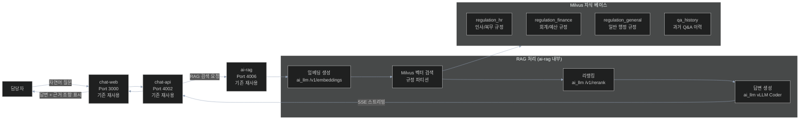

# 과제 4 — 규정 Q&A 서비스 (대화형 규정 검색/RAG)

> **분야**: POC 2 — 규정·문서 지능화
> **난이도**: 하
> **구현 기간**: 2주 → **1.5주 (재검토, 4/21)**
> **기존 서비스 활용도**: 90% → **95% (재검토)** — 신규 개발 사실상 0

> **🔄 2026-04-21 업데이트**: ai-rag 8개 라우터(upload/tenant/rerank 등) 완비 → 파라미터만 조정
> - **결정 포인트 8개**: [→ 15-per-challenge-decision-points.md#과제-4](15-per-challenge-decision-points.md#-과제-4--규정-qa-서비스-대화형-rag)
> - **고객 최중요 결정**: D4-01 답변 범위 (조항 해석 허용 여부), D4-02 면책 문구 정책
> - **재사용 포인트**: ai-rag upload_router, tenant_router, rerank_client 전부 재사용

---

## 목차

- [1. 과제 개요](#1-과제-개요)
- [2. 구현 아키텍처](#2-구현-아키텍처)
- [3. 서비스 재사용 분석](#3-서비스-재사용-분석)
- [4. 구현 로드맵 및 Task](#4-구현-로드맵-및-task)
- [5. 위험 요소](#5-위험-요소)
- [6. 성공 기준](#6-성공-기준)
- [7. 참조 링크](#7-참조-링크)

---

## 1. 과제 개요

복잡한 인사·복무·회계 행정 규정에 대해 자연어로 질문하면 AI가 즉시 관련 조항을 검색하여 근거와 함께 답변을 생성하는 RAG 기반 규정 Q&A 서비스

| 항목 | 내용 |
|------|------|
| **핵심 가치** | 규정 검색 시간 90% 단축, 조항 근거 명시로 신뢰성 확보 |
| **대상 사용자** | 행정 규정을 자주 검색하는 모든 담당자 |
| **주요 기능** | 자연어 규정 질문, 근거 조항 함께 답변, 관련 규정 연관 추천 |

---

## 2. 구현 아키텍처

### 2.1 RAG 파이프라인

```
사용자 질문: "연가 신청은 며칠 전까지 해야 하나요?"
    │
    ▼
질문 임베딩 생성 (ai_llm /v1/embeddings)
    │
    ▼
Milvus 벡터 검색 (복무 규정 파티션)
  → 하이브리드 검색: 벡터 유사도 + 키워드 BM25
    │
    ▼
검색 결과 리랭킹 (ai_llm /v1/rerank)
  → 관련도 높은 조항 3건 선별
    │
    ▼
답변 생성 (ai_llm /v1/chat/completions)
  → 시스템 프롬프트: "규정에 없는 내용은 추측 금지"
    │
    ▼
"연가는 최소 3일 전까지 신청해야 합니다.
 [근거: 복무 규정 제12조 제2항]"
```

### 2.2 시스템 아키텍처



### 2.3 규정 분야별 파티션 구조

```
Milvus 컬렉션: regulation_knowledge
├── partition: regulation_hr        ← 인사/복무 규정 (P0 우선 구축)
├── partition: regulation_finance   ← 회계/예산 규정 (P0)
├── partition: regulation_general   ← 일반 행정 규정 (P0)
├── partition: regulation_forms     ← 서식/양식 (P1)
└── partition: qa_history           ← 우수 답변 이력 (P2)
```

### 2.4 프롬프트 설계

```python
REGULATION_QA_SYSTEM_PROMPT = """
당신은 행정 규정 전문 AI 어시스턴트입니다.
반드시 제공된 규정 조항만을 근거로 답변하세요.
규정에 없는 내용은 추측하지 말고 "해당 규정에서 명시적으로 규정하지 않습니다"라고 답하세요.

답변 형식:
1. 핵심 답변 (1~2문장)
2. 근거: [규정명 제N조 제N항]
3. 추가 유의사항 (있는 경우)
"""
```

---

## 3. 서비스 재사용 분석

### 재사용 가능 기존 서비스 (신규 개발 없음)

| 서비스 | 포트 | 재사용 내용 | 추가 작업 |
|--------|:---:|------------|---------|
| **ai-rag** | 4006 | RAG 파이프라인 전체 재사용 | 규정 전용 파티션 생성, 청킹 전략 최적화 |
| **ai_llm** | 6001 | 임베딩/리랭킹/생성 API 재사용 | 규정 Q&A 전용 프롬프트 4종 추가 |
| **vLLM Coder** | 6012 | 텍스트 생성 재사용 | 없음 |
| **ocr_service** | 6014 | 규정 PDF OCR 처리 재사용 | 없음 |
| **chat-web** | 3000 | 채팅 UI 재사용 | 근거 조항 패널 UI 추가 |
| **chat-api** | 4002 | 메시지 라우팅 재사용 | 규정 Q&A 모드 라우팅 추가 |
| **Redis** | 6031 | 임베딩 캐시 재사용 | 없음 |

### 신규 개발 없음 — 구성 작업만 필요

> POC 2 규정 Q&A는 **기존 서비스 90% 활용**으로 신규 서비스 개발 없이 구현 가능  
> 핵심 작업: 규정 문서 수집 → OCR → 파티션 구성 → 프롬프트 최적화

---

## 4. 구현 로드맵 및 Task

### 4.1 단계별 일정 (2주)

```
Week 1 — 규정 지식 베이스 구축
  ├── [ ] 고객사로부터 규정 문서 10종 이상 수집
  ├── [ ] ocr_service로 PDF/이미지 규정 텍스트 추출
  ├── [ ] 규정 조 단위 청킹 파이프라인 구현
  ├── [ ] Milvus 규정 파티션 3종 생성
  ├── [ ] 규정 문서 업로드 및 인덱싱 (ai-rag API)
  └── [ ] 기본 Q&A 동작 확인 (curl 테스트)

Week 2 — UI 연동 및 품질 최적화
  ├── [ ] chat-web 규정 Q&A 모드 UI 수정 (근거 조항 패널)
  ├── [ ] chat-api 규정 모드 라우팅 추가
  ├── [ ] 규정 Q&A 전용 프롬프트 최적화 (Few-shot 예시)
  ├── [ ] 답변 정확도 평가 (전문가 20문항 평가)
  └── [ ] 청킹 전략 비교 테스트 (조 단위 vs 항 단위)
```

### 4.2 Task 목록

| ID | Task | 담당 | 우선순위 | 기간 |
|----|------|------|:-------:|:----:|
| T4-01 | 규정 문서 수집 (최소 10종, 고객사 협의) | PM+고객사 | P0 | 2d |
| T4-02 | ocr_service 한국어 규정 문서 파싱 테스트 | D1 | P0 | 1d |
| T4-03 | 조 단위 청킹 파이프라인 구현 (단위 테스트 포함) | D1 | P0 | 2d |
| T4-04 | Milvus 규정 파티션 생성 및 설정 | D1 | P0 | 1d |
| T4-05 | 규정 문서 일괄 업로드 스크립트 | D1 | P0 | 1d |
| T4-06 | 규정 Q&A 전용 프롬프트 개발 | D1 | P1 | 1d |
| T4-07 | chat-web 근거 조항 패널 UI | D2 | P1 | 3d |
| T4-08 | 답변 정확도 평가 (테스트 쿼리 20개) 및 개선 | D1 | P1 | 2d |
| T4-09 | admin-web 규정 문서 관리 UI | D2 | P2 | 2d |
| T4-10 | 검색 품질 통합 검증 + 청킹 재튜닝 + 안정화 | D1+D2 | P2 | 2d |
| **합계** | (PM 2d 별도) | | | **17 man-day** |
| **달력 기간** | D1 10d 기준, D2 5d 병행 | | | **10d (2주)** |

---

## 5. 위험 요소

| # | 위험 요소 | 가능성 | 영향도 | 대응 방안 |
|---|---------|:-----:|:-----:|---------|
| R1 | **규정 문서 수집 지연 (고객사 미제공)** | 높음 | 높음 | POC 시작 전 최소 10종 제공을 사전 조건으로 합의 |
| R2 | **HWP 파일 Ubuntu 파싱 실패** | 높음 | 중간 | HWP → PDF 변환 후 OCR 처리 (libreoffice 활용) |
| R3 | **LLM 한국어 행정 규정 이해 정확도** | 중간 | 높음 | Few-shot 예시 5종 이상 + 규정 특화 프롬프트 최적화 |
| R4 | **규정 개정 시 지식 베이스 업데이트 누락** | 중간 | 중간 | 규정 버전 관리 + 개정일 기준 자동 파티션 업데이트 |
| R5 | **청킹 경계 문제 (조 경계 미인식)** | 중간 | 중간 | 행정 규정 특화 청킹 (제N조 패턴 정규식 파싱) |

---

## 6. 성공 기준

| 지표 | 목표값 |
|------|:------:|
| 규정 Q&A 답변 정확도 | ≥ 85% (전문가 평가 20문항) |
| 근거 조항 인용 정확률 | ≥ 90% (조항 번호 일치) |
| RAG 검색 응답 시간 | ≤ 3초 |
| 사용자 만족도 | ≥ 4/5점 |

---

## 7. 참조 링크

| 문서 | 경로 |
|------|------|
| POC 2 규정 지능화 상세 설계 | [../02-regulation-document-intelligence.md](../02-regulation-document-intelligence.md) |
| POC 전체 아키텍처 | [../00-overall-architecture.md](../00-overall-architecture.md) |
| ai-rag 개선사항 | [../improvements/ai-rag.md](../improvements/ai-rag.md) |
| HWP RAG 파이프라인 | [../improvements/hwp-rag-pipeline.md](../improvements/hwp-rag-pipeline.md) |
| ai-llm 개선사항 | [../improvements/ai-llm.md](../improvements/ai-llm.md) |
| 과제 5 (문서 적합성 검점) | [05-document-compliance.md](05-document-compliance.md) |
| 과제 6 (지식 베이스 구축) | [06-knowledge-base.md](06-knowledge-base.md) |
