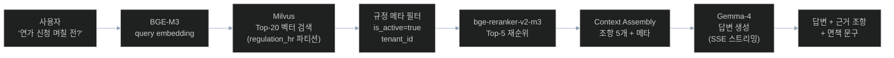

# RAG 파이프라인 (과제 4)

## 1. 전체 흐름



## 2. 검색 파라미터

```python
SEARCH_CONFIG = {
    "top_k_initial": 20,           # Milvus 1차 검색
    "top_k_rerank": 5,             # reranker 후 최종
    "similarity_threshold": 0.60,  # 최소 유사도
    "rerank_threshold": 0.30,      # 재순위 점수 임계값
    "partitions": ["regulation_hr", "regulation_finance", "regulation_general"],  # 자동 선택 또는 사용자 지정
}
```

## 3. 파티션 자동 선택

```python
def select_partitions(query: str) -> list[str]:
    """질문 키워드로 관련 파티션 선택"""
    HR_KEYWORDS = ["연가", "휴가", "출근", "퇴근", "복무", "출장", "승진"]
    FIN_KEYWORDS = ["예산", "지출", "결재", "계약", "물품", "영수증"]
    GENERAL_KEYWORDS = ["공문", "보고서", "기안"]

    selected = []
    if any(k in query for k in HR_KEYWORDS):
        selected.append("regulation_hr")
    if any(k in query for k in FIN_KEYWORDS):
        selected.append("regulation_finance")
    if any(k in query for k in GENERAL_KEYWORDS):
        selected.append("regulation_general")

    # 매칭 실패 시 전체 검색
    return selected or ["regulation_hr", "regulation_finance", "regulation_general"]
```

## 4. Context Assembly

```python
def build_context(chunks: list) -> str:
    """검색 결과를 LLM 프롬프트용으로 구성"""
    context_parts = []
    for i, chunk in enumerate(chunks, 1):
        context_parts.append(f"""
[근거 {i}] {chunk['regulation_name']} {chunk['article_no']}{chunk.get('paragraph_no', '')}
{chunk['content']}
(출처: {chunk['source_file']} {chunk['page_no']}페이지)
""")
    return "\n".join(context_parts)
```

## 5. 답변 품질 평가

```python
def evaluate_answer(question: str, answer: str, chunks: list) -> dict:
    score = 0

    # 1. 근거 조항 명시 (0~40점)
    article_refs = re.findall(r'제\d+조', answer)
    if article_refs:
        score += 40

    # 2. 답변 길이 적정 (0~20점)
    if 100 <= len(answer) <= 800:
        score += 20

    # 3. 면책 문구 포함 (0~20점)
    if any(p in answer for p in ["참고용", "담당 부서", "공식 해석"]):
        score += 20

    # 4. 검색된 조항 언급 (0~20점)
    mentioned = sum(1 for c in chunks if c["article_no"] in answer)
    score += min(20, mentioned * 5)

    return {"score": score, "breakdown": {...}}
```

## 6. 캐싱

```python
# Redis 캐시 (24시간 TTL)
cache_key = f"qa:{tenant_id}:{hash(query)}"
if cached := redis.get(cache_key):
    return cached

# ... 검색/답변 생성 ...

redis.setex(cache_key, 86400, answer_json)
```

단, 규정 개정 시 해당 파티션 캐시 무효화:
```python
async def invalidate_partition_cache(partition: str):
    keys = await redis.scan(match=f"qa:*:{partition}:*")
    await redis.delete(*keys)
```
