```mermaid
sequenceDiagram
    participant U as 사용자
    participant CW as chat-web
    participant CA as chat-api
    participant RG as regulation_qa_graph
    participant RD as Redis
    participant AI as ai-llm (BGE-M3)
    participant M as Milvus
    participant RR as Reranker
    participant LLM as vllm-vision

    U->>CW: 질문 입력
    CW->>CA: POST /chat/stream (mode=regulation_qa)
    CA->>RG: invoke(state)

    rect rgb(30, 60, 100)
        Note over RG,RD: Step 1: check_cache (50ms)
        RG->>RD: GET qa:tenant-001:abc123
        RD-->>RG: null (miss)
    end

    rect rgb(30, 90, 60)
        Note over RG: Step 2: select_partition (100ms)
        RG->>RG: 키워드 "연가" → regulation_hr
    end

    rect rgb(60, 30, 100)
        Note over RG,AI: Step 3: embed_query (200ms)
        RG->>AI: BGE-M3 embedding
        AI-->>RG: [1024 dim]
    end

    rect rgb(100, 30, 60)
        Note over RG,M: Step 4: milvus_search (300ms)
        RG->>M: Top-20 in regulation_hr
        M-->>RG: 20 chunks (0.60+)
    end

    rect rgb(30, 100, 100)
        Note over RG,RR: Step 5: rerank (500ms)
        RG->>RR: 20 docs re-rank
        RR-->>RG: Top-5 (0.30+)
    end

    rect rgb(100, 100, 30)
        Note over RG,LLM: Step 6: generate_answer (2s, SSE)
        RG->>LLM: context + question
        loop SSE 토큰
            LLM-->>RG: token
            RG-->>CW: SSE chunk
        end
    end

    Note over RG: Step 7: evaluate_quality + save_cache
```

# 과제 4 규정 Q&A — 테스트 시나리오

---

## 📋 시나리오

| # | 시나리오 | 유형 | 기대 결과 |
|:-:|---------|:---:|---------|
| S1 | 표준 질문 (연가) | E2E | 조항 번호 포함, 3초 이내 |
| S2 | 파티션 자동 선택 | 기능 | regulation_hr 정확 선택 |
| S3 | 애매한 질문 | 기능 | LLM 보조 분류 |
| S4 | 규정에 없는 내용 | 경계 | 담당부서 안내 |
| S5 | 캐시 적중 | 성능 | 500ms 이내 |
| S6 | 규정 개정 후 | 기능 | 최신 버전만 응답 |
| S7 | 낮은 rerank 점수 | 품질 | 검색 실패 처리 |
| S8 | 전문가 평가 20문항 | 품질 | 정확도 85%+ |

---

## S1 — 연가 신청 질문 (정상 흐름)

### 설정
```
사용자: 홍길동 (EMP20240315)
입력: "연가 신청은 며칠 전까지 해야 하나요?"
기대: 복무규정 제12조 제2항 근거 + 3일 전 답변 + 면책 문구
```

### 아키텍처 동작



### 검증

```python
async def test_s1_regulation_qa_happy():
    response = await invoke_qa_graph(
        emp_cd="EMP20240315",
        query="연가 신청은 며칠 전까지 해야 하나요?"
    )

    # 성능
    assert response["duration_ms"] < 5000

    # 근거 조항
    assert re.search(r"복무규정 제12조", response["answer_text"])
    assert "3일 전" in response["answer_text"]

    # 면책 문구
    assert "참고용" in response["answer_text"] or "담당 부서" in response["answer_text"]

    # 품질 점수
    assert response["quality_score"] >= 80

    # Citations
    assert len(response["citations"]) >= 1
    assert response["citations"][0]["article_no"].startswith("제12조")
```

---

## S2 — 파티션 자동 선택

### 설정
```
질문 A: "출장비 한도" → regulation_finance
질문 B: "복무 규정" → regulation_hr
질문 C: "공문서 작성" → regulation_general
```

### 아키텍처 동작

```python
# select_partition_node 내부
KEYWORD_MAP = {
    "regulation_hr": ["연가", "휴가", "복무", "출장", "승진"],
    "regulation_finance": ["예산", "지출", "결재", "계약", "물품", "영수증"],
    "regulation_general": ["공문서", "보고서", "기안"]
}

query = "출장비 한도가 얼마인가요?"
→ 매칭: "출장" (HR) + "한도" (미매칭 → FINANCE 키워드 확장)
→ selected = ["regulation_hr", "regulation_finance"]
```

### 검증

```python
@pytest.mark.parametrize("query,expected", [
    ("연가 며칠?",     ["regulation_hr"]),
    ("출장비 한도",    ["regulation_hr", "regulation_finance"]),
    ("공문서 양식",    ["regulation_general"]),
])
async def test_s2_partition_selection(query, expected):
    state = await regulation_qa_graph.invoke(..., user_query=query)
    assert set(state["selected_partitions"]) == set(expected)
```

---

## S3 — 애매한 질문 (LLM 보조)

### 설정
```
질문: "회식 비용도 청구할 수 있나요?"
→ 키워드 매칭 없음
→ LLM 보조 분류: regulation_finance
```

### 아키텍처 동작

```
select_partition_node:
  키워드 매칭 결과: []
  → LLM 분류 호출 (max_tokens=50, temperature=0.0)
  LLM 응답: "regulation_finance, regulation_general"
  → 최종 2개 파티션 검색
```

---

## S4 — 규정에 없는 내용

### 설정
```
질문: "재택근무 신청 방법은?" (해당 규정 없음)
기대: "규정에서 찾을 수 없습니다" + 인사부 안내
```

### 아키텍처 동작

```
milvus_search: rerank_score 모두 < 0.30 → reranked_chunks 비어있음

generate_answer_node:
  context = "(관련 규정 조항 없음)"
  LLM이 시스템 프롬프트 지침대로:
    "해당 내용은 제공된 규정에서 찾을 수 없습니다.
     인사부 (담당: 인사부장 박**, 내선 1234)에 문의하세요."

evaluate_quality:
  - 조항 번호 없음: 0
  - 면책 문구: 있음
  - 길이 적정: 있음
  총 60점 → 캐싱 안 함 (threshold 80)
```

### 검증

```python
async def test_s4_not_in_regulation():
    response = await invoke_qa_graph(query="재택근무 신청?")

    assert "찾을 수 없습니다" in response["answer_text"] or \
           "규정에 명시되어 있지 않" in response["answer_text"]
    assert "인사부" in response["answer_text"]
    assert response["quality_score"] < 80
    # 캐시 안 됨
    assert not await redis.exists(response["cache_key"])
```

---

## S5 — 캐시 적중

### 설정
```
5분 전 동일 질문 (질문 해시 동일)
→ Redis 캐시 적중 → 전체 flow 스킵
```

### 아키텍처 동작

```
check_cache_node:
  key = "qa:tenant-001:abc123..."
  cached = await redis.get(key)  # {answer, citations}
  → cache_hit = True
  → 즉시 END

응답 시간: ~50ms (network + Redis)
```

### 검증

```python
async def test_s5_cache_hit():
    # First
    await invoke_qa_graph(query="연가 며칠 전?")

    # Second
    start = time.time()
    response = await invoke_qa_graph(query="연가 며칠 전?")
    elapsed = time.time() - start

    assert elapsed < 0.5
    assert response["cache_hit"] is True
```

---

## S6 — 규정 개정 후 최신 버전만

### 설정
```
상황: 복무규정 v2.3 → v2.4 개정 (2026-06-30)
     기존 v2.3은 is_active=false 처리
     v2.4에서 연가 기한이 3일 → 5일로 변경됨
기대: 현재 시점에 v2.4 응답만 반환
```

### 아키텍처 동작

```
milvus_search:
  filter: {
    "is_active": True,  # v2.3 제외
    "tenant_id": "tenant-001"
  }

  v2.3 chunks: is_active=False → 검색 제외
  v2.4 chunks: is_active=True → 검색 대상

generate_answer:
  "연가는 최소 5일 전까지 신청 (2026-07-01 개정)"

캐시 무효화:
  개정 시점에 invalidate_partition_cache("regulation_hr") 실행
  → 모든 관련 Q&A 캐시 삭제
```

### 검증

```python
async def test_s6_after_regulation_update():
    # Given
    update_regulation("REG-HR-001", from_version="v2.3", to_version="v2.4")
    # v2.4 변경: "3일 전" → "5일 전"

    # When
    response = await invoke_qa_graph(query="연가 며칠 전?")

    # Then
    assert "5일" in response["answer_text"]
    assert "3일" not in response["answer_text"]  # 구 규정 미노출
    # Citations 버전 확인
    assert response["citations"][0]["version"] == "v2.4"
```

---

## S7 — 낮은 rerank 점수 (검색 실패)

### 설정
```
질문: "AI 도입 ROI는?" (규정 관련 없는 질문)
→ Milvus 검색 결과 있지만 rerank 모두 < 0.30
```

### 아키텍처 동작

```
milvus_search: 20건 반환 (낮은 유사도)
rerank_node:
  filtered = [c for c in reranked if c["rerank_score"] >= 0.30]
  → filtered = []

generate_answer_node:
  context = "(관련 규정 조항 없음)"
  → "규정 Q&A 범위를 벗어난 질문입니다..." 응답
```

---

## S8 — 전문가 평가 20문항 (품질 검증)

### 설정
```
테스트 세트: 분야별 20문항 (인사 8 + 회계 7 + 일반 5)
각 문항: 전문가 작성 정답 (표준 답안 + 기대 근거 조항)
```

### 평가 프로세스

```python
TEST_QUESTIONS = [
    {"query": "연가 신청 기한?", "expected_article": "복무규정 제12조", "expected_keywords": ["3일", "7일"]},
    {"query": "출장비 한도?",   "expected_article": "여비규정 제5조",  "expected_keywords": ["50만원", "한도"]},
    # ... 18문항 더
]

async def test_s8_expert_evaluation():
    results = {
        "correct": 0,
        "partial": 0,
        "wrong": 0,
        "by_category": {"HR": {...}, "FIN": {...}, "GEN": {...}}
    }

    for q in TEST_QUESTIONS:
        response = await invoke_qa_graph(query=q["query"])

        # 조항 번호 매칭
        article_match = q["expected_article"] in response["answer_text"]
        # 키워드 매칭
        keyword_match = any(kw in response["answer_text"] for kw in q["expected_keywords"])

        if article_match and keyword_match:
            results["correct"] += 1
        elif article_match or keyword_match:
            results["partial"] += 1
        else:
            results["wrong"] += 1

    accuracy = results["correct"] / len(TEST_QUESTIONS)
    assert accuracy >= 0.85  # 85% 목표
```

---

## 📊 커버리지

| 요소 | S1 | S2 | S3 | S4 | S5 | S6 | S7 | S8 |
|------|:--:|:--:|:--:|:--:|:--:|:--:|:--:|:--:|
| check_cache | ✅ | ✅ | ✅ | ✅ | ✅ | ✅ | ✅ | ✅ |
| select_partition | ✅ | ✅ | ✅ | — | — | ✅ | — | ✅ |
| embed_query | ✅ | ✅ | ✅ | ✅ | — | ✅ | ✅ | ✅ |
| milvus_search | ✅ | ✅ | ✅ | ✅ | — | ✅ | ✅ | ✅ |
| rerank | ✅ | ✅ | ✅ | ⚠️ | — | ✅ | ⚠️ | ✅ |
| generate_answer | ✅ | — | — | ✅ | — | ✅ | ✅ | ✅ |
| evaluate_quality | ✅ | — | — | ✅ | — | — | — | ✅ |
| save_cache | ✅ | — | — | ❌ | — | — | — | — |
