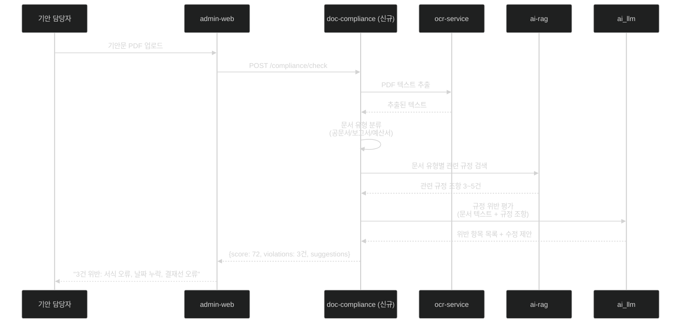

# 과제 5 — 문서 적합성 검점 (작성 문서 자동 규정 검토)

> **분야**: POC 2 — 규정·문서 지능화
> **난이도**: 중
> **구현 기간**: 2.5주 → **1.5주 (재검토, 4/21)**
> **기존 서비스 활용도**: 75% → **95% (재검토)**

> **🔄 2026-04-21 업데이트 (중요)**: **doc-compliance 신규 서비스 → ai-assistant 그래프 통합**
> - **아키텍처 변경**: Port 4014 제거, `ai-assistant/src/graph/graphs/compliance_graph.py` 신규 추가
> - **재사용 근거**: ai-assistant의 `evidence_assess_node`, `candidate_extraction_node` 이미 구현
> - **결정 포인트 8개**: [→ 15-per-challenge-decision-points.md#과제-5](15-per-challenge-decision-points.md#-과제-5--문서-적합성-검점)
> - **고객 최중요 결정**: D5-03 점검 결과 활용 (참고용 vs 결재 차단)

---

## 목차

- [1. 과제 개요](#1-과제-개요)
- [2. 구현 아키텍처](#2-구현-아키텍처)
- [3. 서비스 재사용 분석](#3-서비스-재사용-분석)
- [4. 구현 로드맵 및 Task](#4-구현-로드맵-및-task)
- [5. 위험 요소](#5-위험-요소)
- [6. 성공 기준](#6-성공-기준)
- [7. 참조 링크](#7-참조-링크)

---

## 1. 과제 개요

기안문·보고서·공문을 업로드하면 AI가 내부 규정과 자동 비교하여 위반 항목을 탐지하고 수정 가이드를 제공하는 자동 검토 서비스

| 항목 | 내용 |
|------|------|
| **핵심 가치** | 결재 전 규정 위반 사전 차단, 반려율 감소 |
| **대상 사용자** | 기안문·보고서 작성 후 규정 적합성을 확인하고 싶은 담당자 |
| **주요 기능** | 문서 업로드 → 규정 위반 항목 탐지 → 조항 근거 + 수정 제안 |

---

## 2. 구현 아키텍처

### 2.1 문서 적합성 점검 파이프라인

```
담당자 기안문 PDF 업로드 (admin-web)
    │
    ▼
doc-compliance 서비스 (신규, Port 4014)
    │
    ├── Step 1: 텍스트 추출
    │    └── ocr_service (기존) — PDF/이미지 OCR
    │
    ├── Step 2: 관련 규정 검색
    │    └── ai-rag (기존) — 문서 유형별 규정 검색
    │         (공문서 규정, 예산 집행 지침, 복무 규정 등)
    │
    ├── Step 3: 위반 항목 평가
    │    └── ai_llm (기존) — 규정 위반 판단 + 수정 제안 생성
    │
    └── Step 4: 결과 반환
         └── {is_compliant, violations[], score, suggestions}

결과 표시 (admin-web — 기존 서비스 확장)
  - 준수율 점수 (0~100점)
  - 위반 항목 목록 (위반 내용 + 근거 규정 + 수정 방법)
```

### 2.2 시퀀스 다이어그램



### 2.3 API 명세 (doc-compliance)

```
POST /compliance/check
  Body: { doc_file, doc_type, tenant_id }
  Response: {
    is_compliant: bool,
    score: 0~100,
    violations: [
      {
        location: "제목 섹션",
        issue: "문서 번호 누락",
        rule_reference: "행정기관 공문서 규정 제3조",
        suggestion: "문서 번호를 우측 상단에 표기하세요"
      }
    ],
    suggestions: ["전체 수정 가이드"]
  }

POST /compliance/upload-regulation
  Body: { file, category, effective_date }

GET /compliance/regulations
  Response: { 등록된 규정 목록 }
```

---

## 3. 서비스 재사용 분석

### 재사용 가능 기존 서비스

| 서비스 | 포트 | 재사용 내용 | 추가 개발 |
|--------|:---:|------------|---------|
| **ai-rag** | 4006 | 규정 검색 API 재사용 | 없음 (과제 4에서 구축된 지식 베이스 활용) |
| **ai_llm** | 6001 | 위반 평가 생성 재사용 | 적합성 점검 전용 프롬프트 추가 |
| **ocr_service** | 6014 | PDF/이미지 OCR 재사용 | 없음 |
| **admin-web** | 3001 | 관리자 UI 재사용 | 문서 업로드 페이지 + 점검 결과 페이지 추가 |
| **admin-api** | 4000 | 관리 API 재사용 | doc-compliance 연동 엔드포인트 추가 |

### 신규 개발 필요 서비스

| 서비스 | 포트 | 개발 내용 | 공수 |
|--------|:---:|----------|------|
| **doc-compliance** | 4014 | 문서 점검 오케스트레이터 서비스 전체 | 1.5주 |

### doc-compliance 기술 스택

```
언어/프레임워크: Python + FastAPI
의존 서비스:
  - ai-rag: 규정 검색 (HTTP 내부 API)
  - ocr_service: 텍스트 추출 (HTTP)
  - ai_llm: 위반 평가 (HTTP)
크기: 소형 (약 500줄 Python 코드)
```

---

## 4. 구현 로드맵 및 Task

### 4.1 선행 조건

> **중요**: 과제 4(규정 Q&A)의 Milvus 지식 베이스 구축이 완료되어야 함  
> doc-compliance는 ai-rag의 규정 지식 베이스를 공유 사용

### 4.2 단계별 일정 (2주)

```
Week 1 — doc-compliance 서비스 개발
  ├── [ ] doc-compliance 프로젝트 초기화 (FastAPI)
  ├── [ ] 문서 유형 분류 로직 구현 (LLM 분류)
  ├── [ ] ocr_service 연동 구현
  ├── [ ] ai-rag 검색 연동 구현
  ├── [ ] ai_llm 위반 평가 프롬프트 개발
  └── [ ] 점검 결과 JSON 포맷 설계 및 구현

Week 2 — admin-web UI 연동 + 테스트
  ├── [ ] admin-web 문서 업로드 페이지 구현
  ├── [ ] admin-web 점검 결과 표시 페이지 구현
  ├── [ ] admin-api 엔드포인트 추가
  ├── [ ] 점검 정확도 테스트 (샘플 문서 20종)
  └── [ ] Docker Compose doc-compliance 추가
```

### 4.3 Task 목록

| ID | Task | 담당 | 우선순위 | 기간 |
|----|------|------|:-------:|:----:|
| T5-01 | doc-compliance FastAPI 서비스 초기화 | D1 | P0 | 1d |
| T5-02 | 문서 유형 자동 분류 로직 (LLM 기반) | D1 | P0 | 2d |
| T5-03 | 규정 위반 평가 프롬프트 개발 + 확신도 임계값 설정 | D1 | P0 | 2d |
| T5-04 | ocr → rag → llm 파이프라인 구현 (단위 테스트 포함) | D1 | P0 | 3d |
| T5-05 | 점검 결과 JSON 스키마 설계 및 검증 | D1 | P1 | 1d |
| T5-06 | admin-web 문서 업로드 UI | D2 | P1 | 2d |
| T5-07 | admin-web 점검 결과 표시 UI (위반 항목 + 수정 가이드) | D2 | P1 | 3d |
| T5-08 | admin-api 문서 점검 API 엔드포인트 (SSE 진행 상태) | D2 | P1 | 2d |
| T5-09 | 점검 정확도 평가 (샘플 20종) + 오탐 조정 + 안정화 | D1+D2 | P2 | 3d |
| **합계** | | | | **19 man-day** |
| **달력 기간** | D1 9d 기준, D2 10d (D1 완료 후 검증 병행) | | | **12d (2.5주)** |

---

## 5. 위험 요소

| # | 위험 요소 | 가능성 | 영향도 | 대응 방안 |
|---|---------|:-----:|:-----:|---------|
| R1 | **LLM 위반 판단 오류 (규정 해석 차이)** | 높음 | 높음 | 확신도 점수 임계값 설정 + "전문가 재확인 권고" 문구 필수 표시 |
| R2 | **HWP 기안문 파싱 실패** | 높음 | 높음 | PDF 변환 후 OCR 처리 (libreoffice 변환 레이어 추가) |
| R3 | **규정 지식 베이스 미구축 상태에서 점검** | 중간 | 높음 | 점검 시 관련 규정 파티션 존재 여부 검증 로직 추가 |
| R4 | **점검 소요 시간 초과 (복잡한 문서)** | 중간 | 중간 | 비동기 처리 + 진행 상태 SSE 스트리밍 |
| R5 | **오탐으로 정상 문서 반려 유도** | 중간 | 높음 | "AI 제안 참고용" 명시, 최종 판단은 담당자에게 위임 |

---

## 6. 성공 기준

| 지표 | 목표값 |
|------|:------:|
| 규정 위반 탐지율 | ≥ 80% (샘플 문서 기준) |
| 허위 경보율 | ≤ 20% |
| 점검 완료 시간 | ≤ 30초 (A4 10장 기준) |
| 사용자 만족도 | ≥ 3.5/5점 (보조 도구로서) |

---

## 7. 참조 링크

| 문서 | 경로 |
|------|------|
| POC 2 규정 지능화 상세 설계 | [../02-regulation-document-intelligence.md](../02-regulation-document-intelligence.md) |
| doc-compliance 서비스 설계 | [../design/doc-compliance.md](../design/doc-compliance.md) |
| HWP RAG 파이프라인 | [../improvements/hwp-rag-pipeline.md](../improvements/hwp-rag-pipeline.md) |
| admin-web 개선사항 | [../improvements/admin-web.md](../improvements/admin-web.md) |
| 과제 4 (규정 Q&A) | [04-regulation-qa.md](04-regulation-qa.md) |
| 과제 6 (지식 베이스 구축) | [06-knowledge-base.md](06-knowledge-base.md) |
