```mermaid
sequenceDiagram
    participant U as 담당자
    participant AW as admin-web
    participant AD as admin-api
    participant CG as compliance_graph
    participant OCR as ocr-service
    participant AI as ai-llm (BGE-M3)
    participant M as Milvus
    participant LLM as vllm-vision
    participant AA as alli-audit

    U->>AW: PDF 업로드
    AW->>AD: POST /compliance/check
    AD->>CG: invoke

    rect rgb(30, 60, 100)
        Note over CG,OCR: Step 1: ocr_extract (5s)
        CG->>OCR: POST /extract (multipart)
        OCR->>OCR: PP-OCRv5 추론 (GPU 0)
        OCR-->>CG: extracted_text, page_count=3
    end

    rect rgb(30, 90, 60)
        Note over CG,LLM: Step 2: classify (1s)
        CG->>LLM: 문서 유형 분류
        LLM-->>CG: 품의서, 0.92
    end

    rect rgb(60, 30, 100)
        Note over CG,M: Step 3: fetch_regulations (2s)
        CG->>AI: BGE-M3 임베딩
        CG->>M: search (regulation_finance + general)
        M-->>CG: Top 10 규정 조항
    end

    rect rgb(100, 30, 60)
        Note over CG,LLM: Step 4: extract_candidates (3s)
        CG->>CG: chunk document (max 500)
        CG->>LLM: quick_match (chunk × reg)
        LLM-->>CG: candidates[] (match_score >= 0.5)
    end

    rect rgb(30, 100, 100)
        Note over CG,LLM: Step 5: assess_evidence (6s) ⭐
        loop for each candidate
            CG->>LLM: deep_assess (JSON)
            LLM-->>CG: {is_compliant, confidence, detail}
        end
        CG->>CG: violations + compliant_items
    end

    rect rgb(100, 100, 30)
        Note over CG,LLM: Step 6: generate_suggestions (2s)
        CG->>LLM: 각 위반별 수정 제안
        LLM-->>CG: suggestions[]
    end

    rect rgb(30, 60, 60)
        Note over CG: Step 7: format_result (100ms)
        CG->>CG: score=80, grade=B
    end

    CG-->>AD: response
    AD->>AA: audit_logs INSERT
    AD-->>AW: JSON response
    AW-->>U: 점수 + 위반 항목 표시
```

# 과제 5 문서 적합성 — 테스트 시나리오

---

## 📋 시나리오

| # | 시나리오 | 유형 | 기대 |
|:-:|---------|:---:|------|
| S1 | 품의서 정상 검증 | E2E | 점수 80, B등급 |
| S2 | 금액 불일치 위반 | 기능 | 위반 1건, HIGH |
| S3 | 필수 필드 누락 | 기능 | -25점 감점 |
| S4 | HWP 파일 업로드 | 경계 | libreoffice 변환 |
| S5 | 50페이지 대용량 | 성능 | 120초 이내 |
| S6 | OCR 실패 문서 | 장애 | 부분 결과 반환 |
| S7 | 규정 매칭 실패 | 경계 | "관련 규정 없음" |
| S8 | 대량 위반 (5건+) | 경계 | 심각도별 정렬 |

---

## S1 — 품의서 정상 검증

### 설정
```
파일: 2026-04-품의서-001.pdf (245 KB, 3페이지)
유형: 품의서 (hint 제공)
기대: score=80, grade=B, 위반 1건 (금액 불일치)
```

### 아키텍처 동작



### 검증

```python
async def test_s1_purchase_request():
    with open("fixtures/품의서-001.pdf", "rb") as f:
        response = await admin_api_client.post(
            "/compliance/check",
            files={"file": f},
            data={"docType": "품의서"}
        )

    result = response.json()
    assert result["isCompliant"] is False  # 금액 불일치 존재
    assert result["score"] == 80
    assert result["grade"] == "B"
    assert len(result["violations"]) == 1
    assert result["violations"][0]["severity"] == "HIGH"
    assert "금액" in result["violations"][0]["violationDetail"]
    assert result["processingTimeSec"] < 15
```

---

## S2 — 금액 불일치 위반

### 설정
```
문서 내: 품의금액 5,000,000원 / 계약금액 4,800,000원 불일치
기대: AUD-COMPLIANCE-AMOUNT-MISMATCH 위반, HIGH, -20점
```

### 아키텍처 동작

```
extract_candidates:
  chunk_1 (품의금액 부분) + chunk_2 (계약서 첨부 금액)
  → 규정 매칭: "물품관리법 시행령 제15조 제1항 (품의금액 일치 요건)"
  → match_score = 0.78

assess_evidence (LLM 추론):
  {
    "is_compliant": false,
    "confidence": 0.95,
    "violation_detail": "품의금액(5,000,000원)이 계약금액(4,800,000원)과 일치하지 않음. 차액 200,000원.",
    "severity": "HIGH"
  }

violation_formatter:
  VIOLATION_WEIGHTS["금액_불일치"] = 20 → score = 100 - 20 = 80
```

### 검증

```python
async def test_s2_amount_mismatch():
    response = await check_document("fixtures/amount-mismatch.pdf")

    violations = response["violations"]
    assert len(violations) == 1

    v = violations[0]
    assert v["severity"] == "HIGH"
    assert v["violationType"] == "금액_불일치"
    assert v["confidence"] >= 0.90
    assert "5,000,000" in v["violationDetail"]
    assert "4,800,000" in v["violationDetail"]

    # 수정 제안
    assert "변경품의" in v["suggestion"] or "수정" in v["suggestion"]
```

---

## S3 — 필수 필드 누락

### 설정
```
품의서에서 "기안자" 필드 누락
기대: -25점, 필수항목_누락 유형
```

### 아키텍처 동작

```
classify: 품의서

fetch_regulations:
  "품의서 필수 기재 사항" 규정 검색
  → "공문서 작성 규정 제5조 제1항"

assess_evidence (LLM 추론):
  LLM이 문서에서 [제목, 품의금액, 품의사유, 결재선, 예산과목, 기안자] 존재 여부 확인
  "기안자" 누락 감지:
  {
    "is_compliant": false,
    "confidence": 0.98,
    "violation_detail": "필수 기재 사항 '기안자' 누락",
    "severity": "HIGH"
  }

violation_formatter:
  penalty = 25 (필수항목_누락)
  score = 100 - 25 = 75 → grade=B
```

---

## S4 — HWP 파일 업로드

### 설정
```
파일: 출장명령서.hwp (300KB)
기대: libreoffice 변환 → PDF → OCR
```

### 아키텍처 동작

```
ocr_extract_node 내부:
  if file_type == "hwp":
    # libreoffice headless 변환
    pdf_path = await subprocess.run([
      "libreoffice", "--headless",
      "--convert-to", "pdf", "--outdir", "/tmp",
      input_file
    ])

    # 변환 결과 확인
    if not pdf_path or size == 0:
      raise HWPConversionError("HWP 파싱 실패")

  # 이후 PDF로 OCR
  resp = await ocr_service.extract(pdf_bytes, "pdf")
```

### 검증

```python
async def test_s4_hwp_upload():
    with open("fixtures/trip-order.hwp", "rb") as f:
        response = await check_document(f, filename="trip-order.hwp")

    # 변환 성공
    assert response["fileInfo"]["originalName"] == "trip-order.hwp"
    assert response["extractedText"]
    assert response["score"] > 0
```

---

## S5 — 대용량 (50페이지)

### 설정
```
파일: 계약서 50페이지, 15 MB
기대: 120초 이내 처리
```

### 아키텍처 동작

```
ocr_extract:
  PP-OCRv5 batch 처리 (페이지별 병렬)
  50페이지 × 500ms = 25초

fetch_regulations:
  청크 수 증가 (50페이지 × 10청크 = 500 청크)
  → 배치 검색 (10개씩)
  → 30초

extract_candidates:
  LLM quick_match 500회 → 60초 (배치 처리로 단축)

assess_evidence:
  상위 50 후보만 deep_assess → 15초

총: ~130초 (SLO 120초 약간 초과 → 최적화 필요)
```

### 검증

```python
async def test_s5_large_document():
    start = time.time()
    response = await check_document("fixtures/contract-50p.pdf", timeout=180)
    elapsed = time.time() - start

    assert elapsed < 180  # absolute max
    # Target: ≤ 120s (모니터링 지표)
    if elapsed > 120:
        prometheus_metric("compliance_slo_breach").inc()
```

---

## S6 — OCR 실패 (이미지 저품질)

### 설정
```
스캔 품질 낮은 PDF (해상도 72dpi, 기울어짐)
기대: 부분 추출 + 경고
```

### 아키텍처 동작

```
ocr_extract:
  PP-OCRv5 신뢰도 < 0.7 → 경고
  extracted_text = partial_text
  state["warnings"] = ["OCR 신뢰도 낮음 (0.65)"]

classify:
  텍스트 부족 → confidence < 0.5
  → doc_type = "UNKNOWN"

fetch_regulations:
  doc_type 불명 → 전체 파티션 검색
  → 관련도 낮은 결과

format_result:
  state["warnings"] 응답에 포함
  score = 50 (부분 점검)
  message: "OCR 품질 이슈로 부분 점검 수행. 재업로드 권장."
```

---

## S7 — 규정 매칭 실패

### 설정
```
문서: 일반 업무 메모 (규정 적용 대상 아님)
기대: "관련 규정 없음", score=null
```

### 아키텍처 동작

```
fetch_regulations:
  Milvus 검색 결과: 모든 rerank_score < 0.30

extract_candidates:
  candidates = []

assess_evidence:
  violations = []
  compliant_items = []

format_result:
  score = null (적용 규정 없음 — 측정 불가)
  message: "제출된 문서에 적용 가능한 규정을 찾지 못했습니다. 문서 유형을 확인하세요."
```

---

## S8 — 대량 위반 (5건+)

### 설정
```
심각한 문서 (필수 필드 3개 누락 + 금액 불일치 + 결재선 오류 + 서식 불일치)
기대: 5건 위반, score = max(0, 100 - 25*3 - 20 - 15 - 10) = 0, grade=F
```

### 검증

```python
async def test_s8_multiple_violations():
    response = await check_document("fixtures/severely-violated.pdf")

    assert len(response["violations"]) >= 5
    assert response["grade"] == "F"
    assert response["score"] == 0
    assert response["isCompliant"] is False

    # 심각도별 정렬
    severities = [v["severity"] for v in response["violations"]]
    assert severities.count("HIGH") >= 3
```

---

## 📊 커버리지

| 요소 | S1 | S2 | S3 | S4 | S5 | S6 | S7 | S8 |
|------|:--:|:--:|:--:|:--:|:--:|:--:|:--:|:--:|
| ocr_extract | ✅ | ✅ | ✅ | ✅ | ✅ | ⚠️ | ✅ | ✅ |
| classify | ✅ | ✅ | ✅ | ✅ | ✅ | ⚠️ | ✅ | ✅ |
| fetch_regulations | ✅ | ✅ | ✅ | ✅ | ✅ | — | ❌ | ✅ |
| extract_candidates | ✅ | ✅ | ✅ | ✅ | ✅ | — | — | ✅ |
| assess_evidence | ✅ | ✅ | ✅ | ✅ | ✅ | — | — | ✅ |
| generate_suggestions | ✅ | ✅ | ✅ | ✅ | ✅ | — | — | ✅ |
| format_result | ✅ | ✅ | ✅ | ✅ | ✅ | ⚠️ | ✅ | ✅ |
