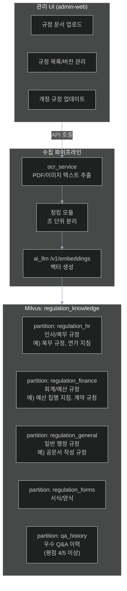

# 과제 6 — 지식 베이스 구축 (비정형 데이터 자산화)

> **분야**: POC 2 — 규정·문서 지능화
> **난이도**: 중하
> **구현 기간**: 2주 → **1.5주 (재검토, 4/21)**
> **기존 서비스 활용도**: 95% → **97% (재검토)**

> **🔄 2026-04-21 업데이트**: ai-rag tenant_router로 기관별 격리 가능 → 추가 이점
> - **결정 포인트 8개**: [→ 15-per-challenge-decision-points.md#과제-6](15-per-challenge-decision-points.md#-과제-6--지식-베이스-구축)
> - **고객 최중요 결정**: D6-02 규정 10종 목록 확정 (P0 필수), D6-03 HWP 비중
> - **재사용 포인트**: ai-rag upload_router 완비, 조 단위 청킹만 신규

---

## 목차

- [1. 과제 개요](#1-과제-개요)
- [2. 구현 아키텍처](#2-구현-아키텍처)
- [3. 서비스 재사용 분석](#3-서비스-재사용-분석)
- [4. 구현 로드맵 및 Task](#4-구현-로드맵-및-task)
- [5. 위험 요소](#5-위험-요소)
- [6. 성공 기준](#6-성공-기준)
- [7. 참조 링크](#7-참조-링크)

---

## 1. 과제 개요

조직 내 규정 문서·지침·과거 결재 문서·Q&A 이력 등 비정형 데이터를 체계적으로 수집·정제·벡터화하여, AI가 즉시 활용 가능한 조직 지식 자산으로 전환하는 파이프라인 구축

| 항목 | 내용 |
|------|------|
| **핵심 가치** | 조직 암묵지 디지털화, 퇴직자 지식 유실 방지 |
| **대상 사용자** | 지식 관리자 (문서 등록), Q&A 이용자 (간접 기여) |
| **주요 기능** | 규정 문서 업로드/관리, Q&A 이력 자동 수집, 지식 베이스 버전 관리 |

---

## 2. 구현 아키텍처

### 2.1 지식 베이스 구축 파이프라인

```
[데이터 소스]
  ├── 규정 문서 (PDF/HWP/Word)
  ├── 과거 Q&A 이력 (chat-web 로그)
  └── 행정 지침/공문 (이미지/PDF)
        │
        ▼
[수집/전처리 단계]
  ├── 파일 형식별 텍스트 추출
  │    ├── PDF → ocr_service (PaddleOCR)
  │    ├── HWP → libreoffice → PDF → OCR
  │    └── Word → python-docx 직접 파싱
        │
        ▼
[청킹 단계 — 행정 규정 특화]
  ├── 규정: 조(Article) 단위 청킹
  │    예: "제12조 (연가 신청)" 단위로 분리
  ├── 지침: 섹션/항목 단위 청킹
  └── 메타데이터: 조 번호, 규정명, 시행일, 개정일
        │
        ▼
[임베딩 + 저장]
  ├── ai_llm /v1/embeddings — 벡터 생성
  └── Milvus 파티션별 저장
        │
        ▼
[지식 베이스 활성화]
  ├── 과제 4: 규정 Q&A 서비스에서 검색
  └── 과제 5: 문서 적합성 점검에서 참조
```

### 2.2 Milvus 지식 베이스 구조



### 2.3 청킹 전략

```python
# 행정 규정 특화 청킹
import re

def chunk_regulation_doc(text: str, doc_id: str, regulation_name: str):
    """
    조(Article) 단위 청킹
    패턴: "제N조", "제N조의N", "제N조 (제목)"
    """
    # 조 단위 분리 정규식
    article_pattern = r'(제\d+조(?:의\d+)?(?:\s*\([^)]+\))?)'
    chunks = re.split(article_pattern, text)
    
    results = []
    for i in range(1, len(chunks), 2):
        article_title = chunks[i]
        article_content = chunks[i+1] if i+1 < len(chunks) else ""
        
        results.append({
            "chunk_text": f"{article_title}\n{article_content}",
            "metadata": {
                "doc_id": doc_id,
                "regulation_name": regulation_name,
                "article": article_title,
                "chunk_type": "article"
            }
        })
    return results
```

---

## 3. 서비스 재사용 분석

### 재사용 가능 기존 서비스 (신규 개발 없음)

| 서비스 | 포트 | 재사용 내용 | 추가 작업 |
|--------|:---:|------------|---------|
| **ai-rag** | 4006 | 문서 업로드/임베딩/검색 API 전체 재사용 | 규정 파티션 설정, 청킹 전략 커스터마이징 |
| **ai_llm** | 6001 | /v1/embeddings 재사용 | 없음 |
| **ocr_service** | 6014 | PDF/이미지 OCR 재사용 | 없음 |
| **Redis** | 6031 | 임베딩 캐시 재사용 | 없음 |
| **Milvus 2.5** | — | 벡터 저장소 재사용 | 파티션 5종 생성 |
| **admin-web** | 3001 | 관리 UI 재사용 | 규정 문서 관리 페이지 추가 |
| **admin-api** | 4000 | 관리 API 재사용 | 문서 관리 엔드포인트 추가 |

### 추가 유틸리티 (신규)

| 구성 요소 | 내용 | 공수 |
|---------|------|------|
| **HWP 변환 레이어** | libreoffice를 이용한 HWP→PDF 변환 스크립트 | 1일 |
| **조 단위 청킹 모듈** | 행정 규정 특화 파이썬 모듈 | 1일 |
| **일괄 업로드 스크립트** | 규정 문서 폴더 전체 일괄 처리 | 0.5일 |

---

## 4. 구현 로드맵 및 Task

### 4.1 단계별 일정 (2주)

```
Day 1~3 — 데이터 수집 및 전처리
  ├── [ ] 고객사 규정 문서 수집 (P0: 복무/회계/공문서 3종)
  ├── [ ] HWP 변환 환경 구성 (libreoffice 설치)
  ├── [ ] 조 단위 청킹 모듈 개발 및 테스트
  └── [ ] ocr_service 한국어 행정 문서 파싱 품질 확인

Day 4~7 — Milvus 파티션 구성 및 업로드
  ├── [ ] Milvus 파티션 5종 생성 스크립트 작성
  ├── [ ] 규정 문서 3종 청킹 → 임베딩 → 업로드
  ├── [ ] 검색 품질 확인 (테스트 쿼리 20개)
  └── [ ] 청킹 전략 튜닝 (조 단위 vs 항 단위 비교)

Day 8~10 — 관리 UI + Q&A 이력 수집
  ├── [ ] admin-web 규정 문서 관리 UI
  ├── [ ] Q&A 이력 수집 로직 (평점 4/5 이상 자동 저장)
  └── [ ] 규정 버전 관리 (개정일 기준 업데이트)
```

### 4.2 Task 목록

| ID | Task | 담당 | 우선순위 | 기간 |
|----|------|------|:-------:|:----:|
| T6-01 | 고객사 규정 문서 수집 (최소 10종) | PM + 고객사 | P0 | 2d |
| T6-02 | HWP 변환 레이어 구현 (libreoffice, 단위 테스트 포함) | D1 | P0 | 2d |
| T6-03 | 행정 규정 특화 청킹 모듈 개발 (조 단위, 단위 테스트 포함) | D1 | P0 | 2d |
| T6-04 | Milvus 파티션 5종 생성 및 설정 | D1 | P0 | 1d |
| T6-05 | 규정 문서 일괄 업로드 스크립트 | D1 | P0 | 1d |
| T6-06 | 검색 품질 평가 및 청킹 전략 튜닝 (테스트 쿼리 20개) | D1 | P1 | 2d |
| T6-07 | Q&A 이력 자동 수집 로직 구현 | D1 | P1 | 1d |
| T6-08 | admin-web 규정 문서 관리 UI | D2 | P1 | 2d |
| T6-09 | 규정 버전 관리 (개정일 기준 업데이트) | D1 | P2 | 1d |
| T6-10 | 업로드→검색 통합 검증 + 청킹 재튜닝 + 안정화 | D1+D2 | P2 | 2d |
| **합계** | (PM 2d 별도) | | | **16 man-day** |
| **달력 기간** | D1 11d 기준, D2 3d 병행 | | | **10d (2주)** |

---

## 5. 위험 요소

| # | 위험 요소 | 가능성 | 영향도 | 대응 방안 |
|---|---------|:-----:|:-----:|---------|
| R1 | **HWP 파일 Ubuntu 파싱 실패** | 높음 | 높음 | libreoffice headless 변환 (안정적 방법), 변환 실패 시 PDF 직접 제공 요청 |
| R2 | **규정 문서 3TB — 처리 시간 과다** | 중간 | 중간 | POC는 핵심 규정 10종만 우선 처리, 전수 처리는 1단계 이후 |
| R3 | **청킹 경계 오류 (조 구조 인식 실패)** | 중간 | 높음 | 수작업 검토 + 청킹 결과 admin-web에서 시각적 확인 기능 제공 |
| R4 | **Milvus 저장 용량 초과** | 낮음 | 중간 | POC 단계 10종 = 약 1~2GB, Milvus 스토리지 사전 확인 |
| R5 | **임베딩 모델 한국어 행정용어 미지원** | 중간 | 높음 | 임베딩 품질 테스트 후 전문 한국어 임베딩 모델 교체 검토 |

---

## 6. 성공 기준

| 지표 | 목표값 |
|------|:------:|
| 초기 규정 문서 처리 수 | ≥ 10종 |
| 청킹 처리 성공률 | ≥ 95% |
| 검색 정확도 (Top-3 내 관련 조항 포함) | ≥ 85% |
| 문서 업로드 후 검색 가능 시간 | ≤ 5분 |

---

## 7. 참조 링크

| 문서 | 경로 |
|------|------|
| POC 2 규정 지능화 상세 설계 | [../02-regulation-document-intelligence.md](../02-regulation-document-intelligence.md) |
| HWP RAG 파이프라인 | [../improvements/hwp-rag-pipeline.md](../improvements/hwp-rag-pipeline.md) |
| ai-rag 개선사항 | [../improvements/ai-rag.md](../improvements/ai-rag.md) |
| 감사 데이터 요건 | [../05-audit-data-requirements.md](../05-audit-data-requirements.md) |
| 과제 4 (규정 Q&A) | [04-regulation-qa.md](04-regulation-qa.md) |
| 과제 5 (문서 적합성 검점) | [05-document-compliance.md](05-document-compliance.md) |
