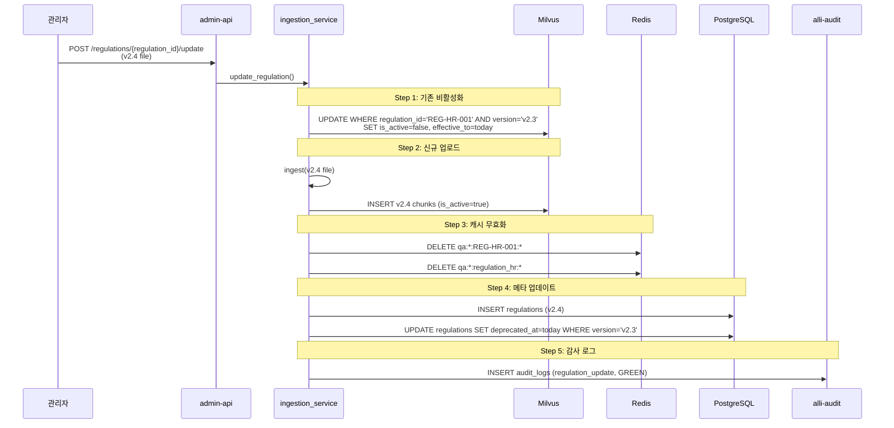

# 과제 6 지식 베이스 — 테스트 시나리오

---

## 📋 시나리오

| # | 시나리오 | 유형 | 기대 |
|:-:|---------|:---:|------|
| S1 | 10종 일괄 업로드 | E2E | 30분 내 완료 |
| S2 | HWP 파일 업로드 | 기능 | 변환 성공 |
| S3 | 조 단위 청킹 검증 | 단위 | 패턴 정규식 정확성 |
| S4 | 장문 조 → 항 분할 | 기능 | 1500자 초과 시 |
| S5 | 규정 개정 업데이트 | 기능 | 이전 버전 비활성화 |
| S6 | 품질 평가 (20쿼리) | 품질 | Top-5 ≥ 85% |
| S7 | Q&A 이력 수집 | 기능 | 평점 4+ 저장 |
| S8 | OCR 실패 문서 | 장애 | 재처리 안내 |

---

## S1 — 10종 규정 일괄 업로드

### 설정
```
파일: 규정 10종 (HWP 4 + PDF 6, 총 30MB)
목표: 30분 내 모든 업로드 완료 + 품질 평가 통과
```

### 아키텍처 동작

```
bulk_upload 스크립트:
  asyncio.gather(10 regulations in parallel)

각 규정:
  STEP 1: HWP → PDF (libreoffice, ~30s)
  STEP 2: PDF → Text (pdfplumber or OCR, ~10s)
  STEP 3: chunk_by_article (정규식 파싱, ~1s)
  STEP 4: BGE-M3 임베딩 (batch=32, ~60s for 100 chunks)
  STEP 5: Milvus 삽입 (~5s)
  STEP 6: PostgreSQL regulations 기록 (~1s)

병렬 한계:
  - libreoffice: 동시 4개 (CPU 병렬)
  - OCR: 동시 2개 (GPU 0 공유)
  - Embedding: 동시 2개 (GPU 2 fraction 0.30)
  - Milvus: 동시 10개 OK

총 소요: 약 15~25분 (파일 크기 분포에 따라)
```

### 검증

```python
@pytest.mark.asyncio
async def test_s1_bulk_upload():
    regulations = [
        {"file": "복무규정_v2.3.pdf", "id": "REG-HR-001", "partition": "regulation_hr"},
        # ... 9종 더
    ]

    start = time.time()

    tasks = [
        bulk_upload_service.upload(r["file"], r)
        for r in regulations
    ]
    results = await asyncio.gather(*tasks)
    elapsed = time.time() - start

    # 성능
    assert elapsed < 1800  # 30분

    # 모든 성공
    assert all(r["status"] == "success" for r in results)
    assert sum(r["chunks_count"] for r in results) >= 500  # 최소 500 청크

    # Milvus 카운트 확인
    for partition in ["regulation_hr", "regulation_finance", "regulation_general"]:
        count = milvus.get_partition_stats(partition).num_entities
        assert count > 0
```

---

## S2 — HWP 파일 업로드

### 설정
```
파일: 복무규정_v2.3.hwp (300KB)
```

### 아키텍처 동작

```
RegulationIngestionService.ingest():

STEP 1: _ensure_pdf():
  file_type = "hwp"
  → subprocess.run([
      "libreoffice", "--headless", "--convert-to", "pdf",
      "--outdir", "/tmp/conversion", input_path
    ])
  → 결과: /tmp/conversion/복무규정_v2.3.pdf

  검증:
    - 변환 파일 존재
    - 크기 > 원본의 30%
    - PDF 헤더 정상

STEP 2: PDF 텍스트 추출 (pdfplumber)
  - 첫 페이지 시험 추출
  - 텍스트 양 < 100자 → OCR 폴백

STEP 3~6: 기본 파이프라인
```

---

## S3 — 조 단위 청킹 검증 (단위 테스트)

### 설정
```
입력 텍스트 패턴:
  "제12조(연가의 신청) ① ... ② ..."
  "제13조의2 (긴급 연가) ..."
  "제14조 (병가) ..."
```

### 검증

```python
import pytest
from src.services.regulation_chunking import chunk_by_article

def test_s3_article_pattern():
    text = """
    제12조(연가의 신청) ① 연가를 사용하고자 하는 자는 신청해야 한다. ② 3일 전까지 신청함을 원칙으로 한다.

    제13조의2 (긴급 연가) 질병 등 긴급한 경우는 예외로 한다.

    제14조 (병가) 질병으로 인한 결근은 별도 증빙을 제출한다.
    """
    chunks = chunk_by_article(text, metadata={"regulation_id": "REG-HR-001"})

    assert len(chunks) == 3
    assert chunks[0]["article_no"] == "제12조(연가의 신청)"
    assert chunks[1]["article_no"] == "제13조의2 (긴급 연가)"
    assert chunks[2]["article_no"] == "제14조 (병가)"

    assert "3일 전까지" in chunks[0]["content"]
```

### 엣지 케이스

```python
@pytest.mark.parametrize("text,expected_count", [
    ("제1조 AAA",                                        1),
    ("제1조 AAA 제2조 BBB",                              2),
    ("제1조의2 특수",                                    1),
    ("제10조 (항목) ① 항1 ② 항2 ③ 항3",                  1),  # 조 유지
    ("제1조\nA" * 10000,                                 1),  # 장문 → 항 분할 트리거
])
def test_s3_edge_cases(text, expected_count):
    chunks = chunk_by_article(text, metadata={"regulation_id": "TEST"})
    assert len(chunks) >= expected_count  # 장문은 초과 가능
```

---

## S4 — 장문 조 → 항 단위 재분할

### 설정
```
조 하나에 본문 5000자 (1500자 초과)
기대: 개요 1 + 항 단위 여러 개로 분할
```

### 아키텍처 동작

```python
chunk_by_article:
  len(full_article) > MAX_CHUNK_SIZE (1500)
  → chunk_by_paragraph 호출
    1. 개요 청크: "제10조 (개요) 첫 200자..."
    2. 항 청크: "제10조① 본문..."
    3. 항 청크: "제10조② 본문..."
    4. ...
```

### 검증

```python
def test_s4_long_article_paragraph_split():
    long_text = "제10조 (복잡한 조항) " + "A" * 100 + \
                "① " + "B" * 1000 + \
                "② " + "C" * 1000 + \
                "③ " + "D" * 1000
    chunks = chunk_by_article(long_text, metadata={"regulation_id": "TEST"})

    # 개요 + 3개 항 = 4개
    assert len(chunks) == 4
    assert "개요" in chunks[0]["content"]
    assert chunks[1]["paragraph_no"] == "①"
    assert chunks[2]["paragraph_no"] == "②"
    assert chunks[3]["paragraph_no"] == "③"

    # 모든 청크가 max size 이하
    for c in chunks:
        assert len(c["content"]) <= 2000  # 여유분 포함
```

---

## S5 — 규정 개정 업데이트

### 설정
```
기존: 복무규정 v2.3 (is_active=true)
개정: 복무규정 v2.4 업로드
기대: v2.3 비활성화, v2.4 활성화, 캐시 무효화
```

### 아키텍처 동작



### 검증

```python
async def test_s5_regulation_update():
    # Given
    await upload_regulation("복무규정_v2.3.pdf", "REG-HR-001", "v2.3")
    await populate_qa_cache("REG-HR-001")  # 캐시 채움

    # When
    result = await update_regulation(
        "REG-HR-001",
        "복무규정_v2.4.pdf",
        {"version": "v2.4", "effective_from": "2026-07-01"}
    )

    # Then
    # v2.3 비활성화
    v23_active = await milvus.count(
        "regulation_knowledge",
        filter="regulation_id == 'REG-HR-001' AND version == 'v2.3' AND is_active == True"
    )
    assert v23_active == 0

    # v2.4 활성화
    v24_active = await milvus.count(
        "regulation_knowledge",
        filter="regulation_id == 'REG-HR-001' AND version == 'v2.4' AND is_active == True"
    )
    assert v24_active > 0

    # 캐시 무효화
    cached = await redis.keys("qa:*:REG-HR-001:*")
    assert len(cached) == 0
```

---

## S6 — 품질 평가 (20 테스트 쿼리)

### 설정
```
테스트 세트: 분야별 20문항 + 기대 조항
Top-5 정확도 목표: 85% 이상
```

### 검증

```python
TEST_QUERIES = [
    {"query": "연가 신청 기한?",          "expected_article": "복무규정 제12조",      "partition": "regulation_hr"},
    {"query": "출장비 한도?",              "expected_article": "출장규정 제5조",       "partition": "regulation_hr"},
    {"query": "공문서 작성 요건?",         "expected_article": "공문서규정 제3조",     "partition": "regulation_general"},
    # ... 17문항 더
]

async def test_s6_quality_evaluation():
    results = await evaluate_ingestion(
        regulation_id="ALL",
        test_queries=TEST_QUERIES
    )

    assert results.top1_accuracy >= 0.60
    assert results.top5_accuracy >= 0.85
    assert results.passed is True

    # 실패 쿼리 상세
    if results.misses:
        print("실패 쿼리 (청킹 튜닝 필요):")
        for m in results.misses:
            print(f"  - '{m['query']}' → 기대: {m['expected']}, 실제: {m['got']}")
```

---

## S7 — Q&A 이력 자동 수집

### 설정
```
시나리오:
  1. 사용자가 Q&A 답변에 평점 5/5 부여
  2. 지식 관리자 검토 대기
  3. 승인 → qa_history 파티션 저장
```

### 아키텍처 동작

```
chat-api feedback 엔드포인트:
  POST /chat/feedback {session_id, rating: 5, question, answer, refs}
  → qa_feedback INSERT
  → rating >= 4 → admin_api.create_review_task

admin-web /admin/qa-history/pending:
  평점 4+ 미승인 목록 표시

관리자 승인 클릭:
  POST /admin/qa-history/{feedback_id}/approve
  → approve_qa() 함수 실행

approve_qa:
  1. mask_pii() 개인정보 마스킹
  2. BGE-M3 임베딩
  3. Milvus qa_history 파티션 INSERT
  4. qa_feedback.is_approved = true
```

### 검증

```python
async def test_s7_qa_history_collection():
    # Given: 사용자가 평점 5 부여
    fb = await submit_feedback(
        question="연가 신청 며칠 전까지?",
        answer="3일 전까지 (복무규정 제12조 제2항)",
        rating=5
    )

    # When: 관리자 승인
    await approve_qa(fb.id)

    # Then: Milvus 저장 확인
    qa_chunks = await milvus.search(
        collection="regulation_knowledge",
        partition="qa_history",
        filter=f"chunk_id == 'QA-{fb.id}'"
    )
    assert len(qa_chunks) == 1
    assert "3일 전" in qa_chunks[0]["content"]

    # 개인정보 마스킹 확인
    assert re.search(r"[가-힣]\*+[가-힣]", qa_chunks[0]["content"]) is not None \
           or fb.question  # 원본에 PII가 없으면 OK
```

---

## S8 — OCR 실패 문서

### 설정
```
파일: 저해상도 스캔 PDF (72dpi, 기울어진 텍스트)
기대: OCR 신뢰도 < 0.7 → 재업로드 안내
```

### 아키텍처 동작

```
ocr_extract:
  ocr_result = await ocr_service.extract(...)
  if ocr_result["average_confidence"] < 0.70:
    return UploadResult(
      status="FAILED",
      error="OCR_LOW_CONFIDENCE",
      message="스캔 품질 낮음. 300dpi 이상 원본 재업로드 권장.",
      partial_text=ocr_result["text"][:500]  # 참고용
    )

  # 정상 진행
```

---

## 📊 커버리지

| 요소 | S1 | S2 | S3 | S4 | S5 | S6 | S7 | S8 |
|------|:--:|:--:|:--:|:--:|:--:|:--:|:--:|:--:|
| HWP 변환 | ⚠️ | ✅ | — | — | — | — | — | — |
| 텍스트 추출 | ✅ | ✅ | — | — | ✅ | — | — | ⚠️ |
| 조 단위 청킹 | ✅ | ✅ | ✅ | — | ✅ | — | — | — |
| 항 단위 분할 | ⚠️ | — | — | ✅ | — | — | — | — |
| BGE-M3 임베딩 | ✅ | ✅ | — | — | ✅ | — | ✅ | — |
| Milvus 저장 | ✅ | ✅ | — | — | ✅ | ✅ | ✅ | — |
| 버전 관리 | — | — | — | — | ✅ | — | — | — |
| 캐시 무효화 | — | — | — | — | ✅ | — | — | — |
| 품질 평가 | — | — | — | — | — | ✅ | — | — |
| Q&A 수집 | — | — | — | — | — | — | ✅ | — |
