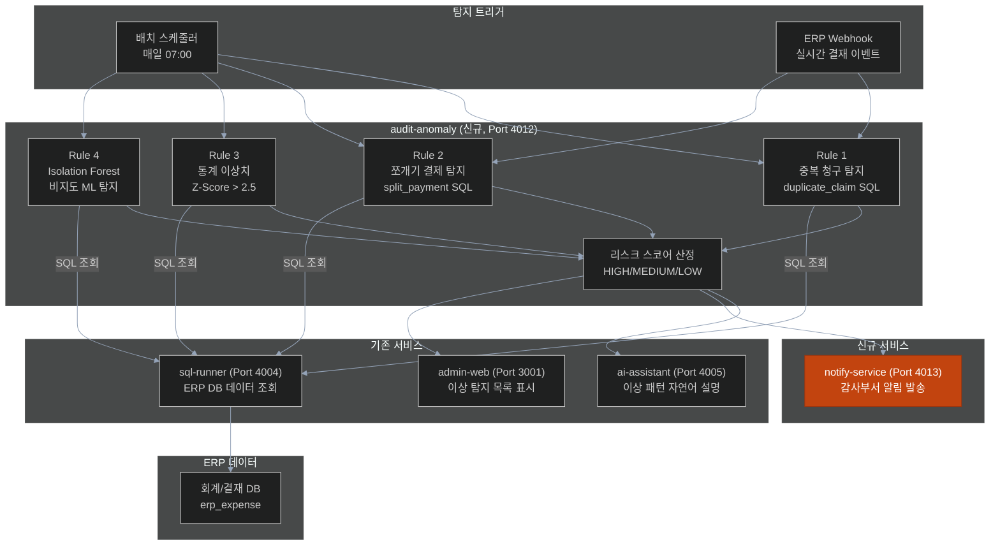
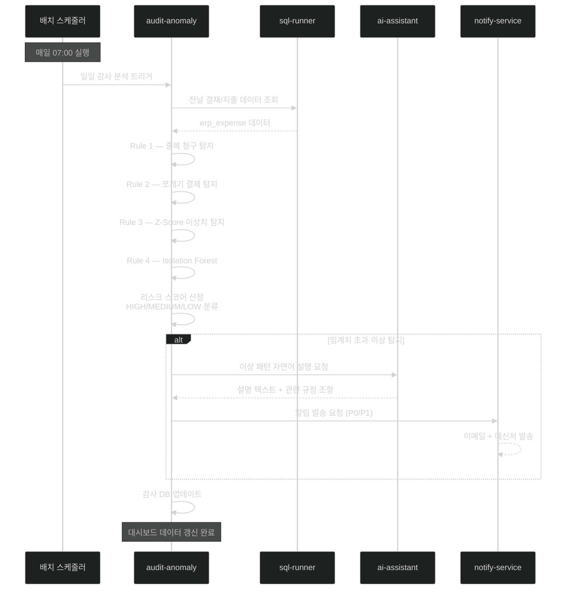

# 과제 7 — 지능형 회계 감사 (이상 결제 패턴 지급 방지)

> **분야**: POC 3 — 사전 감사 지능화
> **난이도**: 상
> **구현 기간**: 5주 → **4.5주 (재검토, 4/21)**
> **기존 서비스 활용도**: 50% → **70% (재검토)**

> **🔄 2026-04-21 업데이트 (중요)**: **alli-audit 패키지 재사용 확인** — 감사 결과 저장 기존 엔티티 활용
> - **재사용 포인트**: `packages/alli-audit/src/audit.entity.ts`, admin-web `activities/audits/page.tsx`
> - **결정 포인트 10개** (가장 많음): [→ 15-per-challenge-decision-points.md#과제-7](15-per-challenge-decision-points.md#-과제-7--지능형-회계-감사-이상-결제-패턴-탐지)
> - **고객 최중요 결정**: D7-03 탐지 임계값 (금액 기준), D7-05 탐지 후 처리 프로세스, D7-09 개인정보 처리
> - **예상 협의 시간**: 약 120분 (최장)

---

## 목차

- [1. 과제 개요](#1-과제-개요)
- [2. 구현 아키텍처](#2-구현-아키텍처)
- [3. 서비스 재사용 분석](#3-서비스-재사용-분석)
- [4. 구현 로드맵 및 Task](#4-구현-로드맵-및-task)
- [5. 위험 요소](#5-위험-요소)
- [6. 성공 기준](#6-성공-기준)
- [7. 참조 링크](#7-참조-링크)

---

## 1. 과제 개요

ERP 결재·지출 데이터를 실시간 및 배치 방식으로 분석하여, 중복 청구·쪼개기 결제·통계적 이상 고액 결재를 AI가 자동 탐지하고 지급 전 감사부서에 알림을 발송하는 사전 회계 감사 시스템

| 항목 | 내용 |
|------|------|
| **핵심 가치** | 사후 적발 → 사전 차단, 부정 지급 방지 |
| **대상 사용자** | 감사 담당자, 회계 관리자 |
| **주요 기능** | 중복 청구 탐지, 쪼개기 결제 탐지, Z-Score 이상치 탐지, Isolation Forest ML |

---

## 2. 구현 아키텍처

### 2.1 회계 이상 탐지 파이프라인

```
[데이터 수집 — 배치/실시간]
  ERP 결재 DB (MariaDB/Oracle/Tibero)
    │
    ▼ sql-runner (기존, Port 4004)
  일일 결재·지출 데이터 조회
    │
    ▼
audit-anomaly (신규, Port 4012)
  ├── Rule 1: duplicate_claim 탐지
  │    - 동일 청구인 + 동일 항목 + 동일 금액 (30일 이내)
  │
  ├── Rule 2: split_payment 탐지
  │    - 결재 기준금액 이하로 분할 청구 (7일 이내 3건+, 합계 50만원+)
  │
  ├── Rule 3: amount_outlier 탐지
  │    - 동일 항목 유형 대비 Z-Score > 2.5 이상 고액
  │
  └── Rule 4: Isolation Forest (비지도 ML)
       - 패턴 기반 이상치 (규칙 미포함 이상 행동)
    │
    ▼
이상 건 분류 + 심각도 산정 (HIGH/MEDIUM/LOW)
    │
    ▼
ai-assistant (기존, Port 4005) → 이상 패턴 자연어 설명 생성
    │
    ▼
notify-service (신규, Port 4013) → 감사부서 알림 발송
    │
    ▼
admin-web 대시보드 (기존 확장) → 이상 탐지 목록 표시
```

### 2.2 시스템 아키텍처 다이어그램



### 2.3 이상 탐지 알고리즘 상세

```python
# 회계 이상 탐지 규칙 정의
ANOMALY_RULES = {
    "duplicate_claim": {
        "description": "동일 청구인의 동일 항목 중복 청구",
        "query": """
            SELECT emp_cd, claim_type, amount, claim_date
            FROM erp_expense
            WHERE claim_date >= DATE_SUB(NOW(), INTERVAL 30 DAY)
            GROUP BY emp_cd, claim_type, amount
            HAVING COUNT(*) > 1
        """,
        "severity": "HIGH",
        "weight": 10  # 리스크 스코어 가중치
    },
    "split_payment": {
        "description": "결재 기준금액 회피 목적의 분할 청구 (쪼개기)",
        "query": """
            SELECT emp_cd, SUM(amount) as total, COUNT(*) as count
            FROM erp_expense
            WHERE claim_date >= DATE_SUB(NOW(), INTERVAL 7 DAY)
              AND claim_type = '물품구매'
            GROUP BY emp_cd, WEEK(claim_date)
            HAVING total > 500000 AND count >= 3
        """,
        "severity": "HIGH",
        "weight": 10
    },
    "amount_outlier": {
        "description": "동일 유형 대비 비정상 고액 청구 (Z-Score > 2.5)",
        "method": "z_score",
        "threshold": 2.5,
        "severity": "MEDIUM",
        "weight": 5
    },
    "isolation_forest": {
        "description": "Isolation Forest 비지도 ML 이상치 탐지",
        "contamination": 0.05,  # 이상치 비율 5% 가정
        "severity": "MEDIUM",
        "weight": 5
    }
}
```

### 2.4 배치 탐지 시퀀스



---

## 3. 서비스 재사용 분석

### 재사용 가능 기존 서비스

| 서비스 | 포트 | 재사용 내용 | 추가 개발 |
|--------|:---:|------------|---------|
| **sql-runner** | 4004 | ERP DB 쿼리 실행 (MariaDB/Oracle/Tibero) | 감사 전용 DB 커넥션 설정, 조회 쿼리 추가 |
| **admin-web** | 3001 | 관리자 UI 재사용 | 이상 탐지 목록 페이지 추가 |
| **admin-api** | 4000 | 관리 API 재사용 | 감사 조회 API 엔드포인트 추가 |
| **ai-assistant** | 4005 | 이상 패턴 자연어 설명 생성 | 감사 특화 프롬프트 추가 |
| **ai-rag** | 4006 | 관련 회계 규정 검색 | 없음 (과제 6 지식 베이스 활용) |

### 신규 개발 필요 서비스

| 서비스 | 포트 | 개발 내용 | 공수 |
|--------|:---:|----------|------|
| **audit-anomaly** | 4012 | 이상 탐지 엔진 전체 (과제 7, 8 공용) | 3~4주 |
| **notify-service** | 4013 | 알림 발송 서비스 (과제 9 공용) | 1주 |

### audit-anomaly 기술 스택

```
언어/프레임워크: Python + FastAPI
ML 라이브러리: Pandas + Scikit-learn (Isolation Forest)
스케줄러: APScheduler (배치 실행)
DB: PostgreSQL (감사 결과 저장)
의존 서비스:
  - sql-runner: ERP DB 데이터 조회
  - ai-assistant: 이상 패턴 자연어 설명
  - notify-service: 알림 발송
```

---

## 4. 구현 로드맵 및 Task

### 4.1 선행 조건

> **중요**: ERP DB 읽기 권한 확보 + sql-runner에 감사 DB 커넥션 추가 필수  
> 데이터 접근 권한 미확보 시 모든 탐지 기능 개발 불가

### 4.2 단계별 일정 (5주)

```
Week 1 — 데이터 파이프라인 구축
  ├── [ ] ERP 결재/지출 DB 스키마 파악 (erp_expense 테이블)
  ├── [ ] sql-runner에 감사 DB 커넥션 설정 추가
  ├── [ ] audit-anomaly 프로젝트 초기화 (FastAPI + APScheduler)
  ├── [ ] 기본 배치 수집 쿼리 구현 및 테스트
  └── [ ] 감사 결과 저장용 PostgreSQL 스키마 설계

Week 2~3 — 이상 탐지 규칙 구현
  ├── [ ] duplicate_claim 탐지 SQL 규칙 구현
  ├── [ ] split_payment 탐지 SQL 규칙 구현
  ├── [ ] Z-Score 이상치 탐지 구현 (Pandas)
  ├── [ ] Isolation Forest 모델 학습 및 적용
  ├── [ ] 리스크 스코어링 모델 구현
  └── [ ] 샘플 데이터로 탐지 정확도 검증

Week 4 — 통합 및 알림 연동
  ├── [ ] ai-assistant 이상 패턴 설명 연동
  ├── [ ] notify-service 알림 발송 연동
  ├── [ ] admin-web 이상 탐지 목록 페이지 구현
  ├── [ ] admin-api 감사 조회 API 추가
  └── [ ] 임계값 튜닝 및 오탐 최소화 검증
```

### 4.3 Task 목록

| ID | Task | 담당 | 우선순위 | 기간 |
|----|------|------|:-------:|:----:|
| T7-01 | ERP 결재 DB 스키마 분석 및 접근 권한 확보 | D1 | P0 | 1d |
| T7-02 | sql-runner 감사 DB 커넥션 설정 | D1 | P0 | 1d |
| T7-03 | audit-anomaly FastAPI 서비스 초기화 + APScheduler 설정 | D1 | P0 | 2d |
| T7-04 | duplicate_claim SQL 탐지 규칙 구현 (단위 테스트 포함) | D1 | P0 | 2d |
| T7-05 | split_payment SQL 탐지 규칙 구현 (단위 테스트 포함) | D1 | P0 | 2d |
| T7-06 | Z-Score 이상치 탐지 구현 (Pandas, 단위 테스트 포함) | D1 | P1 | 3d |
| T7-07 | Isolation Forest 모델 개발 + 학습 데이터 파이프라인 | D1 | P1 | 5d |
| T7-08 | 리스크 스코어링 모델 구현 + 심각도 분류 | D1 | P1 | 3d |
| T7-09 | ai-assistant 이상 패턴 설명 연동 (프롬프트 포함) | D1 | P1 | 2d |
| T7-10 | admin-web 이상 탐지 목록 페이지 | D2 | P2 | 3d |
| T7-11 | 탐지 정확도 검증 (샘플 50건) + 임계값 튜닝 + 오탐 최소화 + 안정화 | D1+D2 | P2 | 4d |
| **합계** | | | | **28 man-day** |
| **달력 기간** | D1 25d 기준 (SQL 10d + ML 15d), D2 7d 병행 | | | **25d (5주)** |

---

## 5. 위험 요소

| # | 위험 요소 | 가능성 | 영향도 | 대응 방안 |
|---|---------|:-----:|:-----:|---------|
| R1 | **ERP DB 읽기 권한 미확보** | 높음 | 치명 | POC 시작 전 권한 협의 필수, 미확보 시 더미 데이터로 개발 후 연동 |
| R2 | **ERP 결재 테이블 스키마 불명확** | 높음 | 높음 | 데이터 엔지니어 사전 스키마 파악 (1주 소요 예상) |
| R3 | **오탐율 과다 (허위 경보)** | 높음 | 높음 | 보수적 임계값 설정 + 화이트리스트 + 담당자 피드백 루프 |
| R4 | **Isolation Forest 학습 데이터 부족** | 중간 | 중간 | POC는 규칙 기반(Rule 1~3)으로 시작, ML은 2단계에서 고도화 |
| R5 | **개인정보 처리 규정 준수** | 중간 | 높음 | 이름/주민번호 마스킹, 감사 담당자 전용 접근 권한 설정 |
| R6 | **배치 처리 시간 초과** | 낮음 | 중간 | 배치를 청크 단위(1000건)로 분할 처리, 비동기 실행 |

---

## 6. 성공 기준

| 지표 | 목표값 |
|------|:------:|
| 이상 결재 탐지 정밀도 | ≥ 80% (전문가 검토 샘플 50건) |
| 이상 결재 탐지 재현율 | ≥ 70% (알려진 이상 사례 탐지) |
| 허위 경보율 | ≤ 20% |
| 배치 분석 처리 시간 | ≤ 5분 (일일 배치 완료) |
| 대시보드 데이터 갱신 주기 | ≤ 24시간 |

---

## 7. 참조 링크

| 문서 | 경로 |
|------|------|
| POC 3 사전 감사 지능화 상세 설계 | [../03-audit-intelligence.md](../03-audit-intelligence.md) |
| POC 전체 아키텍처 | [../00-overall-architecture.md](../00-overall-architecture.md) |
| 감사 데이터 요건 | [../05-audit-data-requirements.md](../05-audit-data-requirements.md) |
| audit-anomaly 서비스 설계 | [../design/audit-anomaly.md](../design/audit-anomaly.md) |
| 과제 8 (복무 관리 모니터링) | [08-attendance-monitoring.md](08-attendance-monitoring.md) |
| 과제 9 (사전 알림 시스템) | [09-alert-dashboard.md](09-alert-dashboard.md) |
