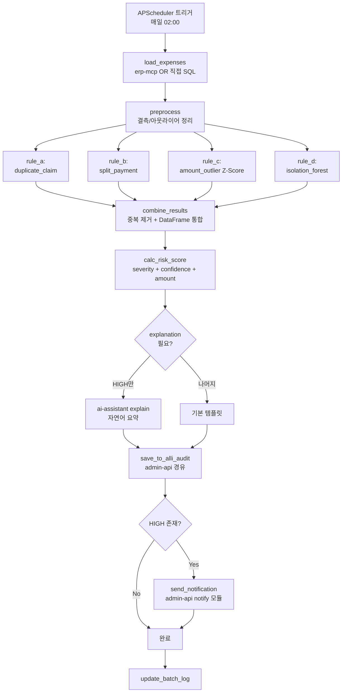

# 과제 7 지능형 회계 감사 — 구현 아키텍처

> **연관**: [test-scenarios.md](test-scenarios.md) | [detection-rules.md](detection-rules.md) | [ml-models.md](ml-models.md)

---

## 1. 컴포넌트 계층

```
Trigger:  APScheduler (매일 02:00 KST, cron 표현식)
Service:  audit-anomaly (신규 Port 4012, FastAPI)
ERP 접근: erp-mcp (Read-Only)  [또는 직접 Oracle 연결]
ML:       Scikit-learn (Isolation Forest) + scipy (Z-Score)
LLM:      ai-assistant explain_graph (재사용 — 자연어 설명)
Storage:  alli-audit (alli_audit DB + audit_anomaly 확장)
Notify:   admin-api notify 모듈 (신규 통합)
UI:       admin-web /admin/audit-dashboard
```

## 2. AuditAnomalyState / 배치 상태 모델

```python
# apps/audit-anomaly/src/models/batch_state.py

class BatchRunState(TypedDict):
    batch_id: str
    started_at: datetime
    window_start: datetime          # 감사 대상 기간 시작
    window_end: datetime            # 감사 대상 기간 종료

    # 입력 데이터
    expenses_df_size: int
    tenant_filters: list[str]       # 멀티 테넌트 처리

    # Rule 실행 결과
    rule_a_count: int               # 중복 청구
    rule_b_count: int               # 쪼개기
    rule_c_count: int               # Z-Score 이상치
    rule_d_count: int               # Isolation Forest

    # 최종
    total_anomalies: int
    high_severity_count: int
    explanations_generated: int
    saved_to_audit: int
    notifications_sent: int

    # 상태
    status: str                     # running|success|partial|failed
    errors: list[dict]
```

## 3. 배치 플로우 (LangGraph 없이 순차)



## 4. 주요 모듈 상세

### load_expenses_node

```python
# apps/audit-anomaly/src/services/data_loader.py

async def load_expenses(window_start: datetime, window_end: datetime) -> pd.DataFrame:
    """
    전일 결재/지출 데이터를 ERP에서 조회.
    대규모 처리를 위해 청크 단위로 로드.
    """
    sql = """
        SELECT
            EXP_ID, EMP_CD, DEPT_CD, CLAIM_TYPE, AMOUNT,
            SUBMITTED_AT, APPROVED_AT, APPROVER_CD, STATUS,
            COST_CENTER, ACCOUNT_CODE, VENDOR_CD
        FROM ACC_EXPENSE
        WHERE SUBMITTED_AT >= :start
          AND SUBMITTED_AT < :end
          AND STATUS IN ('APPROVED', 'PAID')
    """

    chunks = []
    async for chunk in oracle_db.execute_paginated(
        sql, params={"start": window_start, "end": window_end},
        page_size=5000
    ):
        chunks.append(pd.DataFrame(chunk))

    df = pd.concat(chunks, ignore_index=True)
    log.info(f"Loaded {len(df)} expense records")
    return df
```

### detection_engine

```python
# apps/audit-anomaly/src/services/detection_engine.py

class DetectionEngine:
    def __init__(self,
                 if_model_path: str = "/data/model/if_audit_model.pkl"):
        self.if_model = joblib.load(if_model_path) if Path(if_model_path).exists() else None

    async def run_all_rules(self, df: pd.DataFrame) -> pd.DataFrame:
        """4개 규칙 병렬 실행 후 통합"""
        results = await asyncio.gather(
            self._rule_a_duplicate(df),
            self._rule_b_split(df),
            self._rule_c_zscore(df),
            self._rule_d_isolation_forest(df),
            return_exceptions=True,
        )

        anomalies = []
        rule_names = ["duplicate", "split", "zscore", "isolation_forest"]
        for name, result in zip(rule_names, results):
            if isinstance(result, Exception):
                log.error(f"Rule {name} failed: {result}")
                continue
            anomalies.extend(result.to_dict("records") if isinstance(result, pd.DataFrame) else result)

        # 동일 EXP_ID 중복 제거 (여러 규칙 위반 시 가장 높은 심각도 유지)
        deduplicated = self._dedupe_by_exp_id(anomalies)
        return pd.DataFrame(deduplicated)
```

### risk_scoring_node

```python
def calc_risk_score(anomaly: dict) -> int:
    """
    0 ~ 100 점수.
    severity (기본 점수) + confidence (가중치) + amount_factor
    """
    base = {"HIGH": 70, "MEDIUM": 40, "LOW": 20}.get(anomaly["severity"], 20)
    confidence = anomaly.get("confidence", 0.8)
    amount_factor = min(anomaly["amount"] / 1_000_000, 10)  # 100만원 기준

    score = int(base * confidence + amount_factor)
    return min(100, max(0, score))
```

### explanation_generator

```python
async def generate_explanation(anomaly: dict) -> str:
    """
    HIGH 심각도에만 ai-assistant 호출 (비용 절감).
    LOW/MEDIUM은 템플릿.
    """
    if anomaly["severity"] != "HIGH":
        return EXPLANATION_TEMPLATES[anomaly["rule"]].format(**anomaly)

    # ai-assistant explain_graph 호출
    prompt = f"""
    다음 회계 이상 거래를 감사관에게 설명하는 간결한 문장을 작성하세요.
    반드시 사실만 서술하고, 확정적 판정 대신 "의심" 표현을 사용하세요.

    거래: {anomaly['claim_type']}, 금액 {anomaly['amount']:,}원
    규칙: {anomaly['rule']}
    증빙: {anomaly['evidence']}
    """
    resp = await ai_assistant_client.explain(prompt, max_tokens=150)
    return resp["text"]
```

## 5. alli-audit 저장 (admin-api 경유)

```python
async def save_to_alli_audit(anomalies: pd.DataFrame):
    """
    기존 alli-audit 테이블 (alli_audit_logs) + audit_anomaly 확장 테이블에 이중 저장
    """
    payload = anomalies.to_dict("records")

    # admin-api POST /api/audit/anomalies
    resp = await admin_api_client.post(
        "/api/audit/anomalies/bulk",
        json={"anomalies": payload, "batch_id": batch_id}
    )

    if resp.status_code != 200:
        raise AuditSaveError(resp.text)

    return resp.json()["saved_count"]
```

## 6. 성능 SLO

| SLI | SLO |
|-----|:---:|
| 일일 배치 완료 시간 | ≤ 60분 |
| 처리 건수 (5만건 기준) | ≤ 30분 |
| Isolation Forest 모델 재학습 | 주 1회 (일요일) |
| 오탐률 (False Positive) | ≤ 15% |
| 놓침률 (False Negative) | ≤ 5% |
| HIGH 심각도 알림 전송 시간 | ≤ 5분 (탐지 후) |

## 7. 오탐 관리

```python
# 감사관 피드백 수신 시
async def mark_false_positive(anomaly_id: str, reviewer_cd: str, reason: str):
    await db.update(AuditAnomaly, anomaly_id, {
        "status": "FALSE_POSITIVE",
        "reviewer_cd": reviewer_cd,
        "reviewed_at": datetime.now(),
        "false_positive_reason": reason,
    })

    # 학습 데이터로 활용 (다음 배치에서 해당 패턴 가중치 하향)
    await feature_weights.downweight(
        rule=anomaly["rule"],
        pattern_key=anomaly["pattern_key"]
    )
```
