```mermaid
sequenceDiagram
    participant SCH as APScheduler
    participant AA as audit-anomaly
    participant ERP as erp-mcp / Oracle
    participant AI as ai-assistant
    participant ADM as admin-api
    participant AL as alli-audit
    participant N as notify 모듈

    SCH->>AA: 트리거 02:00
    AA->>AA: batch_id 생성

    rect rgb(30, 60, 100)
        Note over AA,ERP: Step 1: load_expenses (10s)
        AA->>ERP: SELECT ACC_EXPENSE WHERE SUBMITTED_AT
        ERP-->>AA: DataFrame (5만건 가정 → 여기선 100건)
    end

    rect rgb(30, 90, 60)
        Note over AA: Step 2-5: 4 Rules 병렬 실행
        par
            AA->>AA: Rule A (duplicate_claim)
        and
            AA->>AA: Rule B (split_payment)
        and
            AA->>AA: Rule C (Z-Score)
        and
            AA->>AA: Rule D (Isolation Forest)
        end
        Note over AA: 결과: Rule A 에서 EXP002 포착
    end

    rect rgb(60, 30, 100)
        Note over AA: Step 6: combine + dedupe
        AA->>AA: EXP002 → {rule:"duplicate", severity:"HIGH", confidence:0.95}
    end

    rect rgb(100, 30, 60)
        Note over AA: Step 7: calc_risk_score
        AA->>AA: base=70 + confidence*0.95 + amount_factor → 72
    end

    rect rgb(30, 100, 100)
        Note over AA,AI: Step 8: generate_explanation (HIGH만)
        AA->>AI: POST /ai-assistant/explain
        AI-->>AA: "EMP20240315이 식대 5만원을 5일 간격으로 중복 제출한 의심 사례입니다..."
    end

    rect rgb(100, 100, 30)
        Note over AA,AL: Step 9: save (admin-api 경유)
        AA->>ADM: POST /api/audit/anomalies/bulk
        ADM->>AL: INSERT alli_audit_logs + audit_anomaly
        AL-->>ADM: saved_count=1
        ADM-->>AA: 200 OK
    end

    rect rgb(30, 60, 60)
        Note over AA,N: Step 10: notify (HIGH 조건)
        AA->>ADM: POST /api/notify/send
        ADM->>N: Slack + Email 발송
        N-->>ADM: sent=true
    end
```

# 과제 7 지능형 회계 감사 — 테스트 시나리오

---

## 📋 시나리오

| # | 시나리오 | 유형 | 기대 |
|:-:|---------|:---:|------|
| S1 | 중복 청구 탐지 | 기능 | Rule A, HIGH, risk_score≥70 |
| S2 | 쪼개기 결제 | 기능 | Rule B, 7일내 3건+ |
| S3 | Z-Score 이상치 | 기능 | Rule C, \|z\|>2.5 |
| S4 | Isolation Forest | ML | Rule D, 다차원 |
| S5 | 복합 위반 (여러 규칙) | 경계 | 최고 심각도 유지 |
| S6 | 대규모 배치 (5만건) | 성능 | 30분 이내 |
| S7 | 오탐 피드백 | 기능 | FALSE_POSITIVE 마킹 |
| S8 | ML 모델 없음 | 장애 | Rule D 스킵, 나머지 진행 |
| S9 | ai-assistant 실패 | 장애 | 템플릿 설명 대체 |
| S10 | 신규 테넌트 (데이터 적음) | 경계 | 학습 중단 메시지 |

---

## S1 — 중복 청구 탐지

### 설정
```
사전 삽입:
  EXP001: EMP20240315 식대 50,000원 2026-04-10 제출
  EXP002: EMP20240315 식대 50,000원 2026-04-15 제출 (중복)
기대: Rule A 탐지, severity=HIGH, risk_score >= 70
```

### 아키텍처 동작



### 검증

```python
async def test_s1_duplicate_detection():
    # Given
    await insert_test_expenses([
        {"exp_id": "EXP001", "emp_cd": "EMP20240315", "type": "식대", "amount": 50000, "date": "2026-04-10"},
        {"exp_id": "EXP002", "emp_cd": "EMP20240315", "type": "식대", "amount": 50000, "date": "2026-04-15"},
    ])

    # When
    result = await audit_anomaly_service.run_batch(window="2026-04-10/2026-04-16")

    # Then
    assert result["rule_a_count"] >= 1
    anomaly = await db.get_by_exp_id("EXP002")
    assert anomaly["severity"] == "HIGH"
    assert anomaly["rule"] == "duplicate_claim"
    assert anomaly["risk_score"] >= 70
    assert "중복" in anomaly["explanation"]
```

---

## S2 — 쪼개기 결제

### 설정
```
사전 삽입: EMP20240315이 2026-04-08~14 물품구매 4건 × 15만원
기대: Rule B 탐지, total=600,000원, split_count=4
```

### 아키텍처 동작

```sql
-- detection_engine._rule_b_split 내부 실행 쿼리
SELECT EMP_CD, COUNT(*), SUM(AMOUNT), MIN/MAX(SUBMITTED_AT), GROUP_CONCAT(EXP_ID)
FROM ACC_EXPENSE
WHERE SUBMITTED_AT >= '2026-04-08' AND CLAIM_TYPE = '물품구매'
GROUP BY EMP_CD
HAVING COUNT(*) >= 3 AND SUM(AMOUNT) >= 500000;

-- EMP20240315 결과 → split_count=4, total=600000
```

### 검증

```python
async def test_s2_split_payment():
    for i in range(4):
        await insert_expense({
            "emp_cd": "EMP20240315",
            "type": "물품구매",
            "amount": 150000,
            "date": f"2026-04-{8+i}",
        })

    result = await audit_anomaly_service.run_batch()

    anomaly = await db.get_anomalies(emp_cd="EMP20240315", rule="split_payment")
    assert anomaly["split_count"] == 4
    assert anomaly["total_amount"] == 600000
    assert len(anomaly["exp_ids"]) == 4
```

---

## S3 — Z-Score 이상치

### 설정
```
데이터: '출장비' 카테고리 평균 20만원, 표준편차 5만원
이상 거래: EXP_OUTLIER 출장비 150만원
기대 Z-Score: (1500000 - 200000) / 50000 = 26 (극단)
```

### 아키텍처 동작

```python
# detection_engine._rule_c_zscore
df.loc[df["claim_type"] == "출장비", "z_score"] = zscore(df["amount"])
outliers = df[df["z_score"].abs() > 2.5]
# EXP_OUTLIER z_score=26 → severity="HIGH" (>4)
```

### 검증

```python
async def test_s3_zscore_outlier():
    # 정상 100건 + 이상 1건
    for i in range(100):
        await insert_expense({"type": "출장비", "amount": 200000 + random.gauss(0, 50000)})
    await insert_expense({"exp_id": "EXP_OUTLIER", "type": "출장비", "amount": 1500000})

    result = await audit_anomaly_service.run_batch()

    anomaly = await db.get_anomalies(exp_id="EXP_OUTLIER")
    assert anomaly["rule"] == "amount_outlier"
    assert abs(anomaly["z_score"]) > 2.5
    assert anomaly["severity"] == "HIGH"  # z_score > 4
```

---

## S4 — Isolation Forest 복합 이상

### 설정
```
특징: 일반과 다른 다차원 조합
- amount: 중간 (350,000원, 이상 없음)
- hour_of_day: 23 (야간 제출)
- day_of_week: 6 (일요일)
- approver_count: 1 (최소 결재)
- same_day_claims_count: 5 (같은날 5건)
기대: Rule A~C 미탐, Rule D (Isolation Forest) 탐지
```

### 아키텍처 동작

```python
# 학습된 모델로 예측
X = prepare_features(df)  # [amount, hour, dow, days_since_last, z, approvers, same_day]
predictions = if_model.predict(X)
# EXP_COMPLEX: is_anomaly=True, anomaly_score=-0.25 (낮을수록 이상)

# risk_score 계산
base = 40 (MEDIUM)
confidence = 1 - |anomaly_score| / max_abs_score
risk_score = ~50
```

### 검증

```python
async def test_s4_isolation_forest_complex():
    # Rule A,B,C 미탐 조건 — 단일 건
    await insert_expense({
        "exp_id": "EXP_COMPLEX",
        "amount": 350000,
        "submitted_at": "2026-04-13 23:15:00",  # 일요일 23시
        "approver_count": 1,
        "same_day_other_claims": 5,
    })

    result = await audit_anomaly_service.run_batch()

    anomaly = await db.get_anomalies(exp_id="EXP_COMPLEX")
    assert anomaly["rule"] == "isolation_forest"
    assert anomaly["severity"] in ["MEDIUM", "LOW"]
    assert anomaly["anomaly_score"] < 0  # 이상 판정
```

---

## S5 — 복합 위반 (여러 규칙 동시)

### 설정
```
EXP_MANY: 중복 청구 + Z-Score 이상 + IF 이상 동시 해당
기대: severity=HIGH 유지, rule="duplicate_claim,amount_outlier,isolation_forest"
```

### 아키텍처 동작

```python
# DetectionEngine._dedupe_by_exp_id
# 동일 EXP_ID 여러 규칙 충돌 시:
# 1. 최고 severity 유지 (HIGH > MEDIUM > LOW)
# 2. 모든 rule 이름 쉼표 연결
# 3. risk_score는 각 규칙 중 최대값

# 결과:
# {
#   "exp_id": "EXP_MANY",
#   "severity": "HIGH",  # duplicate_claim이 HIGH
#   "rules": ["duplicate_claim", "amount_outlier", "isolation_forest"],
#   "risk_score": 85,  # 최대값
# }
```

---

## S6 — 대규모 배치 성능 (5만건)

### 설정
```
5만건 expense 데이터 (30일 누적)
기대: 30분 이내 전체 배치 완료
```

### 아키텍처 동작

```
load_expenses (청크 5천건 × 10회): 3분
rule_a (SQL JOIN): 2분
rule_b (GROUP BY HAVING): 1분
rule_c (zscore 벡터 연산): 2분
rule_d (IF predict): 5분
combine + risk_score: 1분
explanation (HIGH only, 50건 가정): 3분
save to alli-audit: 2분
notify: 1분
─────────────────
총: ~20분
```

### 검증

```python
async def test_s6_large_batch():
    await seed_50k_expenses()

    start = time.time()
    result = await audit_anomaly_service.run_batch()
    elapsed = time.time() - start

    assert elapsed < 1800  # 30분
    assert result["status"] == "success"
    assert result["total_anomalies"] >= 100  # 5만건 중 ~0.2% 이상
```

---

## S7 — 오탐 피드백

### 설정
```
감사관이 anomaly_id=ANOM001을 "정상 사례"로 판정
  reason: "특정 부서 업무 특성으로 정상 패턴"
기대: FALSE_POSITIVE 마킹, 패턴 가중치 하향
```

### 아키텍처 동작

```python
# admin-web UI에서 "정상으로 판정" 버튼
POST /api/audit/anomalies/ANOM001/feedback
body: {action: "false_positive", reason: "..."}

admin-api:
  UPDATE audit_anomaly SET status='FALSE_POSITIVE',
                           reviewer_cd='ADMIN001',
                           false_positive_reason=?
  WHERE anomaly_id='ANOM001';

  feature_weights.downweight(rule, pattern_key)
  → 다음 배치에서 동일 패턴은 -0.2점 감점
```

---

## S8 — ML 모델 없음 (초기 배포)

### 설정
```
/data/model/if_audit_model.pkl 파일 미존재
기대: Rule D 스킵 + 나머지 규칙 정상 실행
```

### 아키텍처 동작

```python
# detection_engine.__init__
self.if_model = None  # 파일 없음

# _rule_d_isolation_forest
if not self.if_model:
    log.warning("IF model not found, skipping Rule D")
    return pd.DataFrame()

# 최종:
result["rule_d_count"] = 0
result["status"] = "partial"
result["errors"].append({"rule": "isolation_forest", "reason": "model_not_found"})
```

---

## S9 — ai-assistant 실패 → 템플릿 대체

```python
# generate_explanation 재시도 실패
async def generate_explanation_safe(anomaly):
    try:
        return await ai_assistant.explain(anomaly, timeout=10)
    except (TimeoutError, ConnectionError) as e:
        log.warning(f"AI explain failed: {e}, using template")
        return EXPLANATION_TEMPLATES[anomaly["rule"]].format(**anomaly)

# 배치 기록
state["explanation_source"] = "template" if ai_failed else "ai"
```

---

## S10 — 신규 테넌트 (학습 데이터 부족)

### 설정
```
테넌트 T001: 결재 데이터 < 100건
기대: Isolation Forest 학습 중단 경고
```

### 아키텍처 동작

```python
# 매주 일요일 재학습 주기
async def retrain_model(tenant_id: str):
    df = await load_training_data(tenant_id, months=6)

    if len(df) < MIN_TRAINING_SIZE:  # 100건
        log.warning(f"Insufficient data for tenant {tenant_id} ({len(df)} rows)")
        return {"status": "skipped", "reason": "insufficient_data"}

    model = IsolationForest(...)
    model.fit(df[FEATURES])
    joblib.dump(model, f"/data/model/if_audit_{tenant_id}.pkl")
    return {"status": "success", "samples": len(df)}
```

---

## 📊 커버리지

| 모듈 | S1 | S2 | S3 | S4 | S5 | S6 | S7 | S8 | S9 | S10 |
|------|:--:|:--:|:--:|:--:|:--:|:--:|:--:|:--:|:--:|:---:|
| load_expenses | ✅ | ✅ | ✅ | ✅ | ✅ | ✅ | — | ✅ | ✅ | — |
| rule_a | ✅ | — | — | — | ✅ | ✅ | — | ✅ | — | — |
| rule_b | — | ✅ | — | — | — | ✅ | — | ✅ | — | — |
| rule_c | — | — | ✅ | — | ✅ | ✅ | — | ✅ | — | — |
| rule_d | — | — | — | ✅ | ✅ | ✅ | — | ❌ | — | ⚠️ |
| risk_score | ✅ | ✅ | ✅ | ✅ | ✅ | ✅ | — | ✅ | ✅ | — |
| explanation | ✅ | — | — | — | ✅ | ✅ | — | — | ❌ | — |
| save_audit | ✅ | ✅ | ✅ | ✅ | ✅ | ✅ | ✅ | ✅ | ✅ | — |
| notify | ✅ | — | — | — | ✅ | ✅ | — | — | — | — |
| feedback | — | — | — | — | — | — | ✅ | — | — | — |
| retrain | — | — | — | — | — | — | — | — | — | ✅ |
