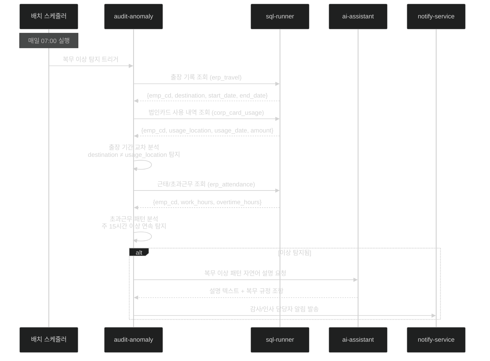

# 과제 8 — 복무 관리 모니터링 (근태 이상 징후 분류)

> **분야**: POC 3 — 사전 감사 지능화
> **난이도**: 중상
> **구현 기간**: 2.5주 → **2주 (재검토, 4/21)**
> **기존 서비스 활용도**: 50% → **70% (재검토)**

> **🔄 2026-04-21 업데이트**: 시나리오 B에서 **2단계 연기 권장** (노조 협의 필수)
> - **결정 포인트 8개**: [→ 15-per-challenge-decision-points.md#과제-8](15-per-challenge-decision-points.md#-과제-8--복무-관리-모니터링)
> - **고객 최중요 결정 (법적 이슈)**: D8-05 **노조 협의 여부** ⭐⭐⭐, D8-06 개인정보보호 영향평가
> - **재사용 포인트**: 과제 7 audit-anomaly 인프라 공유

---

## 목차

- [1. 과제 개요](#1-과제-개요)
- [2. 구현 아키텍처](#2-구현-아키텍처)
- [3. 서비스 재사용 분석](#3-서비스-재사용-분석)
- [4. 구현 로드맵 및 Task](#4-구현-로드맵-및-task)
- [5. 위험 요소](#5-위험-요소)
- [6. 성공 기준](#6-성공-기준)
- [7. 참조 링크](#7-참조-링크)

---

## 1. 과제 개요

출장 기록과 법인카드 사용 내역을 교차 분석하여 출장지 불일치를 탐지하고, 비정상 초과근무 패턴 및 근태 이상 징후를 AI가 자동 분류하여 감사 담당자에게 선제적으로 알림을 제공하는 복무 관리 지능화 시스템

| 항목 | 내용 |
|------|------|
| **핵심 가치** | 복무 부정 사전 차단, 감사 담당자 수동 검토 부담 90% 감소 |
| **대상 사용자** | 감사 담당자, 인사 관리자 |
| **주요 기능** | 출장-법인카드 불일치 탐지, 비정상 초과근무 패턴, 근태 이상 징후 분류 |

---

## 2. 구현 아키텍처

### 2.1 복무 이상 탐지 파이프라인

```
[데이터 소스]
  ├── ERP 인사 DB — 출장 기록 (erp_travel)
  ├── ERP 법인카드 DB — 법인카드 사용 내역 (corp_card_usage)
  └── ERP 근태 DB — 출퇴근/초과근무 기록 (erp_attendance)
        │
        ▼ sql-runner (기존, Port 4004)
  교차 조회 및 데이터 수집
        │
        ▼
audit-anomaly (신규, Port 4012) — 과제 7과 동일 서비스
  ├── Rule A: travel_card_mismatch 탐지
  │    - erp_travel.destination ≠ corp_card_usage.usage_location
  │    - 출장 기간 내 출장지 외 카드 사용
  │
  ├── Rule B: overtime_pattern 탐지
  │    - 주 15시간 이상 초과근무 연속 패턴
  │    - 동일 부서 내 특정 직원 집중 초과근무
  │
  └── Rule C: attendance_anomaly 탐지
       - 출퇴근 패턴 이상 (자정 이후 출근, 주말 연속 출근)
       - 휴가 미신청 + 미출근 패턴
        │
        ▼
이상 건 분류 (HIGH/MEDIUM/LOW) + 자연어 설명 생성
        │
        ▼
notify-service → 감사/인사 담당자 알림
```

### 2.2 출장-법인카드 불일치 탐지 다이어그램



### 2.3 복무 이상 탐지 규칙 코드

```python
# 복무 이상 탐지 규칙
WORK_ANOMALY_RULES = {
    "travel_card_mismatch": {
        "description": "출장지역과 법인카드 사용지역 불일치",
        "join_query": """
            SELECT t.emp_cd, t.destination, c.usage_location,
                   c.usage_date, c.amount
            FROM erp_travel t
            JOIN corp_card_usage c ON t.emp_cd = c.emp_cd
                AND c.usage_date BETWEEN t.start_date AND t.end_date
            WHERE t.start_date >= DATE_SUB(NOW(), INTERVAL 30 DAY)
              AND t.destination != c.usage_location
        """,
        "severity": "HIGH",
        "weight": 10
    },
    "overtime_pattern": {
        "description": "비정상 초과근무 패턴 (주 15시간 이상)",
        "query": """
            SELECT emp_cd, WEEK(work_date) as week,
                   SUM(overtime_hours) as total_overtime
            FROM erp_attendance
            WHERE work_date >= DATE_SUB(NOW(), INTERVAL 30 DAY)
            GROUP BY emp_cd, WEEK(work_date)
            HAVING total_overtime > 15
        """,
        "severity": "MEDIUM",
        "weight": 5,
        "threshold": 15  # 주당 초과근무 시간
    },
    "attendance_anomaly": {
        "description": "비정상 근태 패턴 (자정 이후 출근, 미신청 결근)",
        "severity": "LOW",
        "weight": 2
    }
}
```

### 2.4 admin-web 복무 모니터링 UI 구조

```tsx
// 감사 대시보드 내 복무 모니터링 섹션
/admin/audit
├── /anomalies    — 이상 탐지 건 목록 (회계 + 복무 통합)
│    ├── 필터: 탐지 유형 (회계/복무), 심각도, 기간
│    └── 상세: 탐지 내용 + AI 설명 + 관련 규정 조항
└── /risk-score   — 부서별 리스크 스코어 히트맵
     └── 회계 이상 + 복무 이상 통합 점수 표시
```

---

## 3. 서비스 재사용 분석

### 재사용 가능 기존 서비스

| 서비스 | 포트 | 재사용 내용 | 추가 개발 |
|--------|:---:|------------|---------|
| **sql-runner** | 4004 | 근태·출장·법인카드 DB 교차 조회 | 복무 DB 커넥션 설정, JOIN 쿼리 추가 |
| **admin-web** | 3001 | 관리자 UI 재사용 | 복무 이상 탐지 결과 섹션 추가 |
| **admin-api** | 4000 | 관리 API 재사용 | 복무 이상 API 엔드포인트 추가 |
| **ai-assistant** | 4005 | 복무 이상 패턴 자연어 설명 생성 | 복무 규정 특화 프롬프트 추가 |
| **ai-rag** | 4006 | 관련 복무/인사 규정 검색 | 없음 (과제 6 지식 베이스 활용) |

### audit-anomaly 공용 서비스 (과제 7과 공유)

| 서비스 | 포트 | 개발 내용 | 공수 |
|--------|:---:|----------|------|
| **audit-anomaly** | 4012 | 복무 이상 탐지 모듈 추가 (과제 7 기반 확장) | 1~2주 추가 |
| **notify-service** | 4013 | 과제 7과 공용 (인사 담당자 알림 채널 추가) | 0.5일 추가 |

> **핵심**: audit-anomaly는 과제 7(회계 감사)과 과제 8(복무 모니터링)이 동일 서비스를 공유.  
> 과제 7의 audit-anomaly 개발 완료 후 복무 탐지 모듈을 추가하는 방식으로 구현.

---

## 4. 구현 로드맵 및 Task

### 4.1 선행 조건

> **중요**: 과제 7(지능형 회계 감사)의 audit-anomaly 기반 서비스 구축 후 진행  
> sql-runner에 복무 관련 DB(근태, 출장, 법인카드) 커넥션 추가 필수

### 4.2 단계별 일정 (2.5주, 과제 7 완료 후 추가 개발)

```
과제 7 개발 병행 (1~2주 차)
  ├── [ ] 출장 DB (erp_travel) 스키마 파악
  ├── [ ] 법인카드 DB (corp_card_usage) 스키마 파악
  ├── [ ] 근태 DB (erp_attendance) 스키마 파악
  └── [ ] sql-runner에 복무 DB 커넥션 설정

과제 7 완료 후 추가 개발 (3주 차)
  ├── [ ] travel_card_mismatch 탐지 쿼리 구현
  ├── [ ] overtime_pattern 탐지 구현
  ├── [ ] attendance_anomaly 탐지 구현
  ├── [ ] 복무 이상 리스크 스코어 통합
  ├── [ ] ai-assistant 복무 규정 특화 프롬프트 추가
  ├── [ ] admin-web 복무 이상 UI 섹션 추가
  └── [ ] 탐지 결과 검증 (샘플 30건)
```

### 4.3 Task 목록

| ID | Task | 담당 | 우선순위 | 기간 |
|----|------|------|:-------:|:----:|
| T8-01 | 출장/근태/법인카드 DB 스키마 분석 | D1 | P0 | 1d |
| T8-02 | sql-runner 복무 DB 커넥션 추가 (3개 테이블) | D1 | P0 | 1d |
| T8-03 | travel_card_mismatch 탐지 구현 (JOIN 쿼리 + 단위 테스트) | D1 | P0 | 3d |
| T8-04 | overtime_pattern 탐지 구현 (집계 쿼리 + 단위 테스트) | D1 | P0 | 2d |
| T8-05 | attendance_anomaly 탐지 구현 (패턴 분석 + 단위 테스트) | D1 | P1 | 2d |
| T8-06 | 복무 이상 리스크 스코어 통합 (과제 7 audit-anomaly 확장) | D1 | P1 | 1d |
| T8-07 | ai-assistant 복무 규정 특화 프롬프트 추가 | D1 | P1 | 1d |
| T8-08 | admin-web 복무 이상 탐지 결과 UI 추가 | D2 | P2 | 2d |
| T8-09 | 탐지 정확도 검증 (샘플 30건) + 오탐 조정 + 안정화 | D1+D2 | P2 | 2d |
| **합계** | | | | **15 man-day** |
| **달력 기간** | D1 13d 기준 (과제 7 완료 후 진행), D2 4d 병행 | | | **12d (2.5주)** |

---

## 5. 위험 요소

| # | 위험 요소 | 가능성 | 영향도 | 대응 방안 |
|---|---------|:-----:|:-----:|---------|
| R1 | **ERP 복무 DB 테이블 구조 미공개** | 높음 | 높음 | 사전 스키마 협의 필수, 미제공 시 더미 데이터로 로직 구현 후 연동 |
| R2 | **출장 DB ↔ 법인카드 DB 조인 키 불일치** | 중간 | 높음 | 사원 코드(emp_cd) 기준 조인, 다른 경우 매핑 테이블 별도 생성 |
| R3 | **법인카드 사용지 데이터 미포함 (카드사 미제공)** | 중간 | 높음 | POC 범위를 가능한 데이터로 한정, 법인카드 데이터 제공 범위 사전 확인 |
| R4 | **초과근무 집계 기준 불명확** | 중간 | 중간 | 인사 담당자와 임계값 사전 합의 (기본: 주 15시간) |
| R5 | **근태 데이터 개인정보 민감도** | 높음 | 높음 | 감사 담당자 전용 접근 권한, 개인식별 최소화 |
| R6 | **audit-anomaly 과제 7 지연 시 연쇄 지연** | 중간 | 중간 | 과제 7 DB/기반 구축 후 병행 진행 가능한 모듈 분리 |

---

## 6. 성공 기준

| 지표 | 목표값 |
|------|:------:|
| 출장-법인카드 불일치 탐지율 | ≥ 75% (알려진 불일치 사례 기준) |
| 초과근무 이상 패턴 탐지율 | ≥ 70% |
| 허위 경보율 | ≤ 25% (복무 탐지는 회계 대비 허용 범위 넓음) |
| 배치 분석 처리 시간 | ≤ 5분 (회계 감사와 통합 배치) |
| 사용자 만족도 (감사 담당자) | ≥ 3.5/5점 |

---

## 7. 참조 링크

| 문서 | 경로 |
|------|------|
| POC 3 사전 감사 지능화 상세 설계 | [../03-audit-intelligence.md](../03-audit-intelligence.md) |
| POC 전체 아키텍처 | [../00-overall-architecture.md](../00-overall-architecture.md) |
| 감사 데이터 요건 | [../05-audit-data-requirements.md](../05-audit-data-requirements.md) |
| 과제 7 (지능형 회계 감사) | [07-accounting-audit.md](07-accounting-audit.md) |
| 과제 9 (사전 알림 시스템) | [09-alert-dashboard.md](09-alert-dashboard.md) |
