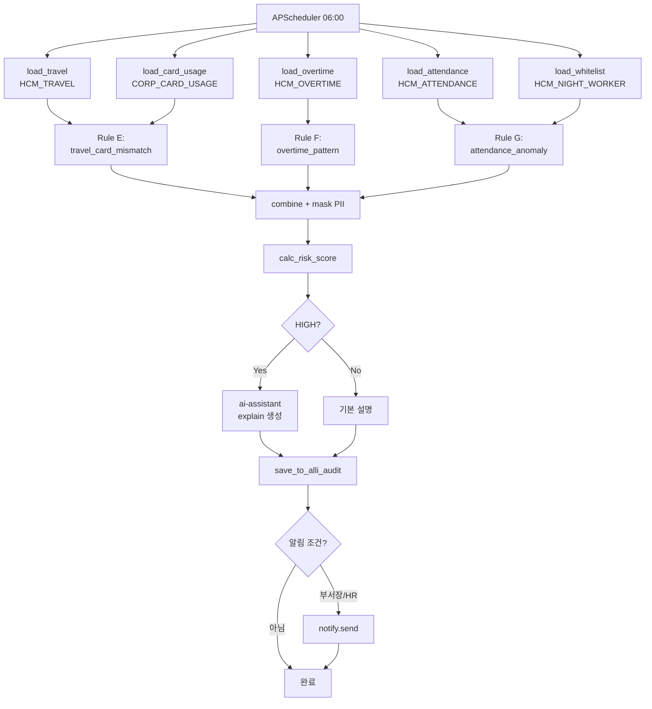

# 과제 8 복무 상시 감사 — 구현 아키텍처

> **연관**: [test-scenarios.md](test-scenarios.md) | [detection-rules.md](detection-rules.md)
> **기반 서비스**: audit-anomaly (과제 7과 공유, 별도 엔드포인트)

---

## 1. 컴포넌트 계층

```
Trigger:  APScheduler (매일 06:00 KST)
Service:  audit-anomaly (포트 4012 공유, compliance 모드)
ERP 접근: erp-mcp HCM 도구 + 법인카드 DB 직결
Logic:    SQL 기반 규칙 E/F/G
LLM:      ai-assistant explain (HIGH만)
Storage:  alli-audit (compliance_anomaly 카테고리)
Notify:   admin-api notify 모듈
UI:       admin-web /admin/compliance-dashboard
```

**과제 7과의 차이**:
- 데이터 소스: `HCM_TRAVEL`, `HCM_OVERTIME`, `HCM_ATTENDANCE`, `CORP_CARD_USAGE`
- 특수 처리: 야간 근무자 화이트리스트, 공휴일 테이블
- **개인정보 + 노조 협의 (D8-05)** — 범위 제한 필수

## 2. ComplianceBatchState

```python
class ComplianceBatchState(TypedDict):
    batch_id: str
    started_at: datetime
    window: tuple[datetime, datetime]

    # 입력
    travel_df_size: int
    card_usage_df_size: int
    overtime_df_size: int
    attendance_df_size: int

    # 규칙별
    rule_e_count: int               # travel_card_mismatch
    rule_f_count: int               # overtime_pattern
    rule_g_count: int               # attendance_anomaly (3 유형)

    # 마스킹/필터
    masked_personal_info: int       # PII 마스킹 적용 건수
    whitelist_exclusions: int       # 야간 근무자 제외 건수

    # 산출
    total_anomalies: int
    high_severity_count: int
    saved_to_audit: int
```

## 3. 배치 플로우



## 4. 핵심 모듈

### Rule E — travel_card_mismatch

```python
# apps/audit-anomaly/src/compliance/rule_e_travel_card.py

async def detect_travel_card_mismatch(
    travel_df: pd.DataFrame,
    card_df: pd.DataFrame,
    match_level: str = "province"  # province | city | radius_50km (D8-02)
) -> pd.DataFrame:
    """
    출장 기간 중 출장지 외 지역 법인카드 사용 탐지.
    """
    joined = travel_df.merge(
        card_df,
        on="emp_cd",
        how="inner",
        suffixes=("_travel", "_card")
    )

    # 출장 기간 내 사용 필터
    joined = joined[
        (joined["usage_datetime"] >= joined["start_date"]) &
        (joined["usage_datetime"] <= joined["end_date"])
    ]

    # 지역 매칭 (광역시/도 단위 기본)
    if match_level == "province":
        joined["location_match"] = joined.apply(
            lambda r: _match_province(r["destination"], r["usage_location"]),
            axis=1
        )
    elif match_level == "city":
        joined["location_match"] = joined.apply(
            lambda r: _match_city(r["destination"], r["usage_location"]),
            axis=1
        )
    elif match_level == "radius_50km":
        joined["location_match"] = joined.apply(
            lambda r: _match_radius(r["destination_coord"], r["usage_coord"], 50),
            axis=1
        )

    mismatches = joined[~joined["location_match"]].copy()
    mismatches["severity"] = "HIGH"
    mismatches["rule"] = "travel_card_mismatch"
    return mismatches
```

### Rule F — overtime_pattern

```python
async def detect_overtime_pattern(overtime_df: pd.DataFrame) -> pd.DataFrame:
    """
    주 15h+ 초과근무 연속 3주 이상 탐지.
    """
    # 주간 집계
    weekly = overtime_df.groupby(
        [pd.Grouper(key="work_date", freq="W"), "emp_cd"]
    ).agg(
        weekly_overtime=("overtime_hours", "sum"),
        overtime_days=("work_date", "nunique")
    ).reset_index()

    # 연속 주 탐지
    weekly["high_week"] = weekly["weekly_overtime"] >= 15
    weekly["streak"] = weekly.groupby("emp_cd")["high_week"].transform(
        lambda x: x * (x.groupby((~x).cumsum()).cumcount() + 1)
    )

    patterns = weekly[weekly["streak"] >= 3].copy()
    patterns["severity"] = "MEDIUM"
    patterns["rule"] = "overtime_pattern"
    return patterns
```

### Rule G — attendance_anomaly (3 유형)

```python
async def detect_attendance_anomalies(
    attendance_df: pd.DataFrame,
    schedule_df: pd.DataFrame,
    leave_df: pd.DataFrame,
    holiday_df: pd.DataFrame,
    night_whitelist: set[str]
) -> pd.DataFrame:
    # 유형 1: 자정~06시 출근 (화이트리스트 제외)
    late_night = attendance_df[
        (attendance_df["checkin_hour"] < 6) &
        (~attendance_df["emp_cd"].isin(night_whitelist))
    ].copy()
    late_night["anomaly_type"] = "late_night_checkin"

    # 유형 2: 무단 결근 (기대 근무 - 출근 - 휴가)
    expected_work = schedule_df[~schedule_df["work_date"].isin(holiday_df["holiday_date"])]
    merged = expected_work.merge(attendance_df, on=["emp_cd", "work_date"], how="left")
    merged = merged.merge(
        leave_df[leave_df["approved_yn"] == "Y"],
        left_on=["emp_cd", "work_date"],
        right_on=["emp_cd", "work_date"],
        how="left"
    )
    unauthorized = merged[
        merged["checkin_time"].isna() &
        merged["leave_id"].isna()
    ].copy()
    unauthorized["anomaly_type"] = "unauthorized_absence"

    # 유형 3: 주말 연속 출근 (3주+)
    weekend_work = attendance_df[attendance_df["work_date"].dt.dayofweek >= 5]
    weekend_pattern = weekend_work.groupby("emp_cd").size()
    frequent_weekend = weekend_pattern[weekend_pattern >= 3]
    frequent_df = pd.DataFrame({
        "emp_cd": frequent_weekend.index,
        "weekend_count": frequent_weekend.values,
        "anomaly_type": "frequent_weekend_work"
    })

    combined = pd.concat([late_night, unauthorized, frequent_df], ignore_index=True)
    combined["severity"] = combined["anomaly_type"].map({
        "late_night_checkin": "MEDIUM",
        "unauthorized_absence": "MEDIUM",
        "frequent_weekend_work": "LOW",
    })
    combined["rule"] = "attendance_anomaly"
    return combined
```

## 5. 개인정보 마스킹 (필수 — D8-05)

```python
# PII 마스킹 규칙
PII_MASK_FIELDS = {
    "emp_nm": lambda v: v[0] + "*" * (len(v) - 1),  # 홍길동 → 홍**
    "resident_no": lambda v: v[:6] + "-*******",   # 900101-1234567 → 900101-*******
    "phone": lambda v: v[:3] + "-****-" + v[-4:],  # 010-1234-5678 → 010-****-5678
}

def mask_pii(row: dict) -> dict:
    masked = row.copy()
    for field, mask_fn in PII_MASK_FIELDS.items():
        if field in masked and masked[field]:
            masked[field] = mask_fn(masked[field])
    masked["_pii_masked"] = True
    return masked
```

## 6. 알림 제한 (D8-05 관련)

```python
# 복무 이상은 본인/부서장/HR 담당자에게만 전달
async def send_compliance_notification(anomaly: dict):
    targets = [
        anomaly["emp_cd"],                               # 본인 (자가 확인)
        await get_dept_manager(anomaly["dept_cd"]),       # 부서장
        await get_hr_manager(anomaly["tenant_id"]),       # HR 담당자
    ]

    # 개인정보 최소화 버전
    payload = {
        "anomaly_id": anomaly["anomaly_id"],
        "rule": anomaly["rule"],
        "severity": anomaly["severity"],
        "explanation": anomaly["explanation"],
        # PII 제외:
        # "emp_nm" → "홍**"로 마스킹
        # "resident_no" 노출 금지
    }

    for target in targets:
        if target:
            await notify_module.send(
                channel=["email"],  # Slack 제외 (개인정보 경로 제한)
                recipient=target,
                payload=payload
            )
```

## 7. 성능 SLO

| SLI | SLO |
|-----|:---:|
| 일일 배치 완료 | ≤ 30분 |
| 처리 규모 | 직원 3,000명 × 30일 데이터 |
| Rule E (출장-카드 매칭) | ≤ 10분 |
| Rule F (초과근무 집계) | ≤ 5분 |
| Rule G (근태 3유형) | ≤ 10분 |
| PII 마스킹 적용률 | 100% (모든 응답) |
