```mermaid
sequenceDiagram
    participant SCH as Scheduler
    participant AA as audit-anomaly
    participant ORA as Oracle
    participant AI as ai-assistant
    participant ADM as admin-api
    participant EM as Email

    SCH->>AA: 06:00 트리거
    AA->>ORA: SELECT HCM_TRAVEL (최근 30일)
    ORA-->>AA: travel_df (100건)
    AA->>ORA: SELECT CORP_CARD_USAGE
    ORA-->>AA: card_df (800건)

    rect rgb(30, 60, 100)
        Note over AA: Step 1: Rule E 실행
        AA->>AA: pd.merge(travel, card, on=emp_cd)
        AA->>AA: 출장 기간 필터
        AA->>AA: 지역 매칭 (광역시 단위)
        Note over AA: EMP20240315: travel=부산, card=서울 → 불일치
    end

    rect rgb(30, 90, 60)
        Note over AA: Step 2: PII 마스킹
        AA->>AA: emp_nm: "홍길동" → "홍**"
    end

    rect rgb(60, 30, 100)
        Note over AA,AI: Step 3: explanation (HIGH)
        AA->>AI: POST /explain
        AI-->>AA: "홍** 직원이 부산 출장 중 서울 강남구에서 법인카드를 사용한 건이 발견되었습니다..."
    end

    rect rgb(100, 30, 60)
        Note over AA,ADM: Step 4: 저장
        AA->>ADM: POST /api/audit/compliance-anomalies
        ADM-->>AA: saved=1
    end

    rect rgb(100, 100, 30)
        Note over ADM,EM: Step 5: 제한된 알림 (D8-05)
        ADM->>EM: 본인 + 부서장 + HR만
        Note over EM: Slack 제외 (개인정보 경로 제한)
    end
```

# 과제 8 복무 상시 감사 — 테스트 시나리오

---

## 📋 시나리오

| # | 시나리오 | 유형 | 기대 |
|:-:|---------|:---:|------|
| S1 | 출장-법인카드 불일치 | 기능 | Rule E HIGH |
| S2 | 주 15h 초과근무 3주 연속 | 기능 | Rule F MEDIUM |
| S3 | 자정 이후 출근 | 기능 | Rule G 유형1 |
| S4 | 무단 결근 | 기능 | Rule G 유형2 |
| S5 | 야간 근무자 화이트리스트 | 경계 | 탐지 제외 |
| S6 | PII 마스킹 | 보안 | 이름/주민번호 마스킹 |
| S7 | 노조 협의 범위 제한 (D8-05) | 경계 | 본인/부서장/HR만 알림 |
| S8 | 매칭 수준 변경 (D8-02) | 경계 | 광역시 → 반경 50km |

---

## S1 — 출장-법인카드 지역 불일치

### 설정
```
출장: EMP20240315, 서울 → 부산, 2026-04-10~12
법인카드 사용: 2026-04-11 14:00 서울 강남구 (출장지 외)
기대: Rule E 탐지, severity=HIGH
```

### 아키텍처 동작



### 검증

```python
async def test_s1_travel_card_mismatch():
    await insert_travel({
        "emp_cd": "EMP20240315",
        "destination": "부산",
        "start_date": "2026-04-10",
        "end_date": "2026-04-12"
    })
    await insert_card_usage({
        "emp_cd": "EMP20240315",
        "usage_location": "서울 강남구",
        "usage_datetime": "2026-04-11 14:00:00",
        "amount": 85000
    })

    result = await audit_service.run_compliance_batch()

    anomaly = await db.get_compliance_anomaly(emp_cd="EMP20240315")
    assert anomaly["rule"] == "travel_card_mismatch"
    assert anomaly["severity"] == "HIGH"
    assert anomaly["emp_nm"] == "홍**"  # 마스킹 확인
```

---

## S2 — 초과근무 3주 연속

### 설정
```
EMP20240315 주간 초과근무:
  2026-03-W12: 18시간
  2026-03-W13: 20시간
  2026-04-W14: 16시간
  (연속 3주 >= 15h)
기대: Rule F 탐지
```

### 아키텍처 동작

```python
# rule_f_overtime 실행:
weekly_agg = overtime_df.groupby([week, emp_cd]).agg(sum=overtime_hours)
weekly["high_week"] = weekly["weekly_overtime"] >= 15
weekly["streak"] = ...  # 연속 주 카운트

# 결과:
{
  "emp_cd": "EMP20240315",
  "from_week": "2026-W12",
  "to_week": "2026-W14",
  "consecutive_weeks": 3,
  "total_overtime": 54,
  "severity": "MEDIUM"
}
```

### 검증

```python
async def test_s2_overtime_streak():
    for week, hours in [(12, 18), (13, 20), (14, 16)]:
        await insert_overtime_week("EMP20240315", 2026, week, hours)

    result = await audit_service.run_compliance_batch()

    anomaly = await db.get_compliance_anomaly(
        emp_cd="EMP20240315",
        rule="overtime_pattern"
    )
    assert anomaly["consecutive_weeks"] == 3
    assert anomaly["severity"] == "MEDIUM"
```

---

## S3 — 자정 이후 출근 (야간 근무자 아님)

### 설정
```
EMP20240999 (일반 직원, 화이트리스트 아님)
checkin: 2026-04-15 02:30:00
기대: Rule G 유형1 탐지
```

### 아키텍처 동작

```python
# rule_g_attendance 내부
night_whitelist = {"EMP_SEC001", "EMP_SEC002"}  # 경비원 등
late_night = attendance_df[
    (attendance_df["checkin_hour"] < 6) &
    (~attendance_df["emp_cd"].isin(night_whitelist))
]
# EMP20240999 검출
```

### 검증

```python
async def test_s3_late_night_checkin():
    await insert_attendance({
        "emp_cd": "EMP20240999",
        "checkin_time": "2026-04-15 02:30:00"
    })

    result = await audit_service.run_compliance_batch()

    anomaly = await db.get_compliance_anomaly(emp_cd="EMP20240999")
    assert anomaly["rule"] == "attendance_anomaly"
    assert anomaly["anomaly_type"] == "late_night_checkin"
```

---

## S4 — 무단 결근

### 설정
```
EMP20240888 — 2026-04-14 (월) 출근 안 함
  - HCM_ATTENDANCE: 기록 없음
  - HCM_LEAVE: 휴가 신청 없음
  - SYS_HOLIDAY: 공휴일 아님
기대: Rule G 유형2 탐지
```

### 아키텍처 동작

```python
# SQL JOIN 3테이블
expected_work = schedule_df[~schedule_df["work_date"].isin(holiday_dates)]
merged = expected_work.merge(attendance_df, how="left") \
                      .merge(approved_leaves, how="left")
unauthorized = merged[
    merged["checkin_time"].isna() &
    merged["leave_id"].isna()
]
```

### 검증

```python
async def test_s4_unauthorized_absence():
    await insert_schedule("EMP20240888", "2026-04-14")  # 월요일 근무 예정
    # 출근 기록 / 휴가 신청 둘 다 없음

    result = await audit_service.run_compliance_batch()

    anomaly = await db.get_compliance_anomaly(emp_cd="EMP20240888")
    assert anomaly["anomaly_type"] == "unauthorized_absence"
    assert anomaly["severity"] == "MEDIUM"
```

---

## S5 — 야간 근무자 화이트리스트

### 설정
```
EMP_SEC001 (경비원) — HCM_NIGHT_WORKER_WHITELIST 등록됨
checkin: 2026-04-15 03:00:00 (심야)
기대: 탐지 제외
```

### 아키텍처 동작

```python
night_whitelist = await load_night_worker_whitelist()  # {"EMP_SEC001", ...}
late_night = attendance_df[
    (attendance_df["checkin_hour"] < 6) &
    (~attendance_df["emp_cd"].isin(night_whitelist))
]
# EMP_SEC001 제외됨 → 탐지 안 됨

batch_state["whitelist_exclusions"] += 1
```

### 검증

```python
async def test_s5_night_worker_excluded():
    await insert_whitelist("EMP_SEC001", reason="24/7 경비 업무")
    await insert_attendance({
        "emp_cd": "EMP_SEC001",
        "checkin_time": "2026-04-15 03:00:00"
    })

    result = await audit_service.run_compliance_batch()

    anomalies = await db.get_compliance_anomalies(emp_cd="EMP_SEC001")
    assert len(anomalies) == 0  # 제외됨
    assert result["whitelist_exclusions"] >= 1
```

---

## S6 — PII 마스킹

### 설정
```
anomaly.emp_nm = "홍길동"
anomaly.resident_no = "900101-1234567"
기대: DB 저장 및 알림 모두 마스킹
```

### 아키텍처 동작

```python
def mask_pii(anomaly: dict) -> dict:
    return {
        **anomaly,
        "emp_nm": "홍**",
        "resident_no": "900101-*******",
        "_pii_masked": True,
    }

# 알림 payload에서 추가 필터링
notify_payload = {
    k: v for k, v in masked_anomaly.items()
    if k not in ["resident_no", "home_address"]  # 완전 제거
}
```

### 검증

```python
async def test_s6_pii_masking():
    await insert_anomaly_raw({"emp_cd": "EMP001", "emp_nm": "홍길동", "resident_no": "900101-1234567"})

    # DB 저장 후 조회
    saved = await db.get_compliance_anomaly(emp_cd="EMP001")
    assert saved["emp_nm"] == "홍**"
    assert "1234567" not in saved["resident_no"]
    assert saved["_pii_masked"] is True

    # 알림 payload 검증
    notify_captured = get_last_notify_payload()
    assert "resident_no" not in notify_captured
    assert "1234567" not in str(notify_captured)
```

---

## S7 — 노조 협의 범위 제한 (D8-05)

### 설정
```
정책: 복무 이상 알림은 본인/부서장/HR 담당자에게만
     (임원/CEO에게 전달 금지)
기대: 알림 수신자 제한
```

### 아키텍처 동작

```python
async def send_compliance_notification(anomaly):
    # 허용된 수신자만
    allowed_targets = [
        anomaly["emp_cd"],                          # 본인
        await get_dept_manager(anomaly["dept_cd"]), # 부서장
        await get_hr_manager(anomaly["tenant_id"]), # HR
    ]

    # 채널 제한: Slack 제외
    for target in allowed_targets:
        await notify.send(
            channel=["email"],  # 개인정보 경로 최소화
            recipient=target,
            payload=minimal_payload
        )

    # 감사 로그
    await audit_notification_log.insert({
        "anomaly_id": anomaly["anomaly_id"],
        "targets": allowed_targets,
        "excluded_channels": ["slack"],
        "policy": "union_agreed_2026_Q1"
    })
```

### 검증

```python
async def test_s7_notification_scope_limited():
    # Given: HIGH 복무 이상
    anomaly = await create_compliance_anomaly(severity="HIGH")

    # When: 알림 발송
    await audit_service.send_compliance_notifications([anomaly])

    # Then: 허용 수신자만
    sent_logs = await db.get_notification_logs()
    for log in sent_logs:
        assert log["role"] in ["self", "dept_manager", "hr_manager"]
        assert log["role"] != "executive"  # 임원 제외
        assert "slack" not in log["channels"]  # Slack 금지
```

---

## S8 — 매칭 수준 변경 (D8-02)

### 설정
```
고객 결정: B(광역시) → C(반경 50km)로 변경
기대: 50km 이내 사용은 탐지 제외, 초과는 HIGH
```

### 아키텍처 동작

```python
# 설정 변경 (config.yaml)
detection:
  travel_card:
    match_level: "radius_50km"  # 변경됨

# _match_radius 로직
def _match_radius(dest_coord, usage_coord, km: int) -> bool:
    distance = haversine(dest_coord, usage_coord)
    return distance <= km

# 테스트 데이터:
# 출장지: 부산 해운대 (35.1587, 129.1604)
# 사용지: 경남 양산 (35.3349, 129.0377) → 약 25km
# → match=True → 탐지 안 됨
```

### 검증

```python
@pytest.mark.parametrize("match_level,expected_count", [
    ("province", 1),      # B: 광역시 단위 → 부산 vs 경남 다름, 탐지
    ("radius_50km", 0),   # C: 50km 이내 → 매칭, 미탐지
])
async def test_s8_match_level_variants(match_level, expected_count):
    config.detection.travel_card.match_level = match_level

    await insert_travel({"destination": "부산 해운대",
                         "destination_coord": (35.1587, 129.1604)})
    await insert_card_usage({"usage_location": "경남 양산",
                             "usage_coord": (35.3349, 129.0377)})

    result = await audit_service.run_compliance_batch()

    assert result["rule_e_count"] == expected_count
```

---

## 📊 커버리지

| 모듈 | S1 | S2 | S3 | S4 | S5 | S6 | S7 | S8 |
|------|:--:|:--:|:--:|:--:|:--:|:--:|:--:|:--:|
| load_travel | ✅ | — | — | — | — | — | — | ✅ |
| load_card_usage | ✅ | — | — | — | — | — | — | ✅ |
| load_overtime | — | ✅ | — | — | — | — | — | — |
| load_attendance | — | — | ✅ | ✅ | ✅ | — | — | — |
| load_whitelist | — | — | ✅ | — | ✅ | — | — | — |
| Rule E | ✅ | — | — | — | — | — | — | ✅ |
| Rule F | — | ✅ | — | — | — | — | — | — |
| Rule G | — | — | ✅ | ✅ | ✅ | — | — | — |
| PII 마스킹 | ✅ | — | — | — | — | ✅ | ✅ | — |
| notify 제한 | ✅ | — | — | — | — | — | ✅ | — |
| save_audit | ✅ | ✅ | ✅ | ✅ | — | ✅ | — | — |
