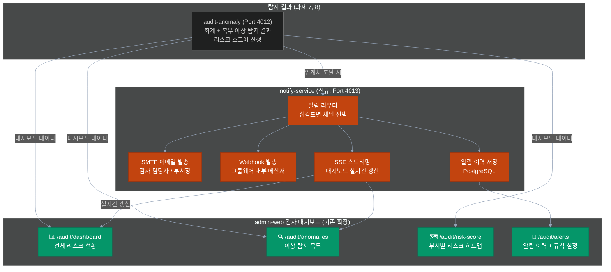
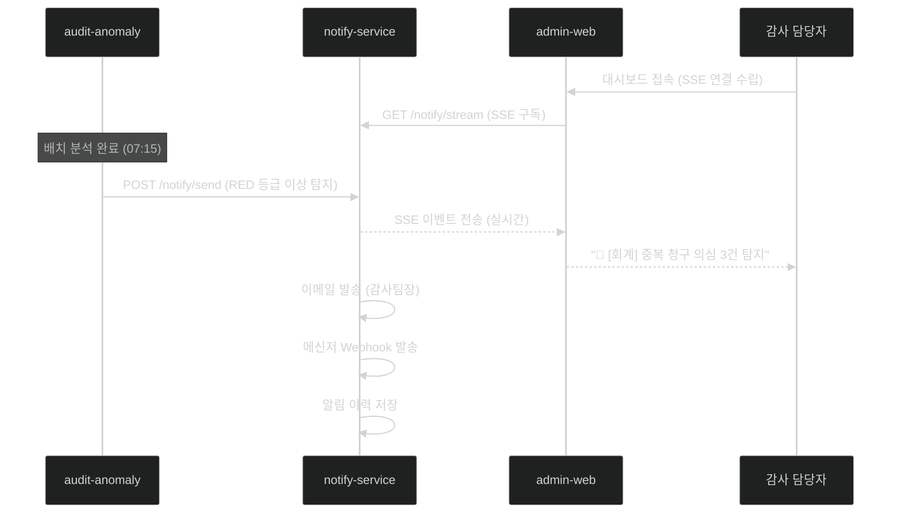

# 과제 9 — 사전 알림 시스템 (감사 리스크 대시보드)

> **분야**: POC 3 — 사전 감사 지능화
> **난이도**: 중
> **구현 기간**: 4.5주 → **3주 (재검토, 4/21)**
> **기존 서비스 활용도**: 60% → **75% (재검토)**

> **🔄 2026-04-21 업데이트 (중요)**: **notify-service 신규 서비스 → admin-api 모듈 통합**
> - **아키텍처 변경**: Port 4013 제거, `admin-api/src/module/notify/` 신규 모듈로 통합
> - **재사용 근거**: `alli-audit` 패키지 (감사/알림 이력 저장), chat-api SSE 패턴, admin-web `(admin)/dashboard` + `(admin)/activities/audits`
> - **신규 페이지 축소**: 4개 → **2개** (`/audit/risk-score`, `/audit/alerts`)
> - **결정 포인트 9개**: [→ 15-per-challenge-decision-points.md#과제-9](15-per-challenge-decision-points.md#-과제-9--사전-알림--감사-리스크-대시보드)
> - **고객 최중요 결정**: D9-07 메신저 Webhook, D9-08 SMTP 서버 제공

---

## 목차

- [1. 과제 개요](#1-과제-개요)
- [2. 구현 아키텍처](#2-구현-아키텍처)
- [3. 서비스 재사용 분석](#3-서비스-재사용-분석)
- [4. 구현 로드맵 및 Task](#4-구현-로드맵-및-task)
- [5. 위험 요소](#5-위험-요소)
- [6. 성공 기준](#6-성공-기준)
- [7. 참조 링크](#7-참조-링크)

---

## 1. 과제 개요

audit-anomaly가 탐지한 회계·복무 이상 징후를 통합 시각화하는 감사 리스크 대시보드와, 임계치 도달 시 이메일·내부 메신저·SSE 실시간 알림을 자동 발송하는 사전 알림 시스템

| 항목 | 내용 |
|------|------|
| **핵심 가치** | 이상 징후 실시간 가시화, 감사 담당자 즉각 대응 지원 |
| **대상 사용자** | 감사 담당자, 감사 관리자, 부서장 |
| **주요 기능** | 부서별 리스크 히트맵, 이상 탐지 목록, 자동 알림 (이메일/메신저/SSE), 알림 이력 관리 |

---

## 2. 구현 아키텍처

### 2.1 알림 시스템 파이프라인

```
audit-anomaly (과제 7, 8)
  이상 탐지 결과 + 리스크 스코어 산정
    │
    ├── 임계치 미도달 (YELLOW/GREEN)
    │    └── 대시보드 데이터만 갱신 (배치 주기)
    │
    └── 임계치 도달 (RED/ORANGE)
         │
         ▼
    notify-service (신규, Port 4013)
         │
         ├── 이메일 알림 (SMTP)
         │    └── 감사 담당자, 부서장 수신
         │
         ├── 내부 메신저 알림 (Webhook)
         │    └── 그룹웨어 알림 발송
         │
         └── SSE 실시간 알림
              └── admin-web 대시보드 실시간 갱신

admin-web 감사 대시보드
  ├── /audit/dashboard   — 전체 리스크 현황 (등급 분포, 금월 탐지 건수)
  ├── /audit/anomalies   — 이상 탐지 목록 (필터/정렬/상세)
  ├── /audit/risk-score  — 부서별 리스크 히트맵
  └── /audit/alerts      — 알림 이력 및 알림 규칙 설정
```

### 2.2 시스템 아키텍처 다이어그램



### 2.3 리스크 등급 및 알림 정책

```python
# 리스크 등급 정의
RISK_GRADES = {
    "RED": {
        "threshold": 0.15,      # 리스크 스코어 ≥ 0.15
        "label": "즉시 감사 권고",
        "alert_channels": ["email", "messenger", "sse"],
        "priority": "P0"        # 즉시 발송
    },
    "ORANGE": {
        "threshold": 0.08,      # 0.08 ≤ 스코어 < 0.15
        "label": "주의 모니터링",
        "alert_channels": ["email", "sse"],
        "priority": "P1"        # 당일 발송
    },
    "YELLOW": {
        "threshold": 0.03,      # 0.03 ≤ 스코어 < 0.08
        "label": "관찰",
        "alert_channels": ["sse"],
        "priority": "P2"        # 주간 요약에 포함
    },
    "GREEN": {
        "threshold": 0.0,       # 스코어 < 0.03
        "label": "정상",
        "alert_channels": [],
        "priority": None
    }
}

# 리스크 점수 계산
# score = (HIGH건수 × 10 + MEDIUM건수 × 5 + LOW건수 × 2) / 전체 결재 건수
```

### 2.4 notify-service API 명세

```
POST /notify/send
  Body: {
    recipients: [{ email, messenger_id }],
    severity: "HIGH" | "MEDIUM" | "LOW",
    anomaly_type: "duplicate_claim" | "split_payment" | "travel_mismatch" | ...,
    emp_cd: "사원 코드",
    dept_cd: "부서 코드",
    description: "AI 생성 이상 내용 설명",
    rule_reference: "관련 규정 조항 (ai-rag 검색 결과)"
  }
  Response: { sent_count, channels_used, notify_id }

GET /notify/history
  Query: { dept_cd?, date_from?, date_to?, severity? }
  Response: { total, items: [{ notify_id, sent_at, channels, recipients, ... }] }

POST /notify/rules
  Body: { dept_cd, threshold_red, threshold_orange, recipients }
  (부서별 알림 규칙 설정)

GET /notify/rules/{dept_cd}
  Response: { 현재 알림 규칙 설정 }
```

### 2.5 admin-web 감사 대시보드 페이지 설계

```tsx
// /audit/dashboard — 전체 리스크 현황
interface DashboardStats {
  totalAnomalies: number;        // 금월 이상 탐지 건수
  gradeCounts: {                 // 등급별 건수
    red: number;
    orange: number;
    yellow: number;
    green: number;
  };
  recentAnomalies: AnomalyItem[]; // 최근 5건
  trendData: MonthlyTrend[];      // 최근 6개월 추이
}

// /audit/risk-score — 부서별 히트맵
// 가로: 시간(주/월), 세로: 부서, 색상: 리스크 등급
// 클릭 시 해당 부서 이상 탐지 목록으로 이동

// /audit/anomalies — 이상 탐지 목록
// 필터: 탐지 유형 (회계/복무), 심각도, 기간, 부서
// 정렬: 탐지일, 심각도, 금액
// 상세: 탐지 내용 + AI 설명 + 관련 규정 + 처리 상태

// /audit/alerts — 알림 이력 + 규칙 설정
// 이력: 발송일, 수신자, 채널, 이상 내용
// 설정: 부서별 임계값, 수신자 목록, 채널 on/off
```

### 2.6 SSE 실시간 알림 흐름



---

## 3. 서비스 재사용 분석

### 재사용 가능 기존 서비스

| 서비스 | 포트 | 재사용 내용 | 추가 개발 |
|--------|:---:|------------|---------|
| **admin-web** | 3001 | 기존 관리자 UI 프레임워크 재사용 | 감사 대시보드 4개 페이지 신규 추가 |
| **admin-api** | 4000 | 기존 API 서버 재사용 | 감사 조회 + 알림 규칙 API 추가 |
| **audit-anomaly** | 4012 | 이상 탐지 결과 + 리스크 스코어 제공 | 없음 (과제 7, 8에서 구현) |

### 신규 개발 필요 서비스

| 서비스 | 포트 | 개발 내용 | 공수 |
|--------|:---:|----------|------|
| **notify-service** | 4013 | 알림 발송 + 이력 관리 전체 | 1주 |

### notify-service 기술 스택

```
언어/프레임워크: NestJS + TypeScript
알림 채널:
  - SMTP: nodemailer (이메일 발송)
  - Webhook: HTTP POST (그룹웨어 내부 메신저)
  - SSE: NestJS SSE module (실시간 대시보드)
DB: PostgreSQL (알림 이력 저장)
```

### admin-web 추가 개발

```
신규 4개 페이지:
  1. /audit/dashboard  — 전체 리스크 현황 (카드 + 차트)
  2. /audit/anomalies  — 이상 탐지 목록 + 상세 (DataTable + 필터)
  3. /audit/risk-score — 부서별 히트맵 (Recharts 또는 Chart.js)
  4. /audit/alerts     — 알림 이력 + 규칙 설정 (DataTable + Form)

신규 admin-api 엔드포인트:
  GET /audit/stats      — 대시보드 통계
  GET /audit/anomalies  — 이상 탐지 목록
  GET /audit/risk       — 부서별 리스크 스코어
  POST /audit/notify-rules — 알림 규칙 설정
```

---

## 4. 구현 로드맵 및 Task

### 4.1 선행 조건

> **중요**: 과제 7(회계 감사) + 과제 8(복무 모니터링) audit-anomaly 구현 완료 후 진행  
> notify-service는 audit-anomaly의 이상 탐지 결과 API가 확정되어야 개발 가능

### 4.2 단계별 일정 (4.5주)

```
Week 1 — notify-service 개발
  ├── [ ] notify-service NestJS 프로젝트 초기화
  ├── [ ] SMTP 이메일 발송 구현 (nodemailer)
  ├── [ ] Webhook 메신저 발송 구현
  ├── [ ] SSE 실시간 스트리밍 구현
  ├── [ ] 알림 이력 저장 DB 설계 및 구현
  └── [ ] audit-anomaly → notify-service 연동 테스트

Week 2 — admin-web 대시보드 개발
  ├── [ ] /audit/dashboard 페이지 구현 (통계 카드 + 추이 차트)
  ├── [ ] /audit/anomalies 페이지 구현 (DataTable + 필터)
  ├── [ ] /audit/risk-score 히트맵 구현 (부서별 리스크)
  ├── [ ] /audit/alerts 알림 이력 + 규칙 설정 페이지
  ├── [ ] admin-api 감사 API 엔드포인트 추가
  └── [ ] SSE 실시간 알림 수신 + 토스트 알림 연동
```

### 4.3 Task 목록

| ID | Task | 담당 | 우선순위 | 기간 |
|----|------|------|:-------:|:----:|
| T9-01 | notify-service NestJS 초기화 + PostgreSQL 스키마 | D2 | P0 | 1d |
| T9-02 | SMTP 이메일 발송 구현 (nodemailer + 템플릿) | D2 | P0 | 2d |
| T9-03 | SSE 실시간 알림 스트리밍 구현 | D2 | P0 | 3d |
| T9-04 | 알림 이력 저장 + 조회 API 구현 | D2 | P0 | 1d |
| T9-05 | audit-anomaly ↔ notify-service 연동 (단위 테스트 포함) | D1+D2 | P0 | 2d |
| T9-06 | Webhook 메신저 알림 구현 (그룹웨어 연동) | D2 | P1 | 2d |
| T9-07 | admin-web /audit/dashboard 페이지 (카드 + 추이 차트) | D2 | P1 | 3d |
| T9-08 | admin-web /audit/anomalies 페이지 (DataTable + 필터) | D2 | P1 | 3d |
| T9-09 | admin-web /audit/risk-score 부서별 히트맵 | D2 | P1 | 3d |
| T9-10 | admin-web /audit/alerts 이력 + 규칙 설정 페이지 | D2 | P1 | 2d |
| T9-11 | admin-api 감사 조회 + 알림 규칙 API 추가 (4종) | D2 | P1 | 2d |
| T9-12 | 알림 규칙 설정 UI (부서별 임계값 + 수신자 관리) | D2 | P2 | 2d |
| T9-13 | 전체 통합 E2E 검증 (탐지→알림→대시보드) + 안정화 | D1+D2 | P2 | 3d |
| **합계** | | | | **29 man-day** |
| **달력 기간** | D2 22d 기준, D1 2d 병행 | | | **22d (4.5주)** |

---

## 5. 위험 요소

| # | 위험 요소 | 가능성 | 영향도 | 대응 방안 |
|---|---------|:-----:|:-----:|---------|
| R1 | **그룹웨어 메신저 Webhook API 미제공** | 중간 | 중간 | 이메일 발송으로 대체, 메신저는 POC 이후 추가 연동 |
| R2 | **SMTP 서버 접근 권한 미확보** | 중간 | 높음 | POC용 테스트 SMTP 계정 사전 확보 또는 콘솔 출력으로 대체 |
| R3 | **audit-anomaly 개발 지연 시 연동 불가** | 중간 | 높음 | audit-anomaly API 스키마를 사전 설계하여 Mock 서버로 병행 개발 |
| R4 | **SSE 연결 불안정 (방화벽/프록시)** | 중간 | 중간 | SSE 대신 polling 방식 대체 구현 준비 |
| R5 | **대시보드 성능 — 대량 이상 건 조회 시 지연** | 낮음 | 중간 | 페이지네이션 + 인덱스 최적화, 결과 캐싱 (Redis) |
| R6 | **알림 과다 발송 (스팸)** | 중간 | 높음 | 알림 디바운싱 (동일 건 재알림 억제), 부서별 알림 규칙 설정 필수 |

---

## 6. 성공 기준

| 지표 | 목표값 |
|------|:------:|
| 이상 탐지 → 알림 발송 지연 시간 | ≤ 5분 (RED 등급 즉시 발송) |
| 알림 발송 성공률 | ≥ 99% |
| 대시보드 데이터 갱신 주기 | ≤ 24시간 (배치 주기) |
| 대시보드 페이지 로드 시간 | ≤ 3초 |
| 사용자 만족도 (감사 담당자) | ≥ 4/5점 |

---

## 7. 참조 링크

| 문서 | 경로 |
|------|------|
| POC 3 사전 감사 지능화 상세 설계 | [../03-audit-intelligence.md](../03-audit-intelligence.md) |
| POC 전체 아키텍처 | [../00-overall-architecture.md](../00-overall-architecture.md) |
| notify-service 설계 | [../design/notify-service.md](../design/notify-service.md) |
| admin-web 개선사항 | [../improvements/admin-web.md](../improvements/admin-web.md) |
| 과제 7 (지능형 회계 감사) | [07-accounting-audit.md](07-accounting-audit.md) |
| 과제 8 (복무 관리 모니터링) | [08-attendance-monitoring.md](08-attendance-monitoring.md) |
