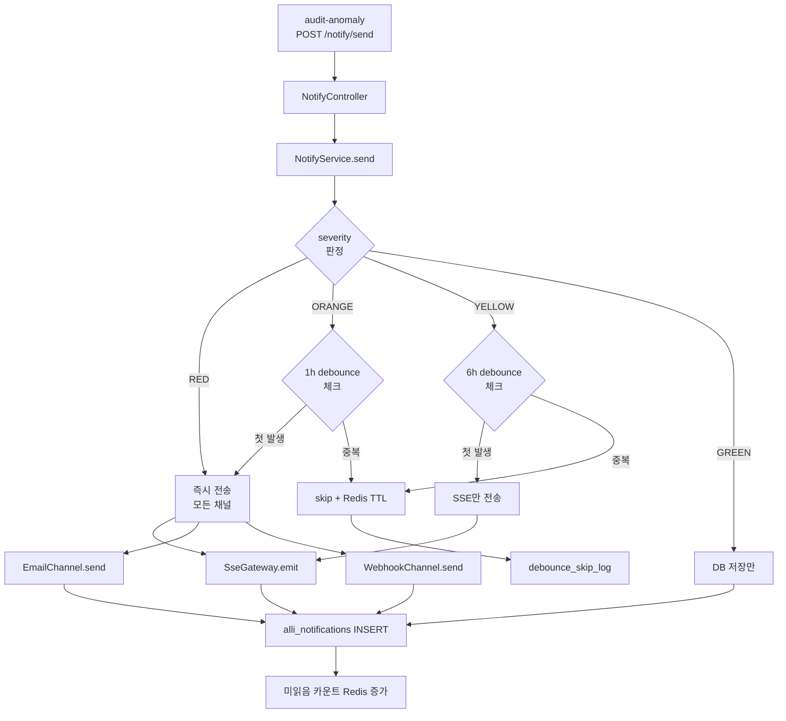

# 과제 9 알림·대시보드 — 구현 아키텍처

> **연관**: [test-scenarios.md](test-scenarios.md) | [notify-module-spec.md](notify-module-spec.md) | [dashboard-pages.md](dashboard-pages.md)
> **통합 결정**: notify-service(4013) 폐기 → admin-api 내부 모듈로 통합

---

## 1. 컴포넌트 계층

```
Receiver: admin-api notify 모듈 (신규, 기존 admin-api 내부)
Channels:
  - SSE Gateway (@nestjs/event-emitter + Observable)
  - Email (nodemailer + SMTP)
  - Webhook (KakaoWork / Slack / Teams)
Storage: PostgreSQL alli_notifications 테이블
Cache:   Redis (디바운싱, 미읽음 카운트)
Frontend: admin-web
  - /admin/audit-dashboard (통계 대시보드)
  - /admin/alerts (알림 목록)
  - NotificationCenter 컴포넌트 (Bell 아이콘)
```

## 2. NotifyModule 구성

```typescript
// apps/admin-api/src/module/notify/notify.module.ts

@Module({
  imports: [
    TypeOrmModule.forFeature([AlliNotification, NotifyRule]),
    RedisModule,
  ],
  controllers: [NotifyController],
  providers: [
    NotifyService,
    SseGateway,
    EmailChannel,
    WebhookChannel,
    SseChannel,
    // Webhook formatters
    KakaoWorkFormatter,
    SlackFormatter,
    TeamsFormatter,
  ],
  exports: [NotifyService],
})
export class NotifyModule {}
```

## 3. 알림 라이프사이클



## 4. SSE 게이트웨이

```typescript
// apps/admin-api/src/module/notify/sse-gateway.ts

@Injectable()
export class SseGateway {
  private subscribers = new Map<string, Subject<MessageEvent>>();

  subscribe(userId: string): Observable<MessageEvent> {
    if (!this.subscribers.has(userId)) {
      this.subscribers.set(userId, new Subject<MessageEvent>());
    }
    return this.subscribers.get(userId)!.asObservable();
  }

  emit(userId: string, event: MessageEvent) {
    const subject = this.subscribers.get(userId);
    if (subject) {
      subject.next(event);
    }
  }

  emitToDept(deptCd: string, event: MessageEvent) {
    // 해당 부서 사용자 전체
    const deptUsers = this.getDeptUsers(deptCd);
    deptUsers.forEach(uid => this.emit(uid, event));
  }

  emitToTenant(tenantId: string, event: MessageEvent) {
    // 테넌트 단위 브로드캐스트 (관리자)
    const admins = this.getTenantAdmins(tenantId);
    admins.forEach(uid => this.emit(uid, event));
  }

  disconnect(userId: string) {
    const subject = this.subscribers.get(userId);
    if (subject) {
      subject.complete();
      this.subscribers.delete(userId);
    }
  }
}

// Controller SSE 엔드포인트
@Sse('stream')
async streamNotifications(@Req() req): Promise<Observable<MessageEvent>> {
  const userId = req.user.empCd;
  return this.sseGateway.subscribe(userId);
}
```

## 5. 디바운싱 로직

```typescript
async send(dto: SendNotificationDto) {
  // 1. Debounce check
  const debounceKey = `notify:debounce:${dto.tenantId}:${dto.payload?.ruleCode}:${dto.payload?.empCd}`;

  if (dto.severity !== 'RED') {  // RED는 항상 전송
    const existed = await this.redis.get(debounceKey);
    if (existed) {
      await this.logDebounceSkip(dto);
      return { status: 'debounced' };
    }

    const ttl = {
      ORANGE: 3600,    // 1시간
      YELLOW: 21600,   // 6시간
    }[dto.severity];
    await this.redis.setex(debounceKey, ttl, '1');
  }

  // 2. Save to DB
  const notification = await this.notifRepo.save({
    ...dto,
    sentAt: new Date(),
    status: 'PENDING',
  });

  // 3. Dispatch channels
  await this.dispatchChannels(notification, dto.targets);

  // 4. Update status
  notification.status = 'SENT';
  await this.notifRepo.save(notification);

  // 5. Update unread count
  await this.redis.incr(`notify:unread:${dto.tenantId}`);

  return { status: 'sent', notificationId: notification.id };
}
```

## 6. 채널별 포맷터

### KakaoWork (기본 Webhook)

```typescript
class KakaoWorkFormatter {
  format(notif: AlliNotification): KakaoWorkPayload {
    return {
      text: `[${notif.severity}] ${notif.title}`,
      blocks: [
        { type: "header", text: notif.title },
        {
          type: "text",
          text: notif.body,
          markdown: true
        },
        {
          type: "button",
          text: "상세 보기",
          action_type: "open_system_browser",
          value: `${this.baseUrl}/admin/alerts/${notif.id}`
        }
      ]
    };
  }
}
```

### Slack

```typescript
class SlackFormatter {
  format(notif: AlliNotification): SlackPayload {
    const colorMap = {
      RED: "#f04438",
      ORANGE: "#f79009",
      YELLOW: "#fbbf24",
      GREEN: "#12b76a",
    };

    return {
      attachments: [{
        color: colorMap[notif.severity],
        title: notif.title,
        text: notif.body,
        fields: [
          { title: "심각도", value: notif.severity, short: true },
          { title: "부서", value: notif.payload?.deptCode || "-", short: true },
        ],
        actions: [{
          type: "button",
          text: "상세 보기",
          url: `${this.baseUrl}/admin/alerts/${notif.id}`
        }]
      }]
    };
  }
}
```

## 7. 대시보드 페이지

### /admin/audit-dashboard

```tsx
// apps/admin-web/src/app/admin/audit-dashboard/page.tsx

export default async function AuditDashboardPage() {
  return (
    <div className="flex h-full flex-col">
      <PageBreadcrumb pageTitle="감사 대시보드" />
      <div className="grid grid-cols-4 gap-4">
        <KpiCard title="오늘 RED" value={kpi.redToday} />
        <KpiCard title="오늘 ORANGE" value={kpi.orangeToday} />
        <KpiCard title="처리 대기" value={kpi.pending} />
        <KpiCard title="오탐율 (7일)" value={`${kpi.falsePositiveRate}%`} />
      </div>
      <div className="grid grid-cols-2 gap-4">
        <Chart type="line" title="일별 이상 추이" data={trendData} />
        <Chart type="pie" title="규칙별 분포" data={ruleDistribution} />
      </div>
      <DataTable table={recentAnomaliesTable} columns={anomalyColumns} showRowNumber />
    </div>
  );
}
```

### NotificationCenter 컴포넌트

```tsx
// apps/admin-web/src/component/common/notification-center.tsx

export function NotificationCenter() {
  const { data: unreadCount } = useQuery({
    queryKey: ["notify", "unread-count"],
    queryFn: fetchUnreadCount,
  });

  const [notifications, setNotifications] = useState<Notification[]>([]);

  // SSE 연결
  useEffect(() => {
    const eventSource = new EventSource("/api/notify/stream");
    eventSource.onmessage = (e) => {
      const notif = JSON.parse(e.data);
      setNotifications(prev => [notif, ...prev]);
      queryClient.invalidateQueries(["notify", "unread-count"]);
    };
    return () => eventSource.close();
  }, []);

  return (
    <DropdownMenu>
      <DropdownMenuTrigger>
        <Button variant="ghost" className="relative size-8 p-0">
          <Bell className="h-5 w-5" aria-hidden="true" />
          {unreadCount > 0 && (
            <span className="absolute -top-1 -right-1 bg-error-500 text-white text-xs rounded-full h-4 w-4 flex items-center justify-center">
              {unreadCount > 99 ? "99+" : unreadCount}
            </span>
          )}
          <span className="sr-only">알림 {unreadCount}건 미읽음</span>
        </Button>
      </DropdownMenuTrigger>
      <DropdownMenuContent className="w-80 max-h-96 overflow-auto">
        {notifications.map(n => <NotificationItem key={n.id} notif={n} />)}
      </DropdownMenuContent>
    </DropdownMenu>
  );
}
```

## 8. 장애 처리 (채널 실패 시)

```typescript
async dispatchChannels(notif, targets) {
  const results = await Promise.allSettled([
    targets.sse && this.sseChannel.send(notif),
    targets.email?.length && this.emailChannel.send(notif, targets.email),
    targets.webhook?.length && this.webhookChannel.send(notif, targets.webhook),
  ].filter(Boolean));

  // 실패 채널 기록 + 재시도 큐 등록
  results.forEach((r, idx) => {
    if (r.status === "rejected") {
      const channelName = ["sse", "email", "webhook"][idx];
      this.logger.error(`Channel ${channelName} failed`, r.reason);

      // 재시도 가능 채널만 (이메일/Webhook)
      if (channelName !== "sse") {
        this.retryQueue.add(notif, channelName, { attempts: 3, backoff: 60 });
      }
    }
  });

  // 최소 1개 채널 성공이면 SENT
  const hasSuccess = results.some(r => r.status === "fulfilled");
  return { hasSuccess, results };
}
```

## 9. 성능 SLO

| SLI | SLO |
|-----|:---:|
| SSE 알림 전달 시간 (WebSocket 대비) | ≤ 1초 |
| Email 발송 시간 (SMTP) | ≤ 30초 |
| Webhook 외부 호출 | ≤ 10초 + retry 3 |
| 동시 SSE 연결 수 | 1,000 |
| 디바운스 Redis 조회 | ≤ 10ms |
| 대시보드 첫 로드 | ≤ 2초 |
| 실시간 알림 빈도 (부서당) | ≤ 10건/시간 (ORANGE 기준) |
