```mermaid
sequenceDiagram
    participant AA as audit-anomaly
    participant AD as admin-api<br/>NotifyController
    participant NS as NotifyService
    participant RD as Redis
    participant DB as PostgreSQL
    participant SSE as SseGateway
    participant EM as EmailChannel
    participant WH as WebhookChannel
    participant UI as admin-web

    AA->>AD: POST /notify/send (RED)
    AD->>NS: send(dto)

    rect rgb(30, 60, 100)
        Note over NS,RD: Step 1: Debounce 체크 (RED 스킵)
        NS->>NS: severity===RED → 디바운스 무시
    end

    rect rgb(30, 90, 60)
        Note over NS,DB: Step 2: DB INSERT
        NS->>DB: INSERT alli_notifications status=PENDING
        DB-->>NS: id=N001
    end

    rect rgb(60, 30, 100)
        Note over NS: Step 3: 채널 병렬 디스패치
        par SSE
            NS->>SSE: emit(empCd, {N001})
            SSE->>UI: EventSource push
            UI-->>UI: NotificationCenter 뱃지 +1
        and Email
            NS->>EM: send(N001, recipients[])
            EM->>EM: SMTP nodemailer
            EM-->>NS: success=true
        and Webhook KakaoWork
            NS->>WH: send('kakaowork', N001)
            WH->>WH: KakaoWorkFormatter.format
            WH->>WH: POST ${KAKAO_WEBHOOK_URL}
            WH-->>NS: 200 OK
        and Webhook Slack
            NS->>WH: send('slack', N001)
            WH->>WH: SlackFormatter.format
            WH->>WH: POST ${SLACK_WEBHOOK_URL}
            WH-->>NS: 200 OK
        end
    end

    rect rgb(100, 30, 60)
        Note over NS,DB: Step 4: 상태 업데이트
        NS->>DB: UPDATE status=SENT sent_at=NOW
    end

    rect rgb(100, 100, 30)
        Note over NS,RD: Step 5: 미읽음 카운트
        NS->>RD: INCR notify:unread:{tenantId}
        RD-->>NS: 새 카운트
    end

    NS-->>AD: {status:'sent', notificationId:'N001'}
    AD-->>AA: 201 Created
```

# 과제 9 알림·대시보드 — 테스트 시나리오

---

## 📋 시나리오

| # | 시나리오 | 유형 | 기대 |
|:-:|---------|:---:|------|
| S1 | RED 알림 전체 채널 전송 | E2E | SSE+Email+Webhook |
| S2 | ORANGE 디바운싱 | 기능 | 1시간 내 중복 억제 |
| S3 | SSE 실시간 구독 | 성능 | 1초 이내 전달 |
| S4 | Email 채널 실패 → 재시도 | 장애 | 3회 재시도 후 성공 |
| S5 | Webhook 포맷터 (3종) | 기능 | KakaoWork/Slack/Teams |
| S6 | 대시보드 실시간 KPI | UI | SSE로 실시간 업데이트 |
| S7 | 미읽음 카운트 | 기능 | Redis INCR/DECR |
| S8 | 동시 1,000 SSE 연결 | 성능 | 메모리/CPU 안정 |
| S9 | 알림 규칙 동적 변경 | 기능 | 부서별 임계값 즉시 반영 |

---

## S1 — RED 알림 전체 채널 전송

### 설정
```
audit-anomaly 호출: severity=RED, category=audit_anomaly
targets: {sse: true, email: [..], webhook: ['kakaowork', 'slack']}
기대: 4 채널 모두 전송, DB 저장, 이력 기록
```

### 아키텍처 동작



### 검증

```python
async def test_s1_red_all_channels():
    response = await admin_api_client.post("/api/notify/send", json={
        "tenantId": "tenant-001",
        "category": "audit_anomaly",
        "severity": "RED",
        "title": "회계 이상 감지",
        "body": "EMP20240315이 중복 청구 건을 생성했습니다",
        "payload": {"anomalyId": "ANOM001", "empCd": "EMP20240315"},
        "targets": {
            "sse": True,
            "email": ["admin@cnf.ai"],
            "webhook": ["kakaowork", "slack"]
        }
    })

    assert response.status_code == 201
    notif_id = response.json()["notificationId"]

    # DB 확인
    saved = await db.get_notification(notif_id)
    assert saved["severity"] == "RED"
    assert saved["status"] == "SENT"

    # 미읽음 카운트 증가
    unread = await redis.get(f"notify:unread:tenant-001")
    assert int(unread) >= 1

    # 4개 채널 모두 성공
    channel_logs = await db.get_channel_logs(notif_id)
    assert len(channel_logs) == 4
    assert all(log["status"] == "success" for log in channel_logs)
```

---

## S2 — ORANGE 디바운싱

### 설정
```
1차: ORANGE 발송 → 정상 전송
2차 (10분 후): 동일 (ruleCode, empCd) → 디바운스됨
3차 (70분 후, TTL 초과): 정상 전송
```

### 아키텍처 동작

```typescript
// 1차
debounceKey = "notify:debounce:tenant-001:RULE_A:EMP20240315"
redis.get(debounceKey) → null
// 전송 + redis.setex(key, 3600, "1")

// 2차 (10분 후)
redis.get(debounceKey) → "1"  (TTL 남음)
return { status: "debounced" }
await logDebounceSkip(dto);

// 3차 (70분 후)
redis.get(debounceKey) → null  (TTL 만료)
// 전송
```

### 검증

```python
async def test_s2_orange_debouncing():
    # 1차 발송
    r1 = await send_notification(severity="ORANGE", rule_code="RULE_A", emp_cd="EMP001")
    assert r1["status"] == "sent"

    # 2차 (10분 후 모의)
    r2 = await send_notification(severity="ORANGE", rule_code="RULE_A", emp_cd="EMP001")
    assert r2["status"] == "debounced"

    skip_logs = await db.get_debounce_skip_logs(emp_cd="EMP001")
    assert len(skip_logs) == 1

    # 3차 (Redis TTL 강제 삭제 후)
    await redis.delete("notify:debounce:tenant-001:RULE_A:EMP001")
    r3 = await send_notification(severity="ORANGE", rule_code="RULE_A", emp_cd="EMP001")
    assert r3["status"] == "sent"
```

---

## S3 — SSE 실시간 구독

### 설정
```
admin-web 접속 시 EventSource("/api/notify/stream") 구독
서버에서 N001 알림 emit → 클라이언트 1초 이내 수신
```

### 아키텍처 동작

```tsx
// admin-web
const eventSource = new EventSource("/api/notify/stream", {
  withCredentials: true
});
eventSource.addEventListener("message", (e) => {
  const notif = JSON.parse(e.data);
  setNotifications(prev => [notif, ...prev]);
});

// admin-api NotifyController
@Sse('stream')
async stream(@Req() req) {
  return this.sseGateway.subscribe(req.user.empCd);
}

// audit-anomaly에서 /notify/send 호출 시
this.sseGateway.emit(notif.empCd, {
  data: JSON.stringify(notif),
  type: 'notification'
});
```

### 검증

```python
async def test_s3_sse_realtime():
    # Given: SSE 연결
    async with httpx.AsyncClient() as client:
        async with client.stream(
            "GET",
            "http://localhost:3001/api/notify/stream",
            headers={"Cookie": cookie_jwt}
        ) as stream:
            # 다른 태스크로 전송
            asyncio.create_task(
                send_notification(severity="RED", to_emp="EMP20240315")
            )

            # 1초 이내 수신
            start = time.time()
            async for line in stream.aiter_lines():
                if line.startswith("data: "):
                    notif = json.loads(line[6:])
                    elapsed = time.time() - start
                    assert elapsed < 1.0
                    assert notif["severity"] == "RED"
                    break
```

---

## S4 — Email 실패 재시도

### 설정
```
SMTP 서버 일시 다운 (3회 실패 후 복구)
기대: 3회 재시도 후 성공, final status=SENT
```

### 아키텍처 동작

```typescript
// EmailChannel + retry queue (BullMQ 또는 내장 setTimeout)
async send(notif, recipients) {
  try {
    await this.smtp.send({
      to: recipients,
      subject: `[${notif.severity}] ${notif.title}`,
      html: this.renderTemplate(notif)
    });
    return { status: 'success' };
  } catch (e) {
    throw new ChannelFailedError('email', e);
  }
}

// Retry queue worker
await retryQueue.add({ notifId, channel: 'email' }, {
  attempts: 3,
  backoff: { type: 'exponential', delay: 60_000 }  // 60s, 120s, 240s
});
```

### 검증

```python
async def test_s4_email_retry():
    # Given: SMTP 모의 (첫 3회 실패)
    mock_smtp = MockSMTP(fail_count=3)

    await send_notification(severity="RED", email=["test@cnf.ai"])

    # Then: 4번째 시도에서 성공
    await asyncio.sleep(350)  # 60+120+240 대기

    channel_log = await db.get_channel_log(channel="email")
    assert channel_log["attempts"] == 4
    assert channel_log["final_status"] == "success"
    assert mock_smtp.call_count == 4
```

---

## S5 — Webhook 포맷터 3종

### 설정
```
동일 알림 내용을 KakaoWork / Slack / Teams로 각각 포맷 변환
각 포맷터의 Color, Button, Field 스타일 검증
```

### 아키텍처 동작

```python
# 입력
notif = {
    "severity": "RED",
    "title": "회계 이상",
    "body": "중복 청구 의심",
    "payload": {"anomalyId": "ANOM001"}
}

# KakaoWork (Block Kit)
kakao_payload = {
    "text": "[RED] 회계 이상",
    "blocks": [
        {"type": "header", "text": "회계 이상"},
        {"type": "text", "text": "중복 청구 의심"},
        {"type": "button", "text": "상세", "action_type": "open_system_browser", "value": "...ANOM001"}
    ]
}

# Slack (Attachment)
slack_payload = {
    "attachments": [{
        "color": "#f04438",  # RED
        "title": "회계 이상",
        "text": "중복 청구 의심",
        "fields": [...]
    }]
}

# Teams (Adaptive Card)
teams_payload = {
    "type": "message",
    "attachments": [{
        "contentType": "application/vnd.microsoft.card.adaptive",
        "content": {
            "type": "AdaptiveCard",
            "body": [...]
        }
    }]
}
```

### 검증

```python
@pytest.mark.parametrize("channel", ["kakaowork", "slack", "teams"])
async def test_s5_webhook_formatters(channel):
    captured = []

    with mock.patch(f"app.channels.webhook.post", side_effect=capture):
        await send_notification(
            severity="RED",
            title="회계 이상",
            webhook=[channel]
        )

    payload = captured[0]
    if channel == "kakaowork":
        assert "blocks" in payload
        assert payload["blocks"][0]["type"] == "header"
    elif channel == "slack":
        assert "attachments" in payload
        assert payload["attachments"][0]["color"] == "#f04438"
    elif channel == "teams":
        assert payload["type"] == "message"
        assert payload["attachments"][0]["content"]["type"] == "AdaptiveCard"
```

---

## S6 — 대시보드 실시간 KPI

### 설정
```
/admin/audit-dashboard 접속 → KPI 카드 렌더링
새 RED 발생 → SSE로 푸시 → 카드 자동 업데이트
```

### 아키텍처 동작

```tsx
// admin-web
const { data: kpi } = useQuery({
  queryKey: ["audit-kpi"],
  queryFn: fetchKpi,
  refetchInterval: 30000  // 30초 폴링
});

// SSE 이벤트로 즉시 갱신
useEffect(() => {
  const es = new EventSource("/api/notify/stream");
  es.addEventListener("kpi-update", (e) => {
    queryClient.invalidateQueries(["audit-kpi"]);
  });
  return () => es.close();
}, []);

// admin-api에서 RED 발생 시
this.sseGateway.emitToTenant(tenantId, {
  type: "kpi-update",
  data: { category: "audit", action: "increment" }
});
```

### 검증

```python
async def test_s6_dashboard_realtime_kpi():
    # Playwright E2E
    await page.goto("http://localhost:8080/admin/audit-dashboard")
    red_count_before = await page.text_content('[data-testid="kpi-red-today"]')

    # 새 RED 발생 (다른 세션)
    await send_notification(severity="RED", tenantId="tenant-001")

    # 2초 내 업데이트 확인
    await page.wait_for_function(
        f"document.querySelector('[data-testid=kpi-red-today]').textContent !== '{red_count_before}'",
        timeout=2000
    )
    red_count_after = await page.text_content('[data-testid="kpi-red-today"]')
    assert int(red_count_after) == int(red_count_before) + 1
```

---

## S7 — 미읽음 카운트

### 설정
```
사용자 UNREAD: 5건
1건 읽음 처리 → 4건
전체 읽음 → 0건
```

### 아키텍처 동작

```typescript
// 단건 읽음
@Patch(':id/read')
async markRead(@Param('id') id, @Req() req) {
  await this.notifRepo.update(id, { readAt: new Date() });
  await this.redis.decr(`notify:unread:${req.user.tenantId}`);
  return { status: 'ok' };
}

// 전체 읽음
@Post('read-all')
async readAll(@Req() req) {
  await this.notifRepo.update(
    { tenantId: req.user.tenantId, empCd: req.user.empCd, readAt: IsNull() },
    { readAt: new Date() }
  );
  await this.redis.set(`notify:unread:${req.user.tenantId}`, 0);
  return { status: 'ok' };
}
```

### 검증

```python
async def test_s7_unread_count():
    # Given: 5건 미읽음
    for i in range(5):
        await send_notification(target_emp="EMP001")

    count1 = await get_unread_count("EMP001")
    assert count1 == 5

    # 1건 읽음
    first_id = await db.get_first_unread_id("EMP001")
    await admin_api.patch(f"/api/notify/{first_id}/read")
    count2 = await get_unread_count("EMP001")
    assert count2 == 4

    # 전체 읽음
    await admin_api.post("/api/notify/read-all")
    count3 = await get_unread_count("EMP001")
    assert count3 == 0
```

---

## S8 — 동시 1,000 SSE 연결

### 설정
```
부하 테스트: 1,000개 동시 SSE 연결 유지
기대: CPU < 50%, 메모리 < 2GB, 연결 안정
```

### 아키텍처 동작

```
Node.js + NestJS Sse endpoint:
  - Observable 기반 비동기 → 이벤트 루프 부담 최소
  - Keep-Alive ping 30초 간격
  - Redis Pub/Sub 또는 in-memory Subject

벤치마크 도구: k6, artillery.io
```

### 검증

```javascript
// artillery SSE 시나리오
module.exports = {
  config: {
    target: "http://localhost:3001",
    phases: [{ duration: 300, arrivalRate: 10 }]
  },
  scenarios: [{
    name: "sse-connect",
    flow: [
      { get: {
          url: "/api/notify/stream",
          headers: { "Cookie": "JWT={{ jwt }}" },
          sse: { think: 60 }  // 60초 연결 유지
        }
      }
    ]
  }]
};

// 결과 검증
assert connections_active >= 990  # 99% 이상 유지
assert memory_mb < 2048
assert cpu_percent < 50
```

---

## S9 — 알림 규칙 동적 변경

### 설정
```
관리자가 PUT /notify/rules/DEPT001 {threshold: HIGH} 변경
해당 부서의 향후 ORANGE/YELLOW 억제
```

### 아키텍처 동작

```typescript
@Put('rules/:deptCd')
async updateRule(@Param('deptCd') deptCd, @Body() rule) {
  await this.ruleRepo.update({ deptCd }, rule);

  // Redis 캐시 무효화 (send()에서 규칙 조회 시)
  await this.redis.del(`notify:rules:${deptCd}`);
}

// send() 내부
async send(dto) {
  const rule = await this.getRule(dto.payload?.deptCode);
  if (rule?.threshold === 'HIGH' && dto.severity !== 'RED') {
    return { status: 'suppressed_by_rule' };
  }
  // ... 정상 전송
}
```

### 검증

```python
async def test_s9_dynamic_rule_update():
    # Given: DEPT001의 threshold를 HIGH로 변경
    await admin_api.put("/api/notify/rules/DEPT001",
                        json={"threshold": "HIGH"})

    # When: ORANGE 알림 발송
    result = await send_notification(
        severity="ORANGE",
        dept_code="DEPT001"
    )

    # Then: 규칙에 의해 억제됨
    assert result["status"] == "suppressed_by_rule"

    # RED은 전송됨
    result_red = await send_notification(
        severity="RED",
        dept_code="DEPT001"
    )
    assert result_red["status"] == "sent"
```

---

## 📊 커버리지

| 모듈 | S1 | S2 | S3 | S4 | S5 | S6 | S7 | S8 | S9 |
|------|:--:|:--:|:--:|:--:|:--:|:--:|:--:|:--:|:--:|
| NotifyController | ✅ | ✅ | ✅ | ✅ | ✅ | ✅ | ✅ | ✅ | ✅ |
| Debouncer | — | ✅ | — | — | — | — | — | — | ✅ |
| SseGateway | ✅ | — | ✅ | — | — | ✅ | — | ✅ | — |
| EmailChannel | ✅ | — | — | ✅ | — | — | — | — | — |
| WebhookChannel | ✅ | — | — | — | ✅ | — | — | — | — |
| 포맷터 (3종) | — | — | — | — | ✅ | — | — | — | — |
| Redis 캐시 | ✅ | ✅ | — | — | — | — | ✅ | — | ✅ |
| DB 저장 | ✅ | — | — | ✅ | — | — | ✅ | — | — |
| 재시도 | — | — | — | ✅ | — | — | — | — | — |
| 대시보드 UI | — | — | — | — | — | ✅ | ✅ | — | — |
