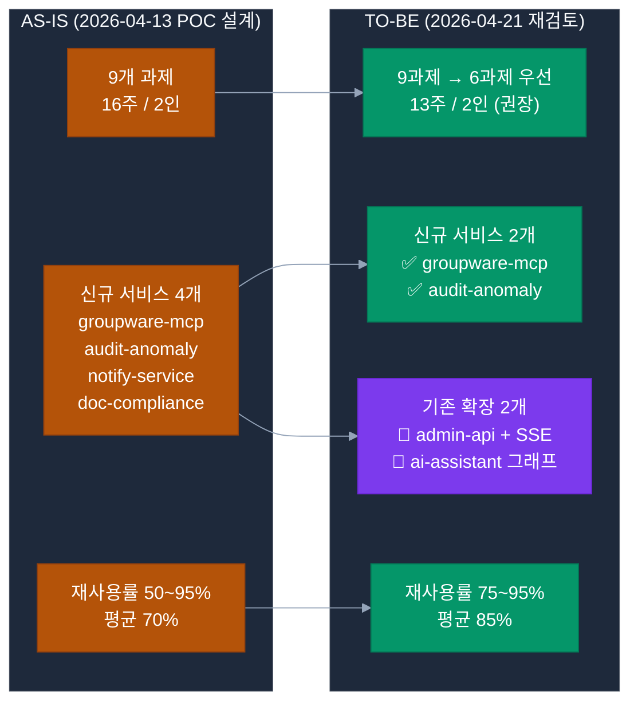
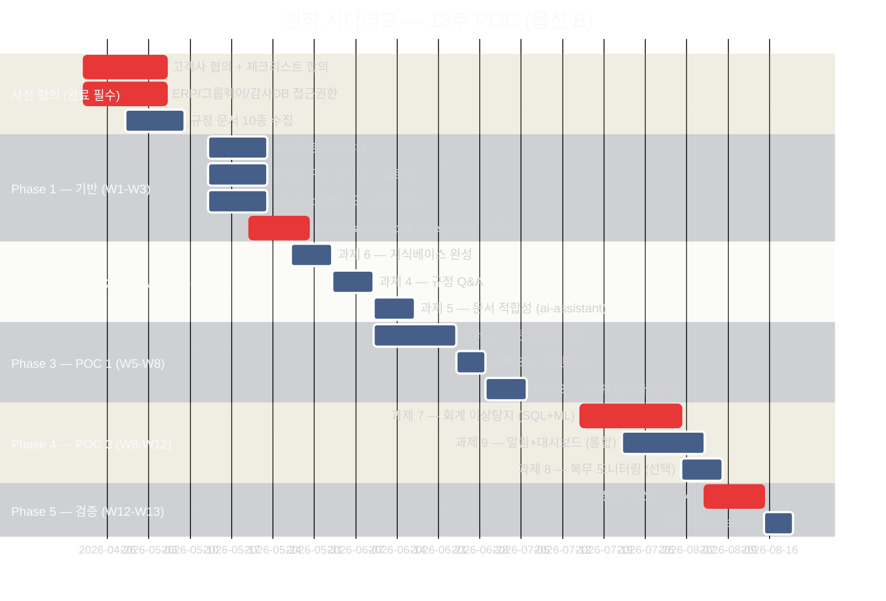

# 📌 POC 개선방안 마스터 — 2026년 4월 기준 재검토

> **작성일**: 2026-04-21 (2026-04-13 POC 설계 → 실제 구현 상태 재검토)
> **목적**: 고객사 최종 협의 전 POC 구현방안의 현실성·최적화·리스크를 종합 검토
> **결론**: 신규 서비스 4→2 축소, 기간 16→13주 단축, 예산 20% 절감 가능

---

## 🎯 Executive Summary (경영진 요약)

### 핵심 3가지 발견 (2026-04-21 재검토)

```
① 기존 시스템 성숙도가 POC 설계 시점(4/13) 대비 크게 증가
   → ai-assistant 17노드 완성, alli-audit 패키지 이미 구현, erp-mcp 심화 구조

② 재사용률 재조정: 평균 70% → 85%+
   → 과제 4·6 Q&A/지식베이스: 95% 재사용 (사실상 데이터 업로드만)
   → 과제 7·9 감사: 50% → 70% (alli-audit 패키지 활용)

③ 신규 서비스 4 → 2개 축소 가능
   ✅ 유지: groupware-mcp, audit-anomaly (탐지 엔진)
   ⚠️ 통합: notify-service → admin-api + alli-audit + SSE 확장
   ⚠️ 통합: doc-compliance → ai-assistant 신규 그래프로 통합
```

### 고객 협의 핵심 결정 사항 (P0)

| # | 결정 사항 | 옵션 | 권장 |
|---|---------|------|------|
| 1 | 구현 범위 | A) 9과제 전체 / B) 6과제 단계(13주) / C) 3과제 빠른 증빙(8주) | **옵션 B** |
| 2 | 신규 서비스 수 | A) 4개 유지 / B) 2개 축소 + 기존 확장 | **옵션 B** |
| 3 | 인력 규모 | A) 2인 (D1+D2) / B) 4인 (D1×2, D2, PM) / C) 8인 풀팀 | **옵션 B** |
| 4 | ERP/그룹웨어 연동 | A) 실연동 우선 / B) Mock 우선→실연동 전환 / C) Mock 완료형 | **옵션 B** |
| 5 | GPU 조달 | A) 고객사 신규 구매 / B) 임대 / C) POC용 클라우드(프라이빗) | **옵션 B 또는 C** |

---

## 📑 본 문서 체계 (challenges/10~14)

| 문서 | 내용 | 대상 | 우선 열람 |
|------|------|------|:--------:|
| **10-improvement-master.md** (본 문서) | 전체 개선방안 마스터 + Executive Summary | 경영진 + PM + 고객사 | ⭐ |
| [11-gap-analysis-2026-04.md](11-gap-analysis-2026-04.md) | 2026-04 기준 갭 분석 (POC 설계 vs 현재 구현) | 기술팀 + PM | ⭐⭐ |
| [12-optimized-architecture.md](12-optimized-architecture.md) | 최적화된 아키텍처 재설계 (4→2 서비스) | 기술팀 + 아키텍트 | ⭐⭐⭐ |
| [13-customer-checklist.md](13-customer-checklist.md) | 고객 협의용 사전 체크리스트 | 고객사 + PM | ⭐⭐⭐ |
| [14-pre-proposal-scenarios.md](14-pre-proposal-scenarios.md) | 3가지 시나리오별 사전 제안 | 고객사 경영진 | ⭐⭐⭐ |

---

## 🗺️ 전체 개선 방향 (도식)



---

## 💡 2026-04 실제 구현 상태 주요 발견 (재사용 포인트)

### 1️⃣ `ai-assistant` (4005) — LangGraph 17노드 완성 ⭐⭐⭐

**기존 구현된 노드 17종**:
```
session_nodes, filter_nodes, classify_node, query_classifier, plan_node,
fetch_node, table_extract_node, steps_preview_node, generate_node,
followup_node, followup_visualization_node, artifact_resolver_node,
candidate_extraction_node, evidence_assess_node, chit_chat_assess_node,
no_context_response_node, groundedness.py (SentenceGroundednessFilter)
```

**POC 활용 시사점**:
- 과제 1 결재기안: `classify → fetch → plan → generate → followup` 노드 기반 **신규 그래프 구성만** 필요
- 과제 3 개인비서: 이미 `parallel_fetch` 패턴 존재 → **즉시 활용 가능**
- 과제 5 문서 적합성: `evidence_assess_node` + `candidate_extraction_node` 재사용 → **별도 서비스 불필요**
- 과제 7 감사 설명: `generate_node` + RAG 근거 조항 결합 → 기존 패턴 재사용

### 2️⃣ `alli-audit` 패키지 — NestJS 감사 모듈 완성 ⭐⭐⭐

**기존 구조** (`packages/alli-audit/src`):
```
audit.entity.ts       — AuditLog 엔티티
audit.service.ts      — CRUD 서비스
audit.repository.ts   — TypeORM 리포지토리
audit.interceptor.ts  — NestJS 인터셉터 (자동 로깅)
audit.decorator.ts    — @AuditLog() 데코레이터
audit.module.ts       — NestJS 모듈
microservice/         — 마이크로서비스 통신
```

**POC 활용 시사점**:
- 과제 9 알림 이력 저장 → **alli-audit 재사용** (PostgreSQL 스키마 신규 설계 불필요)
- 과제 7·8 감사 결과 저장 → **alli-audit.entity 확장**으로 처리
- admin-api에 이미 audit 모듈 통합됨 → **admin-api 확장만으로 notify-service 상당 부분 대체**

### 3️⃣ `erp-mcp` (4010) — 심화 MCP 서버 구조 ⭐⭐

**기존 구조** (`apps/erp-mcp/src`):
```
agents/          — LangGraph 에이전트
finders/         — 데이터 조회 로직
formatters/      — 결과 포맷터 (table_formatter 포함)
mcp/             — MCP 프로토콜 서버 (server, middleware, sse_response, http_server)
nodes/           — 노드
resolvers/       — 엔티티 해석기
security/        — JWT ES256 인증
sql_processing/  — SQL 생성·실행
validators/      — SQL/입력 검증
sql_runner_client.py  — sql-runner 호출 클라이언트
```

**POC 활용 시사점**:
- **groupware-mcp는 erp-mcp 패턴 완전 복제**로 구축 가능 (scaffolding 시간 2~3일 단축)
- ERP MCP 도구 확장 (`get_deadline_tasks`, `get_expense_info`, `get_pending_items`) → **기존 finders/agents 패턴 재사용**

### 4️⃣ `ai-rag` (4006) — 8개 라우터 + 그래프 완성 ⭐⭐

**기존 라우터**: `rag_router`, `search_router`, `upload_router`, `tenant_router`, `delete_router`, `summary_router`, `internal_router`, `rerank_client`

**POC 활용 시사점**:
- 규정 문서 업로드: `upload_router` 재사용 (신규 개발 **0**)
- 테넌트별 분리: `tenant_router` 활용 → 기관별 규정 격리 가능
- 리랭킹: `rerank_client` 이미 구현 → 과제 4 Q&A 품질 확보

### 5️⃣ `admin-web` (3001) — 30+ 페이지 구조 ⭐⭐

**이미 구현된 관련 페이지**:
```
(admin)/dashboard        — 대시보드 (과제 9 확장 기반)
(admin)/activities/audits — 감사 활동 페이지 (과제 9 재사용 가능) ⭐
(admin)/documents        — 문서 관리 페이지 (과제 5·6 재사용)
(admin)/sql-logs         — SQL 실행 로그 (과제 7 기반 확장)
(admin)/intents/*        — Intent 관리 (18개 테이블) — POC 확장 핵심
(admin)/tenants          — 테넌트 관리
```

**POC 활용 시사점**:
- 감사 대시보드 신규 페이지 → `(admin)/dashboard` + `(admin)/activities/audits` 확장
- 문서 적합성 UI → `(admin)/documents` 페이지 확장
- 신규 페이지 4개(과제 9) → **2개만 신규 필요** (anomalies, risk-score 히트맵)

---

## 📈 개선 전후 비교표

### 서비스 구성

| 구분 | POC 설계 (4/13) | 2026-04 최적화 (권장) | 개선 효과 |
|------|:--------------:|:--------------------:|---------|
| 신규 서비스 | 4개 | **2개** | -50% (2개 축소) |
| 기존 서비스 확장 | 9개 | **9개 (동일)** | — |
| 신규 페이지 (admin-web) | 4개 | **2개** | -50% |
| 신규 MCP 도구 | 12개 (groupware+erp) | **10개** | -17% |

### 기간·인력·예산

| 지표 | POC 설계 | 최적화 (권장) | 절감 |
|------|:-------:|:----------:|:-----:|
| **개발 기간** | 16주 | **13주** | **-19%** |
| **인력 (FTE 합산)** | 8인 × 4개월 | 2인 × 3.25개월 | — |
| **인건비** | 21,400만원 | **17,400만원** | -4,000만원 |
| **인프라비** | 2,040만원 | **1,500만원** | -540만원 (GPU 임대) |
| **총 예산** | 23,940만원 (세전) | **19,000만원** | **-20.6%** |

### 재사용률

| POC | 설계 재사용률 | 실제 재사용률 (재검토) | 추가 재사용 포인트 |
|-----|:-----------:|:------------------:|------------------|
| POC 1 (ERP/그룹웨어) | 70% | **80%** | ai-assistant 17노드 + erp-mcp 심화 구조 |
| POC 2 (규정·문서) | 85% | **92%** | ai-rag 8 라우터 + ai-assistant evidence_assess |
| POC 3 (사전 감사) | 50% | **75%** | alli-audit 패키지 + admin-web 감사 페이지 |

---

## 🚦 권장 진행 시나리오 (단계적 전환)



---

## ✅ 고객 협의 전 필수 확인 (요약)

### 🚨 P0 최우선 3대 결정 — 불가/지연 직접 영향

| # | 결정 항목 | 미확정 시 | 지연 기간 | 권장 조치 |
|:-:|---------|---------|:-------:|---------|
| 🔴 **P0-1** | **그룹웨어 Write 권한** | 과제 2 전체 불가 (60% 기능 상실) | 4~8주 | Read-Only 탐지 대안, Mock 병행 |
| 🔴 **P0-2** | **규정 문서 10종 제공** | POC 2 전체 연쇄 지연 | 3~4주 | 공개 법령 대체, 분할 수집 |
| 🔴 **P0-3** | **노조 협의 진행** | 과제 8 법적 리스크 (시스템 중단 가능) | 8~12주 | **시나리오 B 2단계 연기** |

> **상세 사유·대안**: [15-per-challenge-decision-points.md#-p0-최우선-3대-결정](15-per-challenge-decision-points.md#-p0-최우선-3대-결정--불가지연-통합-요약)

### P0 — 치명적 (미확정 시 POC 진행 불가)

```
□ 그룹웨어 벤더 식별 (두레이/한컴/영림원 등) — 과제 1,2,3 영향
□ 🔴 그룹웨어 Write 권한 (P0-1) — 과제 2 불가 근거
□ ERP 벤더 및 DB 종류 (영림원/더존/SAP, MariaDB/Oracle) — 전체 영향
□ 내부망 GPU 서버 보유 여부 (A40 48GB+ 필요)
□ 🔴 규정 문서 10종 이상 수집 (P0-2) — POC 2 지연 근거
□ 감사 DB 접근 권한 및 샘플 데이터 제공 가능성
□ 🔴 노조 협의 진행 상태 (P0-3) — 과제 8 법적 리스크
□ POC 최종 승인자 / 검수자 지정
□ 인력 규모 (2인 vs 4인 vs 풀팀) 합의
```

### P1 — 중요 (1~2주 내 결정 필요)

```
□ Mock 데이터 허용 범위 (POC 1·3 단계적 구현)
□ SMTP 내부 메일 서버 + 방화벽 포트 허용
□ 내부 메신저 Webhook 지원 여부
□ 개인정보 마스킹 기준
□ POC 중간 검토 주기 (월 1회 / 마일스톤별)
□ KPI 합의 (Q&A 정확도 85%, 탐지 정밀도 70% 등)
```

### P2 — 선택 (POC 중 결정 가능)

```
□ admin-web 테마/브랜딩 커스터마이징
□ 다국어 지원 여부 (한국어 기본)
□ 기존 SSO 연동 (있는 경우)
□ 접근 로그 감사 주기
```

**상세 체크리스트**: [13-customer-checklist.md](13-customer-checklist.md) 참조

---

## 🎯 3가지 제안 시나리오 (요약)

| 시나리오 | 과제 범위 | 기간 | 인력 | 예산 (세전) | 고객 적합 |
|---------|---------|:---:|:---:|:---------:|---------|
| **A. 완전 구현** | 9과제 전체 | 16주 | 8인 | 23,940만원 | 예산·일정 여유, 완성도 중시 |
| **B. 단계형 (권장)** | 6과제 우선 + 3과제 2단계 | **13주** | **2인** | **19,000만원** | **현실적 균형** ⭐ |
| **C. 빠른 증빙** | 3과제 핵심 (Q&A+기안+대시보드) | 8주 | 2인 | 10,500만원 | 빠른 효과 검증 목적 |

**상세 시나리오**: [14-pre-proposal-scenarios.md](14-pre-proposal-scenarios.md) 참조

---

## 📞 다음 단계 (Action Items)

### 내부 팀 (즉시 실행)

```
[1] 본 문서 + 갭 분석 + 최적 아키텍처 내부 검토 (1~2일)
[2] 고객 체크리스트 검토 + 누락 항목 보완
[3] 3가지 시나리오 중 내부 권장안 결정 (옵션 B 제안)
[4] 고객사 미팅 의제 작성 (meeting/02-client-meeting.md 업데이트)
```

### 고객사 미팅 (협의 의제)

```
[1] POC 범위 시나리오 3종 비교 + 결정
[2] P0 체크리스트 7개 항목 합의
[3] 인력 규모 + 일정 확정
[4] ERP/그룹웨어 담당자 지정 + 연락처
[5] 최종 승인자 + 검수 기준 합의
[6] 다음 단계 일정 (Phase 0 사전 준비 착수일)
```

---

## 🔗 관련 문서

### 상위 문서
- [POC 전체 가이드 (README)](../README.md)
- [POC PRD 원본](../prd.md)
- [POC 전체 아키텍처](../00-overall-architecture.md)
- [현실적 프로젝트 계획](../06-realistic-project-plan.md)

### 9개 과제 상세
- [00-index.md](00-index.md) — 과제 9선 인덱스
- [01-intelligent-workflow.md](01-intelligent-workflow.md) — 전자결재 자동 기안
- [02-mcp-data-sync.md](02-mcp-data-sync.md) — ERP-그룹웨어 동기화
- [03-personal-assistant.md](03-personal-assistant.md) — 개인 맞춤형 비서
- [04-regulation-qa.md](04-regulation-qa.md) — 규정 Q&A
- [05-document-compliance.md](05-document-compliance.md) — 문서 적합성
- [06-knowledge-base.md](06-knowledge-base.md) — 지식 베이스
- [07-accounting-audit.md](07-accounting-audit.md) — 회계 이상탐지
- [08-attendance-monitoring.md](08-attendance-monitoring.md) — 복무 모니터링
- [09-alert-dashboard.md](09-alert-dashboard.md) — 알림+대시보드

### 개선방안 (본 시리즈)
- **10-improvement-master.md** (본 문서)
- [11-gap-analysis-2026-04.md](11-gap-analysis-2026-04.md)
- [12-optimized-architecture.md](12-optimized-architecture.md)
- [13-customer-checklist.md](13-customer-checklist.md)
- [14-pre-proposal-scenarios.md](14-pre-proposal-scenarios.md)

### 사전 준비·리스크
- [04-external-prerequisites.md](../04-external-prerequisites.md) — 외부 시스템 사전 요건
- [05-audit-data-requirements.md](../05-audit-data-requirements.md) — 감사 데이터 요건
- [budget/budget-risk.md](../budget/budget-risk.md) — POC 예산 리스크

### 신규 서비스 설계 (재검토 필요)
- [design/groupware-mcp.md](../design/groupware-mcp.md) ✅ **유지**
- [design/audit-anomaly.md](../design/audit-anomaly.md) ✅ **유지**
- [design/notify-service.md](../design/notify-service.md) ⚠️ **통합 검토** (admin-api + alli-audit)
- [design/doc-compliance.md](../design/doc-compliance.md) ⚠️ **통합 검토** (ai-assistant 그래프)

### 인프라 체크
- [infra/hw-infrastructure.md](../infra/hw-infrastructure.md)
- [infra/sw-infrastructure.md](../infra/sw-infrastructure.md)
- [infra/network-infrastructure.md](../infra/network-infrastructure.md)
- [infra/team-requirements.md](../infra/team-requirements.md)
