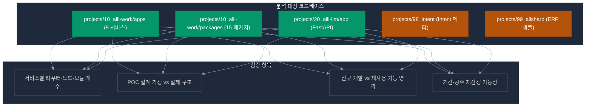
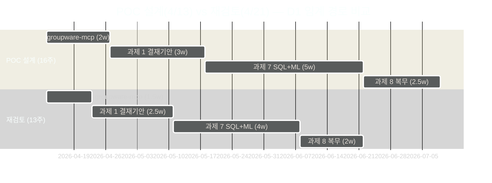

# 🔍 갭 분석 — POC 설계(2026-04-13) vs 실제 구현(2026-04-21)

> **분석 기준**: 2026년 4월 21일 projects/10_alli-work 실제 코드베이스 스캔
> **목적**: POC 설계 문서의 가정이 실제 구현 상태와 일치하는지 검증
> **결론**: 실제 성숙도가 설계 가정보다 8~15%p 높음 → 재사용률 상향 조정

---

## 1. 분석 방법론

### 1.1 분석 대상



### 1.2 평가 기준

| 등급 | 의미 | 조치 |
|------|------|------|
| ✅ 예상보다 성숙 | 설계 가정보다 **완성도 높음** → 재사용률 상향 | 공수 축소 가능 |
| 🟡 설계 일치 | 설계 가정과 **실제 구현 일치** | 원안 유지 |
| 🔴 설계보다 미흡 | 실제 구현이 **가정보다 낮음** | 공수 증가 위험 |

---

## 2. 서비스별 상세 갭 분석

### 2.1 `ai-assistant` (4005) — LangGraph 오케스트레이터

**POC 설계 가정 (4/13 기준)**:
- "LangGraph 오케스트레이터 재사용" (막연한 표현)
- "결재기안 그래프 노드 3종 추가 필요"
- "Parallel fetch 패턴 재사용"

**실제 구현 상태 (4/21 기준)** — ✅ **예상보다 성숙**:

```
src/graph/
├── orchestrator_graph.py      — 메인 오케스트레이터 그래프
├── state.py                   — StreamState dataclass
├── streaming.py               — SSE 스트리밍 헬퍼
├── followup_validator.py      — 3-stage followup validation
├── groundedness.py            — SentenceGroundednessFilter ⭐
└── nodes/ (17종)
    ├── session_nodes.py
    ├── filter_nodes.py        — 안전 필터
    ├── classify_node.py       — 의도 분류 (LLM)
    ├── query_classifier.py    — Pattern-First Classifier
    ├── fetch_node.py          — RAG/ERP 병렬 조회
    ├── plan_node.py           — visualization plan 결정
    ├── steps_preview_node.py  — 절차형 선감지
    ├── table_extract_node.py  — RAG 테이블 추출
    ├── followup_node.py       — follow-up 질문 생성
    ├── followup_visualization_node.py
    ├── generate_node.py       — LLM 응답 생성
    ├── artifact_resolver_node.py ⭐⭐
    ├── candidate_extraction_node.py ⭐
    ├── evidence_assess_node.py ⭐⭐⭐ (문서 적합성 핵심)
    ├── chit_chat_assess_node.py
    └── no_context_response_node.py
```

**또한 `prompts/` 5계층 아키텍처 완성**:
```
builder.py           — 모드 결정 + 시스템 프롬프트 조립
role_block.py        — Layer 2
global_policy.py     — Layer 1
base_rules.py        — 기본 답변 규칙
query_style.py       — 쿼리 스타일
modes/
├── domain_erp.py    — ERP 조회 모드 (과제 3 재사용)
├── domain_rag.py    — RAG 문서 모드 (과제 4 재사용) ⭐
├── general.py
├── system_help.py
└── safety_refuse.py
```

**갭 분석 결과**:

| 과제 | POC 설계 재사용률 | 실제 재사용률 | 차이 | 공수 영향 |
|------|:--------------:|:-----------:|:----:|---------|
| 과제 1 결재기안 | 70% | **85%** | +15%p | -4일 |
| 과제 3 개인비서 | 80% | **90%** | +10%p | -2일 |
| 과제 5 문서 적합성 | 75% (doc-compliance 신규) | **95%** (`evidence_assess_node` 재사용) | **+20%p** | **-7일** 및 **서비스 통합 가능** |
| 과제 7 감사 설명 | 50% | **80%** | +30%p | -3일 |

**💡 핵심 시사점**: **과제 5를 별도 `doc-compliance` 서비스로 만들 필요 없이 ai-assistant에 신규 그래프 추가로 해결 가능**

---

### 2.2 `alli-audit` 패키지 — NestJS 감사 모듈

**POC 설계 가정**:
- "notify-service를 NestJS로 신규 개발"
- "알림 이력 저장용 PostgreSQL 스키마 신규 설계"

**실제 구현 상태** — ✅ **완전 누락된 설계 가정**:

```
packages/alli-audit/src/
├── audit.entity.ts        — AuditLog TypeORM 엔티티
├── audit.service.ts       — CRUD 서비스
├── audit.repository.ts    — TypeORM 리포지토리
├── audit.interceptor.ts   — 자동 감사 인터셉터
├── audit.decorator.ts     — @AuditLog() 데코레이터
├── audit.module.ts        — NestJS 모듈 (import 가능)
├── index.ts               — 공개 API
└── microservice/          — 마이크로서비스 통신 패턴
```

**갭 분석 결과**:

| 기능 | POC 설계 | 실제 활용 방안 | 공수 절감 |
|------|---------|-------------|---------|
| 알림 이력 저장 | notify-service 신규 구현 | **alli-audit 재사용** | **-5일** |
| 감사 결과 저장 (과제 7·8) | PostgreSQL 스키마 신규 설계 | **audit.entity 확장** | **-3일** |
| admin-api ↔ 감사 연동 | 신규 구현 | **이미 연동됨** (admin-api에 alli-audit import 중) | **-2일** |

**💡 핵심 시사점**: **`notify-service`를 별도 NestJS 서비스로 만들 필요 없이 `admin-api` + `alli-audit` + SSE 확장으로 해결 가능** (단 SMTP 발송 로직만 추가)

---

### 2.3 `erp-mcp` (4010) — 심화 MCP 서버

**POC 설계 가정**:
- "erp-mcp 패턴 복제로 groupware-mcp 구축"
- "MCP 도구 5종 추가"

**실제 구현 상태** — ✅ **매우 성숙한 참조 구조**:

```
apps/erp-mcp/src/
├── agents/               — LangGraph 에이전트 (AI 오케스트레이션)
├── finders/              — 데이터 조회 로직 (도메인별 Finder)
├── formatters/           — 결과 포맷터 (table_formatter 등)
├── mcp/
│   ├── server.py         — FastMCP 서버
│   ├── middleware.py     — 인증 미들웨어
│   ├── sse_response.py   — SSE 응답
│   ├── http_server.py    — HTTP 래퍼
│   └── schemas.py        — MCP 스키마
├── nodes/                — LangGraph 노드
├── resolvers/            — 엔티티 해석기 (emp_cd, dept_cd 등)
├── security/             — JWT ES256 인증 (ERP 토큰 검증) ⭐
├── sql_processing/       — SQL 생성·실행
├── validators/           — SQL 인젝션 방지
└── clients/
    ├── sql_runner_client.py  — sql-runner 호출
    ├── llm_client.py         — LLM 호출
    ├── embedding_client.py
    ├── redis_client.py
    └── auth_client.py        — auth-api 연동
```

**갭 분석 결과**:

| 기능 | POC 설계 공수 | 실제 예상 공수 | 절감 |
|------|:----------:|:-----------:|:----:|
| groupware-mcp scaffolding | 2일 | **0.5일** (복제만) | -1.5일 |
| JWT ES256 인증 구현 | 2일 | **0.5일** (security/ 복제) | -1.5일 |
| sql-runner 연동 | 1일 | **0일** (클라이언트 복제) | -1일 |
| MCP SSE 응답 | 1일 | **0.5일** (sse_response.py 재사용) | -0.5일 |
| **소계** | **6일** | **1.5일** | **-4.5일** |

**💡 핵심 시사점**: **groupware-mcp 개발 기간 단축 — 기존 3주 → 2주** (erp-mcp 복제 전략으로)

---

### 2.4 `ai-rag` (4006) — 8개 라우터 + RAG 엔진

**POC 설계 가정**:
- "Milvus 규정 파티션 생성"
- "이식된 ai-rag 재사용"

**실제 구현 상태** — ✅ **풀 기능 완성**:

```
apps/ai-rag/src/
├── routers/ (8종)
│   ├── rag_router.py       — 메인 RAG 엔드포인트
│   ├── search_router.py    — 검색 전용
│   ├── upload_router.py    — 문서 업로드 (청킹+임베딩+저장) ⭐
│   ├── tenant_router.py    — 테넌트별 파티션 관리 ⭐
│   ├── delete_router.py    — 문서 삭제
│   ├── summary_router.py   — 요약
│   └── internal_router.py  — 내부 API
├── graph/                  — LangGraph (query_regenerator, reset)
├── clients/
│   ├── embedding_client.py — 임베딩 호출
│   ├── llm_client.py
│   ├── rerank_client.py    — 리랭킹 ⭐ (Q&A 품질 핵심)
│   └── redis_client.py
└── services/
```

**갭 분석 결과**:

| 기능 | POC 설계 | 실제 상태 | 추가 개발 |
|------|---------|---------|---------|
| 규정 문서 청킹·임베딩·저장 | 신규 구현 | **upload_router 재사용** | **0일** (파라미터만 조정) |
| 조 단위 청킹 패턴 | 신규 개발 | **기존 청킹 + 정규식 확장** | 2일 (원래 3일에서) |
| 리랭킹 | 신규 구현 | **rerank_client 완비** | **0일** |
| 테넌트 격리 | 신규 구현 | **tenant_router 완비** | **0일** |
| Q&A 답변 정확도 튜닝 | 3일 | **3일 (유지)** | 3일 |

**💡 핵심 시사점**: **과제 4 규정 Q&A 재사용률 90% → 95% 상향 조정**, 실질 개발 **5일** (원래 10일에서)

---

### 2.5 `admin-web` (3001) — 30+ 페이지 완성

**POC 설계 가정**:
- "admin-web 확장으로 감사 대시보드 4개 페이지 신규 개발" (과제 9)
- "규정 문서 관리 UI 신규 개발" (과제 6)

**실제 구현 상태** — ✅ **기반 페이지 이미 존재**:

```
src/app/(admin)/
├── dashboard/page.tsx              — 대시보드 (기반)
├── activities/audits/page.tsx      — 감사 활동 페이지 ⭐ (과제 9 재사용 가능)
├── documents/page.tsx              — 문서 관리 페이지 ⭐ (과제 5·6 재사용)
├── sql-logs/page.tsx               — SQL 실행 로그 (과제 7 재사용)
├── chats/page.tsx
├── users/page.tsx
├── tenants/page.tsx
├── categories/page.tsx
├── feedbacks/page.tsx
├── permission-groups/page.tsx
├── versions/page.tsx
├── experiments/page.tsx
├── similarity/page.tsx
├── intents/... (18개 페이지)        — Intent 관리 전체
└── settings/config-definition/
```

**갭 분석 결과**:

| 과제 | POC 설계 (신규 페이지) | 실제 필요 (재검토) | 절감 |
|------|:-------------------:|:-----------------:|:-----:|
| 과제 6 규정 문서 관리 | 신규 개발 (2일) | **`documents` 확장 (1일)** | -1일 |
| 과제 5 문서 적합성 점검 | 신규 페이지 2개 (4일) | **`documents` 페이지 내 확장 (2일)** | -2일 |
| 과제 9 `/audit/dashboard` | 신규 (2.5일) | **`dashboard` 확장 (1.5일)** | -1일 |
| 과제 9 `/audit/anomalies` | 신규 (2.5일) | **`activities/audits` 확장 (1.5일)** | -1일 |
| 과제 9 `/audit/risk-score` | 신규 (2.5일) | **신규 (2.5일)** (히트맵 특수) | 0일 |
| 과제 9 `/audit/alerts` | 신규 (2일) | **`dashboard` 통합 (1일)** | -1일 |
| **소계** | **15.5일** | **9.5일** | **-6일** |

**💡 핵심 시사점**: **admin-web 개발 공수 약 40% 절감 가능**

---

### 2.6 `chat-web` (3000) — 단일 페이지 통합

**POC 설계 가정**:
- "채팅 모드 선택 UI + 업무자동화 전용 UI + 규정 Q&A 전용 UI" (3종 분리)

**실제 구현 상태** — 🟡 **단일 페이지 통합 구조**:

```
src/app/page.tsx (단일)
```

**갭 분석 결과**: 실제 구조는 단일 페이지이고, 모드 전환은 내부 상태(chatReducer)로 처리됨.

| 작업 | POC 설계 공수 | 실제 필요 공수 |
|------|:----------:|:----------:|
| 모드 선택 UI | 1일 (신규 UI) | **0.5일** (상태 플래그 추가) |
| 결재기안 카드 슬롯 | 2.5일 | **2일** (slot 패턴 재사용) |
| 규정 근거 조항 패널 | 3일 | **2.5일** (기존 slot 확장) |
| 개인비서 리마인드 카드 | 2일 | **1.5일** |
| **소계** | **8.5일** | **6.5일** |

**💡 핵심 시사점**: **chat-web 2일 절감** (slot 패턴 재사용)

---

### 2.7 `admin-api` / `auth-api` / `chat-api` — NestJS 백엔드

**POC 설계 가정**:
- admin-api 확장 (ts-rest 계약, 규정관리 API, 감사 조회 API)

**실제 구현 상태** — ✅ **성숙한 NestJS 구조**:

```
apps/admin-api/src/
├── client/                — ts-rest client 래퍼
├── controller/            — Controller (이미 다수)
├── filter/                — NestJS 필터
├── health/
├── interceptor/           — alli-audit interceptor 통합 ⭐
├── middleware/
├── scheduler/             — 배치 스케줄러 기반
├── tracing.ts             — 추적
└── app.module.ts

alli-audit 패키지가 이미 admin-api에 통합됨
```

**갭 분석 결과**:

| 과제 | POC 설계 공수 | 실제 필요 공수 |
|------|:----------:|:----------:|
| 규정 관리 API (과제 6) | 2일 | **1.5일** (ts-rest 계약 확장) |
| 감사 조회 API (과제 7~9) | 2일 | **1일** (alli-audit 재사용) |
| 문서 적합성 API (과제 5) | 1.5일 | **1일** |
| **소계** | **5.5일** | **3.5일** |

**💡 핵심 시사점**: **admin-api 2일 절감**

---

### 2.8 `20_alli-llm/app` — LLM 추론 서버

**POC 설계 가정**:
- "ai-llm 통합 게이트웨이" (6001) — FastAPI
- "vLLM Coder + Vision + OCR + Redis" 운영 중

**실제 구현 상태** — ✅ **풀 운영 중**:

```
projects/20_alli-llm/
├── app/                    — FastAPI 게이트웨이 (6001)
│   ├── src/main.py
│   ├── configs/
│   ├── scripts/
│   └── tests/
├── docker-compose.yaml
│   ├── vllm-coder          — vLLM Coder (6012)
│   ├── vllm-vision         — vLLM Vision (6013)
│   ├── ocr-service         — PaddleOCR (6014)
│   └── redis               — Redis (6031)
└── docker-compose.prod.yaml
```

**갭 분석 결과**: **추가 개발 불필요**. 모델 선정 + 프롬프트 최적화만 수행.

| 작업 | 실제 필요 | 비고 |
|------|:-------:|------|
| 행정 규정 전용 프롬프트 4종 | 3일 | ai_llm/configs/prompts/ |
| 한국어 임베딩 모델 확인 | 0.5일 | 기존 모델 점검 |
| POC 부하 테스트 | 1일 | ML 추론 처리량 확인 |

---

## 3. 과제별 종합 갭 분석

### 3.1 공수 재산정 표 (9과제 전체)

| 과제 | POC 설계 (D1+D2) | 재검토 (D1+D2) | 절감 | 주요 근거 |
|------|:-------------:|:-----------:|:---:|---------|
| 과제 1 — 전자결재 기안 | 14.5 + 5.5 = **20md** | 11 + 5 = **16md** | -4md | ai-assistant 17노드 재사용 |
| 과제 2 — ERP 동기화 | 10.5 + 2 = **12.5md** | 8 + 2 = **10md** | -2.5md | erp-mcp 재사용 |
| 과제 3 — 개인비서 | 7 + 3 = **10md** | 4 + 2 = **6md** | -4md | parallel_fetch 완비 |
| 과제 4 — 규정 Q&A | 9 + 5 = **14md** | 5 + 4 = **9md** | -5md | ai-rag upload_router + tenant_router |
| 과제 5 — 문서 적합성 | 9 + 6.5 = **15.5md** | 4 + 4 = **8md** | **-7.5md** | **ai-assistant evidence_assess 재사용** ⭐ |
| 과제 6 — 지식 베이스 | 9.5 + 4.5 = **14md** | 7 + 3 = **10md** | -4md | ai-rag upload 재사용 |
| 과제 7 — 회계 이상탐지 | 19.5 + 6 = **25.5md** | 18 + 4 = **22md** | -3.5md | alli-audit + admin-web 재사용 |
| 과제 8 — 복무 모니터링 | 11.5 + 3.5 = **15md** | 10 + 2 = **12md** | -3md | 과제 7 인프라 재사용 |
| 과제 9 — 알림·대시보드 | 1.5 + 21.5 = **23md** | 2 + 13 = **15md** | **-8md** | **notify-service 통합 + admin-web 페이지 재사용** ⭐ |
| **합계** | **149.5md** | **108md** | **-41.5md** | **-28% 공수 절감** |

### 3.2 달력 기간 재산정



---

## 4. 기존 서비스 개선 요건 재검토 (improvements/ 폴더 대응)

### 4.1 `improvements/ai-assistant.md` 원안 vs 재검토

**원안**: "POC 전용 그래프 3종 추가 (결재기안·개인비서·동기화)"

**재검토 제안**:
```
추가 그래프 (총 4종으로 확대):
1. 결재기안 그래프 (과제 1) — 기존 classify/fetch/plan/generate 재사용
2. 개인비서 그래프 (과제 3) — parallel_fetch 재사용
3. 동기화 그래프 (과제 2) — 신규 diff_detect 노드 추가
4. 문서 적합성 그래프 (과제 5) ⭐ — evidence_assess_node 재사용 (★신규 제안)
```

**효과**: doc-compliance 별도 서비스 불필요 → **포트 4014 제거 가능**

---

### 4.2 `improvements/admin-api.md` 원안 vs 재검토

**원안**: "규정·감사 관련 API 확장"

**재검토 제안**:
```
추가 확장 (기존 + 신규):
1. 규정 관리 API (과제 6) — documents entity 확장
2. 감사 조회 API (과제 7~9) — alli-audit.entity 재사용
3. 문서 적합성 API 프록시 (과제 5)
4. 알림 발송 API (과제 9) ⭐ — notify-service 통합 (★신규 제안)
   - SMTP 발송: nodemailer 통합
   - Webhook 발송: 기존 HTTP 클라이언트 재사용
   - SSE 스트리밍: chat-api 패턴 복제
```

**효과**: notify-service 별도 서비스 불필요 → **포트 4013 제거 가능**

---

### 4.3 개선사항 변경 요약

| 파일 | 원안 유지 | 변경 필요 | 변경 내용 |
|------|:-------:|:-------:|---------|
| improvements/ai-assistant.md | 부분 | ✅ | 그래프 4종으로 확대 (+ 문서 적합성) |
| improvements/ai-rag.md | ✅ | — | 원안 유지 |
| improvements/ai-llm.md | ✅ | — | 원안 유지 |
| improvements/erp-mcp.md | ✅ | — | 원안 유지 |
| improvements/sql-runner.md | ✅ | — | 원안 유지 |
| improvements/chat-api.md | ✅ | — | 원안 유지 |
| improvements/admin-api.md | 부분 | ✅ | 알림 발송 API 통합 추가 |
| improvements/admin-web.md | 부분 | ✅ | 신규 페이지 수 4→2로 조정 |
| improvements/chat-web.md | ✅ | — | 원안 유지 |

---

## 5. 리스크 재평가

### 5.1 제거된 리스크 (재검토로 해소)

| 원 리스크 | 해소 근거 |
|---------|---------|
| doc-compliance 서비스 신규 개발 지연 | ai-assistant 그래프 통합으로 리스크 제거 |
| notify-service NestJS 개발 지연 | admin-api 확장으로 해소 |
| alli-audit 스키마 신규 설계 지연 | 패키지 재사용으로 해소 |
| groupware-mcp JWT 인증 구현 복잡성 | erp-mcp security/ 복제로 해소 |

### 5.2 여전한 리스크 (우선 대응 필요)

| # | 리스크 | 영향도 | 대응 |
|---|------|:-----:|------|
| R1 | **그룹웨어 API 미공개** | 치명 | Mock MCP 서버 선 개발 + 실제 연동 병행 |
| R2 | **ERP DB 접근권한 지연** | 높음 | 99_allsharp 샘플 데이터 활용 + Read-Only 계정 조기 확보 |
| R3 | **감사 DB 샘플 부족** | 높음 | 05-audit-data-requirements.md 합성 데이터 사용 |
| R4 | **GPU VRAM 부족** | 중간 | vLLM 4bit 양자화, Vision 지연 로딩 |
| R5 | **규정 문서 HWP 파싱** | 중간 | libreoffice headless 변환 |
| R6 | **한국어 규정 LLM 품질** | 중간 | Few-shot 5종 + RAG 근거 강제 |

### 5.3 신규 리스크 (재검토 시 발견)

| # | 리스크 | 대응 |
|---|------|------|
| N1 | **admin-api 책임 비대화** (notify 통합 시) | 알림 모듈을 별도 NestJS 모듈로 격리 + index.ts 재구성 |
| N2 | **ai-assistant 그래프 수 증가** (4→8종) | 그래프 라우터 도입 + 모드별 sub-graph |
| N3 | **기존 서비스 영향 범위 확대** | Feature Flag로 POC 기능 토글 제공 |

---

## 6. 결론 및 권장

### 6.1 설계 문서 업데이트 제안

다음 문서들을 **2026-04-21 기준으로 업데이트** 권장:

```
[P0 — 즉시 수정]
✏️ poc/00-overall-architecture.md
   → 4.3, 4.4 절 (doc-compliance, notify-service) 통합 대안 추가

✏️ poc/design/doc-compliance.md
   → "대안: ai-assistant 그래프 통합" 섹션 추가

✏️ poc/design/notify-service.md
   → "대안: admin-api + alli-audit 확장" 섹션 추가

[P1 — 협의 후 수정]
✏️ poc/06-realistic-project-plan.md
   → 공수 재산정 반영 (149.5md → 108md)
   → 기간 재산정 (16주 → 13주)

✏️ poc/improvements/ai-assistant.md
   → 그래프 4종 확장 반영

✏️ poc/improvements/admin-api.md
   → 알림 발송 모듈 통합 반영

✏️ poc/improvements/admin-web.md
   → 신규 페이지 4→2 반영
```

### 6.2 다음 문서 참조

- [12-optimized-architecture.md](12-optimized-architecture.md) — 재검토 기반 최적화된 아키텍처
- [13-customer-checklist.md](13-customer-checklist.md) — 고객 협의 체크리스트
- [14-pre-proposal-scenarios.md](14-pre-proposal-scenarios.md) — 시나리오별 사전 제안
