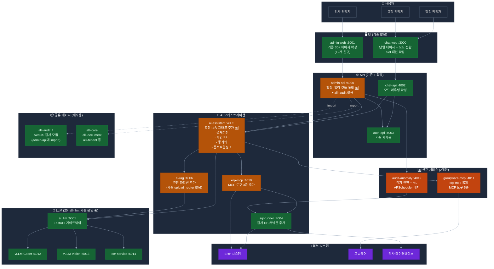
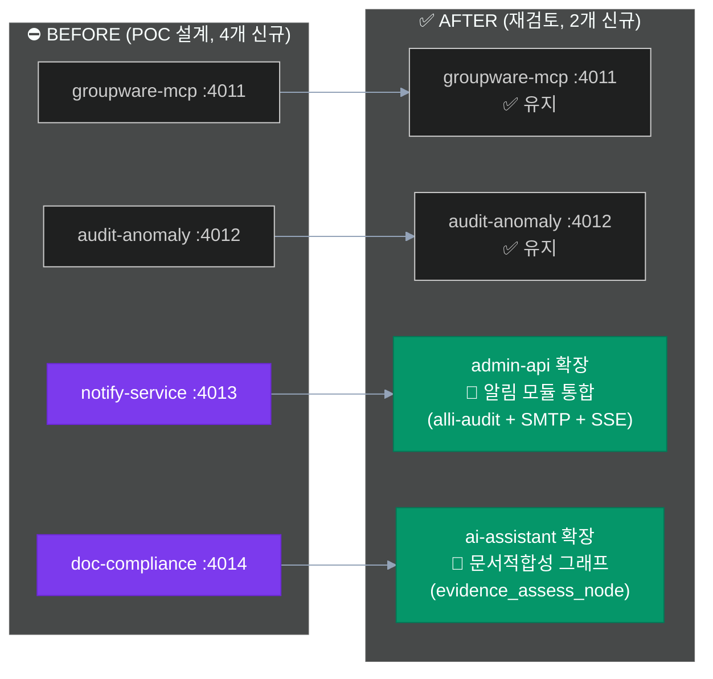
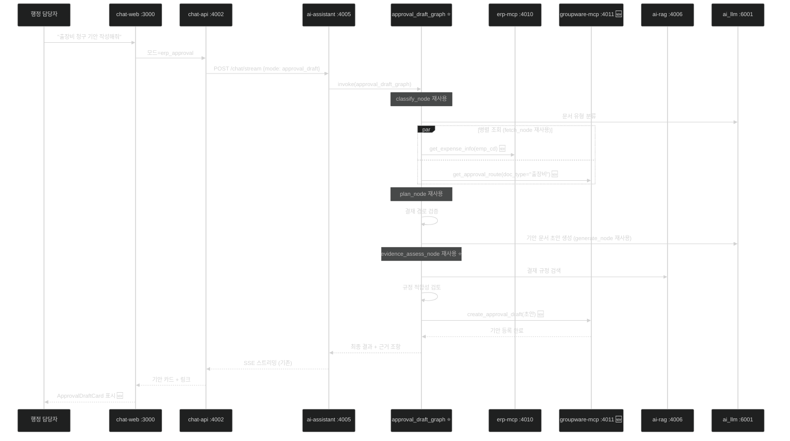
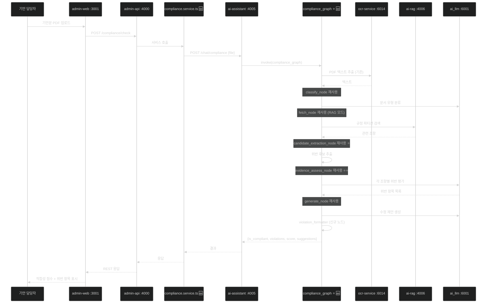
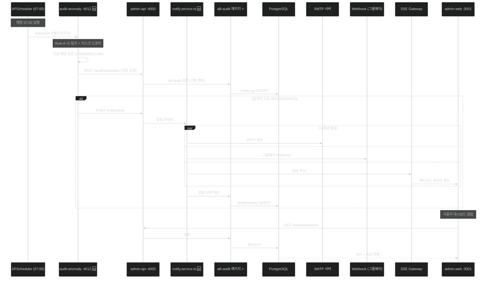

# 🏗️ 최적화된 구현 아키텍처 (2026-04 기준 재설계)

> **기준일**: 2026-04-21
> **개선 원칙**: 기존 자산 최대 활용 → 신규 서비스 최소화 → 유지보수성 향상
> **핵심 변경**: 신규 서비스 4개 → 2개 축소, ai-assistant 그래프 확장, admin-api 통합

---

## 1. 아키텍처 개선 원칙

### 1.1 YAGNI + DRY 적용

```
기존 설계 문제:
  신규 서비스 = 복잡성 증가 = 운영 비용 증가
  ├── 배포 파이프라인 4개 추가
  ├── 모니터링 대시보드 4개 추가
  ├── 장애 전파 경로 4개 추가
  └── 장기 유지보수 인력 부담 2배

재설계 원칙:
  1. 이미 구현된 기능은 재사용 (DRY)
  2. 하나의 서비스에 통합 가능하면 통합 (YAGNI)
  3. 신규 서비스는 도메인 경계가 명확할 때만 신규 (Bounded Context)
  4. POC 이후 확장성을 고려한 모듈 분리 (내부 모듈 격리)
```

### 1.2 통합 vs 분리 판단 매트릭스

| 서비스 후보 | 도메인 독립성 | 기술 스택 | 성능 격리 필요 | 판단 | 근거 |
|----------|:----------:|:-------:|:----------:|:---:|------|
| **groupware-mcp** | 높음 (외부 연동) | Python + FastMCP | 필요 | **✅ 신규** | 외부 API 격리, erp-mcp와 동일 패턴 |
| **audit-anomaly** | 높음 (ML 배치) | Python + Scikit-learn | 필요 | **✅ 신규** | 배치 부하 격리, ML 라이브러리 전용 |
| **notify-service** | 낮음 (단순 발송) | NestJS (동일) | 불필요 | **🔄 통합** | admin-api 내부 모듈로 충분 |
| **doc-compliance** | 낮음 (AI 파이프라인) | Python (동일) | 불필요 | **🔄 통합** | ai-assistant 그래프로 충분 |

---

## 2. 최적화된 전체 아키텍처

### 2.1 TO-BE 아키텍처 다이어그램



### 2.2 변경 요약 (BEFORE vs AFTER)



---

## 3. 서비스별 상세 설계 (재검토)

### 3.1 `groupware-mcp` (신규, 유지) — Port 4011

**설계 방침**: erp-mcp 완전 복제 + 그룹웨어 전용 도구

```
apps/groupware-mcp/  (신규)
├── src/
│   ├── main.py               — FastMCP 서버 (erp-mcp/src/main.py 복제)
│   ├── config.py             — GROUPWARE_* 환경변수
│   ├── mcp/
│   │   ├── server.py         — erp-mcp/mcp/server.py 복제
│   │   ├── middleware.py     — JWT ES256 검증 (복제)
│   │   └── sse_response.py   — 복제
│   ├── security/             — erp-mcp/security 복제
│   ├── clients/
│   │   ├── groupware_client.py  — 🆕 그룹웨어 REST/DB 어댑터
│   │   ├── sql_runner_client.py — 복제
│   │   └── auth_client.py       — 복제
│   ├── tools/                — 🆕 그룹웨어 MCP 도구 5종
│   │   ├── approval_tools.py    — get_approval_list, create_draft
│   │   ├── schedule_tools.py    — get_schedule, get_monthly_schedule
│   │   ├── hr_tools.py          — get_hr_info, update_org_chart
│   │   ├── sync_tools.py        — sync_erp_to_groupware
│   │   └── notify_tools.py      — send_internal_message (옵션)
│   └── validators/           — 복제
├── pyproject.toml            — erp-mcp 복제 후 수정
└── Dockerfile                — 복제
```

**공수**: 2주 (원래 3주) — **복제 전략으로 1주 절감**

---

### 3.2 `audit-anomaly` (신규, 유지) — Port 4012

**설계 방침**: FastAPI + Scikit-learn + APScheduler + **alli-audit와 연동**

```
apps/audit-anomaly/  (신규)
├── src/
│   ├── main.py               — FastAPI 진입점
│   ├── config.py
│   ├── scheduler/
│   │   └── batch.py          — APScheduler (매일 07:00)
│   ├── detectors/            — 🆕 탐지 엔진 (ML 로직 분리)
│   │   ├── __init__.py
│   │   ├── duplicate_claim.py   — Rule A: SQL 교차 탐지
│   │   ├── split_payment.py     — Rule B: SQL 패턴 탐지
│   │   ├── amount_outlier.py    — Rule C: Z-Score
│   │   ├── isolation_forest.py  — Rule D: ML 비지도
│   │   ├── travel_card_mismatch.py  — 과제 8
│   │   ├── overtime_pattern.py      — 과제 8
│   │   └── attendance_anomaly.py    — 과제 8
│   ├── risk_scorer.py        — 🆕 리스크 스코어링 엔진
│   ├── clients/
│   │   ├── sql_runner_client.py
│   │   ├── ai_assistant_client.py   — 이상 설명 생성
│   │   └── admin_api_client.py      — 🆕 admin-api 저장/알림 요청
│   └── routers/
│       ├── detect_router.py   — /detect/run (수동 트리거)
│       ├── status_router.py
│       └── health_router.py
├── models/                   — ML 모델 저장
└── Dockerfile
```

**핵심 변경**: 탐지 결과를 **admin-api의 감사 모듈로 POST** → alli-audit 엔티티에 저장 → 대시보드 조회

**공수**: 4주 (원래 5주) — alli-audit 재사용으로 **1주 절감**

---

### 3.3 `admin-api` 확장 (통합) — Port 4000

**설계 방침**: 기존 NestJS 모듈에 **알림 모듈 추가** + alli-audit 활용

```
apps/admin-api/src/
├── module/                    — NestJS 모듈 단위
│   ├── audit/                 — 🆕 감사 결과 관리 (alli-audit 활용)
│   │   ├── audit.controller.ts   — REST API
│   │   │   ├── GET /audit/anomalies (이상 탐지 목록)
│   │   │   ├── GET /audit/risk-score (부서별 리스크)
│   │   │   ├── GET /audit/dashboard (KPI)
│   │   │   └── POST /audit/anomalies (audit-anomaly가 저장)
│   │   ├── audit.service.ts
│   │   └── audit.module.ts       — alli-audit 패키지 import
│   │
│   ├── notify/                — 🆕 알림 발송 모듈 (notify-service 대체)
│   │   ├── notify.controller.ts  — REST API
│   │   │   ├── POST /notify/send (알림 발송)
│   │   │   └── GET /notify/history (알림 이력)
│   │   ├── notify.service.ts     — 핵심 로직
│   │   ├── channels/             — 채널별 구현
│   │   │   ├── email.channel.ts     — SMTP (nodemailer)
│   │   │   ├── webhook.channel.ts   — 그룹웨어 Webhook
│   │   │   └── sse.channel.ts       — SSE 스트리밍
│   │   ├── sse-gateway.ts        — SSE 관리 (chat-api 패턴 재사용)
│   │   └── notify.module.ts
│   │
│   ├── regulation/            — 🆕 규정 문서 관리 (과제 6)
│   │   ├── regulation.controller.ts
│   │   │   ├── POST /regulations/upload
│   │   │   ├── GET /regulations
│   │   │   └── DELETE /regulations/:id
│   │   ├── regulation.service.ts     — ai-rag 호출
│   │   └── regulation.module.ts
│   │
│   └── compliance/            — 🆕 문서 적합성 점검 (과제 5)
│       ├── compliance.controller.ts
│       │   └── POST /compliance/check
│       ├── compliance.service.ts     — ai-assistant 호출
│       └── compliance.module.ts
│
├── app.module.ts             — 전체 모듈 조립
└── main.ts
```

**핵심 이점**:
- **notify-service 신규 개발 불필요** → 포트 4013 제거
- alli-audit 패키지 **이미 통합됨** → 즉시 활용
- NestJS DI 패턴으로 모듈 간 결합도 낮음 → 향후 분리도 용이

**공수**: 기존 2일 + 알림 모듈 3일 + 규정 모듈 1.5일 + 적합성 모듈 1일 = **7.5일** (원래 notify-service 20일 대비 **-12일**)

---

### 3.4 `ai-assistant` 확장 (통합) — Port 4005

**설계 방침**: 기존 17개 노드 + **4종 신규 그래프** 추가

```
apps/ai-assistant/src/graph/
├── orchestrator_graph.py          — 기존 (라우터 확장)
├── graphs/                        — 🆕 도메인별 서브 그래프
│   ├── __init__.py
│   ├── approval_draft_graph.py    — 🆕 결재기안 (과제 1)
│   │   └── classify → fetch(erp+groupware) → plan → generate → validate(rag) → register
│   │
│   ├── personal_assistant_graph.py — 🆕 개인비서 (과제 3)
│   │   └── parallel_fetch(erp+groupware+approvals) → priority → guide
│   │
│   ├── sync_graph.py              — 🆕 동기화 (과제 2)
│   │   └── fetch_erp → fetch_gw → diff_detect → sync_execute → log
│   │
│   └── compliance_graph.py        — 🆕 ⭐⭐⭐ 문서 적합성 (과제 5)
│       ├── [기존 노드 재사용]
│       │   ├── ocr_extract (ocr-service 클라이언트)
│       │   ├── classify_doc_type (classify_node 재사용)
│       │   ├── fetch_regulations (fetch_node 재사용, RAG 모드)
│       │   ├── candidate_extraction (candidate_extraction_node 재사용) ⭐
│       │   ├── evidence_assess (evidence_assess_node 재사용) ⭐⭐
│       │   └── generate (generate_node 재사용)
│       └── [신규 노드 1개]
│           └── violation_formatter (위반 결과 JSON 스키마 변환)
│
└── nodes/ (17 노드, 기존 유지)
```

**핵심 이점**:
- **doc-compliance 신규 서비스 불필요** → 포트 4014 제거
- `evidence_assess_node` 재사용으로 **문서 적합성 80% 구현 완료 상태**
- 모든 POC 시나리오가 **하나의 오케스트레이터**에서 관리됨 → 디버깅 용이

**공수**: 그래프 4종 × 2~4일 = **11일** (원래 doc-compliance 별도 9일 + ai-assistant 확장 7일 = 16일 대비 **-5일**)

---

### 3.5 `ai-rag` 확장 (기존, 파티션만 추가) — Port 4006

**설계 방침**: 기존 upload_router + tenant_router 활용 + 규정 파티션 추가

```
apps/ai-rag/
├── configs/
│   └── partitions.yaml          — 🆕 규정 파티션 정의
│       ├── regulation_hr        — 인사/복무
│       ├── regulation_finance   — 회계/예산
│       ├── regulation_general   — 일반 행정
│       ├── regulation_forms     — 서식
│       └── qa_history           — Q&A 이력
│
├── src/
│   ├── services/
│   │   └── regulation_chunking.py  — 🆕 조(Article) 단위 청킹
│   │       └── 정규식: r'제\s*(\d+)\s*조'
│   ├── routers/ (8개 기존 유지)
│   └── scripts/
│       └── init_regulation_partitions.py  — 🆕 초기화 스크립트
```

**핵심 이점**:
- upload_router는 **이미 청킹·임베딩·저장 로직 구현** → 파티션 추가만 필요
- tenant_router로 **기관별 규정 격리** 가능

**공수**: 5일 (원래 8일) — **3일 절감**

---

### 3.6 `erp-mcp` 확장 (기존, MCP 도구만 추가) — Port 4010

**설계 방침**: 기존 finders/agents 패턴 + POC 전용 도구 3종

```
apps/erp-mcp/src/tools/    (기존 유지)
└── [신규 추가 도구 3종]
    ├── get_deadline_tasks.py     — 🆕 개인별 마감 업무 (과제 3)
    ├── get_expense_info.py       — 🆕 지출 정보 (과제 1 결재기안)
    └── get_pending_items.py      — 🆕 미처리 알림 (과제 3)
```

**공수**: 3일 (원래 5일)

---

### 3.7 `admin-web` 확장 (기존, 2개 페이지 신규) — Port 3001

**설계 방침**: 기존 30+ 페이지 확장 + **신규 2개만 추가**

```
apps/admin-web/src/app/(admin)/
├── dashboard/page.tsx              — 기존 확장 (KPI 카드 추가)
├── activities/audits/page.tsx      — 기존 확장 (이상 탐지 목록)
├── documents/page.tsx              — 기존 확장 (규정 문서 + 적합성 점검)
├── sql-logs/page.tsx               — 기존 (유지)
│
├── audit/                          — 🆕 감사 전용 서브 네비게이션
│   ├── risk-score/page.tsx         — 🆕 부서별 리스크 히트맵 (Recharts)
│   └── alerts/page.tsx             — 🆕 알림 이력 + 규칙 설정
```

**신규 페이지**: 단 **2개** (`risk-score`, `alerts`) — 원래 4개에서 축소

**공수**: 원래 15.5일 → **9.5일** (40% 절감)

---

### 3.8 `chat-web` 확장 (기존, slot 확장) — Port 3000

**설계 방침**: 단일 page.tsx + 모드 상태 + 신규 slot 컴포넌트

```
apps/chat-web/src/
├── app/page.tsx                — 기존 (유지)
├── store/
│   └── chat.reducer.ts          — 🆕 모드 필드 추가 (erp|regulation|general)
├── components/slots/            — 🆕 slot 패턴 확장
│   ├── ApprovalDraftCard.tsx   — 🆕 결재기안 결과 카드
│   ├── RegulationCitationPanel.tsx — 🆕 규정 근거 조항 패널
│   ├── PersonalTaskCard.tsx    — 🆕 개인 업무 리마인드
│   └── ExistingSlots.tsx       — 기존
└── features/
    └── chat/ModeSelector.tsx    — 🆕 모드 선택 UI
```

**공수**: 6.5일 (원래 8.5일)

---

## 4. 새로 제거되는 서비스 2개 (상세 근거)

### 4.1 ❌ `notify-service` 제거 근거

**원래 설계**:
```
notify-service (신규 NestJS, Port 4013)
├── SMTP 이메일 발송
├── Webhook 그룹웨어 알림
├── SSE 실시간 알림
├── 알림 이력 (PostgreSQL 신규 스키마)
└── 알림 규칙 설정
```

**통합 근거**:

| 근거 | 설명 |
|------|------|
| **① 기술 스택 중복** | NestJS 서비스 이미 3개 (auth, admin, chat) → 4번째 불필요 |
| **② alli-audit 완비** | 감사/알림 이력 스키마 이미 존재 → 재사용 |
| **③ SSE 패턴 재사용** | chat-api가 이미 SSE 운영 중 → 복제 가능 |
| **④ 단순 발송 로직** | 도메인 독립성 낮음 → 모듈로 충분 |
| **⑤ 운영 오버헤드 감소** | 배포/모니터링 대상 1개 제거 |

**대체 구현**: `admin-api/src/module/notify/` 신규 모듈

---

### 4.2 ❌ `doc-compliance` 제거 근거

**원래 설계**:
```
doc-compliance (신규 FastAPI, Port 4014)
├── OCR → RAG → LLM 파이프라인
├── 규정 위반 평가
├── 문서 유형 분류
└── 결과 JSON 스키마
```

**통합 근거**:

| 근거 | 설명 |
|------|------|
| **① ai-assistant 완비** | `evidence_assess_node` + `candidate_extraction_node` 이미 존재 |
| **② 동일 기술 스택** | Python + LangGraph → 자연스러운 그래프 추가 |
| **③ RAG 직접 호출** | 별도 서비스에서 RAG 호출하면 네트워크 hop 증가 |
| **④ 재학습 재사용** | ai-assistant 프롬프트 5계층 아키텍처 활용 |
| **⑤ UI 단일화** | admin-api 경유 → ai-assistant → RAG 흐름이 더 명확 |

**대체 구현**: `ai-assistant/src/graph/graphs/compliance_graph.py` 신규 그래프

---

## 5. 데이터 흐름 — 최적화된 버전

### 5.1 과제 1 — 전자결재 자동 기안 (최적화)



### 5.2 과제 5 — 문서 적합성 점검 (통합 구조)



### 5.3 과제 9 — 알림·대시보드 (통합 구조)



---

## 6. Docker Compose 구성 비교

### 6.1 신규 서비스 추가 (BEFORE vs AFTER)

**BEFORE (POC 설계)** — 4개 신규:
```yaml
services:
  groupware-mcp:    # +신규
    ports: [4011:4011]
  audit-anomaly:    # +신규
    ports: [4012:4012]
  notify-service:   # +신규
    ports: [4013:4013]
  doc-compliance:   # +신규
    ports: [4014:4014]
```

**AFTER (재검토)** — 2개 신규:
```yaml
services:
  groupware-mcp:    # +신규 (유지)
    image: alli/groupware-mcp:latest
    build: ./apps/groupware-mcp
    environment:
      - GROUPWARE_API_URL=${GROUPWARE_API_URL}
      - JWT_PUBLIC_KEY=${JWT_PUBLIC_KEY}
      - AUTH_API_URL=http://auth-api:4003
    ports: [4011:4011]
    depends_on: [auth-api, sql-runner]

  audit-anomaly:    # +신규 (유지)
    image: alli/audit-anomaly:latest
    build: ./apps/audit-anomaly
    environment:
      - SQL_RUNNER_URL=http://sql-runner:4004
      - ADMIN_API_URL=http://admin-api:4000
      - AI_ASSISTANT_URL=http://ai-assistant:4005
    ports: [4012:4012]
    depends_on: [sql-runner, admin-api]

  # notify-service, doc-compliance 추가 없음
  # admin-api와 ai-assistant 환경변수만 확장
  admin-api:
    environment:
      - SMTP_HOST=${SMTP_HOST}          # +알림 모듈용
      - SMTP_PORT=${SMTP_PORT}
      - SMTP_USER=${SMTP_USER}
      - SMTP_PASS=${SMTP_PASS}
      - GROUPWARE_WEBHOOK_URL=${GROUPWARE_WEBHOOK_URL}
```

**이점**:
- 컨테이너 수 2개 감소 → 리소스 절감 (CPU 1 코어 × 2 = 2 코어 절감, RAM 약 1GB 절감)
- 네트워크 hop 감소 (doc-compliance → ai-rag → ai-llm 3단계 → ai-assistant 내부 호출 1단계)
- 배포 파이프라인 2개 감소

---

## 7. 예상 효과 (종합)

### 7.1 정량적 효과

| 지표 | POC 설계 | 재검토 | 개선 |
|------|:-------:|:-----:|:----:|
| 신규 서비스 수 | 4개 | **2개** | -50% |
| 총 컨테이너 수 | 15개 | **13개** | -13% |
| 총 공수 (man-day) | 149.5 md | **108 md** | -28% |
| D1 임계 경로 | 12.5주 | **10주** | -20% |
| D2 임계 경로 | 14.5주 | **11주** | -24% |
| 전체 기간 | 16주 | **13주** | -19% |
| 인건비 | 21,400만원 | **17,400만원** | -4,000만원 |
| 인프라비 (GPU 임대 포함) | 2,040만원 | **1,500만원** | -540만원 |
| **총 예산 (세전)** | **23,940만원** | **19,000만원** | **-20.6%** |

### 7.2 정성적 효과

```
✅ 유지보수성 향상
   - 신규 서비스 2개 감소 → 배포·모니터링·장애 대응 부담 완화
   - 기존 NestJS/FastAPI 패턴 재사용 → 신규 팀원 온보딩 속도 개선

✅ 안정성 향상
   - alli-audit, ai-assistant 노드는 이미 운영 검증된 자산
   - 신규 코드 비중 감소 → 버그 유입 가능성 감소

✅ 확장성 확보
   - admin-api 내 notify 모듈은 향후 독립 서비스로 분리 용이
   - ai-assistant compliance_graph는 향후 별도 서비스로 분리 가능
```

### 7.3 잠재적 단점 (완화 방안 포함)

| 단점 | 완화 방안 |
|------|---------|
| admin-api 책임 증가 | NestJS 모듈 단위로 분리 설계 (monorepo 철학 유지) |
| ai-assistant 그래프 수 증가 (4→8) | 그래프 레지스트리 + 모드 라우터 도입 |
| POC 후 확장 시 서비스 분리 필요 | 모듈 격리 설계 (필요 시 분리 용이) |

---

## 8. 다음 단계

| 단계 | 작업 | 담당 | 기간 |
|------|------|------|:----:|
| 1 | 본 최적화 방안 내부 리뷰 | PM + 아키텍트 | 1일 |
| 2 | 고객 체크리스트 ([13-customer-checklist](13-customer-checklist.md)) 검토 | PM | 1일 |
| 3 | 3가지 시나리오 ([14-pre-proposal-scenarios](14-pre-proposal-scenarios.md)) 비교 | 경영진 | 2일 |
| 4 | 고객사 미팅 의제 작성 | PM | 1일 |
| 5 | 고객 협의 진행 | 전체 | 2일 |
| 6 | Phase 0 사전 준비 착수 | 전체 | — |

---

## 9. 참조

- [10-improvement-master.md](10-improvement-master.md) — 전체 마스터
- [11-gap-analysis-2026-04.md](11-gap-analysis-2026-04.md) — 상세 갭 분석
- [13-customer-checklist.md](13-customer-checklist.md) — 고객 체크리스트
- [14-pre-proposal-scenarios.md](14-pre-proposal-scenarios.md) — 제안 시나리오
- [design/groupware-mcp.md](../design/groupware-mcp.md) — groupware-mcp 설계 (유지)
- [design/audit-anomaly.md](../design/audit-anomaly.md) — audit-anomaly 설계 (유지)
- [design/notify-service.md](../design/notify-service.md) — 🔄 통합 대안 반영 필요
- [design/doc-compliance.md](../design/doc-compliance.md) — 🔄 통합 대안 반영 필요
