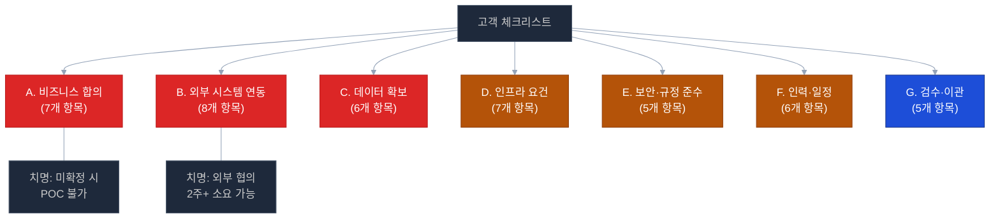

# ✅ 고객 협의 사전 체크리스트 — POC 착수 전 필수 확인

> **작성일**: 2026-04-21
> **대상**: 고객사 담당자, 내부 PM, 기술 검토 회의
> **목적**: POC 구현 착수 전 반드시 합의해야 할 항목 전수 검증
> **사용법**: 본 체크리스트를 기반으로 고객 미팅 시 항목별 확인/결정

---

## 🚨 최우선 3대 P0 결정 (미확정 시 POC 불가 / 지연)

| # | 결정 | 영향 | 대안 | 상세 |
|:-:|-----|------|-----|:----:|
| 🔴 **P0-1** | 그룹웨어 **Write 권한** 확보 | 과제 2 **전체 불가** (쓰기 연산 필수 3 MCP 도구) | Read-Only 탐지만 (60% 기능) | [보기](15-per-challenge-decision-points.md#-d2-06-미확정-시-영향--과제-2-전체-불가-사유) |
| 🔴 **P0-2** | 규정 문서 **10종** 제공 | POC 2 **전체 지연** (과제 4/5/6 의존) | 공개 법령 대체 / 분할 수집 | [보기](15-per-challenge-decision-points.md#-d6-02-미확정-시-영향--poc-2-전체-지연-사유) |
| 🔴 **P0-3** | **노조 협의** 진행 | 과제 8 **법적 리스크** (시스템 중단·과태료) | 2단계 연기 / 익명화 | [보기](15-per-challenge-decision-points.md#-d8-05-미진행-시-영향--과제-8-2단계-연기-필수-사유) |

**지연 기간**: P0-1 4~8주 / P0-2 3~4주 / P0-3 8~12주 (13주 POC 내 협의 물리적 불가)

> 본 체크리스트 진행 전 위 3개 항목부터 확정하세요.

---

## 🎯 체크리스트 구조



**우선순위 범례**:
- **P0**: 치명적 — POC 착수 **불가** (즉시 해결 필요)
- **P1**: 중요 — POC 중 1~2주 내 결정 필요
- **P2**: 선택 — POC 진행 중 결정 가능

---

## A. 비즈니스 합의 (P0 — 필수)

### A-1. POC 목표 및 범위 정의

```
□ [필수] POC 성공 기준 합의
  ├─ 정량 지표: Q&A 정확도 85%? 탐지 정밀도 70%? 응답시간 3초?
  ├─ 정성 지표: 감사 담당자 만족도? 운영팀 활용도?
  └─ 측정 방법: 자체 평가? 외부 기관 평가? 사용자 설문?

질문: "POC가 성공했다고 판단할 수 있는 기준은 무엇인가요?"
```

### A-2. 구현 범위 시나리오 선택

```
□ [필수] 다음 3가지 시나리오 중 선택

시나리오 A — 완전 구현 (권장 X)
  ├─ 9과제 전체 구현
  ├─ 기간: 16주, 인력: 8인, 예산: 약 2억 6,300만원 (VAT 포함)
  └─ 적합: 일정·예산 여유, 완성도 최우선

시나리오 B — 단계형 구현 ⭐ 권장
  ├─ 1단계(6과제): Q&A, 지식베이스, 문서적합성, 기안, 개인비서, 감사대시보드
  ├─ 2단계(3과제): ERP동기화, 복무모니터링, 회계고도화
  ├─ 기간: 13주(1단계), 인력: 2인, 예산: 약 2억 900만원 (VAT 포함)
  └─ 적합: 현실적 균형

시나리오 C — 빠른 증빙 구현
  ├─ 3과제 핵심: 규정 Q&A + 전자결재 + 감사 대시보드
  ├─ 기간: 8주, 인력: 2인, 예산: 약 1억 1,550만원 (VAT 포함)
  └─ 적합: 빠른 효과 검증, 투자 여부 판단용

질문: "어느 시나리오가 귀사 현실에 가장 적합하다고 보시나요?"
```

### A-3. 최종 승인자 및 검수 기준

```
□ [필수] 승인자 지정
  ├─ 최종 승인자: ________________ (직책/부서)
  ├─ 중간 검수자: ________________ (단계별)
  └─ 긴급 연락처: ________________

□ 검수 방식
  ├─ 단계별 검수 (Phase 완료 시 마다)
  ├─ UAT 참여자: 감사팀 __명 / 인사팀 __명 / 일반 직원 __명
  └─ 검수 기간: 각 단계 완료 후 __영업일 이내
```

### A-4. 예산 및 계약 방식

```
□ [필수] 예산 편성 완료 여부
  ├─ 인건비 조달: 내부 인력 / 외주 / 혼합
  ├─ 인프라 비용: 자체 / 임대 / 클라우드
  ├─ LLM 라이선스: 오픈소스 / 상용 혼합 여부
  └─ 예상 사용 가능 예산 범위: ___________만원

□ 계약 방식
  ├─ 고정가 계약 vs Time & Material
  ├─ 성공 보수 (POC 성공 시 추가) 포함 여부
  └─ 지급 조건 (선수금/진행지급/완료지급)
```

### A-5. POC → 본 사업 전환 가능성

```
□ POC 성공 시 본 사업 전환 계획 확인
  ├─ 본 사업 예상 예산 범위
  ├─ 본 사업 착수 시기 (POC 완료 후 __개월)
  ├─ 본 사업 범위 (전체 기관 / 시범 부서 / 특정 업무)
  └─ 성과 측정 기준 (ROI 기준)

질문: "POC 성공 시 본 사업 전환 의향이 있으신가요?"
```

### A-6. 기존 시스템 대체/공존 방침

```
□ 기존 업무 시스템과의 관계 정의
  ├─ [ ] 완전 대체 (AI 자동화로 기존 수기 업무 제거)
  ├─ [ ] 병행 운영 (기존 + AI 보조)
  └─ [ ] 초기 병행 → 점진 전환

□ 사용자 교육 범위
  ├─ 교육 대상자 수: ___명
  ├─ 교육 방식: 집합 / 온라인 / 매뉴얼
  └─ 교육 주관: 고객사 / 당사 / 공동
```

### A-7. 법·규정·컴플라이언스

```
□ 개인정보보호법 준수 범위
  ├─ 개인정보 처리 대상: 직원 정보 / 외부 연락처 / 감사 대상자
  ├─ 마스킹 기준: 주민번호/이메일/휴대폰 등
  └─ 접근 로그 감사 주기

□ 행정기관 보안 기준 (해당 시)
  ├─ 국가정보원 보안 가이드 준수 여부
  ├─ 내부망 전용 (외부 접속 완전 차단) 요건
  └─ 개인정보영향평가(PIA) 필요성

□ 감사 데이터 활용 동의
  ├─ 감사 데이터 AI 분석 내부 승인 완료
  └─ 노조/직원 협의 필요 여부
```

---

## B. 외부 시스템 연동 (P0 — 필수)

### B-1. ERP 시스템 식별

```
□ [필수] ERP 벤더 및 버전 확인
  ├─ 벤더: [ ] 영림원 [ ] 더존 [ ] SAP [ ] 기타(______)
  ├─ 버전: ________________
  ├─ DB 종류: [ ] MariaDB [ ] Oracle [ ] Tibero [ ] MSSQL [ ] 기타
  └─ 사용 규모: 사용자 수 ___명, 일일 거래 건수 ___건

질문: "ERP 시스템 벤더와 DB 종류를 알려주실 수 있나요?"
```

### B-2. ERP DB 접근 권한

```
□ [필수] Read-Only 계정 발급 가능 여부
  ├─ 계정 발급 담당자: ________________
  ├─ 승인 절차: __단계 (담당자 → 팀장 → CISO 등)
  ├─ 예상 소요 기간: __주
  └─ 허용 테이블 범위: [ ] 인사 [ ] 회계 [ ] 예산 [ ] 결재

□ 접근 가능 테이블 목록 (권장)
  ├─ 인사 정보: emp_master, dept_master, job_master
  ├─ 결재 정보: approval_request, approval_line
  ├─ 지출 정보: expense_request, expense_detail
  ├─ 예산 정보: budget_master, budget_execution
  └─ 기타: ________________

□ 대안 (권한 발급 지연 시)
  ├─ [ ] 99_allsharp 샘플 데이터로 선개발
  ├─ [ ] 테스트 DB 복제본 제공
  └─ [ ] CSV 덤프 정기 제공
```

### B-3. 그룹웨어 시스템 식별 및 API

```
□ [필수] 그룹웨어 벤더 확인
  ├─ 벤더: [ ] 두레이 [ ] 한컴 [ ] 영림원 [ ] 네이버웍스 [ ] 기타(______)
  ├─ 버전: ________________
  └─ 주요 기능: 전자결재 / 일정 / 인사 / 게시판

□ [필수] API 제공 여부
  ├─ [ ] REST API 제공 (API Key 발급 가능)
  ├─ [ ] SOAP/XML API 제공
  ├─ [ ] DB Direct Access 가능
  ├─ [ ] 미제공 → Mock 기반 개발 필요
  └─ API 문서 제공 가능 여부: [ ] 가능 [ ] 불가

□ 인증 방식
  ├─ [ ] OAuth 2.0 [ ] API Key [ ] Basic Auth
  └─ JWT 토큰 발급 가능 여부

질문: "그룹웨어 API 연동 경험이 있는 내부 담당자가 계신가요?"
```

### B-4. 감사 DB 접근

```
□ [필수] 감사 데이터 저장 위치
  ├─ [ ] ERP DB 내 동일 DB
  ├─ [ ] 별도 감사 DB
  └─ [ ] 파일 기반 (엑셀/CSV)

□ 접근 권한
  ├─ 감사팀 승인 필요 여부
  ├─ 별도 Read-Only 계정 발급 가능성
  └─ 개인정보 마스킹 처리 여부 (이름, 주민번호 등)

□ 제공 가능 데이터 범위
  ├─ 기간: 최근 __년치
  ├─ 데이터 유형: 결재 / 지출 / 출장 / 법인카드 / 근태
  └─ 샘플 건수: 예상 __건
```

### B-5. 법인카드 사용 데이터

```
□ 법인카드 사용 내역 제공 가능 여부 (과제 8 필수)
  ├─ 카드사 API 연동 / 수기 엑셀 정기 업로드 / 양방향 모두
  ├─ MCC(Merchant Category Code) 포함 여부
  ├─ 사용 위치(GPS) 정보 포함 여부
  └─ 개인정보 마스킹 처리 방식
```

### B-6. 내부 메신저 / 알림 채널

```
□ 내부 메신저 알림 연동 (과제 9)
  ├─ 사용 중인 메신저: ________________ (카카오워크/잔디/Slack 등)
  ├─ Webhook 지원 여부: [ ] 지원 [ ] 미지원
  └─ API Key / Webhook URL 발급 가능성

□ SMTP 메일 서버 (과제 9)
  ├─ 내부 SMTP 서버 사용 가능성
  ├─ 인증 방식 (PLAIN/LOGIN/CRAM-MD5)
  └─ 발송 제한 (초당/분당 건수)
```

### B-7. 외부 연계 인증 (SSO)

```
□ 기존 SSO 시스템과의 연동 필요성
  ├─ [ ] 불필요 (POC 전용 인증)
  ├─ [ ] SAML 연동
  ├─ [ ] OAuth 연동
  └─ [ ] LDAP/AD 연동

□ 사용자 정보 동기화 방식
  ├─ 실시간 동기화 / 주기적 배치 / 수동
  └─ 동기화 주기
```

### B-8. 통합 테스트 환경

```
□ 통합 테스트용 외부 시스템 접근
  ├─ [ ] 스테이징 환경 접근 가능
  ├─ [ ] 운영 복제본 제공 가능
  └─ [ ] 운영 DB 직접 연결 (위험)

□ 테스트 데이터 최신화 주기
  ├─ 일일 동기화 / 주간 동기화 / 수동 업데이트
```

---

## C. 데이터 확보 (P0 — 필수)

### C-1. 규정 문서 수집 (과제 4, 5, 6)

```
□ [필수] 규정 문서 10종 이상 제공 가능 여부
  ├─ 필수 분야:
  │   [ ] 인사 규정 (복무, 휴가, 출장 등)
  │   [ ] 회계 규정 (지출, 계약, 예산)
  │   [ ] 일반 행정 규정 (공문서 작성 등)
  ├─ 제공 형식: [ ] HWP [ ] PDF [ ] DOCX [ ] 텍스트
  ├─ 예상 분량: 각 __페이지
  └─ 저작권 / 보안 등급: [ ] 공개 [ ] 내부용 [ ] 대외비

□ 문서 수집 담당자 지정
  ├─ 담당 부서: ________________
  ├─ 담당자 성함: ________________
  └─ 제공 예상일: __년 __월 __일

□ 문서 포맷 세부 정보
  ├─ HWP 비중: __% (Ubuntu 환경 파싱 이슈 대비)
  ├─ 표/그림 포함 여부
  └─ OCR 필요 이미지 비중

질문: "현재 시점에 제공 가능한 규정 문서는 몇 종 정도인가요?"
```

### C-2. 전자결재 샘플 데이터 (과제 1)

```
□ 전자결재 문서 샘플 제공 가능 여부
  ├─ 필수 유형 3종: 출장비 / 물품구매 / 초과근무
  ├─ 제공 건수: 각 유형당 __건 이상 (총 50건+)
  ├─ 개인정보 마스킹 상태
  └─ 제공 형식: DB 덤프 / 엑셀 / PDF
```

### C-3. 감사 이력 데이터 (과제 7)

```
□ 감사 이상 사례 샘플 제공 가능 여부
  ├─ 과거 감사 적발 사례: __건 (최근 3년)
  ├─ 탐지 규칙: 중복 청구 / 분할 지출 / 고액 이상치
  └─ 이상 패턴 분류 기준 문서 제공

□ 정상 거래 샘플 (ML 학습용)
  ├─ 기간: 최근 __개월
  ├─ 규모: __건 이상
  └─ 개인정보 마스킹 상태
```

### C-4. 출장/근태 데이터 (과제 8)

```
□ 출장 기록 제공 가능 여부
  ├─ 기간: 최근 __개월
  ├─ 데이터 항목: 출장지, 기간, 동행자, 목적
  └─ 법인카드 사용 내역과 연결 가능 여부

□ 근태 기록 제공 가능 여부
  ├─ 출퇴근 기록 (출근/퇴근 시각)
  ├─ 초과근무 기록
  └─ 휴가 신청 이력
```

### C-5. Q&A 이력 (과제 6 지식 베이스)

```
□ 과거 행정 Q&A 이력 제공 가능 여부
  ├─ 기존 헬프데스크 / FAQ 시스템 유무
  ├─ 이력 건수: __건
  └─ 답변 품질 평가 정보 (평점 등)
```

### C-6. 데이터 제공 일정

```
□ 단계별 데이터 제공 일정 합의
  ├─ Phase 0 (W-3~W0): 규정 문서 우선 제공
  ├─ Phase 1 (W1~W2): ERP 스키마 + 샘플 데이터
  ├─ Phase 2 (W3~W4): 감사 DB 샘플
  └─ Phase 3 (W5+): 전체 실데이터 연결

질문: "데이터 제공 담당자와의 주간 회의 가능 여부는 어떤가요?"
```

---

## D. 인프라 요건 (P1 — 중요)

### D-1. 서버 인프라

```
□ 내부망 서버 구성 방식
  ├─ [ ] 기관 보유 서버 활용 (추천)
  ├─ [ ] 임시 서버 대여 (3~4개월)
  ├─ [ ] 프라이빗 클라우드 (네이버/KT/NHN)
  └─ [ ] 하이브리드 (내부 + 프라이빗 클라우드)

□ 서버 사양 (최소 요건)
  ├─ CPU 서버: 16코어 × 64GB RAM × 2TB SSD
  ├─ GPU 서버: A100 40GB 또는 A40 48GB × 2대
  └─ DB 서버: 8코어 × 32GB RAM × 500GB SSD
```

### D-2. GPU 확보 방안

```
□ [필수] GPU 확보 계획
  ├─ [ ] 기관 보유 (사양: ___________)
  ├─ [ ] 신규 구매 (예산 확보: ___만원, 조달 기간: __주)
  ├─ [ ] 임대 (월 __만원, __개월)
  └─ [ ] 클라우드 GPU 인스턴스 (프라이빗)

□ GPU 조달 기간 대비책
  ├─ 조달 지연 시 Phase 0 일정 조정 가능성
  ├─ CPU Fallback 옵션 허용 여부
  └─ 양자화 모델(4bit) 사용 동의 여부
```

### D-3. 네트워크 요건

```
□ 내부망 네트워크 구성
  ├─ 외부 인터넷 차단 여부: [ ] 완전 차단 [ ] 제한적 허용
  ├─ 방화벽 예외 포트 허용 가능성
  │   ├─ 내부 서비스 포트: 3000, 3001, 4000~4015, 6001~6031
  │   └─ 외부 서비스 포트 (SMTP 25/465/587 등)
  └─ VPN 접속 방식

□ 개발자 접근 방식
  ├─ [ ] 내부망 직접 접근 (고객사 내 개발)
  ├─ [ ] VPN 접속
  └─ [ ] 제한적 원격 접근 (특정 IP만)
```

### D-4. 스토리지

```
□ 스토리지 계획
  ├─ 규정 문서 원본: __GB
  ├─ Milvus 벡터 DB: __GB (규정 10종 기준 약 5~10GB)
  ├─ PostgreSQL: __GB (감사 이력 등)
  ├─ Redis: __GB (캐시)
  └─ 로그/백업: __GB

□ 백업 주기
  ├─ DB: 일배치 dump
  ├─ 볼륨: 주배치
  └─ 보관 기간
```

### D-5. DNS / SSL

```
□ DNS 구성
  ├─ 내부 도메인 사용 가능성 (alli.{기관명}.local 등)
  └─ 하위 도메인 허용

□ SSL/TLS 인증서
  ├─ [ ] 내부 CA 사용 (Let's Encrypt 대체)
  ├─ [ ] 자체 서명 인증서 허용
  └─ [ ] 공인 인증서 필수
```

### D-6. 모니터링 / 로그

```
□ 모니터링 환경
  ├─ [ ] Prometheus + Grafana 설치 가능
  ├─ [ ] 기존 모니터링 시스템 연동 필요
  └─ [ ] POC 기간 불필요

□ 로그 저장
  ├─ 중앙 로그 서버 존재 여부
  ├─ 로그 보관 기간 (90일/180일/1년+)
  └─ 감사 로그 별도 처리
```

### D-7. CI/CD 환경

```
□ CI/CD 파이프라인
  ├─ [ ] GitHub/GitLab 사용 가능
  ├─ [ ] 내부 Git 서버 사용
  ├─ [ ] Docker Registry 제공
  └─ [ ] 전용 빌드 서버 필요
```

---

## E. 보안·규정 준수 (P1 — 중요)

### E-1. 데이터 보안

```
□ 데이터 암호화 요건
  ├─ [ ] 전송 구간 (HTTPS/TLS)
  ├─ [ ] 저장 구간 (DB 암호화)
  └─ [ ] 백업 파일 암호화

□ 키 관리 (KMS)
  ├─ JWT 시크릿 관리 방식
  ├─ DB 비밀번호 관리 (Vault/환경변수)
  └─ LLM API Key 관리

□ alli-kms 패키지 활용 여부
  └─ 기존 패키지 재사용 가능
```

### E-2. 접근 제어

```
□ 사용자 권한 관리
  ├─ RBAC 역할 정의 (관리자/감사/일반 등)
  ├─ 부서별 데이터 접근 제어
  └─ 감사 데이터 접근 권한 (감사팀 전용)

□ alli-auth 패키지 활용
  └─ 기존 인증 모듈 재사용
```

### E-3. 개인정보 처리

```
□ 개인정보 처리 방침 수립
  ├─ 수집 항목 명시
  ├─ 이용 목적 (POC 범위 내)
  ├─ 보유 기간 (POC 종료 후 즉시 삭제 등)
  └─ 파기 절차

□ 마스킹 처리 수준
  ├─ 이름: 성만 표시 / 전체 마스킹 / 원본 유지
  ├─ 주민번호: 뒤 6자리 마스킹
  ├─ 휴대폰: 중간 4자리 마스킹
  └─ 이메일: 앞 2자 + 도메인
```

### E-4. 감사 로그

```
□ 감사 로그 요건
  ├─ 접근 로그 (누가/언제/어떤 데이터)
  ├─ 변경 로그 (누가/언제/무엇을 수정)
  └─ 로그 보관 기간

□ alli-audit 패키지 활용
  └─ 기존 감사 모듈 재사용
```

### E-5. 보안 감사 및 인증

```
□ 보안 점검 요구사항
  ├─ [ ] 취약점 진단 (OWASP Top 10)
  ├─ [ ] 침투 테스트
  ├─ [ ] 공인 보안 인증 (ISMS 등)
  └─ [ ] 내부 보안 점검 후 운영 전환
```

---

## F. 인력·일정 (P1 — 중요)

### F-1. 고객사 참여 인력

```
□ 고객사 투입 인력 확인
  ├─ PM/운영 담당자: ___명 (참여율 __%)
  ├─ 감사팀 UAT 참여자: ___명
  ├─ 인사팀 UAT 참여자: ___명
  ├─ IT 담당자 (기술 협의): ___명
  └─ 외부 시스템 연동 담당자: ERP ___명 / 그룹웨어 ___명

질문: "협의 회의에 고정적으로 참석 가능한 인력이 몇 분이나 되시나요?"
```

### F-2. 당사 투입 인력 규모 결정

```
□ 인력 규모 선택
  ├─ [ ] 2인 체제 (D1 + D2) — 13주, 1억 9천만원
  ├─ [ ] 4인 체제 (D1×2 + D2 + PM) — 10주, 2억 3천만원
  └─ [ ] 풀팀 8인 (원안) — 16주, 2억 6천만원

□ 인력 기술 등급 요구
  ├─ D1 (AI·백엔드): 상급 vs 중급
  ├─ D2 (풀스택): 상급 vs 중급
  └─ PM 참여율 (풀타임 / 파트타임)
```

### F-3. 일정 합의

```
□ 전체 일정
  ├─ Phase 0 착수일: __년 __월 __일
  ├─ 1단계 완료 목표: __년 __월 __일
  ├─ UAT 기간: __년 __월 __일 ~ __월 __일
  └─ 운영 전환일: __년 __월 __일

□ 마일스톤 검수 일정
  ├─ M1 (W6 말, 기반 인프라) 검수일: ________
  ├─ M2 (W10 말, POC 1) 검수일: ________
  ├─ M3 (W12 말, POC 2) 검수일: ________
  ├─ M4 (W15 말, POC 3) 검수일: ________
  └─ M5 (W16 말, 최종) 검수일: ________
```

### F-4. 회의 주기

```
□ 정기 회의 일정
  ├─ 킥오프 미팅: ________________
  ├─ 주간 진행 회의: 매주 __요일 __시
  ├─ 마일스톤 리뷰: 마일스톤 완료 시
  ├─ 긴급 이슈 대응: 즉시 Slack/전화
  └─ 월간 보고: 매월 __일

□ 커뮤니케이션 채널
  ├─ [ ] 카카오톡 / 슬랙 / 팀즈
  ├─ [ ] 이메일 (공식 보고)
  ├─ [ ] 이슈 트래커 (Jira / GitLab Issue)
  └─ [ ] 문서 공유 (Confluence / Notion / Google Docs)
```

### F-5. 휴가·공휴일 고려

```
□ 주요 공휴일 / 기관 행사 반영
  ├─ 어린이날 연휴 (5월 초)
  ├─ 부처님오신날 (5월)
  ├─ 현충일 (6월 6일)
  ├─ 광복절 (8월 15일)
  ├─ 추석 연휴 (9월)
  └─ 기관 자체 행사
```

### F-6. 장애 대응 SLA

```
□ 장애 대응 수준
  ├─ P0 (서비스 전면 중단): __시간 이내 대응
  ├─ P1 (핵심 기능 장애): __시간 이내
  ├─ P2 (부분 장애): __영업일 이내
  └─ 장애 보고 채널
```

---

## G. 검수·이관 (P2 — 선택)

### G-1. UAT 시나리오

```
□ UAT 시나리오 사전 정의
  ├─ POC 1 ERP: 5 시나리오 (결재기안 3 + 개인비서 2)
  ├─ POC 2 규정: 5 시나리오 (Q&A 3 + 문서적합성 2)
  ├─ POC 3 감사: 5 시나리오 (이상탐지 3 + 대시보드 2)
  └─ 시나리오별 합격 기준

□ UAT 참여자 교육
  ├─ 교육 일정: 각 Phase 완료 후 1회
  ├─ 교육 시간: __시간
  └─ 교육 자료 제공 방식
```

### G-2. 결과 보고서

```
□ 최종 보고서 구성
  ├─ Executive Summary
  ├─ 기능별 성과 (KPI 기반)
  ├─ 사용자 피드백 요약
  ├─ 운영 안정성 지표
  ├─ 비용 대비 효과 (ROI)
  └─ 본 사업 전환 제안

□ 보고서 포맷
  ├─ [ ] PDF 상세 보고서
  ├─ [ ] PPT 발표 자료
  ├─ [ ] 영상 시연 자료
  └─ [ ] Excel 상세 데이터
```

### G-3. 최종 발표

```
□ 최종 발표 구성
  ├─ 참석자: 경영진 / 감사팀 / 인사팀 / IT 등
  ├─ 발표 시간: __분 (발표 __분 + Q&A __분)
  ├─ 시연 항목: 핵심 3~5 시나리오
  └─ 발표 장소: 고객사 / 온라인
```

### G-4. 운영 이관

```
□ 이관 범위
  ├─ 소스 코드 (라이선스 명시)
  ├─ 설치/배포 매뉴얼
  ├─ 운영 매뉴얼 (장애 대응, 데이터 추가 등)
  ├─ 사용자 매뉴얼
  └─ 교육 자료

□ 이관 후 지원 기간
  ├─ 안정화 지원: __주
  ├─ 유상 지원 연장 가능 여부
  └─ 기술 문의 채널
```

### G-5. 지적재산권·라이선스

```
□ 지적재산권 귀속
  ├─ 신규 개발 코드 소유권
  ├─ 기존 alli 플랫폼 재사용 조건
  ├─ 오픈소스 LLM 사용 라이선스 (Apache 2.0, MIT 등)
  └─ 상용 라이브러리 포함 여부

□ 2차 배포 가능성
  ├─ 고객사 내 타 기관/부서 재배포 허용 여부
  └─ 외부 기관 대상 재배포 제한
```

---

## 🚦 체크리스트 진행 상황 요약표

고객 미팅 후 아래 표를 채워 합의 완성도를 측정:

| 분류 | 필수 항목 수 | 합의 완료 | 진행 중 | 미확정 | 완료율 |
|------|:-----------:|:--------:|:------:|:------:|:------:|
| A. 비즈니스 합의 | 7 | ? | ? | ? | __% |
| B. 외부 시스템 연동 | 8 | ? | ? | ? | __% |
| C. 데이터 확보 | 6 | ? | ? | ? | __% |
| D. 인프라 요건 | 7 | ? | ? | ? | __% |
| E. 보안·규정 준수 | 5 | ? | ? | ? | __% |
| F. 인력·일정 | 6 | ? | ? | ? | __% |
| G. 검수·이관 | 5 | ? | ? | ? | __% |
| **합계** | **44** | **?** | **?** | **?** | **?%** |

### 진입 기준

| 완료율 | 단계 | 조치 |
|:-----:|------|------|
| < 60% | 🔴 진입 불가 | 추가 협의 필요, Phase 0 착수 불가 |
| 60~79% | 🟡 조건부 진입 | P0 필수 항목 전체 합의 시 Phase 0 착수 가능, 나머지 병행 |
| ≥ 80% | 🟢 진입 가능 | Phase 0 정상 착수 |

---

## 🔄 미확정 항목 처리 방식

### 항목별 대응 매트릭스

| 미확정 항목 | 영향 | 완화 방안 |
|-----------|------|---------|
| ERP DB 접근 지연 | POC 3 불가 | 99_allsharp 샘플 + Mock ERP 활용 |
| 그룹웨어 API 미공개 | POC 1 불가 | FastMCP Mock 서버 구축 + 병행 협의 |
| 규정 문서 수집 지연 | POC 2 불가 | 공개 법령(국가법령정보센터) 샘플 활용 |
| 감사 샘플 부족 | 과제 7·8 품질 저하 | 05-audit-data-requirements.md 합성 데이터 |
| GPU 조달 지연 | 전체 일정 영향 | 양자화(4bit) + CPU fallback |
| 법인카드 데이터 미제공 | 과제 8 불가 | 과제 8을 2단계로 연기 |
| SMTP 설정 지연 | 알림 미동작 | SSE/Webhook만 1단계 적용, SMTP 2단계 |

---

## 📋 고객 미팅 의제 (추천)

### Day 1 — 전략 협의 (4시간)

```
09:00~10:00  POC 개요 + 시나리오 3종 설명
10:00~11:00  시나리오 선택 + 범위 합의 (A-1~A-2)
11:00~12:00  예산/일정/인력 합의 (A-3~A-4, F-1~F-2)
13:00~14:00  외부 시스템 연동 검토 (B-1~B-4)
14:00~15:00  데이터 확보 계획 (C-1~C-5)
15:00~16:00  리스크 + 마일스톤 합의
```

### Day 2 — 기술 협의 (4시간)

```
09:00~10:30  인프라 요건 (D-1~D-7)
10:30~12:00  보안·규정 준수 (E-1~E-5)
13:00~14:30  외부 시스템 상세 (B-5~B-8)
14:30~16:00  검수/이관/지식재산권 (G-1~G-5)
```

---

## 🎯 합의 완료 후 다음 단계

```
[STEP 1] 합의서 작성 및 서명
  └─ 본 체크리스트를 부록으로 계약서 첨부

[STEP 2] Phase 0 즉시 착수 (2주)
  ├─ 개발환경 구축
  ├─ 외부 접근 권한 신청
  └─ 규정 문서 수집

[STEP 3] 주간 진행 회의 개시
  └─ 체크리스트 미확정 항목 추적 및 해소
```

---

## 참조

- [10-improvement-master.md](10-improvement-master.md) — 전체 마스터
- [11-gap-analysis-2026-04.md](11-gap-analysis-2026-04.md) — 갭 분석
- [12-optimized-architecture.md](12-optimized-architecture.md) — 최적 아키텍처
- [14-pre-proposal-scenarios.md](14-pre-proposal-scenarios.md) — 시나리오별 제안
- [meeting/02-client-meeting.md](../meeting/02-client-meeting.md) — 고객 미팅 원본 의제
- [04-external-prerequisites.md](../04-external-prerequisites.md) — 외부 시스템 사전 요건
- [infra/team-requirements.md](../infra/team-requirements.md) — 인력 요건
