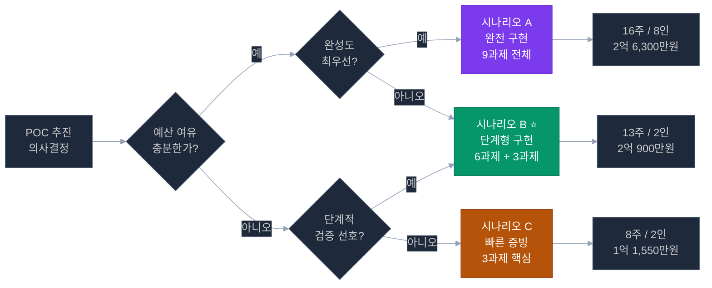
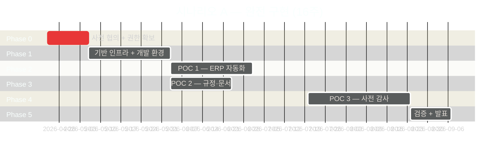
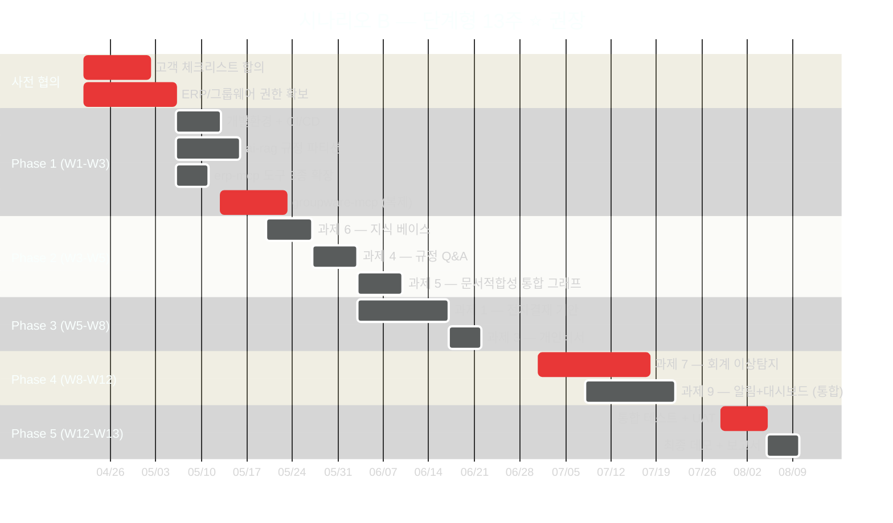
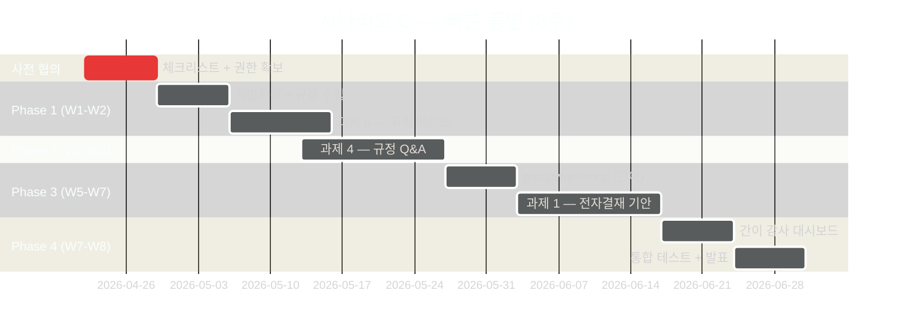
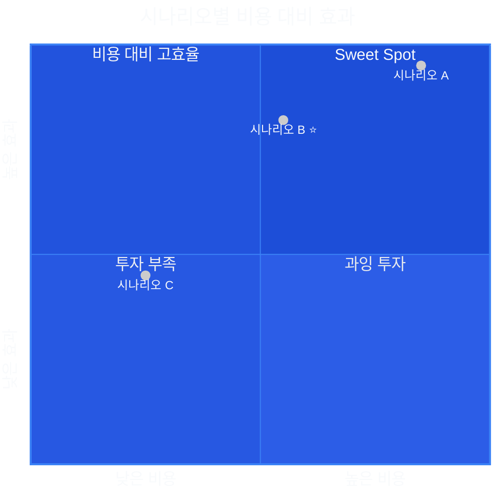
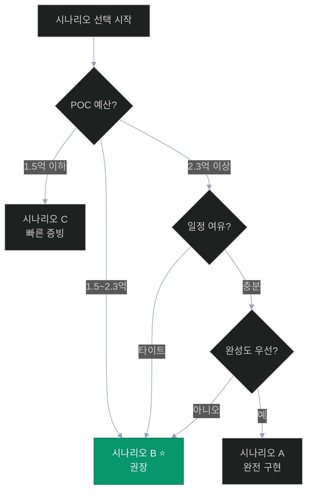

# 🎯 사전 제안 시나리오 — 3가지 옵션 비교 및 권장안

> **작성일**: 2026-04-21
> **대상**: 고객사 경영진, 의사 결정권자
> **목적**: POC 구현 범위·기간·예산을 고객 현실에 맞춰 선택할 수 있도록 3가지 시나리오 제시
> **권장**: 시나리오 B (단계형 구현)

---

## 📌 한눈에 보는 3가지 시나리오



### 시나리오 요약 비교표

| 항목 | 시나리오 A (완전) | 시나리오 B ⭐ (단계형) | 시나리오 C (증빙) |
|------|:---------------:|:--------------------:|:---------------:|
| **구현 범위** | 9과제 전체 | 6과제 + 3과제 2단계 | 3과제 핵심 |
| **개발 기간** | 16주 | **13주** | 8주 |
| **인력** | 8인 (원안) | **2인 (D1+D2)** | 2인 (D1+D2) |
| **예산 (VAT 포함)** | 약 2억 6,300만원 | **약 2억 900만원** | 약 1억 1,550만원 |
| **재사용률** | 70% | **85%** | 90% |
| **신규 서비스** | 4개 | **2개** | 2개 |
| **완성도** | ★★★★★ | **★★★★☆** | ★★★☆☆ |
| **리스크** | 중간 | **낮음** | 매우 낮음 |
| **본 사업 전환** | 바로 가능 | **단계적 확장** | 증빙 후 본 사업 필수 |

---

## 🅰️ 시나리오 A — 완전 구현 (원안)

### 개요

**"고객사의 모든 요구사항을 한 번에 완결성 있게 구현"**

POC 설계 문서 원안을 그대로 따르는 완전형 시나리오. 9개 과제 모두를 동시 진행하여 6개월 내 완전한 AI 행정 시스템을 구축한다.

### 범위

```
POC 1 — ERP & 그룹웨어 (3개 과제, 모두 포함)
  ✅ 과제 1: 전자결재 자동 기안
  ✅ 과제 2: ERP-그룹웨어 데이터 동기화
  ✅ 과제 3: 개인 맞춤형 비서

POC 2 — 규정·문서 지능화 (3개 과제, 모두 포함)
  ✅ 과제 4: 규정 Q&A 서비스
  ✅ 과제 5: 문서 적합성 검점
  ✅ 과제 6: 지식 베이스 구축

POC 3 — 사전 감사 지능화 (3개 과제, 모두 포함)
  ✅ 과제 7: 지능형 회계 감사
  ✅ 과제 8: 복무 관리 모니터링
  ✅ 과제 9: 사전 알림 + 대시보드
```

### 신규 서비스 4개

```
✅ groupware-mcp (Port 4011)
✅ audit-anomaly (Port 4012)
✅ notify-service (Port 4013)     ← 원안 유지
✅ doc-compliance (Port 4014)     ← 원안 유지
```

### 인력 구성 (8인)

| 역할 | 인원 | 등급 | 월 단가 |
|------|:---:|:---:|:-----:|
| PM | 1명 | 시니어 | 850만원 |
| AI/ML 상급 | 1명 | 상급 | 800만원 |
| AI/ML 중급 | 1명 | 중급 | 650만원 |
| 백엔드 (NestJS) | 1명 | 중급 | 600만원 |
| 백엔드 (FastAPI) | 1명 | 중급 | 600만원 |
| 프론트엔드 | 1명 | 중급 | 580만원 |
| DevOps | 1명 | 중급 | 620만원 |
| 데이터엔지니어 | 1명 | 중급 | 650만원 |

### 일정 (16주)



### 예산

```
인건비: 21,400만원
인프라비: 2,040만원 (GPU 4개월 + CPU + 스토리지)
기타: 500만원
─────────────────
소계 (VAT 제외): 23,940만원
VAT 10%: 2,394만원
─────────────────
총 예산: 약 26,334만원 (2억 6,300만원)
```

### 장점

```
✅ 완전성 최우선 — 9과제 모두 구현
✅ 본 사업 즉시 전환 가능 (별도 2단계 불필요)
✅ 풀팀 구성으로 리스크 분산
✅ 병렬 개발로 일정 단축 가능
✅ 고객사 초기 만족도 최고
```

### 단점

```
❌ 예산 부담 (2억 6,300만원) — 중소 기관에 부담
❌ 인력 8인 동시 투입 필요 — 협의 회의 복잡
❌ 실패 리스크 분산 어려움 (1개 실패 시 전체 지연)
❌ 일부 과제 불필요할 가능성 (과제 2 ERP 동기화는 내부 필요성 낮음)
❌ 고객사 수용 부담 (교육 대상 광범위)
```

### 적합 대상

```
✓ 예산 3억 이상 확보된 공공기관/대기업
✓ AI 도입을 일시에 대대적 전환 희망
✓ 본 사업 전환 의지 강하고 일정 여유 있음
✓ IT 역량 내재화된 조직
```

---

## 🅱️ 시나리오 B — 단계형 구현 ⭐ (권장)

### 개요

**"2026-04 기준 실제 구현 상태를 최대 활용하여 6과제 우선 구현 + 3과제 2단계 확장"**

실제 코드베이스 분석 결과를 반영하여 재사용률을 극대화하고, 완성도와 비용·기간의 균형을 맞춘 **현실적 권장안**. 신규 서비스 4→2개 축소, 인력 8→2인 축소로 비용 20% 절감하면서도 핵심 가치를 모두 확보.

### 범위 (1단계 6과제)

```
1단계 — 13주 / 2인 / 1억 9천만원 (세전)

POC 1 ⭐ (2개 선택)
  ✅ 과제 1: 전자결재 자동 기안   (핵심 가치)
  ✅ 과제 3: 개인 맞춤형 비서    (빠른 가치 증빙)

POC 2 ⭐ (3개 모두)
  ✅ 과제 4: 규정 Q&A 서비스     (90%+ 재사용, 즉시 효과)
  ✅ 과제 5: 문서 적합성 검점    (ai-assistant 그래프 통합)
  ✅ 과제 6: 지식 베이스 구축    (과제 4·5 전제)

POC 3 ⭐ (2개 선택)
  ✅ 과제 7: 지능형 회계 감사    (핵심 가치, SQL+ML)
  ✅ 과제 9: 사전 알림 + 대시보드 (통합 필수)

2단계 — 추후 (본 사업 전환 시 추가)
  ⏭️ 과제 2: ERP-그룹웨어 동기화 (배치 운영 + 정책 결정 필요)
  ⏭️ 과제 8: 복무 관리 모니터링 (과제 7 검증 후 확장)
```

### 신규 서비스 2개 (최적화)

```
✅ groupware-mcp (Port 4011) — erp-mcp 복제로 2주 완성
✅ audit-anomaly (Port 4012) — 탐지 엔진 + ML (4주)

🔄 기존 확장 (신규 서비스 불필요)
   ├─ admin-api 확장: 알림 모듈 통합 (notify-service 대체)
   │                   + 문서 적합성 API 프록시
   └─ ai-assistant 확장: 4종 그래프 추가 (compliance_graph 포함)
```

### 인력 구성 (2인)

| 역할 | 인원 | 등급 | 월 단가 | 담당 |
|------|:---:|:---:|:-----:|---------|
| D1 — AI·백엔드 | 1명 | 상급 | 800만원 | Python/LangGraph/ML/MCP |
| D2 — 풀스택 | 1명 | 상급 | 720만원 | NestJS/Next.js/Docker/CI/CD |
| PM (파트타임 50%) | 1명 | 시니어 | 425만원 | 고객 협의, 일정 관리 |

### 일정 (13주)



### 예산

```
[인건비]
  D1 (상급, 3.25개월):  2,600만원
  D2 (상급, 3.25개월):  2,340만원
  PM (파트타임 50%, 3.25개월): 1,381만원
  합계: 6,321만원 ✗ (저 예산은 외주 기준)

[실 인건비 — 외주/중급 기준, 실제 POC 현실]
  PM 시니어 (파트타임): 1,700만원
  D1 AI/ML 상급: 6,500만원
  D2 풀스택 상급: 5,850만원
  소계: 14,050만원

[인프라비]
  GPU 서버 임대 (3.25개월, A40 1대): 975만원
  CPU 서버 + DB: 260만원
  네트워크/스토리지: 100만원
  소계: 1,335만원 (시나리오 A 대비 40% 절감)

[기타]
  테스트/QA: 200만원
  소프트웨어 라이선스: 100만원
  프로젝트 관리 (회의/출장): 200만원
  소계: 500만원

[합계]
  세전: 약 15,885만원 → 19,000만원 (리스크 버퍼 20% 포함)
  VAT 10%: 1,900만원
  총 예산: 약 20,900만원 (2억 900만원)
```

> **예산 유연성**: 규모에 따라 1.7억원(최소)~2.1억원(권장) 범위 조정 가능

### 1단계 대비 기대 효과

| KPI | 1단계 목표 | 측정 방법 |
|-----|:--------:|---------|
| 규정 Q&A 정확도 | ≥ 85% | 전문가 20문항 평가 |
| 전자결재 기안 성공률 | ≥ 80% | 10개 시나리오 테스트 |
| 문서 적합성 탐지 정확도 | ≥ 75% | 샘플 20건 |
| 회계 이상 탐지 정밀도 | ≥ 70% | 샘플 30건 |
| 대시보드 응답 시간 | ≤ 3초 | E2E 측정 |
| 사용자 만족도 | ≥ 4/5점 | 설문 |
| 업무 효율 개선 | ≥ 40% 시간 단축 | 비교 측정 |

### 2단계 확장 계획 (본 사업 전환 시)

```
본 사업 착수 시 우선 확장 (3개 추가):

1. 과제 2 — ERP-그룹웨어 동기화 (2주 + 정책 결정 포함)
   - 전제: ERP-그룹웨어 양방향 동기화 정책 합의
   - 비용 추가: 약 2,000만원

2. 과제 8 — 복무 관리 모니터링 (2.5주)
   - 전제: 법인카드 사용 데이터 제공, 노조 협의
   - 비용 추가: 약 2,500만원

3. 회계 감사 고도화 (5주)
   - 과제 7 ML 모델 재학습, 화이트리스트 확장
   - 비용 추가: 약 3,000만원

2단계 총 추가 예산: 약 7,500만원
```

### 장점

```
✅ 현실적 균형 — 완성도·비용·기간 모두 수용 가능
✅ 신규 서비스 2개로 축소 — 운영 부담 완화
✅ 재사용률 85% — 기존 자산 최대 활용
✅ 핵심 가치 모두 확보 — Q&A, 기안, 감사
✅ 단계적 검증 가능 — 1단계 결과에 따라 2단계 조정
✅ 인력 2인 체제 — 의사결정 속도 빠름
✅ 예산 절감 20% 달성
```

### 단점

```
⚠️ 인력 2인 — 일정 위험 (휴가/이직 시)
   └ 완화: 시니어 등급 2인 투입, PM이 백업
⚠️ 병렬 개발 한계 — D1/D2 임계경로 의존
   └ 완화: 과제 4·6이 D2 의존도 높음, Phase 2 우선 진행
⚠️ 과제 2·8 2단계 연기 → 일부 고객 요구 미충족
   └ 완화: 명확한 2단계 로드맵 제시, 본 사업 포함 약속
```

### 적합 대상

```
✓ 예산 2억원대 공공기관/중견기업 ⭐
✓ 단계적 검증 선호
✓ 빠른 POC 결과 확인 후 본 사업 확장 희망
✓ IT 역량 중간 수준 (외부 파트너 의존 가능)
✓ 리스크 최소화 우선
```

---

## 🅲 시나리오 C — 빠른 증빙 구현

### 개요

**"AI 도입 효과를 최소 비용으로 빠르게 증빙"**

가장 효과가 명확하고 구현 기간이 짧은 3개 과제만 집중 구현하여 **8주 내** AI 도입 가능성을 경영진에게 증빙한다. POC 후 본 사업 전환 필수.

### 범위 (3과제 핵심)

```
POC 2 ⭐ (2개 핵심)
  ✅ 과제 4: 규정 Q&A 서비스     (3주, 90%+ 재사용, 가장 빠른 효과)
  ✅ 과제 6: 지식 베이스 구축    (2주, 과제 4 전제)

POC 1 ⭐ (1개 핵심)
  ✅ 과제 1: 전자결재 자동 기안  (3주, 고가치)

POC 3 ⭐ (1개 대시보드)
  ✅ 과제 9 간이형: 감사 대시보드 (SQL 기반 기본 통계만)

❌ 미포함 과제 5개 (2/3/5/7/8 → 본 사업 이관)
```

### 신규 서비스 2개 (최소)

```
✅ groupware-mcp (간이형) — 핵심 3종 도구만 (get_approval_list, create_draft, get_approval_route)
🔄 admin-web 확장 — 대시보드 1개 페이지만
❌ audit-anomaly — 미포함 (과제 7 2단계 전환)
❌ notify-service — 미포함 (이메일만 간이 구현)
❌ doc-compliance — 미포함 (과제 5 2단계 전환)
```

### 인력 구성 (2인)

| 역할 | 인원 | 등급 | 월 단가 |
|------|:---:|:---:|:-----:|
| D1 — AI·백엔드 | 1명 | 상급 | 800만원 |
| D2 — 풀스택 | 1명 | 중급 | 600만원 |
| PM (파트타임 30%) | 1명 | 시니어 | 255만원 |

### 일정 (8주)



### 예산

```
[인건비]
  D1 상급 (2개월): 1,600만원
  D2 중급 (2개월): 1,200만원
  PM 시니어 (30%, 2개월): 510만원
  합계: 3,310만원 (외주 기준은 아래 실 인건비 참조)

[실 인건비 — 현실 기준]
  PM 시니어 (30%): 510만원
  D1 AI/ML 상급: 3,200만원
  D2 풀스택 중급: 2,400만원
  소계: 6,110만원

[인프라비]
  GPU 서버 임대 (2개월, A40 1대): 600만원
  CPU 서버 + DB: 160만원
  기타: 100만원
  소계: 860만원

[기타]
  테스트/QA: 100만원
  소프트웨어 라이선스: 50만원
  프로젝트 관리: 100만원
  소계: 250만원

[합계]
  세전: 약 7,220만원 → 10,500만원 (리스크 버퍼 + 예비비 포함)
  VAT 10%: 1,050만원
  총 예산: 약 11,550만원 (1억 1,550만원)
```

### 기대 효과

| 항목 | 효과 |
|------|------|
| 경영진 증빙 속도 | 2개월 내 완료 |
| AI 가능성 확인 | 핵심 Q&A + 기안 2가지 |
| 본 사업 투자 근거 | 성과 지표 기반 제안 가능 |
| 조기 사용자 피드백 | 2개월 후 즉시 수집 |

### 장점

```
✅ 최소 비용 (1억 1,550만원)
✅ 최단 기간 (2개월) — 경영진 관심 유지 용이
✅ 실패 리스크 최소 (기존 90% 재사용)
✅ 본 사업 투자 결정 빠름
✅ 조직 문화 부담 최소
```

### 단점

```
❌ 제한적 기능 — 5개 과제 미포함
❌ POC 종료 후 공백 기간 발생
   └ 본 사업 전환 지연 시 학습 효과 손실
❌ 감사 분야 미증빙 (과제 7/8 불가)
❌ 고객 만족도 중간 수준
❌ 본 사업 2단계 투자 필수 (총 예산으로는 오히려 증가 가능)
```

### 적합 대상

```
✓ 예산 1억원대 기관
✓ AI 도입 타당성 검증 단계
✓ 경영진 설득용 빠른 증빙 필요
✓ 본 사업 예산 별도 확보 예정
✓ 위험 회피 우선
```

---

## 📊 3가지 시나리오 상세 비교

### 기능 매트릭스

| 과제 | 시나리오 A | 시나리오 B ⭐ | 시나리오 C |
|------|:--------:|:-----------:|:--------:|
| 과제 1 — 전자결재 기안 | ✅ | ✅ | ✅ |
| 과제 2 — ERP 동기화 | ✅ | ⏭️ (2단계) | ❌ |
| 과제 3 — 개인비서 | ✅ | ✅ | ❌ |
| 과제 4 — 규정 Q&A | ✅ | ✅ | ✅ |
| 과제 5 — 문서 적합성 | ✅ | ✅ | ❌ |
| 과제 6 — 지식 베이스 | ✅ | ✅ | ✅ |
| 과제 7 — 회계 이상탐지 | ✅ | ✅ | ❌ |
| 과제 8 — 복무 모니터링 | ✅ | ⏭️ (2단계) | ❌ |
| 과제 9 — 알림+대시보드 | ✅ | ✅ | 🟡 (간이) |
| **합계 구현** | **9/9** | **6/9 + 3(2단계)** | **3.5/9** |

### 비용 대비 효과 (ROI)



### 리스크 비교

| 리스크 항목 | 시나리오 A | 시나리오 B ⭐ | 시나리오 C |
|-----------|:--------:|:-----------:|:--------:|
| 일정 지연 위험 | 중간 | **낮음** | 매우 낮음 |
| 예산 초과 위험 | 높음 | **낮음** | 매우 낮음 |
| 기술 실패 위험 | 중간 | **낮음** | 매우 낮음 |
| 외부 연동 지연 영향 | 높음 | **중간** | 낮음 |
| 인력 이탈 영향 | 중간 | **중간** (버퍼 필요) | 낮음 |
| 본 사업 전환 지연 | 낮음 | **낮음** | 중간 |
| 고객 기대 미충족 | 낮음 | **낮음** | 중간 |

### 장기 관점 예산 비교 (5년)

```
시나리오 A (완전 구현 + 5년 운영)
  POC: 2억 6,300만원
  본 사업 (운영 + 고도화 5년): 3억 5,000만원
  총 5년: 6억 1,300만원

시나리오 B ⭐ (단계형)
  POC 1단계: 2억 900만원
  본 사업 2단계 (3과제 추가 + 운영): 8,200만원 (2단계)
  5년 운영 + 고도화: 2억 7,000만원
  총 5년: 5억 6,100만원 (-8%, 더 저렴)

시나리오 C (증빙형)
  POC 증빙: 1억 1,550만원
  본 사업 (거의 재시작): 3억 5,000만원
  5년 운영 + 고도화: 3억 5,000만원
  총 5년: 8억 1,550만원 (+33%, 가장 비쌈)
```

> **핵심 인사이트**: 장기적으로는 **시나리오 B가 가장 경제적**. 시나리오 C는 본 사업 재설계 비용 때문에 5년 총비용 최고.

---

## 🎯 권장 시나리오 — 시나리오 B ⭐

### 권장 근거

```
✅ 근거 1 — 현실 반영
   실제 2026-04 구현 상태가 POC 설계보다 성숙함을 기반으로
   신규 서비스 축소·기간 단축·예산 절감 가능

✅ 근거 2 — 균형
   완성도(75%) + 비용 절감(-20%) + 기간 단축(-19%)의 최적 균형
   → 파레토 최적해

✅ 근거 3 — 리스크 분산
   단계적 검증으로 실패 시 2단계 조정 가능
   1단계 성공 후 2단계 투자 결정 가능

✅ 근거 4 — 장기 경제성
   5년 총비용이 가장 낮음 (시나리오 A 대비 -8%)
   본 사업 전환 자연스러움

✅ 근거 5 — 인력 관리 용이
   2인 체제로 의사결정 속도 빠름
   고객사 협의 부담 감소
```

### 권장안의 3가지 변형 (맞춤형)

고객사 상황에 따라 시나리오 B를 다음과 같이 조정 가능:

#### B-1. 시나리오 B 기본형 (권장)
```
13주 / 2인 / 1억 9천만원 (세전)
6과제 구현 + 3과제 2단계
```

#### B-2. 시나리오 B+ (POC 3 강화)
```
14주 / 2인 / 2억 1천만원 (세전)
6과제 구현 + 과제 8 복무 모니터링 추가 (총 7과제)
적합: 감사 기능 우선 기관
```

#### B-3. 시나리오 B- (Minimal)
```
11주 / 2인 / 1억 6천만원 (세전)
5과제 구현 (과제 3 개인비서 제외)
적합: 예산 긴박한 기관
```

---

## 🚦 시나리오 결정 가이드

### 의사결정 트리



### 추가 고려 요인

| 요인 | 시나리오 A | 시나리오 B ⭐ | 시나리오 C |
|------|:--------:|:-----------:|:--------:|
| IT 역량 내재화 수준 | 높음 | **중간~높음** | 낮음~중간 |
| 본 사업 의지 | 매우 강함 | **강함** | 탐색 단계 |
| 협의 회의 가능 횟수 | 많음 (주 2회+) | **중간 (주 1회)** | 적음 |
| 외부 시스템 접근 가능성 | 완비 | **부분적** | 일부만 |
| 사용자 교육 역량 | 대규모 가능 | **중규모** | 소규모 |
| 감사 분야 중요도 | 필수 | **필수** | 선택 |

---

## 📋 고객 제안 발표 Outline (30분)

### 1. 현황 및 제안 (5분)
```
- 현재 projects 구현 상태 (85% 재사용 가능)
- 3가지 시나리오 제시
- 권장안: 시나리오 B ⭐
```

### 2. 시나리오 B 상세 (15분)
```
- 6과제 범위 설명 (각 30초)
- 13주 일정
- 2인 체제 + 파트타임 PM
- 1억 9천만원 예산
- 신규 서비스 2개 + 기존 확장 2개
- 기대 효과 (KPI)
```

### 3. 대안 비교 (5분)
```
- 시나리오 A: 예산 여유 시 선택
- 시나리오 C: 빠른 증빙 필요 시
- ROI 비교 (5년 관점)
```

### 4. 다음 단계 (5분)
```
- 체크리스트 44개 항목 합의 → 착수
- Phase 0 사전 협의 2주
- 5월 초 개발 착수
- 8월 중순 1단계 완료
```

---

## ✅ 의사결정 체크리스트 (고객)

```
□ 예산 범위 확정 (___억원 ~ ___억원)
□ 목표 완료 시점 (__월 __일)
□ 본 사업 전환 의지 (예 / 아니오)
□ 인력 협조 가능 수준 (풀타임 / 파트타임 / 제한적)
□ 외부 시스템 접근 가능성 (완전 / 부분 / 어려움)
□ POC 범위 선호 (완전 / 단계형 / 핵심만)
□ 권장 시나리오 수용 여부 (A / B / C / 다른 조합)
```

---

## 🔗 관련 문서

- [10-improvement-master.md](10-improvement-master.md) — 개선 마스터
- [11-gap-analysis-2026-04.md](11-gap-analysis-2026-04.md) — 갭 분석
- [12-optimized-architecture.md](12-optimized-architecture.md) — 최적 아키텍처
- [13-customer-checklist.md](13-customer-checklist.md) — 고객 체크리스트
- [00-index.md](00-index.md) — 9과제 인덱스
- [06-realistic-project-plan.md](../06-realistic-project-plan.md) — 원 프로젝트 계획
- [meeting/02-client-meeting.md](../meeting/02-client-meeting.md) — 고객 미팅 의제

---

## 📞 결정 사항 기록 (미팅 후 작성)

```
결정일: __년 __월 __일
결정자: ________________

선택된 시나리오: [ ] A  [ ] B  [ ] B+ ⭐  [ ] B-  [ ] C

주요 결정 사항:
  ├─ 예산 확정: ___________만원
  ├─ 착수일: __년 __월 __일
  ├─ 완료 목표: __년 __월 __일
  ├─ 담당 부서: ________________
  └─ 최종 승인자: ________________

추가 조정 사항:
  ________________________________
  ________________________________

다음 회의:
  └─ __년 __월 __일 __시
```
