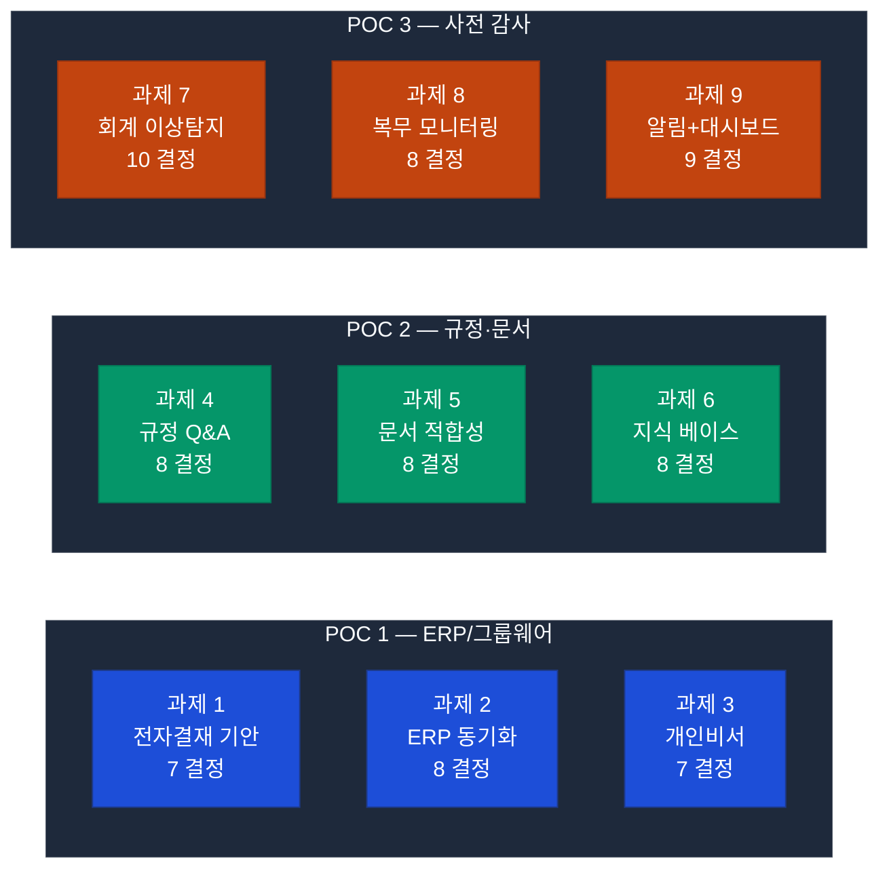
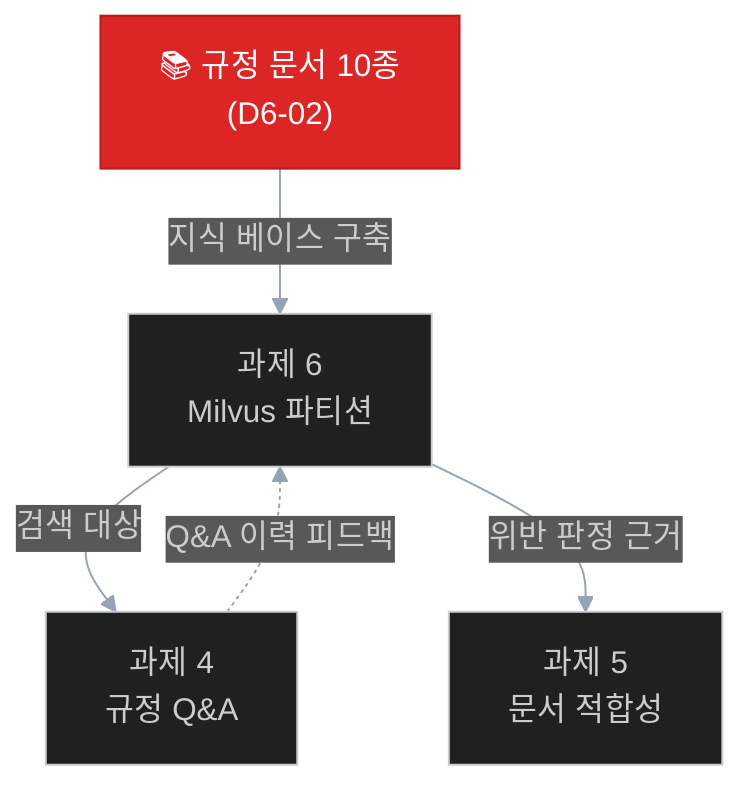
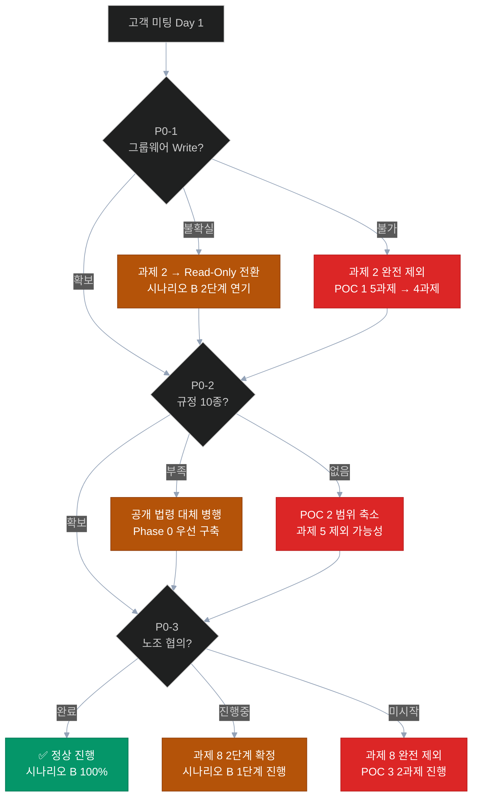
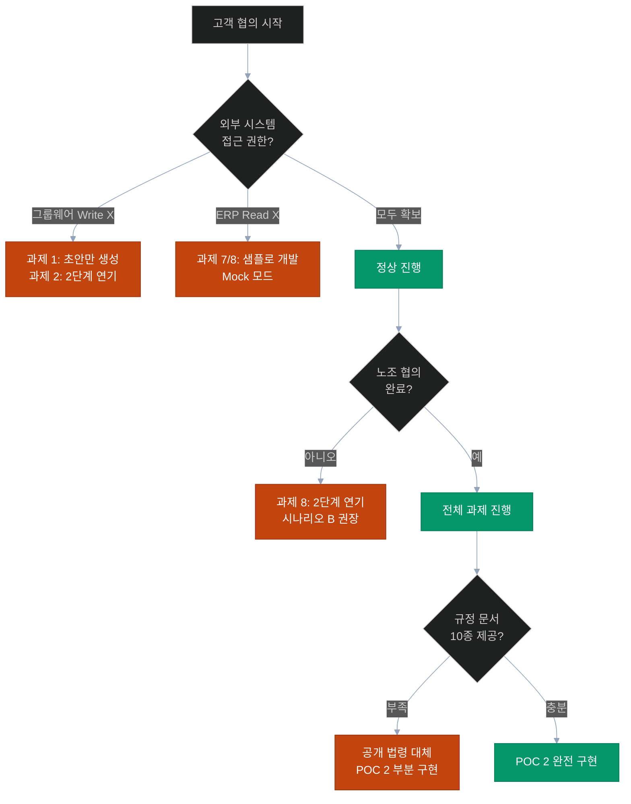

# 🎯 과제별 고객 결정 포인트 — 01~09 상세 체크리스트

> **작성일**: 2026-04-21
> **목적**: 고객과 함께 각 과제를 차례로 검토하며 **명시적으로 합의해야 할 결정사항**을 도출
> **사용법**: 고객 미팅 시 각 과제 섹션을 펼치고 항목별 합의 → 계약서/사양서 반영
> **상태 범례**: 🔄 업데이트 필요 / ⚠️ 가정 명확화 / ❓ 고객 결정 / ✅ 합의 완료

---

## 📋 문서 구성



**총 9개 과제 / 73개 결정 포인트 / 16시간 미팅 기준**

---

## 📑 각 과제별 공통 섹션 구조

각 과제는 다음 4가지 섹션으로 구성:

```
1. 🔄 2026-04-21 업데이트 필요 사항 (원본 대비 변경점)
2. ⚠️ 모호한 가정 — 명확화 필요
3. ❓ 고객 결정 포인트 (핵심!)
4. 📋 합의 체크리스트 (미팅 시 사용)
```

---

# 📌 POC 1 — ERP & 그룹웨어 지능화

---

## 🔹 과제 1 — 전자결재 자동 기안 및 분류

### 🔄 업데이트 필요 사항

| 항목 | 원본 (4/13) | 업데이트 (4/21) | 근거 |
|------|------------|-----------------|------|
| 기간 | 3주 (D1 14.5일) | **2.5주 (D1 11일)** | groupware-mcp 복제 단축 + ai-assistant 17노드 재사용 |
| 재사용률 | 70% | **85%** | classify_node, fetch_node, plan_node 이미 구현 |
| LangGraph 노드 | "3종 추가 필요" | **4종 추가** (register_draft 포함) | 기존 노드 재사용 강화 |
| 기안 카드 UI | "슬롯 패턴 확장" | **slot 패턴 신규 컴포넌트** ApprovalDraftCard | 명확화 |

### ⚠️ 모호한 가정 — 명확화 필요

| # | 원본 기술 | 명확화 필요 사항 |
|---|---------|-------------|
| 1 | "LLM 분류" (classify_doc_type) | 분류 카테고리 목록 확정 필요 (출장비/물품구매/초과근무 + ??) |
| 2 | "ERP 지출 데이터" | `get_expense_info` MCP 도구 반환 필드 확정 필요 |
| 3 | "결재선 자동 추천" | 추천 알고리즘: 직급 기반 / 부서 기반 / 과거 패턴 학습 |
| 4 | "기안 문서 초안" | 초안 품질 기준 + 수정 가능 형식 (Markdown? HWP? HTML?) |
| 5 | "register_draft" | 자동 제출 vs 초안 저장만 여부 |

### ❓ 고객 결정 포인트 (7개)

#### D1-01. 결재 문서 유형 범위 확정
```
현재 설계: 3종 (출장비 / 물품구매 / 초과근무)

결정 옵션:
  A. 3종으로 시작 → POC 완료 후 확장
  B. 5종 (+ 휴가신청 / 교육신청)
  C. 10종 (기관 주요 서식 전부)

권장: 옵션 A (POC 범위 관리)
고객 확인: "현재 기관에서 가장 빈도 높은 결재 문서 3~5종을 알려주실 수 있나요?"
합의: __________________________
```

#### D1-02. 기안 자동 등록 정책
```
현재 설계: register_draft 노드 → 그룹웨어 자동 등록

결정 옵션:
  A. 완전 자동 등록 (담당자 확인 없이)
  B. 담당자 확인 후 수정 → 수동 등록 (권장) ⭐
  C. 초안 생성만 (등록은 별도 단계)

권장: 옵션 B (사용자 신뢰 확보)
이유: AI 초안 품질 검증 기간 필요, 오등록 방지

고객 확인:
  - "AI가 자동으로 그룹웨어에 등록해도 되나요?"
  - "잘못 등록된 경우 취소/수정 절차는 어떻게 되나요?"
합의: __________________________
```

#### D1-03. 결재선 추천 알고리즘
```
현재 설계: "결재선 자동 추천" (상세 미정)

결정 옵션:
  A. 규칙 기반 (금액 구간 × 부서 매핑 테이블)
  B. 과거 패턴 학습 (해당 직원의 최근 결재선)
  C. 하이브리드 (기본 규칙 + 패턴 보정) ⭐

권장: 옵션 C

고객 확인:
  - "결재선 규칙이 명문화된 기준표가 있나요?"
  - "최근 1년치 결재 이력 데이터를 학습용으로 제공 가능한가요?"
합의: __________________________
```

#### D1-04. 기안 문서 품질 기준
```
결정 옵션:
  A. AI 생성 초안 그대로 제출 (품질 낮을 수 있음)
  B. 담당자 최소 편집 후 제출 (권장) ⭐
  C. 프롬프트 튜닝으로 완성도 90%+ 추구 (비용 증가)

권장: 옵션 B

고객 확인: "AI 초안을 담당자가 최소 수정(10~20%)하는 수준을 수용할 수 있나요?"
합의: __________________________
```

#### D1-05. 기안 생성 언어 스타일
```
결정 옵션:
  A. 공식 행정 문체 (존대어 + 한자어 포함)
  B. 평이한 업무 문체
  C. 고객사 기존 샘플 문체 학습

권장: 옵션 C (Few-shot 예시 5종 제공 시)

고객 확인: "참고할 기존 기안문 샘플 5~10건을 제공 가능한가요?"
합의: __________________________
```

#### D1-06. 그룹웨어 등록 실패 시 복구 절차
```
결정 옵션:
  A. 자동 재시도 (3회) → 실패 시 사용자 알림
  B. 초안 보관 + 수동 재제출 (권장) ⭐
  C. 담당자에게 즉시 에러 보고

권장: 옵션 B

고객 확인: "등록 실패 시 초안이 유실되지 않도록 보관 위치는?"
합의: __________________________
```

#### D1-07. 첨부파일 자동 처리
```
결정 옵션:
  A. 첨부 필요 여부 AI 판단 후 요청
  B. 사용자가 수동 첨부 (권장) ⭐
  C. 첨부 없이 기안만 생성

권장: 옵션 B

고객 확인: "출장비 영수증 등 첨부가 필요한 경우 프로세스는?"
합의: __________________________
```

### 📋 과제 1 합의 체크리스트

```
□ D1-01 — 결재 문서 유형 __종 확정: __________
□ D1-02 — 자동/수동 등록 정책: [ ] 완전 자동 [ ] 담당자 확인 [ ] 초안만
□ D1-03 — 결재선 추천 알고리즘: [ ] 규칙 [ ] 학습 [ ] 하이브리드
□ D1-04 — 기안 품질 기준 합의: __________
□ D1-05 — 참고 샘플 제공 수량: ___건
□ D1-06 — 실패 시 복구 절차: __________
□ D1-07 — 첨부파일 처리: __________

[제공 데이터]
□ 최근 1년치 결재 이력 __건 (결재선 학습용)
□ 기존 기안문 샘플 __건 (문체 학습용)
□ 결재선 규칙 기준표 (문서)
□ 결재 문서 유형별 서식 __종
```

---

## 🔹 과제 2 — MCP 기반 ERP-그룹웨어 데이터 동기화

> **⚠️ 주요 결정**: 시나리오 B에서 **2단계 연기** 과제. 1단계 제외 시 본 섹션은 참고용.

### 🔄 업데이트 필요 사항

| 항목 | 원본 | 업데이트 | 근거 |
|------|------|---------|------|
| 위치 | 1단계 필수 | **2단계 권장** | 양방향 동기화 정책 결정 복잡 |
| 기간 | 2주 | **2주 (유지)** | erp-mcp 재사용 |
| 재사용률 | 65% | **75%** | erp-mcp finders/resolvers 재사용 |

### ⚠️ 모호한 가정 — 명확화 필요

| # | 원본 기술 | 명확화 필요 사항 |
|---|---------|-------------|
| 1 | "ERP → 그룹웨어 단방향" | 양방향 지원 필요성 검토 |
| 2 | "변경 데이터 탐지" | 탐지 방식: timestamp / CDC / 전체 비교 |
| 3 | "30분 주기" | 부서/조직 변경 빈도 확인 필요 |
| 4 | "인사 동기화" | 동기화 필드 목록 확정 (직급/부서/입사일 등) |

### ❓ 고객 결정 포인트 (8개)

#### D2-01. 동기화 방향 정책
```
결정 옵션:
  A. ERP → 그룹웨어 단방향 (ERP 우선) ⭐ 권장
  B. 양방향 (충돌 해결 정책 필요)
  C. 특정 필드만 양방향 (하이브리드)

권장: 옵션 A
이유: 단방향이 가장 단순하고 신뢰성 높음, 1단계 적합

고객 확인: "조직도·인사 정보의 Source of Truth는 ERP인가요 그룹웨어인가요?"
합의: __________________________
```

#### D2-02. 동기화 주기
```
결정 옵션:
  A. 실시간 (ERP Webhook 기반)
  B. 30분 주기 ⭐ 권장
  C. 일배치 (매일 새벽)
  D. 수동 트리거만

권장: 옵션 B

고객 확인: "인사 변경 후 그룹웨어에 반영되어야 하는 최대 허용 지연 시간은?"
합의: __________________________
```

#### D2-03. 동기화 대상 필드
```
결정 옵션 (조합 선택):
  [ ] 기본 인사정보 (이름, 사번, 직급, 부서)
  [ ] 조직도 (부서 구조)
  [ ] 연락처 (이메일, 전화번호)
  [ ] 직급/직책 이력
  [ ] 휴가 일수
  [ ] 결재 권한

권장: 기본 인사정보 + 조직도 + 연락처 (POC 범위)

고객 확인: "현재 그룹웨어와 ERP 중 어느 쪽이 인사 정보의 기준인가요?"
합의: __________________________
```

#### D2-04. 충돌 해결 정책
```
결정 옵션 (양방향 시):
  A. ERP 우선 (ERP 값으로 덮어쓰기)
  B. 최신 타임스탬프 우선
  C. 수동 검토 큐로 이동

권장: 옵션 A (단방향이면 불필요)

고객 확인: (양방향 선택 시만) "데이터 충돌 시 누구의 판단을 우선해야 하나요?"
합의: __________________________
```

#### D2-05. 실패 시 재시도 정책
```
결정 옵션:
  A. 자동 재시도 (exponential backoff, 최대 3회)
  B. 실패 기록 후 수동 재실행
  C. 실패 알림 + 다음 주기로 이월

권장: 옵션 A + C 혼합

합의: __________________________
```

#### D2-06. 그룹웨어 쓰기 권한 확보 (최중요) 🔴 P0-1
```
결정:
  □ 그룹웨어 API에 Write 권한 발급 가능 여부: [ ] 가능 [ ] 불가
  □ 발급 담당자: __________
  □ 발급 기한: __________
  □ 권한 범위: 조직도 / 인사정보 / 모두

합의: __________________________
```

### ❗ D2-06 미확정 시 영향 — 과제 2 전체 불가 사유

#### 왜 불가능한가? (기술적 근거)

과제 2의 핵심 MCP 도구 3종이 모두 **그룹웨어 DB/API에 쓰기 연산 수행**:

| MCP 도구 | 작업 | 필요 권한 |
|---------|------|---------|
| `sync_erp_to_groupware` | UPDATE employee, department | **WRITE 필수** |
| `update_hr_info` | UPDATE 인사 정보 | **WRITE 필수** |
| `update_org_chart` | INSERT/UPDATE 조직도 | **WRITE 필수** |

Read-Only 권한으로는:
- ✅ 불일치 **탐지만 가능** (ERP vs 그룹웨어 비교)
- ❌ 실제 **동기화 수행 불가** — 과제 2의 60% 기능 상실

#### 권한 확보 소요 기간

```
단계 1: 그룹웨어 벤더 협의 (2~4주)
  ├─ 벤더별 정책 확인 (두레이/한컴/영림원/네이버웍스)
  ├─ Write API 개방 가능 여부 (일부 벤더 제한)
  └─ 서비스 계정 발급 절차 협의

단계 2: 고객사 내부 승인 (2~3주)
  ├─ IT 보안팀 승인 (서비스 계정 생성)
  ├─ 개인정보보호 담당자 검토 (인사 정보 수정 = 민감 처리)
  └─ 최고 책임자(CISO) 최종 승인

단계 3: 네트워크/방화벽 정책 (1~2주)
  ├─ Write API 포트 허용
  ├─ IP 화이트리스트 등록
  └─ 접근 로그 설정

━━━━━━━━━━━━━━━━━━━━━━━━━━━━━━━━━━━━━
Total 예상 지연: 4~8주 (벤더 정책 + 내부 승인 병행 시)
```

#### 대안 시나리오

| 옵션 | 내용 | 과제 2 기능 | 효과 |
|------|------|:--------:|------|
| **A. Read-Only 탐지만** ⭐ | 불일치 탐지 → 관리자 수동 동기화 | 60% | 권장 (시나리오 B의 2단계 연기와 일치) |
| **B. 과제 2 완전 제외** | POC 1에서 과제 2 제거 | 0% | 과제 1/3 집중 구현 |
| **C. Mock 모드 POC** | 가상 그룹웨어로 기능 시연 | 100% (시연) | 운영 전환 시 실연동 재협의 |

**권장 결정**: 권한 확보 예상 시점에 따라
- 확보 < 2주: 정상 진행
- 확보 2~6주: 옵션 A (Phase 3 중반 전환)
- 확보 > 6주 or 불확실: 옵션 A (시나리오 B 2단계)

---

#### D2-07. 대량 변경 처리 정책
```
시나리오: 신년 조직개편으로 500명 부서 이동

결정 옵션:
  A. 배치 크기 100건 제한 + 순차 처리 ⭐
  B. 전체 한 번에 처리 (성능 위험)
  C. 관리자 수동 승인 후 처리

권장: 옵션 A

고객 확인: "연간 최대 동시 변경 건수는?"
합의: __________________________
```

#### D2-08. 동기화 로그 보관
```
결정:
  □ 로그 보관 기간: __개월 / __년
  □ 로그 접근 권한: [ ] 감사팀 [ ] IT팀 [ ] 인사팀
  □ 개인정보 마스킹 수준

합의: __________________________
```

### 📋 과제 2 합의 체크리스트

```
□ D2-01 — 동기화 방향: [ ] ERP→GW 단방향 [ ] 양방향 [ ] 선택 필드
□ D2-02 — 동기화 주기: [ ] 실시간 [ ] 30분 [ ] 일배치 [ ] 수동
□ D2-03 — 동기화 필드 목록 합의
□ D2-04 — 충돌 해결 정책 (양방향 시)
□ D2-05 — 재시도 정책
□ D2-06 — 그룹웨어 Write 권한 확보 여부: [ ] 확보 [ ] 진행중 [ ] 불가
□ D2-07 — 대량 변경 처리 임계값
□ D2-08 — 로그 보관 기간: __개월
```

---

## 🔹 과제 3 — 개인 맞춤형 비서 (일정·업무 리마인드)

### 🔄 업데이트 필요 사항

| 항목 | 원본 | 업데이트 | 근거 |
|------|------|---------|------|
| 기간 | 1.5주 (D1 7일) | **1주 (D1 4일)** | `parallel_fetch` 패턴 이미 구현 완료 |
| 재사용률 | 80% | **90%** | erp-mcp 데이터 조회 재사용 |

### ⚠️ 모호한 가정 — 명확화 필요

| # | 원본 기술 | 명확화 필요 사항 |
|---|---------|-------------|
| 1 | "오늘 처리해야 할 업무" | "오늘" 기준 시점 (당일 / 24시간 / 근무시간) |
| 2 | "우선순위 분석" | 알고리즘 기준 (마감일? 중요도? 요청자 직급?) |
| 3 | "맞춤형 가이드 생성" | 가이드 포맷 (카드/리스트/대화형) |
| 4 | "일정 조회" | 그룹웨어 일정 범위 (개인/부서/전사) |

### ❓ 고객 결정 포인트 (7개)

#### D3-01. 우선순위 알고리즘
```
결정 옵션:
  A. 마감일 중심 (D-0/D-1/D-3 단순 분류)
  B. 아이젠하워 매트릭스 (중요도 × 긴급도) ⭐
  C. 중요도 + 요청자 직급 가중치
  D. LLM 자체 판단 (불투명)

권장: 옵션 B (설명 가능성 확보)

고객 확인: "현재 담당자들이 업무 우선순위를 정하는 기준이 있나요?"
합의: __________________________
```

#### D3-02. 리마인드 발송 시점
```
결정 옵션:
  A. 사용자 요청 시만 ("오늘 업무 알려줘")
  B. 매일 09:00 자동 발송
  C. 매일 09:00 + 18:00 (당일 완료 점검)
  D. 실시간 마감 임박 알림 (1시간 전)

권장: 옵션 A + B 조합

고객 확인: "담당자들의 아침 업무 시작 루틴은 어떤가요?"
합의: __________________________
```

#### D3-03. 개인화 범위
```
결정 옵션:
  A. 사용자 기본 정보만 (부서, 직급)
  B. 과거 업무 이력 학습 (선호도 반영)
  C. 업무 패턴 학습 (자주 처리하는 유형 우선순위 ↑)

권장: 옵션 A (POC 범위), B~C는 2단계

합의: __________________________
```

#### D3-04. 업무 카테고리 범위
```
결정 옵션 (조합 선택):
  [ ] ERP 마감 업무 (결산/지급청구)
  [ ] ERP 미결재 건
  [ ] 그룹웨어 일정 (회의/출장)
  [ ] 그룹웨어 미처리 결재
  [ ] 이메일 미확인 (옵션)

권장: 처음 4개 (이메일 제외)

합의: __________________________
```

#### D3-05. 알림 전달 채널
```
결정 옵션:
  A. chat-web 카드 표시만
  B. chat-web + 그룹웨어 알림
  C. 이메일 요약 발송
  D. 모바일 푸시 (별도 개발)

권장: 옵션 A (POC 범위)

합의: __________________________
```

#### D3-06. 개인정보 표시 수준
```
결정:
  □ 이름 표시: [ ] 전체 [ ] 성만 [ ] 사번
  □ 관련자 정보 표시 (요청자 등): [ ] 실명 [ ] 익명
  □ 금액/건수 표시: [ ] 실제 [ ] 근사값

합의: __________________________
```

#### D3-07. 타인 업무 조회 가능 여부
```
결정 옵션:
  A. 본인 업무만 조회 ⭐ 권장
  B. 부하 직원 업무 조회 (부서장)
  C. 전사 업무 조회 (감사/경영진)

권장: 옵션 A (POC 범위 + 개인정보 보호)

고객 확인: "상급자가 부하 직원 업무 현황을 AI로 조회해야 할 필요가 있나요?"
합의: __________________________
```

### 📋 과제 3 합의 체크리스트

```
□ D3-01 — 우선순위 알고리즘: [ ] 마감일 [ ] 아이젠하워 [ ] 직급 [ ] LLM
□ D3-02 — 리마인드 발송 시점
□ D3-03 — 개인화 범위 (POC 기본만)
□ D3-04 — 업무 카테고리 __개 선택
□ D3-05 — 알림 채널: [ ] 채팅 [ ] 그룹웨어 [ ] 이메일
□ D3-06 — 개인정보 표시 수준
□ D3-07 — 타인 업무 조회 권한
```

---

# 📘 POC 2 — 규정·문서 지능화

---

## 🔹 과제 4 — 규정 Q&A 서비스 (대화형 RAG)

### 🔄 업데이트 필요 사항

| 항목 | 원본 | 업데이트 | 근거 |
|------|------|---------|------|
| 기간 | 2주 (D1 9일) | **1.5주 (D1 5일)** | ai-rag 8개 라우터 + rerank_client 완비 |
| 재사용률 | 90% | **95%** | 신규 개발 사실상 0 (파라미터만 조정) |

### ⚠️ 모호한 가정 — 명확화 필요

| # | 원본 기술 | 명확화 필요 사항 |
|---|---------|-------------|
| 1 | "하이브리드 검색" | BM25 가중치 + 벡터 가중치 비율 |
| 2 | "조항 번호 출처" | 조 번호 자동 파싱 정확도 (HWP 한계) |
| 3 | "답변 정확도 85%" | 측정 방법 (전문가 평가 기준표 필요) |
| 4 | "연관 규정 추천" | 추천 알고리즘 (같은 파티션 / 교차 파티션) |

### ❓ 고객 결정 포인트 (8개)

#### D4-01. 답변 범위 정책
```
결정 옵션:
  A. 규정 조항만 인용 (엄격, 해석 금지) ⭐
  B. 조항 + 실무 사례 ("다른 부서에서는...")
  C. 조항 + AI 해석 ("요점은 ~~입니다")

권장: 옵션 A + B 부분 (면책 문구 병기)
이유: 규정 해석은 법적 책임 수반, AI 해석은 리스크

고객 확인: "규정 Q&A에서 AI가 '해석'을 제공해도 되나요?"
합의: __________________________
```

#### D4-02. 면책 문구 정책
```
결정 옵션:
  A. 모든 답변에 면책 문구 강제 ("참고용, 공식 해석은 ~~부에 문의")
  B. 불확실한 답변에만 면책 문구
  C. 면책 문구 없음 (고객 요청 시)

권장: 옵션 A ⭐ 강력 권장
이유: AI 오답 시 법적 리스크 완화

고객 확인: "면책 문구 필수 표기에 동의하시나요?"
합의: __________________________
```

#### D4-03. 답변 실패 처리
```
시나리오: 규정에서 답을 찾을 수 없거나 관련 조항이 3건 미만

결정 옵션:
  A. "해당 규정에서 찾을 수 없습니다" 명시
  B. 가장 관련 있는 조항 제시 + 경고
  C. 담당자 연락처 자동 안내 ⭐

권장: 옵션 A + C (조합)

고객 확인: "각 규정 분야별 담당 부서/담당자 연락처 제공 가능한가요?"
합의: __________________________
```

#### D4-04. 답변 언어/문체
```
결정 옵션:
  A. 행정 공식 문체 (존대 + 한자어)
  B. 친근한 설명 문체 (평이한 한국어)
  C. 요약 형식 (핵심 + 상세)

권장: 옵션 A + C 조합 (공식 + 요약 구조)

합의: __________________________
```

#### D4-05. 규정 검색 범위 제한
```
결정 옵션:
  A. 전체 규정 접근 가능 (모든 담당자)
  B. 담당 분야 규정만 (부서별 제한)
  C. 직급/역할 기반 접근 (감사/인사 등)

권장: 옵션 A (POC 범위, 단순성)

고객 확인: "일반 직원이 모든 규정을 검색할 수 있어야 하나요?"
합의: __________________________
```

#### D4-06. 개인별 접근 제한
```
결정 옵션 (옵션 B~C 선택 시):
  □ 부서별 허용 규정 목록
  □ 직급별 허용 수준
  □ 감사 규정은 감사팀만

권장: POC는 옵션 A, 2단계에서 세분화

합의: __________________________
```

#### D4-07. 사용자 피드백 수집
```
결정:
  □ 답변별 평점 (1~5점)
  □ "도움이 되지 않음" 버튼
  □ 개선 의견 수집 폼
  □ 익명 vs 실명

권장: 모든 항목 + 익명 선택 가능

합의: __________________________
```

#### D4-08. Q&A 이력 자동 학습
```
결정 옵션:
  A. 평점 4/5 이상 답변만 qa_history 파티션 저장
  B. 모든 Q&A 저장 (품질 무관)
  C. 수동 검증 후 저장

권장: 옵션 A ⭐

고객 확인: "학습용 Q&A 이력은 몇 건 이상 누적되면 활용하시나요?"
합의: __________________________
```

### 📋 과제 4 합의 체크리스트

```
□ D4-01 — 답변 범위: [ ] 조항만 [ ] 조항+사례 [ ] 조항+해석
□ D4-02 — 면책 문구: [ ] 모두 [ ] 선택적 [ ] 없음
□ D4-03 — 답변 실패 처리: [ ] 알림 [ ] 담당자 연락처
□ D4-04 — 답변 문체
□ D4-05 — 규정 검색 범위 제한
□ D4-06 — 개인별 접근 제한 (POC 이후 검토)
□ D4-07 — 피드백 수집 방식
□ D4-08 — Q&A 학습 기준
```

---

## 🔹 과제 5 — 문서 적합성 검점

### 🔄 업데이트 필요 사항 (중요)

| 항목 | 원본 (4/13) | 업데이트 (4/21) | 근거 |
|------|------------|-----------------|------|
| **아키텍처** | doc-compliance 신규 서비스 (Port 4014) | **ai-assistant 그래프로 통합** ⭐ | evidence_assess_node 재사용 가능 |
| 기간 | 2.5주 (D1 9일 + D2 6.5일) | **1.5주 (D1 4일 + D2 4일)** | 신규 서비스 개발 불필요 |
| 재사용률 | 75% | **95%** | ai-assistant `compliance_graph` 신규 추가 |
| 포트 | 4014 신규 | **4014 제거** | 통합 |

### ⚠️ 모호한 가정 — 명확화 필요

| # | 원본 기술 | 명확화 필요 사항 |
|---|---------|-------------|
| 1 | "문서 유형 자동 분류" | 분류 카테고리 목록 확정 (공문서/보고서/예산서 + ??) |
| 2 | "위반 항목 평가" | 판정 기준 (엄격/관대) + 확신도 임계값 |
| 3 | "수정 제안 생성" | 제안 품질 기준 (구체적 문구 vs 방향성) |
| 4 | "점검 완료 30초" | A4 10장 기준 — 더 긴 문서는? |

### ❓ 고객 결정 포인트 (8개)

#### D5-01. 점검 대상 문서 유형 우선순위
```
현재 설계: 공문서 / 보고서 / 예산서

결정 옵션:
  A. 3종 고정 (POC) ⭐ 권장
  B. 5종 확장 (+ 기안문 / 계약서)
  C. 전체 (기관 주요 서식)

권장: 옵션 A

고객 확인: "가장 반려율 높은 문서 유형 3~5종은 무엇인가요?"
합의: __________________________
```

#### D5-02. 위반 판정 수준
```
결정 옵션:
  A. 엄격 (모든 규정 항목 체크) — 오탐 높음
  B. 중간 (필수 항목만 체크) ⭐ 권장
  C. 관대 (명백한 위반만) — 미탐 높음

권장: 옵션 B + 확신도 80%+ 항목만 표시

고객 확인: "AI가 의심되는 수준까지 경고해야 할까요, 확실한 것만?"
합의: __________________________
```

#### D5-03. 점검 결과 활용 방식
```
결정 옵션:
  A. 참고용 (담당자 판단) ⭐ 권장
  B. 결재 차단 (위반 시 제출 불가)
  C. 경고만 (결재는 허용)

권장: 옵션 A + C (경고 표시)
이유: AI 오탐 시 결재 지연 방지

고객 확인: "AI 경고를 무시하고 결재 진행 허용해도 되나요?"
합의: __________________________
```

#### D5-04. 점검 실패 시 처리
```
시나리오: HWP 파싱 실패, OCR 인식 불가

결정 옵션:
  A. 에러 메시지 + 수동 검토 안내 ⭐
  B. PDF 재업로드 요청
  C. 점검 건너뛰기 + 주의 표시

권장: 옵션 A

합의: __________________________
```

#### D5-05. 점검 소요 시간 한계
```
결정:
  □ 최대 허용 시간 (기본 30초): ___초
  □ 초과 시: [ ] 타임아웃 에러 [ ] 부분 결과 반환
  □ 진행 상황 표시 (SSE 진행률)

합의: __________________________
```

#### D5-06. 점검 결과 이력 저장
```
결정:
  □ 보관 기간: __개월
  □ 조회 권한: [ ] 본인 [ ] 부서장 [ ] 감사팀
  □ 개정 전 / 개정 후 버전 비교 가능 여부

합의: __________________________
```

#### D5-07. 다중 규정 적용 우선순위
```
시나리오: 동일 항목에 대해 상위 규정과 하위 규정이 충돌

결정 옵션:
  A. 상위 규정 우선 (법령 > 기관 규정)
  B. 최신 개정 우선 (시행일 기준)
  C. 엄격한 규정 우선 (보수적)

권장: 옵션 A + B 조합

고객 확인: "규정 우선순위 체계 문서가 있나요?"
합의: __________________________
```

#### D5-08. 오탐 피드백 루프
```
결정:
  □ "오탐" 버튼 제공 (담당자가 표시)
  □ 피드백 수집 후 프롬프트 튜닝 주기 (주간/월간)
  □ 오탐 건 화이트리스트 등록

합의: __________________________
```

### 📋 과제 5 합의 체크리스트

```
□ D5-01 — 점검 대상 문서 __종
□ D5-02 — 위반 판정 수준: [ ] 엄격 [ ] 중간 [ ] 관대
□ D5-03 — 점검 결과 활용: [ ] 참고 [ ] 차단 [ ] 경고
□ D5-04 — 파싱 실패 처리
□ D5-05 — 점검 시간 한계
□ D5-06 — 이력 보관 정책
□ D5-07 — 다중 규정 우선순위
□ D5-08 — 피드백 루프 방식
```

---

## 🔹 과제 6 — 지식 베이스 구축

### 🔄 업데이트 필요 사항

| 항목 | 원본 | 업데이트 | 근거 |
|------|------|---------|------|
| 기간 | 2주 (D1 9.5일) | **1.5주 (D1 7일)** | ai-rag upload_router 재사용 |
| 재사용률 | 95% | **97%** | tenant_router로 기관별 격리 재사용 |

### ⚠️ 모호한 가정 — 명확화 필요

| # | 원본 기술 | 명확화 필요 사항 |
|---|---------|-------------|
| 1 | "규정 문서 10종" | 정확한 10종 목록 (분야별 분포) |
| 2 | "조(Article) 단위 청킹" | 조 번호 없는 지침/매뉴얼 처리 방안 |
| 3 | "HWP → PDF 변환" | libreoffice 변환 품질 허용 수준 |
| 4 | "버전 관리" | 개정 시 이전 버전 보관 / 폐기 정책 |

### ❓ 고객 결정 포인트 (8개)

#### D6-01. 규정 문서 분야 분류 (5개 파티션)
```
현재 설계: 5 파티션 (regulation_hr / finance / general / forms / qa_history)

결정 옵션:
  A. 5 파티션 유지 ⭐
  B. 단일 파티션 (간소화)
  C. 기관별 세분화 (부서별)

권장: 옵션 A

고객 확인: "규정 문서를 어떤 체계로 분류하시나요?"
합의: 분야별 분류: __________________________
```

#### D6-02. 규정 문서 우선 10종 선정 🔴 P0-2
```
규정 분야별 권장 분포:
  ├─ 인사/복무: 3종 (복무규정, 연가지침, 출장규정)
  ├─ 회계/예산: 3종 (예산집행지침, 계약규정, 지출규정)
  ├─ 일반 행정: 2종 (공문서 작성, 보안관리)
  └─ 서식/양식: 2종 (기안 서식, 보고서 서식)

고객 확인:
  □ 제공 가능한 10종 목록: __________
  □ 제공 시점: __년 __월 __일
  □ 제공 포맷: [ ] HWP [ ] PDF [ ] DOCX [ ] 텍스트
  □ 비밀등급: [ ] 공개 [ ] 내부용 [ ] 대외비

합의: __________________________
```

### ❗ D6-02 미확정 시 영향 — POC 2 전체 지연 사유

#### 왜 POC 2 전체가 지연되는가? (의존 관계)

POC 2의 **모든 과제가 규정 지식 베이스를 전제**:



- **과제 6** (지식 베이스): 10종 직접 저장 → **0종이면 구축 불가**
- **과제 4** (Q&A): 지식 베이스에서 검색 → **검색 대상 없음**
- **과제 5** (적합성): 규정 근거로 위반 판정 → **판정 불가**

#### 왜 하필 10종인가? (통계적 근거)

| 기준 | 필요 조건 | 10종 논리 |
|------|---------|---------|
| **답변 정확도 85% 측정** | 최소 20 테스트 쿼리 | 1 규정당 평균 2~3 쿼리 × 10 = 20~30개 |
| **RAG 파티션 균형** | 3~5 분야별 2~3종 | 인사 3 + 회계 3 + 일반 2 + 서식 2 = 10 |
| **청킹 품질 검증** | 조 단위 패턴 다양성 | 규정 구조 차이 확인 (총칙/분칙/부칙) |
| **Q&A 엣지 케이스** | 모호한 조항 vs 명확한 조항 | 최소 10종은 필요한 편차 |

**5종 이하인 경우**:
- 답변 정확도 측정 불가 (통계적 유의성 부족)
- POC 성공 KPI (85%) 달성 입증 어려움
- 실제 운영 전환 시 확장성 검증 불가

#### 규정 수집 소요 기간

```
단계 1: 규정 담당 부서 협조 요청 (1~2주)
  ├─ 인사부: 복무/연가/출장 규정 (3종)
  ├─ 회계부: 예산집행/계약/지출 규정 (3종)
  ├─ 총무/일반: 공문서/보안 규정 (2종)
  └─ 서식: 기안/보고서 서식 (2종)

단계 2: 보안 등급 분류 및 승인 (1주)
  ├─ 대외비/내부용/공개 분류
  ├─ 외부 파트너 열람 허가 절차
  └─ NDA 추가 체결 (필요 시)

단계 3: 포맷 변환 (HWP → PDF 등) (0.5~1주)
  ├─ libreoffice 변환 품질 확인
  └─ 변환 실패 문서 재가공

단계 4: 초기 청킹·임베딩·품질 검증 (Phase 1 내 1주)
  ├─ 조 단위 청킹 적용
  ├─ 테스트 쿼리 20건 답변 품질 측정
  └─ 정확도 85% 미달 시 청킹 재튜닝

━━━━━━━━━━━━━━━━━━━━━━━━━━━━━━━━━━━━━
Total 예상 지연: 3~4주 (규정 수집 완료 기준)
```

#### POC 일정 영향

- **Phase 2 전체 지연**: 규정 미확보 시 과제 6→4→5 순차 3주 이상 지연
- **POC 2 기반 → POC 3 일부 영향**:
  - 과제 7 이상탐지 설명 생성 (ai-assistant → ai-rag 규정 검색)
  - 과제 5 문서 적합성 점검 연계
- **시나리오 B 기간**: 13주 → **15~16주로 지연 가능**

#### 대안 시나리오

| 옵션 | 내용 | POC 2 품질 | 효과 |
|------|------|:--------:|------|
| **A. 공개 법령 대체** ⭐ | 국가법령정보센터(law.go.kr) 행정 법령 5종 활용 | 70% | 즉시 착수 가능, 기관 규정 확보 후 교체 |
| **B. 분할 단계 구축** | Phase 0: 3종 → Phase 1: 3종 → Phase 2: 4종 | 85% | 지연 없이 점진 확대 |
| **C. POC 범위 축소** | 규정 5종 기준 (KPI 75%로 조정) | 75% | 과제 5 제외, 과제 4만 구현 |

**공개 법령 대체 리스트 (옵션 A)**:
- `국가공무원법` + `지방공무원법` (인사 기반)
- `공무원 복무규정` (복무)
- `공무원 수당 등에 관한 규정` (회계)
- `공무원 여비 규정` (출장)
- `행정 효율과 협업 촉진에 관한 규정` (공문서)

**권장 결정**: 규정 수집 진행 상황에 따라
- 수집 완료 < 1주: 정상 진행
- 수집 진행 중: 옵션 B (점진 확대)
- 수집 불가: 옵션 A (공개 법령 + 기관 규정 교체)

---

#### D6-03. HWP 비중 및 변환 정책
```
결정:
  □ HWP 비중 예상: __%
  □ 변환 방식: [ ] libreoffice [ ] 한컴 API [ ] 수동
  □ 변환 실패 시: [ ] 재제공 요청 [ ] 수동 텍스트 입력

고객 확인: "HWP 원본을 PDF로 변환해서 제공 가능한가요?"
합의: __________________________
```

#### D6-04. 규정 개정 시 업데이트 프로세스
```
결정 옵션:
  A. 개정 시마다 수동 업로드 (담당자)
  B. 정기 배치 동기화 (월간)
  C. 원본 시스템 Webhook 연동

권장: 옵션 A (POC)

고객 확인: "규정 개정 빈도는 어떻게 되나요?"
합의: __________________________
```

#### D6-05. 이전 버전 보관 정책
```
결정 옵션:
  A. 개정 시 이전 버전 삭제 (시행 중 규정만)
  B. 이전 버전 1년 보관 ⭐
  C. 영구 보관 (연도별 아카이브)

권장: 옵션 B

이유: 개정 이전 결재에 대한 과거 규정 참조 가능성

합의: __________________________
```

#### D6-06. Q&A 이력 자동 수집 기준
```
결정:
  □ 수집 기준: 평점 __/5 이상
  □ 자동 승인 vs 수동 검증: [ ] 자동 [ ] 수동
  □ 개인정보 제거 필수
  □ 수집 주기: [ ] 실시간 [ ] 일배치

권장: 평점 4/5 이상 + 수동 검증 + 일배치

합의: __________________________
```

#### D6-07. 문서 접근 권한
```
결정 옵션:
  A. 전사 공개 (모든 담당자) ⭐
  B. 부서별 접근 제한
  C. 직급별 접근 제한
  D. 개인별 세분화

권장: 옵션 A (POC 단순성)

합의: __________________________
```

#### D6-08. 검색 결과 캐싱 정책
```
결정:
  □ Redis TTL: [ ] 1시간 [ ] 24시간 ⭐ [ ] 1주 [ ] 캐싱 안함
  □ 캐시 무효화: 규정 개정 시 자동 제거
  □ 캐시 키 구성 (개인별 / 부서별 / 전역)

권장: 24시간 TTL + 규정 개정 시 파티션별 무효화

합의: __________________________
```

### 📋 과제 6 합의 체크리스트

```
□ D6-01 — 5 파티션 분류 승인
□ D6-02 — 규정 10종 목록 확정
□ D6-03 — HWP 변환 정책
□ D6-04 — 개정 업데이트 프로세스
□ D6-05 — 이전 버전 보관: __개월
□ D6-06 — Q&A 자동 수집 기준
□ D6-07 — 문서 접근 권한
□ D6-08 — 캐싱 TTL
```

---

# 🔴 POC 3 — 사전 감사 지능화

---

## 🔹 과제 7 — 지능형 회계 감사 (이상 결제 패턴 탐지)

### 🔄 업데이트 필요 사항

| 항목 | 원본 | 업데이트 | 근거 |
|------|------|---------|------|
| 기간 | 5주 (D1 19.5일) | **4.5주 (D1 18일)** | alli-audit 패키지 활용 |
| 재사용률 | 50% | **70%** | alli-audit + admin-web activities/audits 페이지 재사용 |
| 감사 결과 저장 | PostgreSQL 신규 스키마 | **alli-audit.entity 확장** | 기존 엔티티 재사용 |

### ⚠️ 모호한 가정 — 명확화 필요

| # | 원본 기술 | 명확화 필요 사항 |
|---|---------|-------------|
| 1 | "duplicate_claim 30일 이내" | 30일 기준 근거 — 고객사 정책 확인 필요 |
| 2 | "split_payment 50만원 초과" | 기준 금액 — 공공기관 결재 한도 확인 |
| 3 | "Z-Score > 2.5" | 통계적 이상치 임계값 — 튜닝 필요 |
| 4 | "Isolation Forest contamination 0.05" | 이상치 비율 5% 가정 근거 |
| 5 | "오탐율 ≤ 20%" | 화이트리스트 관리 필요성 |

### ❓ 고객 결정 포인트 (10개)

#### D7-01. 탐지 규칙 우선순위
```
현재 설계: 4종 (duplicate_claim / split_payment / amount_outlier / isolation_forest)

결정 옵션 (조합 선택):
  [✅] Rule A: duplicate_claim (중복 청구) — 필수
  [✅] Rule B: split_payment (쪼개기) — 필수
  [✅] Rule C: amount_outlier (Z-Score) — 필수
  [ ] Rule D: Isolation Forest — 2단계 선택
  [ ] Rule E: 특정 거래처 집중 — 추가
  [ ] Rule F: 휴일/야간 거래 — 추가

권장: A/B/C 필수, D는 학습 데이터 충분 시

고객 확인: "과거 감사 적발 사례에서 가장 빈도 높은 이상 유형은?"
합의: __________________________
```

#### D7-02. 탐지 주기 정책
```
결정 옵션:
  A. 일배치 (매일 07:00) ⭐ 권장
  B. 실시간 (결재 이벤트 시)
  C. 주간 배치 (매주 월요일)
  D. 하이브리드 (일배치 + 긴급 건 실시간)

권장: 옵션 A (POC 단순성)

고객 확인: "이상 결재를 얼마나 빨리 탐지해야 하나요?"
합의: __________________________
```

#### D7-03. 탐지 임계값 (중요!)
```
결정 항목:
  □ 중복 청구 탐지 기간: 30일 / __일
  □ 분할 지출 감지 기간: 7일 / __일
  □ 분할 지출 합계 기준: 50만원 / ___원
  □ Z-Score 임계값: 2.5 / __
  □ Isolation Forest 이상치 비율: 5% / __%
  □ 결재 한도 금액: ___원

고객 확인: "기관의 결재 한도와 집행 기준 금액은?"
합의: __________________________
```

#### D7-04. 오탐 허용 수준
```
결정 옵션:
  A. 보수적 (Precision 90%+, 탐지 적음)
  B. 균형 (Precision 70~80%, 탐지 중간) ⭐
  C. 공격적 (Recall 우선, 오탐 많음)

권장: 옵션 B

고객 확인: "허위 경보 (오탐) vs 미탐지 중 어느 쪽이 더 치명적인가요?"
합의: __________________________
```

#### D7-05. 탐지 후 처리 프로세스
```
결정 옵션:
  A. 알림만 (감사부서 인지)
  B. 자동 결재 차단 (위험)
  C. 알림 + 검토 요청 ⭐ 권장
  D. 관리자 승인 후 지급

권장: 옵션 C

고객 확인: "AI 탐지 결과가 실제 결재 흐름에 영향을 줘도 되나요?"
합의: __________________________
```

#### D7-06. 화이트리스트 관리
```
결정:
  □ 화이트리스트 등록 권한: [ ] 감사팀 [ ] 관리자
  □ 등록 기준: 정기 지출 / 계약 기반
  □ 승인 프로세스: [ ] 즉시 [ ] 감사팀 승인
  □ 만료 정책: [ ] 없음 [ ] 1년 자동 해제

권장: 감사팀 + 1년 자동 해제

합의: __________________________
```

#### D7-07. ML 모델 재학습 주기
```
결정 옵션 (Isolation Forest 선택 시):
  A. POC는 초기 학습만 (재학습 없음)
  B. 분기별 재학습
  C. 월간 재학습

권장: 옵션 A (POC 범위)

합의: __________________________
```

#### D7-08. 조치 이력 추적
```
결정:
  □ 탐지 → 검토 → 조치 상태 관리
  □ 상태: [발견/검토중/정상판정/조치완료]
  □ 조치 담당자 기록
  □ 처리 기한 SLA

권장: 전체 이력 alli-audit.entity로 추적

합의: __________________________
```

#### D7-09. 감사 결과 개인정보 처리
```
결정:
  □ 이름 표시: [ ] 실명 [ ] 마스킹
  □ 부서/직급 표시 수준
  □ 접근 로그 기록 (누가 언제 조회)
  □ 법률 자문 (개인정보보호법)

권장: 감사 담당자는 실명, 타자는 마스킹

고객 확인: "감사 결과를 감사팀 외 누가 조회 가능해야 하나요?"
합의: __________________________
```

#### D7-10. 탐지 대상 기간 범위
```
결정:
  □ 최근 __일 (기본 30일)
  □ 학습 데이터 기간: 최근 __개월
  □ POC 기간 데이터 부족 시 합성 데이터 사용 동의 여부

고객 확인: "감사 DB에 과거 __년치 데이터 제공 가능한가요?"
합의: __________________________
```

### 📋 과제 7 합의 체크리스트

```
□ D7-01 — 탐지 규칙 __종 확정
□ D7-02 — 탐지 주기: [ ] 일배치 [ ] 실시간 [ ] 주간
□ D7-03 — 탐지 임계값 합의:
  - 중복 청구 기간: __일
  - 분할 지출 금액: ___원
  - Z-Score 임계값: __
□ D7-04 — 오탐 허용: [ ] 보수 [ ] 균형 [ ] 공격
□ D7-05 — 탐지 후 처리 프로세스
□ D7-06 — 화이트리스트 관리 권한
□ D7-07 — ML 재학습 정책
□ D7-08 — 조치 이력 추적 체계
□ D7-09 — 개인정보 처리 정책
□ D7-10 — 데이터 제공 범위: __년 __건
```

---

## 🔹 과제 8 — 복무 관리 모니터링

> **⚠️ 주요 결정**: 시나리오 B에서는 **2단계 연기**. 노조 협의 필요성 높음.

### 🔄 업데이트 필요 사항

| 항목 | 원본 | 업데이트 | 근거 |
|------|------|---------|------|
| 기간 | 2.5주 (D1 11.5일) | **2주 (D1 10일)** | 과제 7 audit-anomaly 인프라 재사용 |
| 재사용률 | 50% | **70%** | 과제 7 구조 + alli-audit |

### ⚠️ 모호한 가정 — 명확화 필요

| # | 원본 기술 | 명확화 필요 사항 |
|---|---------|-------------|
| 1 | "destination ≠ usage_location" | 출장지·카드사용지 매칭 정밀도 (동/시/광역시) |
| 2 | "주 15시간 이상" | 초과근무 임계값 근거 |
| 3 | "자정 이후 출근" | 정상 업무 (24시간 근무제) vs 이상 구분 |
| 4 | "감사 담당자 수동 검토 부담 90% 감소" | 측정 방법 |

### ❓ 고객 결정 포인트 (8개)

#### D8-01. 탐지 대상 복무 이상 우선순위
```
결정 옵션 (조합):
  [✅] 출장-법인카드 불일치 — 필수
  [✅] 초과근무 패턴 이상 — 필수
  [ ] 근태 이상 (자정 출근) — 선택
  [ ] 휴가 미신청 결근 — 선택
  [ ] 비정상 지각/조퇴 패턴 — 추가

권장: 상위 2종 필수

고객 확인: "과거 복무 부정 사례에서 가장 많은 유형은?"
합의: __________________________
```

#### D8-02. 출장-법인카드 매칭 정밀도
```
결정 옵션:
  A. 동일 시/구 수준 (엄격)
  B. 광역시/도 수준 (관대) ⭐ 권장
  C. 반경 기반 (10km, 50km)
  D. 정확한 GPS 좌표

권장: 옵션 B
이유: 출장 기간 중 인접 지역 이동 허용

고객 확인: "출장지와 카드 사용지가 같은 시/도면 정상으로 볼까요?"
합의: __________________________
```

#### D8-03. 초과근무 이상 임계값
```
결정:
  □ 주간 초과근무 한계: 15시간 / __시간
  □ 연속 주 초과 기준: __주 연속
  □ 특정 부서 집중 기준: 부서 내 __% 이상
  □ 초과근무 승인 여부 고려 (승인된 것 제외)

고객 확인: "주 52시간제 고려 시 초과근무 임계값은?"
합의: __________________________
```

#### D8-04. 근태 자정 출근 처리
```
결정 옵션:
  A. 자정 이후 출근 전체 이상 탐지
  B. 야간 업무 부서 제외 (당직실 등)
  C. 정기 야간 근무자 화이트리스트 관리 ⭐

권장: 옵션 C

고객 확인: "24시간 근무제/당직 부서는 어디인가요?"
합의: __________________________
```

#### D8-05. 노조 협의 여부 (중요!) 🔴 P0-3
```
결정:
  □ 복무 모니터링 AI 도입에 대한 노조 의견 수렴 여부
  □ 협의 일정: __년 __월 __일
  □ 노조 반대 시 대안: [ ] 범위 축소 [ ] 익명화 [ ] 연기

권장: 사전 노조 협의 필수

합의: __________________________
```

### ❗ D8-05 미진행 시 영향 — 과제 8 2단계 연기 필수 사유

#### 왜 법적 이슈가 있는가?

과제 8은 직원의 **근태·출장·법인카드 사용 패턴을 AI가 지속 감시**:

| 탐지 항목 | 수집 데이터 | 법적 민감성 |
|---------|---------|:---------:|
| 출장-법인카드 매칭 | **개인 위치 정보 + 소비 패턴** | 🔴 매우 높음 |
| 초과근무 패턴 탐지 | 일일 근무시간 이력 (주 52시간제) | 🔴 높음 |
| 자정 출근 이상 | 출퇴근 시각 상세 기록 | 🟠 중간 |
| 휴가 미신청 결근 | 개인 사유 추정 가능 | 🟠 중간 |

#### 적용되는 법률/규정

```
1. 개인정보보호법 제23조 — 민감정보 처리
   ├─ 위치정보 + 근태 정보 = 민감정보 범주
   ├─ 별도 동의 없이 처리 불가
   └─ 개인정보영향평가(PIA) 필요 가능

2. 근로기준법 제17조 — 근로조건 명시 의무
   ├─ AI 감시 도입 = 근로조건 변경
   ├─ 단체협약 개정 가능성
   └─ 취업규칙 변경 시 근로자 대표 의견 수렴 필수

3. 근로기준법 제94조 — 취업규칙 변경 절차
   ├─ 근로자 과반수 동의 필요 (불이익 변경 시)
   ├─ 근로감시 도입 = 불이익 가능성
   └─ 미준수 시 500만원 이하 과태료

4. 헌법 제17조 — 사생활의 비밀과 자유
   └─ 과도한 근로감시 = 헌법적 가치 침해 가능
```

#### 과거 실제 사례 (국내)

| 사례 | 결과 |
|------|------|
| 2023 A사 AI 근태 감시 도입 | 노조 집단 반발 → 6개월 가동 중단 |
| 2024 B공공기관 위치 추적 도입 | 인권위 진정 → 시스템 폐기 |
| 2024 C사 근로감시 AI 도입 | 언론 보도 → 평판 타격 + 이직률 증가 |

#### 노조 미협의 시 구체적 영향

```
[즉각적 리스크]
  ❗ 노조 집단 반발 → 파업/근로위원회 제소
  ❗ 감사 업무 근거의 정당성 훼손 → 법적 효력 다툼
  ❗ 언론 이슈화 → 고객사 평판 타격

[중장기 리스크]
  ❗ 개인정보보호위원회 행정 조사 → 과태료
  ❗ 시스템 가동 중단 명령 (인권위/노동부)
  ❗ POC 완료 후에도 운영 전환 불가
  ❗ 대규모 소송 가능성 (민사/행정)

[비즈니스 영향]
  ❗ POC 예산 전액 손실 (운영 불가 시)
  ❗ AI 도입 전체 브레이크 (다른 과제까지 영향)
  ❗ 본 사업 진행 불가 → 계약 해지 위험
```

#### 협의 소요 기간

```
단계 1: 사전 커뮤니케이션 (2~3주)
  ├─ 노조 지도부 비공식 협의
  ├─ 시스템 목적·범위·개인정보 처리 방식 설명
  └─ 기초 합의 가능성 확인

단계 2: 공식 단체협약 협의 (4~6주)
  ├─ 노조 측 법률 검토
  ├─ 협약 조항 협상 (적용 범위·마스킹·접근 권한)
  └─ 노사 협의체 의결

단계 3: 취업규칙 개정 (2~4주)
  ├─ 변경안 공고
  ├─ 근로자 대표 의견 수렴 (불이익 변경 시 과반수 동의)
  └─ 고용노동부 신고

단계 4: 개인정보영향평가(PIA) (선택, 2~3주)
  └─ 개인정보보호 담당자 주관

━━━━━━━━━━━━━━━━━━━━━━━━━━━━━━━━━━━━━
Total 예상 소요: 최소 8~12주 (Phase 0~1 전체 기간과 겹침)
```

**⚠️ 핵심**: 13주 POC 내 완료 **물리적 불가능**

#### 대안 시나리오

| 옵션 | 내용 | 법적 리스크 | 효과 |
|------|------|:---------:|------|
| **A. 과제 8 완전 2단계 연기** ⭐ | 시나리오 B와 일치, 본 사업에서 구현 | 🟢 없음 | **강력 권장** |
| **B. 익명화 탐지만** | 개인식별 불가 통계만 (부서별/직급별) | 🟡 낮음 | 감사 유용성 제한적 |
| **C. 감사팀 전용 (특별 권한)** | 감사 업무 법적 근거로 협의 축소 | 🟡 중간 | 대상자 사전 공지 + 법률 자문 필수 |
| D. 무시하고 강행 | 리스크 감수 | 🔴 매우 높음 | **절대 비권장** |

**옵션 A (권장)의 진행 방식**:
```
[POC 1단계 (13주)]
  - 과제 7 회계 이상탐지만 구현
  - 노조 협의 병행 진행

[POC 후 본 사업 (12개월)]
  - 노조 협의 완료 확인
  - 과제 8 구현 착수
  - PIA 완료 후 가동
```

**옵션 B의 제약**:
- "홍길동이 출장-카드 불일치" → 탐지 불가
- "OO부서 15명 중 3명 이상치" → 탐지 가능
- 실효성 낮지만 노조 협의 없이 진행 가능

#### 협의 성사 체크리스트

```
□ 노조 대표 성명: __________________________
□ 협의 시작일: __년 __월 __일
□ 1차 협의 예정일: __년 __월 __일
□ 기본 합의 예상 시점: __년 __월 __일
□ 단체협약 개정 대상 여부: [ ] 예 [ ] 아니오
□ PIA 실시 여부: [ ] 예 [ ] 아니오
□ 법률 자문 확보: [ ] 예 [ ] 아니오
□ 노조 협의 완료 없이도 진행할 범위: __________________________
```

---

#### D8-06. 복무 데이터 개인정보 처리
```
결정:
  □ 개인정보보호위원회 영향평가 필요 여부
  □ 사내 개인정보보호 담당자 협의
  □ 마스킹 수준: [ ] 본인만 실명 [ ] 감사팀만 실명

권장: 감사팀만 실명, 타자는 사번 기반

합의: __________________________
```

#### D8-07. 탐지 결과 공개 범위
```
결정 옵션:
  A. 감사팀만 (엄격) ⭐ 권장
  B. 감사팀 + 인사팀
  C. 감사팀 + 인사팀 + 부서장
  D. 본인 + 부서장 (자기 점검)

권장: 옵션 A + 필요 시 B 확대

고객 확인: "복무 이상 탐지 결과를 본인에게도 통보해야 하나요?"
합의: __________________________
```

#### D8-08. 탐지 vs 단순 통계
```
결정 옵션:
  A. 이상 탐지만 알림 (현재 설계) ⭐
  B. 정상 패턴도 대시보드에 표시 (투명성)
  C. 본인은 전체 통계, 감사팀은 이상만

권장: 옵션 A (POC) + 2단계에서 B 검토

합의: __________________________
```

### 📋 과제 8 합의 체크리스트

```
□ D8-01 — 탐지 우선순위 __종
□ D8-02 — 출장-카드 매칭 정밀도
□ D8-03 — 초과근무 임계값: __시간
□ D8-04 — 자정 출근 처리 정책
□ D8-05 — 노조 협의 완료 여부: [ ] 완료 [ ] 진행중 [ ] 미진행
□ D8-06 — 개인정보 처리 승인 (개인정보보호 담당자 서명)
□ D8-07 — 탐지 결과 공개 범위
□ D8-08 — 통계 공개 수준
```

---

## 🔹 과제 9 — 사전 알림 + 감사 리스크 대시보드

### 🔄 업데이트 필요 사항 (중요)

| 항목 | 원본 (4/13) | 업데이트 (4/21) | 근거 |
|------|------------|-----------------|------|
| **서비스 구조** | notify-service 신규 (Port 4013) | **admin-api 모듈로 통합** ⭐ | alli-audit + SSE 패턴 재사용 |
| 기간 | 4.5주 (D2 22일) | **3주 (D2 13일)** | admin-web 기존 페이지 재사용 |
| 재사용률 | 60% | **75%** | alli-audit + dashboard/activities/audits |
| 신규 페이지 | 4개 (/audit/dashboard/anomalies/risk-score/alerts) | **2개만** (risk-score, alerts) | 기존 dashboard/activities/audits 확장 |

### ⚠️ 모호한 가정 — 명확화 필요

| # | 원본 기술 | 명확화 필요 사항 |
|---|---------|-------------|
| 1 | "임계치 도달 시 RED/ORANGE" | 임계값 산정 근거 (0.15 / 0.08) |
| 2 | "SSE 실시간 갱신" | 연결 불안정 시 대응 (폴링 fallback) |
| 3 | "이메일 + 메신저 + SSE" | 채널별 우선순위 및 백업 |
| 4 | "알림 디바운싱" | 동일 건 재알림 억제 기간 |

### ❓ 고객 결정 포인트 (9개)

#### D9-01. 알림 채널 우선순위
```
결정 옵션 (조합):
  [✅] 이메일 (SMTP) — 기본 ⭐
  [ ] 내부 메신저 (Webhook) — 선택
  [✅] 대시보드 SSE — 기본 ⭐
  [ ] SMS — 추가 (비용 발생)
  [ ] 모바일 푸시 — 2단계

권장: 이메일 + 대시보드 SSE (POC 기본)

고객 확인:
  - "SMTP 서버 정보 제공 가능한가요?"
  - "내부 메신저가 Webhook을 지원하나요?"
합의: __________________________
```

#### D9-02. 심각도별 알림 대상자
```
결정:
  RED (즉시 감사) 수신자: __________________________
    - 감사팀장 필수
    - 감사 담당자 필수
    - 부서장 [ ] 포함 [ ] 제외
  
  ORANGE (주의) 수신자: __________________________
    - 감사 담당자 필수
    - 부서장 [ ] 포함 [ ] 제외
  
  YELLOW (관찰) 수신자: __________________________
    - 감사 담당자만 (대시보드)

합의: __________________________
```

#### D9-03. 알림 임계값 설정 권한
```
결정 옵션:
  A. 전사 기본값 고정 (관리자만 변경)
  B. 부서별 조정 가능 (부서장)
  C. 수신자별 조정 가능 (개인)

권장: 옵션 A (POC)

합의: __________________________
```

#### D9-04. 알림 디바운싱 (중복 알림 억제)
```
결정:
  □ 동일 건 재알림 억제 기간: __시간 (기본 24h)
  □ 동일 부서 다수 건 통합 발송: [ ] 개별 [ ] 요약
  □ 알림 누적 시 요약 발송 (일 __건 이상)

권장: 24시간 디바운싱 + 일 5건 이상 요약

합의: __________________________
```

#### D9-05. 대시보드 접근 권한
```
결정 옵션:
  A. 감사팀만 (엄격) ⭐
  B. 감사팀 + 감사 관리자
  C. 감사팀 + 부서장 (본인 부서만)
  D. 감사팀 + 경영진

권장: 옵션 A (POC)

고객 확인: "대시보드를 감사팀 외 누가 봐야 하나요?"
합의: __________________________
```

#### D9-06. 부서별 리스크 공개 범위
```
결정 옵션:
  A. 실제 부서명 공개 (감사팀 내부)
  B. 익명화 (부서A, 부서B)
  C. 감사팀 실명, 외부 공유 시 익명화

권장: 옵션 C

합의: __________________________
```

#### D9-07. 메신저 Webhook 제공
```
결정:
  □ 사용 중인 메신저: __________
  □ Webhook 지원: [ ] 예 [ ] 아니오
  □ Webhook URL 발급 담당자: __________
  □ 발급 기한: __________

대안 (Webhook 미제공 시):
  - 이메일만 사용
  - 2단계에서 그룹웨어 직접 연동

합의: __________________________
```

#### D9-08. SMTP 서버 제공
```
결정:
  □ 내부 SMTP 서버: __________
  □ 인증 방식: [ ] PLAIN [ ] LOGIN [ ] CRAM-MD5
  □ 발송자 이메일: __________
  □ 발송 제한: 초당 __건

대안 (SMTP 미제공 시):
  - 외부 SMTP 서비스 (SendGrid, AWS SES) 검토
  - 내부망 제약 시 콘솔 출력만 (POC 한정)

합의: __________________________
```

#### D9-09. 알림 실패 시 대응
```
결정:
  □ 이메일 실패: [ ] 재시도 3회 [ ] SSE 대체 [ ] 관리자 알림
  □ SSE 연결 끊김: [ ] 폴링 fallback [ ] 재연결 시 알림 요약
  □ 알림 미수신 확인 메커니즘 (사용자 접속 로그)

권장: 재시도 3회 + SSE fallback

합의: __________________________
```

### 📋 과제 9 합의 체크리스트

```
□ D9-01 — 알림 채널 __종 선택
□ D9-02 — 심각도별 수신자 목록 확정
□ D9-03 — 임계값 설정 권한
□ D9-04 — 디바운싱 정책: __시간
□ D9-05 — 대시보드 접근 권한
□ D9-06 — 부서명 공개 정책
□ D9-07 — 메신저 Webhook URL: __________
□ D9-08 — SMTP 서버 정보: __________
□ D9-09 — 실패 시 대응 정책
```

---

# 📊 종합 체크리스트 요약

## 9개 과제 결정 포인트 (총 73개)

| 과제 | 결정 포인트 수 | 예상 협의 시간 |
|------|:-----------:|:-----------:|
| 과제 1 — 전자결재 기안 | 7개 | 90분 |
| 과제 2 — ERP 동기화 | 8개 | 60분 (2단계) |
| 과제 3 — 개인비서 | 7개 | 60분 |
| 과제 4 — 규정 Q&A | 8개 | 90분 |
| 과제 5 — 문서 적합성 | 8개 | 75분 |
| 과제 6 — 지식 베이스 | 8개 | 75분 |
| 과제 7 — 회계 이상탐지 | 10개 | 120분 ⭐ |
| 과제 8 — 복무 모니터링 | 8개 | 90분 (노조 협의 포함) |
| 과제 9 — 알림+대시보드 | 9개 | 90분 |
| **합계** | **73개** | **약 13.5시간** |

---

## 우선순위별 결정 분류

### 🔴 P0 — POC 착수 전 반드시 합의 (27개)

```
과제 1: D1-01(문서 유형), D1-02(자동등록)
과제 2: D2-06(그룹웨어 쓰기 권한) ⭐⭐⭐
과제 4: D4-01(답변 범위), D4-02(면책 문구)
과제 5: D5-03(결과 활용)
과제 6: D6-02(규정 10종), D6-03(HWP)
과제 7: D7-01(탐지 규칙), D7-03(임계값), D7-05(처리 프로세스), D7-09(개인정보)
과제 8: D8-05(노조 협의) ⭐⭐⭐, D8-06(개인정보)
과제 9: D9-07(Webhook), D9-08(SMTP)
...
```

### 🟡 P1 — Phase 0~1 중 결정 (38개)

### 🟢 P2 — POC 중 결정 가능 (8개)

---

## 🔴 P0 최우선 3대 결정 — 불가/지연 통합 요약

> **미확정 시 POC 착수 불가능하거나 범위 대폭 수정 필요**
> 이 3개 항목은 **고객 미팅 Day 1 오전**에 반드시 확정

### 3대 결정 비교표

| # | 결정 항목 | 미확정 시 결과 | 지연 기간 | 대안 존재 | 권장 조치 |
|:-:|---------|-------------|:-------:|:------:|---------|
| **P0-1** | D2-06 그룹웨어 **Write 권한** | 과제 2 **전체 불가** (60% 기능 상실) | **4~8주** | ✅ Read-Only 탐지 | Mock + 병행 협의 |
| **P0-2** | D6-02 **규정 문서 10종** | POC 2 **전체 지연** (과제 4/5/6 연쇄) | **3~4주** | ✅ 공개 법령 대체 | 분할 수집 + 공개 법령 |
| **P0-3** | D8-05 **노조 협의** | 과제 8 **법적 리스크** (시스템 중단 가능) | **8~12주** | ✅ 익명화/2단계 | **시나리오 B 2단계 연기** |

### 불가/지연 사유 요약

#### 🔴 P0-1: D2-06 — 그룹웨어 Write 권한 미확보 시

```
[기술적 불가 이유]
  과제 2의 핵심 MCP 도구 3종(sync_erp_to_groupware,
  update_hr_info, update_org_chart)이 모두 쓰기 연산 필요

[지연 사유]
  ① 그룹웨어 벤더 협의 (2~4주, 벤더별 정책)
  ② 고객사 내부 승인 (2~3주, IT+보안+CISO)
  ③ 네트워크 정책 조정 (1~2주, 방화벽+화이트리스트)

[즉각적 영향]
  ❗ 과제 2 동기화 기능 완전 상실 (60% 기능)
  ❗ Read-Only 탐지 대안은 탐지만 가능 (실제 동기화 불가)
  ❗ 관리자 수동 동기화 → 운영 비용 증가
```

#### 🔴 P0-2: D6-02 — 규정 문서 10종 미제공 시

```
[의존 관계 이유]
  POC 2의 모든 과제(4/5/6)가 규정 지식 베이스를 전제
  → 규정 없으면 Q&A/적합성 판정 불가

[10종이 필요한 근거]
  ① 답변 정확도 85% 측정에 최소 20 테스트 쿼리 필요
  ② RAG 파티션 균형 (3~5 분야 × 2~3종 = 10)
  ③ 청킹 품질 검증 (조 구조 편차 확인)
  ④ 엣지 케이스 발굴 (모호한 vs 명확한 조항)

[지연 사유]
  ① 규정 담당 부서 협조 (1~2주)
  ② 보안 등급 검토 (1주, 대외비/내부용 분류)
  ③ 포맷 변환 (0.5~1주, HWP→PDF)
  ④ 초기 청킹·품질 검증 (1주, Phase 1 내)

[연쇄 영향]
  ❗ POC 2 기반 → 과제 7 이상탐지 설명에도 영향
  ❗ 전체 POC 기간 13주 → 15~16주로 지연
  ❗ 5종 이하면 정확도 측정 통계 불가 (KPI 입증 실패)
```

#### 🔴 P0-3: D8-05 — 노조 협의 미진행 시

```
[법적 이슈 이유]
  과제 8은 직원 근태·출장·법인카드 패턴 AI 감시
  → 개인정보보호법 + 근로기준법 + 헌법적 가치 관련

[적용 법률]
  ① 개인정보보호법 제23조 (민감정보 처리)
  ② 근로기준법 제17조 (근로조건 명시)
  ③ 근로기준법 제94조 (취업규칙 변경)
  ④ 헌법 제17조 (사생활 자유)

[과거 실패 사례]
  - 2023 A사: 노조 반발로 6개월 가동 중단
  - 2024 B공공기관: 인권위 진정 → 시스템 폐기
  - 2024 C사: 언론 이슈화 + 평판 타격

[협의 소요 기간 (합계 8~12주)]
  ① 사전 커뮤니케이션 (2~3주)
  ② 단체협약 협의 (4~6주)
  ③ 취업규칙 개정 (2~4주)
  ④ PIA 평가 (선택, 2~3주)

[미진행 시 리스크]
  ❗ POC 예산 전액 손실 가능 (운영 불가 시)
  ❗ 법적 분쟁 → 과태료 + 행정 조사
  ❗ 본 사업 전환 불가 → 계약 해지 위험
  ❗ 13주 POC 내 협의 완료 물리적 불가능
```

### 조기 경고 매트릭스



### P0 3대 결정 상태별 POC 실행 가능성

| P0-1 권한 | P0-2 규정 | P0-3 노조 | POC 실행 가능성 | 권장 시나리오 |
|:--------:|:--------:|:--------:|:-------------:|-----------|
| ✅ 확보 | ✅ 확보 | ✅ 완료 | 🟢 **100% 정상** | 시나리오 B 전체 |
| ✅ 확보 | ✅ 확보 | 🟡 진행중 | 🟢 90% (과제 8만 2단계) | 시나리오 B (권장) |
| ✅ 확보 | 🟡 부족 | 🟡 진행중 | 🟡 80% (공개 법령 보완) | 시나리오 B- |
| 🟡 지연 | ✅ 확보 | 🟡 진행중 | 🟡 70% (과제 2 축소) | 시나리오 B- |
| 🟡 지연 | 🟡 부족 | 🟡 진행중 | 🟠 60% (다중 축소) | 시나리오 C (빠른 증빙) |
| ❌ 불가 | ❌ 없음 | ❌ 미시작 | 🔴 **POC 착수 불가** | 사전 협의 재개 필요 |

### ✅ 고객 미팅 Day 1 오전 필수 액션

```
09:00~09:30 — P0 3대 결정 설명 (본 섹션 기반)
09:30~10:00 — P0-1 그룹웨어 Write 권한 확인
              ├─ 현재 보유 권한 범위
              ├─ 발급 담당자·기한
              └─ 미확보 시 대안 선택
10:00~10:30 — P0-2 규정 문서 10종 상황 확인
              ├─ 제공 가능 목록
              ├─ 제공 시점
              └─ 부족 시 대체안 동의
10:30~11:00 — P0-3 노조 협의 상황 확인
              ├─ 협의 진행 여부
              ├─ 예상 완료 시점
              └─ 과제 8 처리 방침 (2단계/익명화)

11:00~ — P0 결과에 따라 시나리오 확정 및 Day 1 후반 진행
```

---

## 💡 핵심 결정 의사결정 트리



---

## 📞 고객 미팅 진행 가이드

### Day 1 — POC 1 협의 (4시간)

```
09:00~09:30  인사 + 개선방안 마스터 소개 (문서 10)
09:30~11:00  과제 1 — 전자결재 기안 (7 결정)
11:00~12:00  과제 3 — 개인비서 (7 결정)
점심
13:00~14:00  과제 2 — ERP 동기화 (8 결정, 2단계 옵션 설명)
14:00~16:00  Day 1 합의 정리 + 숙제 확인
```

### Day 2 — POC 2 협의 (4시간)

```
09:00~10:30  과제 4 — 규정 Q&A (8 결정)
10:30~11:45  과제 6 — 지식 베이스 (8 결정)
점심
13:00~14:15  과제 5 — 문서 적합성 (8 결정, 통합 아키텍처 설명)
14:15~16:00  규정 문서 샘플 검토 + 다음 단계
```

### Day 3 — POC 3 협의 (4시간)

```
09:00~11:00  과제 7 — 회계 이상탐지 (10 결정, 가장 중요)
11:00~12:30  과제 8 — 복무 모니터링 (8 결정, 노조 이슈)
점심
13:30~15:00  과제 9 — 알림+대시보드 (9 결정)
15:00~16:00  전체 합의 검토 + 계약서 반영
```

---

## 🎯 미팅 후 산출물

```
[필수 산출물]
  □ 과제별 합의서 (본 문서 기반)
  □ 기술 결정 요약표 (1페이지)
  □ 제공 데이터 목록 (수량, 기한)
  □ 외부 시스템 연동 계획 (담당자, 기한)
  □ 노조 협의 진행 계획 (과제 8 관련)

[계약서 반영]
  □ POC 범위 (시나리오 B 기준 6과제)
  □ 탐지 임계값 및 성공 기준
  □ 개인정보 처리 범위
  □ 이관 산출물 목록
```

---

## 🔗 관련 문서

- [00-index.md](00-index.md) — 과제 9선 전체 인덱스
- [10-improvement-master.md](10-improvement-master.md) — 개선방안 마스터
- [11-gap-analysis-2026-04.md](11-gap-analysis-2026-04.md) — 상세 갭 분석
- [12-optimized-architecture.md](12-optimized-architecture.md) — 최적 아키텍처
- [13-customer-checklist.md](13-customer-checklist.md) — 포괄 체크리스트 (인프라/법/보안)
- [14-pre-proposal-scenarios.md](14-pre-proposal-scenarios.md) — 3 시나리오 비교

---

## 📝 문서 활용 팁

```
1. 고객 미팅 전 — 본 문서를 고객에게 미리 공유
   → 고객이 사전 검토 후 답변 준비 가능

2. 미팅 중 — 각 과제 섹션을 화면에 띄우고 항목별 체크
   → 결정 내용을 즉시 "합의: ___" 칸에 기록

3. 미팅 후 — 합의된 내용 기반으로 계약서 부록 작성
   → 본 문서의 "합의: " 칸이 계약서 원본

4. POC 진행 중 — 애매한 상황 발생 시 본 문서 참조
   → 합의된 결정사항 근거로 의사결정
```

**끝 — 총 9개 과제 / 73개 결정 포인트**
