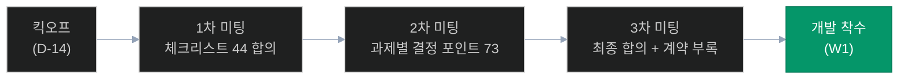

# 고객 협의 자료 — 인덱스

> **기준일**: 2026-04-22
> **대상**: 고객사 미팅 진행 및 합의 자료

---

## 📋 문서 목록

| 문서 | 용도 | 대상 |
|------|------|------|
| [checklist.md](checklist.md) | 착수 전 44개 필수 확인 항목 (인프라/법/보안/데이터) | 고객사 + PM |
| [meeting-guide.md](meeting-guide.md) | 고객 미팅 의제 + 확인 항목 + 백데이터 링크 | 고객사 미팅 |

## 관련 의사결정 문서

| 문서 | 위치 |
|------|------|
| 과제별 73 결정 포인트 | [../challenges/decisions.md](../challenges/decisions.md) |
| 사전 요건 (ERP/그룹웨어/감사) | [../04-prerequisites.md](../04-prerequisites.md) |
| 예산 상세 | [../03-budget.md](../03-budget.md) |

---

## 고객 미팅 진행 흐름

