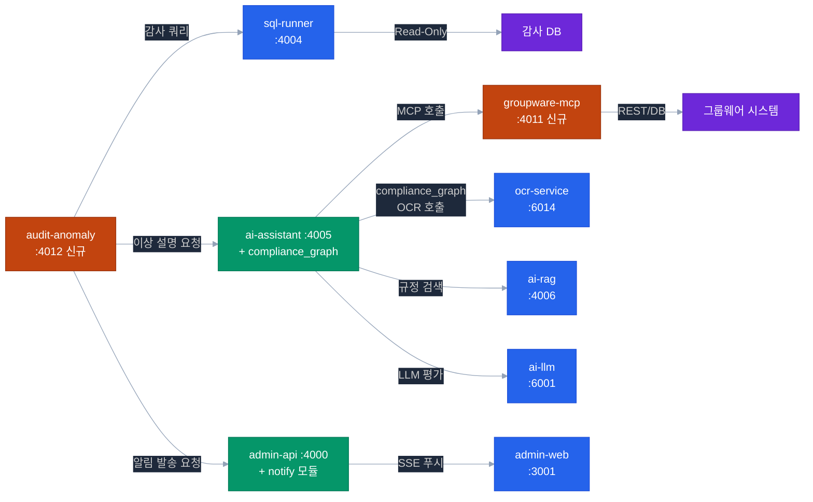

# POC 설계 문서 인덱스

> **작성일**: 2026-04-21
> **대상**: POC 구현을 위한 신규 서비스 2종 + 기존 서비스 확장 2종
> **기준**: `poc/00-overall-architecture.md`

---

## 설계 문서 목록

### 신규 서비스 (2종)

| # | 서비스 | 포트 | POC 역할 | 우선순위 | 설계 문서 |
|---|--------|:---:|---------|:-------:|---------|
| 1 | **groupware-mcp** | 4011 | 그룹웨어 전자결재/일정/인사 MCP 연동 | P0 | [→ 상세](groupware-mcp.md) |
| 2 | **audit-anomaly** | 4012 | 감사 이상 탐지 + 리스크 스코어링 엔진 | P0 | [→ 상세](audit-anomaly.md) |

### 기존 서비스 확장 (2종)

| # | 모듈/그래프 | 호스팅 서비스 | POC 역할 | 우선순위 | 설계 문서 |
|---|-----------|:-----------:|---------|:-------:|---------|
| 3 | **notify 모듈** | admin-api (:4000) | 실시간 알림 (SSE) + 이메일/메신저 발송 | P1 | [→ 상세](notify-service.md) |
| 4 | **compliance_graph** | ai-assistant (:4005) | 문서 적합성 점검 (OCR + RAG + LLM) | P1 | [→ 상세](doc-compliance.md) |

---

## 서비스 간 의존 관계



---

## 개발 일정 의존 관계

```
Phase 1 (W1-W3) — 기반
  groupware-mcp (erp-mcp 복제) — P0-1 그룹웨어 Write 권한 의존
  ai-rag 규정 파티션 구축 — P0-2 규정 문서 10종 의존

Phase 2 (W3-W5) — POC 2
  compliance_graph 구현 (ai-assistant)
  과제 4/5/6 통합

Phase 3 (W5-W8) — POC 1
  groupware-mcp MCP 도구 5종 완성
  과제 1/3 (2는 2단계 연기)

Phase 4 (W8-W12) — POC 3
  audit-anomaly 탐지 엔진 (SQL 규칙 + ML)
  admin-api notify 모듈 구현
  과제 7/9 (8은 2단계 연기 — P0-3 노조 협의)
```

**P0 3대 결정 참조**: [15-per-challenge-decision-points.md](../challenges/15-per-challenge-decision-points.md#-p0-최우선-3대-결정--불가지연-통합-요약)

---

## 공통 기술 스택

| 항목 | 선택 | 이유 |
|------|------|------|
| **Python 서비스** | Python 3.12 + FastAPI | ai-assistant, ai-rag, erp-mcp 일관성 |
| **MCP 프레임워크** | FastMCP 2.x | erp-mcp 패턴 복제 (groupware-mcp) |
| **오케스트레이션** | LangGraph | ai-assistant 멀티그래프 확장 (compliance_graph) |
| **스케줄러** | APScheduler 3.x | audit-anomaly 배치 처리 |
| **ML 라이브러리** | scikit-learn, scipy | 이상 탐지 알고리즘 |
| **NestJS 모듈** | NestJS 11 + TypeORM | admin-api notify 모듈 |
| **인증** | JWT (ES256 for MCP) | auth-api와 공유 |
| **메시지 브로커** | Redis | Pub/Sub + 캐시 |
| **컨테이너** | Docker Compose | 기존 인프라 패턴 |

---

## 공통 환경 변수

```env
# 서비스 디스커버리
AI_ASSISTANT_URL=http://ai-assistant:4005
AI_RAG_URL=http://ai-rag:4006
AI_LLM_URL=http://ai-llm:6001
SQL_RUNNER_URL=http://sql-runner:4004
ADMIN_API_URL=http://admin-api:4000
OCR_SERVICE_URL=http://ocr-service:6014

# 신규 서비스
GROUPWARE_MCP_URL=http://groupware-mcp:4011
AUDIT_ANOMALY_URL=http://audit-anomaly:4012

# 인증
JWT_SECRET=<shared-with-auth-api>
INTERNAL_API_KEY=<shared-internal-api-key>

# Redis
REDIS_HOST=redis
REDIS_PORT=6379

# 로깅
LOG_LEVEL=INFO
```

---

## 관련 문서

- [../challenges/10-improvement-master.md](../challenges/10-improvement-master.md) — POC 마스터
- [../challenges/12-optimized-architecture.md](../challenges/12-optimized-architecture.md) — 전체 아키텍처
- [../00-overall-architecture.md](../00-overall-architecture.md) — POC 전체 아키텍처
