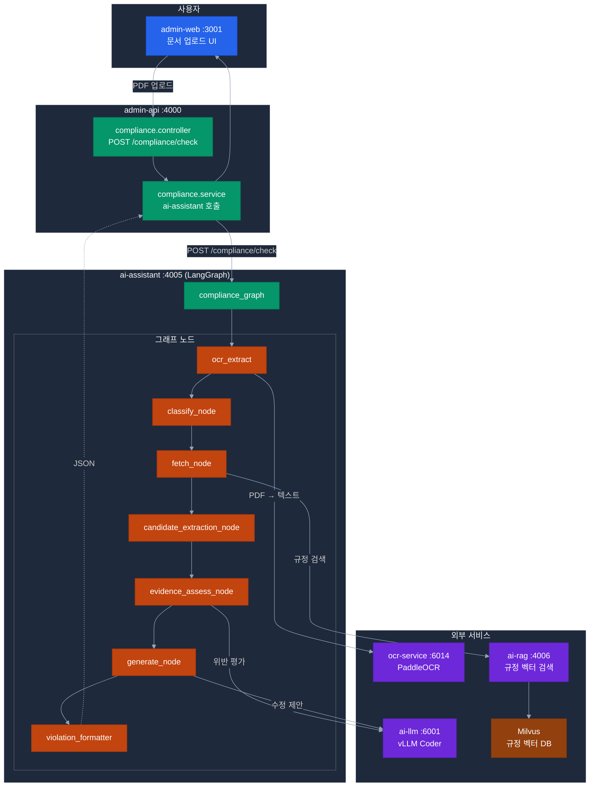
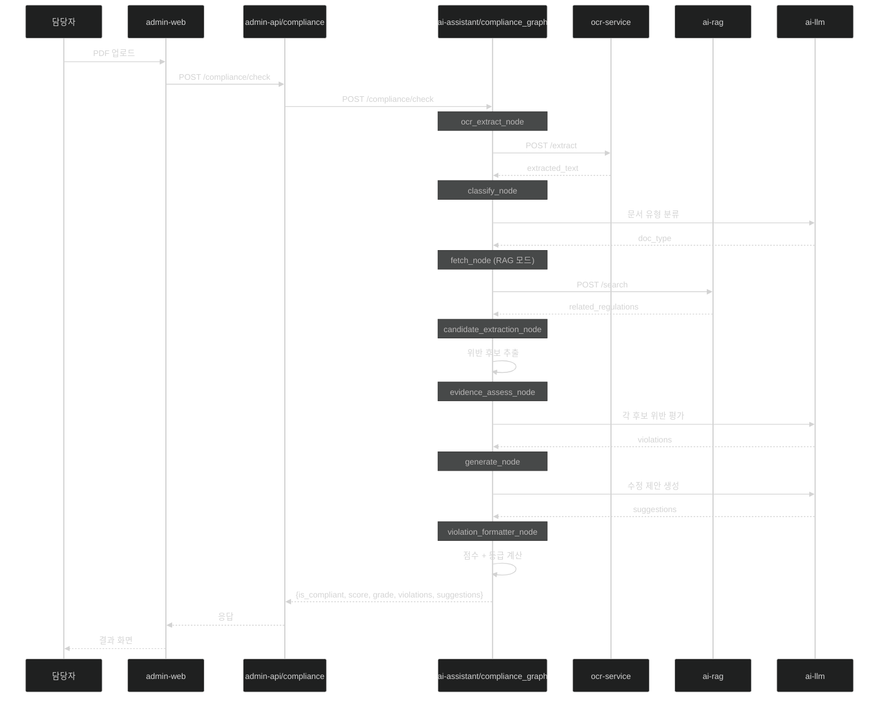

# 문서 적합성 점검 설계 (ai-assistant compliance_graph)

> **그래프 위치**: `apps/ai-assistant/src/graph/graphs/compliance_graph.py` (LangGraph)
> **호스팅**: ai-assistant (:4005)
> **우선순위**: P1
> **역할**: 행정 문서(공문서·계약서·품의서 등) 업로드 → 규정 대비 적합성 판정
> **작성일**: 2026-04-21

---

## 1. 개요

ai-assistant 내부의 LangGraph 서브 그래프. 문서 업로드 시 OCR → 문서 유형 분류 → 규정 검색 → 위반 후보 추출 → 조항별 위반 평가 → 수정 제안을 일관된 파이프라인으로 처리한다.

### 역할 및 책임

- 문서 업로드 수신 (admin-api 경유)
- OCR로 텍스트 추출 (`ocr-service` :6014 호출)
- 문서 유형 자동 분류 (공문서·계약서·품의서 등)
- `ai-rag` 규정 파티션 검색
- 조항별 위반 판정 (`evidence_assess_node`)
- 위반 항목 목록 + 수정 제안 생성 (0~100점)

---

## 2. 시스템 구성



---

## 3. 그래프 구조

### 3.1 파일 구조

```
apps/ai-assistant/src/graph/
├── orchestrator_graph.py              # 메인 오케스트레이터
├── graphs/                            # 도메인별 서브 그래프
│   ├── __init__.py
│   └── compliance_graph.py            # 문서 적합성 그래프
└── nodes/
    ├── classify_node.py               # 문서 유형 분류
    ├── fetch_node.py                  # RAG/ERP 병렬 조회
    ├── candidate_extraction_node.py   # 위반 후보 추출
    ├── evidence_assess_node.py        # 위반 평가 (핵심)
    ├── generate_node.py               # LLM 응답 생성
    ├── ocr_extract_node.py            # OCR 호출 노드
    └── violation_formatter_node.py    # 결과 포맷 변환
```

### 3.2 compliance_graph.py

```python
# apps/ai-assistant/src/graph/graphs/compliance_graph.py
from langgraph.graph import StateGraph, END
from src.graph.state import ComplianceState
from src.graph.nodes import (
    classify_node,
    fetch_node,
    candidate_extraction_node,
    evidence_assess_node,
    generate_node,
    ocr_extract_node,
    violation_formatter_node,
)


def build_compliance_graph() -> StateGraph:
    """
    문서 적합성 점검 그래프.
    입력: 문서 파일(bytes), tenant_id, doc_type(optional)
    출력: { is_compliant, score, violations[], suggestions[] }
    """
    graph = StateGraph(ComplianceState)

    graph.add_node("ocr_extract", ocr_extract_node)
    graph.add_node("classify", classify_node)
    graph.add_node("fetch_regulations", fetch_node)
    graph.add_node("extract_candidates", candidate_extraction_node)
    graph.add_node("assess_evidence", evidence_assess_node)
    graph.add_node("generate_suggestions", generate_node)
    graph.add_node("format_result", violation_formatter_node)

    graph.set_entry_point("ocr_extract")
    graph.add_edge("ocr_extract", "classify")
    graph.add_edge("classify", "fetch_regulations")
    graph.add_edge("fetch_regulations", "extract_candidates")
    graph.add_edge("extract_candidates", "assess_evidence")
    graph.add_edge("assess_evidence", "generate_suggestions")
    graph.add_edge("generate_suggestions", "format_result")
    graph.add_edge("format_result", END)

    return graph.compile()
```

### 3.3 상태 스키마

```python
# apps/ai-assistant/src/graph/state.py
from typing import Optional
from dataclasses import dataclass

@dataclass
class ComplianceState:
    # 입력
    file_bytes: bytes
    file_type: str                # pdf, docx, hwp, xlsx
    tenant_id: str
    doc_type_hint: Optional[str]

    # 중간 결과
    extracted_text: str = ""
    page_count: int = 0
    doc_type: str = ""
    doc_type_confidence: float = 0.0
    related_regulations: list = None
    violation_candidates: list = None
    violations: list = None
    suggestions: list = None

    # 출력
    is_compliant: bool = True
    score: int = 100
    grade: str = "A"
```

---

## 4. 노드 상세

### 4.1 ocr_extract_node

```python
# apps/ai-assistant/src/graph/nodes/ocr_extract_node.py
import httpx
from src.config import settings

async def ocr_extract_node(state: ComplianceState) -> dict:
    """ocr-service (:6014) 호출하여 텍스트 추출."""
    async with httpx.AsyncClient(timeout=60.0) as client:
        resp = await client.post(
            f"{settings.OCR_SERVICE_URL}/extract",
            files={"file": state.file_bytes},
            data={"file_type": state.file_type},
        )
        resp.raise_for_status()
        result = resp.json()

    return {
        "extracted_text": result["full_text"],
        "page_count": result["page_count"],
    }
```

### 4.2 classify_node

```python
# apps/ai-assistant/src/prompts/modes/compliance.py (신규 추가)
CLASSIFY_DOC_TYPE_PROMPT = """
다음 행정 문서의 유형을 분류하세요.

가능한 유형:
- 공문서 (수신, 참조, 제목 포함)
- 품의서 (품의금액, 품의사유)
- 계약서 (계약당사자, 계약금액)
- 출장명령서 (출장지, 출장기간)
- 회의록 (안건, 참석자, 결의사항)
- 입찰공고 (입찰번호, 예산금액)
- 기타

문서 내용:
{document_text}

출력 JSON: {{"doc_type": "...", "confidence": 0.0~1.0}}
"""
```

### 4.3 fetch_node (RAG 모드)

문서 유형에 따라 규정 파티션 선택:

```python
DOC_TYPE_TO_PARTITIONS = {
    "품의서": ["regulation_finance", "regulation_general"],
    "계약서": ["regulation_finance"],
    "공문서": ["regulation_general"],
    "출장명령서": ["regulation_hr", "regulation_finance"],
    "회의록": ["regulation_general"],
    "입찰공고": ["regulation_finance"],
}
```

### 4.4 candidate_extraction_node

역할: 문서 텍스트 청크에서 규정 위반 "후보" 추출.
결과: `[{chunk_text, matched_regulation, candidate_reason}]`

### 4.5 evidence_assess_node (핵심)

역할: 후보가 실제 위반인지 규정 조항 기반으로 판정.
결과: `[{is_compliant, regulation_ref, violation_detail, severity}]`

### 4.6 violation_formatter_node

```python
# apps/ai-assistant/src/graph/nodes/violation_formatter_node.py

VIOLATION_WEIGHTS = {
    "필수항목 누락": 25,
    "금액 불일치": 20,
    "결재선 오류": 15,
    "기간 오류": 15,
    "서식 불일치": 10,
    "표현 오류": 5,
}

def violation_formatter_node(state: ComplianceState) -> dict:
    """최종 결과를 JSON 스키마로 변환. 점수 + 등급."""
    violations = state.violations or []

    score = 100
    for v in violations:
        if not v["is_compliant"]:
            penalty = 20
            for vtype, weight in VIOLATION_WEIGHTS.items():
                if vtype in (v.get("violation_detail") or ""):
                    penalty = max(penalty, weight)
            score -= penalty

    score = max(0, min(100, score))
    grade = _score_to_grade(score)

    return {
        "is_compliant": score >= 70,
        "score": score,
        "grade": grade,
        "violations": violations,
        "suggestions": state.suggestions or [],
    }


def _score_to_grade(score: int) -> str:
    if score >= 90: return "A"
    if score >= 70: return "B"
    if score >= 50: return "C"
    if score >= 30: return "D"
    return "F"
```

---

## 5. 호출 흐름



---

## 6. REST API (admin-api 엔드포인트)

### 6.1 문서 점검 요청

```
POST /compliance/check
Authorization: Bearer {JWT}
Content-Type: multipart/form-data

파라미터:
  file        : (binary) 점검할 문서 파일
  docType     : (string, optional) 문서 유형 힌트
```

**응답**:
```json
{
  "checkId": "chk-uuid-v4",
  "docType": "품의서",
  "docTypeConfidence": 0.92,
  "isCompliant": false,
  "score": 72,
  "grade": "B",
  "gradeLabel": "양호",
  "processingTimeSec": 8.3,
  "violations": [
    {
      "regulationName": "물품관리법 시행령",
      "articleNo": "제15조 제1항",
      "isCompliant": false,
      "violationDetail": "품의금액이 계약금액과 일치하지 않음 (품의: 5,000,000원, 계약: 4,800,000원)",
      "suggestion": "품의금액을 실제 계약금액인 4,800,000원으로 수정하거나, 변경품의 절차를 진행하십시오.",
      "severity": "HIGH"
    }
  ],
  "compliantItems": [
    {
      "regulationName": "문서관리훈령",
      "articleNo": "제8조",
      "isCompliant": true,
      "score": 100
    }
  ],
  "regulationsApplied": ["물품관리법 시행령", "문서관리훈령", "예산회계규정"],
  "fileInfo": {
    "originalName": "2026-04-품의서-001.pdf",
    "fileSizeKb": 245,
    "pageCount": 3,
    "ocrApplied": false
  },
  "createdAt": "2026-04-21T14:30:00+09:00"
}
```

### 6.2 이력 조회

```
GET /compliance/history?page=1&limit=20
GET /compliance/history/:checkId
```

---

## 7. admin-api 구현

```typescript
// apps/admin-api/src/module/compliance/compliance.controller.ts
import { Controller, Post, UseInterceptors, UploadedFile } from '@nestjs/common';
import { FileInterceptor } from '@nestjs/platform-express';

@Controller('compliance')
export class ComplianceController {
  constructor(private readonly complianceService: ComplianceService) {}

  @Post('check')
  @UseInterceptors(FileInterceptor('file'))
  async checkDocument(
    @UploadedFile() file: Express.Multer.File,
    @Body('docType') docType: string,
    @Req() req: AuthRequest,
  ) {
    return this.complianceService.check(file, docType, req.user);
  }
}
```

```typescript
// apps/admin-api/src/module/compliance/compliance.service.ts
@Injectable()
export class ComplianceService {
  constructor(
    private readonly http: HttpService,
    private readonly auditService: AuditService,
  ) {}

  async check(file: Express.Multer.File, docType: string, user: AuthUser) {
    const form = new FormData();
    form.append('file', new Blob([file.buffer]), file.originalname);
    form.append('docType', docType || '');
    form.append('tenantId', user.tenantId);

    const resp = await this.http.axiosRef.post(
      `${AI_ASSISTANT_URL}/compliance/check`,
      form,
      { timeout: 90_000 },
    );

    await this.auditService.create({
      tenantId: user.tenantId,
      category: 'compliance_check',
      payload: resp.data,
    });

    return resp.data;
  }
}
```

---

## 8. 점수 산정 기준

| 점수 | 등급 | 레이블 | 색상 |
|:----:|:---:|:-----:|------|
| 90~100 | **A** | 적합 | 🟢 |
| 70~89 | **B** | 양호 | 🔵 |
| 50~69 | **C** | 보통 | 🟡 |
| 30~49 | **D** | 미흡 | 🟠 |
| 0~29 | **F** | 부적합 | 🔴 |

### 위반 항목별 감점

| 위반 유형 | 감점 | 예시 |
|---------|:---:|------|
| 필수항목 누락 | 25 | 기안자·문서번호·수신 누락 |
| 금액 불일치 | 20 | 품의금액 ≠ 계약금액 |
| 결재선 오류 | 15 | 전결 규정 위반 |
| 기간 오류 | 15 | 유효기간·납품기한 오류 |
| 서식 불일치 | 10 | 공식 서식 미사용 |
| 표현 오류 | 5 | 법정 용어 오사용 |

---

## 9. 규정 데이터 전제

### 9.1 Milvus 컬렉션

과제 6 (지식 베이스 구축)에서 구축된 `regulation_knowledge` 컬렉션:
- `regulation_hr` — 인사/복무 규정
- `regulation_finance` — 회계/예산 규정
- `regulation_general` — 일반 행정 규정
- `regulation_forms` — 서식/양식
- `qa_history` — 우수 Q&A 이력

### 9.2 우선순위 규정 (POC)

| 순위 | 규정명 | 대상 문서 |
|:----:|--------|---------|
| P0 | 물품관리법 시행령 | 품의서·계약서 |
| P0 | 예산회계훈령 | 품의서·지출결의서 |
| P0 | 문서관리훈령 | 공문서 전체 |
| P1 | 공무원여비규정 | 출장명령서·정산서 |
| P1 | 지방계약법 시행령 | 입찰공고·계약서 |

---

## 10. 환경 변수 (ai-assistant)

```env
OCR_SERVICE_URL=http://ocr-service:6014
AI_RAG_URL=http://ai-rag:4006
AI_LLM_URL=http://ai-llm:6001

COMPLIANCE_MAX_FILE_SIZE_MB=50
COMPLIANCE_SUPPORTED_TYPES=pdf,docx,hwp,xlsx
COMPLIANCE_TIMEOUT_SEC=90
```

---

## 11. 필요 데이터 및 문서

### 11.1 고객 사전 제공 필요

| # | 항목 | 제공 주체 | 필요 시점 |
|---|------|----------|---------|
| 1 | 주요 행정 규정 원문 (P0 3종) | 법제처/각 부서 | Phase 1 |
| 2 | 문서 서식 표준 (공문·품의서 등) | 행정지원팀 | Phase 2 |
| 3 | 부서별 결재선 규정 | 감사팀/총무팀 | Phase 2 |
| 4 | 행정 문서 샘플 (유형별 5~10건) | 각 부서 | Phase 3 |
| 5 | 적합/부적합 레이블 세트 (POC 평가용) | 감사팀 | Phase 3 |

**관련 고객 결정 포인트**: [D5-01~D5-08 과제 5 결정 8개](../challenges/15-per-challenge-decision-points.md#-과제-5--문서-적합성-검점)

---

## 12. 비기능 요건

| 항목 | 목표 |
|------|------|
| 점검 시간 (10페이지 이하) | ≤ 30초 |
| 점검 시간 (50페이지 이하) | ≤ 120초 |
| 파일 크기 한도 | 최대 50MB |
| 동시 처리 | 최대 5건 |
| 점검 정확도 | Precision ≥ 70%, Recall ≥ 80% |
| OCR 정확도 | 일반 ≥ 95%, 스캔본 ≥ 85% |
| 가용성 | 99.0% |

---

## 13. 구현 범위 (우선순위)

### P0 — 반드시 구현

- [ ] `compliance_graph.py` 작성
- [ ] `ocr_extract_node` (ocr-service 클라이언트)
- [ ] `violation_formatter_node` (점수·등급 계산)
- [ ] 기존 노드 4종 연결 (classify, fetch, candidate_extraction, evidence_assess)
- [ ] admin-api `compliance.controller` + `compliance.service`
- [ ] admin-web 문서 업로드 UI + 결과 화면

### P1 — 구현 권장

- [ ] HWP 변환 처리 (libreoffice headless)
- [ ] alli-audit 엔티티에 compliance_check 이력 저장
- [ ] 점검 결과 조회 API (`GET /compliance/history`)

### P2 — 시간 여유 시

- [ ] 비동기 점검 큐 (대용량 파일)
- [ ] Excel(.xlsx) 처리
- [ ] 점검 보고서 PDF 다운로드
- [ ] 피드백 수집 (accuracy 개선용)

---

## 14. 관련 문서

- [05-document-compliance.md](../challenges/05-document-compliance.md) — 관련 과제 5
- [06-knowledge-base.md](../challenges/06-knowledge-base.md) — 규정 지식 베이스 전제
- [04-regulation-qa.md](../challenges/04-regulation-qa.md) — 규정 Q&A 관련
- [../improvements/ai-assistant.md](../improvements/ai-assistant.md) — ai-assistant 개선 태스크
- [12-optimized-architecture.md](../challenges/12-optimized-architecture.md) — 전체 아키텍처
