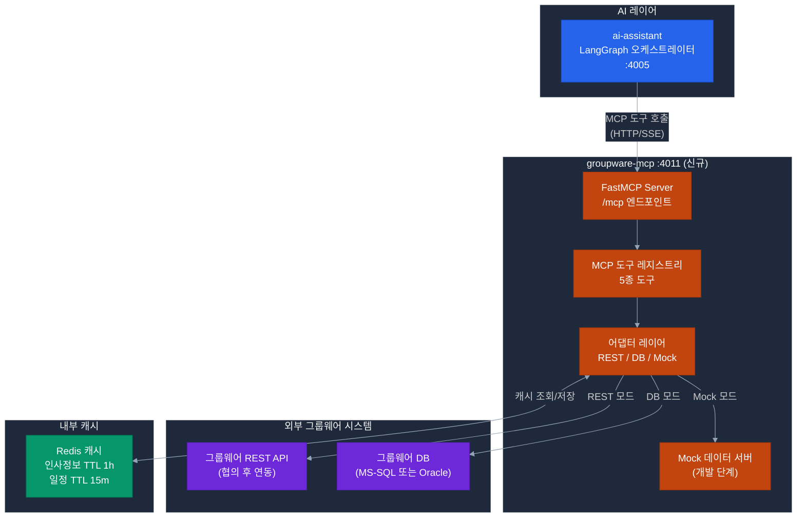

# groupware-mcp 서비스 설계 문서

> **서비스명**: groupware-mcp
> **포트**: 4011
> **기술**: Python 3.12 + FastMCP 2.x + FastAPI
> **역할**: 그룹웨어(전자결재, 일정, 인사) MCP 도구 제공
> **우선순위**: P0 — POC 1 (ERP 업무 자동화) 핵심
> **작성일**: 2026-04-21

> **📌 참조**
> - 재사용 패턴: `erp-mcp/src/mcp/`, `erp-mcp/src/security/` (JWT ES256), `erp-mcp/src/clients/sql_runner_client.py`
> - 🔴 **P0-1 결정 필수**: [그룹웨어 Write 권한 확보](../challenges/15-per-challenge-decision-points.md#-d2-06-미확정-시-영향--과제-2-전체-불가-사유) — 미확보 시 과제 2 불가
> - 관련 과제: [challenges/01-intelligent-workflow.md](../challenges/01-intelligent-workflow.md), [challenges/02-mcp-data-sync.md](../challenges/02-mcp-data-sync.md), [challenges/03-personal-assistant.md](../challenges/03-personal-assistant.md)

---

## 1. 서비스 개요

### 1.1 목적

행정기관 그룹웨어 시스템(전자결재, 개인 일정, 인사 정보)과 AI 에이전트(ai-assistant) 사이의 **MCP(Model Context Protocol) 브릿지**를 제공한다.  
ai-assistant의 LangGraph 에이전트가 MCP 도구를 호출하면, groupware-mcp가 그룹웨어 API 또는 DB에서 데이터를 조회하여 반환한다.

### 1.2 연동 방식 선택 기준

| 방식 | 조건 | 장점 | 단점 |
|------|------|------|------|
| **REST API 연동** | 그룹웨어가 API 제공 시 | 공식 인터페이스, 안정적 | API 문서 + 계정 발급 필요 |
| **DB Direct 연동** | API 미제공, DB 접근 허용 시 | 빠른 개발, 유연 | DB 스키마 파악 필요, 비공식 |
| **Mock 서버** | 협의 중 개발 병행 시 | 즉시 개발 가능 | 실제 데이터 아님 |

> POC 기간: **Mock 서버 → REST API 순으로 전환** (외부 협의 진행 상황에 따라)

---

## 2. 시스템 구성도



### 2.1 내부 컴포넌트 구조

```
apps/groupware-mcp/
├── src/
│   ├── main.py                     # FastAPI + MCP 서버 진입점
│   ├── mcp_server.py               # FastMCP 도구 등록
│   ├── tools/
│   │   ├── approval_tools.py       # 전자결재 관련 도구
│   │   ├── schedule_tools.py       # 일정 관련 도구
│   │   ├── hr_tools.py             # 인사 정보 도구
│   │   └── route_tools.py          # 결재 경로 도구
│   ├── adapters/
│   │   ├── base_adapter.py         # 어댑터 인터페이스
│   │   ├── rest_adapter.py         # REST API 어댑터
│   │   ├── db_adapter.py           # DB Direct 어댑터
│   │   └── mock_adapter.py         # Mock 데이터 어댑터
│   ├── models/
│   │   ├── approval.py             # 결재 데이터 모델
│   │   ├── schedule.py             # 일정 데이터 모델
│   │   └── hr.py                   # 인사 데이터 모델
│   ├── cache/
│   │   └── redis_cache.py          # Redis 캐시 관리
│   └── config/
│       ├── settings.py             # 환경 설정
│       └── mock_data/              # Mock 데이터 JSON 파일
│           ├── employees.json
│           ├── approvals.json
│           ├── schedules.json
│           └── routes.json
├── tests/
│   ├── test_approval_tools.py
│   └── test_mock_adapter.py
├── Dockerfile
└── pyproject.toml
```

---

## 3. MCP 도구 명세 (5종)

### TOOL-01: `get_pending_approvals`

**목적**: 담당자의 대기 중인 결재 목록 조회  
**호출 시점**: "오늘 결재할 것 있어?", 개인 비서 워크플로우

```python
@mcp.tool()
async def get_pending_approvals(
    emp_cd: str,        # 직원 코드 (예: "EMP-001")
    status: str = "pending",    # pending | all | completed
    limit: int = 10,
) -> list[dict]:
    """
    대기 중인 전자결재 목록을 반환합니다.

    Returns:
        [
            {
                "approval_id": "APPR-2026-001",
                "doc_type": "지출결의서",
                "title": "2026년 1분기 출장비 청구",
                "drafter_name": "김철수",
                "drafter_dept": "기획팀",
                "amount": 350000,
                "submitted_at": "2026-04-12T09:00:00",
                "deadline": "2026-04-15T18:00:00",
                "urgency": "normal"  # urgent | normal | low
            }
        ]
    """
```

**응답 데이터 예시**:
```json
[
  {
    "approval_id": "APPR-2026-0412-001",
    "doc_type": "지출결의서",
    "title": "외부 강사 초빙 비용 청구",
    "drafter_name": "이영희",
    "drafter_dept": "교육훈련팀",
    "amount": 1200000,
    "submitted_at": "2026-04-12T14:30:00",
    "deadline": "2026-04-14T18:00:00",
    "urgency": "urgent",
    "d_day": -1
  }
]
```

---

### TOOL-02: `create_approval_draft`

**목적**: 전자결재 기안서를 그룹웨어에 등록  
**호출 시점**: AI가 기안 초안 생성 후 사용자 확인 → 등록

```python
@mcp.tool()
async def create_approval_draft(
    doc_type: str,          # 문서 유형 (지출결의서, 출장신청서 등)
    title: str,             # 기안 제목
    content: str,           # 기안 본문
    amount: int | None,     # 금액 (원)
    approval_route: list[str],  # 결재선 ["팀장", "부장", "처장"]
    drafter_emp_cd: str,    # 기안자 직원코드
    attachments: list[str] = [],  # 첨부파일 URL 목록
) -> dict:
    """
    그룹웨어에 전자결재 기안서를 임시 등록합니다.
    실제 제출은 사용자가 그룹웨어에서 직접 확인 후 진행.
    
    Returns:
        {
            "draft_id": "DRAFT-2026-001",
            "draft_url": "http://groupware.internal/draft/DRAFT-2026-001",
            "status": "임시저장",
            "created_at": "2026-04-12T15:00:00"
        }
    """
```

---

### TOOL-03: `get_schedule`

**목적**: 담당자의 개인 일정 조회  
**호출 시점**: 개인 비서 워크플로우, 마감일 확인

```python
@mcp.tool()
async def get_schedule(
    emp_cd: str,
    target_date: str,   # YYYY-MM-DD
    days_ahead: int = 7,  # 조회 기간 (오늘부터 N일)
) -> list[dict]:
    """
    담당자의 일정 목록을 반환합니다.
    
    Returns:
        [
            {
                "schedule_id": "SCH-001",
                "title": "부서 회의",
                "start_datetime": "2026-04-13T10:00:00",
                "end_datetime": "2026-04-13T11:00:00",
                "location": "3층 대회의실",
                "type": "meeting",  # meeting | deadline | event | holiday
                "is_mandatory": true
            }
        ]
    """
```

---

### TOOL-04: `get_approval_route`

**목적**: 문서 유형별 결재 경로 추천  
**호출 시점**: 기안 생성 시 결재선 자동 구성

```python
@mcp.tool()
async def get_approval_route(
    doc_type: str,      # 지출결의서 | 출장신청서 | 휴가신청서 등
    dept_cd: str,       # 부서 코드
    amount: int | None, # 금액 (금액에 따라 결재선 변동)
) -> dict:
    """
    문서 유형과 금액에 따른 결재 경로를 반환합니다.
    
    Returns:
        {
            "route": ["팀장", "과장", "처장"],
            "route_detail": [
                {"level": 1, "position": "팀장", "name": "박민준", "emp_cd": "MGR-001"},
                {"level": 2, "position": "과장", "name": "최지영", "emp_cd": "MGR-002"},
                {"level": 3, "position": "처장", "name": "한상호", "emp_cd": "DIR-001"}
            ],
            "basis": "지출결의서 100만원 초과 — 3단계 결재 필요 (결재규정 제7조)"
        }
    """
```

---

### TOOL-05: `get_hr_info`

**목적**: 담당자 인사 정보 조회 (기안 자동 완성용)  
**호출 시점**: 기안 작성 시 기안자 정보 자동 입력

```python
@mcp.tool()
async def get_hr_info(
    emp_cd: str,
) -> dict:
    """
    직원 인사 정보를 반환합니다 (기안서 자동 완성용).
    
    Returns:
        {
            "emp_cd": "EMP-001",
            "name": "홍길동",
            "dept_cd": "DEPT-010",
            "dept_name": "예산기획팀",
            "position": "주무관",
            "grade": "6급",
            "email": "hong@agency.go.kr",
            "phone_ext": "1234",
            "supervisor_emp_cd": "MGR-001"
        }
    """
```

---

## 4. 어댑터 레이어 상세

### 4.1 REST API 어댑터 (그룹웨어 API 연동)

```python
# adapters/rest_adapter.py

class GroupwareRESTAdapter(BaseAdapter):
    """
    그룹웨어 REST API 어댑터.
    기관별 API 명세에 따라 헤더/엔드포인트 조정 필요.
    """
    
    BASE_URL = settings.GROUPWARE_API_URL  # http://groupware.internal/api/v1
    API_KEY = settings.GROUPWARE_API_KEY
    
    async def get_pending_approvals(self, emp_cd: str, **kwargs) -> list[dict]:
        response = await self.client.get(
            f"{self.BASE_URL}/approvals",
            headers={"X-API-Key": self.API_KEY, "X-Emp-Cd": emp_cd},
            params={"status": "pending", "emp_cd": emp_cd}
        )
        return self._map_approval_response(response.json())
    
    def _map_approval_response(self, raw: list) -> list[dict]:
        """기관별 API 응답 형식 → 내부 표준 형식 변환"""
        return [
            {
                "approval_id": item.get("aprvlId") or item.get("approvalId"),
                "doc_type": item.get("docType") or item.get("documentType"),
                "title": item.get("title"),
                "amount": item.get("amount", 0),
                # ... 기관별 필드명 매핑
            }
            for item in raw
        ]
```

### 4.2 Mock 어댑터 (개발/테스트 단계)

```python
# adapters/mock_adapter.py

class GroupwareMockAdapter(BaseAdapter):
    """
    개발 단계에서 그룹웨어 없이도 동작하는 Mock 어댑터.
    config/mock_data/ JSON 파일에서 데이터 로드.
    """
    
    def __init__(self):
        self.mock_data = self._load_mock_data()
    
    def _load_mock_data(self) -> dict:
        mock_dir = Path(__file__).parent.parent / "config" / "mock_data"
        return {
            "approvals": json.loads((mock_dir / "approvals.json").read_text()),
            "schedules": json.loads((mock_dir / "schedules.json").read_text()),
            "employees": json.loads((mock_dir / "employees.json").read_text()),
            "routes": json.loads((mock_dir / "routes.json").read_text()),
        }
    
    async def get_pending_approvals(self, emp_cd: str, **kwargs) -> list[dict]:
        """직원 코드 기준으로 Mock 결재 목록 반환"""
        return [
            a for a in self.mock_data["approvals"]
            if a.get("approver_emp_cd") == emp_cd
        ][:kwargs.get("limit", 10)]
```

### 4.3 어댑터 전환 설정

```python
# config/settings.py

class Settings(BaseSettings):
    # "mock" | "rest" | "db"
    GROUPWARE_MODE: str = "mock"
    
    # REST 모드
    GROUPWARE_API_URL: str = "http://groupware.internal/api/v1"
    GROUPWARE_API_KEY: str = ""
    
    # DB 모드
    GROUPWARE_DB_HOST: str = ""
    GROUPWARE_DB_PORT: int = 1433
    GROUPWARE_DB_NAME: str = ""
    GROUPWARE_DB_USER: str = ""
    GROUPWARE_DB_PASSWORD: str = ""
    
    model_config = SettingsConfigDict(env_file=".env")

def get_adapter() -> BaseAdapter:
    settings = Settings()
    match settings.GROUPWARE_MODE:
        case "rest":  return GroupwareRESTAdapter()
        case "db":    return GroupwareDBAdapter()
        case _:       return GroupwareMockAdapter()  # 기본: mock
```

---

## 5. API 엔드포인트

| Method | Path | 설명 | 인증 |
|--------|------|------|:---:|
| POST | `/mcp` | MCP SSE 연결 (FastMCP 표준) | JWT |
| GET | `/health` | 헬스체크 | 없음 |
| GET | `/tools` | 등록된 MCP 도구 목록 | JWT |
| GET | `/mode` | 현재 어댑터 모드 확인 | JWT |
| POST | `/mock/reload` | Mock 데이터 리로드 (개발용) | JWT |

---

## 6. 데이터 모델

### 6.1 결재 (Approval)

```python
from pydantic import BaseModel
from datetime import datetime
from typing import Optional
from enum import Enum

class UrgencyLevel(str, Enum):
    URGENT = "urgent"
    NORMAL = "normal"
    LOW = "low"

class ApprovalItem(BaseModel):
    approval_id: str
    doc_type: str           # 지출결의서 | 출장신청서 | 휴가신청서
    title: str
    drafter_name: str
    drafter_dept: str
    drafter_emp_cd: str
    amount: Optional[int]   # 원 단위, 금액 없는 경우 None
    submitted_at: datetime
    deadline: Optional[datetime]
    urgency: UrgencyLevel = UrgencyLevel.NORMAL
    d_day: Optional[int]    # 마감까지 남은 일수 (음수: 초과)

class ApprovalDraftResult(BaseModel):
    draft_id: str
    draft_url: Optional[str]    # 그룹웨어 링크
    status: str                 # 임시저장 | 제출완료
    created_at: datetime
```

### 6.2 일정 (Schedule)

```python
class ScheduleType(str, Enum):
    MEETING = "meeting"
    DEADLINE = "deadline"
    EVENT = "event"
    HOLIDAY = "holiday"
    VACATION = "vacation"

class ScheduleItem(BaseModel):
    schedule_id: str
    title: str
    start_datetime: datetime
    end_datetime: datetime
    location: Optional[str]
    type: ScheduleType
    is_mandatory: bool = False
    description: Optional[str]
    organizer_name: Optional[str]
```

### 6.3 결재 경로 (Approval Route)

```python
class RouteLevel(BaseModel):
    level: int              # 1 = 1차 결재자
    position: str           # 팀장 | 과장 | 처장
    name: str
    emp_cd: str

class ApprovalRoute(BaseModel):
    route: list[str]        # ["팀장", "과장", "처장"]
    route_detail: list[RouteLevel]
    basis: str              # 결재 경로 근거 규정
    estimated_days: int     # 예상 소요 일수
```

---

## 7. Mock 데이터 명세

### 7.1 `mock_data/approvals.json`

```json
[
  {
    "approval_id": "APPR-2026-0412-001",
    "doc_type": "지출결의서",
    "title": "외부 강사 초빙 비용 청구",
    "drafter_name": "이영희",
    "drafter_dept": "교육훈련팀",
    "drafter_emp_cd": "EMP-042",
    "approver_emp_cd": "EMP-001",
    "amount": 1200000,
    "submitted_at": "2026-04-12T14:30:00",
    "deadline": "2026-04-14T18:00:00",
    "urgency": "urgent",
    "d_day": -1
  },
  {
    "approval_id": "APPR-2026-0411-003",
    "doc_type": "출장신청서",
    "title": "서울 교육 참가 출장 신청",
    "drafter_name": "박준혁",
    "drafter_dept": "인사팀",
    "drafter_emp_cd": "EMP-033",
    "approver_emp_cd": "EMP-001",
    "amount": 350000,
    "submitted_at": "2026-04-11T09:00:00",
    "deadline": "2026-04-16T18:00:00",
    "urgency": "normal",
    "d_day": 3
  }
]
```

### 7.2 `mock_data/employees.json`

```json
[
  {
    "emp_cd": "EMP-001",
    "name": "홍길동",
    "dept_cd": "DEPT-010",
    "dept_name": "예산기획팀",
    "position": "주무관",
    "grade": "6급",
    "email": "hong@agency.go.kr",
    "phone_ext": "1234",
    "supervisor_emp_cd": "MGR-001"
  }
]
```

### 7.3 `mock_data/approval_routes.json`

```json
{
  "지출결의서": {
    "under_500000": {
      "route": ["팀장"],
      "basis": "결재규정 제5조 제1항"
    },
    "500000_to_1000000": {
      "route": ["팀장", "과장"],
      "basis": "결재규정 제5조 제2항"
    },
    "over_1000000": {
      "route": ["팀장", "과장", "처장"],
      "basis": "결재규정 제5조 제3항"
    }
  },
  "출장신청서": {
    "domestic": {
      "route": ["팀장", "과장"],
      "basis": "출장규정 제8조"
    },
    "overseas": {
      "route": ["팀장", "과장", "처장", "기관장"],
      "basis": "출장규정 제12조"
    }
  }
}
```

---

## 8. 외부 시스템 연동 명세

### 8.1 그룹웨어 시스템 연동

| 항목 | 내용 |
|------|------|
| **연동 대상** | 행정기관 그룹웨어 (NEIS, 온나라, 정부24, 자체 개발 그룹웨어 등) |
| **연동 방식** | REST API (우선) 또는 DB Direct |
| **인증 방식** | API Key 또는 Basic Auth |
| **필요 권한** | 전자결재 읽기, 임시저장 쓰기, 일정 읽기, 인사 읽기 |
| **사전 협의 필요** | API 문서, 테스트 계정, 방화벽 오픈, IP 화이트리스트 등록 |

**필요 API 목록 (그룹웨어 제공 요청)**:

```
① GET  /api/approvals?emp_cd={emp_cd}&status={status}  -- 결재 목록
② POST /api/approvals/draft                              -- 기안 임시저장
③ GET  /api/schedules?emp_cd={emp_cd}&date={date}       -- 일정 조회
④ GET  /api/routes?doc_type={type}&dept_cd={dept}       -- 결재 경로
⑤ GET  /api/employees/{emp_cd}                          -- 인사 정보
```

**DB Direct 연동 시 필요 테이블**:

```sql
-- 그룹웨어 DB 필요 테이블 목록 (기관별 다를 수 있음)
approval_master      -- 결재 기안 마스터
approval_line        -- 결재선 정보
approval_history     -- 결재 이력
schedule_master      -- 일정 마스터
employee_master      -- 직원 마스터
dept_master          -- 부서 마스터
approval_type_config -- 문서 유형별 결재 경로 설정
```

### 8.2 ai-assistant 연동

| 항목 | 내용 |
|------|------|
| **연동 방식** | MCP over HTTP (FastMCP 2.x 표준) |
| **호출 주체** | ai-assistant (LangGraph 노드에서 MCP 클라이언트 호출) |
| **인증** | JWT Bearer Token |
| **응답 형식** | JSON (MCP 표준 도구 결과) |

---

## 9. 필요 데이터 및 문서 목록

### 9.1 외부로부터 수령 필요한 데이터

| # | 데이터 | 형태 | 제공 주체 | 용도 | 필수 여부 |
|---|--------|------|---------|------|:-------:|
| 1 | 그룹웨어 API 명세서 | PDF/Word | 그룹웨어 담당자 | REST 어댑터 구현 | P0 |
| 2 | 그룹웨어 테스트 계정 | 계정정보 | 그룹웨어 담당자 | API 연동 테스트 | P0 |
| 3 | 결재 문서 유형 목록 | Excel | 총무/인사팀 | 결재 경로 Mock 구성 | P0 |
| 4 | 결재선 규정 (문서별) | 결재규정 PDF | 총무팀 | 결재 경로 로직 구현 | P0 |
| 5 | 직급/부서 체계 | Excel | 인사팀 | 결재선 구성 | P1 |
| 6 | 그룹웨어 DB 스키마 | ERD/PDF | DBA 또는 그룹웨어 담당 | DB 모드 구현 시 | P1 |
| 7 | 네트워크 방화벽 정책 | 문서 | 정보보안팀 | IP 화이트리스트 등록 | P0 |

### 9.2 시스템 내 필요 문서

| # | 문서 | 경로 | 용도 |
|---|------|------|------|
| 1 | 결재 유형 코드 정의 | `config/doc_types.json` | 결재 경로 매핑 |
| 2 | Mock 데이터 세트 | `config/mock_data/*.json` | 개발 단계 테스트 |
| 3 | 어댑터 전환 가이드 | `docs/adapter-switch.md` | Mock → REST 전환 방법 |

---

## 10. 비기능 요건

| 항목 | 요건 | 비고 |
|------|------|------|
| **응답 시간** | 도구 호출 ≤ 2초 (캐시 히트) / ≤ 5초 (그룹웨어 API) | |
| **캐시** | 인사 정보 TTL 1시간, 일정 TTL 15분 | Redis |
| **Read-Only 원칙** | 기안 임시저장 외 모든 그룹웨어 쓰기 금지 | |
| **장애 격리** | 그룹웨어 API 타임아웃 시 Mock 데이터 자동 폴백 | |
| **보안** | JWT 인증 필수, 직원 코드 기준 데이터 격리 | |
| **로깅** | 모든 도구 호출 로깅 (emp_cd, tool_name, latency) | |

---

## 11. 개발 완료 기준

```
□ FastMCP 서버 기동 및 MCP 도구 5종 등록 확인
□ Mock 어댑터로 5종 도구 동작 검증
□ ai-assistant에서 MCP 클라이언트 연결 및 도구 호출 성공
□ "결재할 서류 있어?" → get_pending_approvals 호출 → 목록 반환
□ 기안 초안 등록 → create_approval_draft 호출 → draft_url 반환
□ 결재 경로 조회 → get_approval_route → 3단계 경로 반환
□ Redis 캐시 동작 확인 (2회 호출 시 두 번째 캐시 히트)
□ REST 어댑터 전환 테스트 (GROUPWARE_MODE=rest 설정 시 동작)
□ Docker Compose 기동 확인
□ /health 엔드포인트 정상 응답
```
